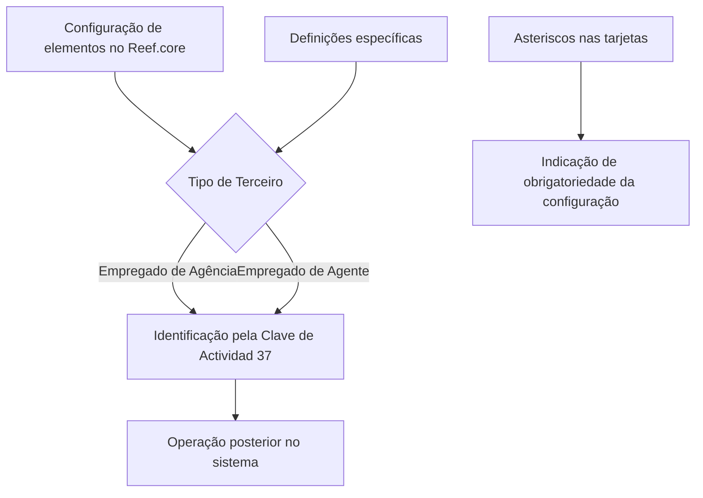

# Definição de Empregados de Agência / Agente no Reef.core

## 1. Metadados do Documento
- **Arquivo de Origem:** Não identificado
- **Tipo de Documento:** Manual Operacional / Documentação de Sistema
- **Domínio / Sistema:** Reef.core / Reef / Mapfre
- **Público-Alvo:** Operação, usuários de configuração e administradores funcionais
- **Data/Versão Identificada:** Não identificada

---

## 2. Resumo Executivo & Contexto de Negócio

O conteúdo descreve a definição de **Empregados de Agência** e **Empregados de Agente** no sistema **Reef.core**. O objetivo declarado é relacionar os elementos necessários para configurar esses terceiros e permitir sua operação posterior no sistema.

O Reef.core identifica Empregados de Agência e Empregados de Agente por meio da **Clave de Actividad 37**. Essa chave é apresentada como o identificador de atividade aplicável aos dois tipos de empregado mencionados.

O documento informa que há definições específicas utilizadas exclusivamente quando um terceiro corresponde a um Empregado de Agência ou Empregado de Agente. Entretanto, o extrato não detalha quais são essas definições, seus campos, valores permitidos, regras de validação ou etapas de configuração.

Também é informado que a presença de asteriscos nas tarjetas indica se a configuração de determinado elemento é obrigatória em relação à definição de Empregados de Agência ou Empregados de Agente. O conteúdo fornecido não apresenta as tarjetas, os elementos associados nem a lista de obrigatoriedades.

---

## 3. Arquitetura, Componentes & Tecnologias Envolvidas

Os componentes e referências identificados no conteúdo são:

| Componente / Termo | Papel identificado no conteúdo |
| :--- | :--- |
| Reef.core | Sistema no qual são configurados e posteriormente operados Empregados de Agência ou Empregados de Agente. |
| Reef | Referência ao contexto de documentação do sistema. |
| Terceiro | Entidade para a qual podem ser aplicadas definições específicas quando corresponde a Empregado de Agência ou Empregado de Agente. |
| Empregado de Agência | Tipo de empregado configurável no Reef.core e identificado pela Clave de Actividad 37. |
| Empregado de Agente | Tipo de empregado configurável no Reef.core e identificado pela Clave de Actividad 37. |
| Clave de Actividad 37 | Chave de atividade usada pelo sistema para identificar Empregados de Agência e Empregados de Agente. |
| Mapfredocument | Referência presente na navegação/documentação exibida. |
| Zeus | Referência presente na navegação/documentação exibida. |
| Cloud | Referência presente na navegação/documentação exibida. |
| APIs | Referência presente na navegação/documentação exibida. |



> **Nota de Análise:** O extrato não especifica integrações, APIs, bancos de dados, tecnologias de implementação, métodos HTTP, contratos de dados ou ambientes técnicos do Reef.core.

---

## 4. Regras de Negócio, Especificações Funcionais & Processos

1. O Reef.core deve possuir elementos configuráveis para suportar Empregados de Agência e Empregados de Agente.
2. A configuração desses elementos é necessária para que os empregados possam operar posteriormente no sistema.
3. O sistema identifica Empregados de Agência e Empregados de Agente pela **Clave de Actividad 37**.
4. Existem definições específicas aplicáveis exclusivamente quando o Terceiro é um **Empregado de Agência** ou **Empregado de Agente**.
5. Os asteriscos exibidos nas tarjetas indicam se a configuração de um elemento é obrigatória em relação à definição de Empregados de Agência ou Empregados de Agente.

### Fluxo funcional identificado

1. Identificar que o Terceiro corresponde a Empregado de Agência ou Empregado de Agente.
2. Aplicar as definições específicas destinadas a esse tipo de Terceiro.
3. Configurar os elementos necessários no Reef.core.
4. Verificar a obrigatoriedade de cada elemento conforme a indicação de asterisco nas tarjetas.
5. Associar a identificação do empregado à **Clave de Actividad 37**.
6. Permitir a operação posterior do empregado no sistema.

> **Nota de Análise:** O documento não descreve telas, campos, responsáveis, sequência de navegação, mensagens de erro, critérios de aprovação, regras de alteração ou processo de desativação de Empregados de Agência ou Empregados de Agente.

---

## 5. Tabelas de Parâmetros, Ambientes e Estruturas de Dados

| Item / Parâmetro | Descrição / Função | Tipo / Valores / Formato | Ambiente / Observações |
| :--- | :--- | :--- | :--- |
| Empregado de Agência | Tipo de Terceiro configurável no Reef.core. | Entidade funcional. | Identificado pela Clave de Actividad 37. |
| Empregado de Agente | Tipo de Terceiro configurável no Reef.core. | Entidade funcional. | Identificado pela Clave de Actividad 37. |
| Clave de Actividad | Chave usada pelo sistema para identificar os empregados mencionados. | Valor informado: `37`. | Aplicável a Empregados de Agência e Empregados de Agente. |
| Definições específicas | Definições empregadas exclusivamente quando o Terceiro é Empregado de Agência ou Empregado de Agente. | Não detalhado. | O extrato não lista as definições. |
| Asteriscos nas tarjetas | Indicador de obrigatoriedade da configuração de um elemento. | Marcador visual. | Não há lista de tarjetas ou elementos obrigatórios. |
| Reef.core | Sistema no qual ocorre a configuração e a operação posterior. | Sistema corporativo. | Sem versão, URL ou ambiente identificados. |
| Owner | Proprietário indicado na área de documentação. | `user:agonzalez_mapfre.com` | Informação exibida no conteúdo bruto. |
| Lifecycle | Estado de ciclo de vida da documentação. | `Approved Source` | Informação exibida no conteúdo bruto. |
| Idioma da interface | Idioma identificado na navegação apresentada. | `ES` | A navegação contém termos em espanhol. |

---

## 6. Bateria de Perguntas & Respostas para RAG (FAQ Sintético)

### P1: Qual sistema é usado para configurar Empregados de Agência e Empregados de Agente?
**R:** O sistema citado para configurar Empregados de Agência e Empregados de Agente é o **Reef.core**. O objetivo da configuração é permitir a operação posterior desses empregados no sistema.

### P2: Como o Reef.core identifica Empregados de Agência e Empregados de Agente?
**R:** O Reef.core identifica Empregados de Agência e Empregados de Agente pela **Clave de Actividad 37**.

### P3: Qual é a Clave de Actividad aplicável aos Empregados de Agência e Empregados de Agente?
**R:** A Clave de Actividad informada no documento é a **37**.

### P4: As definições específicas podem ser usadas para qualquer Terceiro no Reef.core?
**R:** Não. O documento declara que as definições específicas são utilizadas exclusivamente quando o Terceiro é um **Empregado de Agência** ou um **Empregado de Agente**.

### P5: O que significam os asteriscos nas tarjetas da configuração?
**R:** Os asteriscos nas tarjetas indicam se a configuração de determinado elemento é obrigatória em relação à definição de Empregados de Agência ou Empregados de Agente.

### P6: Quais elementos de configuração são obrigatórios para um Empregado de Agência?
**R:** O extrato informa que os asteriscos nas tarjetas indicam obrigatoriedade, mas não apresenta as tarjetas nem os elementos de configuração. Portanto, não é possível identificar a lista de elementos obrigatórios com base no conteúdo fornecido.

### P7: O documento descreve os campos ou telas para cadastrar um Empregado de Agente?
**R:** Não. O documento informa que existem elementos para configurar Empregados de Agência ou Empregados de Agente no Reef.core, mas não detalha campos, telas, valores permitidos ou passos operacionais da configuração.

### P8: Qual é o propósito das definições de Empregados de Agência / Agente?
**R:** O propósito é relacionar os elementos que permitem configurar no Reef.core os Empregados de Agência ou Empregados de Agente, permitindo que esses empregados operem posteriormente no sistema.

### P9: O conteúdo informa APIs ou contratos de integração do Reef.core?
**R:** Não. Embora a navegação exibida contenha uma referência a “APIs”, o extrato não descreve endpoints, métodos HTTP, autenticação, payloads, contratos JSON ou integrações técnicas.

### P10: Existe uma versão ou data identificada para a documentação?
**R:** Não. O conteúdo apresenta o estado de ciclo de vida como `Approved Source`, mas não contém data, número de versão ou histórico de revisão identificável.

---

## 7. Glossário de Termos, Siglas & Conceitos-Chave

- **Reef.core:** Sistema citado como responsável pela configuração e operação posterior de Empregados de Agência ou Empregados de Agente.
- **Reef:** Nome presente no contexto da documentação.
- **Empregado de Agência:** Tipo de Terceiro tratado por definições específicas no Reef.core.
- **Empregado de Agente:** Tipo de Terceiro tratado por definições específicas no Reef.core.
- **Terceiro:** Entidade para a qual as definições específicas se aplicam quando corresponde a Empregado de Agência ou Empregado de Agente.
- **Clave de Actividad:** Chave de atividade usada para identificar os tipos de empregado descritos; o valor informado é `37`.
- **Tarjetas:** Elementos de interface ou configuração nos quais os asteriscos indicam obrigatoriedade; o formato e o conteúdo das tarjetas não são detalhados.
- **Mapfredocument:** Termo exibido na área de documentação; o conteúdo não apresenta definição adicional.
- **Zeus:** Termo exibido na navegação; o conteúdo não apresenta definição adicional.
- **Lifecycle:** Campo de ciclo de vida da documentação, apresentado com o valor `Approved Source`.
- **Approved Source:** Estado de ciclo de vida exibido para a documentação.

---

## 8. Notas Críticas, Riscos & Limitações

- O conteúdo fornecido é um fragmento e não contém o nome do arquivo de origem, data, versão ou autoria documental completa.
- O documento não lista os elementos configuráveis necessários para Empregados de Agência ou Empregados de Agente.
- O documento não apresenta as tarjetas referenciadas nem especifica quais asteriscos representam campos obrigatórios.
- Não há detalhamento de campos, tipos de dados, valores aceitos, regras de validação, mensagens de erro ou workflow de aprovação.
- Não são informados URLs, ambientes, servidores, credenciais, permissões, integrações, contratos de API ou dependências técnicas.
- Não é possível inferir o significado expandido de termos como Reef, Zeus ou Mapfredocument sem evidência adicional no texto original.
- A única regra identificadora explícita é o uso da **Clave de Actividad 37** para Empregados de Agência e Empregados de Agente.

---

## 9. Conteúdo Bruto Estruturado (Referência Fiel)

```text
--- [PÁGINA 1 DE 1] ---

DEFINICIÓN de los EMPLEADOS de AGENTES
Se relacionan los elementos que permiten congurar en Reef.core a los Empleados de Agencia o Empleados de Agente, para poder operar
posteriormente con ellos en el Sistema.
El Sistema identica a los Empleados de Agencia o de los Agentes con la Clave de Actividad... 37.
Los Asteriscos de las Tarjetas indican si la conguración del elemento es obligatoria en relación con la denición de los Empleados de
Agencia o Empleados de Agente.
Deniciones ESPECÍFICAS, propias para los Terceros EMPLEADOS DE
AGENCIA / AGENTE
En este Grupo se encuentran deniciones que se emplean exclusivamente cuando el Tercero es un
EMPLEADO DE AGENCIA O AGENTE.
Documentation / DOCUMENTACIÓN Reef
DOCUMENTACIÓN Reef
Mapfredocument
DOCUMENTACIÓN Reef
Owner
user:agonzalez_mapfre.com
Lifecycle
Approved Source
 / 
 VL
Buscar Inicio Soluciones Arquitecturas APIs Componentes Cloud Documentación Zeus Reef Ayuda
ES
```
