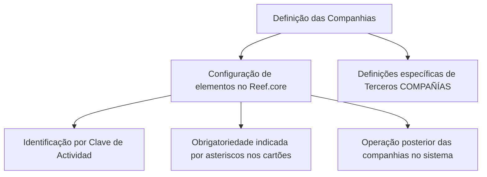

# Definição das Companhias no Reef.core

## 1. Metadados do Documento
- **Arquivo de Origem:** Não identificado
- **Tipo de Documento:** Manual Operacional
- **Domínio / Sistema:** Reef.core / Mapfre
- **Público-Alvo:** Operação, Negócio e equipes responsáveis pela configuração de companhias
- **Data/Versão Identificada:** Não identificada

---

## 2. Resumo Executivo & Contexto de Negócio

O conteúdo descreve a definição de companhias no sistema Reef.core. O objetivo é relacionar os elementos necessários para configurar companhias e permitir sua operação posterior no sistema.

O Reef.core identifica as companhias do sistema por meio da **Clave de Actividad**. O texto também estabelece que os asteriscos presentes nos cartões indicam a obrigatoriedade da configuração de cada elemento em relação à definição das companhias.

Há definições específicas destinadas exclusivamente aos terceiros classificados como companhias. O material está associado à documentação Reef, identificada como aprovada e atribuída ao usuário `agonzalez_mapfre.com`.

O trecho disponível não detalha telas, campos específicos, valores permitidos, sequência operacional completa, contratos de integração ou regras de validação adicionais.

---

## 3. Arquitetura, Componentes & Tecnologias Envolvidas

Os elementos explicitamente citados são:

- **Reef.core:** Sistema no qual as companhias são configuradas e posteriormente operadas.
- **Companhias:** Entidades do sistema identificadas pela Clave de Actividad.
- **Terceros COMPAÑÍAS:** Grupo que possui definições específicas aplicáveis exclusivamente quando o terceiro é uma companhia.
- **Documentación Reef / Mapfredocument:** Repositório ou contexto documental mencionado no conteúdo.
- **Owner:** Usuário identificado como `agonzalez_mapfre.com`.
- **Lifecycle:** Estado documental indicado como `Approved`.



> **Nota de Análise:** O conteúdo não descreve arquitetura técnica de infraestrutura, APIs, bancos de dados, integrações, métodos HTTP ou tecnologias de implementação.

---

## 4. Regras de Negócio, Especificações Funcionais & Processos

1. A configuração das companhias no Reef.core depende da relação de elementos apresentados no documento.
2. Após a configuração, as companhias podem operar no sistema.
3. O Reef.core identifica as companhias por meio da **Clave de Actividad**.
4. A presença de asterisco nos cartões indica que o elemento correspondente é obrigatório na configuração relacionada à definição de companhias.
5. As definições classificadas como específicas de **Terceros COMPAÑÍAS** devem ser utilizadas exclusivamente quando o terceiro for uma companhia.

> **Nota de Análise:** O conteúdo disponível não especifica a composição da Clave de Actividad, os campos dos cartões, os critérios de validação, a ordem de preenchimento ou o tratamento de erros.

---

## 5. Tabelas de Parâmetros, Ambientes e Estruturas de Dados

| Item / Parâmetro | Descrição / Função | Tipo / Valores / Formato | Ambiente / Observações |
| :--- | :--- | :--- | :--- |
| Reef.core | Sistema utilizado para configuração e operação das companhias | Sistema | Domínio Reef |
| Compañías | Entidades configuradas para operação posterior no sistema | Entidade de negócio | Identificadas por Clave de Actividad |
| Clave de Actividad | Elemento pelo qual o Reef.core identifica as companhias | Chave de identificação | Estrutura e valores não detalhados |
| Asteriscos das Tarjetas | Indicam obrigatoriedade de configuração do elemento | Indicador visual | Aplicável à definição de companhias |
| Terceros COMPAÑÍAS | Grupo de definições de uso exclusivo quando o terceiro é uma companhia | Grupo funcional | Detalhes dos elementos não informados |
| Documentation / DOCUMENTACIÓN Reef | Referência documental do conteúdo | Documentação | Associada a Mapfredocument |
| Owner | Responsável identificado no conteúdo | Usuário | `agonzalez_mapfre.com` |
| Lifecycle | Estado de ciclo de vida da documentação | Estado | `Approved` |
| Source | Informação de origem exibida | Campo documental | `VL` |

---

## 6. Bateria de Perguntas & Respostas para RAG (FAQ Sintético)

### P1: Qual é o objetivo da definição de companhias no Reef.core?
**R:** O objetivo é relacionar os elementos necessários para configurar companhias no Reef.core, permitindo que essas companhias operem posteriormente no sistema.

### P2: Como o Reef.core identifica as companhias do sistema?
**R:** O Reef.core identifica as companhias por meio da **Clave de Actividad**. O conteúdo não detalha a estrutura, os valores ou as regras de preenchimento dessa chave.

### P3: O que significam os asteriscos exibidos nos cartões de configuração?
**R:** Os asteriscos indicam que a configuração do elemento correspondente é obrigatória em relação à definição das companhias.

### P4: Quando as definições específicas de Terceros COMPAÑÍAS devem ser utilizadas?
**R:** As definições específicas de Terceros COMPAÑÍAS devem ser utilizadas exclusivamente quando o terceiro for uma companhia.

### P5: O documento descreve quais elementos devem ser configurados para uma companhia?
**R:** O trecho afirma que existem elementos para configurar companhias, mas não apresenta a lista desses elementos, seus campos ou valores permitidos.

### P6: O documento apresenta APIs ou contratos de integração para o Reef.core?
**R:** Não. O conteúdo disponível não descreve APIs, endpoints, métodos HTTP, contratos JSON, integrações ou tecnologias de implementação.

### P7: O que acontece após a configuração de uma companhia no Reef.core?
**R:** Segundo o documento, a companhia pode operar posteriormente no sistema após sua configuração.

### P8: Quem é identificado como responsável pela documentação Reef?
**R:** O conteúdo identifica `agonzalez_mapfre.com` como **Owner** da documentação.

### P9: Qual é o estado de ciclo de vida da documentação apresentada?
**R:** O campo **Lifecycle** está identificado como `Approved`.

### P10: O documento especifica como validar uma Clave de Actividad?
**R:** Não. O documento apenas informa que a Clave de Actividad identifica as companhias no Reef.core, sem detalhar regras de validação.

---

## 7. Glossário de Termos, Siglas & Conceitos-Chave

- **Reef.core:** Sistema citado para configuração e operação de companhias.
- **Compañías:** Companhias configuradas no Reef.core.
- **Clave de Actividad:** Chave utilizada pelo Reef.core para identificar companhias.
- **Tarjetas:** Cartões nos quais asteriscos indicam obrigatoriedade de configuração.
- **Terceros COMPAÑÍAS:** Grupo de definições aplicável exclusivamente quando o terceiro é uma companhia.
- **Owner:** Campo que identifica o responsável pela documentação.
- **Lifecycle:** Campo que identifica o estado de ciclo de vida da documentação.
- **Approved:** Estado de ciclo de vida apresentado para a documentação.
- **Mapfredocument:** Termo citado no contexto da documentação Reef.
- **VL:** Valor exibido no campo Source.

---

## 8. Notas Críticas, Riscos & Limitações

- O arquivo de origem, a data e a versão do documento não foram identificados no conteúdo fornecido.
- O texto não lista os elementos necessários para configurar uma companhia.
- A estrutura e as regras de validação da Clave de Actividad não foram detalhadas.
- Não há especificação dos cartões, campos, tipos de dados, valores aceitos ou mensagens de erro.
- Não foram identificadas informações sobre ambientes, URLs, servidores, logs, APIs, integrações ou dependências técnicas.
- O trecho apresenta conteúdo predominantemente conceitual; não há detalhamento operacional suficiente para executar uma configuração ponta a ponta sem documentação complementar.

---

## 9. Conteúdo Bruto Estruturado (Referência Fiel)

```text
--- [PÁGINA 1 DE 1] ---

DEFINICIÓN de las COMPAÑÍAS
Se relacionan los elementos que permiten congurar en Reef.core a las Compañías, para poder operar posteriormente con ellas en el
Sistema.
Reef.core identica a las Compañías del Sistema con la Clave de Actividad... 39.
Los Asteriscos de las Tarjetas indican la obligatoriedad en la conguración del Elemento en relación con la denición de las Compañías.
Deniciones ESPECÍFICAS, propias de los Terceros COMPAÑÍAS
En este Grupo se encuentran deniciones que se emplean exclusivamente cuando el Tercero es una
COMPAÑÍA.
Documentation / DOCUMENTACIÓN Reef
DOCUMENTACIÓN Reef
Mapfredocument
DOCUMENTACIÓN Reef
Owner
user:agonzalez_mapfre.com
Lifecycle
Approved Source
 / 
 VL
Buscar Inicio Soluciones Arquitecturas APIs Componentes Cloud Documentación Zeus Reef Ayuda
ES
```
