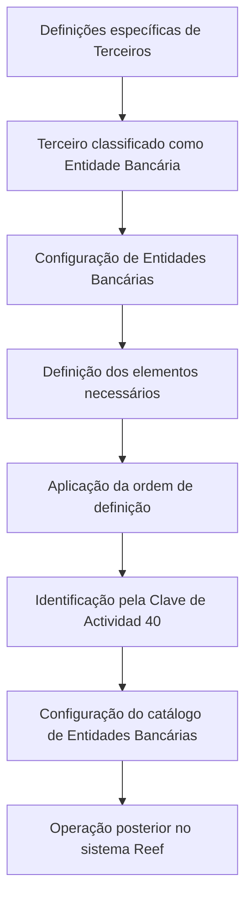
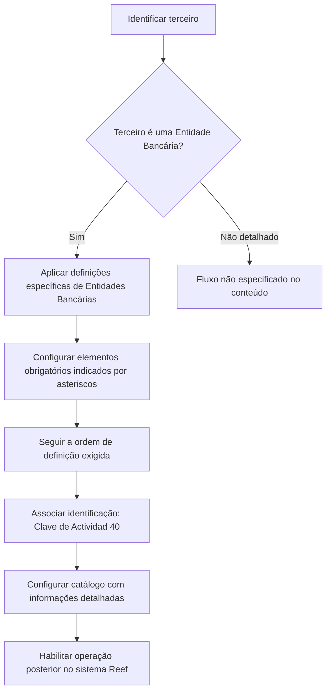

# Definição de Entidades Bancárias no Sistema Reef

## 1. Metadados do Documento
- **Arquivo de Origem:** Não identificado
- **Tipo de Documento:** Documentação funcional
- **Domínio / Sistema:** Reef / Entidades Bancárias
- **Público-Alvo:** Operação, negócio e equipes responsáveis pela configuração de entidades bancárias
- **Data/Versão Identificada:** Não identificada

---

## 2. Resumo Executivo & Contexto de Negócio

O documento descreve a definição e a configuração de entidades bancárias no sistema Reef. O foco é identificar os elementos envolvidos nessa configuração e estabelecer a ordem necessária para que as entidades bancárias possam operar posteriormente no sistema.

O sistema identifica entidades bancárias por meio da **Clave de Actividad 40**. O documento também informa que cartões ou telas de configuração utilizam asteriscos para indicar a obrigatoriedade de cada elemento em relação à definição de entidades bancárias.

A documentação separa definições específicas aplicáveis exclusivamente quando o terceiro cadastrado é uma entidade bancária. Também menciona a configuração de um catálogo de entidades bancárias, com detalhamento das informações dessas entidades.

O conteúdo fornecido não detalha campos de cadastro, telas, regras de validação, integrações, métodos HTTP, contratos de dados ou procedimentos operacionais completos.

---

## 3. Arquitetura, Componentes & Tecnologias Envolvidas

Os componentes e conceitos explicitamente citados são:

- **Sistema Reef:** sistema no qual entidades bancárias são definidas e configuradas.
- **Entidades Bancárias:** tipo de terceiro para o qual existem definições específicas.
- **Clave de Actividad 40:** chave pela qual o sistema identifica entidades bancárias.
- **Catálogo de Entidades Bancárias:** estrutura configurada para detalhar informações das entidades.
- **Documentación Reef / Mapfredocument:** referências de navegação ou repositório documental exibidas no conteúdo.
- **Owner:** `user:agonzalez_mapfre.com`
- **Lifecycle:** `Approved`
- **Source:** `VL`



> **Nota de Análise:** O conteúdo não apresenta detalhes técnicos sobre arquitetura de software, bancos de dados, APIs, servidores, ambientes, tecnologias de implementação ou integrações externas.

---

## 4. Regras de Negócio, Especificações Funcionais & Processos

1. A configuração das entidades bancárias exige a definição de elementos que intervêm nessa configuração.
2. Existe uma ordem de definição que deve ser seguida para permitir a operação posterior das entidades bancárias no sistema.
3. O sistema identifica entidades bancárias pela **Clave de Actividad 40**.
4. Asteriscos apresentados nos cartões ou telas indicam a obrigatoriedade de um elemento na configuração relacionada à definição de entidades bancárias.
5. Existem definições específicas que devem ser usadas exclusivamente quando o terceiro é uma entidade bancária.
6. O catálogo de entidades bancárias deve conter informação detalhada sobre essas entidades.

### Fluxo funcional identificado



> **Nota de Análise:** O documento não especifica quais são os elementos configuráveis, qual é a ordem concreta de configuração, quais dados compõem o catálogo ou quais consequências ocorrem quando um campo obrigatório não é preenchido.

---

## 5. Tabelas de Parâmetros, Ambientes e Estruturas de Dados

| Item / Parâmetro | Descrição / Função | Tipo / Valores / Formato | Ambiente / Observações |
| :--- | :--- | :--- | :--- |
| Entidades Bancárias | Entidades configuradas para operação no sistema Reef. | Tipo de terceiro. | Requer definição prévia de elementos e ordem de configuração. |
| Clave de Actividad | Chave usada pelo sistema para identificar entidades bancárias. | Valor informado: `40`. | Associada à identificação de entidades bancárias. |
| Asteriscos de cartões | Indicam a obrigatoriedade de elementos de configuração. | Indicador visual de obrigatoriedade. | O conteúdo não informa os campos específicos marcados. |
| Definições específicas | Definições aplicáveis exclusivamente quando o terceiro é uma entidade bancária. | Grupo de definições. | Sem detalhamento dos parâmetros internos. |
| Catálogo de Entidades Bancárias | Estrutura para configurar e detalhar informações das entidades bancárias. | Catálogo. | Campos e formato não identificados. |
| Sistema | Plataforma que realiza a identificação e operação posterior das entidades. | `Reef`. | Referido também como “Sistema”. |
| Owner | Proprietário indicado na documentação. | `user:agonzalez_mapfre.com` | Metadado documental. |
| Lifecycle | Estado do ciclo de vida documental. | `Approved` | Metadado documental. |
| Source | Origem indicada no conteúdo. | `VL` | Metadado documental. |
| Idioma da interface | Idioma exibido na navegação da documentação. | `ES` | Interface ou portal documental em espanhol. |

---

## 6. Bateria de Perguntas & Respostas para RAG (FAQ Sintético)

### P1: Como o sistema Reef identifica uma entidade bancária?
**R:** O sistema Reef identifica entidades bancárias por meio da **Clave de Actividad 40**.

### P2: Qual é a condição para operar entidades bancárias no sistema?
**R:** A configuração das entidades bancárias deve ser realizada previamente, respeitando os elementos envolvidos e a ordem de definição indicada pelo documento. O conteúdo não informa a sequência concreta desses elementos.

### P3: O que significam os asteriscos nas telas ou cartões de configuração?
**R:** Os asteriscos indicam a obrigatoriedade de um elemento na configuração relacionada à definição de entidades bancárias.

### P4: Quando devem ser usadas as definições específicas de entidades bancárias?
**R:** As definições específicas devem ser utilizadas exclusivamente quando o terceiro é classificado como uma entidade bancária.

### P5: Qual é a finalidade do catálogo de entidades bancárias?
**R:** O catálogo de entidades bancárias é configurado para detalhar as informações das entidades bancárias. O documento não informa quais atributos ou campos fazem parte desse catálogo.

### P6: Quais campos obrigatórios devem ser preenchidos no cadastro de uma entidade bancária?
**R:** O conteúdo afirma que asteriscos indicam elementos obrigatórios, mas não identifica os nomes dos campos ou elementos que possuem essa marcação.

### P7: O documento define APIs, contratos JSON ou métodos HTTP para entidades bancárias?
**R:** Não. O conteúdo fornecido não apresenta APIs, métodos HTTP, contratos JSON, integrações ou especificações técnicas de interfaces.

### P8: Qual sistema é mencionado como responsável pela operação das entidades bancárias?
**R:** O sistema mencionado é o **Reef**, também referido genericamente como “Sistema” no texto extraído.

### P9: A ordem de configuração das entidades bancárias está detalhada?
**R:** Não. O documento informa que existe uma ordem que deve ser seguida para permitir a operação posterior, mas não apresenta a sequência detalhada.

### P10: Quem é o proprietário indicado nos metadados da documentação?
**R:** O proprietário indicado é `user:agonzalez_mapfre.com`.

---

## 7. Glossário de Termos, Siglas & Conceitos-Chave

- **Reef:** Sistema mencionado como responsável pela identificação e operação de entidades bancárias.
- **Entidades Bancárias:** Tipo de terceiro que possui definições específicas no sistema.
- **Tercero:** Termo usado para representar uma entidade cadastrada; no contexto do documento, pode ser uma entidade bancária.
- **Clave de Actividad:** Chave de atividade usada para identificar entidades bancárias; o valor informado é `40`.
- **Catálogo de Entidades Bancárias:** Estrutura de configuração destinada a detalhar informações de entidades bancárias.
- **Lifecycle:** Metadado documental que indica o estado do ciclo de vida do documento; o valor exibido é `Approved`.
- **Owner:** Metadado que identifica o proprietário da documentação.
- **Source:** Metadado de origem exibido com o valor `VL`.
- **Mapfredocument:** Referência apresentada na navegação ou identificação do portal documental; sem definição adicional no conteúdo.

---

## 8. Notas Críticas, Riscos & Limitações

- O texto fornecido aparenta ser uma extração parcial de documentação e contém caracteres corrompidos, como `Conguración`, `denición` e `identica`.
- Não foram identificados nome de arquivo, data, versão, autoria formal ou paginação documental confiável.
- A ordem de configuração das entidades bancárias é mencionada, mas não é detalhada.
- O catálogo de entidades bancárias é citado sem campos, regras de preenchimento, estrutura de dados ou exemplos.
- Não há descrição de validações, mensagens de erro, permissões, integrações, URLs, ambientes, servidores, logs ou requisitos de auditoria.
- Não há detalhamento sobre o significado completo de `VL`, `Mapfredocument`, `Documentación Reef` ou a relação entre esses elementos.
- A classificação de “Tipo de Documento” foi inferida como documentação funcional com base no conteúdo; essa classificação não está explicitamente declarada no texto.

---

## 9. Conteúdo Bruto Estruturado (Referência Fiel)

```text
--- [PÁGINA 1 DE 1] ---

DEFINICIÓN de las ENTIDADES BANCARIAS
Elementos que intervienen en la Conguración de las Entidades Bancarias, así como el orden en el que esta denición se debe realizar para
poder operar posteriormente con ellas en el Sistema.
El Sistema identica a las Entidades Bancarias con la Clave de Actividad... 40.
Los Asteriscos de las Tarjetas indican la obligatoriedad en la conguración del Elemento en relación con la denición de las Entidades
Bancarias.
DEFINICIONES ESPECÍFICAS, propias de los Terceros ENTIDADES
BANCARIAS
En este Grupo se encuentran deniciones que se utilizan exclusivamente cuando el Tercero es una ENTIDAD
BANCARIA.
INFORMACIÓN ENTIDADES BANCARIAS
Conguración del catálogo de Entidades Bancarias detallando la información de estas.
Documentation / DOCUMENTACIÓN Reef
DOCUMENTACIÓN Reef
Mapfredocument
DOCUMENTACIÓN Reef
Owner
user:agonzalez_mapfre.com
Lifecycle
Approved Source
 / 
 VL
Buscar Inicio Soluciones Arquitecturas APIs Componentes Cloud Documentación Zeus Reef Ayuda
ES
```
