# Definição e Configuração de Entidades Bancárias no Sistema MAPFRE

## 1. Metadados do Documento
- **Arquivo de Origem:** Não identificado no conteúdo extraído
- **Tipo de Documento:** Especificação Técnica / Manual Funcional
- **Domínio / Sistema:** Reef / MAPFRE / Modelo de Informação de Terceiros
- **Público-Alvo:** Desenvolvedores, Arquitetos, Operação, Tecnologia Local e Negócio
- **Data/Versão Identificada:** Não identificada

---

## 2. Resumo Executivo & Contexto de Negócio

O documento descreve a definição funcional do catálogo de **Entidades Bancárias** no sistema MAPFRE, inserido no Modelo de Informação de Terceiros. O catálogo permite codificar e manter múltiplas entidades bancárias em um repositório de informação específico, inicialmente entregue sem conteúdo às instalações.

Uma entidade bancária é caracterizada por dados identificativos, dados de contato, propriedades operativas e outras propriedades. A especificação estabelece atributos para identificação da instituição, sua localização geográfica, contatos corporativos, classificação bancária, dados de domiciliamento, código SWIFT/BIC e indicadores operacionais.

A configuração local possui papel relevante. O Departamento de Tecnologia Local deve identificar e configurar nos catálogos do sistema — Listas de Valores — os valores adequados para determinados atributos, como Tipo de Domicílio e Tipo de Entidade. O documento afirma que valores previamente definidos pelo núcleo podem não corresponder aos usos comuns de cada país, e que alguns atributos não possuem valores prefixados pelo núcleo.

O modelo também impõe regras de identificação. As entidades bancárias utilizam a atividade de terceiro de código constante `40`, que não pode ser modificada. Quando a atividade 40 não possuir documentos identificativos associados, o tipo de documento identificativo atribuído na captura inicial da entidade bancária será obtido da configuração de parâmetros da instalação.

---

## 3. Arquitetura, Componentes & Tecnologias Envolvidas

Os componentes e conceitos explicitamente citados são:

- **Sistema MAPFRE:** Sistema no qual as entidades bancárias são identificadas, configuradas e associadas a operações.
- **Modelo de Informação de Terceiros:** Modelo que identifica entidades bancárias por atividade, documento identificativo e chave associada.
- **Catálogo de Entidades Bancárias:** Repositório específico para codificação de múltiplas entidades bancárias.
- **Atividades de Terceiros:** Documento funcional relacionado e referência para a atividade constante `40`.
- **Documentos Identificadores:** Documento funcional relacionado ao tipo e à chave de documento identificativo.
- **Estrutura Geográfica:** Referência para os níveis geográficos usados na localização e nacionalidade.
- **Listas de Valores:** Catálogos do sistema configurados localmente para atributos como Tipo de Domicílio e Tipo de Entidade.
- **Configuração dos Parâmetros Iniciais:** Referência para a determinação do tipo de documento identificativo na captura inicial.
- **REEF / Documentación Reef:** Ambiente ou repositório documental citado na extração.
- **SWIFT / BIC:** Código internacional utilizado para identificação do banco receptor em transferências internacionais, conforme condição de uso descrita.

```mermaid
graph TD
    A[Catálogo de Entidades Bancárias] --> B[Dados Identificativos]
    A --> C[Dados de Contato]
    A --> D[Propriedades Operativas]
    A --> E[Outras Propriedades]

    B --> B1[Companhia]
    B --> B2[Atividade de Terceiro: constante 40]
    B --> B3[Tipo de Documento Identificativo]
    B --> B4[Chave do Documento Identificativo]
    B --> B5[Chave da Entidade Bancária]
    B --> B6[Nome e Abreviatura]

    C --> C1[Estrutura Geográfica]
    C --> C2[Endereço e Código Postal]
    C --> C3[Correio Eletrônico]
    C --> C4[Telefone, Fax e Extensão]

    D --> D1[Tipo de Entidade]
    D --> D2[Tipo de Instituição Bancária]
    D --> D3[Tipo de Empresa Jurídica]
    D --> D4[Tipo de Domiciliação Bancária]
    D --> D5[SWIFT / BIC]
    D --> D6[Nacionalidade e Referências]

    E --> E1[Inabilitação]

    F[Configuração de Parâmetros da Instalação] --> B3
    G[Listas de Valores Locais] --> C1
    G --> C2
    G --> D1
```



> **Nota de Análise:** O documento descreve atributos funcionais e regras de configuração, mas não detalha interfaces, métodos HTTP, contratos JSON, base de dados, tecnologias de implementação, fluxos de integração ou ambientes técnicos de execução.

---

## 4. Regras de Negócio, Especificações Funcionais & Processos

### 4.1. Repositório de Entidades Bancárias

- O núcleo do sistema permite codificar múltiplas entidades bancárias.
- As entidades bancárias são armazenadas em um repositório de informação específico.
- O repositório é entregue inicialmente vazio às instalações.
- A finalidade do catálogo é identificar os bancos que operam localmente com a entidade MAPFRE.

### 4.2. Regra de Atividade de Terceiro

- A entidade bancária deve possuir um código de atividade de terceiro.
- A atividade de terceiro aplicada às entidades bancárias é a constante `40`.
- A constante `40` corresponde a uma das atividades pertencentes ao núcleo.
- O valor da atividade `40` não pode ser modificado.

### 4.3. Regras de Identificação Documental

- A entidade bancária deve ser identificada no Modelo de Informação de Terceiros por:
  - código de atividade próprio;
  - tipo de documento identificativo;
  - chave associada ao documento identificativo.
- O Tipo de Documento Identificativo possui valor `THP` quando a entidade bancária não possui documentos identificativos próprios associados.
- A Chave do Documento Identificador contém o código associado ao tipo de documento identificativo.
- Exemplo apresentado: o Banco de Santander é identificado em Espanha pelo Tipo de Documento `NIF`, com chave `A-39000013`.

### 4.4. Regra para Captura Inicial

- Quando a atividade `40` atribuída às entidades bancárias não possuir nenhum tipo de documento identificativo associado:
  - o sistema atribui ao atributo **Tipo de Documento Identificativo**, na captura inicial da entidade bancária;
  - o valor definido na configuração dos parâmetros da instalação.

### 4.5. Regras de Localização e Contato

- A localização geográfica pode ser composta por primeiro, segundo, terceiro e quarto níveis da estrutura geográfica.
- O quarto nível geográfico pode conter informação complementar quando o país não possuir tal nível de detalhe.
- O quarto nível e seu nome podem ser registrados em forma vernácula, ou seja, conforme a nomenclatura própria do local ou país.
- O Tipo de Domicílio deve refletir a tipologia utilizada localmente pela seguradora.
- O Departamento de Tecnologia Local deve identificar os valores adequados nas Listas de Valores do sistema.
- Os valores de Tipo de Domicílio possuem uso transversal na aplicação, não sendo exclusivos da configuração de entidades bancárias.
- O endereço permite registrar a descrição do domicílio, sua localização geográfica, tipologia e informações complementares para facilitar a localização.
- Os números telefônicos corporativos podem possuir prefixo telefônico de país, prefixo zonal e extensão.
- Exemplos fornecidos:
  - Espanha: prefixo internacional `+34`;
  - México: prefixo internacional `+52`;
  - Argentina: prefixo internacional `+54`;
  - Madrid: prefixo zonal `91`;
  - Barcelona: prefixo zonal `93`;
  - Monterrey, Nuevo León: Clave Lada local `81`;
  - Cidade do México: Clave Lada local `55`.

### 4.6. Regras de Classificação Operativa

- O Tipo de Entidade deve refletir a classificação da entidade bancária conforme o uso e a exploração local pretendidos pela seguradora.
- Não existem valores prefixados pelo núcleo para Tipo de Entidade.
- O Departamento de Tecnologia Local deve definir os valores aplicáveis nas Listas de Valores do sistema.
- O Tipo de Instituição Bancária permite classificar instituições conforme necessidades locais, inclusive para exploração agregada da informação sobre os bancos utilizados pelos clientes.
- O Tipo de Empresa Jurídica identifica a natureza jurídica da entidade bancária.
- O Tipo de Domiciliação Bancária deve refletir o processo de domiciliamento acordado comercialmente entre a entidade MAPFRE local e a entidade bancária.

### 4.7. Regras de Domiciliação Bancária

Os valores explicitamente definidos para Tipo de Domiciliação Bancária são:

1. Domiciliação com contas bancárias.
2. Domiciliação com cartões.
3. Domiciliação indistintamente com cartões e/ou contas bancárias.

### 4.8. Regras de SWIFT / BIC

- A Chave SWIFT corresponde ao código SWIFT, sigla de **Society for Worldwide Interbank Financial Telecommunication**.
- O código SWIFT também é denominado código BIC, sigla de **Bank Identifier Code**.
- O código SWIFT/BIC é uma sequência alfanumérica de 8 ou 11 dígitos.
- O objetivo do código SWIFT/BIC é identificar o banco receptor de uma transferência internacional.
- Conforme o documento, o código SWIFT/BIC aplica-se apenas a países que não pertencem à Zona SEPA.
- O documento descreve a Zona SEPA como abrangendo:
  - os 28 países da União Europeia;
  - Liechtenstein;
  - Islândia;
  - Noruega;
  - Andorra;
  - Mónaco;
  - San Marino;
  - Suíça;
  - Reino Unido;
  - Cidade do Vaticano Estado.

### 4.9. Regras de Continuidade e Operação

- O Código de Entidade Nova identifica a entidade bancária compradora quando ocorreu um processo de concentração bancária em que uma entidade absorveu outra ou outras entidades bancárias.
- O Número de Dias Extra registra a quantidade de dias considerada pela entidade bancária para conformar a **FECHA VALOR** nas operações financeiras.
- A propriedade Inabilitação impede que uma entidade bancária seja utilizada e associada em operações de captura e/ou modificação de terceiros físicos e/ou jurídicos.

---

## 5. Tabelas de Parâmetros, Ambientes e Estruturas de Dados

| Item / Parâmetro | Descrição / Função | Tipo / Valores / Formato | Ambiente / Observações |
| :--- | :--- | :--- | :--- |
| Companhia | Código da companhia para a qual está sendo definida a entidade bancária | Código não detalhado | Dados Identificativos |
| Código de Atividade do Terceiro | Código da atividade de terceiro associada a entidades bancárias | Constante `40` | Não pode ser modificado |
| Tipo de Documento Identificativo | Tipo de documento utilizado para identificar a entidade bancária | `THP` quando não houver documentos próprios associados | Na captura inicial, pode ser definido pelos parâmetros da instalação quando a atividade 40 não tiver documento associado |
| Chave do Documento Identificador | Código associado ao tipo de documento identificativo | Código não detalhado | Exemplo: NIF `A-39000013` para Banco de Santander em Espanha |
| Chave Entidade Bancária | Chave usada para identificar bancos que operam localmente com MAPFRE | Chave não detalhada | Dados Identificativos |
| Nome Entidade Bancária | Nome pelo qual a entidade bancária é identificada no sistema | Texto | Dados Identificativos |
| Abreviatura Entidade Bancária | Nome abreviado para identificação da entidade bancária | Texto | Dados Identificativos |
| Primeiro Nível da Estrutura Geográfica | Chave do primeiro nível geográfico da entidade bancária | Chave geográfica | Dados de Contato |
| Segundo Nível da Estrutura Geográfica | Chave do segundo nível geográfico | Chave geográfica | Dados de Contato |
| Terceiro Nível da Estrutura Geográfica | Chave do terceiro nível geográfico | Chave geográfica | Dados de Contato |
| Quarto Nível da Estrutura Geográfica | Chave do quarto nível geográfico | Chave geográfica | Pode não existir em todos os países |
| Nome do Quarto Nível da Estrutura Geográfica | Informação correspondente ao quarto nível geográfico | Texto | Pode armazenar informação complementar |
| Quarto Nível Vernáculo da Estrutura Geográfica | Chave do quarto nível conforme denominação própria local | Chave geográfica | Relacionado à forma local ou vernacular |
| Nome Vernáculo do Quarto Nível | Nome do quarto nível geográfico em língua vernácula | Texto | Dados de Contato |
| Tipo de Domicílio | Tipologia de endereço da entidade bancária | Exemplos: Calle, Avenida, Cerrada, Carretera, Paseo | Valores devem ser identificados localmente nas Listas de Valores |
| Domicílio | Descrição do endereço e informações complementares de localização | Texto | Considera localização geográfica e tipologia do domicílio |
| Código Postal | Chave do código postal da localização da entidade bancária | Chave não detalhada | Dados de Contato |
| Apartado Postal | Chave da caixa postal da entidade bancária | Chave não detalhada | Geralmente associada a uma oficina de correios |
| Direção de Correio Eletrônico | Endereço corporativo de e-mail da entidade bancária | Endereço de e-mail | Dados de Contato |
| Prefixo Telefónico do País | Prefixo internacional do telefone corporativo | Exemplos: Espanha `+34`, México `+52`, Argentina `+54` | Dados de Contato |
| Prefixo Zonal Telefónico | Prefixo local/regional do telefone corporativo | Exemplos: Madrid `91`, Barcelona `93`, Monterrey `81`, Cidade do México `55` | Dados de Contato |
| Número Fax | Número de fax corporativo | Número telefônico | Dados de Contato |
| Número Telefónico | Número de telefone corporativo | Número telefônico | Dados de Contato |
| Extensão Telefónica | Extensão do telefone corporativo, quando necessária | Número ou código não detalhado | Dados de Contato |
| Tipo de Entidade | Classificação da entidade bancária | Exemplos: bancos, caixas de poupança, cooperativas de crédito, entidades de dinheiro eletrônico, entidades de pagamento, estabelecimentos financeiros de crédito, compra e venda de moeda estrangeira, sucursais estrangeiras e intermediação financeira | Não há valores prefixados pelo núcleo; Tecnologia Local deve configurar Listas de Valores |
| Tipo de Instituição Bancária | Classificação bancária para uso e exploração local | Exemplos: bancos minoristas, comerciais, comunitários, de investimento, bancos on-line/neobancos, cooperativas de crédito, associações de poupança e empréstimo | Propriedades Operativas |
| Tipo de Empresa Jurídica | Tipo de empresa jurídica da entidade bancária | Valores não detalhados | Propriedades Operativas |
| Tipo de Domiciliação Bancária | Tipologia de domiciliamento bancário conforme acordo comercial | Contas bancárias; cartões; cartões e/ou contas bancárias | Propriedades Operativas |
| Data de Constituição | Data de constituição legal da entidade bancária no país de operação | Data | Propriedades Operativas |
| Chave SWIFT / BIC | Código do banco receptor de transferência internacional | Sequência alfanumérica de 8 ou 11 dígitos | Aplicável, conforme documento, somente a países fora da Zona SEPA |
| Nacionalidade | Chave do primeiro nível geográfico correspondente ao país de procedência | Chave geográfica | Propriedades Operativas |
| Código de Referência | Chave de referência da entidade bancária | Código não detalhado | Propriedades Operativas |
| Código de Entidade Nova | Código da entidade compradora após concentração bancária | Código não detalhado | Aplicável quando uma entidade absorve outra ou outras |
| Número de Dias Extra | Dias adicionais para composição da FECHA VALOR | Número de dias | Propriedades Operativas |
| Inabilitação | Indica que a entidade não pode ser utilizada ou associada | Indicador não detalhado | Impede uso em captura e/ou modificação de terceiros físicos e jurídicos |

---

## 6. Bateria de Perguntas & Respostas para RAG (FAQ Sintético)

### P1: Qual é o código de atividade de terceiro obrigatório para entidades bancárias no sistema?
**R:** O código de atividade de terceiro das entidades bancárias é a constante `40`. O documento determina que a atividade 40 pertence ao núcleo do sistema e, por esse motivo, não pode ser modificada.

### P2: Quando o Tipo de Documento Identificativo deve receber o valor THP?
**R:** O Tipo de Documento Identificativo recebe o valor `THP` quando a entidade bancária não possui documentos identificativos próprios associados.

### P3: Como o sistema determina o Tipo de Documento Identificativo na captura inicial de uma entidade bancária?
**R:** Quando a atividade 40 atribuída às entidades bancárias não possui nenhum documento identificativo associado, o sistema atribui, na captura inicial, o valor definido na configuração dos parâmetros da instalação.

### P4: Quais são os valores permitidos explicitamente para o Tipo de Domiciliação Bancária?
**R:** O documento lista três valores: domiciliamento com contas bancárias; domiciliamento com cartões; e domiciliamento indistintamente com cartões e/ou contas bancárias.

### P5: Quem deve definir os valores locais para Tipo de Domicílio e Tipo de Entidade?
**R:** O Departamento de Tecnologia Local deve identificar os valores adequados nos catálogos do sistema que representam as Listas de Valores. Para Tipo de Entidade, o documento informa que não existem valores prefixados pelo núcleo. Para Tipo de Domicílio, os valores do núcleo podem não corresponder ao uso comum de cada país.

### P6: Para que serve a Chave SWIFT ou BIC de uma entidade bancária?
**R:** A Chave SWIFT, também denominada BIC, identifica o banco receptor de uma transferência internacional. O documento define o SWIFT/BIC como uma sequência alfanumérica de 8 ou 11 dígitos.

### P7: Em quais situações o documento determina a aplicação do código SWIFT/BIC?
**R:** Conforme o documento, o código SWIFT/BIC aplica-se unicamente aos países que não pertencem à Zona SEPA. A Zona SEPA é descrita como abrangendo os 28 países da União Europeia e também Liechtenstein, Islândia, Noruega, Andorra, Mónaco, San Marino, Suíça, Reino Unido e Cidade do Vaticano Estado.

### P8: O que representa o Código de Entidade Nova?
**R:** O Código de Entidade Nova contém o código da entidade bancária compradora quando houve um processo de concentração bancária e uma entidade absorveu uma ou outras entidades bancárias.

### P9: Qual é a finalidade da propriedade Inabilitação?
**R:** A propriedade Inabilitação indica que a entidade bancária está inabilitada para uso no sistema. Uma entidade inabilitada não pode ser utilizada nem associada às operações de captura e/ou modificação de terceiros físicos e/ou jurídicos.

### P10: Quais informações de contato corporativo podem ser registradas para uma entidade bancária?
**R:** O catálogo permite registrar endereço, código postal, apartado postal, endereço de correio eletrônico corporativo, prefixo telefônico do país, prefixo zonal telefônico, número de fax, número de telefone e extensão telefônica.

### P11: Qual é a finalidade do Número de Dias Extra?
**R:** O Número de Dias Extra contém a quantidade de dias que a entidade bancária considera para conformar a **FECHA VALOR** em suas operações financeiras.

### P12: Quais documentos funcionais relacionados devem ser consultados para evitar interpretação isolada da especificação?
**R:** O documento recomenda a leitura de Atividades de Terceiros, Documentos Identificadores, Estrutura Geográfica e Configuração dos Parâmetros Iniciais, pois a interpretação isolada do documento pode conduzir a erro.

---

## 7. Glossário de Termos, Siglas & Conceitos-Chave

- **BIC:** *Bank Identifier Code*. Denominação alternativa do código SWIFT para identificação do banco receptor em transferência internacional.
- **FECHA VALOR:** Data valor utilizada nas operações financeiras; o documento relaciona essa data ao Número de Dias Extra definido pela entidade bancária.
- **Listas de Valores:** Catálogos do sistema nos quais o Departamento de Tecnologia Local deve identificar ou configurar valores locais aplicáveis.
- **MAPFRE:** Entidade corporativa mencionada como referência para as operações locais com entidades bancárias.
- **NIF:** Tipo de Documento Identificativo apresentado no exemplo do Banco de Santander em Espanha.
- **REEF:** Nome citado em “Documentación Reef”; o conteúdo extraído não detalha seu significado ou papel técnico.
- **SEPA:** Zona Única de Pagamentos na Europa, descrita no documento como abrangendo 28 países da União Europeia e outros países e territórios listados.
- **SWIFT:** *Society for Worldwide Interbank Financial Telecommunication*. Código alfanumérico de 8 ou 11 dígitos usado para identificar o banco receptor de uma transferência internacional.
- **THP:** Valor do Tipo de Documento Identificativo quando uma entidade bancária não possui documentos identificativos próprios associados.
- **Terceiros:** Pessoas físicas e/ou jurídicas cujo cadastro ou modificação pode ser associado a entidades bancárias no sistema.

---

## 8. Notas Críticas, Riscos & Limitações

- O documento não identifica arquivo de origem, data, versão, autor técnico, aprovação funcional ou histórico de alterações.
- Não há detalhamento de modelo de dados físico, obrigatoriedade de campos, tipos técnicos, tamanhos, máscaras, validações de formato, APIs, integração, persistência ou controles de acesso.
- O documento lista valores exemplificativos para Tipo de Domicílio, Tipo de Entidade e Tipo de Instituição Bancária; esses exemplos não são definidos como catálogo fechado.
- A definição de Tipo de Domicílio e Tipo de Entidade depende de configuração local nas Listas de Valores, o que cria dependência do Departamento de Tecnologia Local.
- A configuração local deve considerar que os valores de Tipo de Domicílio possuem uso transversal na aplicação, não exclusivamente no catálogo de entidades bancárias.
- A determinação do Tipo de Documento Identificativo na captura inicial depende da existência de documentos associados à atividade 40 e da configuração dos parâmetros da instalação.
- A descrição de aplicação do SWIFT/BIC é apresentada como regra documental, mas não detalha mecanismos de validação técnica nem a lista operacional de países parametrizada no sistema.
- **Nota de Análise:** O documento menciona REEF, Documentación Reef, documentos relacionados e perguntas frequentes, mas não fornece URLs, identificadores documentais, versões ou conteúdos desses materiais.

---

## 9. Conteúdo Bruto Estruturado (Referência Fiel)

```text
--- [PÁGINA 1 DE 5] ---

DEFINICIÓN de Entidades Bancarias
La banca o el sistema bancario, es el conjunto de entidades o instituciones que, dentro de una economía determinada, prestan servicios
nancieros. Entre los bancos, existen algunos tipos, como los bancos de inversión, que a diferencia de los bancos comerciales se centran en
ciertos tipos de servicios nancieros y de consultoría.
Funcionalmente, el núcleo del Sistema cuenta con la posibilidad de codicar múltiples entidades Bancarias en un repositorio de información
especíco que se entrega inicialmente a las instalaciones vacío de contenido.
Datos Identicativos
Datos de Contacto
Propiedades Operativas
Otras Propiedades
Datos Identicativos
Compañía
Este Atributo del catálogo de entidades bancarias contiene el código de la compañía sobre la que se está realizando la denición de la
Entidad Bancaria.
Código de Actividad del Tercero
Esta propiedad indicará el código de la Actividad del Tercero que se asocian a las entidades Bancarias puesto que en el Nuevo Modelo de
Información de Terceros, las entidades bancarias se identican en el sistema con una clave de actividad especíca.
NOTA: Su valor es la constante '40' puesto que esta es una de las actividades que corresponden al núcleo y por ello no puede ser modicado.
Tipo Documento Identicador
En el nuevo Modelo de Información de Terceros y por coherencia con la información del del resto de Personas Físicas o Jurídicas las
entidades bancarias se deben identicar en el sistema con un tipo de documento identicativo y una clave asociada.
El valor del tipo de documento identicativo es THP siempre y cuando no tengan asociados documentos identicativos propios.
Clave del Documento Identicador
En el nuevo Modelo de Información de Terceros y por coherencia con los datos del resto de Terceros, las entidades bancarias se identican
en el sistema con un código de actividad propio además de un tipo de documento identicativo y una clave asociada.
Este atributo contendrá el código del Tipo de documento Identicador.
A modo de ejemplo, el Banco de Santander se identica en el Reino de España con el Tipo de Documento NIF cuya clave es A-39000013
Documentation / DOCUMENTACIÓN Reef
DOCUMENTACIÓN Reef
Mapfredocument
DOCUMENTACIÓN Reef
Owner
user:agonzalez_mapfre.com
Lifecycle
Approved Source
 / 
 VL
Buscar Inicio Soluciones Arquitecturas APIs Componentes Cloud Documentación Zeus Reef Ayuda
ES


--- [PÁGINA 2 DE 5] ---

Clave Entidad Bancaria
Este atributo será la clave por la que se va a identicar los distintos bancos que operan localmente con la entidad MAPFRE.
Nombre Entidad Bancaria
Este atributo contiene el nombre por el que se identica a la Entidad Bancaria en el Sistema.
Abreviatura Entidad Bancaria
Este atributo contiene el nombre abreviado por el que se puede identicar a la Entidad Bancaria en el Sistema.
Datos de Contacto
Primer Nivel de la Estructura Geográca
Este atributo contiene la clave del primer nivel de la estructura con la que se va a identicar geográcamente a las Entidades Bancarias que
operan localmente con la entidad MAPFRE.
Segundo Nivel de la Estructura Geográca
Este atributo contiene la clave del segundo nivel de la estructura con la que se va a identicar geográcamente a las Entidades Bancarias que
operan localmente con la entidad MAPFRE.
Tercer Nivel de la Estructura Geográca
Este atributo contiene la clave del tercer nivel de la estructura con la que se va a identicar geográcamente a las Entidades Bancarias que
operan localmente con la entidad MAPFRE.
Cuarto Nivel de la Estructura Geográca
Este atributo contiene la clave del cuarto nivel de la estructura con la que se va a identicar geográcamente a las Entidades Bancarias que
operan localmente con la entidad MAPFRE.
Nombre del Cuarto Nivel de la Estructura Geográca
Este atributo contiene información que corresponde al cuarto nivel de la estructura geográca si bien y puesto que no en todos los países se
cuenta con este nivel de detalle, puede contener información complementaria.
Cuarto Nivel Vernáculo de la Estructura Geográca
Este atributo contiene la clave del cuarto nivel de la estructura con la que se va a identicar geográcamente a las Entidades Bancarias que
operan localmente con la entidad MAPFRE, si bien a la manera propia del lugar o país de nacimiento de uno.
Nombre vernáculo del Cuarto Nivel de la Estructura Geográca
El propósito de este atributo es contener la nomenclatura del cuarto nivel de la estructura geográca en lengua vernácula.
Tipo de Domicilio
Este atributo ha de contener la tipología del Domicilio la entidad bancaria de acuerdo con el uso y explotación que posteriormente quiera
realizar localmente la aseguradora con esta información.
A modo de ejemplo sus valores podrían ser:
Calle.
Avenida.
Cerrada.
Carretera.
Paseo.
...
NOTA: Es necesario que el Departamento de Tecnología Local identique sus valores en los catálogos del Sistema que identican las Listas
de Valores puesto que los valores prejados por el núcleo pueden no ser aquellos de uso común en el país, teniendo en mente además que


--- [PÁGINA 3 DE 5] ---

los valores serán de uso transversal en la aplicación y no de uso especíco para la conguración de las entidades bancarias.
Domicilio
Estos Atributos contienen la descripción del domicilio de acuerdo con la ubicación geográca y tipología del domicilio de la entidad bancaria
además de permitir la captura de información complementaria que facilite la ubicación de la entidad bancaria.
Código Postal
Este atributo contiene la clave del Código Postal en donde está ubicada la entidad Bancaria.
Apartado Postal
Este atributo contiene la clave del Apartado Postal perteneciente a la entidad Bancaria, normalmente ubicado en una ocina de Correos, que
le permite recibir correspondencia y paquetes sin tener que entregar una dirección física concreta.
Dirección Correo Electrónico
Este atributo contiene la dirección de correo electrónico corporativo de la entidad Bancaria.
Prejo Telefónico del País
Este atributo contiene el Prejo del País Telefónico correspondiente al número telefónico Corporativo de la entidad Bancaria.
A modo de ejemplo, en España el prejo es +34, en México +52 y en Argentina +54.
Prejo Zonal Telefónico
Este atributo contiene el Prejo Zonal Telefónico que corresponde al número telefónico Corporativo de la entidad Bancaria.
A modo de ejemplo,
En España el prejo zonal de Madrid es el 91, el de Barcelona 93, ...
En México la Clave Lada local que corresponde a Monterrey, Nuevo León es 81, la de Ciudad de México es 55,...
Número Fax
Este atributo contiene el Número Telefónico del Fax Corporativo de la entidad Bancaria.
Número Telefónico
Este atributo contiene el Número Telefónico que corresponde al Teléfono Corporativo de la entidad Bancaria.
Extensión Telefónica
Caso de ser necesario, este atributo contendrá la Extensión Telefónica correspondiente al Teléfono Corporativo de la entidad Bancaria.
Propiedades Operativas
Tipo de Entidad
Este atributo ha de contener la tipología de la entidad bancaria de acuerdo con el uso y explotación que posteriormente quiera realizar
localmente la aseguradora con esta información.
A modo de ejemplo sus valores podrían ser:
Bancos, cajas de ahorros y cooperativas de crédito.
Entidades de dinero electrónico.
Entidades de pago.
Establecimientos nancieros de crédito.
Establecimientos de venta y compra de moneda extranjera.
Sucursales de entidades extranjeras.
Intermediación nanciera en el mercado de crédito.


--- [PÁGINA 4 DE 5] ---

...
NOTA: Es necesario que el Departamento de Tecnología Local identique sus valores en los catálogos del Sistema que identican las Listas
de Valores puesto que no existen valores prejados por el núcleo.
Tipo de Institución Bancaria
Este atributo permite contener una tipología o clasicación bancaria de acuerdo con el uso y explotación que posteriormente quiera realizar
localmente la aseguradora con esta información.
A modo de ejemplo, si la entidad local quisiera explotar la información de sus clientes para conocer de manera agregada con qué bancos
operan estos, sus valores podrían ser:
Bancos minoristas.
Bancos comerciales.
Bancos de desarrollo comunitario.
Bancos de inversión.
Bancos en línea o neobancos.
Cooperativas de crédito.
Asociaciones de ahorro y préstamo.
Tipo de Empresa Jurídica
Este atributo contiene el tipo de empresa jurídica de la entidad bancaria.
Tipo de Domiciliación Bancaria
Este atributo contiene la tipología del proceso de Domiciliación bancaria que la entidad MAPFRE local contempla con la entidad bancaria y de
acuerdo con el acuerdo comercial pactado entre ambas partes.
Sus valores son:
Domiciliación con cuentas bancarias.
Domiciliación con Tarjetas.
Domiciliación indistintamente con Tarjetas y/o Cuentas Bancarias.
Fecha de Constitución
Este atributo contiene la fecha en la que se constituyó legalmente la entidad bancaria en el país en el que está operando.
Clave SWIFT
Este atributo contiene el código SWIFT (acrónimo de Society for Worldwide Interbank Financial Telecommunication), también denominado
código BIC (Bank Identier Code), que no es sino una serie alfanumérica de 8 u 11 dígitos que se utiliza para identicar al banco receptor de
una transferencia internacional.
¿Cuándo se aplica el código SWIFT / BIC?
El código SWIFT / BIC se aplica únicamente en aquellos países que no pertenecen a la Zona SEPA (o Zona única de Pagos en Europa)
comprendida por los 28 países de la Unión Europea, además de Liechtenstein, Islandia, Noruega, Andorra, Mónaco, San Marino, Suiza, Reino
Unido y Ciudad del Vaticano Estado.
Nacionalidad
Este atributo contiene la clave del primer nivel de la estructura geográca que corresponde al país de procedencia de la entidad bancaria.
Código de Referencia
Este atributo contiene la clave de referencia de la entidad bancaria.
Código de Entidad Nueva


--- [PÁGINA 5 DE 5] ---

Este atributo contiene el código de la entidad bancaria compradora en el supuesto que haya existido un proceso de concentración bancario y
una entidad haya absorbido una u otras entidades bancarias.
Número de Días Extra
Este atributo contiene el número de días que la entidad bancaria contempla para conformar la 'FECHA VALOR' en sus operaciones
nancieras.
Otras Propiedades
Inhabilitación
Esta propiedad indica en el Sistema que la Entidad Bancaria está inhabilitada para poder ser utilizada y asociada en las operaciones de
captura y/o modicación de Terceros Físicos y/o Jurídicos.
Vínculos
Relación de Directrices y Documentos funcionales cuya lectura recomendada para evitar que la interpretación aislada del presente
documento pueda conducir a error.
Actividades de Terceros
Documentos Identicadores
Estructura Geográca
Conguración de los Parámetros Iniciales
Preguntas frecuentes
(1) ¿Existe alguna aclaración operativa que deba ser tomada en consideración en el uso y denición de la tabla de Entidades Bancarias del
Sistema?
Siempre y cuando la actividad 40 asignada a las entidades bancarias no tuviera asociada ningún tipo de documento identicador, el valor que
el sistema asignará en el atributo del Tipo de Documento Identicativo en la captura **inicial* de una entidad bancaria será aquel que se
dene en la conguración de los parámetros de la instalación.
```
