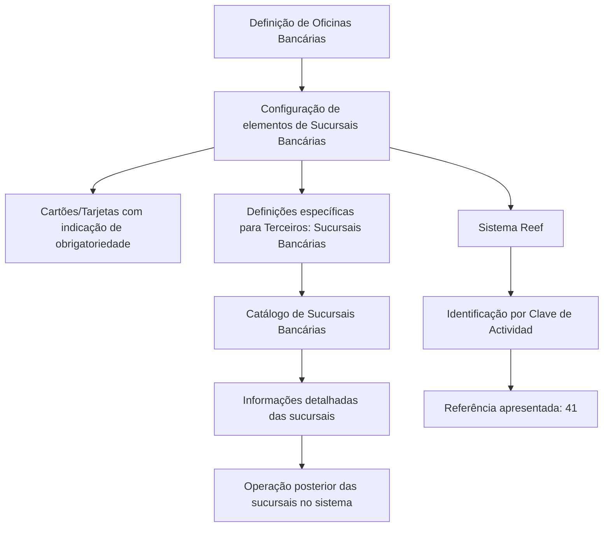
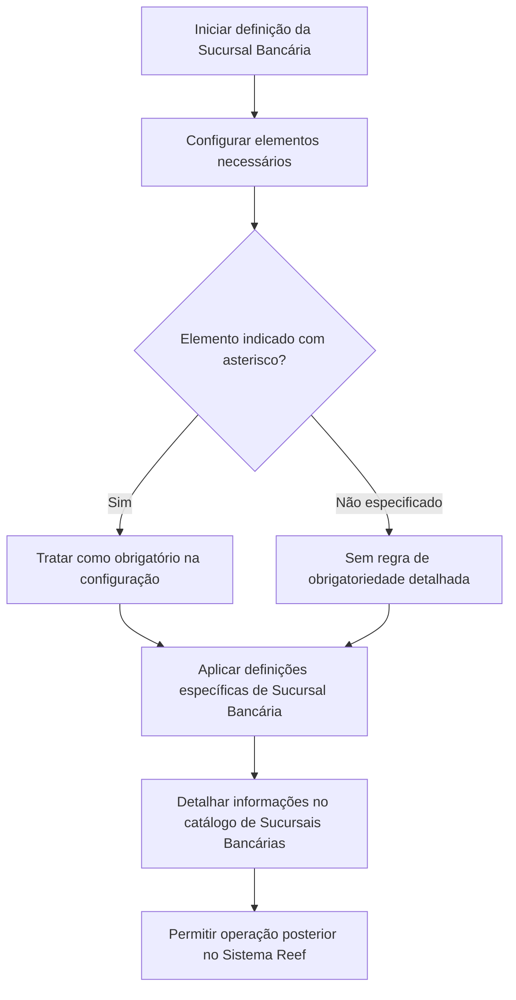

# Definição e Configuração de Sucursais Bancárias no Sistema Reef

## 1. Metadados do Documento
- **Arquivo de Origem:** Não identificado no conteúdo extraído
- **Tipo de Documento:** Manual funcional ou procedimento de configuração — classificação inferida pelo conteúdo
- **Domínio / Sistema:** Reef; Sucursais Bancárias; Mapfre
- **Público-Alvo:** Não identificado explicitamente; o conteúdo é direcionado à configuração de sucursais no sistema
- **Data/Versão Identificada:** Não identificada

---

## 2. Resumo Executivo & Contexto de Negócio

O documento descreve a definição de **Oficinas Bancárias / Sucursais Bancárias** e os elementos envolvidos na configuração dessas entidades no Sistema Reef. O objetivo declarado é estabelecer a ordem em que a definição deve ser realizada para permitir a posterior operação das sucursais no sistema.

O Sistema Reef identifica as Sucursais Bancárias pela **Clave de Actividad**, apresentada no trecho extraído com a referência `41`. O texto não detalha a estrutura, o formato, a regra de geração ou os valores permitidos para essa chave.

O conteúdo também indica a existência de cartões ou telas de configuração cujos asteriscos sinalizam a obrigatoriedade de cada elemento para a definição de uma Sucursal Bancária. Não foram disponibilizados os nomes desses cartões, os campos obrigatórios ou as regras de validação associadas.

Há um grupo de definições específicas utilizadas exclusivamente quando o terceiro configurado é uma **Sucursal Bancária**. O documento também menciona uma configuração de catálogo para detalhar as informações das sucursais bancárias, sem apresentar os atributos desse catálogo.

O material aparece no contexto de documentação Reef e apresenta referências de navegação para soluções, arquiteturas, APIs, componentes, cloud, documentação e Zeus. Não há detalhamento adicional sobre integração técnica, APIs, infraestrutura ou fluxos operacionais.

---

## 3. Arquitetura, Componentes & Tecnologias Envolvidas

| Componente / Termo | Papel identificado no conteúdo | Detalhamento disponível |
| :--- | :--- | :--- |
| Sistema Reef | Sistema no qual as Sucursais Bancárias são definidas, configuradas e posteriormente operadas. | Não são informadas tecnologias, versões ou interfaces. |
| Sucursais Bancárias | Tipo de terceiro com definições específicas e catálogo de informações. | O documento não apresenta campos ou contratos de dados. |
| Clave de Actividad | Identificador pelo qual o Sistema identifica as Sucursais Bancárias. | O conteúdo mostra a referência `41`, sem explicar seu significado. |
| Cartões / Tarjetas | Elementos de configuração com asteriscos indicativos de obrigatoriedade. | Não são listados cartões, abas ou campos. |
| Catálogo de Sucursais Bancárias | Estrutura destinada a detalhar informações das sucursais. | Não são informados atributos, formato ou processo de manutenção. |
| Mapfre | Nome presente na identificação visual do conteúdo: `Mapfredocument`. | A relação operacional ou tecnológica com o Sistema Reef não é detalhada. |
| Zeus | Item presente na navegação da documentação. | Sem detalhamento funcional ou técnico. |



> **Nota de Análise:** O conteúdo não detalha microsserviços, APIs, métodos HTTP, contratos JSON, bancos de dados, servidores, ambientes ou tecnologias de implementação.

---

## 4. Regras de Negócio, Especificações Funcionais & Processos

1. A definição das Sucursais Bancárias deve considerar os elementos que participam de sua configuração.
2. A definição deve seguir uma ordem para que seja possível operar posteriormente com as Sucursais Bancárias no Sistema Reef.
3. O Sistema identifica as Sucursais Bancárias por meio da **Clave de Actividad**.
4. O trecho extraído associa a Clave de Actividad à referência `41`; não há explicação complementar sobre essa referência.
5. Asteriscos exibidos nos cartões ou telas de configuração indicam a obrigatoriedade do elemento na definição das Sucursais Bancárias.
6. Existem definições específicas aplicáveis exclusivamente quando o terceiro é uma Sucursal Bancária.
7. Deve existir uma configuração de catálogo de Sucursais Bancárias para detalhar as informações dessas entidades.

### Fluxo funcional identificado



> **Nota de Análise:** O documento não informa a sequência exata dos elementos de configuração, os critérios de aprovação, mensagens de erro, perfis de acesso, nem o comportamento do sistema quando um elemento obrigatório não é preenchido.

---

## 5. Tabelas de Parâmetros, Ambientes e Estruturas de Dados

| Item / Parâmetro | Descrição / Função | Tipo / Valores / Formato | Ambiente / Observações |
| :--- | :--- | :--- | :--- |
| Sucursal Bancária | Entidade configurada e operada no Sistema Reef. | Terceiro / entidade de negócio. | Possui definições específicas. |
| Clave de Actividad | Chave utilizada pelo Sistema para identificar Sucursais Bancárias. | Referência apresentada: `41`. | Formato, domínio de valores e semântica não detalhados. |
| Asterisco nos cartões | Indicação de obrigatoriedade de um elemento de configuração. | Indicador visual. | Aplicável à definição de Sucursais Bancárias. |
| Definições específicas | Definições usadas exclusivamente quando o terceiro é uma Sucursal Bancária. | Grupo de definições. | Itens internos não apresentados. |
| Catálogo de Sucursais Bancárias | Configuração para detalhar a informação das sucursais. | Catálogo. | Campos e estrutura não apresentados. |
| Sistema Reef | Sistema que identifica e permite a operação posterior das Sucursais Bancárias. | Sistema corporativo. | Tecnologias e ambiente não informados. |
| Owner | Identificação exibida na interface de documentação. | `user:agonzalez_mapfre.com` | Valor reproduzido do conteúdo bruto. |
| Lifecycle | Estado exibido na interface de documentação. | `Approved Source / VL` | A semântica de `VL` não é detalhada. |
| Idioma | Idioma exibido na interface de documentação. | `ES` | O conteúdo principal está em espanhol. |

---

## 6. Bateria de Perguntas & Respostas para RAG (FAQ Sintético)

### P1: Qual é o objetivo da definição de Sucursais Bancárias no Sistema Reef?
**R:** O objetivo é configurar os elementos necessários para que as Sucursais Bancárias possam ser posteriormente operadas no Sistema Reef. O documento afirma que existe uma ordem de definição a ser seguida, mas não apresenta essa sequência em detalhe.

### P2: Como o Sistema Reef identifica uma Sucursal Bancária?
**R:** O Sistema Reef identifica as Sucursais Bancárias por meio da **Clave de Actividad**. O conteúdo extraído apresenta a referência `41`, porém não explica se esse número é um código, uma seção documental, um valor de parâmetro ou outra classificação.

### P3: O que significam os asteriscos nas Tarjetas de configuração?
**R:** Os asteriscos indicam a obrigatoriedade de um elemento em relação à definição das Sucursais Bancárias. O documento não informa quais elementos possuem asterisco nem como o Sistema Reef valida o preenchimento.

### P4: Existem definições exclusivas para Sucursais Bancárias?
**R:** Sim. O documento informa que há um grupo de definições específicas utilizado exclusivamente quando o terceiro configurado é uma Sucursal Bancária. Os nomes e regras dessas definições não foram disponibilizados no trecho extraído.

### P5: Qual é a função do catálogo de Sucursais Bancárias?
**R:** O catálogo de Sucursais Bancárias serve para configurar e detalhar as informações dessas sucursais. O conteúdo não apresenta os campos do catálogo, seus formatos, seus responsáveis ou as regras de manutenção.

### P6: O documento descreve APIs ou integrações para Sucursais Bancárias?
**R:** Não. Embora a interface de documentação contenha um item de navegação denominado `APIs`, o trecho não descreve endpoints, métodos HTTP, contratos, autenticação, integrações ou mensagens entre sistemas.

### P7: O documento informa qual ordem deve ser seguida na configuração?
**R:** O documento afirma que a definição deve ser realizada em uma ordem que permita operar posteriormente com as Sucursais Bancárias no Sistema. Contudo, a ordem concreta dos passos e dos elementos não está presente no conteúdo extraído.

### P8: Quais tecnologias compõem a solução de Sucursais Bancárias?
**R:** O trecho menciona o Sistema Reef e referências de navegação como Arquiteturas, APIs, Componentes, Cloud e Zeus, mas não informa linguagens, frameworks, bancos de dados, servidores, protocolos ou ferramentas de implantação.

### P9: Quem é o proprietário indicado na documentação?
**R:** A interface da documentação apresenta o campo `Owner` com o valor `user:agonzalez_mapfre.com`. O conteúdo não esclarece se esse valor representa uma pessoa, conta corporativa, grupo responsável ou proprietário técnico.

### P10: Qual é o estado de ciclo de vida identificado no conteúdo?
**R:** O campo `Lifecycle` aparece com o valor `Approved Source / VL`. O documento não define o significado de `VL`, nem descreve o processo de aprovação ou governança documental associado.

---

## 7. Glossário de Termos, Siglas & Conceitos-Chave

- **Clave de Actividad:** Chave utilizada pelo Sistema Reef para identificar Sucursais Bancárias.
- **Oficinas Bancarias:** Termo apresentado no título em espanhol para o domínio de Sucursais Bancárias.
- **Sucursal Bancária:** Tipo de terceiro para o qual existem definições específicas e informações em catálogo.
- **Tarjetas:** Cartões ou telas de configuração nos quais asteriscos indicam a obrigatoriedade de elementos.
- **Tercero:** Entidade classificada no documento; uma Sucursal Bancária é tratada como um tipo de terceiro.
- **Reef:** Sistema mencionado como responsável pela identificação e operação posterior das Sucursais Bancárias.
- **Mapfre:** Nome exibido na identificação visual `Mapfredocument`; sua função no processo não é detalhada.
- **Zeus:** Item listado na navegação da documentação; sem definição adicional no conteúdo.
- **Lifecycle:** Campo de ciclo de vida exibido com o valor `Approved Source / VL`.
- **VL:** Sigla ou valor exibido no campo Lifecycle; significado não identificado no texto.

---

## 8. Notas Críticas, Riscos & Limitações

- O conteúdo extraído não apresenta o nome do arquivo de origem, data, versão ou autoria documental completa.
- A ordem obrigatória de configuração das Sucursais Bancárias é mencionada, mas não é detalhada.
- A **Clave de Actividad** é citada com a referência `41`, porém não há definição de formato, valores válidos ou regra de negócio associada.
- Os elementos obrigatórios são sinalizados por asteriscos, mas os campos ou cartões correspondentes não foram fornecidos.
- Não há descrição de APIs, integrações, contratos de dados, controles de acesso, logs, URLs, ambientes, servidores ou mecanismos de tratamento de erro.
- Não são apresentados atributos do catálogo de Sucursais Bancárias, fluxos de aprovação, responsabilidades operacionais ou critérios de qualidade dos dados.
- A referência a `Approved Source / VL` não possui explicação semântica no texto extraído.

---

## 9. Conteúdo Bruto Estruturado (Referência Fiel)

```text
--- [PÁGINA 1 DE 1] ---

DEFINICIÓN de las OFICINAS BANCARIAS
Elementos que intervienen en la Conguración de las Sucursales Bancarias, así como el orden en el que esta denición se debe realizar para
poder operar posteriormente con ellas en el Sistema.
El Sistema identica a las Sucursales Bancarias con la Clave de Actividad... 41.
Los Asteriscos de las Tarjetas indican la obligatoriedad en la conguración del Elemento en relación con la denición de las Sucursales
Bancarias.
DEFINICIONES ESPECÍFICAS, propias de los Terceros SUCURSALES
BANCARIAS
En este Grupo se encuentran deniciones que se utilizan exclusivamente cuando el Tercero es una
SUCURSAL BANCARIA.
INFORMACIÓN SUCURSALES BANCARIAS
Conguración del catálogo de Sucursales Bancarias detallando la información de estas.
Documentation / DOCUMENTACIÓN Reef
DOCUMENTACIÓN Reef
Mapfredocument
DOCUMENTACIÓN Reef
Owner
user:agonzalez_mapfre.com
Lifecycle
Approved Source
 /
VL
Buscar Inicio Soluciones Arquitecturas APIs Componentes Cloud Documentación Zeus Reef Ayuda
ES
```
