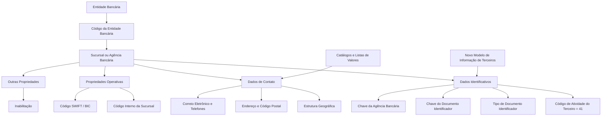

# Definição Funcional de Sucursais ou Agências Bancárias no Sistema Reef

## 1. Metadados do Documento
- **Arquivo de Origem:** `Não identificado no conteúdo fornecido`
- **Tipo de Documento:** `Especificação Técnica`
- **Domínio / Sistema:** `Reef / Modelo de Informação de Terceiros / Entidades Bancárias`
- **Público-Alvo:** `Desenvolvedores, Arquitetos, Operação e Negócio`
- **Data/Versão Identificada:** `Não identificada`

---

## 2. Resumo Executivo & Contexto de Negócio

O documento define os atributos funcionais necessários para cadastrar, identificar, localizar, operar e inabilitar sucursais ou agências bancárias no sistema Reef. O núcleo do sistema disponibiliza um repositório específico para a codificação das sucursais bancárias, entregue inicialmente sem conteúdo.

A definição de uma agência bancária está vinculada a uma entidade bancária previamente identificada. A agência possui uma chave própria, enquanto a entidade bancária possui sua chave de banco. O documento exemplifica essa relação com a entidade identificada pelo código `AAAA`, associada ao banco Santander, e suas agências identificadas pelas chaves `0001`, `0002` e outras.

O modelo de dados separa os atributos da agência bancária em quatro grupos: dados identificativos, dados de contato, propriedades operacionais e outras propriedades. Essa divisão contempla identificação corporativa, documentos identificadores, localização geográfica, endereço, meios de contato, código interno da sucursal, código SWIFT/BIC e condição de inabilitação.

O documento também estabelece regras relevantes para o Novo Modelo de Informação de Terceiros. As entidades bancárias e suas sucursais são identificadas com uma chave de atividade específica; para sucursais bancárias, o código de atividade é a constante `41`, valor que não pode ser alterado. Quando não houver documentos identificativos associados, o tipo de documento identificador deve assumir o valor `THP`.

Há dependências de configuração local, especialmente para os valores de tipo de domicílio. O Departamento de Tecnologia Local deve identificar os valores adequados nos catálogos de listas de valores do sistema, pois os valores predefinidos pelo núcleo podem não corresponder aos usos comuns de cada país. Esses valores possuem uso transversal na aplicação, não sendo exclusivos do cadastro de agências bancárias.

---

## 3. Arquitetura, Componentes & Tecnologias Envolvidas

O documento descreve um repositório de informações de sucursais ou agências bancárias dentro do núcleo do sistema Reef. A estrutura funcional relaciona a entidade bancária, a sucursal bancária, o Modelo de Informação de Terceiros, a estrutura geográfica e os catálogos de listas de valores.

### Componentes e conceitos identificados

| Componente / Conceito | Descrição baseada no documento |
| :--- | :--- |
| Sistema Reef | Sistema no qual está documentada a definição funcional das sucursais ou agências bancárias. |
| Núcleo do Sistema | Disponibiliza um repositório específico para codificação das sucursais bancárias. |
| Repositório de Sucursais Bancárias | Repositório inicialmente entregue vazio, destinado ao cadastro das agências bancárias. |
| Entidade Bancária | Banco ao qual a sucursal ou agência bancária está associada. |
| Sucursal / Agência Bancária | Unidade bancária identificada por chave própria e vinculada a uma entidade bancária. |
| Novo Modelo de Informação de Terceiros | Modelo no qual entidades bancárias e sucursais são identificadas com chave de atividade, tipo de documento identificador e chave associada. |
| Estrutura Geográfica | Estrutura utilizada para identificar geograficamente a agência em até quatro níveis. |
| Catálogos do Sistema / Listas de Valores | Catálogos nos quais a Tecnologia Local deve identificar valores aplicáveis, como os tipos de domicílio. |
| Código SWIFT / BIC | Código utilizado para identificar o banco receptor de uma transferência internacional. |



**Nota de Análise:** O documento não descreve interfaces técnicas, métodos HTTP, contratos JSON, bancos de dados, integrações entre microsserviços, URLs, portas ou mecanismos de persistência do repositório de sucursais bancárias.

---

## 4. Regras de Negócio, Especificações Funcionais & Processos

### 4.1. Repositório de sucursais ou agências bancárias

1. O núcleo do sistema permite codificar sucursais ou agências de entidades bancárias em um repositório específico.
2. O repositório de informações das sucursais bancárias é entregue inicialmente vazio.
3. A definição funcional de uma agência bancária é organizada em:
   - Dados identificativos.
   - Dados de contato.
   - Propriedades operativas.
   - Outras propriedades.

### 4.2. Regras de identificação

1. O atributo **Companhia** contém o código da companhia sobre a qual está sendo realizada a definição da agência bancária.
2. O atributo **Código de Atividade do Terceiro** informa o código de atividade associado às agências bancárias.
3. No Novo Modelo de Informação de Terceiros, entidades bancárias e suas sucursais são identificadas no sistema por uma chave de atividade específica.
4. O código de atividade para as sucursais bancárias é a constante `41`.
5. O valor `41` não pode ser modificado, pois corresponde a uma das atividades próprias do núcleo.
6. As agências bancárias devem possuir tipo de documento identificador e chave associada, mantendo coerência com o restante das pessoas físicas ou jurídicas do Modelo de Informação de Terceiros.
7. O tipo de documento identificador deve ser `THP` quando a agência bancária não tiver documentos identificadores associados.
8. A agência bancária é identificada por:
   - Código de atividade próprio.
   - Tipo de documento identificador.
   - Chave associada ao documento identificador.
9. O atributo **Código de Entidade Bancária** é a chave do banco ao qual a sucursal bancária está associada.
10. O atributo **Chave da Agência Bancária** é a chave que identifica a sucursal vinculada ao código da entidade bancária informado anteriormente.
11. O documento apresenta o exemplo de uma entidade bancária identificada pelo código `AAAA`, correspondente ao banco Santander:
    - A agência localizada em `C/Campos Elíseos, 35` utiliza a chave `0001`.
    - Outra agência, localizada em `Avda. Dr. García Tapia`, utiliza a chave `0002`.

### 4.3. Regras de nomenclatura

1. O atributo **Nome da Agência** contém o nome utilizado para identificar a sucursal bancária no sistema.
2. O atributo **Abreviatura da Agência Bancária** contém o nome abreviado utilizado para identificar uma sucursal específica pertencente a um banco específico no sistema.

### 4.4. Regras de localização geográfica

1. A identificação geográfica da agência bancária pode utilizar quatro níveis de estrutura geográfica.
2. O atributo **Primeiro Nível da Estrutura Geográfica** contém a chave do primeiro nível que identifica geograficamente a agência.
3. O atributo **Segundo Nível da Estrutura Geográfica** contém a chave do segundo nível que identifica geograficamente a agência.
4. O atributo **Terceiro Nível da Estrutura Geográfica** contém a chave do terceiro nível que identifica geograficamente a agência.
5. O atributo **Quarto Nível da Estrutura Geográfica** contém a chave do quarto nível que identifica geograficamente a agência.
6. O atributo **Nome do Quarto Nível da Estrutura Geográfica** contém a descrição correspondente ao quarto nível geográfico.
7. Como nem todos os países possuem o quarto nível de detalhamento geográfico, o nome desse nível pode conter informações complementares.
8. O atributo **Quarto Nível Vernáculo da Estrutura Geográfica** contém a chave do quarto nível geográfico no idioma vernáculo.
9. O atributo **Nome Vernáculo do Quarto Nível da Estrutura Geográfica** contém a nomenclatura do quarto nível geográfico no idioma vernáculo da localização da agência bancária.

### 4.5. Regras de endereço e contato

1. O atributo **Tipo de Domicílio** deve conter a tipologia do endereço da sucursal bancária, conforme o uso e a exploração que a seguradora desejar realizar localmente.
2. O documento cita como exemplos de tipo de domicílio:
   - Calle.
   - Avenida.
   - Cerrada.
   - Carretera.
   - Paseo.
3. O Departamento de Tecnologia Local deve identificar os valores de tipo de domicílio nos catálogos do sistema que representam listas de valores.
4. Os valores predefinidos pelo núcleo podem não ser os valores de uso comum no país.
5. Os valores de tipo de domicílio são de uso transversal na aplicação e não são exclusivos da configuração das agências bancárias.
6. Os atributos de **Domicílio** contêm a descrição do endereço segundo a localização geográfica e a tipologia do domicílio, permitindo também a captura de informação complementar para facilitar a localização.
7. O atributo **Código Postal** contém a chave do código postal da localização da agência.
8. O atributo **Apartado Postal** contém a chave da caixa postal da agência bancária, normalmente localizada em uma agência de correios, permitindo receber correspondências e pacotes sem fornecer o endereço físico concreto.
9. O atributo **Direção de Correio Eletrônico** contém o e-mail corporativo da sucursal bancária.
10. O atributo **Prefixo Telefônico do País** contém o prefixo de país do telefone da agência:
    - Espanha: `+34`.
    - México: `+52`.
    - Argentina: `+54`.
11. O atributo **Prefixo Telefônico Zonal** contém o prefixo zonal associado ao telefone da agência:
    - Madrid, Espanha: `91`.
    - Barcelona, Espanha: `93`.
    - Monterrey, Nuevo León, México: `81`.
    - Ciudad de México, México: `55`.
12. O atributo **Número de Fax** contém o telefone de fax da agência bancária.
13. O atributo **Número Telefônico** contém o telefone da sucursal bancária.
14. O atributo **Extensão Telefônica** pode conter, quando necessário, a extensão do telefone de atendimento da agência bancária.

### 4.6. Regras operacionais

1. O atributo **Código Interno da Sucursal** contém o código interno da agência bancária conforme a configuração da estrutura territorial da entidade bancária.
2. O atributo **Chave SWIFT** contém o código SWIFT, também denominado código BIC.
3. SWIFT significa *Society for Worldwide Interbank Financial Telecommunication*.
4. BIC significa *Bank Identifier Code*.
5. O código SWIFT/BIC é uma sequência alfanumérica de 8 ou 11 dígitos utilizada para identificar o banco receptor de uma transferência internacional.
6. O código SWIFT/BIC é aplicado somente em países que não pertencem à Zona SEPA.
7. A Zona SEPA é descrita no documento como composta pelos 28 países da União Europeia, além de Liechtenstein, Islândia, Noruega, Andorra, Mônaco, San Marino, Suíça, Reino Unido e Cidade do Vaticano.
8. Os três últimos dígitos de um código SWIFT/BIC são opcionais.
9. Quando os três últimos dígitos estão presentes, eles indicam a sucursal onde a conta se encontra.
10. Quando os três últimos dígitos não estão presentes, entende-se que a conta pertence à agência central do banco.
11. Na ausência dos três dígitos opcionais, o código SWIFT considerado é o configurado no nível da entidade bancária.

### 4.7. Regra de inabilitação

1. O campo **Inabilitação** informa ao sistema que a agência bancária está inabilitada.
2. Uma agência bancária inabilitada não deve ser utilizada, considerada ou contemplada nos processos operativos da entidade quando o estado da agência for relevante.

---

## 5. Tabelas de Parâmetros, Ambientes e Estruturas de Dados

| Item / Parâmetro | Descrição / Função | Tipo / Valores / Formato | Ambiente / Observações |
| :--- | :--- | :--- | :--- |
| Companhia | Código da companhia na qual é definida a agência bancária. | Código não detalhado. | Dados identificativos. |
| Código de Atividade do Terceiro | Código da atividade associada às agências bancárias. | Constante `41`. | Não pode ser modificado. |
| Tipo de Documento Identificador | Tipo de documento utilizado para identificar a agência bancária. | `THP`, quando não houver documentos identificadores associados. | Dados identificativos. |
| Chave do Documento Identificador | Código associado ao tipo de documento identificador da sucursal bancária. | Formato não detalhado. | Dados identificativos. |
| Código de Entidade Bancária | Chave do banco ao qual a agência está associada. | Formato não detalhado. | Relação entre entidade bancária e sucursal. |
| Chave da Agência Bancária | Chave de identificação da agência vinculada à entidade bancária. | Exemplo: `0001`, `0002`. | Associada ao código da entidade bancária. |
| Nome da Agência | Nome pelo qual a sucursal é identificada no sistema. | Texto. | Dados identificativos. |
| Abreviatura da Agência Bancária | Nome abreviado da sucursal pertencente a determinado banco. | Texto. | Dados identificativos. |
| Primeiro Nível da Estrutura Geográfica | Chave do primeiro nível geográfico da agência. | Chave não detalhada. | Dados de contato. |
| Segundo Nível da Estrutura Geográfica | Chave do segundo nível geográfico da agência. | Chave não detalhada. | Dados de contato. |
| Terceiro Nível da Estrutura Geográfica | Chave do terceiro nível geográfico da agência. | Chave não detalhada. | Dados de contato. |
| Quarto Nível da Estrutura Geográfica | Chave do quarto nível geográfico da agência. | Chave não detalhada. | Pode não existir em todos os países. |
| Nome do Quarto Nível Geográfico | Descrição do quarto nível geográfico. | Texto. | Pode conter informação complementar. |
| Quarto Nível Vernáculo | Chave do quarto nível geográfico no idioma vernáculo. | Chave não detalhada. | Dados de contato. |
| Nome Vernáculo do Quarto Nível | Nomenclatura do quarto nível geográfico em língua vernácula. | Texto. | Dados de contato. |
| Tipo de Domicílio | Tipologia do endereço da agência bancária. | Exemplos: Calle, Avenida, Cerrada, Carretera, Paseo. | Deve ser identificado nos catálogos locais de listas de valores. |
| Domicílio | Descrição do endereço e informação complementar de localização. | Texto. | Considera localização geográfica e tipologia de domicílio. |
| Código Postal | Chave do código postal da agência. | Chave não detalhada. | Dados de contato. |
| Apartado Postal | Chave da caixa postal associada à agência. | Chave não detalhada. | Permite recebimento de correspondência sem informar endereço físico concreto. |
| Direção de Correio Eletrônico | E-mail corporativo da sucursal bancária. | Endereço de e-mail. | Dados de contato. |
| Prefixo Telefônico do País | Prefixo internacional do telefone da agência. | Exemplos: Espanha `+34`, México `+52`, Argentina `+54`. | Dados de contato. |
| Prefixo Telefônico Zonal | Prefixo geográfico/local do telefone da agência. | Exemplos: Madrid `91`, Barcelona `93`, Monterrey `81`, Ciudad de México `55`. | Dados de contato. |
| Número de Fax | Número telefônico de fax da agência. | Número telefônico. | Dados de contato. |
| Número Telefônico | Telefone da sucursal bancária. | Número telefônico. | Dados de contato. |
| Extensão Telefônica | Extensão do telefone de atendimento da agência. | Número ou código não detalhado. | Preenchido se necessário. |
| Código Interno da Sucursal | Código interno da agência conforme a estrutura territorial do banco. | Código não detalhado. | Propriedades operativas. |
| Chave SWIFT / BIC | Código que identifica o banco receptor em transferência internacional. | Sequência alfanumérica de 8 ou 11 dígitos. | Aplicável somente fora da Zona SEPA, conforme o documento. |
| Inabilitação | Indica que a agência não deve ser usada em processos operativos relevantes. | Estado não detalhado. | Outras propriedades. |

### Exemplos explícitos de identificação

| Entidade / Localização | Código / Valor |
| :--- | :--- |
| Banco Santander, conforme exemplo do documento | Código de entidade bancária `AAAA` |
| Agência situada em `C/Campos Elíseos, 35` | Chave da agência `0001` |
| Agência situada em `Avda. Dr. García Tapia` | Chave da agência `0002` |
| Espanha | Prefixo telefônico do país `+34` |
| México | Prefixo telefônico do país `+52` |
| Argentina | Prefixo telefônico do país `+54` |
| Madrid, Espanha | Prefixo telefônico zonal `91` |
| Barcelona, Espanha | Prefixo telefônico zonal `93` |
| Monterrey, Nuevo León, México | Prefixo telefônico zonal `81` |
| Ciudad de México, México | Prefixo telefônico zonal `55` |

---

## 6. Bateria de Perguntas & Respostas para RAG (FAQ Sintético)

### P1: Qual é o objetivo do repositório de sucursais ou agências bancárias no sistema Reef?
**R:** O repositório permite codificar e cadastrar sucursais ou agências de entidades bancárias em um espaço específico do núcleo do sistema. O documento informa que esse repositório é inicialmente entregue sem conteúdo.

### P2: Qual código de atividade deve ser usado para uma agência bancária?
**R:** A agência bancária deve utilizar o código de atividade do terceiro com valor constante `41`. O documento determina que esse valor não pode ser modificado porque corresponde a uma atividade própria do núcleo.

### P3: Quando o tipo de documento identificador de uma sucursal deve ser THP?
**R:** O tipo de documento identificador deve ter valor `THP` quando a agência bancária não possuir documentos identificadores associados.

### P4: Como uma agência bancária é vinculada a uma entidade bancária?
**R:** A vinculação ocorre por meio do atributo Código de Entidade Bancária, que contém a chave do banco. A sucursal possui adicionalmente uma Chave da Agência Bancária, utilizada para identificar a agência específica associada àquela entidade bancária.

### P5: Quais dados geográficos podem identificar uma agência bancária?
**R:** A agência pode ser identificada por primeiro, segundo, terceiro e quarto níveis de estrutura geográfica. Também podem ser registrados o nome do quarto nível, a chave do quarto nível em idioma vernáculo e o nome vernáculo do quarto nível geográfico.

### P6: Quem deve definir os valores de tipo de domicílio para cada país?
**R:** O Departamento de Tecnologia Local deve identificar os valores adequados nos catálogos do sistema que representam as listas de valores. Essa atividade é necessária porque os valores predefinidos pelo núcleo podem não corresponder aos usos comuns de cada país.

### P7: Quais exemplos de tipos de domicílio são apresentados no documento?
**R:** O documento cita Calle, Avenida, Cerrada, Carretera e Paseo como exemplos de valores para o atributo Tipo de Domicílio. Esses exemplos não constituem uma lista completa de valores permitidos.

### P8: Para que serve o código SWIFT ou BIC de uma agência bancária?
**R:** O código SWIFT, também denominado BIC, é uma sequência alfanumérica de 8 ou 11 dígitos usada para identificar o banco receptor de uma transferência internacional. SWIFT significa Society for Worldwide Interbank Financial Telecommunication e BIC significa Bank Identifier Code.

### P9: Em quais situações o código SWIFT/BIC é aplicado segundo o documento?
**R:** O documento estabelece que o código SWIFT/BIC é aplicado apenas em países que não pertencem à Zona SEPA. A Zona SEPA é descrita como abrangendo os 28 países da União Europeia, além de Liechtenstein, Islândia, Noruega, Andorra, Mônaco, San Marino, Suíça, Reino Unido e Cidade do Vaticano.

### P10: O que significam os três últimos dígitos de um código SWIFT/BIC com 11 caracteres?
**R:** Os três últimos dígitos são opcionais e, quando presentes, indicam a sucursal na qual a conta está localizada. Quando esses dígitos não estão presentes, entende-se que a conta pertence à agência central do banco e deve ser considerado o código SWIFT configurado no nível da entidade bancária.

### P11: O que acontece quando uma agência bancária é marcada como inabilitada?
**R:** A inabilitação indica ao sistema que a agência não deve ser utilizada, considerada ou contemplada nos processos operativos da entidade nos quais o estado da agência seja relevante.

### P12: Qual é a diferença entre Código de Entidade Bancária e Chave da Agência Bancária?
**R:** O Código de Entidade Bancária identifica o banco ao qual a sucursal está associada. A Chave da Agência Bancária identifica a sucursal específica dentro da entidade bancária. No exemplo do documento, a entidade bancária `AAAA` possui sucursais identificadas pelas chaves `0001` e `0002`.

---

## 7. Glossário de Termos, Siglas & Conceitos-Chave

- **BIC:** *Bank Identifier Code*. Denominação alternativa do código SWIFT para identificação do banco receptor de uma transferência internacional.
- **Código de Atividade do Terceiro:** Código de atividade associado às agências bancárias; o documento determina a constante `41`.
- **Código de Entidade Bancária:** Chave do banco ao qual uma sucursal ou agência bancária está vinculada.
- **Código SWIFT:** Código alfanumérico de 8 ou 11 dígitos utilizado para identificar o banco receptor de uma transferência internacional.
- **Estrutura Geográfica:** Organização de localização geográfica em até quatro níveis, usada para identificar uma agência bancária.
- **Inabilitação:** Estado que indica que uma agência bancária não deve ser empregada em processos operativos relevantes.
- **Modelo de Informação de Terceiros:** Modelo no qual entidades bancárias e sucursais são identificadas por chave de atividade, tipo de documento identificador e chave associada.
- **Sucursal / Agência Bancária:** Unidade bancária vinculada a uma entidade bancária e identificada por chave própria.
- **SEPA:** Zona única de Pagamentos na Europa, conforme descrita no documento.
- **Society for Worldwide Interbank Financial Telecommunication:** Expansão da sigla SWIFT apresentada no documento.
- **THP:** Valor do tipo de documento identificador quando a agência bancária não possui documentos identificadores associados.

---

## 8. Notas Críticas, Riscos & Limitações

- O repositório de sucursais bancárias é inicialmente entregue vazio; o documento não especifica o processo técnico de carga inicial, importação ou migração de dados.
- O documento não detalha formatos, tamanhos máximos, obrigatoriedade, validações de preenchimento ou unicidade para a maior parte dos atributos.
- O documento não define contratos de integração, interfaces, APIs, métodos HTTP, mensagens, estruturas JSON, mecanismos de autenticação ou rotas de comunicação.
- A configuração dos valores de tipo de domicílio depende do Departamento de Tecnologia Local e dos catálogos de listas de valores do sistema.
- Os valores de tipo de domicílio devem ser tratados como transversais à aplicação, evitando uma configuração exclusiva para agências bancárias.
- O quarto nível da estrutura geográfica pode não existir em todos os países; nesse caso, o atributo de nome do quarto nível pode conter informação complementar.
- A regra de aplicação do SWIFT/BIC é limitada, no documento, aos países que não pertencem à Zona SEPA.
- O documento não descreve os valores possíveis, o comportamento de persistência ou o fluxo de reabilitação do campo Inabilitação.
- A seção de perguntas frequentes apresenta uma pergunta sobre esclarecimentos operacionais da tabela de Entidades Bancárias, mas o conteúdo fornecido não contém a resposta correspondente.

---

## 9. Conteúdo Bruto Estruturado (Referência Fiel)

```text
--- [PÁGINA 1 DE 4] ---

DEFINICIÓN de las Ocinas Bancarias
Funcionalmente, el núcleo del Sistema cuenta con la posibilidad de codicar las Sucursales u Ocinas de las entidades Bancarias en un
repositorio de información especíco que se entrega inicialmente a las instalaciones vacío de contenido.
Datos Identicativos
Datos de Contacto
Propiedades Operativas
Otras Propiedades
Datos Identicativos
Compañía
Este Atributo del catálogo de Sucursales bancarias contiene el código de la compañía sobre la que se está realizando la denición de la
Ocina Bancaria.
Código de Actividad del Tercero
Esta propiedad indicará el código de la Actividad del Tercero que se asocian a las Ocinas Bancarias puesto que en el Nuevo Modelo de
Información de Terceros, las entidades bancarias y sus Sucursales se identican en el sistema con una clave de actividad especíca.
NOTA: Su valor es la constante '41' puesto que esta es una de las actividades que corresponden al núcleo y por ello no puede ser modicado.
Tipo Documento Identicador
En el nuevo Modelo de Información de Terceros y por coherencia con la información del del resto de Personas Físicas o Jurídicas las Ocinas
bancarias se deben identicar en el sistema con un tipo de documento identicativo y una clave asociada.
El valor del tipo de documento identicativo es THP siempre y cuando no tengan asociados documentos identicativos.
Clave del Documento Identicador
En el nuevo Modelo de Información de Terceros y por coherencia con los datos del resto de Terceros, las Sucursales u Ocinas bancarias se
identican en el sistema con un código de actividad propio además de un tipo de documento identicativo y una clave asociada.
Este atributo contendrá el código del Tipo de documento Identicador asociado a la Sucursal Bancaria
Código Entidad Bancaria
Este atributo será la clave del banco a la que estará asociada la sucursal bancaria que se esté deniendo.
Clave Ocina Bancaria
Documentation / DOCUMENTACIÓN Reef
DOCUMENTACIÓN Reef
Mapfredocument
DOCUMENTACIÓN Reef
Owner
user:agonzalez_mapfre.com
Lifecycle
Approved Source
 / 
 VL
Buscar Inicio Soluciones Arquitecturas APIs Componentes Cloud Documentación Zeus Reef Ayuda
ES


--- [PÁGINA 2 DE 4] ---

Este atributo será la clave por la que se va a identicar la sucursal bancaria que estará asociada al código de Entidad Bancaria previamente
capturado.
A modo de ejemplo, y para el código AAAA que identica al 'BANCO Santander' como su entidad Bancaria, la Clave '0001' sería la clave de la
Sucursal Bancaria ubicada en C/Campos Elíseos, 35., la clave '0002' sería la clave de la sucursal bancaria ubicada en Avda. Dr. García Tapia,...
etc.
Nombre Ocina
Este atributo contiene el nombre por el que se identica a la Sucursal Bancaria en el Sistema.
Abreviatura Ocina Bancaria
Este atributo contiene el nombre abreviado por el que se puede identicar a la Sucursal Bancaria X perteneciente al Banco Y en el Sistema.
Datos de Contacto
Primer Nivel de la Estructura Geográca
Este atributo contiene la clave del primer nivel de la estructura con el que se va a identicar geográcamente a la Sucursal Bancaria.
Segundo Nivel de la Estructura Geográca
Este atributo contiene la clave del segundo nivel de la estructura con el que se va a identicar geográcamente a la Sucursal Bancaria.
Tercer Nivel de la Estructura Geográca
Este atributo contiene la clave del tercer nivel de la estructura con el que se va a identicar geográcamente a la Sucursal Bancaria.
Cuarto Nivel de la Estructura Geográca
Este atributo contiene la clave del cuarto nivel de la estructura con el que se va a identicar geográcamente a la Sucursal Bancaria..
Nombre del Cuarto Nivel de la Estructura Geográca
Este atributo contiene la descripción que corresponde al cuarto nivel de la estructura geográca si bien y puesto que no en todos los países
se cuenta con este nivel de detalle, puede contener información complementaria.
Cuarto Nivel Vernáculo de la Estructura Geográca
Este atributo contiene la clave del cuarto nivel de la estructura con la que se va a identicar geográcamente y en idioma vernáculo a las
Ocinas Bancarias.
Nombre vernáculo del Cuarto Nivel de la Estructura Geográca
El propósito de este atributo es contener la nomenclatura del cuarto nivel de la estructura geográca, en donde estará ubicada la Sucursal
Bancaria, en lengua vernácula.
Tipo de Domicilio
Este atributo ha de contener la tipología del Domicilio de la sucursal bancaria de acuerdo con el uso y explotación que posteriormente quiera
realizar localmente la aseguradora con esta información.
A modo de ejemplo sus valores podrían ser:
Calle.
Avenida.
Cerrada.
Carretera.
Paseo.
...
NOTA: Es necesario que el Departamento de Tecnología Local identique sus valores en los catálogos del Sistema que identican las Listas
de Valores puesto que los valores prejados por el núcleo pueden no ser aquellos de uso común en el país, teniendo en mente además que


--- [PÁGINA 3 DE 4] ---

los valores serán de uso transversal en la aplicación y no de uso especíco para la conguración de las ocinas bancarias.
Domicilio
Estos Atributos contienen la descripción del domicilio de acuerdo con la ubicación geográca y tipología del domicilio de la Sucursal
Bancaria además de permitir la captura de información complementaria que facilite la ubicación de esta.
Código Postal
Este atributo contiene la clave del Código Postal en donde está ubicada la Ocina Bancaria.
Apartado Postal
Este atributo contiene la clave del Apartado Postal perteneciente a la Ocina Bancaria, normalmente ubicado en una ocina de Correos, que
le permite recibir correspondencia y paquetes sin tener que entregar su dirección física concreta.
Dirección Correo Electrónico
Este atributo contiene la dirección de correo electrónico corporativo de la Sucursal Bancaria.
Prejo Telefónico del País
Este atributo contiene el Prejo del País Telefónico correspondiente al número telefónico de la Sucursal Bancaria.
A modo de ejemplo, en España el prejo es +34, en México +52 y en Argentina +54.
Prejo Zonal Telefónico
Este atributo contiene el Prejo Zonal Telefónico que corresponde al número telefónico de la Ocina Bancaria.
A modo de ejemplo,
En España el prejo zonal de Madrid es el 91, el de Barcelona 93, ...
En México la Clave Lada local que corresponde a Monterrey, Nuevo León es 81, la de Ciudad de México es 55,...
Número Fax
Este atributo contiene el Número Telefónico del Fax correspondiente a la Ocina Bancaria.
Número Telefónico
Este atributo contiene el Número Telefónico que corresponde al Teléfono de la Sucursal Bancaria.
Extensión Telefónica
Caso de ser necesario, este atributo contendrá la Extensión Telefónica correspondiente al Teléfono de atención de la Ocina Bancaria.
Propiedades Operativas
Código Interno Sucursal
Este atributo contiene el código interno de la Ocina Bancaria de acuerdo con la conguración de la estructura Territorial propia de la entidad
Bancaria.
Clave SWIFT
Este atributo contiene el código SWIFT (acrónimo de Society for Worldwide Interbank Financial Telecommunication), también denominado
código BIC (Bank Identier Code), que no es sino una serie alfanumérica de 8 u 11 dígitos que se utiliza para identicar al banco receptor de
una transferencia internacional.
¿Cuándo se aplica el código SWIFT / BIC?
El código SWIFT / BIC se aplica únicamente en aquellos países que no pertenecen a la Zona SEPA (o Zona única de Pagos en Europa)
comprendida por los 28 países de la Unión Europea, además de Liechtenstein, Islandia, Noruega, Andorra, Mónaco, San Marino, Suiza, Reino
Unido y Ciudad del Vaticano Estado.


--- [PÁGINA 4 DE 4] ---

NOTA: Los tres últimos dígitos son opcionales y en caso de aparecer hacen referencia a la sucursal en la que se encuentra la cuenta en
concreto. Si no estuvieran presentes se entiende que pertenece a la ocina central del banco y por tanto el código SWIFT sería el congurado
a nivel de la Entidad Bancaria.
Otras Propiedades
Inhabilitación
Este campo le indica al Sistema que la Ocina Bancaria está inhabilitada en el Sistema por lo cual, de estarlo, no debería ser empleada,
contemplada o considerada en los procesos operativos de la entidad en los que el estado de la Ocina sea relevante.
Vínculos
Relación de Directrices y Documentos funcionales cuya lectura recomendada para evitar que la interpretación aislada del presente
documento pueda conducir a error.
Actividades de Terceros
Entidades Bancarias
Estructura Geográca
Preguntas frecuentes
(1) ¿Existe alguna aclaración operativa que deba ser tomada en consideración en el uso y denición de la tabla de Entidades Bancarias del
Sistema?
```
