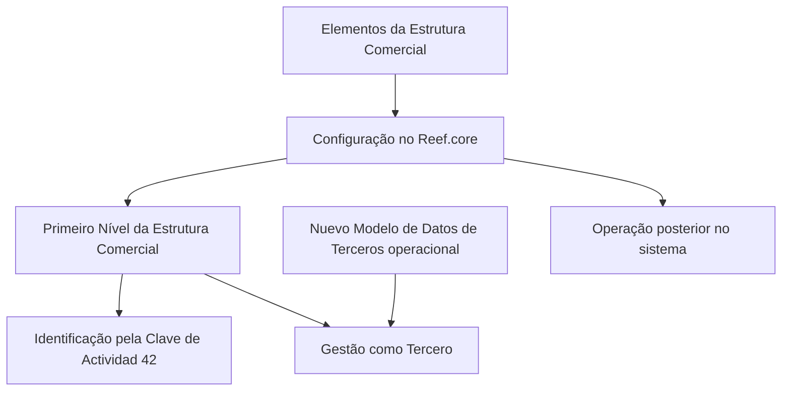

# Definição do Primeiro Nível da Estrutura Comercial no Reef.core

## 1. Metadados do Documento
- **Arquivo de Origem:** Não identificado — conteúdo bruto fornecido pelo usuário
- **Tipo de Documento:** Especificação Técnica
- **Domínio / Sistema:** Reef.core / Estrutura Comercial / Terceros
- **Público-Alvo:** Desenvolvedores, Arquitetos, Operação e Negócio
- **Data/Versão Identificada:** Não identificada

---

## 2. Resumo Executivo & Contexto de Negócio

O documento descreve a definição e a configuração dos **Primeiros Níveis da Estrutura Comercial** no sistema **Reef.core**. Esses elementos devem ser configurados para que possam ser utilizados posteriormente nas operações do sistema.

O Reef.core identifica o Primeiro Nível da Estrutura Comercial por meio da **Clave de Actividad 42**. Essa chave funciona como o identificador citado para o reconhecimento dessa entidade dentro do sistema.

O Primeiro Nível da Estrutura Comercial pode ser gerenciado como um **Tercero**, desde que o **Nuevo Modelo de Datos de Terceros** esteja operacional na entidade. O documento estabelece essa condição, mas não detalha o modelo de dados, os atributos do Tercero ou o processo técnico de ativação.

A documentação também informa que a obrigatoriedade dos elementos de configuração é indicada por asteriscos nas respectivas tarjetas. Há ainda um grupo de definições específicas aplicável exclusivamente quando o Tercero representa o Primeiro Nível da Estrutura Comercial.

---

## 3. Arquitetura, Componentes & Tecnologias Envolvidas

Os componentes e conceitos explicitamente citados são:

- **Reef.core:** sistema no qual os Primeiros Níveis da Estrutura Comercial são configurados e utilizados.
- **Estrutura Comercial:** estrutura que contém os elementos classificados como Primeiro Nível.
- **Primer Nivel de la Estructura Comercial:** entidade funcional configurada no Reef.core.
- **Clave de Actividad 42:** chave usada pelo sistema para identificar o Primeiro Nível da Estrutura Comercial.
- **Tercero:** entidade pela qual o Primeiro Nível pode ser gerenciado, condicionada à operação do Novo Modelo de Dados de Terceros.
- **Nuevo Modelo de Datos de Terceros:** pré-requisito citado para o gerenciamento do Primeiro Nível como Tercero.
- **Mapfredocument / Documentación Reef:** referências ao repositório ou contexto documental exibido no conteúdo bruto.



> **Nota de Análise:** O documento não detalha interfaces, APIs, métodos HTTP, contratos JSON, bancos de dados, integrações externas ou tecnologias de infraestrutura.

---

## 4. Regras de Negócio, Especificações Funcionais & Processos

1. Os elementos que compõem os Primeiros Níveis da Estrutura Comercial devem ser configurados no **Reef.core**.
2. A configuração é necessária para que os Primeiros Níveis da Estrutura Comercial possam ser operados posteriormente no sistema.
3. O Reef.core identifica o Primeiro Nível da Estrutura Comercial usando a **Clave de Actividad 42**.
4. O Primeiro Nível da Estrutura Comercial é gerenciado como um **Tercero** somente quando o **Nuevo Modelo de Datos de Terceros** está operativo na entidade.
5. A obrigatoriedade dos elementos de configuração é indicada por asteriscos nas tarjetas.
6. Existe um grupo de definições específicas que deve ser empregado exclusivamente quando o Tercero é o Primeiro Nível da Estrutura Comercial.
7. O conteúdo apresentado não detalha:
   - os campos de configuração do Primeiro Nível;
   - os critérios que determinam a ativação do Novo Modelo de Dados de Terceros;
   - os fluxos de criação, alteração, consulta ou exclusão;
   - permissões de usuários;
   - mensagens de erro;
   - contratos de integração.

---

## 5. Tabelas de Parâmetros, Ambientes e Estruturas de Dados

| Item / Parâmetro | Descrição / Função | Tipo / Valores / Formato | Ambiente / Observações |
| :--- | :--- | :--- | :--- |
| Reef.core | Sistema em que os Primeiros Níveis da Estrutura Comercial são configurados e operados | Sistema | Citado como `Reef.core` |
| Primeiro Nível da Estrutura Comercial | Elemento da Estrutura Comercial sujeito a configuração no Reef.core | Entidade funcional | Pode ser operado posteriormente no sistema |
| Clave de Actividad | Chave utilizada pelo sistema para identificar o Primeiro Nível da Estrutura Comercial | Valor identificado: `42` | O documento não informa estrutura, tipo técnico ou origem da chave |
| Tercero | Entidade pela qual o Primeiro Nível pode ser gerenciado | Entidade de dados / negócio | Aplicável quando o Novo Modelo de Dados de Terceros estiver operativo |
| Nuevo Modelo de Datos de Terceros | Modelo de dados citado como condição para gestão do Primeiro Nível como Tercero | Pré-requisito operacional | Sem detalhamento técnico adicional |
| Asteriscos das Tarjetas | Indicam se a configuração de um elemento é obrigatória | Indicador visual de obrigatoriedade | Relacionado à definição dos Primeiros Níveis |
| Definições específicas | Definições utilizadas exclusivamente quando o Tercero é o Primeiro Nível da Estrutura Comercial | Grupo de definições | O documento não lista as definições |

---

## 6. Bateria de Perguntas & Respostas para RAG (FAQ Sintético)

### P1: Qual sistema é utilizado para configurar os Primeiros Níveis da Estrutura Comercial?
**R:** Os Primeiros Níveis da Estrutura Comercial são configurados no sistema **Reef.core**, conforme indicado no documento.

### P2: Qual é a finalidade de configurar os Primeiros Níveis da Estrutura Comercial no Reef.core?
**R:** A configuração permite que os Primeiros Níveis da Estrutura Comercial possam ser operados posteriormente no sistema Reef.core.

### P3: Como o Reef.core identifica o Primeiro Nível da Estrutura Comercial?
**R:** O Reef.core identifica o Primeiro Nível da Estrutura Comercial por meio da **Clave de Actividad 42**.

### P4: Qual é o valor da Clave de Actividad associada ao Primeiro Nível da Estrutura Comercial?
**R:** O valor informado no documento para a Clave de Actividad é **42**.

### P5: Quando o Primeiro Nível da Estrutura Comercial pode ser gerenciado como um Tercero?
**R:** O Primeiro Nível da Estrutura Comercial pode ser gerenciado como um Tercero quando o **Nuevo Modelo de Datos de Terceros** estiver operativo na entidade.

### P6: O documento detalha os campos ou atributos do Tercero?
**R:** Não. O documento apenas informa que o Primeiro Nível pode ser gerenciado como um Tercero sob a condição operacional do Novo Modelo de Dados de Terceros; ele não descreve atributos, campos ou estrutura técnica do Tercero.

### P7: O que significam os asteriscos nas tarjetas de configuração?
**R:** Os asteriscos nas tarjetas indicam se a configuração de um elemento é obrigatória em relação à definição dos Primeiros Níveis da Estrutura Comercial.

### P8: Quando devem ser usadas as definições específicas mencionadas no documento?
**R:** As definições específicas devem ser utilizadas exclusivamente quando o Tercero representa o **Primeiro Nível da Estrutura Comercial**.

### P9: O documento informa APIs ou contratos de integração para o Reef.core?
**R:** Não. O conteúdo fornecido não apresenta APIs, métodos HTTP, endpoints, contratos JSON, URLs de ambiente ou especificações de integração.

### P10: O documento descreve como ativar o Nuevo Modelo de Datos de Terceros?
**R:** Não. O texto apenas estabelece que esse modelo deve estar operativo na entidade para permitir o gerenciamento do Primeiro Nível como Tercero.

---

## 7. Glossário de Termos, Siglas & Conceitos-Chave

- **Reef.core:** Sistema citado como responsável pela configuração e operação dos Primeiros Níveis da Estrutura Comercial.
- **Primeiro Nível da Estrutura Comercial:** Elemento da Estrutura Comercial configurado no Reef.core.
- **Clave de Actividad:** Chave usada pelo Reef.core para identificar o Primeiro Nível da Estrutura Comercial; o documento informa o valor 42.
- **Tercero:** Entidade por meio da qual o Primeiro Nível da Estrutura Comercial pode ser gerenciado quando a condição documental é atendida.
- **Nuevo Modelo de Datos de Terceros:** Modelo de dados que precisa estar operativo na entidade para permitir a gestão do Primeiro Nível como Tercero.
- **Tarjetas:** Elementos de interface ou apresentação citados no documento, cujos asteriscos indicam obrigatoriedade de configuração.
- **Mapfredocument:** Termo exibido no conteúdo bruto como referência documental; sem detalhamento adicional.
- **VL:** Sigla exibida na área de navegação do conteúdo bruto; significado não identificado no texto.

---

## 8. Notas Críticas, Riscos & Limitações

- O conteúdo não identifica o nome do arquivo original, data, versão, autor técnico ou ciclo de aprovação completo.
- O texto cita a **Clave de Actividad 42**, mas não explica como essa chave é cadastrada, validada ou consumida.
- O Novo Modelo de Dados de Terceros é uma dependência funcional explícita para a gestão do Primeiro Nível como Tercero.
- Não há detalhamento de dados, permissões, telas, APIs, integrações, logs, monitoramento ou procedimentos operacionais.
- O documento menciona definições específicas para Terceros classificados como Primeiro Nível, mas não apresenta essas definições.
- A presença de caracteres corrompidos na extração, como `congurar`, sugere possível problema de codificação no conteúdo bruto original.

---

## 9. Conteúdo Bruto Estruturado (Referência Fiel)

```text
--- [PÁGINA 1 DE 1] ---

DEFINICIÓN del PRIMER NIVEL de la ESTRUCTURA COMERCIAL
Se relacionan los elementos que permiten congurar en Reef.core a los Primeros Niveles de la Estructura Comercial para poder operar
posteriormente con ellos en el Sistema.
El Sistema identica al Primer Nivel de la Estructura Comercial con la Clave de Actividad... 42.
El Primer Nivel de la Estructura Comercial se gestiona como un Tercero siempre y cuando el Nuevo Modelo de Datos de Terceros esté
operativo en la Entidad.
Los Asteriscos de las Tarjetas indican si la conguración del elemento es obligatoria en relación con la denición de los Primeros Niveles
de la Estructura Comercial.
Deniciones ESPECÍFICAS, propias de los Terceros PRIMER NIVEL DE
LA ESTRUCTURA COMERCIAL
En este Grupo se encuentran deniciones que se emplean exclusivamente cuando el Tercero es el PRIMER
NIVEL DE LA ESTRUCTURA COMERCIAL.
Documentation / DOCUMENTACIÓN Reef
DOCUMENTACIÓN Reef
Mapfredocument
DOCUMENTACIÓN Reef
Owner
user:agonzalez_mapfre.com
Lifecycle
Approved Source
 / 
 VL
Buscar Inicio Soluciones Arquitecturas APIs Componentes Cloud Documentación Zeus Reef Ayuda
ES
```
