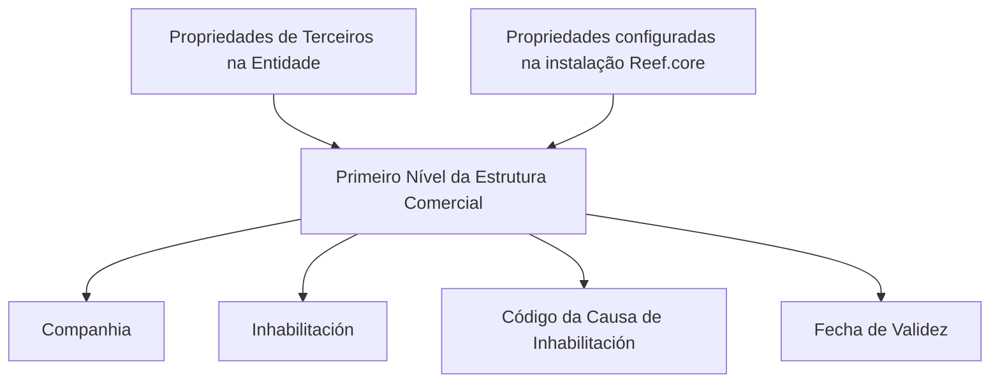

# Definição do Primeiro Nível da Estrutura Comercial no Reef

## 1. Metadados do Documento
- **Arquivo de Origem:** Não identificado
- **Tipo de Documento:** Especificação Funcional
- **Domínio / Sistema:** Reef / Reef.core / Estrutura Comercial
- **Público-Alvo:** Negócio, analistas funcionais, configuradores e operação
- **Data/Versão Identificada:** Não identificada

---

## 2. Resumo Executivo & Contexto de Negócio

O documento descreve a definição do **Primeiro Nível da Estrutura Comercial** no sistema Reef. O conteúdo organiza as propriedades relacionadas a esse nível em contexto, objetivo, propriedades identificativas, dados de contacto, propriedades operativas e outras propriedades.

A propriedade **Companhia** informa ao sistema o código da companhia sobre a qual está sendo realizada a definição do Primeiro Nível da Estrutura Comercial. Essa propriedade é apresentada como elemento identificativo da definição comercial.

Nas propriedades operativas, o documento especifica a **Inhabilitación**, que informa ao sistema que o Primeiro Nível da Estrutura Comercial está desativado. Também apresenta o **Código da Causa de Inhabilitación**, aplicável quando o Tramitador está inabilitado, e a **Fecha de Validez**, que controla a disponibilidade temporal da definição no sistema.

A configuração correta da data de validade permite manter histórico das alterações feitas nas definições da Estrutura Comercial, além de permitir rastrear e explorar posteriormente essas informações. O documento também recomenda considerar propriedades de Terceiros definidas na Entidade e propriedades configuradas na instalação do Reef.core.

---

## 3. Arquitetura, Componentes & Tecnologias Envolvidas

Os elementos explicitamente citados são:

| Componente / Conceito | Papel descrito |
| :--- | :--- |
| Reef | Sistema/documentação onde a definição é apresentada |
| Reef.core | Instalação cuja configuração de propriedades deve ser considerada |
| Primeiro Nível da Estrutura Comercial | Nível comercial definido e administrado no sistema |
| Companhia | Código da companhia associada à definição |
| Tramitador | Entidade mencionada no contexto de inabilitação |
| Terceiro | Entidade cujas propriedades devem ser consideradas |
| Entidade | Local onde são realizadas propriedades de Terceiros |



**Nota de Análise:** O documento menciona Reef e Reef.core, mas não detalha arquitetura de infraestrutura, integrações, APIs, métodos HTTP, contratos JSON, persistência de dados ou tecnologias de implementação.

---

## 4. Regras de Negócio, Especificações Funcionais & Processos

1. A definição do Primeiro Nível da Estrutura Comercial possui propriedades identificativas, dados de contacto, propriedades operativas e outras propriedades.
2. A propriedade **Companhia** indica o código da companhia sobre a qual está sendo realizada a definição do Primeiro Nível da Estrutura Comercial.
3. A propriedade **Inhabilitación** indica ao sistema que o Primeiro Nível da Estrutura Comercial está desativado.
4. Quando o Tramitador está inabilitado, o atributo **Código da Causa de Inhabilitación** deve indicar, de acordo com o código de atividade do Terceiro, o código da causa de inabilitação do Terceiro no sistema.
5. A **Fecha de Validez** estabelece a data a partir da qual a definição do nível da Estrutura Comercial fica disponível no sistema para uso.
6. A configuração correta da data de validade habilita a manutenção de histórico das alterações realizadas nas definições.
7. O histórico das definições pode ser rastreado e explorado posteriormente.
8. Para codificação, uso e definição local desse nível da Estrutura Comercial, devem ser consideradas:
   - As propriedades de Terceiros realizadas na definição da Entidade.
   - As propriedades configuradas na instalação do Reef.core.

**Nota de Análise:** O documento não especifica formatos de código, valores permitidos, obrigatoriedade de campos, regras de validação de data, responsáveis pela configuração ou comportamento do sistema para datas inválidas.

---

## 5. Tabelas de Parâmetros, Ambientes e Estruturas de Dados

| Item / Parâmetro | Descrição / Função | Tipo / Valores / Formato | Ambiente / Observações |
| :--- | :--- | :--- | :--- |
| Companhia | Indica o código da companhia sobre a qual é realizada a definição do Primeiro Nível da Estrutura Comercial. | Código de companhia; formato não detalhado. | Propriedade identificativa. |
| Inhabilitación | Indica ao sistema que o Primeiro Nível da Estrutura Comercial está desativado. | Estado de inabilitação; valores não detalhados. | Propriedade operativa. |
| Código da Causa de Inhabilitación | Indica o código da causa de inabilitação do Terceiro no sistema quando o Tramitador está inabilitado. | Código; formato não detalhado. | Relacionado ao código de atividade do Terceiro. |
| Fecha de Validez | Define a data a partir da qual a definição do nível da Estrutura Comercial fica disponível para uso. | Data; formato não detalhado. | Permite histórico, rastreabilidade e exploração posterior das alterações. |
| Propriedades de Terceiros | Propriedades que devem ser consideradas na definição, codificação e uso local do nível comercial. | Não detalhado. | Realizadas na definição da Entidade. |
| Propriedades da instalação Reef.core | Propriedades que devem ser consideradas na definição, codificação e uso local do nível comercial. | Não detalhado. | Configuradas na instalação do Reef.core. |

---

## 6. Bateria de Perguntas & Respostas para RAG (FAQ Sintético)

### P1: Qual é a finalidade da propriedade Companhia na definição do Primeiro Nível da Estrutura Comercial?
**R:** A propriedade Companhia indica ao sistema o código da companhia sobre a qual está sendo realizada a definição do Primeiro Nível da Estrutura Comercial.

### P2: O que a propriedade Inhabilitación representa no Reef?
**R:** A propriedade Inhabilitación informa ao sistema que o Primeiro Nível da Estrutura Comercial se encontra desativado.

### P3: Quando deve ser informado o Código da Causa de Inhabilitación?
**R:** O Código da Causa de Inhabilitación é aplicável quando o Tramitador está inabilitado. Nesse caso, o atributo indica, de acordo com o código de atividade do Terceiro, o código da causa de inabilitação do Terceiro no sistema.

### P4: Qual é a função da Fecha de Validez?
**R:** A Fecha de Validez estabelece a data a partir da qual a definição do nível da Estrutura Comercial está disponível no sistema para utilização.

### P5: Por que a configuração da Fecha de Validez é importante?
**R:** Uma configuração correta da Fecha de Validez permite manter o histórico das alterações realizadas nas definições e possibilita rastrear e explorar posteriormente essas informações.

### P6: Quais propriedades devem ser consideradas localmente na codificação e uso do nível da Estrutura Comercial?
**R:** Devem ser consideradas tanto as propriedades de Terceiros realizadas na definição da Entidade quanto as propriedades configuradas na instalação do Reef.core.

### P7: O documento define o formato do código da Companhia?
**R:** Não. O documento afirma que Companhia indica o código da companhia, mas não detalha formato, tamanho, valores válidos ou regra de validação desse código.

### P8: O documento especifica como ocorre a desativação do Primeiro Nível da Estrutura Comercial?
**R:** Não em detalhe. O documento somente informa que a propriedade Inhabilitación indica ao sistema que o Primeiro Nível da Estrutura Comercial está desativado; não descreve fluxo operacional, permissões ou efeitos adicionais da desativação.

### P9: O documento descreve APIs ou interfaces de integração do Reef?
**R:** Não. O conteúdo não detalha métodos HTTP, APIs, contratos de integração, estruturas JSON, URLs ou mecanismos de comunicação entre sistemas.

### P10: Que benefício operacional é associado ao histórico das definições?
**R:** O histórico habilitado pela correta configuração da Fecha de Validez permite rastrear e explorar posteriormente as alterações efetuadas nas definições da Estrutura Comercial.

---

## 7. Glossário de Termos, Siglas & Conceitos-Chave

- **Reef:** Sistema ou contexto documental citado para a definição da Estrutura Comercial.
- **Reef.core:** Instalação do Reef cujas propriedades configuradas devem ser consideradas.
- **Primeiro Nível da Estrutura Comercial:** Nível da Estrutura Comercial cuja definição é objeto do documento.
- **Companhia:** Propriedade que informa o código da companhia associada à definição.
- **Inhabilitación:** Propriedade que indica que o Primeiro Nível da Estrutura Comercial está desativado.
- **Código da Causa de Inhabilitación:** Atributo que indica a causa de inabilitação do Terceiro quando o Tramitador está inabilitado.
- **Fecha de Validez:** Data a partir da qual a definição do nível da Estrutura Comercial fica disponível para uso.
- **Tramitador:** Termo citado como entidade que pode estar inabilitada; não possui definição adicional no documento.
- **Terceiro:** Entidade cujas propriedades e código de atividade são considerados; não possui definição adicional no documento.
- **Entidade:** Contexto de definição em que são realizadas propriedades de Terceiros.

---

## 8. Notas Críticas, Riscos & Limitações

- O documento recomenda a leitura de diretrizes e documentos funcionais relacionados, pois a interpretação isolada pode conduzir a erro.
- Não há detalhamento de formatos, domínios de valores, obrigatoriedade ou validações para Companhia, Inhabilitación, Código da Causa de Inhabilitación e Fecha de Validez.
- Não são descritos os vínculos concretos, apesar de existir uma seção denominada “Vínculos”.
- Não há detalhamento sobre a relação semântica entre Tramitador e Terceiro além da regra associada ao Código da Causa de Inhabilitación.
- Não são informadas versões, datas, responsáveis técnicos, URLs de ambiente, rotas de log ou informações de infraestrutura.
- Não há descrição de integrações, APIs, permissões, fluxo de aprovação, persistência ou comportamento de erro.

---

## 9. Conteúdo Bruto Estruturado (Referência Fiel)

```text
--- [PÁGINA 1 DE 2] ---

DEFINICIÓN del PRIMER NIVEL de la ESTRUCTURA COMERCIAL
Contexto
Objetivo
Propiedades Identicativas
Datos de Contacto
Propiedades Operativas
Otras Propiedades
Propiedades Identicativas
Compañía
Esta propiedad le indica al sistema el código de la compañía sobre la que se está realizando la denición del Primer Nivel de la Estructura
Comercial.
Datos de Contacto
Propiedades Operativas
Otras Propiedades
Inhabilitación
Esta propiedad le indica al Sistema que el Primer Nivel de la Estructura Comercial se encuentra desactivado.
Código de la Causa de Inhabilitación
Si el Tramitador está inhabilitado, este Atributo indicará de acuerdo con el código de actividad del Tercero, el código de la Causa de la
Inhabilitación del Tercero en el sistema.
Fecha de Validez
Esta propiedad establece la fecha a partir de la cual la denición del Nivel de la Estructura Comercial está disponible en el sistema para ser
utilizado, por lo que una correcta conguración habilita tener un histórico de los cambios efectuados en sus deniciones y poder así trazar y
explotar posteriormente esta información.
Documentation / DOCUMENTACIÓN Reef
DOCUMENTACIÓN Reef
Mapfredocument
DOCUMENTACIÓN Reef
Owner
user:agonzalez_mapfre.com
Lifecycle
Approved Source
 /
VL
Buscar Inicio Soluciones Arquitecturas APIs Componentes Cloud Documentación Zeus Reef Ayuda
ES


--- [PÁGINA 2 DE 2] ---

Vínculos
Relación de Directrices y Documentos funcionales cuya lectura recomendada para evitar que la interpretación aislada del presente
documento pueda conducir a error.
Preguntas frecuentes
(1) ¿Existe alguna particularidad operativa que deba ser tomada en consideración localmente en la codicación, uso y denición de este Nivel
de la Estructura Comercial en el Sistema?
Se debe considerar tanto las Propiedades de Terceros realizadas en la denición de la Entidad, como aquellas Propiedades conguradas en
la Instalación de Reef.core.
```
