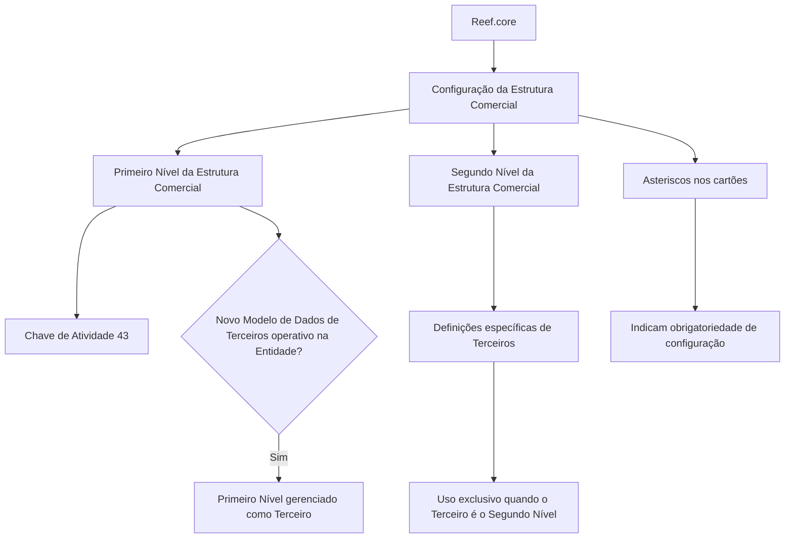

# Definição do Segundo Nível da Estrutura Comercial no Reef.core

## 1. Metadados do Documento
- **Arquivo de Origem:** Não identificado no conteúdo fornecido
- **Tipo de Documento:** Documentação de sistema / especificação funcional
- **Domínio / Sistema:** Reef.core; Estrutura Comercial; Terceiros
- **Público-Alvo:** Desenvolvedores, Arquitetos, Analistas Funcionais e Operação
- **Data/Versão Identificada:** Não identificada

---

## 2. Resumo Executivo & Contexto de Negócio

O conteúdo descreve a configuração, no sistema Reef.core, dos elementos necessários para definir os Segundos Níveis da Estrutura Comercial. Esses elementos são utilizados posteriormente na operação do sistema.

O sistema identifica o Primeiro Nível da Estrutura Comercial pela Chave de Atividade `43`. O documento também estabelece uma condição para o tratamento desse Primeiro Nível: ele é gerenciado como um Terceiro quando o Novo Modelo de Dados de Terceiros está operativo na entidade.

A documentação indica que existem definições específicas aplicáveis exclusivamente quando um Terceiro representa o Segundo Nível da Estrutura Comercial. Essas definições ficam agrupadas em uma área funcional própria para esse tipo de Terceiro.

Os asteriscos nas telas ou cartões de configuração sinalizam se determinado elemento é obrigatório para a definição dos Segundos Níveis da Estrutura Comercial. O excerto não detalha quais cartões existem, quais campos são obrigatórios nem como a obrigatoriedade é validada.

---

## 3. Arquitetura, Componentes & Tecnologias Envolvidas

| Componente / Conceito | Papel descrito |
| :--- | :--- |
| **Reef.core** | Sistema no qual são configurados os Segundos Níveis da Estrutura Comercial. |
| **Estrutura Comercial** | Estrutura que contém, ao menos, Primeiro Nível e Segundo Nível. |
| **Primeiro Nível da Estrutura Comercial** | Identificado pelo sistema com a Chave de Atividade `43`. |
| **Segundo Nível da Estrutura Comercial** | Configurado no Reef.core para permitir operação posterior no sistema. |
| **Terceiro** | Entidade pela qual o Primeiro Nível é gerenciado quando o Novo Modelo de Dados de Terceiros está operativo. Também pode representar o Segundo Nível para fins de definições específicas. |
| **Novo Modelo de Dados de Terceiros** | Condição mencionada para que o Primeiro Nível seja gerenciado como Terceiro. |
| **Documentación Reef / Mapfredocument** | Contexto documental exibido no conteúdo original. |
| **Zeus** | Item de navegação citado no cabeçalho documental, sem relação funcional detalhada. |



> **Nota de Análise:** O conteúdo não especifica interfaces, APIs, métodos HTTP, contratos de dados, bancos de dados, tecnologias de infraestrutura ou integrações externas do Reef.core.

---

## 4. Regras de Negócio, Especificações Funcionais & Processos

1. Os elementos de configuração devem permitir definir, no Reef.core, os Segundos Níveis da Estrutura Comercial.
2. A finalidade da configuração dos Segundos Níveis da Estrutura Comercial é permitir que sejam operados posteriormente no sistema.
3. O sistema identifica o Primeiro Nível da Estrutura Comercial pela **Chave de Atividade `43`**.
4. O Primeiro Nível da Estrutura Comercial é gerenciado como um **Terceiro** quando o **Novo Modelo de Dados de Terceiros** está operativo na entidade.
5. Existe um grupo de definições específicas destinado ao cenário em que o Terceiro corresponde ao **Segundo Nível da Estrutura Comercial**.
6. As definições específicas desse grupo são utilizadas exclusivamente quando o Terceiro é o Segundo Nível da Estrutura Comercial.
7. Asteriscos exibidos nos cartões de configuração indicam se a configuração de um elemento é obrigatória em relação à definição dos Segundos Níveis da Estrutura Comercial.

> **Nota de Análise:** O documento não apresenta os nomes dos cartões, campos, valores permitidos, mensagens de validação, sequência operacional detalhada ou critérios técnicos que determinem quando o Novo Modelo de Dados de Terceiros está operativo.

---

## 5. Tabelas de Parâmetros, Ambientes e Estruturas de Dados

| Item / Parâmetro | Descrição / Função | Tipo / Valores / Formato | Ambiente / Observações |
| :--- | :--- | :--- | :--- |
| Primeiro Nível da Estrutura Comercial | Nível identificado pelo sistema dentro da Estrutura Comercial. | Chave de Atividade `43` | O documento afirma que o sistema o identifica com essa chave. |
| Segundo Nível da Estrutura Comercial | Nível configurado no Reef.core para operação posterior. | Não detalhado | Há definições específicas quando um Terceiro representa esse nível. |
| Chave de Atividade | Identificador do Primeiro Nível da Estrutura Comercial. | `43` | Único valor explícito no conteúdo. |
| Terceiro | Entidade de gestão do Primeiro Nível ou contexto para definições específicas do Segundo Nível. | Não detalhado | O Primeiro Nível é gerenciado como Terceiro sob condição específica. |
| Novo Modelo de Dados de Terceiros | Modelo cuja condição operacional determina o tratamento do Primeiro Nível como Terceiro. | Operativo / não operativo não detalhado | Deve estar operativo na entidade para a regra ser aplicada. |
| Asteriscos de cartões | Indicadores de obrigatoriedade de elementos de configuração. | Indicador visual | Aplicável à definição dos Segundos Níveis da Estrutura Comercial. |
| Reef.core | Sistema de configuração e operação posterior da estrutura. | Sistema | Não há URL, ambiente, versão ou servidor informados. |
| Owner | Proprietário exibido nos metadados de navegação documental. | `user:agonzalez_mapfre.com` | Informação apresentada literalmente no conteúdo. |
| Lifecycle | Estado de ciclo de vida exibido no conteúdo. | `Approved Source` | Não há detalhamento adicional. |
| Idioma | Idioma exibido no menu da documentação. | `ES` | O conteúdo principal está em espanhol. |

---

## 6. Bateria de Perguntas & Respostas para RAG (FAQ Sintético)

### P1: Qual é o objetivo da configuração do Segundo Nível da Estrutura Comercial no Reef.core?
**R:** O objetivo é configurar, no Reef.core, os elementos que permitem definir os Segundos Níveis da Estrutura Comercial para que esses níveis possam ser operados posteriormente no sistema.

### P2: Qual Chave de Atividade identifica o Primeiro Nível da Estrutura Comercial?
**R:** O sistema identifica o Primeiro Nível da Estrutura Comercial pela Chave de Atividade `43`.

### P3: Quando o Primeiro Nível da Estrutura Comercial é gerenciado como um Terceiro?
**R:** O Primeiro Nível da Estrutura Comercial é gerenciado como um Terceiro quando o Novo Modelo de Dados de Terceiros está operativo na entidade.

### P4: Para que servem as definições específicas de Terceiros mencionadas no documento?
**R:** As definições específicas são utilizadas exclusivamente quando o Terceiro representa o Segundo Nível da Estrutura Comercial.

### P5: O que significam os asteriscos exibidos nos cartões de configuração?
**R:** Os asteriscos indicam se a configuração de cada elemento é obrigatória em relação à definição dos Segundos Níveis da Estrutura Comercial.

### P6: O documento informa quais campos ou cartões são obrigatórios?
**R:** Não. O conteúdo informa apenas que os asteriscos indicam obrigatoriedade, mas não lista os cartões, os campos nem as regras de preenchimento associadas.

### P7: O documento detalha APIs, serviços ou contratos JSON do Reef.core?
**R:** Não. O conteúdo não descreve APIs, métodos HTTP, microsserviços, contratos JSON, endpoints ou integrações técnicas do Reef.core.

### P8: O que acontece se o Novo Modelo de Dados de Terceiros não estiver operativo?
**R:** O conteúdo não descreve o comportamento para essa condição. Ele informa somente que o Primeiro Nível é gerenciado como Terceiro quando o Novo Modelo de Dados de Terceiros está operativo na entidade.

### P9: O Segundo Nível da Estrutura Comercial é tratado diretamente como Terceiro?
**R:** O documento afirma que há definições empregadas exclusivamente quando o Terceiro é o Segundo Nível da Estrutura Comercial. Não detalha, porém, o modelo de dados ou o mecanismo técnico dessa associação.

### P10: Há informações de ambiente, URL, servidor ou versão do Reef.core?
**R:** Não. O conteúdo não fornece URLs, ambientes, nomes de servidores, portas, versões de software ou parâmetros de implantação.

---

## 7. Glossário de Termos, Siglas & Conceitos-Chave

- **Reef.core:** Sistema citado como responsável pela configuração dos Segundos Níveis da Estrutura Comercial.
- **Estrutura Comercial:** Estrutura organizacional ou funcional composta, no mínimo, por Primeiro Nível e Segundo Nível.
- **Primeiro Nível da Estrutura Comercial:** Nível identificado pelo sistema pela Chave de Atividade `43`.
- **Segundo Nível da Estrutura Comercial:** Nível configurado no Reef.core e associado a definições específicas quando representado por um Terceiro.
- **Terceiro:** Entidade utilizada para gerenciar o Primeiro Nível quando o Novo Modelo de Dados de Terceiros está operativo; também é o contexto das definições específicas do Segundo Nível.
- **Novo Modelo de Dados de Terceiros:** Modelo citado como condição para que o Primeiro Nível seja gerenciado como Terceiro.
- **Chave de Atividade:** Identificador usado pelo sistema para reconhecer o Primeiro Nível da Estrutura Comercial; valor informado: `43`.
- **Lifecycle:** Metadado documental exibido com o valor `Approved Source`.
- **ES:** Indicador de idioma exibido na navegação da documentação.

---

## 8. Notas Críticas, Riscos & Limitações

- O conteúdo é um excerto resumido e não detalha campos, cartões, telas, permissões, operações ou validações do Reef.core.
- Não há definição operacional de “Novo Modelo de Dados de Terceiros operativo”, incluindo responsáveis, critérios de ativação ou impactos quando essa condição não é atendida.
- Não foram informados ambientes, URLs, servidores, credenciais, versões, integrações, APIs ou contratos de dados.
- A obrigatoriedade é indicada por asteriscos nos cartões, mas os elementos obrigatórios não foram enumerados.
- O texto extraído contém artefatos de codificação em palavras como `congurar`, `identica` e `Deniciones`; a transcrição bruta abaixo preserva esses artefatos para auditoria.
- O conteúdo cita `Mapfredocument`, `Zeus`, `Approved Source` e `user:agonzalez_mapfre.com`, mas não fornece explicação funcional adicional para esses termos.

---

## 9. Conteúdo Bruto Estruturado (Referência Fiel)

```text
--- [PÁGINA 1 DE 1] ---

DEFINICIÓN del SEGUNDO NIVEL de la ESTRUCTURA COMERCIAL
Se relacionan los elementos que permiten congurar en Reef.core a los Segundos Niveles de la Estructura Comercial para poder operar
posteriormente con ellos en el Sistema.
El Sistema identica al Primer Nivel de la Estructura Comercial con la Clave de Actividad... 43.
El Primer Nivel de la Estructura Comercial se gestiona como un Tercero siempre y cuando el Nuevo Modelo de Datos de Terceros esté
operativo en la Entidad.
Los Asteriscos de las Tarjetas indican si la conguración del elemento es obligatoria en relación con la denición de los Segundos Niveles
de la Estructura Comercial.
Deniciones ESPECÍFICAS, propias de los Terceros SEGUNDO NIVEL DE
LA ESTRUCTURA COMERCIAL
En este Grupo se encuentran deniciones que se emplean exclusivamente cuando el Tercero es el SEGUNDO
NIVEL DE LA ESTRUCTURA COMERCIAL.
Documentation / DOCUMENTACIÓN Reef
DOCUMENTACIÓN Reef
Mapfredocument
DOCUMENTACIÓN Reef
Owner
user:agonzalez_mapfre.com
Lifecycle
Approved Source
 / 
 VL
Buscar Inicio Soluciones Arquitecturas APIs Componentes Cloud Documentación Zeus Reef Ayuda
ES
```
