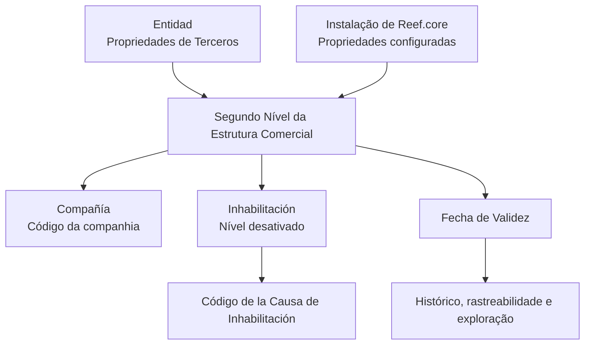

# Definição do Segundo Nível da Estrutura Comercial no Reef

## 1. Metadados do Documento
- **Arquivo de Origem:** Não identificado no conteúdo fornecido
- **Tipo de Documento:** Especificação Funcional
- **Domínio / Sistema:** Reef / Reef.core / Estrutura Comercial
- **Público-Alvo:** Analistas funcionais, configuradores e equipes operacionais
- **Data/Versão Identificada:** Não identificada

---

## 2. Resumo Executivo & Contexto de Negócio

O documento descreve propriedades associadas à definição do **Segundo Nível da Estrutura Comercial** no sistema Reef. O conteúdo organiza as propriedades em categorias: propriedades identificativas, dados de contacto, propriedades operativas e outras propriedades.

A propriedade **Compañía** informa ao sistema o código da companhia para a qual está sendo realizada a definição do Segundo Nível da Estrutura Comercial. A propriedade estabelece, portanto, o vínculo entre a definição do nível comercial e uma companhia identificada por código.

As propriedades operativas incluem a **Inhabilitación**, que sinaliza que o Segundo Nível da Estrutura Comercial está desativado. Quando o Tramitador estiver inabilitado, o **Código de la Causa de Inhabilitación** registra, segundo o código de atividade do Tercero, a causa de inabilitação do Tercero no sistema.

A **Fecha de Validez** define a data a partir da qual a definição do nível da Estrutura Comercial fica disponível para utilização no sistema. A configuração correta dessa data permite manter histórico das alterações efetuadas nas definições e suportar rastreabilidade e exploração posterior dessas informações.

---

## 3. Arquitetura, Componentes & Tecnologias Envolvidas

O conteúdo cita os seguintes elementos: sistema **Reef**, instalação **Reef.core**, Segundo Nível da Estrutura Comercial, Entidad, Tercero e Tramitador. Não são apresentados detalhes técnicos sobre APIs, protocolos, bancos de dados, métodos HTTP, contratos JSON, infraestrutura ou tecnologias de implementação.



> **Nota de Análise:** O diagrama representa relações funcionais explicitamente descritas no documento. O material não detalha interfaces técnicas, persistência de dados ou integrações entre componentes.

---

## 4. Regras de Negócio, Especificações Funcionais & Processos

1. A definição do Segundo Nível da Estrutura Comercial possui propriedades organizadas nas categorias:
   - Propriedades identificativas.
   - Dados de contacto.
   - Propriedades operativas.
   - Outras propriedades.

2. A propriedade **Compañía** deve indicar ao sistema o código da companhia sobre a qual está sendo realizada a definição do Segundo Nível da Estrutura Comercial.

3. A propriedade **Inhabilitación** indica ao sistema que o Segundo Nível da Estrutura Comercial está desativado.

4. Se o **Tramitador** estiver inabilitado, o atributo **Código de la Causa de Inhabilitación** deve indicar o código da causa de inabilitação do Tercero no sistema, de acordo com o código de atividade do Tercero.

5. A propriedade **Fecha de Validez** estabelece a data a partir da qual a definição do nível da Estrutura Comercial estará disponível no sistema para uso.

6. Uma configuração correta da **Fecha de Validez** permite:
   - Manter histórico das mudanças realizadas nas definições.
   - Rastrear alterações posteriormente.
   - Explorar posteriormente as informações históricas.

7. Para evitar interpretação isolada incorreta do documento, recomenda-se a leitura das diretrizes e dos documentos funcionais relacionados por meio da seção **Vínculos**.

8. Na codificação, no uso e na definição local do nível da Estrutura Comercial, devem ser consideradas:
   - As Propriedades de Terceros definidas na Entidad.
   - As propriedades configuradas na instalação de Reef.core.

---

## 5. Tabelas de Parâmetros, Ambientes e Estruturas de Dados

| Item / Parâmetro | Descrição / Função | Tipo / Valores / Formato | Ambiente / Observações |
| :--- | :--- | :--- | :--- |
| Segundo Nível da Estrutura Comercial | Nível da Estrutura Comercial objeto da definição documentada. | Não detalhado | Sistema Reef |
| Compañía | Indica o código da companhia sobre a qual é realizada a definição do Segundo Nível da Estrutura Comercial. | Código de companhia; formato não detalhado | Propriedade identificativa |
| Datos de Contacto | Categoria de propriedades apresentada pelo documento. | Não detalhado | Não há propriedades de contacto detalhadas no conteúdo |
| Inhabilitación | Informa que o Segundo Nível da Estrutura Comercial se encontra desativado. | Estado de inabilitação; valores não detalhados | Propriedade operativa |
| Código de la Causa de Inhabilitación | Indica a causa de inabilitação do Tercero quando o Tramitador estiver inabilitado. | Código; formato não detalhado | Determinado de acordo com o código de atividade do Tercero |
| Fecha de Validez | Estabelece a data a partir da qual a definição do nível fica disponível para uso no sistema. | Data; formato não detalhado | Suporta histórico, rastreabilidade e exploração posterior |
| Propriedades de Terceros | Propriedades que devem ser consideradas na definição, codificação e uso local do nível. | Não detalhado | Definidas na Entidad |
| Propriedades configuradas | Propriedades que devem ser consideradas na definição, codificação e uso local do nível. | Não detalhado | Configuradas na instalação de Reef.core |
| Reef.core | Instalação cujas propriedades configuradas devem ser consideradas. | Não detalhado | Ambiente/instalação citada |
| Owner | Proprietário indicado na página documental. | `user:agonzalez_mapfre.com` | Documentação Reef |
| Lifecycle | Estado do ciclo de vida indicado na página documental. | `Approved` | Documentação Reef |

---

## 6. Bateria de Perguntas & Respostas para RAG (FAQ Sintético)

### P1: Qual é o objetivo da propriedade Compañía na definição do Segundo Nível da Estrutura Comercial?
**R:** A propriedade **Compañía** informa ao sistema o código da companhia sobre a qual está sendo realizada a definição do Segundo Nível da Estrutura Comercial.

### P2: O que significa marcar Inhabilitación no Segundo Nível da Estrutura Comercial?
**R:** A propriedade **Inhabilitación** indica ao sistema que o Segundo Nível da Estrutura Comercial está desativado.

### P3: Quando o Código de la Causa de Inhabilitación deve ser utilizado?
**R:** O atributo **Código de la Causa de Inhabilitación** é aplicável quando o Tramitador estiver inabilitado. Nesse caso, o atributo indica, conforme o código de atividade do Tercero, o código da causa de inabilitação do Tercero no sistema.

### P4: Qual é a função da Fecha de Validez no Segundo Nível da Estrutura Comercial?
**R:** A **Fecha de Validez** estabelece a data a partir da qual a definição do nível da Estrutura Comercial fica disponível no sistema para utilização.

### P5: Como a Fecha de Validez contribui para a rastreabilidade das definições?
**R:** Uma configuração correta da **Fecha de Validez** permite conservar um histórico das mudanças efetuadas nas definições do nível da Estrutura Comercial, possibilitando rastrear e explorar posteriormente essas informações.

### P6: Quais grupos de propriedades são apresentados para o Segundo Nível da Estrutura Comercial?
**R:** O documento apresenta quatro grupos: propriedades identificativas, dados de contacto, propriedades operativas e outras propriedades.

### P7: Que configurações devem ser consideradas localmente ao codificar, usar ou definir esse nível comercial?
**R:** Devem ser consideradas tanto as Propriedades de Terceros realizadas na definição da Entidad quanto as propriedades configuradas na instalação de Reef.core.

### P8: O documento detalha os campos pertencentes a Dados de Contacto?
**R:** Não. O documento apresenta **Datos de Contacto** como categoria de propriedades, mas não fornece campos, formatos ou regras adicionais para essa categoria.

### P9: O documento informa métodos HTTP ou contratos JSON para o Segundo Nível da Estrutura Comercial?
**R:** Não. O conteúdo fornecido não descreve métodos HTTP, APIs, contratos JSON, integrações técnicas, persistência ou tecnologias de implementação.

### P10: Por que devem ser consultados os documentos relacionados na seção Vínculos?
**R:** A seção **Vínculos** relaciona diretrizes e documentos funcionais cuja leitura é recomendada para evitar que a interpretação isolada do documento atual conduza a erro.

---

## 7. Glossário de Termos, Siglas & Conceitos-Chave

- **Reef:** Sistema citado como contexto da documentação e da definição do Segundo Nível da Estrutura Comercial.
- **Reef.core:** Instalação do Reef cujas propriedades configuradas devem ser consideradas.
- **Segundo Nível da Estrutura Comercial:** Nível da estrutura comercial cuja definição e propriedades são tratadas no documento.
- **Compañía:** Propriedade que informa o código da companhia relacionada à definição do Segundo Nível da Estrutura Comercial.
- **Inhabilitación:** Propriedade que indica que o Segundo Nível da Estrutura Comercial está desativado.
- **Tramitador:** Entidade mencionada como passível de inabilitação; não há definição adicional no documento.
- **Tercero:** Entidade cujo código de atividade é usado para determinar o código da causa de inabilitação; não há definição adicional no documento.
- **Entidad:** Elemento no qual são realizadas as Propriedades de Terceros que devem ser consideradas localmente.
- **Fecha de Validez:** Data a partir da qual uma definição do nível da Estrutura Comercial fica disponível para uso.
- **Vínculos:** Seção que relaciona diretrizes e documentos funcionais recomendados para leitura complementar.

---

## 8. Notas Críticas, Riscos & Limitações

- O documento não identifica nome de arquivo, data, versão, autor técnico, tecnologias de implementação ou ambiente de execução.
- Não são detalhados valores permitidos, obrigatoriedade, formato, validações ou relacionamentos de persistência para os atributos apresentados.
- O documento cita Dados de Contacto e Otras Propiedades, mas não fornece detalhamento adicional dessas categorias.
- A interpretação isolada do documento pode conduzir a erro; a leitura das diretrizes e documentos funcionais relacionados em **Vínculos** é explicitamente recomendada.
- Não há detalhamento sobre o significado operacional de Tramitador, Tercero e Entidad além das relações expressamente indicadas.
- Não são descritos métodos HTTP, contratos JSON, URLs, logs, servidores, permissões, rotas de integração ou processos de implantação.

---

## 9. Conteúdo Bruto Estruturado (Referência Fiel)

```text
--- [PÁGINA 1 DE 2] ---

DEFINICIÓN del SEGUNDO NIVEL de la ESTRUCTURA COMERCIAL
Contexto
Objetivo
Propiedades Identicativas
Datos de Contacto
Propiedades Operativas
Otras Propiedades
Propiedades Identicativas
Compañía
Esta propiedad le indica al sistema el código de la compañía sobre la que se está realizando la denición del Segundo Nivel de la Estructura
Comercial.
Datos de Contacto
Propiedades Operativas
Otras Propiedades
Inhabilitación
Esta propiedad le indica al Sistema que el Segundo Nivel de la Estructura Comercial se encuentra desactivado.
Código de la Causa de Inhabilitación
Si el Tramitador está inhabilitado, este Atributo indicará de acuerdo con el código de actividad del Tercero, el código de la Causa de la
Inhabilitación del Tercero en el sistema.
Fecha de Validez
Esta propiedad establece la fecha a partir de la cual la denición del Nivel de la Estructura Comercial está disponible en el sistema para ser
utilizado, por lo que una correcta conguración habilita tener un histórico de los cambios efectuados en sus deniciones y poder así trazar y
explotar posteriormente esta información.
Documentation / DOCUMENTACIÓN Reef
DOCUMENTACIÓN Reef
Mapfredocument
DOCUMENTACIÓN Reef
Owner
user:agonzalez_mapfre.com
Lifecycle
Approved Source
 /
VL
Buscar Inicio Soluciones Arquitecturas APIs Componentes Cloud Documentación Zeus Reef Ayuda
ES

--- [PÁGINA 2 DE 2] ---

Vínculos
Relación de Directrices y Documentos funcionales cuya lectura recomendada para evitar que la interpretación aislada del presente
documento pueda conducir a error.
Preguntas frecuentes
(1) ¿Existe alguna particularidad operativa que deba ser tomada en consideración localmente en la codicación, uso y denición de este Nivel
de la Estructura Comercial en el Sistema?
Se debe considerar tanto las Propiedades de Terceros realizadas en la denición de la Entidad, como aquellas Propiedades conguradas en
la Instalación de Reef.core.
```
