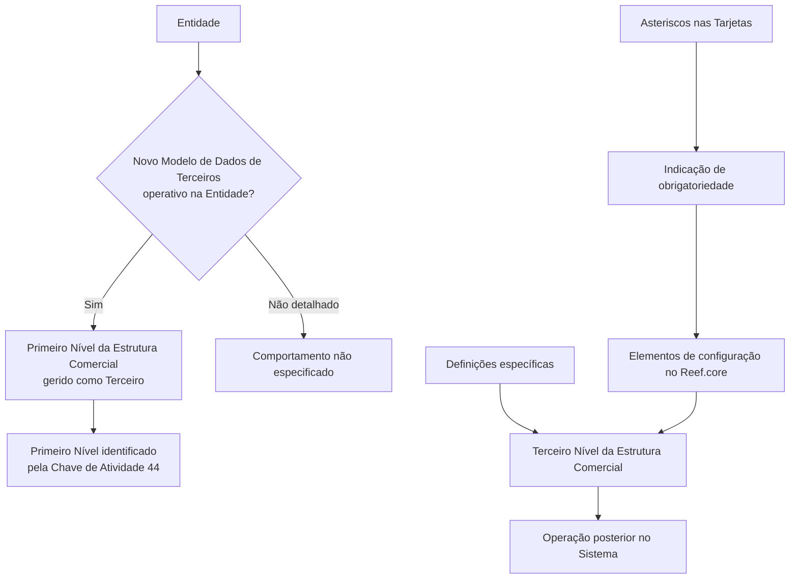

# Definição do Terceiro Nível da Estrutura Comercial no Reef.core

## 1. Metadados do Documento
- **Arquivo de Origem:** Não identificado no conteúdo fornecido
- **Tipo de Documento:** Especificação Técnica
- **Domínio / Sistema:** Reef.core / Documentação Reef / Mapfre
- **Público-Alvo:** Desenvolvedores, Arquitetos, Operação e Negócio
- **Data/Versão Identificada:** Não identificada
- **Status identificado:** Lifecycle `Approved Source`
- **Proprietário identificado:** `user:agonzalez_mapfre.com`

---

## 2. Resumo Executivo & Contexto de Negócio

O documento descreve a definição e a configuração dos **Terceiros Níveis da Estrutura Comercial** no sistema **Reef.core**. O objetivo declarado é relacionar os elementos necessários para configurar esses terceiros níveis, permitindo sua operação posterior dentro do sistema.

A documentação informa que o sistema identifica o **Primeiro Nível da Estrutura Comercial** pela **Chave de Atividade 44**. Também estabelece uma condição relevante: o Primeiro Nível é gerido como um terceiro somente quando o **Novo Modelo de Dados de Terceiros** está operacional na entidade.

A configuração dos elementos aparenta possuir requisitos de obrigatoriedade indicados por asteriscos nas “Tarjetas”. Esses asteriscos representam se determinado elemento é obrigatório para a definição dos Terceiros Níveis da Estrutura Comercial.

O conteúdo fornecido refere-se especificamente a definições exclusivas aplicáveis quando um terceiro representa o **Terceiro Nível da Estrutura Comercial**. Não são apresentados contratos técnicos, APIs, métodos HTTP, estruturas de dados detalhadas, telas, regras de cálculo ou procedimentos operacionais completos.

---

## 3. Arquitetura, Componentes & Tecnologias Envolvidas

### Componentes e conceitos identificados
- **Reef.core:** sistema no qual os Terceiros Níveis da Estrutura Comercial são configurados e posteriormente operados.
- **Estrutura Comercial:** estrutura organizacional composta, ao menos, por Primeiro Nível e Terceiro Nível.
- **Primeiro Nível da Estrutura Comercial:** identificado pelo sistema com a Chave de Atividade `44`.
- **Terceiro Nível da Estrutura Comercial:** categoria de terceiro tratada pelas definições específicas do documento.
- **Novo Modelo de Dados de Terceiros:** condição para que o Primeiro Nível da Estrutura Comercial seja gerido como um terceiro na entidade.
- **Entidade:** contexto organizacional no qual a operação do Novo Modelo de Dados de Terceiros determina o comportamento do Primeiro Nível.
- **Tarjetas:** elementos de documentação/configuração cujos asteriscos indicam obrigatoriedade.
- **Mapfredocument / DOCUMENTACIÓN Reef:** referências de repositório ou contexto documental presentes no conteúdo.



> **Nota de Análise:** O documento menciona o Reef.core e a configuração dos Terceiros Níveis da Estrutura Comercial, mas não detalha arquitetura de infraestrutura, interfaces, bancos de dados, APIs, tecnologias de implementação ou contratos de integração.

---

## 4. Regras de Negócio, Especificações Funcionais & Processos

1. O Reef.core deve permitir a configuração dos elementos necessários para operar posteriormente com os **Terceiros Níveis da Estrutura Comercial**.
2. O sistema identifica o **Primeiro Nível da Estrutura Comercial** com a **Chave de Atividade 44**.
3. O Primeiro Nível da Estrutura Comercial é gerido como um terceiro apenas se o **Novo Modelo de Dados de Terceiros** estiver operacional na entidade.
4. Os asteriscos presentes nas Tarjetas indicam se a configuração de um elemento é obrigatória em relação à definição dos Terceiros Níveis da Estrutura Comercial.
5. O grupo de definições apresentado é de uso exclusivo quando o terceiro é classificado como **Terceiro Nível da Estrutura Comercial**.
6. O conteúdo não fornece critérios adicionais para classificar um terceiro, nem explica como cadastrar, validar, alterar, excluir ou consultar um Terceiro Nível da Estrutura Comercial.
7. O conteúdo não especifica o comportamento aplicável caso o Novo Modelo de Dados de Terceiros não esteja operacional na entidade.

---

## 5. Tabelas de Parâmetros, Ambientes e Estruturas de Dados

| Item / Parâmetro | Descrição / Função | Tipo / Valores / Formato | Ambiente / Observações |
| :--- | :--- | :--- | :--- |
| Sistema | Plataforma onde são configurados os Terceiros Níveis da Estrutura Comercial | `Reef.core` | O documento informa que a configuração permite operação posterior no sistema |
| Estrutura Comercial | Domínio organizacional tratado pela documentação | Primeiro Nível e Terceiro Nível são citados | Não há detalhamento completo de todos os níveis |
| Primeiro Nível da Estrutura Comercial | Nível identificado pelo sistema | Chave de Atividade `44` | Pode ser gerido como terceiro sob condição específica |
| Chave de Atividade | Identificador do Primeiro Nível da Estrutura Comercial | `44` | Valor explicitamente apresentado no documento |
| Novo Modelo de Dados de Terceiros | Condição que habilita a gestão do Primeiro Nível como terceiro | Estado operacional na entidade | Não são fornecidos critérios técnicos para determinar operacionalidade |
| Terceiro Nível da Estrutura Comercial | Tipo de terceiro ao qual se aplicam definições específicas | Conceito funcional | O documento não detalha atributos, identificadores ou estrutura cadastral |
| Tarjetas | Artefatos que apresentam indicadores de obrigatoriedade | Asteriscos | Os asteriscos sinalizam obrigatoriedade de configuração de elementos |
| Lifecycle | Estado documental identificado | `Approved Source` | Metadado exibido no conteúdo bruto |
| Owner | Proprietário identificado no conteúdo | `user:agonzalez_mapfre.com` | Metadado exibido no conteúdo bruto |
| Idioma da interface | Idioma exibido na navegação documental | `ES` | O conteúdo principal está em espanhol |

---

## 6. Bateria de Perguntas & Respostas para RAG (FAQ Sintético)

### P1: Qual é o objetivo da documentação sobre o Terceiro Nível da Estrutura Comercial?
**R:** O objetivo é relacionar os elementos que permitem configurar no Reef.core os Terceiros Níveis da Estrutura Comercial, para que possam ser operados posteriormente no sistema.

### P2: Qual chave de atividade identifica o Primeiro Nível da Estrutura Comercial?
**R:** O sistema identifica o Primeiro Nível da Estrutura Comercial pela Chave de Atividade `44`.

### P3: Em qual condição o Primeiro Nível da Estrutura Comercial é gerido como um terceiro?
**R:** O Primeiro Nível da Estrutura Comercial é gerido como um terceiro quando o Novo Modelo de Dados de Terceiros está operacional na entidade.

### P4: O que os asteriscos nas Tarjetas representam?
**R:** Os asteriscos nas Tarjetas indicam se a configuração de cada elemento é obrigatória em relação à definição dos Terceiros Níveis da Estrutura Comercial.

### P5: As definições apresentadas podem ser usadas para qualquer tipo de terceiro?
**R:** Não. O documento informa que o grupo contém definições utilizadas exclusivamente quando o terceiro é o Terceiro Nível da Estrutura Comercial.

### P6: O documento especifica APIs, métodos HTTP ou contratos JSON do Reef.core?
**R:** Não. O conteúdo fornecido não detalha APIs, métodos HTTP, contratos JSON, endpoints, tecnologias de integração ou estruturas técnicas de dados.

### P7: O que acontece se o Novo Modelo de Dados de Terceiros não estiver operacional na entidade?
**R:** O documento apenas define o comportamento quando o modelo está operacional: o Primeiro Nível é gerido como terceiro. O comportamento no cenário contrário não é detalhado.

### P8: O documento apresenta os campos necessários para cadastrar um Terceiro Nível da Estrutura Comercial?
**R:** Não. O conteúdo informa que existem elementos de configuração e que a obrigatoriedade é indicada por asteriscos nas Tarjetas, mas não lista os campos, tipos, formatos ou validações desses elementos.

### P9: Qual sistema é responsável por configurar os Terceiros Níveis da Estrutura Comercial?
**R:** O sistema citado para configuração e operação posterior dos Terceiros Níveis da Estrutura Comercial é o Reef.core.

### P10: Qual é o status documental identificado no conteúdo?
**R:** O conteúdo apresenta o Lifecycle como `Approved Source`.

---

## 7. Glossário de Termos, Siglas & Conceitos-Chave

- **Reef.core:** Sistema citado como responsável pela configuração e operação dos Terceiros Níveis da Estrutura Comercial.
- **Estrutura Comercial:** Estrutura organizacional que inclui, no conteúdo fornecido, o Primeiro Nível e o Terceiro Nível.
- **Primeiro Nível da Estrutura Comercial:** Nível identificado pelo sistema pela Chave de Atividade `44`.
- **Terceiro Nível da Estrutura Comercial:** Tipo de terceiro para o qual o documento apresenta definições específicas.
- **Terceiro:** Entidade tratada pelo sistema; o Primeiro Nível pode ser gerido como terceiro quando o Novo Modelo de Dados de Terceiros é operacional na entidade.
- **Novo Modelo de Dados de Terceiros:** Modelo cuja operação na entidade condiciona a gestão do Primeiro Nível como terceiro.
- **Chave de Atividade:** Identificador usado pelo sistema; o valor `44` identifica o Primeiro Nível da Estrutura Comercial.
- **Tarjetas:** Elementos de documentação ou configuração onde asteriscos indicam obrigatoriedade.
- **Lifecycle:** Metadado de ciclo de vida documental, apresentado como `Approved Source`.
- **Owner:** Metadado de responsável documental, apresentado como `user:agonzalez_mapfre.com`.

---

## 8. Notas Críticas, Riscos & Limitações

- O conteúdo fornecido é parcial e não apresenta o nome do arquivo original, data, versão, autor formal ou paginação completa.
- Há caracteres de codificação corrompidos na extração, como em `congurar`, `identica` e `Deniciones`. A interpretação foi limitada ao texto semanticamente legível, sem alteração dos fatos.
- O documento não detalha os elementos concretos de configuração dos Terceiros Níveis da Estrutura Comercial.
- Não há especificação de campos, tabelas de banco de dados, regras de validação, mensagens de erro, fluxos de interface ou permissões.
- Não são documentados APIs, integrações, métodos HTTP, URLs, ambientes, servidores, logs, filas ou contratos de dados.
- O comportamento quando o Novo Modelo de Dados de Terceiros não está operacional não é especificado.
- Não é possível inferir a quantidade total de níveis da Estrutura Comercial apenas com o conteúdo disponibilizado.
- **Nota de Análise:** O documento lista o Reef.core e o Terceiro Nível da Estrutura Comercial, porém não detalha procedimentos técnicos para implementação, suporte operacional ou integração.

---

## 9. Conteúdo Bruto Estruturado (Referência Fiel)

```text
--- [PÁGINA 1 DE 1] ---

DEFINICIÓN del TERCER NIVEL de la ESTRUCTURA COMERCIAL
Se relacionan los elementos que permiten congurar en Reef.core a los Terceros Niveles de la Estructura Comercial para poder operar
posteriormente con ellos en el Sistema.
El Sistema identica al Primer Nivel de la Estructura Comercial con la Clave de Actividad... 44.
El Primer Nivel de la Estructura Comercial se gestiona como un Tercero siempre y cuando el Nuevo Modelo de Datos de Terceros sea
operativo en la Entidad.
Los Asteriscos de las Tarjetas indican si la conguración del elemento es obligatoria en relación con la denición de los Terceros Niveles
de la Estructura Comercial.
Deniciones ESPECÍFICAS, propias de los Terceros TERCER NIVEL DE
LA ESTRUCTURA COMERCIAL
En este Grupo se encuentran deniciones que se emplean exclusivamente cuando el Tercero es el TERCER
NIVEL DE LA ESTRUCTURA COMERCIAL.
Documentation / DOCUMENTACIÓN Reef
DOCUMENTACIÓN Reef
Mapfredocument
DOCUMENTACIÓN Reef
Owner
user:agonzalez_mapfre.com
Lifecycle
Approved Source
 / 
 VL
Buscar Inicio Soluciones Arquitecturas APIs Componentes Cloud Documentación Zeus Reef Ayuda
ES
```
