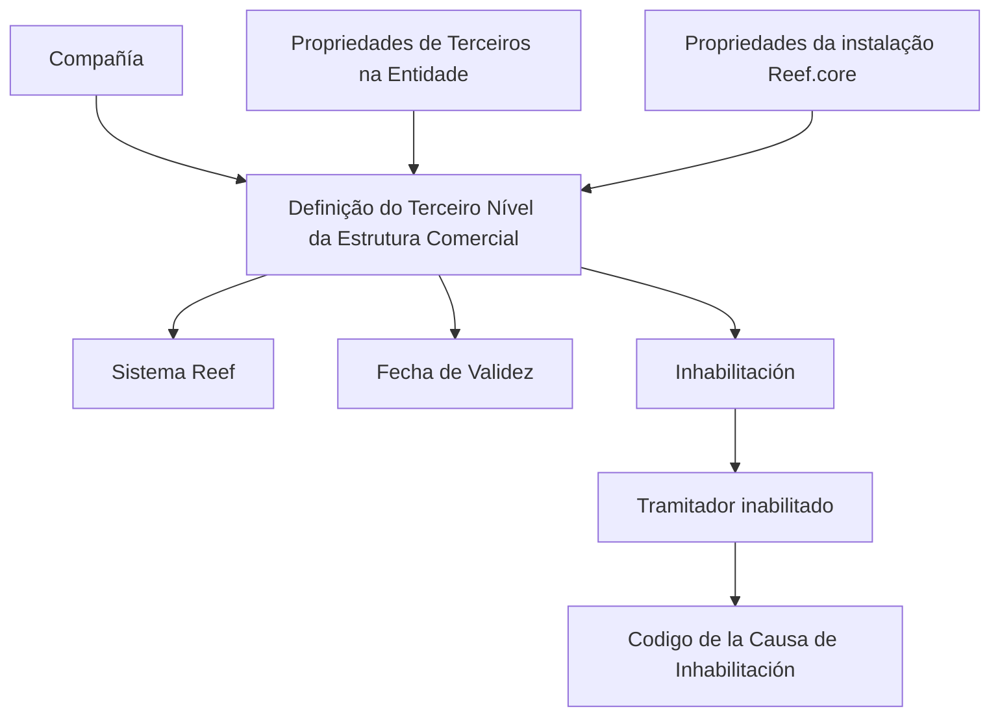

# Definição do Terceiro Nível da Estrutura Comercial no Reef

## 1. Metadados do Documento
- **Arquivo de Origem:** Não identificado no conteúdo extraído
- **Tipo de Documento:** Especificação Funcional
- **Domínio / Sistema:** Estrutura Comercial / Reef / Reef.core
- **Público-Alvo:** Analistas funcionais, configuradores e operadores do sistema
- **Data/Versão Identificada:** Não identificada

---

## 2. Resumo Executivo & Contexto de Negócio

O documento descreve a definição do **Terceiro Nível da Estrutura Comercial** no sistema Reef. O conteúdo organiza propriedades identificativas, dados de contacto, propriedades operativas e outras propriedades associadas a esse nível da estrutura comercial.

A propriedade **Compañía** identifica o código da companhia sobre a qual está a ser realizada a definição do Terceiro Nível da Estrutura Comercial. Esta propriedade vincula a definição estrutural a uma companhia específica no sistema.

As propriedades operativas incluem a possibilidade de **Inhabilitación**, indicando que o Terceiro Nível da Estrutura Comercial se encontra desativado. Quando o Tramitador está inabilitado, o documento prevê o uso do **Código de la Causa de Inhabilitación**, determinado de acordo com o código de atividade do Terceiro.

A propriedade **Fecha de Validez** define a data a partir da qual a definição do nível comercial fica disponível para uso no sistema. A configuração correta desta data permite preservar histórico de alterações, rastrear mudanças e explorar posteriormente as informações históricas.

O documento recomenda leitura de diretrizes e documentos funcionais relacionados para evitar interpretações isoladas. Também informa que, para codificação, uso e definição local do nível comercial, devem ser consideradas as propriedades de Terceiros definidas na Entidade e as propriedades configuradas na instalação do Reef.core.

---

## 3. Arquitetura, Componentes & Tecnologias Envolvidas

| Componente / Elemento | Papel identificado no documento | Detalhamento disponível |
| :--- | :--- | :--- |
| Terceiro Nível da Estrutura Comercial | Nível estrutural comercial cuja definição é documentada | Possui propriedades identificativas, de contacto, operativas e outras propriedades |
| Sistema Reef | Sistema que utiliza a definição do nível da estrutura comercial | O documento não detalha arquitetura técnica, interfaces ou tecnologias |
| Reef.core | Instalação cujas propriedades configuradas devem ser consideradas | Não há detalhamento sobre configuração, versão ou ambiente |
| Entidade | Contexto onde são realizadas propriedades de Terceiros | Não há detalhamento sobre a entidade ou os seus atributos |
| Tramitador | Terceiro cuja inabilitação pode determinar uma causa de inabilitação | Não há detalhamento adicional sobre o papel operacional |



> **Nota de Análise:** O documento não descreve microsserviços, APIs, métodos HTTP, contratos JSON, servidores, URLs, tecnologias de implementação ou ambientes técnicos.

---

## 4. Regras de Negócio, Especificações Funcionais & Processos

1. A definição do Terceiro Nível da Estrutura Comercial deve informar a propriedade **Compañía**.
2. A propriedade **Compañía** indica ao sistema o código da companhia sobre a qual a definição está a ser realizada.
3. A propriedade **Inhabilitación** informa ao sistema que o Terceiro Nível da Estrutura Comercial está desativado.
4. Quando o **Tramitador** estiver inabilitado, o atributo **Código de la Causa de Inhabilitación** deve indicar, conforme o código de atividade do Terceiro, o código da causa de inabilitação do Terceiro no sistema.
5. A propriedade **Fecha de Validez** estabelece a data a partir da qual a definição do nível da estrutura comercial fica disponível para utilização no sistema.
6. Uma configuração correta da **Fecha de Validez** habilita a manutenção de histórico das alterações realizadas nas definições.
7. O histórico obtido pela configuração de validade permite rastrear e explorar posteriormente as alterações efetuadas.
8. Para a codificação, uso e definição local do nível da estrutura comercial, devem ser consideradas:
   - As propriedades de Terceiros realizadas na definição da Entidade.
   - As propriedades configuradas na instalação do Reef.core.
9. A leitura de diretrizes e documentos funcionais vinculados é recomendada, pois a interpretação isolada do documento pode conduzir a erro.

---

## 5. Tabelas de Parâmetros, Ambientes e Estruturas de Dados

| Item / Parâmetro | Descrição / Função | Tipo / Valores / Formato | Ambiente / Observações |
| :--- | :--- | :--- | :--- |
| Compañía | Indica o código da companhia sobre a qual é realizada a definição do Terceiro Nível da Estrutura Comercial | Código de companhia; formato não especificado | Aplicável à definição do nível comercial |
| Inhabilitación | Indica ao sistema que o Terceiro Nível da Estrutura Comercial está desativado | Estado de inabilitação; valores não especificados | Propriedade operativa |
| Código de la Causa de Inhabilitación | Indica o código da causa de inabilitação do Terceiro no sistema quando o Tramitador está inabilitado | Código associado ao código de atividade do Terceiro; formato não especificado | Aplicável quando o Tramitador está inabilitado |
| Fecha de Validez | Define a data a partir da qual a definição do nível comercial está disponível no sistema | Data; formato não especificado | Permite histórico, rastreabilidade e exploração posterior de alterações |
| Propriedades de Terceiros | Propriedades realizadas na definição da Entidade que devem ser consideradas localmente | Não especificado | Dependência funcional para codificação, uso e definição |
| Propriedades do Reef.core | Propriedades configuradas na instalação do Reef.core que devem ser consideradas localmente | Não especificado | Dependência funcional para codificação, uso e definição |

---

## 6. Bateria de Perguntas & Respostas para RAG (FAQ Sintético)

### P1: Qual é o objetivo da propriedade Compañía na definição do Terceiro Nível da Estrutura Comercial?
**R:** A propriedade **Compañía** indica ao sistema o código da companhia sobre a qual está a ser realizada a definição do Terceiro Nível da Estrutura Comercial.

### P2: O que significa Inhabilitación no contexto do Terceiro Nível da Estrutura Comercial?
**R:** **Inhabilitación** é a propriedade que informa ao sistema que o Terceiro Nível da Estrutura Comercial se encontra desativado.

### P3: Quando deve ser informado o Código de la Causa de Inhabilitación?
**R:** O **Código de la Causa de Inhabilitación** deve ser informado quando o Tramitador está inabilitado. O atributo indica, de acordo com o código de atividade do Terceiro, o código da causa de inabilitação do Terceiro no sistema.

### P4: Como é determinada a causa de inabilitação de um Terceiro?
**R:** A causa de inabilitação é indicada conforme o código de atividade do Terceiro, utilizando o atributo **Código de la Causa de Inhabilitación** quando o Tramitador está inabilitado.

### P5: Qual é a finalidade da Fecha de Validez?
**R:** A **Fecha de Validez** estabelece a data a partir da qual a definição do nível da estrutura comercial fica disponível no sistema para utilização.

### P6: Como a Fecha de Validez contribui para a rastreabilidade?
**R:** Uma configuração correta da **Fecha de Validez** permite manter histórico das alterações efetuadas nas definições do nível da estrutura comercial, possibilitando rastrear e explorar posteriormente essas informações.

### P7: Quais elementos devem ser considerados na definição local do nível da estrutura comercial?
**R:** Devem ser consideradas tanto as propriedades de Terceiros realizadas na definição da Entidade quanto as propriedades configuradas na instalação do Reef.core.

### P8: Por que o documento recomenda a leitura de diretrizes e documentos funcionais vinculados?
**R:** O documento recomenda essa leitura para evitar que uma interpretação isolada do conteúdo conduza a erro.

### P9: O documento especifica APIs, métodos HTTP ou contratos JSON do Reef?
**R:** Não. O documento menciona o sistema Reef e a instalação do Reef.core, mas não detalha APIs, métodos HTTP, contratos JSON, tecnologias de implementação, URLs ou integrações técnicas.

### P10: O documento informa o formato dos códigos de companhia e de causa de inabilitação?
**R:** Não. O documento descreve a finalidade desses códigos, mas não especifica formatos, tamanhos, domínios de valores ou regras de validação técnica.

---

## 7. Glossário de Termos, Siglas & Conceitos-Chave

- **Compañía:** Propriedade que indica o código da companhia sobre a qual é realizada a definição do Terceiro Nível da Estrutura Comercial.
- **Código de la Causa de Inhabilitación:** Atributo que indica o código da causa de inabilitação do Terceiro, de acordo com o código de atividade do Terceiro, quando o Tramitador está inabilitado.
- **Entidad / Entidade:** Contexto de definição onde são realizadas propriedades de Terceiros que devem ser consideradas.
- **Fecha de Validez:** Propriedade que define a data a partir da qual a definição do nível comercial pode ser utilizada no sistema.
- **Inhabilitación:** Propriedade que indica que o Terceiro Nível da Estrutura Comercial está desativado.
- **Reef:** Sistema mencionado no documento como consumidor da definição do nível da estrutura comercial.
- **Reef.core:** Instalação cujas propriedades configuradas devem ser consideradas para codificação, uso e definição local.
- **Tercer Nivel de la Estructura Comercial:** Nível da estrutura comercial tratado pelo documento.
- **Tramitador:** Terceiro cuja condição de inabilitação pode exigir a indicação da causa correspondente.

---

## 8. Notas Críticas, Riscos & Limitações

- O documento não identifica arquivo de origem, data, versão, autor técnico ou escopo de aprovação funcional.
- Não são detalhados formatos, obrigatoriedade, valores permitidos ou validações para os campos descritos.
- Não são especificadas telas, APIs, integrações, persistência de dados, perfis de acesso ou fluxos de aprovação.
- A definição local depende de propriedades de Terceiros configuradas na Entidade e de propriedades da instalação Reef.core; essas dependências não são detalhadas no conteúdo disponível.
- A interpretação isolada do documento pode conduzir a erro, segundo o próprio conteúdo. A leitura de diretrizes e documentos funcionais vinculados é recomendada.
- **Nota de Análise:** O documento lista categorias como “Datos de Contacto”, “Propiedades Operativas” e “Otras Propiedades”, mas não fornece detalhamento adicional para todas essas categorias no extrato disponível.

---

## 9. Conteúdo Bruto Estruturado (Referência Fiel)

```text
--- [PÁGINA 1 DE 2] ---

DEFINICIÓN del TERCER NIVEL de la ESTRUCTURA COMERCIAL
Contexto
Objetivo
Propiedades Identicativas
Datos de Contacto
Propiedades Operativas
Otras Propiedades
Propiedades Identicativas
Compañía
Esta propiedad le indica al sistema el código de la compañía sobre la que se está realizando la denición del Tercer Nivel de la Estructura
Comercial.
Datos de Contacto
Propiedades Operativas
Otras Propiedades
Inhabilitación
Esta propiedad le indica al Sistema que el Tercer Nivel de la Estructura Comercial se encuentra desactivado.
Código de la Causa de Inhabilitación
Si el Tramitador está inhabilitado, este Atributo indicará de acuerdo con el código de actividad del Tercero, el código de la Causa de la
Inhabilitación del Tercero en el sistema.
Fecha de Validez
Esta propiedad establece la fecha a partir de la cual la denición del Nivel de la Estructura Comercial está disponible en el sistema para ser
utilizado, por lo que una correcta conguración habilita tener un histórico de los cambios efectuados en sus deniciones y poder así trazar y
explotar posteriormente esta información.
Documentation / DOCUMENTACIÓN Reef
DOCUMENTACIÓN Reef
Mapfredocument
DOCUMENTACIÓN Reef
Owner
user:agonzalez_mapfre.com
Lifecycle
Approved Source
 / 
 VL
Buscar Inicio Soluciones Arquitecturas APIs Componentes Cloud Documentación Zeus Reef Ayuda
ES


--- [PÁGINA 2 DE 2] ---

Vínculos
Relación de Directrices y Documentos funcionales cuya lectura recomendada para evitar que la interpretación aislada del presente
documento pueda conducir a error.
Preguntas frecuentes
(1) ¿Existe alguna particularidad operativa que deba ser tomada en consideración localmente en la codicación, uso y denición de este Nivel
de la Estructura Comercial en el Sistema?
Se debe considerar tanto las Propiedades de Terceros realizadas en la denición de la Entidad, como aquellas Propiedades conguradas en
la Instalación de Reef.core.
```
