# Documentação Reef — Definições de Terceiros Provedores

## 1. Metadados do Documento
- **Arquivo de Origem:** Não identificado no conteúdo fornecido
- **Tipo de Documento:** Manual Operacional / Documentação Funcional
- **Domínio / Sistema:** Reef.core / Reef — cadastro, classificação e gestão de Terceiros Provedores
- **Público-Alvo:** Analistas funcionais, equipes de configuração, operação e administradores do sistema Reef
- **Data/Versão Identificada:** Não identificada
- **Owner identificado:** `user:agonzalez_mapfre.com`
- **Lifecycle identificado:** Approved Source

---

## 2. Resumo Executivo & Contexto de Negócio

O documento descreve conjuntos de definições funcionais utilizados para configurar Terceiros classificados como **Provedores** no sistema Reef.core. A aplicação dessas definições depende de o atributo correspondente na definição do Código de Atividade do Terceiro identificar expressamente o Terceiro como Provedor.

A configuração de Provedores está organizada em blocos funcionais. Os blocos abrangem identificação e classificação, serviços prestados, áreas geográficas de atuação, tarifas, atendimento, avaliação de desempenho, fraudes e IQRFs. Cada bloco apresenta catálogos, relações e critérios que estruturam os atributos aplicáveis aos Provedores.

Na identificação do Provedor, o documento relaciona blocos de informação, papéis de acesso, permissões sobre blocos, tipologias, categorias, códigos de atividade, causas por estado e convênios de pagamento por ramo e atividade. Essas definições permitem organizar como um Terceiro Provedor é identificado, classificado e associado a condições funcionais.

Nos serviços e tarifas, o documento define catálogos de serviços, critérios de atribuição, zonas geográficas, códigos de tarifa e conceitos tarifários. As associações são estabelecidas por combinações de atividade, tipologia, categoria e zona geográfica, conforme aplicável.

O conteúdo também inclui definições para atendimento, métricas de serviço utilizadas na avaliação de desempenho e catálogos ligados a fraude. O documento não apresenta detalhes de telas, métodos HTTP, contratos de integração, modelo de dados físico, regras de cálculo, valores parametrizados ou fluxos de aprovação.

---

## 3. Arquitetura, Componentes & Tecnologias Envolvidas

O conteúdo identifica o sistema **Reef.core** como o ambiente no qual os Terceiros podem ser configurados como Provedores. Também são citadas referências de navegação e documentação: **Mapfredocument**, **Documentation / DOCUMENTACIÓN Reef**, **Zeus**, **Cloud**, **APIs**, **Arquitecturas** e **Soluciones**.

Não há descrição de arquitetura técnica, microsserviços, bancos de dados, protocolos, APIs, ambientes de execução, tecnologias de desenvolvimento ou integrações entre sistemas. O diagrama abaixo representa exclusivamente as relações funcionais de configuração descritas no documento.

```mermaid
graph TD
    A[Reef.core] --> B[Terceiro]
    B --> C[Terceiro identificado como Provedor]
    C --> D[Identificação e classificação]
    C --> E[Serviços prestados]
    C --> F[Zonas geográficas]
    C --> G[Tarifas]
    C --> H[Atendimento]
    C --> I[Avaliação de desempenho]
    C --> J[Fraudes]
    C --> K[IQRFs]

    D --> D1[Blocos de informação]
    D --> D2[Roles de acesso]
    D --> D3[Permissões de acesso a blocos]
    D --> D4[Tipologias]
    D --> D5[Categorias]
    D --> D6[Tipologias por código de atividade]
    D --> D7[Tipologias e categorias por código de atividade]
    D --> D8[Causas por estado]
    D --> D9[Convênios de pagamento por ramo e atividade]

    E --> E1[Serviços]
    E --> E2[Critérios de atribuição de serviços]
    E --> E3[Serviços por atividade, tipologia e categoria]

    F --> F1[Zonas geográficas]
    F --> F2[Zonas geográficas e estrutura geográfica]
    F --> F3[Zonas por atividade, tipologia e categoria]

    G --> G1[Códigos de tarifa]
    G --> G2[Conceitos de tarifa]
    G --> G3[Conceitos por zona geográfica e código de tarifa]
    G --> G4[Conceitos por atividade, tipologia e categoria]

    I --> I1[Métricas de serviço]
    J --> J1[Catálogos e estados de fraude]
```



### Componentes e capacidades funcionais identificadas

| Componente / Área | Função descrita no documento |
| :--- | :--- |
| Reef.core | Sistema no qual os Terceiros podem ser configurados como Provedores. |
| Terceiros Provedores | Terceiros classificados como Provedores conforme atributo correspondente no Código de Atividade. |
| Código de Atividade | Definição cujo atributo deve identificar expressamente o Terceiro como Provedor. |
| Plan de Fidelización Local | Contexto citado para tipologias de Provedores por código de atividade. |
| Ramo Técnico | Critério utilizado em convênios de pagamento e controle de importes. |
| Estrutura Geográfica da Companhia | Estrutura relacionada às zonas geográficas dos Provedores. |
| Mapfredocument | Referência identificada no rodapé do conteúdo. |
| Documentation / DOCUMENTACIÓN Reef | Referência documental identificada no conteúdo. |

> **Nota de Análise:** O documento apresenta uma estrutura funcional de configuração no Reef.core, mas não detalha componentes técnicos internos, integrações, contratos de API, persistência de dados, autenticação ou mecanismos de implantação.

---

## 4. Regras de Negócio, Especificações Funcionais & Processos

### 4.1 Condição para configuração de Terceiros como Provedores

1. Os elementos de configuração são relacionados e agrupados em blocos funcionais.
2. Os elementos permitem configurar no Reef.core os Terceiros como Provedores.
3. A configuração como Provedor é aplicável somente quando o atributo correspondente na definição do Código de Atividade do Terceiro o identifica expressamente.
4. Os asteriscos das tarjetas indicam se a configuração de um elemento é obrigatória em relação à definição de Provedores.

### 4.2 Identificação e classificação de Provedores

As definições específicas de identificação e classificação abrangem:

1. **Blocos de Informação:** configuração dos blocos de informação atribuídos aos Provedores.
2. **Roles de Acesso:** configuração dos papéis de acesso dos Provedores.
3. **Permissões de Acesso a Blocos de Informação:** configuração das permissões de acesso aos blocos de informação dos Provedores.
4. **Tipologias de Provedores:** configuração das tipologias nas quais os Provedores são classificados.
5. **Categorias de Provedores:** configuração das categorias nas quais os Provedores são subdivididos.
6. **Tipologias de Provedores por Código de Atividade:** configuração das possíveis tipologias de Provedores por código de atividade do Plan de Fidelización Local.
7. **Tipologias e Categorias por Código de Atividade:** configuração do catálogo que relaciona tipo e categoria dos Provedores de acordo com o código de atividade.
8. **Causas por Estado do Provedor:** configuração dos códigos de causa dos estados dos Provedores.
9. **Convênios de Pagamento por Ramo e Atividade:** configuração dos convênios de pagamento definidos por Ramo Técnico e atividade do Provedor.

### 4.3 Serviços prestados por Provedores

As definições específicas dos serviços prestados pelos Terceiros Provedores abrangem:

1. **Serviços:** configuração do catálogo de possíveis serviços prestados pelos Provedores.
2. **Critérios de Atribuição de Serviços:** configuração dos critérios para atribuir serviços ao conjunto de Provedores.
3. **Serviços por Atividade, Tipologia e Categoria:** configuração dos possíveis serviços de acordo com atividade, tipologia e categoria dos Provedores.

### 4.4 Zonas geográficas de atuação

As definições específicas de zonas geográficas abrangem:

1. **Zonas Geográficas:** configuração das zonas geográficas nas quais os Provedores prestam serviços.
2. **Zonas Geográficas e Estrutura Geográfica:** relação entre a estrutura geográfica da Companhia e as zonas geográficas dos Provedores.
3. **Zonas Geográficas por Atividade, Tipologia e Categoria:** configuração do catálogo que relaciona zonas geográficas de Provedores conforme atividade, tipologia e categoria.

### 4.5 Tarifas dos serviços prestados por Provedores

As definições tarifárias abrangem:

1. **Códigos de Tarifa:** configuração das possíveis tarifas aplicáveis aos Provedores.
2. **Conceitos de Tarifa:** configuração dos possíveis conceitos tarifários que podem ser considerados nas tarifas dos Provedores.
3. **Conceitos de Tarifa por Zona Geográfica e Código de Tarifa:** configuração dos conceitos tarifários utilizáveis por tarifa segundo a zona geográfica onde o serviço é realizado.
4. **Conceitos de Tarifa por Atividade, Tipologia e Categoria:** configuração de conceitos de tarifa conforme atividade, tipologia e categoria do Provedor.

### 4.6 Atendimento e avaliação de desempenho

1. **Atendimento:** configuração do catálogo de atendimento dos Provedores.
2. **Métricas de Serviço:** configuração das métricas de serviço dos Provedores que serão utilizadas na avaliação de desempenho dos serviços prestados.

### 4.7 Fraudes relacionadas a clientes ou Terceiros Provedores

As definições relacionadas a fraude abrangem:

1. **Catálogo de Fraudes:** o documento informa configuração de métricas de serviço dos Provedores utilizadas na avaliação de desempenho.
2. **Tipologias Conclusão de Fraudes:** o documento informa configuração de métricas de serviço dos Provedores utilizadas na avaliação de desempenho.
3. **Catálogo de Classificações:** configuração do catálogo de classificações de fraude.
4. **Estados de Gestão:** configuração do catálogo que identifica os possíveis estados pelos quais transcorre a gestão de fraude.
5. **Catálogo de Tipologias:** configuração do catálogo que classifica os possíveis tipos de fraude.
6. **Catálogo de Motivos:** configuração do catálogo de possíveis motivos pelos quais a fraude é cometida.
7. **Catálogo de Motivos por Tipologia de Fraude:** configuração do catálogo que relaciona motivos conforme a tipologia de fraude.
8. **Controle de Importes por Ramo:** configuração dos valores de controle definidos por Ramo Técnico.

> **Nota de Análise:** As descrições de **Catálogo de Fraudes** e **Tipologias Conclusão de Fraudes** são iguais no texto fornecido e citam métricas de serviço para avaliação de desempenho. O documento não esclarece se essa repetição é intencional, nem detalha os catálogos ou suas regras específicas.

### 4.8 IQRFs

O documento identifica definições específicas relacionadas a **Incidências, Queixas, Reclamações e Felicitações** associadas aos serviços prestados por Terceiros Provedores.

> **Nota de Análise:** O conteúdo não apresenta os itens de configuração, regras, campos ou fluxos específicos das IQRFs; apenas identifica a existência desse grupo funcional.

---

## 5. Tabelas de Parâmetros, Ambientes e Estruturas de Dados

### 5.1 Blocos funcionais de configuração

| Item / Parâmetro | Descrição / Função | Tipo / Valores / Formato | Ambiente / Observações |
| :--- | :--- | :--- | :--- |
| Classificação como Provedor | Permite configurar um Terceiro como Provedor. | Condição baseada em atributo do Código de Atividade. | Reef.core. |
| Asteriscos das Tarjetas | Indicam se a configuração de um elemento é obrigatória. | Indicador visual de obrigatoriedade. | Não há detalhamento dos elementos marcados. |
| Blocos de Informação | Configuração dos blocos de informação atribuídos aos Provedores. | Bloco funcional. | Identificação e classificação. |
| Roles de Acesso | Configuração dos papéis de acesso dos Provedores. | Bloco funcional. | Identificação e classificação. |
| Permissões de Acesso a Blocos de Informação | Configuração de permissões de acesso a blocos de informação dos Provedores. | Bloco funcional. | Identificação e classificação. |
| Tipologias de Provedores | Configuração das tipologias de classificação dos Provedores. | Catálogo / classificação. | Identificação e classificação. |
| Categorias de Provedores | Configuração das categorias de subdivisão dos Provedores. | Catálogo / classificação. | Identificação e classificação. |
| Tipologias por Código de Atividade | Configuração de tipologias por código de atividade do Plan de Fidelización Local. | Relação de classificação. | Identificação e classificação. |
| Tipologias e Categorias por Código de Atividade | Catálogo que relaciona tipo e categoria de Provedores segundo código de atividade. | Catálogo relacional. | Identificação e classificação. |
| Causas por Estado do Provedor | Configuração de códigos de causa dos estados dos Provedores. | Códigos de causa. | Identificação e classificação. |
| Convênios de Pagamento por Ramo e Atividade | Configuração de convênios de pagamento por Ramo Técnico e atividade. | Relação de pagamento. | Identificação e classificação. |
| Serviços | Configuração de catálogo de possíveis serviços prestados por Provedores. | Catálogo. | Serviços prestados. |
| Critérios de Atribuição de Serviços | Configuração dos critérios de atribuição de serviços ao conjunto de Provedores. | Critérios de associação. | Serviços prestados. |
| Serviços por Atividade, Tipologia e Categoria | Configuração de serviços conforme atividade, tipologia e categoria. | Catálogo relacional. | Serviços prestados. |
| Zonas Geográficas | Configuração das zonas em que Provedores prestam serviços. | Catálogo geográfico. | Zonas de atuação. |
| Zonas Geográficas e Estrutura Geográfica | Relação entre estrutura geográfica da Companhia e zonas geográficas de Provedores. | Relação geográfica. | Zonas de atuação. |
| Zonas por Atividade, Tipologia e Categoria | Catálogo que relaciona zonas conforme atividade, tipologia e categoria. | Catálogo relacional. | Zonas de atuação. |
| Códigos de Tarifa | Configuração de possíveis tarifas aplicáveis aos Provedores. | Códigos / catálogo. | Tarifas. |
| Conceitos de Tarifa | Configuração de conceitos considerados nas tarifas dos Provedores. | Catálogo. | Tarifas. |
| Conceitos por Zona Geográfica e Código de Tarifa | Conceitos utilizáveis por tarifa conforme zona geográfica de realização do serviço. | Catálogo relacional. | Tarifas. |
| Conceitos por Atividade, Tipologia e Categoria | Conceitos tarifários conforme atividade, tipologia e categoria. | Catálogo relacional. | Tarifas. |
| Atendimento | Configuração do catálogo de atendimento de Provedores. | Catálogo. | Atendimento e qualidade. |
| Métricas de Serviço | Métricas utilizadas na avaliação de desempenho dos serviços de Provedores. | Métricas. | Avaliação de desempenho. |
| Catálogo de Classificações | Configuração de classificações de fraude. | Catálogo. | Fraudes. |
| Estados de Gestão | Catálogo de estados pelos quais passa a gestão de fraude. | Estados. | Fraudes. |
| Catálogo de Tipologias | Catálogo que classifica possíveis tipos de fraude. | Tipologias. | Fraudes. |
| Catálogo de Motivos | Catálogo de possíveis motivos para ocorrência de fraude. | Motivos. | Fraudes. |
| Motivos por Tipologia de Fraude | Relação entre motivos e tipologia de fraude. | Catálogo relacional. | Fraudes. |
| Controle de Importes por Ramo | Configuração de valores de controle definidos por Ramo Técnico. | Importes de controle. | Fraudes. |
| IQRFs | Grupo de definições para incidências, queixas, reclamações e felicitações relacionadas a serviços de Provedores. | Grupo funcional. | Sem detalhamento adicional no conteúdo. |

### 5.2 Referências documentais identificadas

| Item / Parâmetro | Descrição / Função | Tipo / Valores / Formato | Ambiente / Observações |
| :--- | :--- | :--- | :--- |
| Owner | Proprietário identificado no conteúdo. | `user:agonzalez_mapfre.com` | Referência documental. |
| Lifecycle | Estado de ciclo de vida identificado. | `Approved Source` | Referência documental. |
| Documentação | Identificação da documentação Reef. | `Documentation / DOCUMENTACIÓN Reef` | Referência documental. |
| Repositório ou referência | Nome apresentado no rodapé. | `Mapfredocument` | Não detalhado. |
| Navegação | Itens de navegação apresentados. | Buscar, Inicio, Soluciones, Arquitecturas, APIs, Componentes, Cloud, Documentación, Zeus, Reef, Ayuda | Não detalhado. |
| Idioma | Indicador apresentado na página. | `ES` | O conteúdo está predominantemente em espanhol. |

---

## 6. Bateria de Perguntas & Respostas para RAG (FAQ Sintético)

### P1: Qual é a condição para configurar um Terceiro como Provedor no Reef.core?
**R:** Um Terceiro pode ser configurado como Provedor no Reef.core quando o atributo correspondente, definido no Código de Atividade do Terceiro, o identifica expressamente como Provedor. O documento não informa o nome técnico desse atributo nem seus valores possíveis.

### P2: O que indicam os asteriscos nas tarjetas de configuração de Provedores?
**R:** Os asteriscos indicam se a configuração de um elemento é obrigatória em relação à definição de Provedores. O documento não especifica quais elementos possuem asterisco nem quais critérios determinam a obrigatoriedade.

### P3: Como o Reef organiza a classificação de Provedores?
**R:** O Reef organiza a classificação de Provedores por meio de tipologias, categorias, códigos de atividade, tipologias por código de atividade e relações entre tipologias, categorias e códigos de atividade. O documento também inclui causas por estado do Provedor e convênios de pagamento por Ramo Técnico e atividade.

### P4: Como os serviços podem ser associados aos Provedores?
**R:** O documento prevê um catálogo de possíveis serviços prestados pelos Provedores, critérios para atribuição desses serviços ao conjunto de Provedores e uma configuração de serviços conforme atividade, tipologia e categoria do Provedor.

### P5: Como são definidas as zonas geográficas de atuação dos Provedores?
**R:** As zonas geográficas são configuradas como áreas onde os Provedores prestam serviços. O documento também prevê a relação entre a estrutura geográfica da Companhia e as zonas dos Provedores, além da associação de zonas por atividade, tipologia e categoria.

### P6: Quais critérios podem influenciar os conceitos de tarifa de um Provedor?
**R:** Os conceitos de tarifa podem ser configurados por zona geográfica e código de tarifa, considerando a zona onde o serviço é realizado. O documento também prevê conceitos de tarifa conforme atividade, tipologia e categoria do Provedor.

### P7: Para que servem as métricas de serviço dos Provedores?
**R:** As métricas de serviço são configuradas para serem utilizadas na avaliação do desempenho dos serviços prestados pelos Provedores. O conteúdo não informa os indicadores disponíveis, fórmulas de cálculo, periodicidade ou faixas de avaliação.

### P8: Quais elementos de fraude são configuráveis para Provedores?
**R:** O documento identifica catálogo de fraudes, tipologias de conclusão de fraudes, classificações, estados de gestão, tipologias, motivos, motivos por tipologia de fraude e controle de importes por Ramo Técnico. Apenas as classificações gerais são mencionadas; os campos, valores e regras de transição não são detalhados.

### P9: O que são os Estados de Gestão no contexto de fraude?
**R:** Estados de Gestão correspondem ao catálogo que identifica os possíveis estados pelos quais transcorre a gestão de fraude. O documento não enumera os estados disponíveis nem descreve transições entre eles.

### P10: O que o documento informa sobre IQRFs relacionadas a Provedores?
**R:** O documento informa que existem definições específicas para IQRFs — Incidências, Quejas, Reclamaciones y Felicitaciones — relacionadas aos serviços prestados por Terceiros Provedores. Não há detalhamento adicional de configurações, processos, campos ou regras para IQRFs.

---

## 7. Glossário de Termos, Siglas & Conceitos-Chave

- **Reef.core:** Sistema citado como ambiente de configuração de Terceiros como Provedores.
- **Terceiro:** Entidade que pode ser identificada e configurada como Provedor no Reef.core.
- **Provedor:** Terceiro classificado como fornecedor ou prestador de serviços, quando identificado expressamente pelo atributo correspondente no Código de Atividade.
- **Código de Atividade:** Definição que contém o atributo necessário para identificar expressamente um Terceiro como Provedor.
- **Blocos de Informação:** Blocos atribuídos aos Provedores e sujeitos a configuração de acesso e permissões.
- **Roles de Acesso:** Papéis de acesso configurados para Provedores.
- **Tipologia:** Classificação possível de um Provedor.
- **Categoria:** Subdivisão aplicável a um Provedor.
- **Plan de Fidelización Local:** Contexto citado para a configuração de tipologias de Provedores por código de atividade.
- **Ramo Técnico:** Critério utilizado para convênios de pagamento e controle de importes.
- **Estrutura Geográfica:** Estrutura geográfica da Companhia relacionada às zonas de atuação dos Provedores.
- **Código de Tarifa:** Código associado às possíveis tarifas de Provedores.
- **Conceito de Tarifa:** Conceito que pode ser considerado nas tarifas de Provedores.
- **Métricas de Serviço:** Métricas usadas para avaliar o desempenho dos serviços prestados por Provedores.
- **Fraude:** Área funcional relacionada a fraude cometida ou relacionada a clientes ou Terceiros Provedores.
- **Estados de Gestão:** Estados possíveis pelos quais transcorre a gestão de fraude.
- **IQRFs:** Incidências, Quejas, Reclamaciones y Felicitaciones relacionadas aos serviços prestados por Terceiros Provedores.

---

## 8. Notas Críticas, Riscos & Limitações

- O documento é predominantemente uma visão de catálogo funcional; não fornece detalhes de implementação técnica, APIs, integrações, bancos de dados, modelos de dados, ambientes ou requisitos não funcionais.
- Não há valores de parâmetros, códigos de domínio, listas de estados, exemplos de registros, critérios de cálculo ou regras de validação detalhadas.
- A obrigatoriedade indicada por asteriscos é mencionada, mas os itens obrigatórios não são identificados no conteúdo extraído.
- As descrições de **Catálogo de Fraudes** e **Tipologias Conclusão de Fraudes** repetem a referência a métricas de serviço para avaliação de desempenho; o documento não explica a relação entre esses elementos e a gestão de fraude.
- A seção de IQRFs identifica o domínio de incidências, queixas, reclamações e felicitações, mas não contém definições operacionais adicionais.
- Não foram identificadas datas, versões, responsáveis funcionais, SLA, critérios de auditoria, fluxos de aprovação ou dependências externas.
- O texto extraído contém caracteres de substituição em palavras acentuadas, como `conguración`, `denición` e `geográcas`; a intenção semântica foi preservada nas seções analíticas sem adicionar informações não presentes.

---

## 9. Conteúdo Bruto Estruturado (Referência Fiel)

```text
--- [PÁGINA 1 DE 4] ---

DEFINICIONES de PROVEEDORES
Se relacionan y agrupan en bloques funcionales los elementos que permiten congurar en Reef.core los Terceros como Proveedores siempre
y cuando el atributo correspondiente en la denición del Código de Actividad del Tercero así lo identique expresamente.
Los Asteriscos de las Tarjetas indican si la conguración del elemento es obligatoria en relación con la denición de los Proveedores.
DEFINICIONES ESPECÍFICAS en la identicación de los Terceros
PROVEEDORES
En este Grupo se encuentran deniciones que se utilizan en la identicación y clasicación del PROVEEDOR.
BLOQUES DE INFORMACIÓN
Conguración de los Bloques de
Información asignados a los Proveedores.
ROLES DE ACCESO
Conguración de los Roles de Acceso de
los Proveedores.
PERMISOS DE ACCESO A BLOQUES DE
INFORMACIÓN
Conguración de los permisos de acceso
a los bloques de información de los
Proveedores.
TIPOLOGÍAS DE PROVEEDORES
Conguración de las tipologías en las que
se clasican los Proveedores.
CATEGORÍAS DE PROVEEDORES
Conguración de las categorías en las que
se subdividen los Proveedores.
TIPOLOGÍAS DE PROVEEDORES POR
CÓDIGO DE ACTIVIDAD
Conguración de las posibles tipologías
de Proveedores por código de actividad
del Plan de Fidelización Local.
TIPOLOGÍAS Y CATEGORÍAS POR
CÓDIGO DE ACTIVIDAD
Conguración del catálogo que relaciona
los tipo y categorías de los Proveedores
de acuerdo con su código de actividad.
CAUSAS POR ESTADO DEL PROVEEDOR
Conguración de los códigos de las
causas de los estados de los Proveedores.
CONVENIOS DE PAGO POR RAMO Y
ACTIVIDAD
Conguración de los Convenios de Pago
denidos por Ramo Técnico y Actividad
del Proveedor.
Documentation / DOCUMENTACIÓN Reef
DOCUMENTACIÓN Reef
Mapfredocument
DOCUMENTACIÓN Reef
Owner
user:agonzalez_mapfre.com
Lifecycle
Approved Source
 / 
 VL
Buscar Inicio Soluciones Arquitecturas APIs Componentes Cloud Documentación Zeus Reef Ayuda
ES


--- [PÁGINA 2 DE 4] ---

DEFINICIONES ESPECÍFICAS de los servicios prestados por los Terceros
PROVEEDORES
En este Grupo se encuentran deniciones que se utilizan en los servicios prestados por los PROVEEDORES.
SERVICIOS
Conguración del catálogo de posibles
servicios prestados por los Proveedores.
CRITERIOS DE ASIGNACIÓN DE
SERVICIOS
Conguración de los criterios de
asignación de los servicios al plantel de
Proveedores.
SERVICIOS POR ACTIVIDAD, TIPOLOGÍA
Y CATEGORÍA
Conguración de los posibles servicios de
acuerdo con la actividad, tipología y
categoría de los Proveedores.
DEFINICIONES ESPECÍFICAS de las zonas geográcas de actuación de
los Terceros PROVEEDORES
En este Grupo se encuentran deniciones relacionadas con las zonas geográcas en las que prestan sus
servicios los PROVEEDORES.
ZONAS GEOGRÁFICAS
Conguración de las Zonas Geográcas
en las que prestan sus servicios los
Proveedores.
ZONAS GEOGRÁFICAS Y ESTRUCTURA
GEOGRÁFICA
Relación entre la Estructura geográca de
la Compañía y las Zonas Geográcas de
los Proveedores.
ZONAS GEOGRÁFICAS POR ACTIVIDAD,
TIPOLOGÍA Y CATEGORÍA
Conguración del catálogo que relaciona
las zonas geográcas de los Proveedores
de acuerdo con la actividad, tipología y
categoría del Proveedor.
DEFINICIONES ESPECÍFICAS de las tarifas de los Terceros
PROVEEDORES
En este Grupo se encuentran deniciones relacionadas con las tarifas de los servicios prestados por los
PROVEEDORES.
CÓDIGOS DE TARIFA
Conguración de las posibles Tarifas que
pueden tener los Proveedores.
CONCEPTOS DE TARIFA
Conguración de los posibles conceptos
de tarifa que se pueden contemplar en las
Tarifas de los Proveedores.
CONCEPTOS DE TARIFA POR ZONA
GEOGRÁFICA Y CÓDIGO DE TARIFA
Conguración de los conceptos de tarifa
que se pueden emplear por Tarifa de
acuerdo con la Zona Geográca en la que
se realiza el Servicio.
CONCEPTOS DE TARIFA POR ACTIVIDAD,
TIPOLOGÍA Y CATEGORÍA
Conguración de los conceptos de tarifa
que se pueden dar de acuerdo con la
Actividad, la Tipología y la Categoría del
Proveedor.


--- [PÁGINA 3 DE 4] ---

DEFINICIONES ESPECÍFICAS en la atención de los Terceros
PROVEEDORES
En este Grupo se encuentran deniciones relacionadas con la atención y la calidad prestada por los
PROVEEDORES.
ATENCIÓN
Conguración del catálogo de atención de los Proveedores.
DEFINICIONES ESPECÍFICAS en la evaluación del desempeño de los
Terceros PROVEEDORES
En este Grupo se encuentran deniciones relacionadas con la evaluación en el desempeño de los servicios
prestados por los PROVEEDORES.
MÉTRICAS DE SERVICIO
Conguración de las Métricas de Servicio de los Proveedores que se van a utilizar en la Evaluación de su Desempeño.
DEFINICIONES ESPECÍFICAS en los fraudes cometidos por los clientes o
por los Terceros PROVEEDORES
En este Grupo se encuentran deniciones relacionadas con el fraude cometido/relacionado con los
PROVEEDORES.
CATÁLOGO DE FRAUDES
Conguración de las Métricas de Servicio
de los Proveedores que se van a utilizar en
la Evaluación de su Desempeño.
[TIPOLOGÍAS CONCLUSIÓN DE FRAUDES]
Conguración de las Métricas de Servicio
de los Proveedores que se van a utilizar en
la Evaluación de su Desempeño.
CATÁLOGO DE CLASIFICACIONES
Conguración del catálogo de
clasicaciones del Fraude.
ESTADOS DE GESTIÓN
Conguración del catálogo que identica
los posibles Estados por los que
transcurre la gestión del fraude.
CATÁLOGO DE TIPOLOGÍAS
Conguración del catálogo que clasica
los posibles Tipos de fraude.
CATÁLOGO DE MOTIVOS
Conguración del catálogo de posibles
Motivos por el que se comete el fraude.
[CATÁLOGO DE MOTIVOS POR
TIPOLOGÍA DEL FRAUDE]
Conguración del catálogo que relaciona
los Motivos de acuerdo con la Tipología
del fraude.
CONTROL DE IMPORTES POR RAMO
Conguración de los importes de control
denidos por Ramo Técnico.


--- [PÁGINA 4 DE 4] ---

DEFINICIONES ESPECÍFICAS en las I.Q.R.F's de los servicios prestados
por los Terceros PROVEEDORES
En este Grupo se encuentran deniciones relacionadas con las Incidencias, Quejas, Reclamaciones y
Felicitaciones relacionadas por los servicios prestados por los PROVEEDORES.
Checking links...
```
