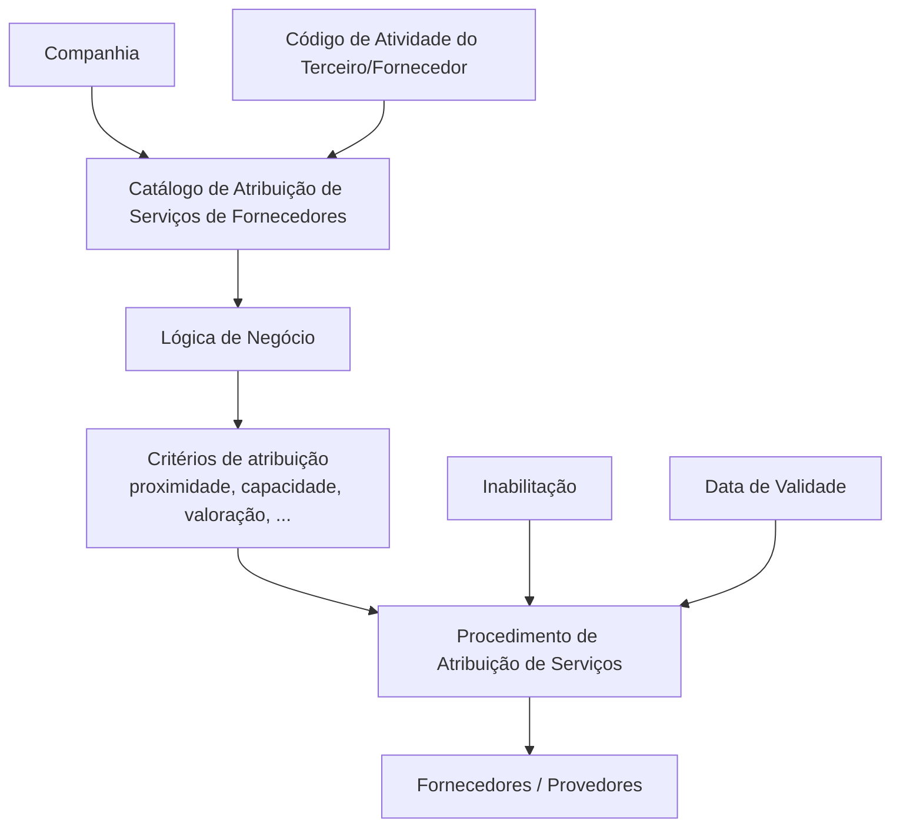

# Critérios de Atribuição de Serviços a Fornecedores — Documentação Reef

## 1. Metadados do Documento
- **Arquivo de Origem:** `Não identificado no conteúdo fornecido`
- **Tipo de Documento:** `Especificação Funcional`
- **Domínio / Sistema:** `Reef / Serviços de Fornecedores / Atividades de Terceiros`
- **Público-Alvo:** `Tecnologia e Processos da entidade MAPFRE local; áreas responsáveis pela configuração de catálogos`
- **Data/Versão Identificada:** `Não identificada`

---

## 2. Resumo Executivo & Contexto de Negócio

O documento descreve a definição dos critérios utilizados pelo núcleo do sistema para atribuir serviços a fornecedores, também denominados terceiros/provedores. A atribuição é definida de acordo com o código de atividade do terceiro ou fornecedor.

A configuração do catálogo permite determinar um ou mais critérios de atribuição. Esses critérios são avaliados por uma lógica de negócio associada à companhia e à atividade do terceiro, podendo considerar, entre outros exemplos explicitamente apresentados, proximidade, capacidade e valoração.

A especificação também estabelece controles operacionais para a ativação do procedimento. A propriedade de inabilitação desativa a utilização do procedimento de atribuição de serviços para uma atividade específica, enquanto a data de validade determina a partir de quando o procedimento está plenamente operacional e permite manter o histórico de alterações ao longo do tempo.

A responsabilidade pela nomenclatura, implementação e associação da lógica de negócio no catálogo cabe ao departamento de Tecnologia e Processos da entidade MAPFRE local. O documento recomenda consultar diretrizes e documentos funcionais relacionados para evitar interpretações isoladas e incorretas.

---

## 3. Arquitetura, Componentes & Tecnologias Envolvidas

Os componentes funcionais identificados são:

| Componente / Conceito | Papel no documento |
| :--- | :--- |
| Núcleo do Sistema | Determina os critérios considerados no procedimento de atribuição de serviços a fornecedores. |
| Catálogo de Atribuição de Serviços de Fornecedores | Contém atributos de companhia, atividade do terceiro, lógica de negócio, inabilitação e data de validade. |
| Companhia | Contexto organizacional para a definição do critério de atribuição. |
| Código de Atividade do Terceiro | Identifica a atividade do terceiro/provedor para a qual os critérios são definidos. |
| Lógica de Negócio | Avalia os critérios definidos pela companhia para atribuir serviços aos fornecedores. |
| Procedimento de Atribuição de Serviços | Processo que pode ser ativado, inabilitado e controlado por data de validade. |
| Documentação Reef | Repositório documental referido pelo documento. |
| Mapfredocument | Referência documental mencionada na seção de vínculos. |



**Nota de Análise:** o documento não detalha interfaces técnicas, métodos HTTP, contratos JSON, persistência de dados, tecnologias de implementação, URLs de ambiente ou mecanismos específicos de execução da lógica de negócio.

---

## 4. Regras de Negócio, Especificações Funcionais & Processos

1. O núcleo do sistema possui a capacidade de determinar o critério ou os critérios que devem ser contemplados no procedimento de atribuição de serviços aos fornecedores.
2. A determinação dos critérios de atribuição é realizada de acordo com o código de atividade do fornecedor ou terceiro.
3. O atributo **Companhia** contém o código da companhia para a qual está sendo definida a regra ou critério de atribuição referente à atividade do terceiro/provedor.
4. O atributo **Código de Atividade do Terceiro** determina o código da atividade do terceiro/provedor para o qual são configurados os critérios de atribuição.
5. A definição de critérios vinculada à atividade do terceiro somente se aplica quando a própria atividade do terceiro assim o estabelecer.
6. O atributo **Lógica de Negócio** corresponde a uma lógica cujo objetivo é avaliar os critérios definidos pela companhia para atribuir serviços aos fornecedores.
7. Os exemplos de critérios explicitamente citados são: proximidade, capacidade e valoração.
8. A propriedade **Inabilitação** determina que o procedimento de atribuição de serviços para uma atividade específica esteja desativado ou inabilitado para uso na atribuição de serviços aos fornecedores.
9. A propriedade **Data de Validade** informa ao sistema a data a partir da qual o procedimento de atribuição de serviço está plenamente operacional.
10. O uso correto da data de validade permite manter um histórico das mudanças realizadas ao longo do tempo.
11. A responsabilidade pela nomenclatura, implementação e associação da lógica de negócio no catálogo é do departamento de Tecnologia e Processos da entidade MAPFRE local.
12. A leitura de diretrizes e documentos funcionais relacionados é recomendada para evitar erros de interpretação decorrentes da análise isolada do documento.

---

## 5. Tabelas de Parâmetros, Ambientes e Estruturas de Dados

| Item / Parâmetro | Descrição / Função | Tipo / Valores / Formato | Ambiente / Observações |
| :--- | :--- | :--- | :--- |
| Companhia | Contém o código da companhia sobre a qual é realizada a definição do critério de atribuição para a atividade do terceiro/provedor. | Código de companhia; formato não detalhado. | Aplicável à definição de critérios de atribuição. |
| Código de Atividade do Terceiro | Determina a atividade do terceiro/provedor para a qual são estabelecidos critérios de atribuição. | Código de atividade; formato não detalhado. | Aplicável quando a atividade do terceiro assim estabelecer. |
| Lógica de Negócio | Avalia o critério ou os critérios definidos pela companhia para atribuir serviços a fornecedores. | Lógica de negócio; implementação não detalhada. | Exemplos de critérios: proximidade, capacidade, valoração. |
| Inabilitação | Desativa ou inabilita o procedimento de atribuição de serviços para uma atividade específica. | Propriedade de estado; valores não detalhados. | Impede o uso do procedimento na atribuição aos fornecedores. |
| Data de Validade | Define a data a partir da qual o procedimento de atribuição de serviço está plenamente operacional. | Data; formato não detalhado. | Permite preservar o histórico de alterações ao longo do tempo. |
| Documentação Reef | Referência documental vinculada ao conteúdo. | Documentação. | Recomendada para evitar interpretação isolada. |
| Mapfredocument | Referência documental mencionada nos vínculos. | Documentação. | Sem detalhamento adicional. |
| Owner | Responsável identificado na extração. | `user:agonzalez_mapfre.com` | Valor literal extraído do documento. |
| Lifecycle | Estado de ciclo de vida identificado na extração. | `Approved Source` | Valor literal extraído do documento. |

---

## 6. Bateria de Perguntas & Respostas para RAG (FAQ Sintético)

### P1: Qual é o objetivo do catálogo de atribuição de serviços a fornecedores?
**R:** O catálogo permite definir o critério ou os critérios que o núcleo do sistema deve considerar no procedimento de atribuição de serviços aos fornecedores, de acordo com o código de atividade do terceiro ou fornecedor.

### P2: Qual atributo identifica a companhia para a qual o critério de atribuição é configurado?
**R:** O atributo **Companhia** contém o código da companhia sobre a qual está sendo realizada a definição do critério de atribuição para a atividade do terceiro/provedor.

### P3: Para que serve o Código de Atividade do Terceiro?
**R:** O **Código de Atividade do Terceiro** identifica a atividade do terceiro/provedor para a qual são definidos os critérios de atribuição, desde que a atividade do terceiro estabeleça essa necessidade.

### P4: O que a lógica de negócio avalia no processo de atribuição?
**R:** A lógica de negócio avalia o critério ou os critérios determinados pela companhia para atribuir serviços aos fornecedores. O documento cita proximidade, capacidade e valoração como exemplos de critérios.

### P5: Quais critérios de atribuição são citados explicitamente?
**R:** O documento cita explicitamente os critérios de **proximidade**, **capacidade** e **valoração**. A presença de reticências indica que podem existir outros critérios, mas eles não são especificados.

### P6: O que acontece quando a propriedade Inabilitação é configurada?
**R:** A propriedade **Inabilitação** estabelece que o procedimento de atribuição de serviços para uma atividade específica fica desativado ou inabilitado e não pode ser utilizado para atribuir serviços aos fornecedores.

### P7: Qual é a finalidade da Data de Validade?
**R:** A **Data de Validade** informa ao sistema a partir de qual data o procedimento de atribuição de serviço está plenamente operacional. Seu uso correto também permite manter o histórico das alterações realizadas ao longo do tempo.

### P8: Quem é responsável pela nomenclatura e implementação da lógica de negócio no catálogo?
**R:** A responsabilidade pela nomenclatura, implementação e associação da lógica de negócio no catálogo recai sobre o departamento de Tecnologia e Processos da entidade MAPFRE local.

### P9: O documento define como a lógica de negócio deve ser implementada tecnicamente?
**R:** Não. O documento atribui à lógica de negócio a função de avaliar critérios de atribuição, mas não detalha linguagem, motor de regras, métodos de integração, contratos de API ou estrutura técnica de implementação.

### P10: Por que devem ser consultadas outras diretrizes e documentos funcionais?
**R:** O documento recomenda consultar diretrizes e documentos funcionais relacionados para evitar que a interpretação isolada da especificação conduza a erros.

---

## 7. Glossário de Termos, Siglas & Conceitos-Chave

- **Reef:** nome presente nas referências de documentação do documento; o significado da sigla ou nome não é detalhado.
- **MAPFRE:** organização mencionada como responsável local pela área de Tecnologia e Processos; o documento não expande o nome.
- **Terceiro / Provedor / Fornecedor:** entidade à qual podem ser atribuídos serviços conforme critérios definidos.
- **Atribuição de Serviços:** procedimento pelo qual o sistema atribui serviços a fornecedores com base em critérios configurados.
- **Código de Atividade do Terceiro:** código que identifica a atividade do terceiro/provedor para a configuração dos critérios de atribuição.
- **Lógica de Negócio:** lógica responsável por avaliar os critérios definidos pela companhia para atribuir serviços.
- **Inabilitação:** propriedade que desativa o procedimento de atribuição para uma atividade específica.
- **Data de Validade:** data a partir da qual o procedimento de atribuição está plenamente operacional.
- **Valoração:** critério mencionado para atribuição de serviços; o método de cálculo ou escala não é detalhado.
- **Mapfredocument:** referência documental citada nos vínculos, sem detalhamento adicional.

---

## 8. Notas Críticas, Riscos & Limitações

- O documento não especifica a implementação técnica da lógica de negócio, incluindo tecnologias, regras de precedência, algoritmos ou mecanismos de execução.
- Não há detalhamento sobre os formatos dos códigos de companhia e atividade do terceiro.
- Não são apresentados valores permitidos para a propriedade de inabilitação.
- Não são definidos formato, fuso horário ou comportamento de transição para a data de validade.
- Não há descrição de como múltiplos critérios são combinados, ordenados ou priorizados.
- Não são apresentados contratos de integração, APIs, persistência, logs, URLs, servidores ou ambientes.
- A responsabilidade local pela implementação e associação da lógica de negócio pode gerar variações entre entidades MAPFRE locais caso não existam diretrizes complementares.
- A própria documentação recomenda a consulta de diretrizes e documentos funcionais relacionados; a interpretação isolada é explicitamente apontada como potencial fonte de erro.

---

## 9. Conteúdo Bruto Estruturado (Referência Fiel)

```text
--- [PÁGINA 1 DE 2] ---

DEFINICIÓN de los CRITERIOS de ASIGNACIÓN de los SERVICIOS a
PROVEEDORES
Funcionalmente el núcleo del Sistema cuenta con la posibilidad de determinar el criterio o los criterios que se tienen que contemplar en el
procedimiento de asignación de Servicios a los Proveedores y de acuerdo con su código de actividad.
Propiedades
Otras Propiedades
Propiedades
Compañía
Este Atributo del catálogo contiene el código de la compañía sobre la que se está realizando la denición del criterio de Asignación para la
Actividad del Tercero/Proveedor.
Código de Actividad del Tercero
Esta propiedad determina en el sistema el código de la Actividad del Tercero-Proveedor para el cual se está estableciendo el criterio/criterios
de asignación (siempre y cuando la Actividad del Tercero así lo establezca)
Lógica de Negocio
Este Atributo del catálogo corresponde con una lógica de negocio cuyo cometido es evaluar el criterio o los criterios que determine la
Compañía para asignar servicios a los Proveedores: proximidad, capacidad, valoración, ...
Otras Propiedades
Inhabilitación
Esta propiedad establece que el Procedimiento de Asignación de los Servicios para la Actividad especíca esta desactivada o inhabilitada
para poder ser utilizada en la asignación de los Servicios a los Proveedores.
Fecha de Validez
Esta propiedad le indica al Sistema la fecha a partir de la cual el procedimiento de Asignación del Servicio está plenamente operativo en el
sistema por lo que su correcto uso permite tener un histórico de los cambios efectuados a lo largo del tiempo.
Vínculos
Relación de Directrices y Documentos funcionales cuya lectura recomendada para evitar que la interpretación aislada del presente
documento pueda conducir a error.
Documentation / DOCUMENTACIÓN Reef
DOCUMENTACIÓN Reef
Mapfredocument
DOCUMENTACIÓN Reef
Owner
user:agonzalez_mapfre.com
Lifecycle
Approved Source
 / 
 VL
Buscar Inicio Soluciones Arquitecturas APIs Componentes Cloud Documentación Zeus Reef Ayuda
ES


--- [PÁGINA 2 DE 2] ---

Servicios de Proveedores
Actividades de los Terceros
Preguntas frecuentes
(1) ¿Existe alguna recomendación operativa que deba ser tomada en consideración localmente en la codicación, uso y denición del
catálogo de Asignación de Servicios de los Proveedores?
La Responsabilidad de la nomenclatura, implementación y asociación en el catálogo de la lógica de negocio recae en el departamento de
Tecnología y Procesos de la Entidad MAPFRE local.
```
