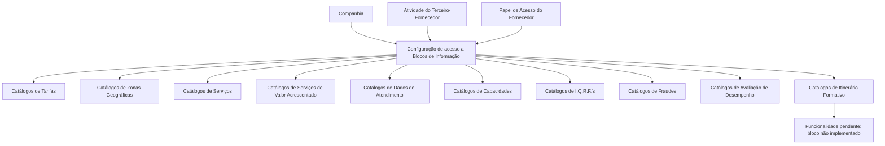

# Configuração de Acessos a Blocos de Informação por Atividade e Papel do Fornecedor

## 1. Metadados do Documento
- **Arquivo de Origem:** Não identificado no conteúdo fornecido
- **Tipo de Documento:** Especificação Técnica / Funcional
- **Domínio / Sistema:** Reef / MAPFRE — gestão de fornecedores
- **Público-Alvo:** Negócio, analistas funcionais, administradores de catálogos e equipes de operação
- **Data/Versão Identificada:** Não identificada
- **Owner identificado:** `user:agonzalez_mapfre.com`
- **Lifecycle identificado:** Approved Source

---

## 2. Resumo Executivo & Contexto de Negócio

O documento descreve a configuração de acessos aos **Blocos de Informação** do sistema para fornecedores. A configuração é definida para cada combinação entre **companhia**, **código de atividade do terceiro-fornecedor** e **papel de acesso** atribuído ao fornecedor.

O objetivo funcional é determinar como um usuário fornecedor pode acessar catálogos de informação associados à sua atividade e ao seu papel. Os domínios de informação abrangidos incluem tarifas, zonas geográficas, serviços, serviços de valor acrescentado, dados de atendimento, capacidades, I.Q.R.F.'s, fraudes, avaliação de desempenho e formação.

A estrutura apresentada indica que o controle de acesso é granular por bloco informacional. Portanto, a mesma atividade de fornecedor pode possuir comportamentos de acesso distintos conforme o papel de acesso associado ao usuário.

O documento também registra uma limitação explícita: o bloco de informação relativo à formação ainda não está implementado. Consequentemente, o respetivo tipo de acesso permanece pendente de funcionalidade.

A orientação operacional fornecida informa que não existe uma preferência ou recomendação para padronizar a codificação do catálogo de Blocos de Informação. Contudo, cada entidade MAPFRE deve avaliar a conveniência de usar transversalmente esse catálogo nos processos corporativos para permitir exploração posterior adequada.

---

## 3. Arquitetura, Componentes & Tecnologias Envolvidas

Os componentes funcionais identificados são:

- **Sistema Reef:** contexto documental e funcional onde a configuração é apresentada.
- **Catálogo de Blocos de Informação por Atividade de Fornecedores:** catálogo configurável usado para definir acesso a informações.
- **Companhia:** atributo que identifica a companhia sobre a qual a configuração é realizada.
- **Atividade do Terceiro-Fornecedor:** código da atividade que identifica o terceiro como fornecedor.
- **Papel de Acesso:** um dos possíveis papéis atribuídos por atividade do fornecedor.
- **Tipos de Acesso:** atributos que determinam o modo de acesso a cada categoria de catálogo.
- **Entidade MAPFRE:** entidade responsável por analisar a conveniência de uso transversal do catálogo.



> **Nota de Análise:** O documento descreve atributos funcionais de configuração, mas não detalha telas, persistência de dados, APIs, métodos HTTP, contratos JSON, tecnologias de implementação ou regras técnicas de autenticação/autorização.

---

## 4. Regras de Negócio, Especificações Funcionais & Processos

### 4.1 Regra central de configuração

O núcleo funcional do sistema permite configurar, para cada combinação de:

1. **Companhia**;
2. **Atividade do Terceiro-Fornecedor**;
3. **Papel de Acesso do Fornecedor**;

a forma pela qual será possível acessar as informações pertencentes aos **Blocos de Informação**.

### 4.2 Critérios de segmentação de acesso

- A configuração é realizada no contexto de uma companhia específica.
- A atividade deve identificar o terceiro como fornecedor para que o código de atividade seja aplicável.
- O papel de acesso determina um dos possíveis papéis associados à atividade do fornecedor.
- Cada tipo de acesso é determinado considerando conjuntamente:
  - a atividade do fornecedor; e
  - o papel do usuário.

### 4.3 Categorias de informação controladas

A configuração determina a forma de acesso aos catálogos relativos a:

1. Tarifas.
2. Zonas de atribuição geográficas.
3. Serviços.
4. Serviços de valor acrescentado.
5. Dados de atendimento do fornecedor.
6. Capacidades do fornecedor.
7. Incidências, queixas, reclamações e felicitações associadas ao fornecedor.
8. Fraudes.
9. Avaliação do desempenho do fornecedor.
10. Itinerário formativo do fornecedor.

### 4.4 Restrição funcional conhecida

O bloco de informação associado à formação não está implementado. O tipo de acesso à formação encontra-se, portanto, **pendente de funcionalidade**.

### 4.5 Orientação de codificação e uso corporativo

- Não existe preferência ou recomendação documentada para estabelecer ou padronizar a codificação do catálogo de Blocos de Informação.
- A entidade MAPFRE deve analisar a conveniência de usar transversalmente o catálogo nos processos corporativos.
- O objetivo dessa análise é viabilizar a correta exploração posterior das informações.

### 4.6 Documentação relacionada recomendada

A leitura isolada do documento pode conduzir a interpretações incorretas. O documento recomenda consultar:

- **Atividades dos Terceiros**.
- **Papéis de Fornecedores por Atividade**.
- **Blocos de Informação**.

---

## 5. Tabelas de Parâmetros, Ambientes e Estruturas de Dados

| Item / Parâmetro | Descrição / Função | Tipo / Valores / Formato | Ambiente / Observações |
| :--- | :--- | :--- | :--- |
| Companhia | Código da companhia sobre a qual é realizada a configuração de acesso. | Código de companhia; formato não detalhado. | Aplicável à configuração de acesso. |
| Código de Atividade do Terceiro | Estabelece o código da atividade do terceiro-fornecedor, desde que a atividade o identifique como fornecedor. | Código de atividade; formato não detalhado. | Condicionado à identificação do terceiro como fornecedor. |
| Papel de Acesso | Determina um dos possíveis papéis atribuídos por atividade do fornecedor. | Papel de acesso; valores não detalhados. | Participa da combinação de configuração. |
| Tipo de Acesso a Tarifas | Determina a forma de acesso aos catálogos relativos a tarifas. | Tipo de acesso; valores não detalhados. | Definido por atividade do fornecedor e papel do usuário. |
| Tipo de Acesso a Zonas Geográficas | Determina a forma de acesso aos catálogos relativos às zonas de atribuição. | Tipo de acesso; valores não detalhados. | Definido por atividade do fornecedor e papel do usuário. |
| Tipo de Acesso a Serviços | Determina a forma de acesso aos catálogos relativos aos serviços. | Tipo de acesso; valores não detalhados. | Definido por atividade do fornecedor e papel do usuário. |
| Tipo de Acesso a Serviços de Valor Acrescentado | Determina a forma de acesso aos catálogos relativos aos serviços de valor acrescentado. | Tipo de acesso; valores não detalhados. | Definido por atividade do fornecedor e papel do usuário. |
| Tipo de Acesso a Dados de Atendimento | Determina a forma de acesso aos catálogos relativos aos dados de atendimento do fornecedor. | Tipo de acesso; valores não detalhados. | Definido por atividade do fornecedor e papel do usuário. |
| Tipo de Acesso a Capacidades | Determina a forma de acesso aos catálogos relativos às capacidades do fornecedor. | Tipo de acesso; valores não detalhados. | Definido por atividade do fornecedor e papel do usuário. |
| Tipo de Acesso a I.Q.R.F.'s | Determina a forma de acesso aos catálogos de incidências, queixas, reclamações e felicitações associadas ao fornecedor. | Tipo de acesso; valores não detalhados. | Definido por atividade do fornecedor e papel do usuário. |
| Tipo de Acesso a Fraudes | Determina a forma de acesso aos catálogos relativos a fraudes. | Tipo de acesso; valores não detalhados. | Definido por atividade do fornecedor e papel do usuário. |
| Tipo de Acesso a Avaliação | Determina a forma de acesso aos catálogos relativos à avaliação do desempenho do fornecedor. | Tipo de acesso; valores não detalhados. | Definido por atividade do fornecedor e papel do usuário. |
| Tipo de Acesso a Formação | Determina a forma de acesso aos catálogos relativos ao itinerário formativo do fornecedor. | Tipo de acesso; valores não detalhados. | Pendente de funcionalidade porque o bloco de informação não está implementado. |
| Owner | Proprietário identificado na página documental. | `user:agonzalez_mapfre.com` | Metadado exibido no conteúdo bruto. |
| Lifecycle | Estado do documento identificado na página documental. | `Approved Source` | Metadado exibido no conteúdo bruto. |

---

## 6. Bateria de Perguntas & Respostas para RAG (FAQ Sintético)

### P1: Qual é a combinação usada para configurar o acesso aos Blocos de Informação de fornecedores?
**R:** O acesso é configurado para cada combinação de companhia, código de atividade do terceiro-fornecedor e papel de acesso do fornecedor. Essa combinação determina como os catálogos de cada bloco de informação podem ser acessados.

### P2: Quando o código de atividade do terceiro é aplicável à configuração?
**R:** O código de atividade do terceiro é aplicável quando a atividade do terceiro o identifica como fornecedor. O documento não descreve códigos concretos nem critérios adicionais de identificação.

### P3: O que determina o Papel de Acesso na configuração de fornecedores?
**R:** O Papel de Acesso determina um dos possíveis papéis atribuídos por atividade do fornecedor. O papel participa, juntamente com a atividade do fornecedor, da definição da forma de acesso aos catálogos.

### P4: Quais catálogos podem ter o acesso controlado pelo catálogo de Blocos de Informação?
**R:** O documento cita catálogos de tarifas, zonas geográficas de atribuição, serviços, serviços de valor acrescentado, dados de atendimento, capacidades, I.Q.R.F.'s, fraudes, avaliação de desempenho e formação.

### P5: Como é definido o acesso aos catálogos de tarifas?
**R:** O Tipo de Acesso a Tarifas determina, para a atividade do fornecedor e o papel do usuário, a forma de acesso aos catálogos relativos a tarifas. Os possíveis valores ou modalidades de acesso não são detalhados.

### P6: O que significa o Tipo de Acesso a I.Q.R.F.'s?
**R:** O Tipo de Acesso a I.Q.R.F.'s determina a forma de acesso aos catálogos de Incidências, Queixas, Reclamações e Felicitações associados ao fornecedor, considerando a atividade do fornecedor e o papel do usuário.

### P7: O acesso às informações de formação está disponível?
**R:** Não há funcionalidade implementada para esse bloco de informação. O documento declara que o Tipo de Acesso a Formação está pendente de funcionalidade porque o Bloco de Informação correspondente não está implementado.

### P8: Existe um padrão obrigatório para codificar o catálogo de Blocos de Informação?
**R:** Não. O documento declara que não existe preferência nem recomendação para estabelecer ou padronizar a codificação do catálogo de Blocos de Informação no sistema.

### P9: Qual orientação é dada à entidade MAPFRE sobre o uso do catálogo de Blocos de Informação?
**R:** A entidade MAPFRE deve analisar a conveniência de utilizar transversalmente o catálogo nos processos da companhia, para permitir a correta exploração posterior da informação.

### P10: Que documentos devem ser consultados para evitar interpretações isoladas incorretas?
**R:** O documento recomenda consultar as diretrizes ou documentos funcionais intitulados **Atividades dos Terceiros**, **Papéis de Fornecedores por Atividade** e **Blocos de Informação**.

### P11: O documento descreve APIs, endpoints ou contratos de integração para a configuração de acessos?
**R:** Não. O conteúdo fornecido apresenta atributos funcionais e categorias de acesso, mas não descreve APIs, endpoints, métodos HTTP, contratos JSON, tecnologias ou mecanismos técnicos de integração.

### P12: A Companhia influencia a configuração de acesso?
**R:** Sim. O atributo Companhia contém o código da companhia sobre a qual a configuração de acesso está sendo realizada, sendo um dos elementos da combinação de configuração.

---

## 7. Glossário de Termos, Siglas & Conceitos-Chave

- **Blocos de Informação:** agrupamentos de informação cujos catálogos possuem formas de acesso configuráveis por atividade e papel do fornecedor.
- **Companhia:** código da companhia em que a configuração de acesso é realizada.
- **Fornecedor / Proveedor:** terceiro identificado como fornecedor no contexto do sistema.
- **Atividade do Terceiro:** atividade associada ao terceiro; pode identificá-lo como fornecedor.
- **Papel de Acesso / Rol Acceso:** papel atribuído por atividade do fornecedor que participa da determinação dos acessos.
- **Tipo de Acesso:** atributo de configuração que determina a forma de acesso a uma categoria de catálogo.
- **Dados de Atendimento:** categoria de dados do fornecedor cujo acesso pode ser configurado.
- **Capacidades:** categoria de informação relativa às capacidades do fornecedor.
- **I.Q.R.F.'s:** Incidências, Queixas, Reclamações e Felicitações associadas ao fornecedor.
- **Avaliação:** avaliação do desempenho do fornecedor.
- **Formação:** itinerário formativo do fornecedor.
- **MAPFRE:** entidade mencionada como responsável por analisar o uso transversal do catálogo nos seus processos.
- **Reef:** domínio/sistema identificado na documentação apresentada.
- **Lifecycle:** metadado documental que, no conteúdo fornecido, possui o valor `Approved Source`.

---

## 8. Notas Críticas, Riscos & Limitações

- O documento não define valores permitidos, níveis, códigos ou comportamentos concretos para os atributos de **Tipo de Acesso**.
- O documento não detalha como a configuração é criada, alterada, validada, aprovada ou auditada.
- Não há definição de APIs, integrações, contratos de dados, autenticação, autorização técnica ou persistência.
- O bloco de informação de **Formação** não está implementado; o respetivo tipo de acesso permanece pendente de funcionalidade.
- A ausência de recomendação de padronização para a codificação do catálogo pode produzir abordagens diferentes entre entidades, caso não exista governança complementar.
- A interpretação isolada deste documento pode induzir a erro; é recomendada a leitura dos documentos relacionados sobre atividades de terceiros, papéis de fornecedores por atividade e blocos de informação.
- **Nota de Análise:** O documento identifica os domínios cujo acesso é configurável, mas não especifica se o acesso representa consulta, alteração, aprovação, exclusão ou outro nível operacional.

---

## 9. Conteúdo Bruto Estruturado (Referência Fiel)

```text
--- [PÁGINA 1 DE 2] ---

CONFIGURAR ACCESOS a BLOQUES de INFORMACIÓN por
ACTIVIDAD y ROL del PROVEEDOR
Funcionalmente el núcleo del Sistema cuenta con la posibilidad de congurar, por cada combinación de Actividad y rol de acceso del
Proveedor, la forma por la que se va a poder acceder a la información de los Bloques de Información.
Propiedades
Propiedades
Compañía
Este Atributo del catálogo contiene el código de la compañía sobre la que se está realizando la conguración de acceso.
Código de Actividad del Tercero
Esta propiedad establece en el sistema el código de la Actividad del Tercero-Proveedor siempre y cuando la Actividad del Tercero lo
identique como tal.
Rol Acceso
Este Atributo del catálogo de conguración determina uno de los posibles roles que se asignan por Actividad del Proveedor.
Tipo de Acceso a Tarifas
Este Atributo del catálogo de conguración determina para la Actividad del Proveedor y el Rol del Usuario, la forma de acceder a los
catálogos relativos a las Tarifas.
Tipo de Acceso a Zonas Geográcas
Este Atributo del catálogo de conguración determina para la Actividad del Proveedor y el Rol del Usuario, la forma de acceder a los
catálogos relativos a las Zonas de Asignación.
Tipo de Acceso a Servicios
Este Atributo del catálogo de conguración determina para la Actividad del Proveedor y el Rol del Usuario, la forma de acceder a los
catálogos relativos a los Servicios.
Tipo de Acceso a Servicios de Valor Añadido
Este Atributo del catálogo de conguración determina para la Actividad del Proveedor y el Rol del Usuario, la forma de acceder a los
catálogos relativos a los Servicios de Valor Añadido.
Documentation / DOCUMENTACIÓN Reef
DOCUMENTACIÓN Reef
Mapfredocument
DOCUMENTACIÓN Reef
Owner
user:agonzalez_mapfre.com
Lifecycle
Approved Source
 / 
 VL
Buscar Inicio Soluciones Arquitecturas APIs Componentes Cloud Documentación Zeus Reef Ayuda
ES


--- [PÁGINA 2 DE 2] ---

Tipo de Acceso a Datos de Atención
Este Atributo del catálogo de conguración determina para la Actividad del Proveedor y el Rol del Usuario, la forma de acceder a los
catálogos relativos a los Datos de Atención del Proveedor.
Tipo de Acceso a Capacidades
Este Atributo del catálogo de conguración determina para la Actividad del Proveedor y el Rol del Usuario, la forma de acceder a los
catálogos relativos a las Capacidades del Proveedor.
Tipo de Acceso a I.Q.R.F's
Este Atributo del catálogo de conguración determina para la Actividad del Proveedor y el Rol del Usuario, la forma de acceder a los
catálogos relativos a las Incidencias, Quejas, Reclamaciones y Felicitaciones asociados al Proveedor.
Tipo de Acceso a Fraudes
Este Atributo del catálogo de conguración determina para la Actividad del Proveedor y el Rol del Usuario, la forma de acceder a los
catálogos relativos a los Fraudes.
Tipo de Acceso a Evaluación
Este Atributo del catálogo de conguración determina para la Actividad del Proveedor y el Rol del Usuario, la forma de acceder a los
catálogos relativos a la Evaluación en el Desempeño del Proveedor.
Tipo de Acceso a Formación
Este Atributo del catálogo de conguración determina para la Actividad del Proveedor y el Rol del Usuario, la forma de acceder a los
catálogos relativos al itinerario formativo del Proveedor.
NOTA: Puesto que el Bloque de Información no está implementado, este tipo de Acceso está Pendiente de Funcionalidad.
Vínculos
Relación de Directrices y Documentos funcionales cuya lectura recomendada para evitar que la interpretación aislada del presente
documento pueda conducir a error.
Actividades de los Terceros
Roles de Proveedores por Actividad
Bloques de Información
Preguntas frecuentes
(1) ¿Existe alguna recomendación operativa que deba ser tomada en consideración localmente en la codicación, uso y denición del
catálogo de Bloques de Información por Actividad de los Proveedores?
No existe una preferencia ni recomendación para establecer o estandarizar en el sistema su codicación, si bien la entidad MAPFRE debe
analizar la conveniencia de utilizar transversalmente en los procesos de la compañía este catálogo de información para su correcta y
posterior explotación.
```
