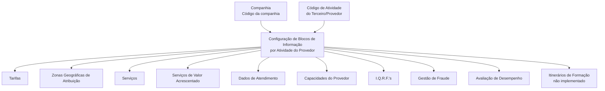

# Configuração de Blocos de Informação por Atividade do Provedor — Documentação Reef

## 1. Metadados do Documento
- **Arquivo de Origem:** Não identificado no conteúdo extraído
- **Tipo de Documento:** Especificação Funcional
- **Domínio / Sistema:** Reef / MAPFRE / Gestão de Terceiros e Provedores
- **Público-Alvo:** Negócio, analistas funcionais, administradores de catálogos e equipes de operação
- **Data/Versão Identificada:** Não identificada

---

## 2. Resumo Executivo & Contexto de Negócio

O documento descreve a funcionalidade de configuração de **Blocos de Informação por Atividade do Provedor** no núcleo do sistema Reef. A funcionalidade permite personalizar, para cada possível atividade de terceiros/provedores, quais conjuntos de informações devem estar associados e configurados no sistema.

A configuração é realizada por meio de atributos de catálogo. Cada atributo determina se um domínio de informação específico — como tarifas, zonas geográficas, serviços, capacidades, gestão de fraude ou avaliação de desempenho — deve ou não ser configurado para determinada atividade de provedor.

A finalidade operacional é permitir que a informação exigida de um provedor seja adequada à atividade exercida. Dessa forma, atividades diferentes podem ter necessidades distintas de cadastro, parametrização e exploração posterior de dados dentro dos processos da companhia MAPFRE.

O documento não define valores permitidos, convenções de codificação, métodos técnicos, contratos de integração, interfaces, fluxos de aprovação ou regras de persistência. A recomendação expressa é que a entidade MAPFRE avalie a conveniência de utilizar transversalmente o catálogo de blocos de informação em seus processos, visando a correta exploração posterior das informações.

---

## 3. Arquitetura, Componentes & Tecnologias Envolvidas

O conteúdo apresenta o sistema **Reef** como o núcleo funcional que oferece a capacidade de configurar informações associadas às atividades de terceiros/provedores. Não há detalhamento de arquitetura técnica, banco de dados, microsserviços, APIs, protocolos, ambientes ou tecnologias de implementação.

Os elementos funcionais identificados são:

- **Reef:** sistema cujo núcleo permite personalizar e configurar blocos de informação por atividade de provedor.
- **Catálogo de Blocos de Informação por Atividade dos Provedores:** catálogo que contém propriedades para determinar os domínios de informação aplicáveis a uma atividade.
- **Atividade do Terceiro/Provedor:** identificação funcional usada para definir a configuração associada.
- **Companhia:** atributo que identifica o código da companhia para a qual a atividade está sendo configurada.
- **MAPFRE:** entidade que deve analisar a conveniência de uso transversal do catálogo nos processos corporativos.
- **Documentos relacionados:** “Actividades de los Terceros” e “Tipologías de Proveedores por Actividad”.



**Nota de Análise:** o documento descreve relações funcionais de configuração, mas não detalha componentes técnicos, métodos HTTP, contratos JSON, mecanismos de armazenamento, rotas de integração ou ambientes de execução.

---

## 4. Regras de Negócio, Especificações Funcionais & Processos

### Configuração por atividade de provedor

1. O núcleo do sistema permite personalizar e configurar, especificamente para cada possível atividade de provedores, a informação que será associada no sistema.
2. A configuração é orientada pela atividade do terceiro/provedor.
3. Cada atributo do catálogo determina se determinado bloco de informação deve ou não ser configurado para a atividade do provedor.
4. O atributo **Companhia** contém o código da companhia sobre a qual está sendo realizada a configuração da atividade do terceiro/provedor.
5. O atributo **Código de Atividade do Terceiro** estabelece o código da atividade do terceiro/provedor no sistema, desde que a atividade do terceiro o identifique como tal.
6. A necessidade de configuração de cada domínio funcional é controlada individualmente pelos atributos do catálogo.
7. Não existe preferência ou recomendação para estabelecer ou padronizar a codificação do catálogo no sistema.
8. A entidade MAPFRE deve analisar a conveniência de utilizar o catálogo transversalmente nos processos da companhia para permitir a correta exploração posterior da informação.
9. O bloco de informação referente a **Formação** é explicitamente marcado como **não implementado**.

### Blocos de informação controlados pelo catálogo

- **Tarifas:** determina se a atividade do provedor exige configuração de catálogos relativos a tarifas.
- **Zonas Geográficas:** determina se a atividade do provedor exige configuração de zonas geográficas de atribuição.
- **Serviços:** determina se a atividade do provedor exige configuração de catálogos referentes a serviços.
- **Serviços de Valor Acrescentado:** determina se a atividade do provedor exige configuração de informação referente a serviços de valor acrescentado.
- **Dados de Atendimento:** determina se a atividade do provedor exige configuração de catálogos relativos aos dados de atendimento fornecidos.
- **Capacidades:** determina se a atividade do provedor exige configuração de informação relativa à capacidade do provedor.
- **I.Q.R.F.'s:** determina se a atividade do provedor exige configuração de catálogos relativos a incidências, reclamações, queixas e felicitações do provedor.
- **Fraudes:** determina se a atividade do provedor exige configuração de catálogos relativos à gestão de fraude.
- **Avaliação:** determina se a atividade do provedor exige configuração de catálogos relativos à avaliação de desempenho do provedor.
- **Formação:** determina se, especificamente para a atividade do provedor, devem ser considerados itinerários de formação para execução do trabalho. O bloco não está implementado.

---

## 5. Tabelas de Parâmetros, Ambientes e Estruturas de Dados

| Item / Parâmetro | Descrição / Função | Tipo / Valores / Formato | Ambiente / Observações |
| :--- | :--- | :--- | :--- |
| Companhia | Contém o código da companhia para a qual a configuração da atividade do terceiro/provedor está sendo realizada. | Código de companhia; formato não detalhado. | Aplicável à configuração da atividade do terceiro/provedor. |
| Código de Atividade do Terceiro | Estabelece o código da atividade do terceiro/provedor no sistema quando a atividade o identifica como tal. | Código de atividade; formato não detalhado. | Não são definidos valores ou convenções de codificação. |
| Tarifas | Determina se devem ser configurados catálogos relativos a tarifas para a atividade do provedor. | Atributo de decisão; valores não detalhados. | Aplicável conforme a necessidade da atividade. |
| Zonas Geográficas | Determina se devem ser configuradas zonas geográficas de atribuição. | Atributo de decisão; valores não detalhados. | Aplicável conforme a necessidade da atividade. |
| Serviços | Determina se devem ser configurados catálogos referentes a serviços. | Atributo de decisão; valores não detalhados. | Aplicável conforme a necessidade da atividade. |
| Serviços de Valor Acrescentado | Determina se devem ser configuradas informações referentes a serviços de valor acrescentado. | Atributo de decisão; valores não detalhados. | Aplicável conforme a necessidade da atividade. |
| Dados de Atendimento | Determina se devem ser configurados catálogos relativos aos dados de atendimento fornecidos. | Atributo de decisão; valores não detalhados. | Aplicável conforme a necessidade da atividade. |
| Capacidades | Determina se devem ser configuradas informações relativas à capacidade do provedor. | Atributo de decisão; valores não detalhados. | Aplicável conforme a necessidade da atividade. |
| I.Q.R.F.'s | Determina se devem ser configurados catálogos relacionados a incidências, queixas, reclamações e felicitações do provedor. | Atributo de decisão; valores não detalhados. | Aplicável conforme a necessidade da atividade. |
| Fraudes | Determina se devem ser configurados catálogos relativos à gestão de fraude. | Atributo de decisão; valores não detalhados. | Aplicável conforme a necessidade da atividade. |
| Avaliação | Determina se devem ser configurados catálogos relativos à avaliação de desempenho do provedor. | Atributo de decisão; valores não detalhados. | Aplicável conforme a necessidade da atividade. |
| Formação | Determina se devem ser considerados itinerários de formação para que o provedor desenvolva seu trabalho. | Atributo de decisão; valores não detalhados. | **Bloco de informação não implementado.** |
| Codificação do catálogo | Não há preferência ou recomendação para estabelecer ou padronizar a codificação no sistema. | Não especificado. | MAPFRE deve avaliar o uso transversal do catálogo em seus processos. |

---

## 6. Bateria de Perguntas & Respostas para RAG (FAQ Sintético)

### P1: Qual é a finalidade do catálogo de Blocos de Informação por Atividade do Provedor no Reef?
**R:** O catálogo permite personalizar e configurar, para cada possível atividade de terceiros/provedores, quais informações devem estar associadas e configuradas no sistema Reef.

### P2: Qual atributo identifica a companhia para a qual uma configuração está sendo realizada?
**R:** O atributo **Companhia** contém o código da companhia sobre a qual é realizada a configuração da atividade do terceiro/provedor.

### P3: Como o Código de Atividade do Terceiro é utilizado na configuração?
**R:** O atributo **Código de Atividade do Terceiro** estabelece no sistema o código da atividade do terceiro/provedor, desde que a própria atividade identifique o terceiro como provedor.

### P4: O que o atributo Tarifas controla?
**R:** O atributo **Tarifas** determina se, para uma atividade de provedor, é necessário configurar os catálogos relativos a tarifas.

### P5: Quando devem ser configuradas Zonas Geográficas de Atribuição?
**R:** As Zonas Geográficas de Atribuição devem ser configuradas quando o atributo **Zonas Geográficas** determinar que essa configuração é necessária para a atividade do provedor.

### P6: Quais informações são cobertas pelo atributo I.Q.R.F.'s?
**R:** O atributo **I.Q.R.F.'s** controla a necessidade de configurar catálogos relativos a informações de incidências, queixas, reclamações e felicitações do provedor.

### P7: O catálogo permite configurar gestão de fraude por atividade de provedor?
**R:** Sim. O atributo **Fraudes** determina se devem ser configurados catálogos relativos à gestão de fraude para a atividade do provedor.

### P8: O bloco de Formação está disponível para uso no sistema?
**R:** Não. O documento declara expressamente que o bloco de informação referente a **Formação** não está implementado, embora descreva que esse bloco serviria para considerar itinerários de formação necessários ao desenvolvimento do trabalho do provedor.

### P9: Existe uma recomendação para padronizar a codificação do catálogo?
**R:** Não. O documento informa que não existe preferência nem recomendação para estabelecer ou padronizar a codificação do catálogo no sistema.

### P10: Qual recomendação operacional é feita para a entidade MAPFRE?
**R:** A entidade MAPFRE deve analisar a conveniência de utilizar o catálogo de blocos de informação transversalmente nos processos da companhia, para permitir a correta exploração posterior das informações.

### P11: O documento especifica APIs, métodos HTTP ou contratos de integração para os blocos de informação?
**R:** Não. O documento apresenta apenas a configuração funcional do catálogo e não detalha APIs, métodos HTTP, contratos JSON, modelos de dados, integrações ou tecnologias de implementação.

### P12: Quais documentos funcionais relacionados devem ser consultados para evitar interpretação isolada?
**R:** O documento recomenda a leitura de **Actividades de los Terceros** e **Tipologías de Proveedores por Actividad**, pois a interpretação isolada deste conteúdo pode conduzir a erro.

---

## 7. Glossário de Termos, Siglas & Conceitos-Chave

- **Reef:** sistema cujo núcleo permite personalizar e configurar informações associadas a atividades de terceiros/provedores.
- **Terceiro/Provedor:** entidade cuja atividade pode requerer blocos específicos de informação no sistema.
- **Atividade do Terceiro:** atividade associada ao terceiro/provedor e utilizada para definir a configuração aplicável.
- **Bloco de Informação:** conjunto de informações ou catálogos cuja necessidade de configuração é determinada por atividade de provedor.
- **Catálogo:** estrutura de configuração que contém atributos aplicáveis às atividades de provedores.
- **I.Q.R.F.'s:** informações relacionadas a Incidências, Queixas, Reclamações e Felicitações do Provedor.
- **Serviços de Valor Acrescentado:** serviços adicionais cuja informação pode necessitar de configuração para uma atividade de provedor.
- **Zonas Geográficas de Atribuição:** zonas geográficas que podem precisar ser configuradas para determinada atividade de provedor.
- **Avaliação de Desempenho:** avaliação aplicável ao desempenho do provedor.
- **Itinerários de Formação:** percursos de formação que poderiam ser considerados para que os provedores desenvolvam seu trabalho.
- **MAPFRE:** entidade citada como responsável por analisar a conveniência de uso transversal do catálogo nos processos corporativos.

---

## 8. Notas Críticas, Riscos & Limitações

- O documento não detalha implementação técnica, arquitetura de software, banco de dados, integrações, APIs, interfaces de usuário, permissões, fluxos de aprovação ou mecanismos de auditoria.
- Não são fornecidos valores possíveis, tipos de dados, obrigatoriedade, regras de preenchimento ou formato dos atributos do catálogo.
- Não existe recomendação ou padronização definida para a codificação do catálogo.
- A entidade MAPFRE deve avaliar a conveniência de adoção transversal do catálogo nos processos corporativos; essa avaliação é apresentada como uma necessidade operacional.
- O bloco de informação **Formação** é citado, porém está explicitamente marcado como **não implementado**.
- A interpretação isolada do documento pode conduzir a erro; o próprio conteúdo recomenda a leitura das diretrizes e documentos funcionais relacionados.
- **Nota de Análise:** o documento lista os blocos de informação configuráveis, mas não especifica como cada decisão é persistida, validada, exposta ou consumida pelo sistema Reef.

---

## 9. Conteúdo Bruto Estruturado (Referência Fiel)

```text
--- [PÁGINA 1 DE 2] ---

CONFIGURAR BLOQUES de INFORMACIÓN por ACTIVIDAD del
PROVEEDOR
Funcionalmente el núcleo del Sistema cuenta con la posibilidad de personalizar y congurar de manera especíca para cada posible
Actividad de Proveedores la información que van a tener asociada en el Sistema.
Propiedades
Propiedades
Compañía
Este Atributo del catálogo contiene el código de la compañía sobre la que se está realizando la conguración de la Actividad del
Tercero/Proveedor.
Código de Actividad del Tercero
Esta propiedad establece en el sistema el código de la Actividad del Tercero-Proveedor siempre y cuando la Actividad del Tercero lo
identique como tal.
¿Tarifas?
Este Atributo del catálogo de conguración determina si para la Actividad del Proveedor es necesario o no congurar los catálogos relativos a
las tarifas.
¿Zonas Geográcas?
Este Atributo del catálogo de conguración determina si para la Actividad del Proveedor es necesario o no congurar las Zonas Geográcas
de Asignación.
¿Servicios?
Este Atributo del catálogo de conguración determina si para la Actividad del Proveedor es necesario o no congurar los catálogos referentes
a los Servicios.
¿Servicios de Valor Añadido?
Esta Propiedad del catálogo de conguración determina si para la Actividad del Proveedor es necesario o no congurar información referente
a los Servicios de Valor Añadido.
¿Datos de Atención?
Documentation / DOCUMENTACIÓN Reef
DOCUMENTACIÓN Reef
Mapfredocument
DOCUMENTACIÓN Reef
Owner
user:agonzalez_mapfre.com
Lifecycle
Approved Source
 / 
 VL
Buscar Inicio Soluciones Arquitecturas APIs Componentes Cloud Documentación Zeus Reef Ayuda
ES


--- [PÁGINA 2 DE 2] ---

Este Atributo del catálogo de conguración determina si para la Actividad del Proveedor es necesario o no congurar los catálogos relativos a
los Datos de Atención provista.
¿Capacidades?
Este Atributo del catálogo de conguración determina si para la Actividad del Proveedor es necesario o no congurar la información relativa a
la Capacidad del Proveedor.
¿I.Q.R.F's?
Este Atributo del catálogo de conguración determina si para la Actividad del Proveedor es necesario o no congurar los catálogos relativos a
la información relacionada con las Incidencias, Quejas, Reclamaciones y Felicitaciones del Proveedor.
¿Fraudes?
Este Atributo del catálogo de conguración determina si para la Actividad del Proveedor es necesario o no congurar los catálogos relativos a
la Gestión del Fraude.
¿Evaluación?
Este Atributo del catálogo de conguración determina si para la Actividad del Proveedor es necesario o no congurar los catálogos relativos a
la Evaluación en el Desempeño del Proveedor.
¿Formación?
Este Atributo del catálogo de conguración determina si especícamente para la Actividad del Proveedor es necesario o no considerar
itinerarios de formación para que puedan desarrollar su trabajo.
NOTA: Este Bloque de Información no está implementado.
Vínculos
Relación de Directrices y Documentos funcionales cuya lectura recomendada para evitar que la interpretación aislada del presente
documento pueda conducir a error.
Actividades de los Terceros
Tipologías de Proveedores por Actividad
Preguntas frecuentes
(1) ¿Existe alguna recomendación operativa que deba ser tomada en consideración localmente en la codicación, uso y denición del
catálogo de Bloques de Información por Actividad de los Proveedores?
No existe una preferencia ni recomendación para establecer o estandarizar en el sistema su codicación, si bien la entidad MAPFRE debe
analizar la conveniencia de utilizar transversalmente en los procesos de la compañía este catálogo de información para su correcta y
posterior explotación.
```
