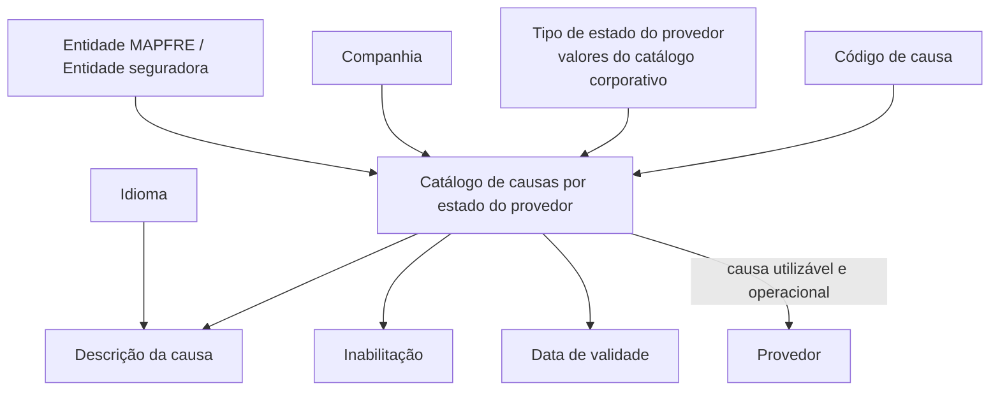

# Definição das Causas por Estado do Provedor — Catálogo Corporativo

## 1. Metadados do Documento
- **Arquivo de Origem:** `Não identificado no conteúdo extraído`
- **Tipo de Documento:** Especificação Funcional
- **Domínio / Sistema:** Documentación Reef / MAPFRE / Catálogo de estados de provedores
- **Público-Alvo:** Negócio, analistas funcionais, administradores de catálogos e equipes de operação
- **Data/Versão Identificada:** Não identificada

---

## 2. Resumo Executivo & Contexto de Negócio

O documento descreve o catálogo de **causas associadas aos estados dos provedores**. Durante a relação profissional com a entidade seguradora, um provedor pode transitar por estados distintos; a entidade precisa identificar os motivos pelos quais o provedor é enquadrado em cada estado.

A configuração do catálogo é realizada por companhia, tipo de estado do provedor, código de causa e idioma. Cada causa possui uma descrição localizada, permitindo que a denominação seja apresentada conforme o idioma empregado na definição.

O catálogo também suporta controles operacionais. A propriedade de inabilitação impede que uma causa desativada seja usada em novas atribuições a provedores. A data de validade determina a partir de quando o registro está operacional, permitindo preservar histórico de alterações ao longo do tempo.

O documento não estabelece uma codificação corporativa obrigatória para as causas. Contudo, indica que a entidade MAPFRE deve avaliar a conveniência de utilizar o catálogo transversalmente nos processos da companhia para posterior exploração das informações.

---

## 3. Arquitetura, Componentes & Tecnologias Envolvidas

Os elementos funcionais identificados são:

- **Catálogo de causas por estado do provedor:** estrutura que relaciona códigos de causa a tipos de estado.
- **Provedores:** entidades às quais as causas e estados podem ser atribuídos.
- **Entidade seguradora / MAPFRE:** organização que utiliza e explora o catálogo.
- **Companhia:** código da companhia para a qual o registro de catálogo é definido.
- **Catálogo corporativo:** fonte dos valores configurados para o tipo de estado do provedor.
- **Idioma:** chave usada para configurar a descrição da causa em idiomas distintos.
- **Inabilitação:** controle que desativa uma causa para atribuição a provedores.
- **Data de validade:** data a partir da qual o registro configurado é operacional.
- **Documentación Reef / Mapfredocument:** referências apresentadas na extração documental.



**Nota de Análise:** o conteúdo não detalha arquitetura técnica de software, interfaces, métodos HTTP, contratos JSON, banco de dados, ambientes de implantação ou integrações entre sistemas.

---

## 4. Regras de Negócio, Especificações Funcionais & Processos

1. Um provedor pode assumir diferentes estados durante sua relação profissional com a entidade seguradora.
2. A entidade seguradora necessita identificar a causa ou motivo pelo qual um provedor está associado a determinado estado.
3. Cada registro do catálogo deve indicar a **companhia** sobre a qual a definição está sendo realizada.
4. Cada registro deve indicar o **tipo de estado do provedor**, conforme os valores configurados no catálogo corporativo.
5. Cada registro deve indicar um **código de causa**, correspondente à causa do provedor configurada no catálogo.
6. Cada registro deve indicar um **idioma**, que funciona como chave para a configuração da causa.
7. Cada causa deve possuir uma **descrição**, definida no idioma configurado.
8. A propriedade de **inabilitação** define se uma causa está desativada e, portanto, não pode ser utilizada na atribuição a provedores.
9. A **data de validade** define a partir de qual data o registro configurado está operacional no sistema.
10. O uso correto da data de validade permite manter histórico das alterações realizadas ao longo do tempo.
11. Não existe preferência ou recomendação obrigatória para padronizar a codificação das causas no sistema.
12. A entidade MAPFRE deve avaliar a conveniência de utilizar transversalmente o catálogo nos processos da companhia.
13. O documento sugere, como exemplo de exploração, o agrupamento das causas relacionadas a cada estado de provedor com base em uma codificação previamente estabelecida.

### Exemplos de estado, causa e descrição

| Estado | Causa | Descrição |
| :--- | :--- | :--- |
| AC | 1 | JUNIOR |
| AC | 2 | EXPERTO |
| BA | 100 | BAJA POR ENFERMEDAD |
| BA | 150 | BAJA POR FRAUDE |
| BA | 200 | BAJA POR FALTA DE CALIDAD |
| SA | 500 | POR ENFERMEDAD |
| SA | 550 | POR REMODELACIÓN |
| SA | 555 | POR INVESTIGACIÓN FRAUDE |

**Nota de Análise:** o documento apresenta os códigos `AC`, `BA` e `SA`, mas não fornece a expansão formal dessas siglas.

---

## 5. Tabelas de Parâmetros, Ambientes e Estruturas de Dados

| Item / Parâmetro | Descrição / Função | Tipo / Valores / Formato | Ambiente / Observações |
| :--- | :--- | :--- | :--- |
| Companhia | Código da companhia para a qual o registro do catálogo está sendo definido | Código de companhia | Não detalhado |
| Tipo Estado do Provedor | Determina e especifica o tipo de estado | Valores configurados no catálogo corporativo | Não detalhado |
| Código de Causa | Código ou chave da causa do provedor configurada no catálogo | Código / chave | Exemplos: `1`, `2`, `100`, `150`, `200`, `500`, `550`, `555` |
| Idioma | Chave do idioma usado na configuração da causa | Idioma; exemplos citados: espanhol, inglês, alemão | Usado para localizar a descrição |
| Descrição da Causa | Denominação ou descrição da causa do provedor conforme o idioma | Texto | Exemplo em espanhol: `JUNIOR`, `EXPERTO` |
| Inabilitação | Define se a chave da causa está desativada para atribuição a provedores | Estado de habilitação/inabilitação | Causa inabilitada não pode ser utilizada |
| Data de Validade | Define a data a partir da qual o registro está operacional | Data | Permite histórico de mudanças |
| Estado | Estado associado à causa do provedor | Código | Exemplos: `AC`, `BA`, `SA` |
| Causa | Identificador da causa dentro de um estado | Código numérico nos exemplos | Sem padronização obrigatória definida |

---

## 6. Bateria de Perguntas & Respostas para RAG (FAQ Sintético)

### P1: Qual é o objetivo do catálogo de causas por estado do provedor?
**R:** O catálogo tem o objetivo de identificar as causas ou motivos pelos quais um provedor está associado a determinado estado em sua relação profissional com a entidade seguradora.

### P2: Quais informações compõem a definição de uma causa de provedor?
**R:** A definição apresentada inclui companhia, tipo de estado do provedor, código de causa, idioma, descrição da causa, inabilitação e data de validade.

### P3: De onde vêm os valores possíveis para o tipo de estado do provedor?
**R:** O tipo de estado do provedor é determinado conforme os valores configurados no catálogo corporativo.

### P4: Para que serve a propriedade de idioma no catálogo?
**R:** A propriedade de idioma é a chave usada na configuração da causa do provedor e permite definir sua descrição em idiomas como espanhol, inglês ou alemão.

### P5: O que acontece quando uma causa está inabilitada?
**R:** Uma causa inabilitada ou desativada não pode ser utilizada em sua atribuição aos provedores.

### P6: Qual é a finalidade da data de validade de uma causa?
**R:** A data de validade determina a partir de quando o registro configurado está operacional no sistema. Seu uso correto permite manter histórico das mudanças efetuadas ao longo do tempo.

### P7: Existe uma codificação obrigatória para as causas dos estados dos provedores?
**R:** Não. O documento informa que não existe preferência nem recomendação para estabelecer ou padronizar a codificação no sistema.

### P8: Qual recomendação é feita à entidade MAPFRE sobre o uso do catálogo?
**R:** A entidade MAPFRE deve analisar a conveniência de utilizar transversalmente o catálogo de causas nos processos da companhia, para permitir sua correta exploração posterior.

### P9: Quais exemplos de causas estão associados ao estado BA?
**R:** O documento apresenta `BA 100 BAJA POR ENFERMEDAD`, `BA 150 BAJA POR FRAUDE` e `BA 200 BAJA POR FALTA DE CALIDAD`.

### P10: Quais exemplos de causas estão associados ao estado SA?
**R:** O documento apresenta `SA 500 POR ENFERMEDAD`, `SA 550 POR REMODELACIÓN` e `SA 555 POR INVESTIGACIÓN FRAUDE`.

### P11: O documento detalha como os códigos AC, BA e SA devem ser interpretados?
**R:** Não. O conteúdo mostra exemplos de registros com os códigos AC, BA e SA, mas não define formalmente o significado dessas siglas.

### P12: O documento informa APIs, contratos JSON ou operações técnicas de integração?
**R:** Não. O conteúdo disponível é funcional e não detalha métodos HTTP, contratos JSON, interfaces, banco de dados, integrações ou tecnologias de implementação.

---

## 7. Glossário de Termos, Siglas & Conceitos-Chave

- **AC:** Código de estado exibido nos exemplos do catálogo; significado não definido no conteúdo.
- **BA:** Código de estado exibido nos exemplos do catálogo; significado não definido no conteúdo.
- **SA:** Código de estado exibido nos exemplos do catálogo; significado não definido no conteúdo.
- **Causa do Provedor:** Motivo associado ao estado de um provedor.
- **Catálogo Corporativo:** Catálogo que contém os valores configurados para o tipo de estado do provedor.
- **Companhia:** Código da companhia sobre a qual um registro de catálogo é definido.
- **Data de Validade:** Data a partir da qual um registro configurado se torna operacional.
- **Inabilitação:** Condição que desativa uma causa e impede sua atribuição a provedores.
- **MAPFRE:** Entidade mencionada como responsável por avaliar o uso transversal do catálogo.
- **Provedor:** Entidade que pode assumir diferentes estados em sua relação com a entidade seguradora.
- **Reef:** Referência documental apresentada como `Documentation / DOCUMENTACIÓN Reef`.
- **Mapfredocument:** Referência apresentada no conteúdo bruto; sem detalhamento adicional.

---

## 8. Notas Críticas, Riscos & Limitações

- O documento não identifica arquivo de origem, data, versão ou responsável funcional além da referência de proprietário exibida no conteúdo bruto.
- O conteúdo não define o significado dos códigos de estado `AC`, `BA` e `SA`.
- Não há lista completa de estados, causas, companhias, idiomas ou valores aceitos pelo catálogo corporativo.
- Não são detalhados mecanismos de validação, regras de coexistência entre causas, regras de alteração de registros históricos ou tratamento de causas já atribuídas a provedores.
- Não há detalhamento técnico sobre banco de dados, serviços, APIs, autenticação, permissões, integração ou ambientes.
- A recomendação de agrupamento por codificação é apresentada apenas como exemplo; não constitui padrão obrigatório no texto.
- O documento referencia diretrizes e documentos funcionais cuja leitura é recomendada para evitar interpretações isoladas, mas esses vínculos não são especificados na extração disponível.

---

## 9. Conteúdo Bruto Estruturado (Referência Fiel)

```text
--- [PÁGINA 1 DE 2] ---

DEFINICIÓN de las CAUSAS por ESTADO del PROVEEDOR
Contexto
Los proveedores a lo largo de su desempeño profesional pueden pasar por diferentes estados en su relación con la entidad aseguradora
además que la entidad aseguradora necesita identicar las causas o motivos por los que pueden estar asimilados en uno u otro estado.
Objetivo
Funcionalmente el núcleo del Sistema cuenta con la posibilidad de dividir la organización territorial de los países en divisiones o Zonas
Geográcas para su empleo especíco por parte de los Proveedores de la Entidad.
Propiedades
Otras Propiedades
Propiedades
Compañía
Este Atributo del catálogo contiene el código de la compañía sobre la que se está realizando la denición del registro en el catálogo.
Tipo Estado del Proveedor
Este Atributo determina y especica el Tipo de Estado de acuerdo con los valores que estén congurados en el catálogo Corporativo.
Código de Causa
Este Atributo determina el código o clave de la Causa del Proveedor que se está congurando en el catálogo.
Idioma
Esta propiedad es la clave del Idioma empleado en la conguración de la Causa del Proveedor, como por ejemplo: español, inglés, alemán, ...
Descripción de la Causa
Esta propiedad contiene la denominación o descripción de la Causa del Proveedor de acuerdo con el idioma utilizado en la denición.
A modo de ejemplo si el idioma de la denición fuera el español...
ESTADO CAUSA DESCRIPCIÓN
AC 1 JUNIOR
Documentation / DOCUMENTACIÓN Reef
DOCUMENTACIÓN Reef
Mapfredocument
DOCUMENTACIÓN Reef
Owner
user:agonzalez_mapfre.com
Lifecycle
Approved Source
 / 
 VL
Buscar Inicio Soluciones Arquitecturas APIs Componentes Cloud Documentación Zeus Reef Ayuda
ES


--- [PÁGINA 2 DE 2] ---

ESTADO CAUSA DESCRIPCIÓN
AC 2 EXPERTO
BA 100 BAJA POR ENFERMEDAD
BA 150 BAJA POR FRAUDE
BA 200 BAJA POR FALTA DE CALIDAD
SA 500 POR ENFERMEDAD
SA 550 POR REMODELACIÓN
SA 555 POR INVESTIGACIÓN FRAUDE
... ...
Otras Propiedades
Inhabilitación
Esta propiedad establece que la clave de la Causa está desactivada o inhabilitada para poder ser utilizada en su asignación a los
Proveedores.
Fecha de Validez
Esta propiedad determina la fecha a partir de la cual el registro congurado está operativo en el sistema por lo que su correcto uso permite
tener un histórico de los cambios efectuados a lo largo del tiempo.
Vínculos
Relación de Directrices y Documentos funcionales cuya lectura recomendada para evitar que la interpretación aislada del presente
documento pueda conducir a error.
Idiomas
Preguntas frecuentes
(1) ¿Existe alguna recomendación operativa que deba ser tomada en consideración localmente en la codicación, uso y denición del
catálogo de las causas en los estados de los Proveedores?
No existe una preferencia ni recomendación para establecer o estandarizar en el sistema su codicación, si bien la entidad MAPFRE debe
analizar la conveniencia de utilizar transversalmente en los procesos de la compañía este catálogo de información para su correcta y
posterior explotación, e.g:
Agrupando las Causas relacionadas con cada uno de los estados de los proveedores de acuerdo con una codicación pre-establecida, ...
```
