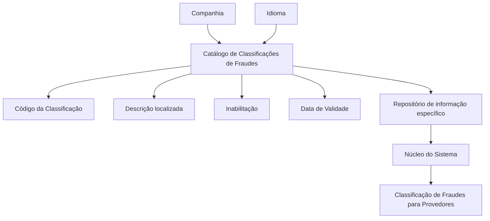

# Definição de Classificações de Fraudes para Provedores — Documentação Reef

## 1. Metadados do Documento
- **Arquivo de Origem:** `Não informado`
- **Tipo de Documento:** `Especificação Funcional de Catálogo`
- **Domínio / Sistema:** `Reef / Mapfre / Provedores`
- **Público-Alvo:** `Não identificado no texto`
- **Data/Versão Identificada:** `Não identificada`
- **Owner identificado:** `user:agonzalez_mapfre.com`
- **Lifecycle identificado:** `Approved Source / VL`

---

## 2. Resumo Executivo & Contexto de Negócio

O documento define o catálogo de **Classificações de Fraudes** para provedores no núcleo do Sistema. A finalidade declarada é permitir que fraudes sejam classificadas em um repositório específico de informações.

A configuração da classificação de fraude é contextualizada por companhia e idioma. Cada classificação possui um código e uma descrição localizada conforme o idioma configurado. O documento apresenta, como exemplo em espanhol, as classificações `DOL — Doloso` e `OCA — Ocasional`.

O catálogo também contém propriedades operacionais para controlar a disponibilidade e a vigência temporal dos registros. A propriedade de inabilitação impede o uso de um registro configurado, enquanto a data de validade determina a partir de quando o registro passa a estar operativo no Sistema.

A gestão temporal por data de validade permite manter histórico das alterações efetuadas no catálogo. O documento recomenda a consulta de diretrizes e documentos funcionais relacionados, pois a interpretação isolada da especificação pode levar a erros.

---

## 3. Arquitetura, Componentes & Tecnologias Envolvidas

Os elementos explicitamente citados são:

| Componente / Elemento | Papel descrito |
| :--- | :--- |
| Sistema | Núcleo que possibilita classificar fraudes. |
| Repositório de informação específico | Repositório destinado às classificações de fraudes. |
| Catálogo de Classificações de Fraudes | Estrutura de configuração das classificações de fraudes de provedores. |
| Companhia | Contexto organizacional da definição da classificação. |
| Idioma | Contexto linguístico da configuração e descrição da classificação. |
| Reef | Referência de documentação exibida no conteúdo bruto. |
| Mapfre | Referência organizacional exibida como `Mapfredocument`. |
| Provedores | Entidade de negócio associada às fraudes classificadas. |



> **Nota de Análise:** O conteúdo não detalha integrações, interfaces, métodos HTTP, contratos de dados, tecnologias de implementação, bancos de dados ou ambientes técnicos.

---

## 4. Regras de Negócio, Especificações Funcionais & Processos

### 4.1 Objetivo funcional

O núcleo do Sistema possui a possibilidade de classificar os fraudes em um repositório de informação específico.

### 4.2 Definição da classificação de fraude

A configuração de uma classificação de fraude para provedores é formada pelos seguintes atributos e propriedades:

1. **Companhia**
   - Contém o código da companhia sobre a qual está sendo realizada a definição das classificações de fraudes.

2. **Idioma**
   - Contém a chave do idioma utilizado na configuração das classificações de fraudes cometidos por provedores.
   - Os exemplos de idiomas citados são espanhol, inglês e português.

3. **Código da Classificação**
   - Contém a chave ou o código da classificação de fraude.

4. **Descrição**
   - Identifica a descrição da classificação conforme o idioma utilizado na definição.
   - A descrição é dependente do idioma configurado.

5. **Inabilitação**
   - Estabelece que o registro configurado está desativado ou inabilitado para utilização.

6. **Data de Validade**
   - Indica ao Sistema a data a partir da qual o registro configurado está operativo.
   - O uso correto da data de validade permite manter um histórico das alterações efetuadas ao longo do tempo.

### 4.3 Exemplos de classificação apresentados

| Tipo / Código | Descrição | Idioma do exemplo |
| :--- | :--- | :--- |
| `DOL` | Doloso | Espanhol |
| `OCA` | Ocasional | Espanhol |

### 4.4 Diretrizes de interpretação

- O documento relaciona diretrizes e documentos funcionais cuja leitura é recomendada.
- A interpretação isolada desta documentação pode conduzir a erro.
- A pergunta frequente sobre recomendação operacional local para codificação, uso e definição do catálogo é respondida como `N/A`.

---

## 5. Tabelas de Parâmetros, Ambientes e Estruturas de Dados

| Item / Parâmetro | Descrição / Função | Tipo / Valores / Formato | Ambiente / Observações |
| :--- | :--- | :--- | :--- |
| Companhia | Código da companhia na qual é definida a classificação de fraudes. | Código de companhia; formato não detalhado. | Aplicável à definição do catálogo. |
| Idioma | Chave do idioma empregado na configuração da classificação e de sua descrição. | Chave de idioma; exemplos: espanhol, inglês, português. | Aplicável a fraudes cometidos por provedores. |
| Código da Classificação | Chave ou código da classificação de fraude. | Código; formato não detalhado. | Exemplos apresentados: `DOL`, `OCA`. |
| Descrição | Descrição da classificação conforme o idioma usado na definição. | Texto localizado. | Exemplo em espanhol: `Doloso`, `Ocasional`. |
| Inabilitação | Define que o registro configurado está desativado ou inabilitado para uso. | Estado de inabilitação; valores não detalhados. | Impede a utilização do registro. |
| Data de Validade | Data a partir da qual o registro configurado está operativo no Sistema. | Data; formato não detalhado. | Permite histórico de alterações ao longo do tempo. |
| Repositório de informação específico | Repositório no qual são classificadas as fraudes. | Não detalhado. | Associado ao núcleo do Sistema. |
| Owner | Responsável identificado na documentação. | `user:agonzalez_mapfre.com` | Exibido no conteúdo bruto. |
| Lifecycle | Estado documental identificado. | `Approved Source / VL` | Exibido no conteúdo bruto. |

---

## 6. Bateria de Perguntas & Respostas para RAG (FAQ Sintético)

### P1: Qual é o objetivo do catálogo de Classificações de Fraudes para Provedores?
**R:** O catálogo permite que o núcleo do Sistema classifique fraudes em um repositório de informação específico. A classificação é configurada no contexto de uma companhia e de um idioma.

### P2: Qual atributo identifica a companhia associada a uma classificação de fraude?
**R:** O atributo **Companhia** contém o código da companhia sobre a qual está sendo realizada a definição das classificações de fraudes.

### P3: Para que serve a propriedade Idioma na classificação de fraudes?
**R:** A propriedade **Idioma** contém a chave do idioma utilizado na configuração das classificações de fraudes cometidos por provedores. O documento cita espanhol, inglês e português como exemplos.

### P4: O que representa o Código da Classificação?
**R:** O **Código da Classificação** contém a chave ou o código que identifica uma classificação de fraude. O documento apresenta `DOL` e `OCA` como exemplos de códigos.

### P5: Como a descrição de uma classificação de fraude é definida?
**R:** A propriedade **Descrição** identifica a descrição da classificação de acordo com o idioma empregado em sua definição. No exemplo em espanhol, `DOL` corresponde a `Doloso` e `OCA` corresponde a `Ocasional`.

### P6: Qual é o efeito da propriedade Inabilitação?
**R:** A propriedade **Inabilitação** estabelece que o registro configurado está desativado ou inabilitado para ser utilizado.

### P7: Quando um registro de classificação passa a estar operativo no Sistema?
**R:** Um registro passa a estar operativo a partir da data definida na propriedade **Data de Validade**.

### P8: Como o catálogo preserva o histórico de mudanças?
**R:** O documento informa que o uso correto da **Data de Validade** permite manter um histórico das alterações efetuadas ao longo do tempo.

### P9: Existe recomendação operacional local documentada para codificação, uso e definição do catálogo?
**R:** Não. A seção de perguntas frequentes responde `N/A` à pergunta sobre recomendações operacionais locais para codificação, uso e definição do catálogo de classificações de fraudes para provedores.

### P10: O documento descreve métodos HTTP, contratos JSON ou integrações técnicas?
**R:** Não. O conteúdo descreve propriedades funcionais do catálogo, mas não apresenta métodos HTTP, contratos JSON, integrações, tecnologias de implementação ou detalhes de infraestrutura.

---

## 7. Glossário de Termos, Siglas & Conceitos-Chave

- **Classificação de Fraude:** Categoria configurada no catálogo para identificar fraudes associadas a provedores.
- **Companhia:** Código da empresa ou companhia sobre a qual é definida a classificação de fraude.
- **Data de Validade:** Data a partir da qual um registro configurado passa a estar operativo no Sistema.
- **DOL:** Código de classificação exemplificado com a descrição `Doloso` em espanhol.
- **Idioma:** Chave linguística utilizada para configurar e apresentar a descrição de uma classificação.
- **Inabilitação:** Propriedade que determina que um registro está desativado ou indisponível para utilização.
- **OCA:** Código de classificação exemplificado com a descrição `Ocasional` em espanhol.
- **Provedores:** Entidade de negócio para a qual são tratadas as classificações de fraudes.
- **Reef:** Referência de documentação exibida como `DOCUMENTACIÓN Reef`.
- **VL:** Valor exibido no campo de lifecycle como `Approved Source / VL`; o significado da sigla não é detalhado.

---

## 8. Notas Críticas, Riscos & Limitações

- O documento não informa o nome do arquivo de origem, data, versão formal ou público-alvo.
- O conteúdo não detalha o formato técnico dos campos, tais como tipo de dado, tamanho, obrigatoriedade, unicidade ou valores permitidos.
- O documento não informa como a inabilitação é representada tecnicamente.
- O documento não especifica o formato da data de validade nem regras para datas futuras, datas expiradas ou sobreposição de vigências.
- Não há detalhamento de APIs, integrações, persistência, segurança, permissões, auditoria ou tratamento de erros.
- A documentação recomenda consultar diretrizes e documentos funcionais relacionados para evitar erros de interpretação decorrentes da leitura isolada.
- A pergunta frequente sobre recomendações operacionais locais possui resposta `N/A`; portanto, não há orientação adicional apresentada no conteúdo fornecido.
- O texto extraído possui caracteres de codificação substituídos por `�` em algumas palavras, como `clasi�car`, `de�nición` e `con�guración`.

---

## 9. Conteúdo Bruto Estruturado (Referência Fiel)

```text
--- [PÁGINA 1 DE 2] ---

DEFINICIÓN de CLASIFICACIONES de FRAUDES
Objetivo
Funcionalmente, el núcleo del Sistema cuenta con la posibilidad de clasicar los Fraudes en un repositorio de información especíco.
Propiedades Operativas
Otras Propiedades
Propiedades Operativas
Compañía
Este Atributo del catálogo contiene el código de la compañía sobre la que se está realizando la denición de las clasicaciones de los
Fraudes.
Idioma
Esta propiedad contiene la clave del Idioma empleado en la conguración de las clasicaciones de los fraudes cometidos por los
Proveedores como por ejemplo: español, inglés, Portugués, ...
Código de la Clasicación
Este Atributo contiene la clave o el código de la Clasicación del Fraude.
Descripción
Este Atributo del catálogo de conguración identica la descripción de la Clasicación de acuerdo con el idioma utilizado en su denición.
A modo de ejemplo y si el idioma empleado en la denición fuera el Español...
TIPO DESCRIPCIÓN
DOL Doloso
OCA Ocasional
... ...
Otras Propiedades
Documentation / DOCUMENTACIÓN Reef
DOCUMENTACIÓN Reef
Mapfredocument
DOCUMENTACIÓN Reef
Owner
user:agonzalez_mapfre.com
Lifecycle
Approved Source
 / 
 VL
Buscar Inicio Soluciones Arquitecturas APIs Componentes Cloud Documentación Zeus Reef Ayuda
ES


--- [PÁGINA 2 DE 2] ---

Inhabilitación
Esta propiedad establece que el Registro congurado está desactivado o inhabilitado para ser utilizado.
Fecha de Validez
Esta propiedad le indica al Sistema la fecha a partir de la cual el registro congurado está operativo en el sistema por lo que su correcto uso
permite tener un histórico de los cambios efectuados a lo largo del tiempo.
Vínculos
Relación de Directrices y Documentos funcionales cuya lectura recomendada para evitar que la interpretación aislada del presente
documento pueda conducir a error.
Proveedores
Preguntas frecuentes
(1) ¿Existe alguna recomendación operativa que deba ser tomada en consideración localmente en la codicación, uso y denición del
catálogo de Clasicaciones de los Fraudes para los Proveedores?
N/A
```
