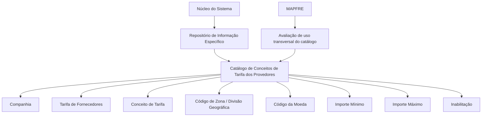

# Configuração de Conceitos de Tarifa de Fornecedores por Zona Geográfica e Tarifa

## 1. Metadados do Documento
- **Arquivo de Origem:** `Não identificado no conteúdo fornecido`
- **Tipo de Documento:** `Especificação Funcional / Documentação de Catálogo`
- **Domínio / Sistema:** `DOCUMENTACIÓN Reef / MAPFRE — Tarifas de Provedores`
- **Público-Alvo:** `Analistas funcionais, equipes de configuração, negócio e operação`
- **Data/Versão Identificada:** `Não identificada`

---

## 2. Resumo Executivo & Contexto de Negócio

O documento descreve a configuração dos **Conceitos de Tarifa dos Provedores** por **Zona Geográfica** e por **Tarifa**, em um catálogo de informações específico do núcleo do sistema. Esse repositório é entregue inicialmente às instalações sem conteúdo, exigindo que a entidade realize a codificação e a manutenção dos registros necessários.

Cada registro de configuração associa uma companhia, uma tarifa de fornecedor, um conceito de tarifa, uma divisão geográfica, uma moeda e limites monetários mínimo e máximo. Dessa forma, o catálogo permite controlar quais conceitos tarifários podem ser aplicados a fornecedores em determinado contexto geográfico e monetário.

O documento estabelece que os valores mínimo e máximo devem ser interpretados conforme a moeda definida no registro. O valor máximo representa um limite de utilização do conceito de tarifa pelo fornecedor, enquanto o valor mínimo determina o menor montante que pode ser atribuído ao conceito tarifário.

Também existe uma propriedade de inabilitação, que permite marcar o código de conceito de tarifa como desativado ou indisponível para uso. O documento não impõe uma convenção de codificação padronizada, mas recomenda que a entidade MAPFRE avalie o uso transversal desse catálogo nos processos corporativos para permitir sua exploração posterior de forma adequada.

---

## 3. Arquitetura, Componentes & Tecnologias Envolvidas

O conteúdo descreve um modelo funcional de catálogo no núcleo do sistema, sem detalhar arquitetura técnica, APIs, protocolos, bancos de dados, métodos HTTP, contratos JSON, servidores ou ambientes de implantação.

### Componentes e entidades identificados

| Componente / Entidade | Papel identificado no documento |
| :--- | :--- |
| Núcleo do Sistema | Possui a funcionalidade de codificar tarifas de provedores em um repositório de informação específico. |
| Repositório de informação | Catálogo inicialmente entregue vazio às instalações para armazenamento da configuração. |
| Catálogo de Conceitos de Tarifa dos Provedores | Catálogo configurado por companhia, tarifa, conceito, zona geográfica, moeda e limites monetários. |
| Companhia | Define o código da companhia para a qual a configuração está sendo realizada. |
| Tarifa | Define o código ou chave da tarifa de fornecedores configurada no catálogo. |
| Conceito | Define o código ou chave do conceito de tarifa configurado. |
| Código de Zona | Define o código ou chave da divisão geográfica de fornecedores. |
| Código da Moeda | Define a moeda utilizada na configuração do registro. |
| MAPFRE | Entidade que deve avaliar a conveniência de uso transversal do catálogo em seus processos. |
| DOCUMENTACIÓN Reef | Repositório ou contexto documental apresentado no rodapé do conteúdo. |



> **Nota de Análise:** o documento não detalha tecnologias de implementação, persistência de dados, integrações, métodos de acesso ou permissões para o catálogo.

---

## 4. Regras de Negócio, Especificações Funcionais & Processos

### Objetivo funcional

1. O núcleo do sistema dispõe da capacidade de codificar as tarifas dos provedores.
2. A codificação é realizada em um repositório de informação específico.
3. O repositório é inicialmente entregue às instalações sem conteúdo.
4. A instalação ou entidade responsável deve preencher e definir os registros aplicáveis ao seu contexto operacional.

### Estrutura da configuração

A configuração de um Conceito de Tarifa de Provedores é composta pelos seguintes critérios funcionais:

1. Identificação da **companhia** sobre a qual a configuração será aplicada.
2. Identificação da **tarifa de fornecedores** que será configurada.
3. Identificação do **conceito de tarifa** associado à tarifa.
4. Identificação da **divisão geográfica de fornecedores**, por meio do código de zona.
5. Definição da **moeda** usada na configuração.
6. Definição do **importe mínimo** permitido para o conceito de tarifa.
7. Definição do **importe máximo** ou limite aplicável ao conceito de tarifa.
8. Definição do estado de **inabilitação**, quando o código do conceito de tarifa não puder ser utilizado.

### Regras para valores monetários

- O **Importe Mínimo** estabelece o valor mínimo que pode ser atribuído ao conceito de tarifa.
- O **Importe Mínimo** deve ser interpretado de acordo com a moeda definida no registro.
- O **Importe Máximo** estabelece o limite que pode ser considerado no uso do conceito de tarifa pelo fornecedor.
- O **Importe Máximo** deve ser interpretado de acordo com a moeda definida no registro.
- O documento não informa regras adicionais de validação entre importe mínimo e importe máximo, como obrigatoriedade, igualdade, precedência ou comportamento para valores vazios.

### Regra de inabilitação

- A propriedade **Inhabilitación** indica que o código do conceito de tarifa está desativado ou inabilitado.
- Um código de conceito de tarifa inabilitado não pode ser utilizado.
- O documento não especifica se a inabilitação é temporária, se possui data de vigência ou se preserva configurações históricas.

### Diretriz de codificação e uso corporativo

- Não existe preferência ou recomendação explícita para estabelecer ou padronizar a codificação no sistema.
- A entidade MAPFRE deve analisar a conveniência de usar transversalmente o catálogo de informações nos processos da companhia.
- A análise de uso transversal visa permitir a exploração correta e posterior das informações cadastradas.

### Documentos e diretrizes relacionados

A leitura dos documentos relacionados é recomendada para impedir que uma interpretação isolada desta documentação leve a conclusões incorretas:

- Tarifas de los Proveedores.
- Conceptos de Tarifa.
- Monedas.

---

## 5. Tabelas de Parâmetros, Ambientes e Estruturas de Dados

| Item / Parâmetro | Descrição / Função | Tipo / Valores / Formato | Ambiente / Observações |
| :--- | :--- | :--- | :--- |
| Companhia | Código da companhia sobre a qual é realizada a configuração do Conceito de Tarifa dos Provedores. | Código de companhia; formato não detalhado. | Aplicável ao registro de configuração. |
| Tarifa | Código ou chave da Tarifa dos Provedores configurada no catálogo. | Código ou chave; formato não detalhado. | Associada à companhia e ao conceito configurado. |
| Conceito | Código ou chave do Conceito de Tarifa dos Provedores configurado no catálogo. | Código ou chave; formato não detalhado. | Pode ser inabilitado para uso. |
| Código de Zona | Código ou chave da Divisão Geográfica dos Provedores configurada. | Código ou chave; formato não detalhado. | Representa a dimensão geográfica da configuração. |
| Código da Moeda | Código da moeda utilizada na configuração do registro. | Código de moeda; padrão não detalhado. | Define a moeda de referência dos importes mínimo e máximo. |
| Importe Mínimo | Menor importe que pode ser atribuído ao conceito de tarifa. | Valor monetário; formato e precisão não detalhados. | Deve estar de acordo com a moeda definida no registro. |
| Importe Máximo | Limite máximo contemplado no uso do conceito de tarifa pelo fornecedor. | Valor monetário; formato e precisão não detalhados. | Deve estar de acordo com a moeda definida no registro. |
| Inhabilitación | Indica que o código do conceito de tarifa está desativado ou inabilitado para utilização. | Estado de inabilitação; valores não detalhados. | Impede o uso do código do conceito de tarifa. |
| Repositório de informação específico | Local lógico em que as tarifas de provedores são codificadas. | Repositório; tecnologia não detalhada. | Entregue inicialmente vazio às instalações. |
| Uso transversal do catálogo | Avaliação de conveniência de uso corporativo do catálogo nos processos da companhia. | Diretriz operacional. | Responsabilidade de análise atribuída à entidade MAPFRE. |

---

## 6. Bateria de Perguntas & Respostas para RAG (FAQ Sintético)

### P1: Qual é o objetivo do catálogo de Conceitos de Tarifa dos Provedores?
**R:** O catálogo permite codificar e configurar conceitos de tarifa de fornecedores em um repositório de informação específico do núcleo do sistema. A configuração considera companhia, tarifa, conceito, zona geográfica, moeda, importe mínimo, importe máximo e estado de inabilitação.

### P2: O repositório de tarifas de provedores já vem preenchido na instalação inicial?
**R:** Não. O documento informa que o repositório específico de informação é entregue inicialmente às instalações vazio de conteúdo. A organização deve realizar a codificação e a configuração dos registros necessários.

### P3: Qual atributo identifica a companhia na configuração de um Conceito de Tarifa de Provedores?
**R:** O atributo **Compañía** contém o código da companhia sobre a qual está sendo realizada a configuração do Conceito de Tarifa dos Provedores.

### P4: Para que serve o atributo Tarifa?
**R:** O atributo **Tarifa** determina o código ou a chave da Tarifa dos Provedores que está sendo configurada no catálogo.

### P5: Como a zona geográfica é representada na configuração?
**R:** A zona geográfica é representada pelo atributo **Código de Zona**, que determina o código ou a chave da Divisão Geográfica dos Provedores configurada.

### P6: Como devem ser interpretados o Importe Mínimo e o Importe Máximo?
**R:** O Importe Mínimo define o menor valor que pode ser atribuído ao conceito de tarifa, e o Importe Máximo define o limite aplicável ao uso desse conceito pelo fornecedor. Ambos devem ser interpretados de acordo com a moeda definida no registro.

### P7: O que acontece quando um conceito de tarifa está inabilitado?
**R:** Quando a propriedade **Inhabilitación** indica que o código do conceito de tarifa está desativado ou inabilitado, esse código não pode ser utilizado.

### P8: O documento exige um padrão corporativo de codificação para o catálogo?
**R:** Não. O documento afirma que não existe preferência nem recomendação para estabelecer ou padronizar a codificação no sistema.

### P9: Qual recomendação é direcionada à entidade MAPFRE?
**R:** A entidade MAPFRE deve analisar a conveniência de utilizar transversalmente o catálogo de informações nos processos da companhia, visando sua correta exploração posterior.

### P10: Quais documentos devem ser consultados para evitar interpretação isolada da configuração?
**R:** O documento recomenda a leitura de **Tarifas de los Proveedores**, **Conceptos de Tarifa** e **Monedas**, pois a interpretação isolada da documentação atual pode conduzir a erro.

---

## 7. Glossário de Termos, Siglas & Conceitos-Chave

- **Companhia:** entidade empresarial identificada pelo código sobre o qual a configuração do conceito de tarifa é realizada.
- **Tarifa de Provedores:** tarifa associada a fornecedores, identificada por código ou chave no catálogo.
- **Conceito de Tarifa:** código ou chave de um conceito configurável associado a uma tarifa de fornecedores.
- **Código de Zona:** código ou chave da divisão geográfica dos fornecedores.
- **Divisão Geográfica:** dimensão territorial representada pelo Código de Zona na configuração.
- **Código da Moeda:** código da moeda aplicada ao registro de configuração e aos seus valores monetários.
- **Importe Mínimo:** menor valor monetário que pode ser atribuído ao conceito de tarifa, conforme a moeda do registro.
- **Importe Máximo:** limite máximo de valor considerado no uso do conceito de tarifa pelo fornecedor, conforme a moeda do registro.
- **Inhabilitación:** propriedade que indica que o código de um conceito de tarifa está desativado e não pode ser utilizado.
- **MAPFRE:** entidade mencionada como responsável por analisar a conveniência de uso transversal do catálogo em seus processos.
- **DOCUMENTACIÓN Reef:** identificação do contexto ou repositório documental exibido no conteúdo fornecido.

---

## 8. Notas Críticas, Riscos & Limitações

- O repositório de configuração é inicialmente entregue sem conteúdo; a ausência de codificação inicial pode impedir o uso operacional dos conceitos de tarifa.
- O documento não define padrão de codificação para companhias, tarifas, conceitos ou zonas. A falta de uma convenção corporativa pode dificultar o uso transversal e a exploração posterior do catálogo.
- Não são detalhados formatos, tamanhos, domínios permitidos ou obrigatoriedade dos campos.
- Não são especificadas validações entre Importe Mínimo e Importe Máximo.
- Não são descritos mecanismos de autorização, trilha de auditoria, histórico de alterações, vigência, aprovação ou publicação das configurações.
- Não há detalhes sobre integrações, APIs, tecnologias, banco de dados, ambientes, URLs, rotas de log ou procedimentos de implantação.
- A documentação recomenda consultar materiais relacionados, pois a interpretação isolada do catálogo pode levar a erro.
- **Nota de Análise:** o documento lista atributos funcionais do catálogo, mas não detalha métodos de manutenção, telas, contratos de integração ou comportamento técnico da persistência dos registros.

---

## 9. Conteúdo Bruto Estruturado (Referência Fiel)

```text
--- [PÁGINA 1 DE 2] ---

CONFIGURACIÓN de los CONCEPTOS de TARIFA de los
PROVEEDORES por ZONA GEOGRÁFICA y TARIFA
Objetivo
Funcionalmente, el núcleo del Sistema cuenta con la posibilidad de codicar las Tarifas de los Proveedores en un repositorio de información
especíco que se entrega inicialmente a las instalaciones vacío de contenido.
Propiedades
Otras Propiedades
Propiedades
Compañía
Este Atributo del catálogo contiene el código de la compañía sobre la que se está realizando la conguración del Concepto de Tarifa de los
Proveedores.
Tarifa
Este Atributo determina el código o clave de la Tarifa de los Proveedores que se está congurando en el catálogo.
Concepto
Este Atributo determina el código o clave del Concepto de Tarifa de los Proveedores que se está congurando en el catálogo.
Código de Zona
Este Atributo determina el código o clave de la División Geográca de los Proveedores que se está congurando en el catálogo.
Código de la Moneda
Esta propiedad indica el código de la Moneda empleada en la conguración del Registro.
Importe Mínimo
Esta propiedad establece el importe mínimo que se puede asignar al concepto de tarifa de acuerdo con la moneda de su denición.
Importe Máximo
Esta propiedad establece el importe máximo, entendido como límite, que se puede contemplar en el uso de este concepto de Tarifa por parte
del Proveedor y de acuerdo con la moneda de su denición.
Documentation / DOCUMENTACIÓN Reef
DOCUMENTACIÓN Reef
Mapfredocument
DOCUMENTACIÓN Reef
Owner
user:agonzalez_mapfre.com
Lifecycle
Approved Source
 / 
 VL
Buscar Inicio Soluciones Arquitecturas APIs Componentes Cloud Documentación Zeus Reef Ayuda
ES


--- [PÁGINA 2 DE 2] ---

Otras Propiedades
Inhabilitación
Esta propiedad establece que el Código del Concepto de Tarifa está desactivado o inhabilitado para poder ser utilizado.
Vínculos
Relación de Directrices y Documentos funcionales cuya lectura recomendada para evitar que la interpretación aislada del presente
documento pueda conducir a error.
Tarifas de los Proveedores
Conceptos de Tarifa
Monedas
Preguntas frecuentes
(1) ¿Existe alguna recomendación operativa que deba ser tomada en consideración localmente en la codicación, uso y denición del
catálogo de Conceptos de Tarifa de los Proveedores?
No existe una preferencia ni recomendación para establecer o estandarizar en el sistema su codicación, si bien la entidad MAPFRE debe
analizar la conveniencia de utilizar transversalmente en los procesos de la compañía este catálogo de información para su correcta y
posterior explotación.
```
