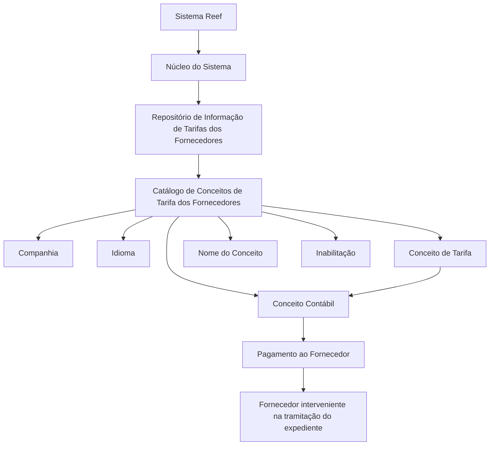

# Definição dos Conceitos de Tarifa dos Fornecedores — Documentação Reef

## 1. Metadados do Documento
- **Arquivo de Origem:** Não identificado no conteúdo fornecido
- **Tipo de Documento:** Especificação Funcional
- **Domínio / Sistema:** Reef / MAPFRE / Catálogo de Conceitos de Tarifa dos Fornecedores
- **Público-Alvo:** Negócio, Analistas Funcionais, Operação e equipes responsáveis pela configuração de catálogos
- **Data/Versão Identificada:** Não identificada
- **Lifecycle Identificado:** Approved
- **Owner Identificado:** `user:agonzalez_mapfre.com`

---

## 2. Resumo Executivo & Contexto de Negócio

O documento define os conceitos de tarifa dos fornecedores no contexto do sistema Reef. Funcionalmente, o núcleo do sistema permite codificar as tarifas dos fornecedores em um repositório de informação específico, entregue inicialmente às instalações sem conteúdo.

A configuração é baseada em um catálogo de conceitos de tarifa. Cada conceito é associado a uma companhia, idioma, código de conceito, nome ou descrição do conceito e, quando aplicável, a um conceito contábil utilizado no pagamento ao fornecedor que participou da tramitação de um expediente.

O catálogo permite manter descrições em diferentes idiomas, como espanhol, inglês e turco. O documento apresenta exemplos de códigos e descrições de conceitos de tarifa, incluindo tarifas gerais e tarifas de guincho.

O conteúdo também estabelece que um conceito de tarifa pode ser inabilitado, impedindo a utilização do seu código. Não há recomendação ou preferência obrigatória para padronizar a codificação dos conceitos no sistema; contudo, a entidade MAPFRE deve avaliar a conveniência de utilizar o catálogo de forma transversal nos processos da companhia, visando sua exploração posterior correta.

---

## 3. Arquitetura, Componentes & Tecnologias Envolvidas

O documento não detalha arquitetura técnica de infraestrutura, APIs, microsserviços, métodos HTTP, contratos JSON, servidores, bancos de dados ou tecnologias de implementação.

Os componentes funcionais identificados são:

| Componente | Papel identificado no documento |
| :--- | :--- |
| Sistema Reef | Sistema no qual o núcleo disponibiliza a codificação das tarifas dos fornecedores. |
| Núcleo do Sistema | Permite codificar tarifas de fornecedores em um repositório específico. |
| Repositório de Informação | Repositório específico destinado à codificação das tarifas dos fornecedores; inicialmente é entregue vazio às instalações. |
| Catálogo de Conceitos de Tarifa dos Fornecedores | Catálogo que concentra a definição dos conceitos de tarifa, suas descrições, idioma, companhia, conceito contábil e inabilitação. |
| Companhia | Atributo que identifica o código da companhia para a qual o conceito de tarifa está sendo definido. |
| Idioma | Chave do idioma utilizada na configuração e descrição dos conceitos de tarifa. |
| Conceito Contábil | Conceito de Cobrança e Pagamento Diverso utilizado para efetuar o pagamento ao fornecedor associado ao conceito de tarifa. |
| Fornecedor | Parte que intervém na tramitação do expediente e recebe pagamento associado ao conceito de tarifa. |
| Expediente | Elemento de tramitação no qual o fornecedor pode intervir. |
| MAPFRE | Entidade que deve analisar a conveniência de usar transversalmente o catálogo nos processos da companhia. |



> *Nota de Análise: o documento descreve relações funcionais entre o catálogo, o conceito de tarifa, o conceito contábil e o pagamento ao fornecedor, mas não especifica interfaces técnicas, persistência de dados, integrações, rotas, APIs ou mecanismos de autenticação.*

---

## 4. Regras de Negócio, Especificações Funcionais & Processos

### 4.1 Codificação das tarifas dos fornecedores

1. O núcleo do sistema possui a capacidade de codificar as tarifas dos fornecedores.
2. A codificação ocorre em um repositório de informação específico.
3. O repositório de informação é entregue inicialmente às instalações sem conteúdo.
4. O catálogo de conceitos de tarifa dos fornecedores é utilizado para configurar os conceitos de tarifa.

### 4.2 Propriedades do catálogo

1. **Companhia**
   - O atributo Companhia contém o código da companhia sobre a qual está sendo realizada a definição do conceito de tarifa dos fornecedores.

2. **Idioma**
   - A propriedade Idioma é a chave do idioma empregada na configuração dos conceitos de tarifa dos fornecedores.
   - O documento cita como exemplos de idioma: espanhol, inglês e turco.

3. **Conceito**
   - O atributo Conceito determina o código ou a chave do conceito de tarifa dos fornecedores que está sendo configurado no catálogo.

4. **Nome do Conceito**
   - A propriedade Nome do Conceito contém a denominação ou descrição do conceito de tarifa de acordo com o idioma utilizado na definição.
   - O documento demonstra exemplos cuja definição está no idioma espanhol.

5. **Conceito Contábil**
   - A propriedade Conceito Contábil identifica o conceito contábil, definido como “Concepto de Cobro y Pago Vario”.
   - O conceito contábil é utilizado para realizar o pagamento ao fornecedor.
   - O fornecedor pago é aquele que interveio na tramitação do expediente.
   - O conceito contábil utilizado deve estar associado ao conceito de tarifa.

6. **Inabilitação**
   - A propriedade Inabilitação estabelece que o código do conceito de tarifa está desativado ou inabilitado para uso.
   - Um código de conceito de tarifa inabilitado não pode ser utilizado.

### 4.3 Diretriz de codificação e uso transversal

1. O documento declara que não existe preferência nem recomendação para estabelecer ou padronizar a codificação dos conceitos de tarifa no sistema.
2. A entidade MAPFRE deve analisar a conveniência de utilizar transversalmente, nos processos da companhia, o catálogo de informações.
3. A avaliação de uso transversal visa assegurar a correta exploração posterior das informações do catálogo.

### 4.4 Documentos relacionados

O documento referencia a leitura recomendada de diretrizes e documentos funcionais para evitar que uma interpretação isolada cause erro:

- Tarifas dos Fornecedores
- Perguntas frequentes

---

## 5. Tabelas de Parâmetros, Ambientes e Estruturas de Dados

| Item / Parâmetro | Descrição / Função | Tipo / Valores / Formato | Ambiente / Observações |
| :--- | :--- | :--- | :--- |
| Companhia | Código da companhia para a qual está sendo definida a tarifa do fornecedor. | Código de companhia; formato não especificado. | Propriedade do catálogo. |
| Idioma | Chave do idioma usada na configuração dos conceitos de tarifa dos fornecedores. | Exemplos citados: espanhol, inglês e turco. | Propriedade do catálogo. |
| Conceito | Código ou chave do conceito de tarifa do fornecedor configurado no catálogo. | Código ou chave; formato não especificado. | Propriedade do catálogo. |
| Nome do Conceito | Denominação ou descrição do conceito de tarifa conforme o idioma definido. | Texto descritivo. | Propriedade do catálogo. |
| Conceito Contábil | Conceito de Cobrança e Pagamento Diverso associado ao conceito de tarifa para pagamento ao fornecedor. | Conceito contábil; formato não especificado. | Utilizado no pagamento ao fornecedor interveniente na tramitação do expediente. |
| Inabilitação | Indica que o código do conceito de tarifa está desativado ou inabilitado. | Estado de inabilitação; valores/formato não especificados. | Impede o uso do código do conceito de tarifa. |
| Repositório de Informação | Repositório específico no qual as tarifas dos fornecedores podem ser codificadas. | Não especificado. | Entregue inicialmente às instalações vazio de conteúdo. |
| Lifecycle | Estado de ciclo de vida identificado no cabeçalho do documento. | `Approved` | Metadado documental. |
| Owner | Proprietário identificado no cabeçalho do documento. | `user:agonzalez_mapfre.com` | Metadado documental. |

### Exemplos de conceitos de tarifa apresentados

| Conceito | Descrição |
| :--- | :--- |
| `1` | CONCEPTO 1 (TARIFA 1) |
| `2` | CONCEPTO 2 (TARIFA 2) |
| `A` | CONCEPTO 1 (TARIFA GRÚAS) |

> *Nota de Análise: o documento não informa tipos técnicos, tamanhos máximos, obrigatoriedade de preenchimento, valores permitidos, regras de unicidade ou modelo físico de persistência para os atributos do catálogo.*

---

## 6. Bateria de Perguntas & Respostas para RAG (FAQ Sintético)

### P1: Qual é o objetivo do catálogo de Conceitos de Tarifa dos Fornecedores no Reef?
**R:** O catálogo de Conceitos de Tarifa dos Fornecedores permite codificar as tarifas dos fornecedores em um repositório de informação específico disponibilizado pelo núcleo do sistema Reef. Esse repositório é entregue inicialmente às instalações sem conteúdo.

### P2: Quais propriedades são identificadas para configurar um conceito de tarifa de fornecedor?
**R:** O documento identifica as propriedades Companhia, Idioma, Conceito, Nome do Conceito, Conceito Contábil e Inabilitação. Companhia identifica a empresa, Idioma determina a chave linguística, Conceito representa o código ou chave, Nome do Conceito armazena a descrição, Conceito Contábil suporta o pagamento ao fornecedor e Inabilitação impede a utilização de um código desativado.

### P3: O que representa a propriedade Companhia no catálogo de tarifas de fornecedores?
**R:** A propriedade Companhia contém o código da companhia sobre a qual está sendo realizada a definição do conceito de tarifa dos fornecedores.

### P4: Para que serve a propriedade Idioma na definição de conceitos de tarifa?
**R:** A propriedade Idioma é a chave do idioma utilizada na configuração dos conceitos de tarifa dos fornecedores. O documento apresenta espanhol, inglês e turco como exemplos de idiomas possíveis.

### P5: Como é definido o código de um conceito de tarifa de fornecedor?
**R:** O atributo Conceito determina o código ou a chave do conceito de tarifa do fornecedor que está sendo configurado no catálogo. O documento apresenta os exemplos de códigos `1`, `2` e `A`, mas não estabelece um padrão obrigatório de codificação.

### P6: Qual é a finalidade do Nome do Conceito?
**R:** O Nome do Conceito armazena a denominação ou descrição do conceito de tarifa conforme o idioma utilizado na definição. O documento apresenta exemplos em espanhol, como “CONCEPTO 1 (TARIFA 1)” e “CONCEPTO 1 (TARIFA GRÚAS)”.

### P7: Como o Conceito Contábil é utilizado no processo de pagamento ao fornecedor?
**R:** O Conceito Contábil identifica o conceito de Cobrança e Pagamento Diverso que será utilizado para efetuar o pagamento ao fornecedor que interveio na tramitação do expediente. Esse conceito contábil está associado ao conceito de tarifa.

### P8: O que acontece quando um conceito de tarifa é marcado com Inabilitação?
**R:** Quando a propriedade Inabilitação estabelece que o código do conceito de tarifa está desativado ou inabilitado, esse código não pode ser utilizado.

### P9: Existe uma padronização obrigatória para a codificação dos conceitos de tarifa?
**R:** Não. O documento informa que não existe preferência nem recomendação para estabelecer ou padronizar a codificação dos conceitos de tarifa no sistema.

### P10: Qual recomendação é feita à entidade MAPFRE sobre o catálogo de conceitos de tarifa?
**R:** A entidade MAPFRE deve analisar a conveniência de utilizar transversalmente o catálogo de informações nos processos da companhia, buscando garantir a correta exploração posterior desse catálogo.

### P11: O documento especifica APIs, métodos HTTP ou contratos JSON para o catálogo de tarifas?
**R:** Não. O documento descreve propriedades e regras funcionais do catálogo, mas não detalha APIs, métodos HTTP, contratos JSON, integrações técnicas ou estruturas de persistência.

### P12: Quais documentos devem ser considerados para evitar interpretações isoladas do conteúdo?
**R:** O documento recomenda consultar as diretrizes e documentos funcionais relacionados “Tarifas de los Proveedores” e “Preguntas frecuentes”, pois a interpretação isolada do documento pode conduzir a erro.

---

## 7. Glossário de Termos, Siglas & Conceitos-Chave

- **Reef:** Sistema mencionado como o contexto documental e funcional no qual o núcleo permite codificar tarifas dos fornecedores.
- **MAPFRE:** Entidade que deve avaliar a conveniência de utilizar o catálogo transversalmente em seus processos.
- **Catálogo de Conceitos de Tarifa dos Fornecedores:** Estrutura de informação usada para definir e administrar conceitos associados a tarifas de fornecedores.
- **Companhia:** Código da empresa para a qual é realizada a definição de um conceito de tarifa.
- **Idioma:** Chave linguística empregada na configuração e descrição de um conceito de tarifa.
- **Conceito:** Código ou chave do conceito de tarifa do fornecedor.
- **Nome do Conceito:** Denominação ou descrição do conceito de tarifa conforme o idioma de definição.
- **Conceito Contábil:** Conceito de Cobrança e Pagamento Diverso utilizado no pagamento ao fornecedor associado a um conceito de tarifa.
- **Cobro y Pago Vario:** Expressão usada pelo documento para caracterizar o conceito contábil empregado no pagamento ao fornecedor.
- **Inabilitação:** Propriedade que indica que o código de conceito de tarifa está desativado e não pode ser utilizado.
- **Fornecedor:** Parte que pode intervir na tramitação de um expediente e receber pagamento associado a um conceito de tarifa.
- **Expediente:** Elemento cujo processo de tramitação pode envolver a participação de um fornecedor.

---

## 8. Notas Críticas, Riscos & Limitações

- O repositório de informação para tarifas dos fornecedores é entregue inicialmente vazio; portanto, a disponibilidade funcional do catálogo depende da configuração posterior dos conceitos.
- O documento não estabelece uma padronização obrigatória para a codificação dos conceitos de tarifa. Essa ausência pode gerar divergências de codificação entre processos ou companhias caso não haja governança complementar.
- O documento recomenda que a entidade MAPFRE avalie o uso transversal do catálogo nos processos corporativos para permitir exploração posterior correta das informações.
- A interpretação isolada do documento pode conduzir a erro. A leitura dos documentos relacionados “Tarifas de los Proveedores” e “Preguntas frecuentes” é explicitamente recomendada.
- Não há detalhamento sobre obrigatoriedade dos campos, tipos de dados, validações, limites de tamanho, modelo de dados, permissões, trilha de auditoria ou processo de aprovação.
- Não há detalhamento técnico sobre APIs, integrações, microsserviços, URLs, ambientes, logs, mecanismos de segurança ou contratos de comunicação.
- O documento menciona o conceito contábil e o pagamento ao fornecedor, mas não detalha regras contábeis, condições de elegibilidade do pagamento ou fluxo operacional de liquidação.

---

## 9. Conteúdo Bruto Estruturado (Referência Fiel)

```text
--- [PÁGINA 1 DE 2] ---

DEFINICIÓN de los CONCEPTOS de TARIFA de los PROVEEDORES
Objetivo
Funcionalmente, el núcleo del Sistema cuenta con la posibilidad de codicar las Tarifas de los Proveedores en un repositorio de información
especíco que se entrega inicialmente a las instalaciones vacío de contenido.
Propiedades
Otras Propiedades
Propiedades
Compañía
Este Atributo del catálogo contiene el código de la compañía sobre la que se está realizando la denición del Concepto de Tarifa de los
Proveedores.
Idioma
Esta propiedad es la clave del Idioma empleado en la conguración de los conceptos de Tarifa de los Proveedores como por ejemplo:
español, inglés, turco, ...
Concepto
Este Atributo determina el código o clave del Concepto de Tarifa de los Proveedores que se está congurando en el catálogo.
Nombre del Concepto
Esta propiedad contiene la denominación o descripción del Concepto de Tarifa de acuerdo con el idioma utilizado en la denición.
A modo de ejemplo y si el idioma de la denición es el español...
CONCEPTO DESCRIPCIÓN
1 CONCEPTO 1 (TARIFA 1)
2 CONCEPTO 2 (TARIFA 2)
A CONCEPTO 1 (TARIFA GRÚAS)
Concepto Contable
Documentation / DOCUMENTACIÓN Reef
DOCUMENTACIÓN Reef
Mapfredocument
DOCUMENTACIÓN Reef
Owner
user:agonzalez_mapfre.com
Lifecycle
Approved Source
 /
 VL
Buscar Inicio Soluciones Arquitecturas APIs Componentes Cloud Documentación Zeus Reef Ayuda
ES


--- [PÁGINA 2 DE 2] ---

Esta propiedad del Catálogo identica el Concepto Contable (Concepto de Cobro y Pago Vario) que va a utilizarse para realizar el pago al
Proveedor que haya intervenido en la tramitación del expediente y que está asociado al concepto de Tarifa.
Otras Propiedades
Inhabilitación
Esta propiedad establece que el Código del Concepto de Tarifa está desactivado o inhabilitado para poder ser utilizado.
Vínculos
Relación de Directrices y Documentos funcionales cuya lectura recomendada para evitar que la interpretación aislada del presente
documento pueda conducir a error.
Tarifas de los Proveedores
Preguntas frecuentes
(1) ¿Existe alguna recomendación operativa que deba ser tomada en consideración localmente en la codicación, uso y denición del
catálogo de Conceptos de Tarifa de los Proveedores?
No existe una preferencia ni recomendación para establecer o estandarizar en el sistema su codicación, si bien la entidad MAPFRE debe
analizar la conveniencia de utilizar transversalmente en los procesos de la compañía este catálogo de información para su correcta y
posterior explotación.
```
