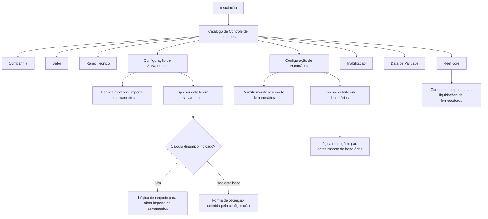

# Definição de Controle de Importes de Fraude por Ramo no Reef.core

## 1. Metadados do Documento
- **Arquivo de Origem:** `Não identificado no conteúdo fornecido`
- **Tipo de Documento:** Especificação Técnica / Documentação Funcional
- **Domínio / Sistema:** Reef.core — Controle de Fraude; MAPFRE
- **Público-Alvo:** Desenvolvedores, Arquitetos, Analistas Funcionais, Operação e Negócio
- **Data/Versão Identificada:** Não identificada

---

## 2. Resumo Executivo & Contexto de Negócio

O documento descreve um catálogo de informações do Reef.core destinado ao controle dos importes das liquidações de fornecedores no contexto de fraude, com configuração segmentada por companhia, setor e ramo técnico. O catálogo é entregue às instalações sem conteúdo, cabendo a cada instalação configurá-lo conforme suas necessidades.

A configuração permite controlar especificamente os importes de salvamentos e honorários. Para cada tipo de importe, o catálogo define se a alteração manual do valor é permitida e qual forma de obtenção deve ser utilizada como padrão no cálculo.

Quando a configuração indicar cálculo dinâmico, o Reef.core utiliza uma lógica de negócio para obter dinamicamente o importe de salvamentos ou de honorários. Os critérios concretos dessa lógica devem ser definidos pela companhia de acordo com suas necessidades de cálculo.

O catálogo também contém propriedades de inabilitação e validade temporal. Essas propriedades permitem desativar registros configurados e estabelecer a data a partir da qual uma configuração se torna operacional, preservando um histórico das alterações na configuração de importes ao longo do tempo.

O documento recomenda a leitura de diretrizes e documentos funcionais relacionados a fraude, pois a interpretação isolada desta documentação pode conduzir a erro. Não há recomendação de padronização da codificação do catálogo; contudo, a entidade MAPFRE deve avaliar a conveniência de utilizá-lo transversalmente em seus processos para posterior exploração correta.

---

## 3. Arquitetura, Componentes & Tecnologias Envolvidas

O conteúdo apresenta o Reef.core como sistema que oferece o controle de importes de liquidações de fornecedores para fraude por meio de um catálogo configurável. Não são descritos microsserviços, APIs, métodos HTTP, contratos JSON, banco de dados, infraestrutura, URLs, ambientes ou tecnologias de implementação.

Os componentes funcionais identificados são:

- **Reef.core:** sistema que disponibiliza a capacidade de controle de importes.
- **Catálogo de controle de importes:** estrutura configurável por instalação para definir o comportamento do controle de fraude.
- **Liquidações de fornecedores:** objeto funcional cujos importes são controlados.
- **Importe de salvamentos:** importe sujeito a configuração de alteração e forma de cálculo.
- **Importe de honorários:** importe sujeito a configuração de alteração e forma de cálculo.
- **Lógica de negócio dinâmica:** mecanismo configurável pela companhia para obtenção dinâmica de importes.
- **Estrutura de produtos da entidade:** origem da configuração usada para identificar setor e ramo técnico.
- **MAPFRE:** entidade mencionada como responsável por avaliar o uso transversal do catálogo.



> **Nota de Análise:** O documento descreve atributos funcionais do catálogo, mas não detalha a persistência dos dados, contratos de integração, serviços responsáveis pela execução dos cálculos ou os valores permitidos para os tipos por defeito.

---

## 4. Regras de Negócio, Especificações Funcionais & Processos

### 4.1 Controle de importes de fraude

1. O Reef.core possui capacidade de controlar os importes das liquidações de fornecedores.
2. O controle depende da configuração de um catálogo de informações.
3. O catálogo é entregue vazio às instalações.
4. Cada instalação deve configurar o catálogo de acordo com suas próprias necessidades.
5. A definição de controle é associada à combinação de companhia, setor e ramo técnico.

### 4.2 Identificação da configuração

1. A propriedade **Companhia** contém o código da companhia para a qual a definição de importes de controle de fraude está sendo realizada.
2. A propriedade **Setor** identifica a chave do setor conforme a configuração existente na estrutura de produtos da entidade.
3. A propriedade **Ramo** identifica a chave do ramo técnico conforme a configuração existente na estrutura de produtos da entidade.

### 4.3 Regras para importe de salvamentos

1. O atributo **¿Permite Modificar el Importe de Salvamentos?** regula o comportamento do sistema para permitir ou impedir a modificação do importe de salvamentos.
2. O atributo **Tipo por Defecto en Salvamentos** identifica a forma de obtenção que o sistema deve considerar para calcular o importe de salvamentos.
3. Caso seja indicado que o cálculo deve ser realizado dinamicamente, a lógica de negócio de obtenção do importe de salvamentos permite calcular o valor dinamicamente.
4. Os critérios utilizados no cálculo dinâmico de salvamentos devem ser os critérios que a companhia considerar adequados.

### 4.4 Regras para importe de honorários

1. O atributo **¿Permite Modificar el Importe de Honorarios?** regula o comportamento do sistema para permitir ou impedir a modificação do importe de honorários.
2. O atributo **Tipo por Defecto en Honorarios** identifica a forma de obtenção que o sistema deve considerar para calcular o importe de honorários.
3. A lógica de negócio para obtenção do importe de honorários permite calcular dinamicamente o valor conforme os critérios que a companhia considerar adequados.

### 4.5 Vigência e inabilitação de registros

1. A propriedade **Inhabilitación** estabelece que um registro configurado na tabela de controle de importes para uma combinação de companhia, setor e ramo está desativado ou inabilitado para uso.
2. A propriedade **Fecha de Validez** determina a data a partir da qual o registro configurado está operacional no sistema.
3. O uso correto da data de validade permite manter histórico das mudanças efetuadas ao longo do tempo na configuração do catálogo de importes.

### 4.6 Diretriz de uso corporativo

1. Não existe preferência ou recomendação para estabelecer ou padronizar a codificação do catálogo no sistema.
2. A entidade MAPFRE deve avaliar a conveniência de utilizar transversalmente o catálogo de informação nos processos da companhia.
3. O objetivo dessa avaliação é permitir a correta exploração posterior das informações do catálogo.

---

## 5. Tabelas de Parâmetros, Ambientes e Estruturas de Dados

| Item / Parâmetro | Descrição / Função | Tipo / Valores / Formato | Ambiente / Observações |
| :--- | :--- | :--- | :--- |
| Companhia | Contém o código da companhia para a definição dos importes de controle de fraude. | Código de companhia; formato não detalhado. | Associado ao registro de controle de importes. |
| Setor | Identifica a chave do setor. | Chave de setor; valores não detalhados. | Obtido conforme a estrutura de produtos da entidade. |
| Ramo | Identifica a chave do ramo técnico. | Chave de ramo técnico; valores não detalhados. | Obtido conforme a estrutura de produtos da entidade. |
| ¿Permite Modificar el Importe de Salvamentos? | Permite ou impede a alteração do importe de salvamentos. | Valor ou domínio não detalhado. | Modula o comportamento do sistema. |
| Tipo por Defecto en Salvamentos | Define a forma de obtenção a considerar no cálculo do importe de salvamentos. | Tipo de obtenção; valores não detalhados. | Pode indicar cálculo dinâmico. |
| Lógica de Negócio para obter o Importe dos Salvamentos | Permite obter dinamicamente o importe de salvamentos. | Critérios definidos pela companhia; implementação não detalhada. | Aplicável quando a configuração indica cálculo dinâmico. |
| ¿Permite Modificar el Importe de Honorarios? | Permite ou impede a alteração do importe de honorários. | Valor ou domínio não detalhado. | Modula o comportamento do sistema. |
| Tipo por Defecto en Honorarios | Define a forma de obtenção a considerar no cálculo do importe de honorários. | Tipo de obtenção; valores não detalhados. | O documento não detalha valores possíveis. |
| Lógica de Negócio para obter o Importe dos Honorários | Permite obter dinamicamente o importe de honorários. | Critérios definidos pela companhia; implementação não detalhada. | Critérios de cálculo ficam a cargo da companhia. |
| Inhabilitación | Define que o registro configurado para companhia, setor e ramo está desativado ou inabilitado. | Estado de habilitação; valores não detalhados. | Registro inabilitado não pode ser utilizado. |
| Fecha de Validez | Define a data a partir da qual o registro configurado passa a estar operacional. | Data; formato não detalhado. | Permite histórico das alterações de configuração. |
| Catálogo de controle de importes | Catálogo utilizado para controlar importes das liquidações de fornecedores. | Catálogo de informação; estrutura técnica não detalhada. | Entregue vazio às instalações para configuração local. |
| Fraude | Documento relacionado cuja leitura é recomendada. | Vínculo documental. | A interpretação isolada deste documento pode conduzir a erro. |

> **Nota de Análise:** O documento não informa URLs, servidores, portas, nomes de ambientes, esquemas de banco de dados, campos físicos, formatos de data, valores enumerados ou permissões de acesso.

---

## 6. Bateria de Perguntas & Respostas para RAG (FAQ Sintético)

### P1: Qual é o objetivo do catálogo de controle de importes de fraude no Reef.core?
**R:** O catálogo permite configurar o controle dos importes das liquidações de fornecedores no Reef.core, de acordo com necessidades específicas de cada instalação. A configuração pode ser segmentada por companhia, setor e ramo técnico.

### P2: O catálogo de controle de importes já vem preenchido quando é entregue às instalações?
**R:** Não. O documento informa que o catálogo de informações é entregue às instalações vazio de conteúdo. Cada instalação deve configurar o catálogo de acordo com suas necessidades.

### P3: Como uma configuração de controle de importes é identificada?
**R:** A configuração é identificada pelas propriedades Companhia, Setor e Ramo. Companhia contém o código da companhia; Setor identifica a chave do setor; e Ramo identifica a chave do ramo técnico, ambos conforme a estrutura de produtos da entidade.

### P4: O sistema pode permitir a alteração do importe de salvamentos?
**R:** Sim, o atributo **¿Permite Modificar el Importe de Salvamentos?** regula o comportamento do sistema, permitindo ou não a modificação do importe de salvamentos. O documento não especifica os valores possíveis desse atributo.

### P5: Quando a lógica de negócio dinâmica para salvamentos é utilizada?
**R:** A lógica de negócio para obtenção do importe de salvamentos é utilizada quando a configuração indicar que o cálculo deve ser efetuado dinamicamente. Essa lógica calcula o importe segundo critérios que a companhia considerar adequados.

### P6: Como é definido o cálculo do importe de honorários?
**R:** O atributo **Tipo por Defecto en Honorarios** identifica a forma de obtenção que o sistema deve considerar para calcular o importe de honorários. A lógica de negócio correspondente pode obter dinamicamente esse importe conforme critérios definidos pela companhia.

### P7: O que acontece quando um registro possui a propriedade Inhabilitación?
**R:** A propriedade **Inhabilitación** estabelece que o registro configurado na tabela de controle de importes, para determinada companhia, setor e ramo, está desativado ou inabilitado para ser utilizado.

### P8: Qual é a finalidade da propriedade Fecha de Validez?
**R:** A propriedade **Fecha de Validez** determina a data a partir da qual o registro configurado se torna operacional no sistema. Seu uso correto permite manter um histórico das alterações realizadas ao longo do tempo na configuração do catálogo de importes.

### P9: O documento define uma codificação padrão para o catálogo de controle de importes?
**R:** Não. O documento afirma que não existe preferência ou recomendação para estabelecer ou padronizar a codificação do catálogo no sistema.

### P10: Qual orientação é dada à entidade MAPFRE sobre o uso do catálogo?
**R:** A entidade MAPFRE deve analisar a conveniência de utilizar o catálogo de informação transversalmente nos processos da companhia, visando sua correta e posterior exploração.

### P11: O documento descreve métodos HTTP, APIs ou contratos JSON do Reef.core?
**R:** Não. O documento apresenta regras funcionais e propriedades do catálogo de controle de importes, mas não detalha métodos HTTP, APIs, contratos JSON, microsserviços ou interfaces técnicas.

### P12: Por que é recomendada a leitura de documentos relacionados a fraude?
**R:** O documento informa que há diretrizes e documentos funcionais relacionados a fraude cuja leitura é recomendada, pois a interpretação isolada do presente documento pode conduzir a erro.

---

## 7. Glossário de Termos, Siglas & Conceitos-Chave

- **Reef.core:** Sistema citado como possuidor da capacidade de controlar importes das liquidações de fornecedores conforme configuração de catálogo.
- **Controle de Fraude:** Contexto funcional no qual são definidos os importes controlados por companhia, setor e ramo.
- **Catálogo de informação:** Estrutura configurável entregue vazia às instalações para definição das regras de controle de importes.
- **Liquidações de fornecedores:** Liquidações cujos importes podem ser controlados pelo Reef.core.
- **Salvamentos:** Tipo de importe cujo comportamento de alteração e cálculo pode ser configurado.
- **Honorários:** Tipo de importe cujo comportamento de alteração e cálculo pode ser configurado.
- **Companhia:** Código da companhia para a qual é realizada a definição de importes de controle de fraude.
- **Setor:** Chave identificadora de setor conforme a estrutura de produtos da entidade.
- **Ramo Técnico:** Chave identificadora de ramo conforme a estrutura de produtos da entidade.
- **Tipo por Defecto:** Forma de obtenção que o sistema deve considerar para efetuar um cálculo de importe.
- **Lógica de Negócio:** Lógica utilizada para calcular dinamicamente importes conforme critérios definidos pela companhia.
- **Inhabilitación:** Propriedade que estabelece que um registro está desativado ou inabilitado para uso.
- **Fecha de Validez:** Propriedade que define a data a partir da qual um registro se torna operacional.
- **MAPFRE:** Entidade mencionada como responsável por avaliar o uso transversal do catálogo em seus processos.

---

## 8. Notas Críticas, Riscos & Limitações

- O catálogo é entregue vazio, portanto o comportamento operacional depende integralmente da configuração realizada em cada instalação.
- O documento não define os valores permitidos para atributos de permissão de modificação, tipos por defeito, inabilitação ou formatos de data.
- Os critérios para cálculo dinâmico de salvamentos e honorários não são detalhados; a companhia deve definir os critérios considerados adequados.
- Não há descrição de APIs, contratos de integração, interfaces, serviços, persistência, tabelas físicas, ambientes, URLs ou mecanismos de auditoria.
- A configuração por data de validade é necessária para manter histórico; configurações sem gestão adequada de vigência podem comprometer a rastreabilidade temporal.
- Registros marcados com **Inhabilitación** não podem ser utilizados.
- A interpretação isolada do documento pode conduzir a erro; a leitura de documentos funcionais relacionados a fraude é recomendada.
- Não existe padrão recomendado para codificação do catálogo, o que pode demandar governança local ou corporativa para garantir exploração transversal consistente.
- **Nota de Análise:** O documento lista propriedades funcionais, mas não detalha a ordem de precedência entre registros, critérios de seleção em caso de múltiplas configurações vigentes ou o comportamento quando não existir uma configuração para determinada combinação de companhia, setor e ramo.

---

## 9. Conteúdo Bruto Estruturado (Referência Fiel)

```text
--- [PÁGINA 1 DE 2] ---

DEFINICIÓN de CONTROL de IMPORTES del FRAUDE por RAMO>
Objetivo
Funcionalmente, Reef.core cuenta con la posibilidad de controlar los importes de las Liquidaciones de los Proveedores de acuerdo con la
conguración que se realice en un catálogo de información que se entrega a las instalaciones vacío de contenido para que sean ellas quienes
lo conguren de acuerdo con sus necesidades.
Propiedades
Otras Propiedades
Propiedades
Compañía
Este Atributo del catálogo contiene el código de la compañía sobre la que se está realizando la denición de los importes de Control del
Fraude. .
Sector
Esta propiedad identica la clave del Sector de acuerdo con la conguración realizada en la estructura de productos de la entidad.
Ramo
Esta propiedad identica la clave del Ramo Técnico de acuerdo con la conguración realizada en la estructura de productos de la entidad.
¿Permite Modicar el Importe de Salvamentos?
Este Atributo modula el comportamiento del sistema permitiendo o no modicar el importe de los salvamentos.
Tipo por Defecto en Salvamentos
Este Atributo identica la forma de obtención que el sistema debe considerar para efectuar el cálculo del importe.
Lógica de Negocio para obtener el Importe de los Salvamentos
Si se ha indicado que el cálculo debe efectuarse dinámicamente (valor del atributo anterior) esta lógica de Negocio permite obtener
dinámicamente el Importe de los Salvamentos de acuerdo con los criterios que la Compañía estime oportunamente para realizar su cálculo.
¿Permite Modicar el Importe de Honorarios?
Este Atributo modula el comportamiento del sistema permitiendo o no modicar el importe de los honorarios.
Documentation / DOCUMENTACIÓN Reef
DOCUMENTACIÓN Reef
Mapfredocument
DOCUMENTACIÓN Reef
Owner
user:agonzalez_mapfre.com
Lifecycle
Approved Source
 /
 VL
Buscar Inicio Soluciones Arquitecturas APIs Componentes Cloud Documentación Zeus Reef Ayuda
ES


--- [PÁGINA 2 DE 2] ---

Tipo por Defecto en Honorarios
Este Atributo identica la forma de obtención que el sistema debe considerar para efectuar el cálculo del importe de los honorarios.
Lógica de Negocio para obtener el Importe de los Honorarios
Esta lógica de Negocio permite obtener dinámicamente el Importe de los Honorarios de acuerdo con los criterios que la Compañía estime
oportunamente para efectuar su cálculo.
Otras Propiedades
Inhabilitación
Esta propiedad establece que el Registro congurado en la tabla de control de importes para la compañía, sector y Ramo está desactivado o
inhabilitado para poder ser utilizado.
Fecha de Validez
Esta propiedad determina la fecha a partir de la cual el registro congurado está operativo en el sistema por lo que su correcto uso permite
tener un histórico de los cambios efectuados a lo largo del tiempo en la conguración del catálogo de importes.
Vínculos
Relación de Directrices y Documentos funcionales cuya lectura recomendada para evitar que la interpretación aislada del presente
documento pueda conducir a error.
Fraude
Preguntas frecuentes
(1) ¿Existe alguna recomendación operativa que deba ser tomada en consideración localmente en la codicación, uso y denición del
catálogo de Importes para el Control del Fraude?
No existe una preferencia ni recomendación para establecer o estandarizar en el sistema su codicación, si bien la entidad MAPFRE debe
analizar la conveniencia de utilizar transversalmente en los procesos de la compañía este catálogo de información para su correcta y
posterior explotación.
```
