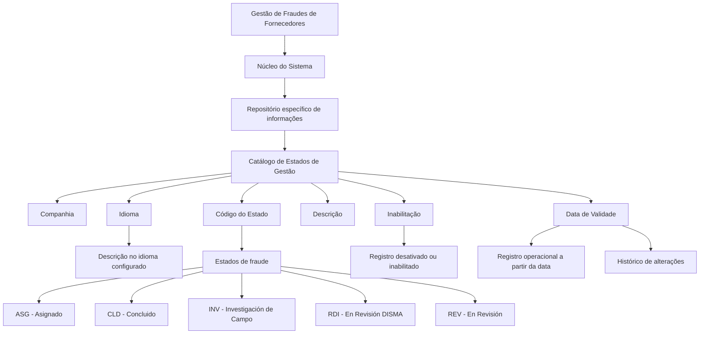

# Definição dos Estados de Gestão de Fraudes de Fornecedores — Documentação Reef

## 1. Metadados do Documento
- **Arquivo de Origem:** Não identificado no conteúdo fornecido
- **Tipo de Documento:** Especificação Funcional
- **Domínio / Sistema:** Reef / Mapfre — Gestão de Fraudes de Fornecedores
- **Público-Alvo:** Analistas funcionais, negócio, operação e equipes responsáveis pela configuração de catálogos
- **Data/Versão Identificada:** Não identificada

---

## 2. Resumo Executivo & Contexto de Negócio

O documento define o catálogo de estados utilizados na gestão de fraudes cometidas por fornecedores. Funcionalmente, o núcleo do sistema permite classificar as gestões de fraude conforme o estado em que se encontram, utilizando um repositório específico de informações.

A configuração de cada estado de gestão de fraude considera a companhia à qual a definição se aplica, o idioma empregado, o código do estado e a descrição associada. Essa estrutura permite manter descrições de estados de fraude adequadas ao idioma configurado.

Os exemplos apresentados para o idioma espanhol incluem os estados `ASG` (Asignado), `CLD` (Concluido), `INV` (Investigación de Campo), `RDI` (En Revisión DISMA) e `REV` (En Revisión).

O catálogo também possui propriedades para inabilitar registros e controlar a data a partir da qual uma configuração passa a estar operacional. O uso correto da data de validade é indicado como mecanismo para preservar o histórico de alterações ao longo do tempo.

---

## 3. Arquitetura, Componentes & Tecnologias Envolvidas

Os componentes e conceitos explicitamente citados são:

- **Núcleo do Sistema:** componente funcional que permite classificar os estados das gestões de fraude.
- **Repositório de informação específico:** repositório utilizado para armazenar a classificação dos estados das gestões de fraude.
- **Catálogo de configuração:** estrutura que contém os atributos de companhia, idioma, código, descrição, inabilitação e data de validade.
- **Gestão de Fraudes de Fornecedores:** domínio funcional ao qual os estados configurados se aplicam.
- **Reef / Documentación Reef / Mapfredocument:** referências de documentação e navegação presentes no conteúdo.
- **DISMA:** termo presente na descrição do estado `RDI`; o documento não define a sigla ou seu significado.



> **Nota de Análise:** O documento não descreve tecnologias de implementação, APIs, métodos HTTP, contratos JSON, bancos de dados, URLs de ambiente, servidores ou integrações técnicas.

---

## 4. Regras de Negócio, Especificações Funcionais & Processos

### 4.1 Classificação dos estados de gestão de fraude

O núcleo do sistema possui a capacidade de classificar os estados nos quais se encontram as gestões de fraudes em um repositório de informação específico.

A classificação se aplica às fraudes cometidas por fornecedores, conforme descrito nas propriedades de idioma e descrição do catálogo de configuração.

### 4.2 Companhia

O atributo **Companhia** contém o código da companhia sobre a qual está sendo realizada a definição dos estados das gestões de fraude.

A definição de um estado de gestão de fraude deve, portanto, estar associada à companhia configurada no catálogo.

### 4.3 Idioma

A propriedade **Idioma** contém a chave do idioma empregada na configuração dos estados das gestões de fraude cometidas por fornecedores.

Os exemplos de idiomas explicitamente mencionados são:

- Espanhol;
- Inglês;
- Português.

A descrição do estado é definida de acordo com o idioma utilizado na configuração.

### 4.4 Código do Estado da Gestão

O campo **Código do Estado da Gestão** identifica a chave ou o código do estado da gestão de fraude.

O documento apresenta os seguintes códigos de exemplo:

- `ASG`
- `CLD`
- `INV`
- `RDI`
- `REV`

### 4.5 Descrição

O atributo **Descrição** identifica a descrição do estado da gestão de fraude cometido pelo fornecedor, de acordo com o idioma utilizado em sua definição.

Para o idioma espanhol, o documento apresenta as descrições:

- `ASG` — `Asignado`;
- `CLD` — `Concluido`;
- `INV` — `Investigación de Campo`;
- `RDI` — `En Revisión DISMA`;
- `REV` — `En Revisión`.

### 4.6 Inabilitação

A propriedade **Inhabilitación** estabelece que o registro configurado está desativado ou inabilitado para utilização.

O documento não detalha se a inabilitação impede consultas, seleção do estado em novas gestões, processamento de gestões existentes ou qualquer outro comportamento específico.

### 4.7 Data de Validade

A propriedade **Fecha de Validez** informa ao sistema a data a partir da qual o registro configurado está operacional.

O uso correto da data de validade permite manter um histórico das alterações efetuadas ao longo do tempo.

### 4.8 Diretrizes e documentos relacionados

A seção **Vínculos** recomenda a leitura de diretrizes e documentos funcionais relacionados para evitar interpretações incorretas decorrentes da leitura isolada do documento.

Os vínculos ou referências apresentados são:

- Proveedores;
- Preguntas frecuentes.

### 4.9 Recomendação operacional local

A pergunta frequente apresentada questiona se existe recomendação operacional local para codificação, uso e definição do catálogo de possíveis estados na gestão de fraudes de fornecedores.

A resposta registrada no documento é: `N/A`.

---

## 5. Tabelas de Parâmetros, Ambientes e Estruturas de Dados

| Item / Parâmetro | Descrição / Função | Tipo / Valores / Formato | Ambiente / Observações |
| :--- | :--- | :--- | :--- |
| Companhia | Contém o código da companhia sobre a qual se realiza a definição dos estados das gestões de fraude. | Código de companhia | Aplicável ao catálogo de estados de gestão de fraudes. |
| Idioma | Contém a chave do idioma empregada na configuração dos estados das gestões de fraude cometidas por fornecedores. | Chave de idioma; exemplos: espanhol, inglês, português | A descrição do estado depende do idioma configurado. |
| Código do Estado da Gestão | Identifica a chave ou o código do estado da gestão de fraude. | Código de estado | Exemplos: `ASG`, `CLD`, `INV`, `RDI`, `REV`. |
| Descrição | Identifica a descrição do estado da gestão de fraude de acordo com o idioma utilizado em sua definição. | Texto | O documento apresenta exemplos em espanhol. |
| Inabilitação | Estabelece que o registro configurado está desativado ou inabilitado para utilização. | Propriedade de inabilitação | Não são detalhados valores, formatos ou efeitos adicionais. |
| Data de Validade | Indica a data a partir da qual o registro configurado está operacional no sistema. | Data | Permite manter histórico de alterações ao longo do tempo. |
| Repositório específico de informações | Armazena ou suporta a classificação dos estados das gestões de fraude. | Não especificado | O documento não informa tecnologia, localização ou modelo de dados. |

| Código do Estado | Descrição em Espanhol | Observações |
| :--- | :--- | :--- |
| `ASG` | Asignado | Exemplo apresentado para idioma espanhol. |
| `CLD` | Concluido | Exemplo apresentado para idioma espanhol. |
| `INV` | Investigación de Campo | Exemplo apresentado para idioma espanhol. |
| `RDI` | En Revisión DISMA | Exemplo apresentado para idioma espanhol; `DISMA` não é definido. |
| `REV` | En Revisión | Exemplo apresentado para idioma espanhol. |

| Referência / Vínculo | Finalidade identificada |
| :--- | :--- |
| Proveedores | Documento ou vínculo funcional recomendado para leitura. |
| Preguntas frecuentes | Seção de perguntas frequentes relacionada ao catálogo de estados. |
| Documentation / DOCUMENTACIÓN Reef | Referência de documentação exibida no conteúdo. |
| Mapfredocument | Referência exibida no conteúdo; função não detalhada. |

---

## 6. Bateria de Perguntas & Respostas para RAG (FAQ Sintético)

### P1: Qual é o objetivo do catálogo de estados de gestão de fraudes?
**R:** O catálogo permite que o núcleo do sistema classifique os estados em que se encontram as gestões de fraudes em um repositório específico de informações.

### P2: A quais fraudes os estados configurados se aplicam?
**R:** Os estados configurados se aplicam às gestões de fraudes cometidas por fornecedores, conforme indicado nas propriedades de idioma e descrição do catálogo.

### P3: Qual é a função do atributo Companhia na configuração de estados?
**R:** O atributo Companhia contém o código da companhia sobre a qual está sendo realizada a definição dos estados das gestões de fraude.

### P4: Como o idioma influencia a configuração dos estados de fraude?
**R:** A propriedade Idioma contém a chave do idioma utilizada na configuração dos estados das gestões de fraude de fornecedores. A descrição de cada estado é definida de acordo com esse idioma. O documento cita espanhol, inglês e português como exemplos.

### P5: Quais estados de gestão de fraude são apresentados como exemplos no idioma espanhol?
**R:** O documento apresenta os códigos `ASG`, `CLD`, `INV`, `RDI` e `REV`. As respectivas descrições em espanhol são Asignado, Concluido, Investigación de Campo, En Revisión DISMA e En Revisión.

### P6: O que representa o código de estado `ASG`?
**R:** No exemplo configurado para o idioma espanhol, o código `ASG` corresponde à descrição `Asignado`.

### P7: O que representa o código de estado `INV`?
**R:** No exemplo configurado para o idioma espanhol, o código `INV` corresponde à descrição `Investigación de Campo`.

### P8: O que significa a propriedade Inhabilitación?
**R:** A propriedade Inhabilitación estabelece que o registro configurado está desativado ou inabilitado para ser utilizado. O documento não especifica efeitos adicionais da inabilitação sobre registros já existentes ou fluxos operacionais.

### P9: Qual é a finalidade da Fecha de Validez?
**R:** A Fecha de Validez informa ao sistema a data a partir da qual o registro configurado está operacional. Seu uso correto permite manter um histórico das mudanças realizadas ao longo do tempo.

### P10: Existem recomendações operacionais locais para codificar e utilizar o catálogo de estados?
**R:** A seção de perguntas frequentes registra essa questão e responde `N/A`. Portanto, o documento não fornece recomendação operacional local adicional.

### P11: O documento define os contratos técnicos ou APIs para manipulação dos estados de fraude?
**R:** Não. O documento descreve propriedades funcionais do catálogo de estados, mas não detalha APIs, métodos HTTP, contratos JSON, banco de dados, autenticação ou integrações técnicas.

### P12: O que significa DISMA no estado `RDI — En Revisión DISMA`?
**R:** O termo `DISMA` aparece na descrição do estado `RDI`, mas o documento não fornece sua definição ou expansão.

---

## 7. Glossário de Termos, Siglas & Conceitos-Chave

- **ASG:** Código de estado cuja descrição em espanhol é `Asignado`.
- **CLD:** Código de estado cuja descrição em espanhol é `Concluido`.
- **INV:** Código de estado cuja descrição em espanhol é `Investigación de Campo`.
- **RDI:** Código de estado cuja descrição em espanhol é `En Revisión DISMA`.
- **REV:** Código de estado cuja descrição em espanhol é `En Revisión`.
- **DISMA:** Termo presente na descrição do estado `RDI`; não definido no documento.
- **Gestão de Fraudes:** Processo ou domínio no qual os estados de fraude são classificados.
- **Fornecedor / Proveedor:** Entidade associada às fraudes tratadas pelo catálogo de estados.
- **Catálogo de configuração:** Estrutura de configuração que contém atributos e propriedades dos estados de gestão de fraudes.
- **Inhabilitación:** Propriedade que estabelece que um registro está desativado ou inabilitado para utilização.
- **Fecha de Validez:** Data a partir da qual um registro configurado passa a estar operacional no sistema.
- **Reef:** Nome presente nas referências de documentação; o documento não detalha seu significado ou escopo técnico.
- **Mapfredocument:** Referência apresentada na navegação do conteúdo; não detalhada no documento.

---

## 8. Notas Críticas, Riscos & Limitações

- O documento é predominantemente funcional e não informa arquitetura técnica de implementação, tecnologias, banco de dados, integrações, APIs, serviços, URLs, ambientes ou mecanismos de segurança.
- Não há detalhamento sobre regras de transição entre os estados `ASG`, `CLD`, `INV`, `RDI` e `REV`.
- Não há definição do significado da sigla ou termo `DISMA`.
- A propriedade de inabilitação é descrita apenas como desativação do registro; o impacto operacional detalhado não é informado.
- A data de validade é apresentada como mecanismo de histórico, mas o documento não especifica regras para sobreposição de períodos, retroatividade, expiração ou tratamento de conflitos entre registros.
- A recomendação de leitura de diretrizes e documentos funcionais relacionados indica que a interpretação isolada do documento pode conduzir a erro.
- A pergunta frequente sobre recomendações operacionais locais possui resposta `N/A`; portanto, não há orientação adicional registrada para codificação, uso ou definição local do catálogo.

---

## 9. Conteúdo Bruto Estruturado (Referência Fiel)

```text
--- [PÁGINA 1 DE 2] ---

DEFINICIÓN de los ESTADOS de GESTIÓN de los FRAUDES
Objetivo
Funcionalmente, el núcleo del Sistema cuenta con la posibilidad de clasicar los estados en los que se encuentran las Gestiones de los
Fraudes en un repositorio de información especíco.
Propiedades Operativas
Otras Propiedades
Propiedades Operativas
Compañía
Este Atributo del catálogo contiene el código de la compañía sobre la que se está realizando la denición de los estados de las gestiones de
los Fraudes.
Idioma
Esta propiedad contiene la clave del Idioma empleado en la conguración de los Estados de las Gestiones de los fraudes cometidos por los
Proveedores como por ejemplo: español, inglés, Portugués, ...
Código del Estado de la Gestión
Este campo identica la clave o el código del Estado de la Gestión del Fraude.
Descripción
Este Atributo del catálogo de conguración identica la descripción del Estado de la Gestión del Fraude cometido por el Proveedor de
acuerdo con el idioma utilizado en su denición.
A modo de ejemplo y si el idioma empleado en la denición fuera el Español...
ESTADO DESCRIPCIÓN
ASG Asignado
CLD Concluido
INV Investigación de Campo
Documentation / DOCUMENTACIÓN Reef
DOCUMENTACIÓN Reef
Mapfredocument
DOCUMENTACIÓN Reef
Owner
user:agonzalez_mapfre.com
Lifecycle
Approved Source
 /
VL
Buscar Inicio Soluciones Arquitecturas APIs Componentes Cloud Documentación Zeus Reef Ayuda
ES


--- [PÁGINA 2 DE 2] ---

ESTADO DESCRIPCIÓN
RDI En Revisión DISMA
REV En Revisión
Otras Propiedades
Inhabilitación
Esta propiedad establece que el Registro congurado está desactivado o inhabilitado para ser utilizado.
Fecha de Validez
Esta propiedad le indica al Sistema la fecha a partir de la cual el registro congurado está operativo en el sistema por lo que su correcto uso
permite tener un histórico de los cambios efectuados a lo largo del tiempo.
Vínculos
Relación de Directrices y Documentos funcionales cuya lectura recomendada para evitar que la interpretación aislada del presente
documento pueda conducir a error.
Proveedores
Preguntas frecuentes
(1) ¿Existe alguna recomendación operativa que deba ser tomada en consideración localmente en la codicación, uso y denición del
catálogo de posibles estados en la gestión de los Fraudes para los Proveedores?
N/A
```
