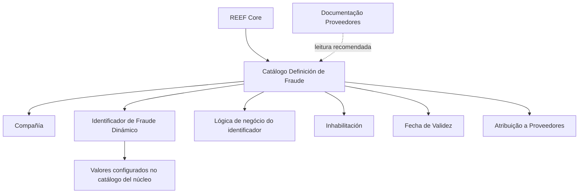

# Definição de Fraude no REEF Core — Catálogo de Configuração para Provedores

## 1. Metadados do Documento
- **Arquivo de Origem:** Não identificado no conteúdo fornecido
- **Tipo de Documento:** Especificação Técnica / Documentação Funcional
- **Domínio / Sistema:** REEF Core / Mapfre / Provedores
- **Público-Alvo:** Desenvolvedores, Analistas Funcionais, Operação e Arquitetura
- **Data/Versão Identificada:** Não identificada

---

## 2. Resumo Executivo & Contexto de Negócio

O documento descreve o catálogo **“Definición de Fraude”** do sistema REEF Core. O catálogo permite configurar possíveis fraudes cometidas por provedores. Segundo o texto, o catálogo é entregue inicialmente às instalações sem conteúdo.

A configuração de uma fraude é associada a uma companhia e contempla um identificador de fraude dinâmico. A identificação dinâmica depende de valores previamente configurados no catálogo do núcleo, além de uma lógica de negócio responsável por determinar o identificador de fraude.

O catálogo também possui propriedades operacionais para controlar a disponibilidade e a vigência temporal de cada registro. A propriedade de inabilitação impede o uso da fraude na atribuição a um provedor, enquanto a data de validade determina a partir de quando o registro está operacional.

O documento recomenda a consulta a diretrizes e documentos funcionais relacionados, especialmente a documentação de **Proveedores**, para evitar interpretações isoladas que possam causar erros.

---

## 3. Arquitetura, Componentes & Tecnologias Envolvidas

| Componente / Termo | Papel identificado no documento |
| :--- | :--- |
| REEF Core | Sistema que disponibiliza a configuração de possíveis fraudes cometidas por provedores. |
| Catálogo “Definición de Fraude” | Catálogo de informações usado para configurar definições de fraude. |
| Proveedores | Entidade relacionada à atribuição de uma fraude configurada. |
| Compañía | Código da companhia sobre a qual a definição de fraude é realizada. |
| Catálogo del núcleo | Catálogo que contém valores usados para configurar o tipo de identificador de fraude dinâmico. |
| Documentación Reef | Área documental referenciada como fonte relacionada. |
| Mapfredocument | Termo exibido na área de documentação. |
| Zeus | Termo exibido na navegação da documentação, sem detalhamento funcional adicional. |



> **Nota de Análise:** O documento não informa métodos HTTP, contratos JSON, persistência, integrações técnicas, tecnologias de implementação, ambientes ou interfaces de usuário do catálogo.

---

## 4. Regras de Negócio, Especificações Funcionais & Processos

1. O REEF Core permite configurar possíveis fraudes cometidas por provedores por meio do catálogo **Definición de Fraude**.
2. O catálogo é inicialmente entregue vazio às instalações.
3. Cada definição de fraude contém o atributo **Compañía**, que armazena o código da companhia sobre a qual a definição está sendo realizada.
4. A propriedade **Identificador de Fraude Dinámico** define o tipo de identificador de fraude dinâmica conforme os valores configurados no catálogo do núcleo.
5. A propriedade de lógica de negócio contém a lógica que determinará o identificador de fraude dinâmica.
6. A propriedade **Inhabilitación** informa que uma fraude está desativada ou inabilitada para uso em sua atribuição a um provedor.
7. A propriedade **Fecha de Validez** estabelece a data a partir da qual o registro configurado de fraude está operacional no sistema.
8. O uso correto da data de validade permite manter histórico das alterações realizadas ao longo do tempo.
9. A documentação relacionada a **Proveedores** é recomendada para evitar erros decorrentes da interpretação isolada deste documento.
10. A pergunta frequente apresentada sobre recomendações operacionais locais para codificação, uso e definição do catálogo possui resposta **“N/A”**.

---

## 5. Tabelas de Parâmetros, Ambientes e Estruturas de Dados

| Item / Parâmetro | Descrição / Função | Tipo / Valores / Formato | Ambiente / Observações |
| :--- | :--- | :--- | :--- |
| Catálogo Definición de Fraude | Configura possíveis fraudes cometidas por provedores. | Catálogo de informação | Entregue inicialmente vazio às instalações. |
| Compañía | Contém o código da companhia para a qual a fraude está sendo definida. | Código de companhia | Propriedade operacional. |
| Identificador de Fraude Dinámico | Define o tipo de identificador de fraude dinâmica. | Valores configurados no catálogo do núcleo | Propriedade operacional. |
| Lógica de negócio para obter o Identificador de Fraude | Determina o identificador de fraude dinâmica. | Lógica de negócio | O documento não detalha a lógica. |
| Inhabilitación | Desativa ou inabilita uma fraude para atribuição a um provedor. | Estado de inabilitação | Outras propriedades. |
| Fecha de Validez | Define a partir de quando o registro de fraude fica operacional. | Data | Permite manter histórico de alterações. |
| Proveedores | Documentação funcional vinculada e recomendada. | Referência documental | Deve ser consultada para evitar interpretação isolada. |
| Owner | Proprietário exibido na documentação. | `user:agonzalez_mapfre.com` | Metadado apresentado no conteúdo. |
| Lifecycle | Estado do ciclo de vida exibido na documentação. | `Approved Source` | Metadado apresentado no conteúdo. |

---

## 6. Bateria de Perguntas & Respostas para RAG (FAQ Sintético)

### P1: Qual é o objetivo do catálogo Definición de Fraude no REEF Core?
**R:** O catálogo Definición de Fraude permite configurar os possíveis casos de fraude cometidos por provedores no REEF Core.

### P2: O catálogo Definición de Fraude já possui conteúdo quando é entregue às instalações?
**R:** Não. O documento informa que o catálogo é entregue inicialmente às instalações vazio de conteúdo.

### P3: O que representa o atributo Compañía na definição de fraude?
**R:** O atributo Compañía contém o código da companhia sobre a qual está sendo realizada a definição de fraude.

### P4: Como é definido o Identificador de Fraude Dinámico?
**R:** O Identificador de Fraude Dinámico considera o tipo de identificador de fraude dinâmica de acordo com os valores configurados no catálogo do núcleo.

### P5: Qual propriedade determina o identificador de fraude dinâmica?
**R:** A propriedade denominada lógica de negócio para obter o identificador de fraude contém a lógica que determinará o identificador de fraude dinâmica.

### P6: O que acontece quando uma fraude está marcada com Inhabilitación?
**R:** A fraude fica desativada ou inabilitada e não pode ser utilizada na sua atribuição a um provedor.

### P7: Para que serve a Fecha de Validez de uma definição de fraude?
**R:** A Fecha de Validez informa ao sistema a data a partir da qual o registro configurado de fraude está operacional.

### P8: Como a Fecha de Validez contribui para o histórico do catálogo?
**R:** O uso correto da Fecha de Validez permite manter um histórico das alterações efetuadas ao longo do tempo.

### P9: Qual documentação relacionada deve ser consultada ao interpretar a definição de fraude?
**R:** O documento recomenda a leitura das diretrizes e documentos funcionais relacionados, incluindo a documentação de Proveedores, para evitar erros de interpretação isolada.

### P10: O documento apresenta recomendações operacionais locais para codificação, uso ou definição do catálogo?
**R:** Não. A pergunta frequente sobre recomendações operacionais locais é respondida como “N/A”.

---

## 7. Glossário de Termos, Siglas & Conceitos-Chave

- **REEF Core:** Sistema mencionado como responsável por disponibilizar o catálogo de configuração de possíveis fraudes de provedores.
- **Definición de Fraude:** Catálogo de informação usado para configurar possíveis fraudes cometidas por provedores.
- **Proveedores:** Provedores aos quais uma fraude configurada pode ser atribuída.
- **Compañía:** Atributo que contém o código da companhia para a qual uma fraude é definida.
- **Identificador de Fraude Dinámico:** Tipo de identificador de fraude baseado em valores configurados no catálogo do núcleo.
- **Catálogo del núcleo:** Catálogo referenciado como origem dos valores usados na configuração do identificador de fraude dinâmica.
- **Inhabilitación:** Propriedade que indica que uma fraude está desativada ou não pode ser utilizada.
- **Fecha de Validez:** Data a partir da qual um registro configurado está operacional no sistema.
- **Lifecycle:** Metadado de ciclo de vida exibido como `Approved Source`.

---

## 8. Notas Críticas, Riscos & Limitações

- O documento não detalha a lógica de negócio usada para determinar o identificador de fraude dinâmica.
- Não há descrição de métodos HTTP, contratos de integração, estruturas JSON, persistência, telas, permissões ou fluxos de aprovação.
- Não foram identificados URLs, servidores, ambientes, versões de software, portas ou tecnologias de implementação.
- A interpretação isolada do documento pode conduzir a erro; a documentação de **Proveedores** é explicitamente recomendada como referência complementar.
- A resposta oficial apresentada para recomendações operacionais locais é `N/A`; portanto, não há orientação adicional sustentada pelo conteúdo fornecido.

---

## 9. Conteúdo Bruto Estruturado (Referência Fiel)

```text
--- [PÁGINA 1 DE 2] ---

DEFINICIÓN de FRAUDE
Objetivo
Funcionalmente, Reef.core cuenta con la posibilidad de configurar los posibles Fraudes cometidos por los Proveedores en un catálogo de
información que se entrega inicialmente a las instalaciones vacío de contenido.
Propiedades Operativas
Otras Propiedades
Propiedades Operativas
Compañía
Este Atributo del catálogo contiene el código de la compañía sobre la que se está realizando la definición del Fraude.
Identificador de Fraude Dinámico
Esta Propiedad del Catálogo contempla el Tipo de identificador del Fraude Dinámico de acuerdo con los valores configurados en el catálogo
del núcleo.
Lógica de negocio para obtener el Identificador de Fraude
Esta Propiedad contiene la Lógica que determinará el identificador de Fraude Dinámico.
Otras Propiedades
Inhabilitación
Esta propiedad establece que el Fraude está desactivado o inhabilitado para poder ser utilizado en su asignación a un Proveedor.
Fecha de Validez
Esta propiedad le indica al Sistema la fecha a partir de la cual el registro configurado del Fraude está operativo en el sistema por lo que su
correcto uso permite tener un histórico de los cambios efectuados a lo largo del tiempo.
Vínculos
Relación de Directrices y Documentos funcionales cuya lectura recomendada para evitar que la interpretación aislada del presente
documento pueda conducir a error.
Proveedores
Documentation / DOCUMENTACIÓN Reef
DOCUMENTACIÓN Reef
Mapfredocument
DOCUMENTACIÓN Reef
Owner
user:agonzalez_mapfre.com
Lifecycle
Approved Source
/
VL
Buscar Inicio Soluciones Arquitecturas APIs Componentes Cloud Documentación Zeus Reef Ayuda
ES

--- [PÁGINA 2 DE 2] ---

Preguntas frecuentes
(1) ¿Existe alguna recomendación operativa que deba ser tomada en consideración localmente en la codificación, uso y definición del
catálogo de Definición del Fraude?
N/A
```
