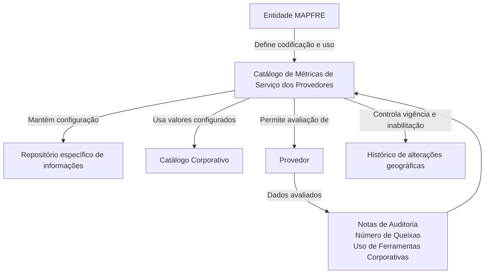

# Definição das Métricas de Serviço dos Provedores

## 1. Metadados do Documento
- **Arquivo de Origem:** Não identificado no conteúdo extraído
- **Tipo de Documento:** Especificação Técnica / Documentação Funcional
- **Domínio / Sistema:** Reef — Serviços de Provedores / MAPFRE
- **Público-Alvo:** Negócio, analistas funcionais e equipes responsáveis pela configuração de catálogos de provedores
- **Data/Versão Identificada:** Não identificada

---

## 2. Resumo Executivo & Contexto de Negócio

O documento descreve a definição e a configuração de um catálogo de **Métricas de Serviço dos Provedores** no núcleo do sistema. O repositório de informações específico é entregue inicialmente sem conteúdo, cabendo à entidade MAPFRE configurar as métricas necessárias para os processos da companhia.

O catálogo permite registrar dados de avaliação de fornecedores, incluindo notas de auditoria, número de queixas e uso de ferramentas corporativas disponibilizadas pela MAPFRE. As métricas são identificadas por códigos, associadas a uma companhia, classificadas por categoria e tipologia, e disponibilizadas em diferentes idiomas.

Cada métrica pode conter uma descrição localizada, um objetivo e um percentual objetivo conforme a sua tipologia. O sistema também prevê controle de inabilitação e de vigência, permitindo que registros sejam ativados a partir de uma data e que o histórico de alterações geográficas seja mantido ao longo do tempo.

A documentação não impõe um padrão corporativo obrigatório para a codificação das métricas. A entidade MAPFRE deve definir a forma mais adequada de utilizar o catálogo em seus processos, visando a correta exploração posterior das informações.

---

## 3. Arquitetura, Componentes & Tecnologias Envolvidas

Os elementos identificados no documento são:

- **Sistema núcleo:** disponibiliza o catálogo de Métricas de Serviço dos Provedores.
- **Repositório específico de informações:** armazena a configuração das métricas.
- **Catálogo Corporativo:** fornece os valores configurados para a tipologia da métrica.
- **Entidade MAPFRE:** define a forma de codificação e uso do catálogo nos processos corporativos.
- **Provedor:** entidade avaliada por meio de métricas de serviço.
- **Reef / Mapfredocument:** referências ao ambiente de documentação apresentado no conteúdo extraído.



**Nota de Análise:** O conteúdo não detalha arquitetura técnica, interfaces, métodos HTTP, contratos JSON, banco de dados, servidores, portas, URLs operacionais ou tecnologias de implementação.

---

## 4. Regras de Negócio, Especificações Funcionais & Processos

### Configuração do catálogo

1. O núcleo do sistema disponibiliza um repositório específico para codificar as Métricas de Serviço dos Provedores.
2. O repositório é entregue inicialmente vazio.
3. A configuração das métricas permite capturar dados de avaliação de um provedor.
4. Entre os dados de avaliação mencionados estão:
   - Notas de Auditoria.
   - Número de Queixas.
   - Indicação de uso ou não de ferramentas corporativas disponibilizadas pela MAPFRE.

### Identificação e classificação da métrica

1. Cada registro de métrica deve informar a **Companhia** à qual a definição se aplica.
2. Cada métrica possui um código ou chave de identificação.
3. O campo **Tipologia** determina a tipologia da métrica conforme valores configurados no Catálogo Corporativo.
4. O documento também associa a tipologia à chave ou categoria do provedor configurada no catálogo.
5. A descrição da métrica deve considerar o idioma utilizado na definição.

### Objetivo e meta

1. A métrica pode possuir um **Objetivo da Métrica**, definido de acordo com a sua tipologia.
2. A métrica pode possuir um **Porcentagem Objetivo**, também definida de acordo com a sua tipologia.
3. O documento não especifica fórmulas de cálculo, faixas válidas, unidades, regras de arredondamento ou critérios de aceitação para os objetivos e percentuais.

### Controle de disponibilidade e vigência

1. A propriedade **Inabilitação** informa que uma métrica definida está desativada ou inabilitada.
2. Uma métrica inabilitada não pode ser utilizada na sua atribuição a um Provedor.
3. A propriedade **Data de Validade** indica a partir de qual data o registro configurado está operacional no sistema.
4. O uso correto da Data de Validade permite manter histórico das alterações geográficas realizadas ao longo do tempo.

### Codificação local

1. Não existe preferência ou recomendação para estabelecer ou padronizar a codificação das Métricas de Serviço dos Provedores no sistema.
2. A entidade MAPFRE deve analisar como utilizar o catálogo de informações nos processos da companhia.
3. A definição local deve permitir a correta exploração posterior das informações cadastradas.

---

## 5. Tabelas de Parâmetros, Ambientes e Estruturas de Dados

| Item / Parâmetro | Descrição / Função | Tipo / Valores / Formato | Ambiente / Observações |
| :--- | :--- | :--- | :--- |
| Companhia | Contém o código da companhia sobre a qual é realizada a definição da categoria do provedor. | Código de companhia; formato não detalhado. | Aplicável à definição da métrica no catálogo. |
| Métrica | Determina o código ou chave da métrica do provedor configurada no catálogo. | Código ou chave; formato não detalhado. | Exemplos identificados: `R01`, `T02`, `C01`, `H01`. |
| Tipologia | Especifica a tipologia da métrica conforme valores configurados no Catálogo Corporativo. | Valor configurado no Catálogo Corporativo. | O conteúdo também a relaciona à categoria do provedor. |
| Idioma | Contém a chave do idioma empregado na configuração da Métrica de Serviço do Provedor. | Chave de idioma; exemplos: espanhol, inglês e turco. | Usado para definir a descrição da métrica. |
| Descrição da Métrica | Contém a denominação ou descrição da categoria do provedor no idioma definido. | Texto localizado. | O documento apresenta exemplos em espanhol. |
| Objetivo da Métrica | Contém o objetivo da métrica do provedor conforme sua tipologia. | Não detalhado. | Sem fórmula ou regra de cálculo documentada. |
| Porcentagem Objetivo | Contém o percentual objetivo da métrica do provedor conforme sua tipologia. | Percentual; formato e escala não detalhados. | Sem critério de validação documentado. |
| Inabilitação | Estabelece que a métrica definida está desativada ou inabilitada. | Estado de habilitação; valores não detalhados. | Métrica inabilitada não pode ser atribuída a um Provedor. |
| Data de Validade | Informa a data a partir da qual o registro configurado fica operacional. | Data; formato não detalhado. | Permite histórico de alterações geográficas ao longo do tempo. |
| R01 | Métrica exemplificada no documento. | Tipo `P`. | Descrição: `NÚMERO DE RECHAZOS`. |
| T02 | Métrica exemplificada no documento. | Tipo `H`. | Descrição: `TIEMPO DE ESPERA`. |
| C01 | Métrica exemplificada no documento. | Tipo `P`. | Descrição: `CALIDAD`. |
| H01 | Métrica exemplificada no documento. | Tipo `C`. | Descrição: `USO HERRAMIENTAS CORP.` |
| Repositório de Métricas | Repositório específico que armazena a codificação das Métricas de Serviço dos Provedores. | Conteúdo inicial vazio. | Disponibilizado pelo núcleo do sistema. |
| Catálogo Corporativo | Fonte de valores configurados para a tipologia da métrica. | Valores não detalhados. | Dependência funcional da configuração. |

---

## 6. Bateria de Perguntas & Respostas para RAG (FAQ Sintético)

### P1: Qual é o objetivo do catálogo de Métricas de Serviço dos Provedores?
**R:** O catálogo permite codificar e manter Métricas de Serviço dos Provedores em um repositório específico do núcleo do sistema. Ele apoia a captura de dados de avaliação de provedores, incluindo notas de auditoria, número de queixas e uso de ferramentas corporativas disponibilizadas pela MAPFRE.

### P2: O repositório de métricas já possui dados quando é entregue?
**R:** Não. O documento informa que o repositório específico de Métricas de Serviço dos Provedores é entregue inicialmente vazio de conteúdo.

### P3: Quais informações de avaliação de um provedor podem ser capturadas pelo catálogo?
**R:** O documento cita notas de Auditoria, número de Queixas e a indicação de utilização ou não de ferramentas Corporativas disponibilizadas pela MAPFRE. Não são detalhados outros dados de avaliação.

### P4: Para que serve o atributo Companhia na configuração de uma métrica?
**R:** O atributo Companhia contém o código da companhia sobre a qual está sendo realizada a definição da categoria do provedor. O formato do código não é especificado no conteúdo.

### P5: Como a Tipologia de uma métrica é definida?
**R:** A Tipologia especifica a tipologia da métrica de acordo com os valores configurados no Catálogo Corporativo. O documento não apresenta a lista de tipologias disponíveis nem suas regras de uso.

### P6: Como o idioma influencia a descrição de uma Métrica de Serviço do Provedor?
**R:** O atributo Idioma contém a chave do idioma utilizada na configuração da métrica, com exemplos de espanhol, inglês e turco. A Descrição da Métrica deve conter a denominação ou descrição conforme o idioma utilizado na definição.

### P7: O que ocorre quando uma métrica está inabilitada?
**R:** A propriedade Inabilitação estabelece que a métrica definida está desativada ou inabilitada. Uma métrica nessa condição não pode ser utilizada na sua atribuição a um Provedor.

### P8: Qual é a finalidade da Data de Validade de uma métrica?
**R:** A Data de Validade informa a partir de qual data o registro configurado fica operacional no sistema. Seu uso correto permite manter histórico das alterações geográficas efetuadas ao longo do tempo.

### P9: Existe uma codificação obrigatória para as Métricas de Serviço dos Provedores?
**R:** Não. O documento afirma que não existe preferência nem recomendação para estabelecer ou padronizar a codificação no sistema. A entidade MAPFRE deve analisar a melhor forma de utilizar o catálogo em seus próprios processos.

### P10: Quais exemplos de métricas são apresentados no documento?
**R:** São apresentados os exemplos `R01` — tipo `P`, descrição `NÚMERO DE RECHAZOS`; `T02` — tipo `H`, descrição `TIEMPO DE ESPERA`; `C01` — tipo `P`, descrição `CALIDAD`; e `H01` — tipo `C`, descrição `USO HERRAMIENTAS CORP.`.

### P11: O documento define como calcular o Objetivo da Métrica ou a Porcentagem Objetivo?
**R:** Não. O documento informa apenas que o Objetivo da Métrica e a Porcentagem Objetivo são definidos de acordo com a tipologia da métrica. Não há fórmulas, escalas, unidades, limites ou regras de cálculo detalhadas.

### P12: Quais documentos relacionados devem ser considerados ao interpretar esta especificação?
**R:** O documento recomenda a leitura de diretrizes e documentos funcionais relacionados: **Servicios de Proveedores**, **Actividades de los Terceros** e **Tipologías de Proveedores por Actividad**. A leitura é recomendada para evitar interpretação isolada e incorreta do documento.

---

## 7. Glossário de Termos, Siglas & Conceitos-Chave

- **MAPFRE:** Entidade mencionada como responsável por analisar a melhor utilização do catálogo nos processos da companhia e como fornecedora de ferramentas corporativas citadas na avaliação de provedores.
- **Métrica de Serviço do Provedor:** Registro configurado no catálogo para apoiar a avaliação de um provedor.
- **Provedor:** Entidade cuja avaliação pode considerar notas de auditoria, número de queixas e uso de ferramentas corporativas.
- **Catálogo Corporativo:** Catálogo que contém os valores configurados utilizados para determinar a tipologia da métrica.
- **Tipologia:** Classificação da métrica conforme valores configurados no Catálogo Corporativo.
- **Inabilitação:** Propriedade que indica que uma métrica está desativada e não pode ser usada em atribuições a provedores.
- **Data de Validade:** Data a partir da qual um registro configurado fica operacional no sistema.
- **Reef:** Nome presente no cabeçalho de documentação extraída; o conteúdo não detalha seu significado ou função técnica.
- **VL:** Sigla exibida no cabeçalho extraído, sem definição no conteúdo.
- **RAG:** Retrieval-Augmented Generation; termo presente no pedido de estruturação, não no conteúdo-fonte.

---

## 8. Notas Críticas, Riscos & Limitações

- O repositório é entregue vazio; a qualidade e a completude do catálogo dependem da configuração realizada pela entidade MAPFRE.
- Não há recomendação ou padronização obrigatória para a codificação das métricas, o que pode resultar em convenções locais divergentes.
- O documento não define contratos técnicos, interfaces, APIs, métodos HTTP, estruturas JSON, banco de dados, permissões, trilha de auditoria ou processos de aprovação.
- As tipologias disponíveis e os valores do Catálogo Corporativo não são apresentados.
- Não são fornecidas fórmulas, limites, escalas ou critérios de cálculo para Objetivo da Métrica e Porcentagem Objetivo.
- A documentação recomenda a leitura de documentos funcionais correlatos para evitar interpretações incorretas quando esta especificação for consultada isoladamente.
- **Nota de Análise:** Embora o conteúdo apresente exemplos de códigos e tipos de métricas, não detalha o significado das classificações `P`, `H` e `C`.

---

## 9. Conteúdo Bruto Estruturado (Referência Fiel)

```text
--- [PÁGINA 1 DE 2] ---

DEFINICIÓN de las MÉTRICAS de SERVICIO de los PROVEEDORES
Objetivo
Funcionalmente, el núcleo del Sistema cuenta con la posibilidad de codicar las Métricas de Servicio de los Proveedores en un repositorio de
información especíco que se entrega inicialmente a las instalaciones vacío de contenido.
De esta manera se posibilita la captura de los datos de Evaluación de un proveedor, en particular los correspondientes a las notas de
Auditoría, el número de Quejas, si utiliza o no herramientas Corporativas dispuestas por MAPFRE …
Propiedades
Otras Propiedades
Propiedades
Compañía
Este Atributo del catálogo contiene el código de la compañía sobre la que se está realizando la denición de la Categoría del Proveedor.
Métrica
Este Atributo determina el código o clave de la Métrica del Proveedor que se está congurando en el catálogo.
Tipología
Este Atributo determina el T o clave de la Categoría del Proveedor que se está congurando en el catálogo.
Este Atributo especica la tipología de la métrica de acuerdo con los valores que estén congurados en el catálogo Corporativo.
Idioma
Este Atributo contiene la clave del Idioma empleado en la conguración de la Métrica del Servicio del Proveedor como por ejemplo: español,
inglés, turco, ...
Descripción de la Métrica
Esta propiedad contiene la denominación o descripción de la Categoría del Proveedor de acuerdo con el idioma utilizado en la denición.
A modo de ejemplo y si el idioma de la denición es el español...
MÉTRICA TIPO DESCRIPCIÓN
R01 P NÚMERO DE RECHAZOS
Documentation / DOCUMENTACIÓN Reef
DOCUMENTACIÓN Reef
Mapfredocument
DOCUMENTACIÓN Reef
Owner
user:agonzalez_mapfre.com
Lifecycle
Approved Source
 / 
 VL
Buscar Inicio Soluciones Arquitecturas APIs Componentes Cloud Documentación Zeus Reef Ayuda
ES


--- [PÁGINA 2 DE 2] ---

MÉTRICA TIPO DESCRIPCIÓN
T02 H TIEMPO DE ESPERA
C01 P CALIDAD
H01 C USO HERRAMIENTAS CORP.
Objetivo de la Métrica
Esta propiedad contiene el Objetivo de la Métrica del Proveedor de acuerdo con su tipología.
Porcentaje Objetivo
Esta propiedad contiene el Porcentaje Objetivo de la Métrica del Proveedor de acuerdo con su tipología.
Otras Propiedades
Inhabilitación
Esta propiedad establece que la métrica denida está desactivada o inhabilitada para poder ser empleada en su asignación a un Proveedor.
Fecha de Validez
Esta propiedad le indica al Sistema la fecha a partir de la cual el registro congurado está operativo en el sistema por lo que su correcto uso
permite tener un histórico de los cambios geográcos efectuados a lo largo del tiempo.
Vínculos
Relación de Directrices y Documentos funcionales cuya lectura recomendada para evitar que la interpretación aislada del presente
documento pueda conducir a error.
Servicios de Proveedores
Actividades de los Terceros
Tipologías de Proveedores por Actividad
Preguntas frecuentes
(1) ¿Existe alguna recomendación operativa que deba ser tomada en consideración localmente en la codicación, uso y denición del
catálogo de Métricas de Servicio de los Proveedores?
No existe una preferencia ni recomendación para establecer o estandarizar en el sistema su codicación, si bien la entidad MAPFRE debe
analizar la mejor manera de utilizar en los procesos de la compañía este catálogo de información para su correcta y posterior explotación.
```
