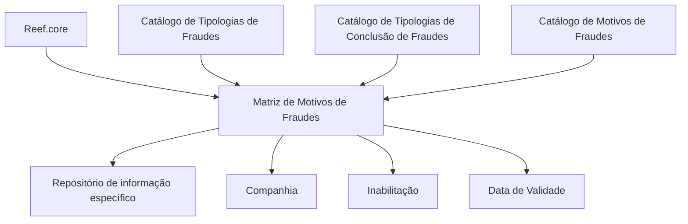

# Definição da Matriz de Motivos de Fraudes por Tipos de Fraudes no Reef

## 1. Metadados do Documento
- **Arquivo de Origem:** Não identificado no conteúdo fornecido
- **Tipo de Documento:** Especificação Técnica Funcional
- **Domínio / Sistema:** Reef / Reef.core — Catálogos de Fraudes
- **Público-Alvo:** Negócio, Analistas Funcionais e equipes responsáveis pela configuração local
- **Data/Versão Identificada:** Não identificada

---

## 2. Resumo Executivo & Contexto de Negócio

O documento descreve a definição dos motivos de fraudes em função da tipologia do fraude e do tipo de conclusão do fraude. O núcleo do sistema possibilita conformar uma matriz de motivos de fraudes em um repositório de informação específico.

A matriz configura a associação entre companhia, tipologia do fraude, tipo de conclusão e código do motivo do fraude. Essa configuração forma o catálogo utilizado para identificar o motivo de fraude aplicável a determinada combinação de classificação e conclusão.

O documento também define propriedades operacionais para controlar a disponibilidade e a vigência histórica dos registros configurados. A propriedade de inabilitação desativa um registro, enquanto a data de validade indica a partir de quando o registro se torna operacional no sistema.

Para terceiros fornecedores, a recomendação operacional explícita é respeitar a configuração realizada a partir de `Reef.core`. O material referencia os catálogos de tipologias de fraudes, tipologias de conclusão de fraudes e motivos de fraudes, mas não detalha os respectivos conteúdos, códigos ou operações de manutenção.

---

## 3. Arquitetura, Componentes & Tecnologias Envolvidas

O conteúdo identifica os seguintes elementos funcionais:

| Componente / Elemento | Papel descrito |
| :--- | :--- |
| Núcleo do Sistema | Possibilita conformar a matriz de motivos de fraudes. |
| Repositório de informação específico | Armazena a definição da matriz de motivos de fraudes. |
| Reef.core | Origem cuja configuração deve ser respeitada na codificação, no uso e na definição da matriz para terceiros fornecedores. |
| Catálogo de Tipologias de Fraudes | Catálogo referenciado como relacionado à matriz. |
| Catálogo de Tipologias de Conclusão de Fraudes | Catálogo referenciado como relacionado à matriz. |
| Catálogo de Motivos de Fraudes | Catálogo referenciado como relacionado à matriz. |
| Documentation / DOCUMENTACIÓN Reef | Área documental referenciada. |
| Mapfredocument | Referência documental exibida no conteúdo. |
| Zeus | Área ou item de navegação citado, sem detalhamento funcional. |



**Nota de Análise:** O documento não descreve arquitetura de infraestrutura, tecnologias de implementação, APIs, métodos HTTP, contratos JSON, bancos de dados, ambientes técnicos ou fluxos de integração detalhados.

---

## 4. Regras de Negócio, Especificações Funcionais & Processos

1. O núcleo do sistema possui a capacidade de conformar uma matriz de motivos de fraudes.
2. A matriz de motivos de fraudes deve considerar:
   - A tipologia do fraude.
   - O tipo de conclusão do fraude.
   - O motivo do fraude associado.
3. A definição da matriz é mantida em um repositório de informação específico.
4. O atributo **Companhia** contém o código da companhia para a qual a definição dos motivos de fraudes está sendo realizada.
5. O campo **Tipologia do Fraude** identifica a chave ou o código da tipologia do fraude.
6. O atributo **Tipo de Conclusão** contém a chave ou o código do tipo de conclusão do fraude.
7. O atributo **Código do Motivo do Fraude** identifica a chave ou o código do motivo do fraude atribuído.
8. A propriedade **Inabilitação** estabelece que o registro configurado está desativado ou inabilitado para uso.
9. A propriedade **Data de Validade** informa ao sistema a data a partir da qual o registro configurado está operacional.
10. O uso correto da data de validade permite manter um histórico das alterações realizadas ao longo do tempo.
11. Para terceiros fornecedores, devem ser respeitadas as configurações realizadas a partir de `Reef.core` na codificação, no uso e na definição da matriz de motivos e tipos de fraudes.

---

## 5. Tabelas de Parâmetros, Ambientes e Estruturas de Dados

| Item / Parâmetro | Descrição / Função | Tipo / Valores / Formato | Ambiente / Observações |
| :--- | :--- | :--- | :--- |
| Companhia | Contém o código da companhia sobre a qual está sendo realizada a definição dos motivos de fraudes. | Código da companhia | Propriedade operacional. |
| Tipologia do Fraude | Identifica a chave ou o código da tipologia do fraude. | Chave ou código | Propriedade operacional. |
| Tipo de Conclusão | Contém a chave ou o código do tipo de conclusão do fraude. | Chave ou código | Propriedade operacional. |
| Código do Motivo do Fraude | Identifica a chave ou o código do motivo do fraude atribuído. | Chave ou código | Propriedade operacional. |
| Inabilitação | Determina que o registro configurado está desativado ou inabilitado para utilização. | Não especificado | Outra propriedade. |
| Data de Validade | Indica a data a partir da qual o registro configurado está operacional no sistema. | Data; formato não especificado | Permite histórico das alterações ao longo do tempo. |
| Configuração Reef.core | Configuração que deve ser respeitada por terceiros fornecedores. | Não especificado | Aplicável à codificação, uso e definição da matriz. |
| Catálogo de Tipologias de Fraudes | Catálogo relacionado citado no documento. | Não especificado | Sem detalhamento adicional. |
| Catálogo de Tipologias de Conclusão de Fraudes | Catálogo relacionado citado no documento. | Não especificado | Sem detalhamento adicional. |
| Catálogo de Motivos de Fraudes | Catálogo relacionado citado no documento. | Não especificado | Sem detalhamento adicional. |

---

## 6. Bateria de Perguntas & Respostas para RAG (FAQ Sintético)

### P1: Qual é o objetivo da matriz de motivos de fraudes no sistema Reef?
**R:** A matriz de motivos de fraudes permite conformar, em um repositório de informação específico, os motivos de fraudes de acordo com a tipologia do fraude e com o tipo de conclusão do fraude.

### P2: Quais informações identificam um registro na definição de motivos de fraudes?
**R:** O documento identifica como propriedades operacionais a companhia, a tipologia do fraude, o tipo de conclusão e o código do motivo do fraude. A companhia contém seu código; os demais elementos são identificados por chave ou código.

### P3: Para que serve o atributo Companhia na matriz de motivos de fraudes?
**R:** O atributo Companhia contém o código da companhia sobre a qual está sendo realizada a definição dos motivos de fraudes.

### P4: O que representa o campo Tipologia do Fraude?
**R:** O campo Tipologia do Fraude identifica a chave ou o código da tipologia do fraude utilizada na definição da matriz.

### P5: Como o tipo de conclusão é representado na matriz?
**R:** O atributo Tipo de Conclusão contém a chave ou o código do tipo de conclusão do fraude.

### P6: Qual é a função do Código do Motivo do Fraude?
**R:** O Código do Motivo do Fraude identifica a chave ou o código do motivo do fraude atribuído à combinação configurada na matriz.

### P7: O que acontece quando um registro possui a propriedade Inabilitação?
**R:** A propriedade Inabilitação estabelece que o registro configurado está desativado ou inabilitado para ser utilizado.

### P8: Qual é a finalidade da Data de Validade?
**R:** A Data de Validade informa ao sistema a partir de qual data o registro configurado está operacional. Seu uso correto permite manter um histórico das alterações realizadas ao longo do tempo.

### P9: Qual orientação deve ser seguida localmente por terceiros fornecedores?
**R:** Terceiros fornecedores devem respeitar a configuração realizada a partir de `Reef.core` na codificação, no uso e na definição da matriz de motivos e tipos de fraudes.

### P10: Quais catálogos relacionados são citados pelo documento?
**R:** O documento cita o Catálogo de Tipologias de Fraudes, o Catálogo de Tipologias de Conclusão de Fraudes e o Catálogo de Motivos de Fraudes. O conteúdo não fornece detalhes adicionais sobre os atributos ou valores desses catálogos.

---

## 7. Glossário de Termos, Siglas & Conceitos-Chave

- **Reef:** Sistema ou domínio documental identificado no conteúdo.
- **Reef.core:** Origem de configuração que deve ser respeitada por terceiros fornecedores.
- **Matriz de Motivos de Fraudes:** Estrutura que relaciona motivos de fraudes à tipologia do fraude e ao tipo de conclusão do fraude.
- **Tipologia do Fraude:** Chave ou código que identifica a classificação do fraude.
- **Tipo de Conclusão:** Chave ou código que identifica o tipo de conclusão do fraude.
- **Motivo do Fraude:** Elemento identificado por chave ou código e atribuído na matriz.
- **Inabilitação:** Propriedade que torna um registro configurado desativado ou inabilitado para uso.
- **Data de Validade:** Data a partir da qual um registro configurado está operacional no sistema.
- **Terceiros Fornecedores:** Entidades para as quais a recomendação é respeitar a configuração proveniente de Reef.core.
- **Mapfredocument:** Referência documental apresentada no conteúdo, sem definição adicional.
- **Zeus:** Item citado na navegação documental, sem definição adicional.

---

## 8. Notas Críticas, Riscos & Limitações

- O documento não especifica métodos de manutenção, consulta, criação, alteração ou exclusão de registros da matriz.
- O documento não informa formatos, domínios de valores, regras de unicidade ou obrigatoriedade para companhia, tipologia, tipo de conclusão, motivo, inabilitação ou data de validade.
- Não há detalhamento de APIs, contratos de integração, métodos HTTP, estruturas JSON, tecnologias, banco de dados, URLs, ambientes ou credenciais.
- Não são apresentados os conteúdos dos catálogos de tipologias de fraudes, tipologias de conclusão de fraudes e motivos de fraudes.
- A recomendação para terceiros fornecedores determina respeitar a configuração de `Reef.core`, mas o conteúdo não explica o mecanismo técnico ou operacional de sincronização, validação ou distribuição dessa configuração.
- **Nota de Análise:** O documento cita `Reef.core`, mas não detalha funcionalidades, interfaces, métodos ou contratos expostos por esse componente.
- **Nota de Análise:** O texto extraído contém caracteres de codificação aparentando corrupção em palavras como `especíco`, `denición` e `congurado`; a transcrição bruta abaixo preserva essas ocorrências para fins de auditoria.

---

## 9. Conteúdo Bruto Estruturado (Referência Fiel)

```text
--- [PÁGINA 1 DE 2] ---

DEFINICIÓN de los MOTIVOS de los FRAUDES por TIPOS de FRAUDES
Objetivo
Funcionalmente, el núcleo del Sistema cuenta con la posibilidad de conformar la matriz de los Motivos de los Fraudes de acuerdo con la
Tipología del Fraude y de su Tipo de Conclusión en un repositorio de información especíco.
Propiedades Operativas
Otras Propiedades
Propiedades Operativas
Compañía
Este Atributo del catálogo contiene el código de la compañía sobre la que se está realizando la denición de los Motivos de los Fraudes.
Tipología del Fraude
Este campo identica la clave o el código de la Tipología del Fraude.
Tipo de Conclusión
Este Atributo contiene la clave o el código del tipo de conclusión del Fraude.
Código del Motivo del Fraude
Esta propiedad del catálogo identica la clave o el código del Motivo del Fraude asignado.
Otras Propiedades
Inhabilitación
Esta propiedad establece que el Registro congurado está desactivado o inhabilitado para ser utilizado.
Fecha de Validez
Esta propiedad le indica al Sistema la fecha a partir de la cual el registro congurado está operativo en el sistema por lo que su correcto uso
permite tener un histórico de los cambios efectuados a lo largo del tiempo.
Vínculos
Relación de Directrices y Documentos funcionales cuya lectura recomendada para evitar que la interpretación aislada del presente
documento pueda conducir a error.
Documentation / DOCUMENTACIÓN Reef
DOCUMENTACIÓN Reef
Mapfredocument
DOCUMENTACIÓN Reef
Owner
user:agonzalez_mapfre.com
Lifecycle
Approved Source
 / 
 VL
Buscar Inicio Soluciones Arquitecturas APIs Componentes Cloud Documentación Zeus Reef Ayuda
ES

--- [PÁGINA 2 DE 2] ---

Catálogo de Tipologías de Fraudes
Catálogo de Tipologías de Conclusión de Fraudes
Catálogo de Motivos de Fraudes
Preguntas frecuentes
(1) ¿Existe alguna recomendación operativa que deba ser tomada en consideración localmente en la codicación, uso y denición de la
Matriz de Motivos y Tipos de Fraudes para los Terceros Proveedores?
Se debe respetar la conguración realizada desde Reef.core
```
