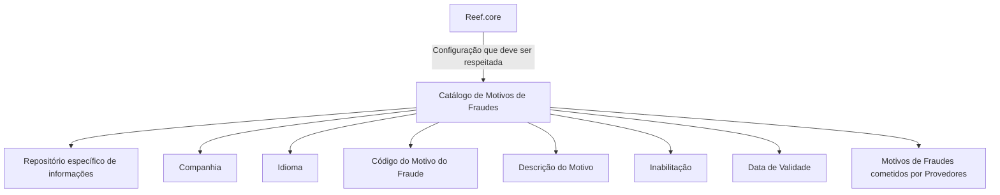

# Definição dos Motivos de Fraudes para Provedores — Documentação Reef

## 1. Metadados do Documento
- **Arquivo de Origem:** `Não identificado`
- **Tipo de Documento:** `Especificação Técnica`
- **Domínio / Sistema:** `DOCUMENTACIÓN Reef / Reef.core / Provedores`
- **Público-Alvo:** `Negócio, Analistas Funcionais, Operação e Desenvolvedores`
- **Data/Versão Identificada:** `Não identificada`

---

## 2. Resumo Executivo & Contexto de Negócio

O documento descreve a definição e a configuração de um catálogo de **Motivos de Fraudes** cometidos por Provedores. O núcleo do Sistema permite classificar esses motivos em um repositório de informações específico.

A configuração do catálogo associa cada motivo a uma companhia, a um idioma, a um código e a uma descrição. Essa estrutura permite que os motivos sejam identificados por códigos padronizados e apresentados conforme o idioma configurado.

O catálogo também inclui propriedades de controle operacional: a inabilitação de registros e a data de validade. A data de validade permite identificar quando um registro passa a estar operativo no sistema e suporta o histórico de alterações ao longo do tempo.

O documento recomenda a leitura de diretrizes e documentos funcionais relacionados, especialmente o conteúdo sobre **Provedores**, para evitar interpretações isoladas. Também determina que a configuração realizada a partir de **Reef.core** deve ser respeitada.

---

## 3. Arquitetura, Componentes & Tecnologias Envolvidas

Os elementos explicitamente citados são:

| Componente / Elemento | Papel identificado no documento |
| :--- | :--- |
| Sistema | Possui o núcleo com capacidade de classificar os Motivos de Fraudes. |
| Repositório específico | Armazena as informações de classificação dos Motivos de Fraudes. |
| Catálogo de configuração | Contém os atributos de companhia, idioma, código, descrição, inabilitação e data de validade. |
| Provedores | Entidade relacionada aos Motivos de Fraudes configurados. |
| Reef.core | Origem cuja configuração deve ser respeitada. |
| DOCUMENTACIÓN Reef | Área documental em que o conteúdo está publicado. |



**Nota de Análise:** o documento não detalha interfaces, métodos HTTP, contratos JSON, bancos de dados, tecnologias de implementação, integrações técnicas ou mecanismos de persistência do catálogo.

---

## 4. Regras de Negócio, Especificações Funcionais & Processos

1. O núcleo do Sistema possui uma funcionalidade para classificar os Motivos de Fraudes em um repositório de informação específico.
2. Cada definição de Motivo de Fraude deve conter o código da companhia sobre a qual a configuração está sendo realizada.
3. Cada definição deve conter a chave do idioma utilizada na configuração dos Motivos de Fraudes cometidos por Provedores.
4. O idioma pode ser, entre outros exemplos citados, espanhol, inglês ou português.
5. O Código do Motivo do Fraude identifica a chave ou o código do motivo.
6. A Descrição identifica a descrição do Motivo de Fraude cometido pelo Provedor, de acordo com o idioma usado em sua definição.
7. Um registro configurado pode ser desativado ou inabilitado por meio da propriedade **Inhabilitación**.
8. A propriedade **Fecha de Validez** informa a data a partir da qual o registro configurado está operativo no Sistema.
9. O uso correto da data de validade permite manter um histórico das alterações efetuadas ao longo do tempo.
10. A configuração local de codificação, uso e definição do catálogo de Motivos de Fraudes para Provedores deve respeitar a configuração realizada a partir de Reef.core.
11. A leitura de diretrizes e documentos funcionais vinculados é recomendada para evitar interpretações incorretas decorrentes da análise isolada deste documento.

---

## 5. Tabelas de Parâmetros, Ambientes e Estruturas de Dados

| Item / Parâmetro | Descrição / Função | Tipo / Valores / Formato | Ambiente / Observações |
| :--- | :--- | :--- | :--- |
| Companhia | Contém o código da companhia sobre a qual é realizada a definição dos Motivos de Fraudes. | Código da companhia; formato não detalhado. | Atributo do catálogo. |
| Idioma | Contém a chave do idioma empregada na configuração dos Motivos de Fraudes cometidos por Provedores. | Exemplos: espanhol, inglês, português. | Atributo do catálogo. |
| Código do Motivo do Fraude | Identifica a chave ou o código do Motivo do Fraude. | Códigos como APD, CIO, CSD, DPR, DRC, DUC, EPR, FRI, HAI, NCD, ORC e RMS. | Atributo do catálogo. |
| Descrição | Identifica a descrição do Motivo de Fraude cometido pelo Provedor conforme o idioma configurado. | Texto descritivo. | Atributo do catálogo. |
| Inhabilitación | Define que o registro configurado está desativado ou inabilitado para uso. | Estado de inabilitação; valores não detalhados. | Propriedade operacional. |
| Fecha de Validez | Informa a data a partir da qual o registro configurado está operativo no Sistema. | Data; formato não detalhado. | Permite histórico de mudanças. |
| Reef.core | Origem da configuração que deve ser respeitada. | Não detalhado. | Regra operacional para configurações locais. |

| Código do Motivo | Descrição apresentada |
| :--- | :--- |
| APD | Documentos Apócrifos |
| CIO | Reclamo Lesiones Fuera Accidente |
| CSD | Reclamo Mismos Daños |
| DPR | Daños Preexistentes |
| DRC | Cambio Conductor |
| DUC | Uso Diverso al Contratado |
| EPR | Expediente Procedente |
| FRI | Fraude Interno |
| HAI | Accidente Alto Impacto sin Lesiones |
| NCD | Daños no Correspondientes |
| ORC | Delincuencia Organizada |
| RMS | Reclama Monto Superior al Autorizado |

---

## 6. Bateria de Perguntas & Respostas para RAG (FAQ Sintético)

### P1: Qual é o objetivo do catálogo de Motivos de Fraudes para Provedores?
**R:** O catálogo permite que o núcleo do Sistema classifique os Motivos de Fraudes cometidos por Provedores em um repositório de informação específico.

### P2: Quais atributos identificam uma definição de Motivo de Fraude?
**R:** A definição utiliza, no mínimo, os atributos Companhia, Idioma, Código do Motivo do Fraude e Descrição. O catálogo também possui as propriedades Inhabilitación e Fecha de Validez.

### P3: Qual é a finalidade do atributo Companhia?
**R:** O atributo Companhia contém o código da companhia sobre a qual está sendo realizada a definição dos Motivos de Fraudes.

### P4: Como o idioma influencia a definição de um Motivo de Fraude?
**R:** A propriedade Idioma contém a chave do idioma empregada na configuração dos motivos cometidos por Provedores. A descrição do motivo é definida de acordo com esse idioma. O documento cita espanhol, inglês e português como exemplos.

### P5: O que representa o Código do Motivo do Fraude?
**R:** O Código do Motivo do Fraude identifica a chave ou o código do motivo. Exemplos apresentados incluem APD, CIO, CSD, DPR, DRC, DUC, EPR, FRI, HAI, NCD, ORC e RMS.

### P6: Como um registro do catálogo pode deixar de ser usado?
**R:** A propriedade Inhabilitación estabelece que o registro configurado está desativado ou inabilitado para ser utilizado.

### P7: Para que serve a Fecha de Validez?
**R:** A Fecha de Validez indica a data a partir da qual o registro configurado passa a estar operativo no Sistema. Seu uso correto permite manter um histórico das alterações efetuadas ao longo do tempo.

### P8: Qual é a orientação para configurações locais do catálogo?
**R:** As configurações locais de codificação, uso e definição do catálogo de Motivos de Fraudes para Provedores devem respeitar a configuração realizada a partir de Reef.core.

### P9: Qual é o significado do código APD no catálogo?
**R:** APD corresponde a **Documentos Apócrifos**.

### P10: Qual é o significado do código FRI no catálogo?
**R:** FRI corresponde a **Fraude Interno**.

### P11: Qual código identifica Delincuencia Organizada?
**R:** O código ORC identifica o motivo **Delincuencia Organizada**.

### P12: O documento detalha os métodos de integração ou contratos técnicos do catálogo?
**R:** Não. O documento descreve atributos funcionais e operacionais do catálogo, mas não detalha métodos HTTP, contratos JSON, APIs, banco de dados ou tecnologias de implementação.

---

## 7. Glossário de Termos, Siglas & Conceitos-Chave

- **APD:** Código de motivo correspondente a Documentos Apócrifos.
- **CIO:** Código de motivo correspondente a Reclamo Lesiones Fuera Accidente.
- **CSD:** Código de motivo correspondente a Reclamo Mismos Daños.
- **DPR:** Código de motivo correspondente a Daños Preexistentes.
- **DRC:** Código de motivo correspondente a Cambio Conductor.
- **DUC:** Código de motivo correspondente a Uso Diverso al Contratado.
- **EPR:** Código de motivo correspondente a Expediente Procedente.
- **FRI:** Código de motivo correspondente a Fraude Interno.
- **HAI:** Código de motivo correspondente a Accidente Alto Impacto sin Lesiones.
- **NCD:** Código de motivo correspondente a Daños no Correspondientes.
- **ORC:** Código de motivo correspondente a Delincuencia Organizada.
- **RMS:** Código de motivo correspondente a Reclama Monto Superior al Autorizado.
- **Inhabilitación:** Propriedade que desativa ou inabilita um registro para uso.
- **Fecha de Validez:** Propriedade que define a data a partir da qual um registro configurado está operativo.
- **Reef.core:** Origem de configuração que deve ser respeitada pelas configurações locais, sem detalhamento adicional no documento.

---

## 8. Notas Críticas, Riscos & Limitações

- O documento não informa o nome do arquivo de origem, data, versão, autor técnico ou histórico de revisões.
- Não há detalhamento de APIs, serviços, endpoints, protocolos, modelos de dados, integrações, bancos de dados ou mecanismos de auditoria.
- Não são informados os formatos aceitos para os códigos de companhia, chaves de idioma ou datas de validade.
- Não são especificados os valores possíveis, a regra de precedência ou o comportamento sistêmico associado à propriedade Inhabilitación.
- O documento cita Reef.core como fonte de configuração obrigatória, mas não descreve como essa configuração é acessada, sincronizada ou validada.
- A leitura do conteúdo relacionado a Provedores e de outras diretrizes funcionais é recomendada pelo próprio documento para evitar interpretação isolada.

---

## 9. Conteúdo Bruto Estruturado (Referência Fiel)

```text
--- [PÁGINA 1 DE 2] ---

DEFINICIÓN de los MOTIVOS de los FRAUDES
Objetivo
Funcionalmente, el núcleo del Sistema cuenta con la posibilidad de clasicar los Motivos de los Fraudes en un repositorio de información
especíco.
Propiedades Operativas
Otras Propiedades
Propiedades Operativas
Compañía
Este Atributo del catálogo contiene el código de la compañía sobre la que se está realizando la denición de los Motivos de los Fraudes.
Idioma
Esta propiedad contiene la clave del Idioma empleado en la conguración de los Motivos de los Fraudes cometidos por los Proveedores
como por ejemplo: español, inglés, Portugués, ...
Código del Motivo del Fraude
Este campo identica la clave o el código del Motivo del Fraude.
Descripción
Este Atributo del catálogo de conguración identica la descripción del Motivo del Fraude cometido por el Proveedor de acuerdo con el
idioma utilizado en su denición.
A modo de ejemplo y si el idioma empleado en la denición fuera el Español...
MOTIVO DESCRIPCIÓN
APD Documentos Apócrifos
CIO Reclamo Lesiones Fuera Accidente
CSD Reclamo Mismos Daños
DPR Daños Preexistentes
Documentation / DOCUMENTACIÓN Reef
DOCUMENTACIÓN Reef
Mapfredocument
DOCUMENTACIÓN Reef
Owner
user:agonzalez_mapfre.com
Lifecycle
Approved Source
 / 
 VL
Buscar Inicio Soluciones Arquitecturas APIs Componentes Cloud Documentación Zeus Reef Ayuda
ES


--- [PÁGINA 2 DE 2] ---

MOTIVO DESCRIPCIÓN
DRC Cambio Conductor
DUC Uso Diverso al Contratado
EPR Expediente Procedente
FRI Fraude Interno
HAI Accidente Alto Impacto sin Lesiones
NCD Daños no Correspondientes
ORC Delincuencia Organizada
RMS Reclama Monto Superior al Autorizado
Otras Propiedades
Inhabilitación
Esta propiedad establece que el Registro congurado está desactivado o inhabilitado para ser utilizado.
Fecha de Validez
Esta propiedad le indica al Sistema la fecha a partir de la cual el registro congurado está operativo en el sistema por lo que su correcto uso
permite tener un histórico de los cambios efectuados a lo largo del tiempo.
Vínculos
Relación de Directrices y Documentos funcionales cuya lectura recomendada para evitar que la interpretación aislada del presente
documento pueda conducir a error.
Proveedores
Preguntas frecuentes
(1) ¿Existe alguna recomendación operativa que deba ser tomada en consideración localmente en la codicación, uso y denición del
catálogo de Motivos de los Fraudes para los Proveedores?
Se debe respetar la conguración realizada desde Reef.core
```
