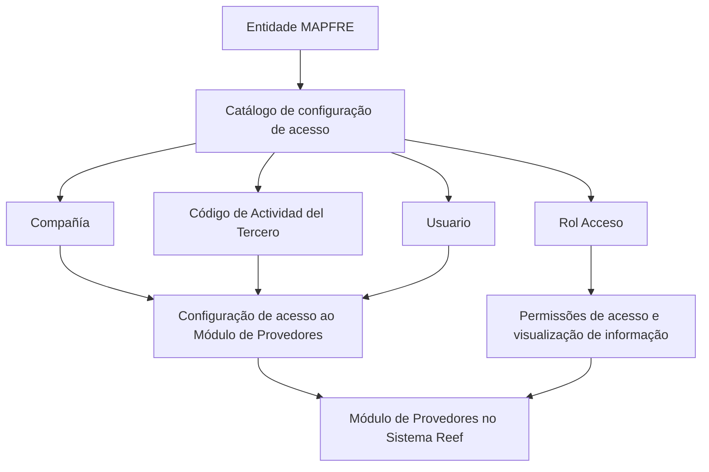

# Configuração de Roles de Acesso de Provedores no Sistema Reef

## 1. Metadados do Documento
- **Arquivo de Origem:** `Não identificado no conteúdo extraído`
- **Tipo de Documento:** `Especificação Técnica / Funcional`
- **Domínio / Sistema:** `Reef — Módulo de Provedores`
- **Público-Alvo:** `Administradores funcionais, equipes de segurança, operação e negócio`
- **Data/Versão Identificada:** `Não identificada`
- **Owner identificado:** `user:agonzalez_mapfre.com`
- **Lifecycle identificado:** `Approved Source / VL`

---

## 2. Resumo Executivo & Contexto de Negócio

O documento descreve a configuração de acesso ao **Módulo de Provedores** no sistema Reef. O núcleo do sistema permite definir quais usuários podem acessar o módulo e qual papel de acesso (*Rol Acceso*) é atribuído a cada usuário.

A configuração é realizada por meio de um catálogo que associa quatro propriedades: **Compañía**, **Código de Actividad del Tercero**, **Usuario** e **Rol Acceso**. Essa associação determina o escopo organizacional, a identificação do terceiro como provedor, o usuário configurado e as permissões de acesso e visualização de informações.

O documento indica que o papel atribuído ao usuário determina os respectivos permissões de acesso e de visualização de informação. Entretanto, o conteúdo não detalha os valores possíveis para os papéis, a matriz de permissões, telas do sistema, métodos técnicos, integrações ou regras de herança de acesso.

Não existe uma recomendação ou preferência explícita para padronizar a codificação do catálogo de roles de provedores. A entidade MAPFRE deve avaliar a conveniência de utilizar esse catálogo transversalmente nos processos da companhia, visando sua correta exploração posterior.

---

## 3. Arquitetura, Componentes & Tecnologias Envolvidas

### Componentes e conceitos identificados

| Componente / Conceito | Descrição baseada no documento |
| :--- | :--- |
| **Reef** | Sistema ou domínio documental no qual está localizada a documentação. |
| **Módulo de Provedores** | Módulo cujo acesso é configurado por usuário e papel de acesso. |
| **Núcleo do Sistema** | Componente funcional que disponibiliza a capacidade de configurar usuários e roles para acesso ao módulo. |
| **Catálogo de configuração de acesso** | Catálogo que contém as propriedades Companhia, Código de Actividad del Tercero, Usuario e Rol Acceso. |
| **Sistema de Seguridad** | Documento vinculado e recomendado para leitura complementar. |
| **Actividades de los Terceros** | Documento vinculado e recomendado para leitura complementar. |
| **MAPFRE** | Entidade que deve analisar a conveniência de utilização transversal do catálogo nos processos da companhia. |

### Fluxo funcional de configuração de acesso



> **Nota de Análise:** O documento descreve uma relação funcional entre propriedades do catálogo e o acesso ao Módulo de Provedores. Não apresenta arquitetura técnica, APIs, bancos de dados, protocolos, ambientes, servidores, URLs, tecnologias de implementação ou contratos de integração.

---

## 4. Regras de Negócio, Especificações Funcionais & Processos

### Configuração de acesso ao Módulo de Provedores

1. O núcleo do sistema possui a capacidade de configurar quais usuários podem acessar o Módulo de Provedores.
2. O núcleo do sistema permite configurar o rol atribuído a cada usuário com acesso ao Módulo de Provedores.
3. A configuração utiliza um catálogo de informação.
4. O atributo **Compañía** contém o código da companhia sobre a qual está sendo configurado o acesso ao módulo.
5. A propriedade **Código de Actividad del Tercero** estabelece o código da atividade do terceiro-provedor.
6. O código da atividade deve identificar o terceiro como provedor.
7. A propriedade **Usuario** identifica o usuário configurado no catálogo.
8. O atributo **Rol Acceso** determina o papel atribuído ao usuário.
9. O papel atribuído determina as permissões de acesso e visualização de informação.
10. O documento não estabelece preferência ou recomendação para codificação ou padronização do catálogo de roles de provedores.
11. A entidade MAPFRE deve analisar a conveniência de utilizar transversalmente o catálogo de informação nos processos da companhia, para viabilizar a correta exploração posterior.

### Documentos funcionais vinculados

A leitura dos documentos vinculados é recomendada para evitar que a interpretação isolada deste documento conduza a erro:

- **Actividades de los Terceros**
- **Sistema de Seguridad**

> **Nota de Análise:** O documento não detalha a estrutura de papéis, os critérios para conceder ou revogar acessos, o processo de aprovação, a segregação de funções, auditoria, autenticação ou o comportamento do sistema diante de configurações inválidas.

---

## 5. Tabelas de Parâmetros, Ambientes e Estruturas de Dados

| Item / Parâmetro | Descrição / Função | Tipo / Valores / Formato | Ambiente / Observações |
| :--- | :--- | :--- | :--- |
| **Compañía** | Contém o código da companhia sobre a qual é realizada a configuração de acesso ao Módulo de Provedores. | Código de companhia; formato não especificado. | Aplicável à configuração de acesso do módulo. |
| **Código de Actividad del Tercero** | Estabelece o código da atividade do terceiro-provedor. | Código de atividade; formato não especificado. | A atividade do terceiro deve identificá-lo como provedor. |
| **Usuario** | Identifica o usuário no catálogo de configuração. | Usuário; formato não especificado. | Usuário ao qual será atribuído um rol de acesso. |
| **Rol Acceso** | Determina o papel atribuído ao usuário. | Rol; valores permitidos não especificados. | Determina permissões de acesso e de visualização de informação. |
| **Módulo de Provedores** | Módulo do sistema para o qual o acesso é configurado. | Componente funcional. | Integrado ao núcleo do sistema, conforme descrição funcional. |
| **Catálogo de Roles de los Proveedores** | Catálogo de informação relacionado à codificação, uso e definição de roles de provedores. | Catálogo; estrutura técnica não especificada. | Não há recomendação de padronização de codificação. |
| **Actividades de los Terceros** | Documento funcional vinculado. | Documento de referência. | Leitura recomendada. |
| **Sistema de Seguridad** | Documento funcional vinculado. | Documento de referência. | Leitura recomendada. |
| **Owner** | Responsável identificado no cabeçalho documental. | `user:agonzalez_mapfre.com` | Conforme texto extraído. |
| **Lifecycle** | Estado documental identificado no cabeçalho. | `Approved Source / VL` | Significado de `VL` não detalhado. |

---

## 6. Bateria de Perguntas & Respostas para RAG (FAQ Sintético)

### P1: Qual é o objetivo da configuração de roles de acesso de provedores no Reef?
**R:** O objetivo é configurar quais usuários podem acessar o Módulo de Provedores no sistema e qual rol de acesso é atribuído a cada usuário. O rol atribuído determina as permissões de acesso e visualização de informação.

### P2: Quais propriedades compõem o catálogo de configuração de acesso ao Módulo de Provedores?
**R:** O catálogo contém as propriedades **Compañía**, **Código de Actividad del Tercero**, **Usuario** e **Rol Acceso**.

### P3: Qual é a função do atributo Compañía na configuração de acesso?
**R:** O atributo **Compañía** contém o código da companhia sobre a qual está sendo realizada a configuração de acesso ao Módulo de Provedores.

### P4: Quando o Código de Actividad del Tercero é aplicável a um terceiro?
**R:** O Código de Actividad del Tercero estabelece o código da atividade do terceiro-provedor quando a atividade do terceiro o identifica como tal, ou seja, como provedor.

### P5: Como o usuário é identificado na configuração de acesso?
**R:** A propriedade **Usuario** do catálogo de configuração identifica o usuário ao qual a configuração de acesso e o rol serão associados.

### P6: O que determina o atributo Rol Acceso?
**R:** O atributo **Rol Acceso** determina o papel atribuído ao usuário. Esse papel define os respectivos permissões de acesso e de visualização de informação.

### P7: O documento define quais roles de acesso podem ser atribuídos aos usuários?
**R:** Não. O documento informa que existe um atributo Rol Acceso, mas não apresenta os valores possíveis de roles, nem uma matriz de permissões associada a cada rol.

### P8: Existe uma recomendação para padronizar a codificação do catálogo de roles de provedores?
**R:** Não. O documento afirma que não existe preferência nem recomendação para estabelecer ou padronizar a codificação do catálogo no sistema.

### P9: Qual responsabilidade é atribuída à entidade MAPFRE em relação ao catálogo?
**R:** A entidade MAPFRE deve analisar a conveniência de utilizar transversalmente, nos processos da companhia, o catálogo de informação para permitir sua correta exploração posterior.

### P10: Quais documentos devem ser consultados para evitar interpretação isolada incorreta?
**R:** O documento recomenda consultar **Actividades de los Terceros** e **Sistema de Seguridad**, pois a interpretação isolada do conteúdo pode conduzir a erro.

### P11: O documento descreve APIs, métodos HTTP ou contratos JSON para o Módulo de Provedores?
**R:** Não. O conteúdo extraído não apresenta APIs, métodos HTTP, contratos JSON, endpoints, tecnologias de implementação ou detalhes de integração técnica.

### P12: O documento especifica ambientes, URLs, servidores ou rotas de log?
**R:** Não. Não foram identificadas informações sobre ambientes, URLs, servidores, portas, rotas de log ou parâmetros de infraestrutura no conteúdo fornecido.

---

## 7. Glossário de Termos, Siglas & Conceitos-Chave

- **Reef:** Sistema ou domínio documental mencionado no cabeçalho da documentação.
- **Módulo de Provedores:** Módulo do sistema cujo acesso é configurado por usuário e rol.
- **Proveedor / Provedor:** Terceiro cuja atividade o identifica como provedor.
- **Tercero:** Entidade ou terceiro referido pela propriedade Código de Actividad del Tercero.
- **Compañía:** Companhia cujo código define o escopo da configuração de acesso.
- **Usuario:** Usuário identificado no catálogo de configuração.
- **Rol Acceso:** Papel atribuído a um usuário; determina permissões de acesso e visualização de informações.
- **Catálogo:** Estrutura de configuração que reúne propriedades relacionadas ao acesso ao Módulo de Provedores.
- **MAPFRE:** Entidade que deve avaliar a utilização transversal do catálogo nos processos da companhia.
- **VL:** Sigla exibida no campo Lifecycle como `Approved Source / VL`; significado não detalhado no documento.

---

## 8. Notas Críticas, Riscos & Limitações

- O documento é funcional e resumido; não detalha a implementação técnica da configuração de acesso.
- Não há matriz de roles, permissões, ações permitidas, critérios de segregação de funções ou regras de conflito entre roles.
- Não foram identificados fluxos de aprovação, revogação de acesso, auditoria, autenticação ou rastreabilidade de alterações.
- Não há definição de formato, obrigatoriedade, unicidade ou validação para os campos do catálogo.
- Não foram identificados ambientes, servidores, URLs, APIs, métodos HTTP, contratos JSON, bancos de dados ou integrações.
- A leitura isolada do documento pode conduzir a interpretações incorretas; o próprio conteúdo recomenda consultar **Actividades de los Terceros** e **Sistema de Seguridad**.
- A ausência de padronização recomendada para codificação exige avaliação da entidade MAPFRE quanto ao uso transversal do catálogo.
- **Nota de Análise:** O documento menciona o Rol Acceso, mas não detalha quais permissões específicas são concedidas por cada rol.

---

## 9. Conteúdo Bruto Estruturado (Referência Fiel)

```text
--- [PÁGINA 1 DE 2] ---

CONFIGURAR ROLES de ACCESO de PROVEEDORES
Funcionalmente el núcleo del Sistema cuenta con la posibilidad de congurar qué Usuarios y con qué Rol pueden acceder al Módulo de
Proveedores en el Sistema.
Propiedades
Propiedades
Compañía
Este Atributo del catálogo contiene el código de la compañía sobre la que se está realizando la conguración de acceso al módulo.
Código de Actividad del Tercero
Esta propiedad establece en el sistema el código de la Actividad del Tercero-Proveedor siempre y cuando la Actividad del Tercero lo
identique como tal.
Usuario
Esta Propiedad del catálogo de conguración identica el Usuario.
Rol Acceso
Este Atributo del catálogo de conguración determina el Rol que se está asignando al Usuario, rol que determinará los permisos de acceso y
visualización de información.
Vínculos
Relación de Directrices y Documentos funcionales cuya lectura recomendada para evitar que la interpretación aislada del presente
documento pueda conducir a error.
Actividades de los Terceros
Sistema de Seguridad
Preguntas frecuentes
(1) ¿Existe alguna recomendación operativa que deba ser tomada en consideración localmente en la codicación, uso y denición del
catálogo de Roles de los Proveedores?
No existe una preferencia ni recomendación para establecer o estandarizar en el sistema su codicación, si bien la entidad MAPFRE debe
analizar la conveniencia de utilizar transversalmente en los procesos de la compañía este catálogo de información para su correcta y
Documentation / DOCUMENTACIÓN Reef
DOCUMENTACIÓN Reef
Mapfredocument
DOCUMENTACIÓN Reef
Owner
user:agonzalez_mapfre.com
Lifecycle
Approved Source
 /
VL
Buscar Inicio Soluciones Arquitecturas APIs Componentes Cloud Documentación Zeus Reef Ayuda
ES

--- [PÁGINA 2 DE 2] ---

posterior explotación.
```
