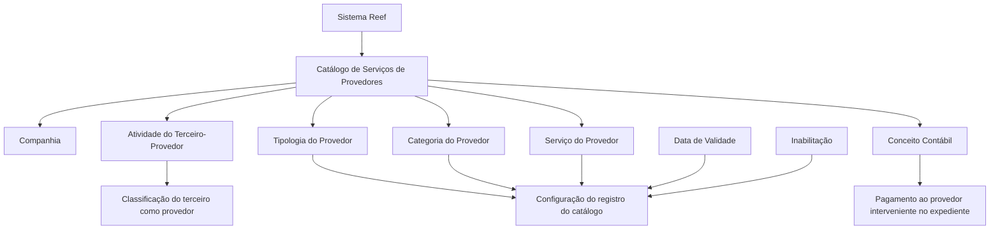
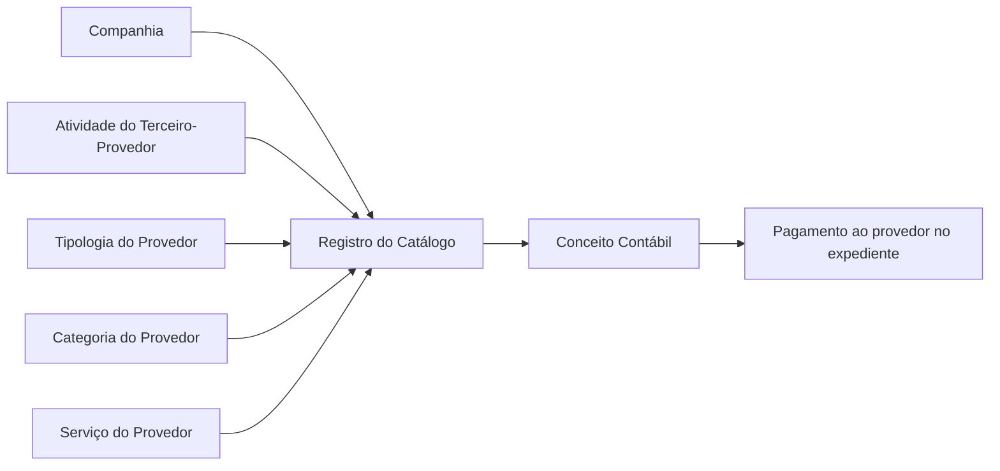

# Catálogo de Serviços de Provedores por Atividade, Tipologia e Categoria

## 1. Metadados do Documento
- **Arquivo de Origem:** Não identificado no conteúdo fornecido
- **Tipo de Documento:** Especificação Técnica / Documento Funcional
- **Domínio / Sistema:** Reef / MAPFRE — Catálogo de Serviços de Provedores
- **Público-Alvo:** Negócio, analistas funcionais, operação e equipes responsáveis pela configuração de catálogos
- **Data/Versão Identificada:** Não identificada

---

## 2. Resumo Executivo & Contexto de Negócio

O documento descreve a definição de serviços fornecidos por provedores no sistema Reef. O núcleo do sistema permite codificar os serviços de provedores conforme a Atividade, a Tipologia e a Categoria do terceiro-provedor.

A configuração é armazenada em um repositório de informação específico. Esse repositório é entregue inicialmente às instalações sem conteúdo, exigindo que a organização efetue a definição e a manutenção dos registros do catálogo.

Cada registro de serviço associa companhia, atividade do terceiro, tipologia, categoria, serviço e conceito contábil. O conceito contábil identificado é utilizado para realizar o pagamento ao provedor que participou de um expediente, considerando a combinação de atividade, tipologia, categoria e serviço prestado.

O catálogo prevê mecanismos de vigência e inabilitação. A data de validade determina a partir de quando o registro passa a estar operacional, permitindo histórico das alterações ao longo do tempo. A inabilitação permite desativar um registro configurado.

O documento não estabelece uma codificação obrigatória ou recomendação de padronização para o catálogo. Entretanto, indica que a entidade MAPFRE deve avaliar a conveniência de utilizar transversalmente esse catálogo nos processos corporativos para viabilizar sua exploração posterior.

---

## 3. Arquitetura, Componentes & Tecnologias Envolvidas

O conteúdo não descreve arquitetura de infraestrutura, integrações, APIs, métodos HTTP, contratos JSON, bancos de dados, servidores ou tecnologias de implementação. A estrutura funcional apresentada é composta pelo sistema Reef, pelo catálogo de serviços de provedores e pelos atributos usados para classificar e operacionalizar o pagamento de provedores.

### Componentes e conceitos identificados

| Componente / Conceito | Papel descrito |
| :--- | :--- |
| **Sistema Reef** | Sistema cujo núcleo permite codificar os serviços fornecidos pelos provedores. |
| **Catálogo de Serviços de Provedores** | Repositório específico usado para configurar serviços segundo atividade, tipologia e categoria. |
| **Terceiro-Provedor** | Entidade cuja atividade pode identificá-la como provedor e que é classificada no catálogo. |
| **Expediente** | Contexto no qual um provedor interveniente pode receber pagamento mediante o conceito contábil configurado. |
| **Conceito Contábil** | Conceito de Cobro y Pago Vario utilizado para realizar pagamento ao provedor. |
| **MAPFRE** | Entidade que deve analisar a conveniência de utilizar o catálogo transversalmente em seus processos. |



> **Nota de Análise:** O conteúdo fornecido não detalha a implementação técnica do Reef, os fluxos de integração, permissões de acesso, métodos de manutenção do catálogo, contratos de dados ou regras de cálculo financeiro.

---

## 4. Regras de Negócio, Especificações Funcionais & Processos

### 4.1. Finalidade do catálogo

1. O núcleo do sistema deve permitir a codificação dos serviços providos por provedores.
2. A codificação dos serviços deve considerar:
   - Atividade;
   - Tipologia;
   - Categoria do provedor.
3. As informações devem ser mantidas em um repositório específico.
4. O repositório é entregue inicialmente sem conteúdo nas instalações.

### 4.2. Critérios de classificação do serviço

Um registro do catálogo de serviços de provedores é configurado a partir de atributos que identificam o contexto organizacional, a classificação do terceiro-provedor, o serviço e o conceito contábil correspondente.

A relação funcional apresentada pelo documento é:



### 4.3. Regra de conceito contábil e pagamento

1. O catálogo identifica o conceito contábil aplicável ao serviço configurado.
2. O conceito contábil corresponde a um **Concepto de Cobro y Pago Vario**.
3. O conceito contábil deve ser utilizado para realizar o pagamento ao provedor que tenha participado do expediente.
4. A utilização do conceito contábil deve considerar a combinação de:
   - atividade;
   - tipologia;
   - categoria;
   - serviço prestado.

### 4.4. Regra de inabilitação

1. A propriedade **Inhabilitación** determina que o registro configurado está desativado ou inabilitado.
2. O documento não detalha o comportamento sistêmico de registros inabilitados, como bloqueio de seleção, bloqueio de pagamento, exclusão lógica ou preservação de histórico.

### 4.5. Regra de vigência e histórico

1. A propriedade **Fecha de Validez** informa ao sistema a data a partir da qual o registro configurado está operacional.
2. O uso correto da data de validade permite manter um histórico das alterações realizadas ao longo do tempo.
3. O documento não especifica se existe data final de vigência, sobreposição de períodos ou validação de conflitos entre registros.

### 4.6. Diretriz de codificação local e uso transversal

1. Não existe preferência ou recomendação para estabelecer ou padronizar a codificação do catálogo no sistema.
2. A entidade MAPFRE deve analisar a conveniência de utilizar o catálogo transversalmente nos processos da companhia.
3. A finalidade da utilização transversal é possibilitar a correta exploração posterior das informações do catálogo.

### 4.7. Documentos relacionados

A interpretação isolada deste documento pode conduzir a erro. O texto recomenda a leitura das diretrizes e documentos funcionais vinculados:

- Serviços de Provedores;
- Atividades dos Terceiros;
- Tipologias de Provedores por Atividade.

---

## 5. Tabelas de Parâmetros, Ambientes e Estruturas de Dados

### 5.1. Atributos do Catálogo de Serviços de Provedores

| Item / Parâmetro | Descrição / Função | Tipo / Valores / Formato | Ambiente / Observações |
| :--- | :--- | :--- | :--- |
| Companhia | Contém o código da companhia sobre a qual está sendo realizada a definição do serviço. | Código da companhia; formato não detalhado. | Aplicável à definição do serviço no catálogo. |
| Código de Atividade do Terceiro | Estabelece o código da atividade do terceiro-provedor quando a atividade do terceiro o identifica como provedor. | Código de atividade; formato não detalhado. | Depende de a atividade identificar o terceiro como provedor. |
| Tipologia | Determina o código ou chave do tipo de provedor configurado no catálogo. | Código ou chave; valores não detalhados. | Aplicável à classificação do provedor. |
| Categoria | Determina o código ou chave do tipo de provedor configurado no catálogo. | Código ou chave; valores não detalhados. | O texto usa a mesma descrição atribuída à tipologia. |
| Serviço | Determina o código ou chave do serviço dos provedores configurado no catálogo. | Código ou chave; valores não detalhados. | Aplicável ao serviço prestado pelo provedor. |
| Conceito Contábil | Identifica o conceito contábil, denominado Concepto de Cobro y Pago Vario, usado para pagamento ao provedor. | Conceito contábil; estrutura não detalhada. | Considera atividade, tipologia, categoria e serviço prestado. |
| Inabilitação | Indica que o registro configurado está desativado ou inabilitado. | Estado de inabilitação; valores não detalhados. | Não há detalhamento de efeitos operacionais adicionais. |
| Data de Validade | Indica a data a partir da qual o registro configurado está operativo no sistema. | Data; formato não detalhado. | Permite histórico das mudanças ao longo do tempo. |

### 5.2. Entidades, documentos e referências

| Item / Parâmetro | Descrição / Função | Tipo / Valores / Formato | Ambiente / Observações |
| :--- | :--- | :--- | :--- |
| Reef | Sistema mencionado como possuidor do núcleo funcional de codificação dos serviços. | Sistema corporativo. | Não há detalhes de versão, infraestrutura ou tecnologia. |
| MAPFRE | Entidade que deve avaliar o uso transversal do catálogo em processos da companhia. | Entidade corporativa. | Mencionada na orientação sobre codificação e exploração do catálogo. |
| Serviços de Provedores | Documento funcional relacionado. | Referência documental. | Leitura recomendada. |
| Atividades dos Terceiros | Documento funcional relacionado. | Referência documental. | Leitura recomendada. |
| Tipologias de Provedores por Atividade | Documento funcional relacionado. | Referência documental. | Leitura recomendada. |
| Owner | `user:agonzalez_mapfre.com` | Identificador apresentado no conteúdo. | O documento não explica o papel ou a responsabilidade associada. |
| Lifecycle | `Approved Source` | Estado apresentado no conteúdo. | Sem detalhamento adicional. |

### 5.3. Ambientes, URLs e rotas de log

| Item / Parâmetro | Descrição / Função | Tipo / Valores / Formato | Ambiente / Observações |
| :--- | :--- | :--- | :--- |
| Ambientes | Não identificados. | Não aplicável. | O conteúdo não apresenta URLs, servidores, portas ou ambientes. |
| Rotas de log | Não identificadas. | Não aplicável. | O conteúdo não descreve logging, monitoramento ou observabilidade. |
| APIs e integrações | Não identificadas. | Não aplicável. | O conteúdo não descreve APIs, mensagens, contratos ou integrações. |

---

## 6. Bateria de Perguntas & Respostas para RAG (FAQ Sintético)

### P1: Qual é o objetivo do Catálogo de Serviços de Provedores no sistema Reef?
**R:** O Catálogo de Serviços de Provedores permite codificar os serviços fornecidos por provedores conforme a atividade, a tipologia e a categoria do provedor. A configuração é mantida em um repositório de informação específico.

### P2: O repositório do Catálogo de Serviços de Provedores já possui dados quando é entregue a uma instalação?
**R:** Não. O documento informa que o repositório de informação específico é entregue inicialmente às instalações vazio de conteúdo. A organização precisa configurar os registros necessários.

### P3: Quais atributos são utilizados para configurar um serviço de provedor?
**R:** O documento identifica os atributos Companhia, Código de Atividade do Terceiro, Tipologia, Categoria, Serviço, Conceito Contábil, Inabilitação e Data de Validade.

### P4: Qual é a função do atributo Companhia no catálogo?
**R:** O atributo Companhia contém o código da companhia sobre a qual está sendo realizada a definição do serviço no Catálogo de Serviços de Provedores.

### P5: Quando o Código de Atividade do Terceiro é aplicável ao registro do catálogo?
**R:** O Código de Atividade do Terceiro estabelece no sistema o código da atividade do terceiro-provedor quando a atividade do terceiro o identifica como provedor.

### P6: Como o Conceito Contábil é utilizado no Catálogo de Serviços de Provedores?
**R:** O Conceito Contábil identifica o Concepto de Cobro y Pago Vario utilizado para realizar o pagamento ao provedor que interveio em um expediente. A seleção considera a atividade, a tipologia, a categoria e o serviço prestado.

### P7: O que significa a propriedade Inabilitação?
**R:** A propriedade Inabilitação estabelece que o registro configurado está desativado ou inabilitado. O documento não detalha o efeito sistêmico dessa condição sobre pagamentos, consultas ou novas utilizações do registro.

### P8: Para que serve a Data de Validade de um registro do catálogo?
**R:** A Data de Validade indica a partir de qual data o registro configurado está operativo no sistema. O uso correto dessa propriedade permite manter o histórico das mudanças realizadas ao longo do tempo.

### P9: Existe uma regra corporativa obrigatória para a codificação dos serviços de provedores?
**R:** Não. O documento declara que não existe preferência nem recomendação para estabelecer ou padronizar a codificação no sistema.

### P10: Qual orientação é fornecida à entidade MAPFRE sobre o uso do catálogo?
**R:** A entidade MAPFRE deve analisar a conveniência de utilizar transversalmente o catálogo de informações nos processos da companhia, visando sua correta e posterior exploração.

### P11: Quais documentos devem ser consultados para evitar interpretação isolada incorreta?
**R:** O documento recomenda a leitura de Serviços de Provedores, Atividades dos Terceiros e Tipologias de Provedores por Atividade. A relação desses documentos é apresentada como necessária para reduzir o risco de interpretação isolada incorreta.

### P12: O documento especifica APIs, URLs, métodos HTTP ou contratos JSON do catálogo?
**R:** Não. O conteúdo fornecido não apresenta APIs, URLs, métodos HTTP, contratos JSON, tecnologias de implementação, servidores ou detalhes de integração.

---

## 7. Glossário de Termos, Siglas & Conceitos-Chave

- **Reef:** Sistema mencionado como possuidor do núcleo que permite codificar os serviços providos pelos provedores.
- **Catálogo de Serviços de Provedores:** Repositório específico para definir e codificar serviços segundo atividade, tipologia e categoria.
- **Terceiro-Provedor:** Terceiro cuja atividade pode identificá-lo como provedor no sistema.
- **Atividade do Terceiro:** Código de atividade usado quando identifica o terceiro como provedor.
- **Tipologia:** Código ou chave do tipo de provedor configurado no catálogo.
- **Categoria:** Código ou chave configurado no catálogo para classificação do provedor.
- **Serviço:** Código ou chave do serviço do provedor configurado no catálogo.
- **Conceito Contábil:** Conceito identificado pelo catálogo para realizar o pagamento ao provedor interveniente em um expediente.
- **Concepto de Cobro y Pago Vario:** Denominação apresentada pelo documento para o conceito contábil utilizado no pagamento ao provedor.
- **Inabilitação:** Propriedade que define um registro como desativado ou inabilitado.
- **Data de Validade:** Data a partir da qual o registro configurado se torna operacional no sistema.
- **Expediente:** Contexto no qual o provedor pode ter intervindo e para o qual o pagamento é realizado.
- **MAPFRE:** Entidade mencionada como responsável por analisar a conveniência de uso transversal do catálogo.
- **VL:** Sigla exibida no conteúdo, sem significado explicado.

---

## 8. Notas Críticas, Riscos & Limitações

- O repositório do catálogo é inicialmente entregue sem conteúdo, o que torna a configuração inicial uma dependência operacional para uso do recurso.
- O documento não recomenda nem padroniza a codificação dos serviços. Essa ausência pode produzir nomenclaturas ou classificações divergentes entre processos, caso a entidade não estabeleça governança própria.
- A utilização transversal do catálogo é apresentada como uma conveniência a ser analisada pela entidade MAPFRE, não como uma obrigação definida no texto.
- A interpretação isolada do documento pode levar a erro; a leitura dos documentos relacionados é expressamente recomendada.
- O documento não detalha formatos de campos, domínios de valores, chaves de unicidade, regras de precedência, tratamento de registros sobrepostos, data final de vigência ou comportamento de registros inabilitados.
- Não há descrição de APIs, integração entre sistemas, segurança, autorização, trilhas de auditoria, logs, infraestrutura, banco de dados ou fluxos técnicos de manutenção.
- O texto apresenta caracteres possivelmente afetados pela extração, como `codicar`, `especíco`, `congurando` e `denición`. Esses trechos foram preservados na referência bruta para fidelidade à extração.

---

## 9. Conteúdo Bruto Estruturado (Referência Fiel)

```text
--- [PÁGINA 1 DE 2] ---

DEFINICIÓN de los SERVICIOS por Actividad, Tipología y Categoría del
PROVEEDOR
Objetivo
Funcionalmente, el núcleo del Sistema cuenta con la posibilidad de codicar los Servicios provistos por los Proveedores en función de su
Actividad, Tipología y Categoría en un repositorio de información especíco que se entrega inicialmente a las instalaciones vacío de
contenido.
Propiedades
Otras Propiedades
Compañía
Este Atributo del catálogo contiene el código de la compañía sobre la que se está realizando la denición del Servicio.
Código de Actividad del Tercero
Esta propiedad establece en el sistema el código de la Actividad del Tercero-Proveedor siempre y cuando la Actividad del Tercero lo
identique como tal.
Tipología
Este Atributo determina el código o clave del Tipo de Proveedor que se está congurando en el catálogo.
Categoría
Este Atributo determina el código o clave del Tipo de Proveedor que se está congurando en el catálogo.
Servicio
Este Atributo determina el código o clave del Servicio de los Proveedores que se está congurando en el catálogo.
Concepto Contable
Esta propiedad del Catálogo identica el Concepto Contable (Concepto de Cobro y Pago Vario) que va a utilizarse para realizar el pago al
Proveedor que haya intervenido en el expediente (de acuerdo con su Actividad, Tipología, Categoría y Servicio Prestado)
Otras Propiedades
Inhabilitación
Esta propiedad establece que el Registro congurado está desactivado o inhabilitado.
Documentation / DOCUMENTACIÓN Reef
DOCUMENTACIÓN Reef
Mapfredocument
DOCUMENTACIÓN Reef
Owner
user:agonzalez_mapfre.com
Lifecycle
Approved Source
 / 
 VL
Buscar Inicio Soluciones Arquitecturas APIs Componentes Cloud Documentación Zeus Reef Ayuda
ES


--- [PÁGINA 2 DE 2] ---

Fecha de Validez
Esta propiedad le indica al Sistema la fecha a partir de la cual el registro congurado está operativo en el sistema por lo que su correcto uso
permite tener un histórico de los cambios efectuados a lo largo del tiempo.
Vínculos
Relación de Directrices y Documentos funcionales cuya lectura recomendada para evitar que la interpretación aislada del presente
documento pueda conducir a error.
Servicios de Proveedores
Actividades de los Terceros
Tipologías de Proveedores por Actividad
Preguntas frecuentes
(1) ¿Existe alguna recomendación operativa que deba ser tomada en consideración localmente en la codicación, uso y denición del
catálogo de Servicios de los Proveedores?
No existe una preferencia ni recomendación para establecer o estandarizar en el sistema su codicación, si bien la entidad MAPFRE debe
analizar la conveniencia de utilizar transversalmente en los procesos de la compañía este catálogo de información para su correcta y
posterior explotación.
```
