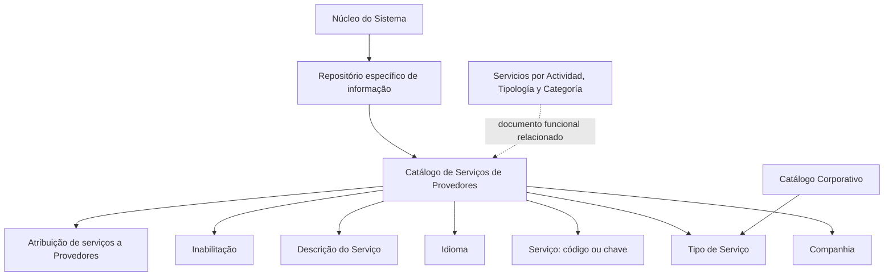

# Definição dos Serviços de Provedores — Catálogo de Serviços

## 1. Metadados do Documento
- **Arquivo de Origem:** Não identificado
- **Tipo de Documento:** Especificação Funcional
- **Domínio / Sistema:** Reef / MAPFRE — Catálogo de Serviços de Provedores
- **Público-Alvo:** Negócio, analistas funcionais, operação e equipes responsáveis pela configuração de catálogos
- **Data/Versão Identificada:** Não identificada

---

## 2. Resumo Executivo & Contexto de Negócio

O documento descreve a definição funcional do catálogo de Serviços de Provedores no núcleo do sistema. O sistema permite codificar serviços fornecidos por provedores em um repositório específico de informações.

O repositório de Serviços de Provedores é entregue inicialmente sem conteúdo. Portanto, a configuração dos códigos, tipos, idiomas e descrições dos serviços depende da definição realizada pela entidade usuária do sistema.

A definição de cada serviço inclui atributos para identificar a companhia, o código ou chave do serviço, o tipo de serviço, o idioma da configuração, a descrição do serviço e a condição de inabilitação. O tipo de serviço deve seguir os valores configurados no catálogo corporativo.

O documento informa que não existe uma preferência ou recomendação obrigatória para padronizar a codificação dos serviços. Entretanto, a entidade MAPFRE deve analisar a conveniência de utilizar transversalmente o catálogo de Serviços de Provedores nos processos corporativos, visando sua correta exploração posterior.

Como referência funcional, o documento relaciona a definição de Serviços de Provedores com o conteúdo “Servicios por Actividad, Tipología y Categoría” e com perguntas frequentes associadas ao catálogo.

---

## 3. Arquitetura, Componentes & Tecnologias Envolvidas

O conteúdo apresenta um repositório de informações específico para armazenar o catálogo de Serviços de Provedores. Não são descritos métodos HTTP, contratos JSON, bancos de dados, integrações técnicas, microsserviços, tecnologias de implementação, URLs de ambiente ou mecanismos de autenticação.

Os componentes e conceitos identificados são:

- **Núcleo do Sistema:** componente funcional que disponibiliza a capacidade de codificar serviços de provedores.
- **Repositório de informação específico:** local lógico onde os Serviços de Provedores são configurados e armazenados.
- **Catálogo de Serviços de Provedores:** conjunto de serviços codificados para utilização na atribuição a provedores.
- **Catálogo Corporativo:** fonte dos valores configurados para o atributo Tipo de Serviço.
- **Companhia:** código da companhia para a qual a definição do serviço está sendo realizada.
- **Provedor:** entidade à qual os serviços podem ser atribuídos.
- **Documento relacionado:** “Servicios por Actividad, Tipología y Categoría”.



> **Nota de Análise:** O documento descreve relações funcionais entre o núcleo do sistema, o repositório de informação, o catálogo corporativo e os provedores. O documento não detalha arquitetura física, persistência, protocolos de integração ou contratos de interface.

---

## 4. Regras de Negócio, Especificações Funcionais & Processos

### 4.1 Objetivo funcional

O núcleo do sistema possui a capacidade de codificar os serviços fornecidos por provedores em um repositório de informação específico.

O repositório de informação de Serviços de Provedores é entregue inicialmente vazio, sem conteúdo configurado. A entidade responsável deve definir os serviços que serão utilizados no catálogo.

### 4.2 Definição de Serviço de Provedor

A configuração de um Serviço de Provedor considera os seguintes atributos:

1. **Companhia**
   - Contém o código da companhia sobre a qual está sendo realizada a definição do serviço.

2. **Serviço**
   - Determina o código ou a chave do Serviço de Provedor configurado no catálogo.

3. **Tipo de Serviço**
   - Especifica o tipo de serviço.
   - O tipo de serviço deve utilizar os valores configurados no catálogo corporativo.

4. **Idioma**
   - Representa a chave do idioma utilizado na configuração do Serviço de Provedor.
   - O documento cita como exemplos de idioma: espanhol, inglês e turco.

5. **Descrição do Serviço**
   - Contém a denominação ou a descrição do serviço conforme o idioma utilizado na definição.
   - A descrição pode variar de acordo com o idioma configurado.

6. **Inabilitação**
   - Estabelece que o código do serviço está desativado ou inabilitado.
   - Um Serviço de Provedor inabilitado não pode ser utilizado na atribuição a provedores.

### 4.3 Exemplos de serviços

O documento utiliza como exemplo serviços configurados para um Terceiro-Provedor correspondente a uma oficina:

| Serviço | Descrição |
| :--- | :--- |
| 1 | CHAPA |
| 2 | PINTURA |
| A | ELECTRICIDAD |

### 4.4 Diretriz sobre padronização da codificação

Não existe preferência ou recomendação para estabelecer ou padronizar a codificação dos Serviços de Provedores no sistema.

Apesar da ausência de recomendação obrigatória, a entidade MAPFRE deve analisar a conveniência de utilizar o catálogo de forma transversal nos processos da companhia. Essa análise é relevante para permitir a correta exploração posterior das informações catalogadas.

### 4.5 Documentação funcional relacionada

O documento recomenda a leitura de diretrizes e documentos funcionais relacionados, pois a interpretação isolada do conteúdo pode conduzir a erro.

A referência identificada é:

- **Servicios por Actividad, Tipología y Categoría**

---

## 5. Tabelas de Parâmetros, Ambientes e Estruturas de Dados

| Item / Parâmetro | Descrição / Função | Tipo / Valores / Formato | Ambiente / Observações |
| :--- | :--- | :--- | :--- |
| Companhia | Código da companhia para a qual o Serviço de Provedor está sendo definido | Código de companhia | Não detalhado |
| Serviço | Código ou chave do Serviço de Provedor configurado no catálogo | Código ou chave | Exemplos identificados: `1`, `2`, `A` |
| Tipo de Serviço | Tipo atribuído ao Serviço de Provedor | Valores configurados no catálogo corporativo | O documento não lista os valores possíveis |
| Idioma | Chave do idioma usada na configuração do serviço | Idioma | Exemplos: espanhol, inglês e turco |
| Descrição do Serviço | Denominação ou descrição do serviço no idioma definido | Texto descritivo | Exemplos: `CHAPA`, `PINTURA`, `ELECTRICIDAD` |
| Inabilitação | Indica que o código do serviço está desativado ou inabilitado | Condição de habilitação/inabilitação | Serviço inabilitado não pode ser usado na atribuição a provedores |
| Repositório de informação | Repositório específico usado para codificar Serviços de Provedores | Repositório funcional | É entregue inicialmente vazio |
| Catálogo Corporativo | Catálogo que contém os valores permitidos para Tipo de Serviço | Catálogo corporativo | Valores não detalhados |
| Provedor | Entidade à qual os serviços podem ser atribuídos | Entidade de negócio | O documento menciona Terceiro-Provedor e oficina como exemplo |
| Documento relacionado | Documento funcional cuja leitura é recomendada | Referência documental | `Servicios por Actividad, Tipología y Categoría` |

### Serviços exemplificados no documento

| Código do Serviço | Descrição do Serviço | Contexto citado |
| :--- | :--- | :--- |
| 1 | CHAPA | Serviço de exemplo para Terceiro-Provedor correspondente a uma oficina |
| 2 | PINTURA | Serviço de exemplo para Terceiro-Provedor correspondente a uma oficina |
| A | ELECTRICIDAD | Serviço de exemplo apresentado no documento |

> **Nota de Análise:** O documento não apresenta servidores, URLs, portas, variáveis de ambiente, caminhos de logs, estruturas JSON, APIs, tabelas físicas ou ambientes de implantação.

---

## 6. Bateria de Perguntas & Respostas para RAG (FAQ Sintético)

### P1: Qual é o objetivo do catálogo de Serviços de Provedores?
**R:** O catálogo de Serviços de Provedores permite que o núcleo do sistema codifique os serviços fornecidos por provedores em um repositório de informação específico.

### P2: O repositório de Serviços de Provedores já possui serviços configurados na instalação inicial?
**R:** Não. O documento informa que o repositório de informação específico é entregue inicialmente vazio de conteúdo. Os serviços precisam ser definidos e configurados posteriormente.

### P3: Quais atributos compõem a definição de um Serviço de Provedor?
**R:** A definição de um Serviço de Provedor inclui Companhia, Serviço, Tipo de Serviço, Idioma, Descrição do Serviço e Inabilitação.

### P4: Qual é a função do atributo Companhia no catálogo de Serviços de Provedores?
**R:** O atributo Companhia contém o código da companhia sobre a qual está sendo realizada a definição do Serviço de Provedor.

### P5: Como o atributo Serviço deve ser utilizado?
**R:** O atributo Serviço determina o código ou a chave do Serviço de Provedor que está sendo configurado no catálogo.

### P6: De onde vêm os valores permitidos para o Tipo de Serviço?
**R:** O Tipo de Serviço deve ser definido de acordo com os valores que estejam configurados no catálogo corporativo. O documento não especifica quais são esses valores.

### P7: Para que serve o atributo Idioma na configuração de um serviço?
**R:** O atributo Idioma representa a chave do idioma utilizada na configuração do Serviço de Provedor. O documento cita espanhol, inglês e turco como exemplos de idiomas.

### P8: A descrição de um serviço pode variar conforme o idioma?
**R:** Sim. A Descrição do Serviço contém a denominação do serviço de acordo com o idioma utilizado na definição. Portanto, a configuração do idioma está relacionada à descrição apresentada para o serviço.

### P9: O que ocorre quando um Serviço de Provedor está inabilitado?
**R:** Quando a propriedade Inabilitação estabelece que o código do serviço está desativado ou inabilitado, esse serviço não pode ser utilizado na atribuição a provedores.

### P10: Existe uma recomendação obrigatória para padronizar os códigos dos serviços?
**R:** Não. O documento afirma que não existe preferência nem recomendação para estabelecer ou padronizar a codificação dos serviços no sistema.

### P11: Qual recomendação é apresentada para a entidade MAPFRE em relação ao catálogo?
**R:** A entidade MAPFRE deve analisar a conveniência de utilizar transversalmente o catálogo de Serviços de Provedores nos processos da companhia, para permitir a correta exploração posterior das informações.

### P12: Quais exemplos de Serviços de Provedores são apresentados?
**R:** O documento apresenta os serviços `1 - CHAPA`, `2 - PINTURA` e `A - ELECTRICIDAD`, associados a um exemplo de Terceiro-Provedor correspondente a uma oficina.

---

## 7. Glossário de Termos, Siglas & Conceitos-Chave

- **Catálogo de Serviços de Provedores:** repositório de informação no qual são codificados os serviços fornecidos por provedores.
- **Catálogo Corporativo:** catálogo que contém os valores configurados para o atributo Tipo de Serviço.
- **Companhia:** entidade corporativa identificada pelo código informado na definição do serviço.
- **Descrição do Serviço:** denominação textual do serviço no idioma selecionado.
- **Idioma:** chave do idioma utilizada para configurar o Serviço de Provedor e sua descrição.
- **Inabilitação:** propriedade que indica que o código de um serviço está desativado ou não pode ser utilizado na atribuição a provedores.
- **MAPFRE:** entidade mencionada no documento como responsável por avaliar o uso transversal do catálogo nos processos da companhia.
- **Provedor:** entidade que fornece serviços e à qual os serviços catalogados podem ser atribuídos.
- **Serviço:** código ou chave usada para identificar um Serviço de Provedor.
- **Terceiro-Provedor:** termo utilizado no exemplo de uma oficina para contextualizar os serviços CHAPA, PINTURA e ELECTRICIDAD.
- **Tipo de Serviço:** classificação do serviço segundo valores configurados no catálogo corporativo.

---

## 8. Notas Críticas, Riscos & Limitações

- O repositório de Serviços de Provedores é entregue vazio, exigindo definição e carga inicial de conteúdo pela entidade responsável.
- O documento não estabelece convenção obrigatória para codificação dos serviços. A ausência de padronização pode dificultar o uso transversal e a exploração corporativa posterior do catálogo.
- O documento recomenda a leitura de “Servicios por Actividad, Tipología y Categoría”, pois a interpretação isolada da definição de Serviços de Provedores pode conduzir a erro.
- O Tipo de Serviço depende de valores existentes no catálogo corporativo, mas os valores permitidos não são apresentados.
- O documento não detalha regras de unicidade, obrigatoriedade de campos, processos de aprovação, auditoria, versionamento, responsáveis pela manutenção ou permissões de acesso.
- O documento não apresenta interfaces técnicas, APIs, métodos HTTP, contratos de dados, banco de dados, servidores, URLs, ambientes, logs ou procedimentos de implantação.
- **Nota de Análise:** A propriedade Inabilitação informa que um serviço inabilitado não pode ser utilizado na atribuição a provedores, mas o documento não detalha como essa restrição é validada pelo sistema.

---

## 9. Conteúdo Bruto Estruturado (Referência Fiel)

```text
--- [PÁGINA 1 DE 2] ---

DEFINICIÓN de los SERVICIOS de PROVEEDORES

Objetivo

Funcionalmente, el núcleo del Sistema cuenta con la posibilidad de codicar los Servicios provistos por los Proveedores en un repositorio de
información especíco que se entrega inicialmente a las instalaciones vacío de contenido.

Propiedades

Otras Propiedades

Propiedades

Compañía

Este Atributo del catálogo contiene el código de la compañía sobre la que se está realizando la denición del Servicio.

Servicio

Este Atributo determina el código o clave del Servicio de los Proveedores que se está congurando en el catálogo.

Tipo de Servicio

Este Atributo especica el Tipo de Servicio de acuerdo con los valores que estén congurados en el catálogo Corporativo.

Idioma

Esta propiedad es la clave del Idioma empleado en la conguración del Servicio de los Proveedores como por ejemplo: español, inglés, turco,
...

Descripción del Servicio

Esta propiedad contiene la denominación o descripción del Servicio de acuerdo con el idioma utilizado en la denición.

A modo de ejemplo si los servicios fueran aquellos congurados para un Tercero-Proveedor correspondiente a un Taller y si el idioma de la
denición fuera el español...

SERVICIO DESCRIPCIÓN

1 CHAPA

2 PINTURA

Documentation / DOCUMENTACIÓN Reef
DOCUMENTACIÓN Reef
Mapfredocument
DOCUMENTACIÓN Reef

Owner
user:agonzalez_mapfre.com

Lifecycle
Approved Source
 /
 VL

Buscar Inicio Soluciones Arquitecturas APIs Componentes Cloud Documentación Zeus Reef Ayuda
ES


--- [PÁGINA 2 DE 2] ---

SERVICIO DESCRIPCIÓN

A ELECTRICIDAD

... ...

Otras Propiedades

Inhabilitación

Esta propiedad establece que el Código del Servicio está desactivado o inhabilitado para poder ser utilizado en la asignación a los
Proveedores.

Vínculos

Relación de Directrices y Documentos funcionales cuya lectura recomendada para evitar que la interpretación aislada del presente
documento pueda conducir a error.

Servicios por Actividad, Tipología y Categoría

Preguntas frecuentes

(1) ¿Existe alguna recomendación operativa que deba ser tomada en consideración localmente en la codicación, uso y denición del
catálogo de Servicios de los Proveedores?

No existe una preferencia ni recomendación para establecer o estandarizar en el sistema su codicación, si bien la entidad MAPFRE debe
analizar la conveniencia de utilizar transversalmente en los procesos de la compañía este catálogo de información para su correcta y
posterior explotación.
```
