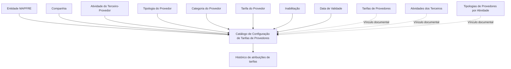

# Configuração de Tarifas de Provedores por Atividade, Tipologia e Categoria

## 1. Metadados do Documento
- **Arquivo de Origem:** Não informado
- **Tipo de Documento:** Especificação Funcional
- **Domínio / Sistema:** Reef / Mapfre — catálogo de configuração de tarifas de provedores
- **Público-Alvo:** Negócio, Analistas Funcionais, Operação e Desenvolvedores
- **Data/Versão Identificada:** Não identificada
- **Estado do documento identificado:** Approved Source
- **Owner identificado:** `user:agonzalez_mapfre.com`

---

## 2. Resumo Executivo & Contexto de Negócio

O documento descreve o catálogo de **Configuração de Tarifas de Provedores**, utilizado para codificar tarifas conforme três critérios: **Atividade**, **Tipologia** e **Categoria** do terceiro identificado como provedor. O núcleo do sistema disponibiliza um repositório específico para essa configuração.

O repositório de informação é entregue inicialmente vazio nas instalações. Portanto, a entidade MAPFRE é responsável por definir e carregar os registros de tarifa necessários à sua operação, utilizando os atributos disponibilizados pelo catálogo.

Cada registro de configuração associa uma companhia, uma atividade de terceiro-provedor, uma tipologia, uma categoria e uma tarifa. O catálogo também permite controlar a inabilitação de registros e a data a partir da qual uma configuração passa a estar operacional.

A propriedade **Fecha de Validez** suporta a manutenção de histórico das alterações de atribuição de tarifas ao longo do tempo. O documento não define regras de cálculo de tarifa, valores possíveis, contratos de integração, métodos HTTP, estruturas JSON ou procedimentos técnicos de carga.

Não existe uma recomendação corporativa definida para padronizar a codificação do catálogo. Contudo, o documento orienta que a entidade MAPFRE avalie a conveniência de utilizar o catálogo transversalmente nos processos da companhia, visando sua correta exploração posterior.

---

## 3. Arquitetura, Componentes & Tecnologias Envolvidas

O documento menciona o sistema/núcleo **Reef** e um repositório de informação específico para a configuração de tarifas de provedores. O catálogo depende conceitualmente de informações relacionadas a tarifas, atividades de terceiros e tipologias de provedores por atividade.

| Componente / Conceito | Papel identificado no documento | Detalhamento disponível |
| :--- | :--- | :--- |
| Reef | Sistema ou núcleo que contém a possibilidade de codificar tarifas de provedores. | O documento não detalha arquitetura técnica, tecnologia, APIs ou infraestrutura do Reef. |
| Catálogo de Configuração de Tarifas de Provedores | Repositório específico para definir tarifas por atividade, tipologia e categoria. | Entregue inicialmente sem conteúdo. |
| Tarifas de Provedores | Documento ou diretriz relacionada à configuração. | Citado como vínculo recomendado para leitura. |
| Atividades dos Terceiros | Informação relacionada à identificação da atividade de terceiros-provedores. | Citado como vínculo recomendado para leitura. |
| Tipologias de Provedores por Atividade | Informação relacionada à tipologia aplicável ao provedor conforme atividade. | Citado como vínculo recomendado para leitura. |
| MAPFRE | Entidade que deve avaliar a utilização transversal do catálogo em seus processos. | Não há detalhamento organizacional adicional. |



> **Nota de Análise:** O documento descreve relações funcionais entre atributos e documentos vinculados, mas não apresenta microsserviços, bancos de dados, integrações, protocolos, URLs, ambientes ou tecnologias de implementação.

---

## 4. Regras de Negócio, Especificações Funcionais & Processos

### 4.1 Objetivo funcional

O núcleo do sistema permite codificar as tarifas dos provedores com base em:

1. Atividade;
2. Tipologia;
3. Categoria.

A codificação ocorre em um repositório específico de informação destinado à configuração das tarifas de provedores.

### 4.2 Estado inicial do catálogo

- O repositório específico é entregue inicialmente vazio de conteúdo.
- O documento não especifica um catálogo inicial de tarifas, códigos, valores, formatos de carga ou responsáveis operacionais pela manutenção.
- A configuração deve ser definida conforme a necessidade da entidade MAPFRE.

### 4.3 Identificação do registro de tarifa

A definição funcional de uma tarifa de provedor utiliza os seguintes atributos:

1. **Companhia:** identifica o código da companhia para a qual a tarifa está sendo definida.
2. **Código de Atividade do Terceiro:** estabelece o código da atividade do terceiro-provedor, desde que a atividade do terceiro o identifique como provedor.
3. **Tipologia:** determina o código ou a chave do tipo de provedor configurado no catálogo.
4. **Categoria:** determina o código ou a chave do tipo de provedor configurado no catálogo, conforme o texto original.
5. **Tarifa:** determina o código ou a chave da tarifa de provedores configurada no catálogo.

> **Nota de Análise:** O documento utiliza a mesma descrição para os atributos **Tipologia** e **Categoria**, referindo-se em ambos os casos ao “código ou clave del Tipo de Proveedor”. Não há detalhamento adicional que permita inferir uma diferenciação funcional além dos nomes dos atributos.

### 4.4 Controle de vigência e inabilitação

- **Inabilitação:** estabelece que o registro configurado está desativado ou inabilitado.
- **Data de Validade:** indica a data a partir da qual o registro está operacional no sistema.
- A utilização correta da data de validade permite manter histórico das alterações realizadas na atribuição de tarifas ao longo do tempo.

### 4.5 Diretriz de codificação

- Não existe preferência ou recomendação para estabelecer ou padronizar a codificação no sistema.
- A entidade MAPFRE deve analisar a conveniência de utilizar transversalmente esse catálogo de informação nos processos da companhia.
- A finalidade da utilização transversal é viabilizar a correta exploração posterior das informações do catálogo.

### 4.6 Documentação relacionada

O documento recomenda a leitura das seguintes diretrizes e documentos funcionais para evitar interpretações isoladas e incorretas:

1. Tarifas de Provedores;
2. Atividades dos Terceiros;
3. Tipologias de Provedores por Atividade.

---

## 5. Tabelas de Parâmetros, Ambientes e Estruturas de Dados

| Item / Parâmetro | Descrição / Função | Tipo / Valores / Formato | Ambiente / Observações |
| :--- | :--- | :--- | :--- |
| Companhia | Código da companhia sobre a qual é realizada a definição da tarifa. | Código; formato não especificado. | Aplicável à configuração de tarifa. |
| Código de Atividade do Terceiro | Código da atividade do terceiro-provedor. | Código; formato não especificado. | Aplicável quando a atividade do terceiro o identifica como provedor. |
| Tipologia | Código ou chave do tipo de provedor configurado no catálogo. | Código ou chave; valores não especificados. | Não há lista de tipologias no documento. |
| Categoria | Código ou chave do tipo de provedor configurado no catálogo, conforme descrição original. | Código ou chave; valores não especificados. | O documento não diferencia funcionalmente categoria de tipologia. |
| Tarifa | Código ou chave da tarifa de provedores configurada no catálogo. | Código ou chave; valores não especificados. | Não há fórmula, valor monetário ou regra de cálculo descrita. |
| Inabilitação | Indica que o registro configurado está desativado ou inabilitado. | Indicador; representação técnica não especificada. | Afeta a disponibilidade operacional do registro. |
| Data de Validade | Indica a data a partir da qual o registro fica operativo no sistema. | Data; formato não especificado. | Permite manter histórico de alterações na atribuição de tarifas. |
| Estado inicial do repositório | O repositório específico de tarifas é entregue vazio. | Sem conteúdo inicial. | Requer configuração posterior pela entidade usuária. |
| Codificação | Não há preferência ou recomendação para padronizar a codificação. | Não especificado. | MAPFRE deve avaliar o uso transversal do catálogo. |
| Ambiente / URL / Servidor | Não informado. | Não informado. | O documento não apresenta ambientes, servidores, URLs, portas ou rotas de log. |

---

## 6. Bateria de Perguntas & Respostas para RAG (FAQ Sintético)

### P1: Qual é o objetivo do catálogo de Configuração de Tarifas de Provedores?
**R:** O catálogo permite codificar tarifas de provedores em um repositório específico de informação, considerando a atividade, a tipologia e a categoria do terceiro identificado como provedor.

### P2: Quais atributos participam da configuração de uma tarifa de provedor?
**R:** A configuração utiliza os atributos Companhia, Código de Atividade do Terceiro, Tipologia, Categoria, Tarifa, Inabilitação e Data de Validade.

### P3: O repositório de tarifas de provedores possui conteúdo inicial quando é entregue?
**R:** Não. O documento informa que o repositório específico de informação é entregue inicialmente vazio de conteúdo.

### P4: Quando o Código de Atividade do Terceiro deve ser utilizado na configuração?
**R:** O Código de Atividade do Terceiro estabelece a atividade do terceiro-provedor e é aplicável desde que a atividade do terceiro o identifique como provedor.

### P5: Qual é a função do atributo Companhia no catálogo de tarifas?
**R:** O atributo Companhia contém o código da companhia sobre a qual está sendo realizada a definição da tarifa.

### P6: Como o catálogo trata registros que não devem permanecer ativos?
**R:** O atributo Inabilitação estabelece que o registro configurado está desativado ou inabilitado.

### P7: Para que serve a Data de Validade na configuração de tarifas?
**R:** A Data de Validade indica a data a partir da qual o registro fica operacional no sistema. Seu uso correto permite manter histórico das alterações feitas na atribuição de tarifas ao longo do tempo.

### P8: O documento define uma padronização obrigatória para a codificação das tarifas?
**R:** Não. O documento afirma que não existe preferência nem recomendação para estabelecer ou padronizar a codificação no sistema.

### P9: Qual responsabilidade é atribuída à entidade MAPFRE em relação ao catálogo?
**R:** A entidade MAPFRE deve analisar a conveniência de utilizar o catálogo de informação transversalmente nos processos da companhia, para permitir sua correta exploração posterior.

### P10: Quais documentos devem ser lidos para evitar interpretação isolada da configuração de tarifas?
**R:** O documento recomenda a leitura de “Tarifas de Provedores”, “Atividades dos Terceiros” e “Tipologias de Provedores por Atividade”.

### P11: O documento define valores de tarifa, fórmulas de cálculo ou moeda?
**R:** Não. O documento apenas informa que o atributo Tarifa determina o código ou a chave da tarifa configurada; não há valores, moedas, fórmulas ou regras de cálculo.

### P12: O documento descreve APIs, métodos HTTP ou contratos de integração para o catálogo?
**R:** Não. O conteúdo fornecido não detalha APIs, métodos HTTP, contratos JSON, endpoints, bancos de dados ou mecanismos de integração.

---

## 7. Glossário de Termos, Siglas & Conceitos-Chave

- **Reef:** Sistema ou núcleo citado como possuidor da funcionalidade de codificar tarifas de provedores.
- **MAPFRE:** Entidade mencionada como responsável por avaliar a utilização transversal do catálogo nos processos da companhia.
- **Provedor / Proveedor:** Terceiro cuja atividade o identifica como provedor e para o qual pode ser configurada uma tarifa.
- **Atividade do Terceiro:** Código de atividade associado ao terceiro-provedor.
- **Tipologia:** Código ou chave do tipo de provedor configurado no catálogo.
- **Categoria:** Atributo de configuração citado no catálogo; o documento não apresenta detalhamento que o diferencie funcionalmente da tipologia.
- **Tarifa:** Código ou chave da tarifa de provedores configurada no catálogo.
- **Inabilitação:** Propriedade que determina que um registro configurado está desativado ou inabilitado.
- **Data de Validade:** Data a partir da qual um registro passa a estar operacional no sistema.
- **Histórico:** Registro temporal das alterações realizadas na atribuição de tarifas, suportado pelo uso da Data de Validade.

---

## 8. Notas Críticas, Riscos & Limitações

- O repositório é entregue vazio, o que implica dependência de configuração inicial pela entidade responsável.
- Não existe padrão obrigatório de codificação; essa ausência pode gerar divergências entre processos caso a utilização transversal não seja governada pela entidade MAPFRE.
- O documento recomenda a leitura de documentos funcionais relacionados para evitar interpretação isolada e incorreta.
- Não há detalhamento de valores de tarifa, fórmulas de cálculo, moeda, critérios de elegibilidade, priorização entre registros ou resolução de conflitos entre configurações.
- Não há especificação técnica de APIs, integrações, contratos de dados, persistência, segurança, perfis de acesso, trilha de auditoria, URLs, servidores, ambientes ou logs.
- A descrição original de **Categoria** é igual à descrição de **Tipologia**; não é possível concluir, apenas com o documento, como esses atributos se diferenciam operacionalmente.
- O documento não informa o formato técnico da Data de Validade nem a representação do indicador de Inabilitação.
- **Nota de Análise:** O documento lista o catálogo de configuração e seus atributos, mas não detalha métodos de manutenção, telas, validações de unicidade, fluxos de aprovação ou contratos técnicos expostos pelo sistema.

---

## 9. Conteúdo Bruto Estruturado (Referência Fiel)

```text
--- [PÁGINA 1 DE 2] ---

CONFIGURACIÓN de las TARIFAS por Actividad, Tipología y Categoría
del PROVEEDOR
Objetivo
Funcionalmente, el núcleo del Sistema cuenta con la posibilidad de codicar las Tarifas de los Proveedores en función de su Actividad,
Tipología y Categoría en un repositorio de información especíco que se entrega inicialmente a las instalaciones vacío de contenido.
Propiedades
Otras Propiedades
Propiedades
Compañía
Este Atributo del catálogo contiene el código de la compañía sobre la que se está realizando la denición de la Tarifa.
Código de Actividad del Tercero
Esta propiedad establece en el sistema el código de la Actividad del Tercero-Proveedor siempre y cuando la Actividad del Tercero lo
identique como tal.
Tipología
Este Atributo determina el código o clave del Tipo de Proveedor que se está congurando en el catálogo.
Categoría
Este Atributo determina el código o clave del Tipo de Proveedor que se está congurando en el catálogo.
Tarifa
Este Atributo determina el código o clave de la Tarifa de los Proveedores que se está congurando en el catálogo.
Otras Propiedades
Inhabilitación
Esta propiedad establece que el Registro congurado está desactivado o inhabilitado.
Fecha de Validez
Documentation / DOCUMENTACIÓN Reef
DOCUMENTACIÓN Reef
Mapfredocument
DOCUMENTACIÓN Reef
Owner
user:agonzalez_mapfre.com
Lifecycle
Approved Source
 /
VL
Buscar Inicio Soluciones Arquitecturas APIs Componentes Cloud Documentación Zeus Reef Ayuda
ES

--- [PÁGINA 2 DE 2] ---

Esta propiedad le indica al Sistema la fecha a partir de la cual el registro está operativo en el sistema por lo que su correcto uso permite tener
un histórico de los cambios efectuados en la asignación de las Tarifas a lo largo del tiempo.
Vínculos
Relación de Directrices y Documentos funcionales cuya lectura recomendada para evitar que la interpretación aislada del presente
documento pueda conducir a error.
Tarifas de Proveedores
Actividades de los Terceros
Tipologías de Proveedores por Actividad
Preguntas frecuentes
(1) ¿Existe alguna recomendación operativa que deba ser tomada en consideración localmente en la codicación, uso y denición del
catálogo de Conguración de Tarifas de los Proveedores?
No existe una preferencia ni recomendación para establecer o estandarizar en el sistema su codicación, si bien la entidad MAPFRE debe
analizar la conveniencia de utilizar transversalmente en los procesos de la compañía este catálogo de información para su correcta y
posterior explotación.
```
