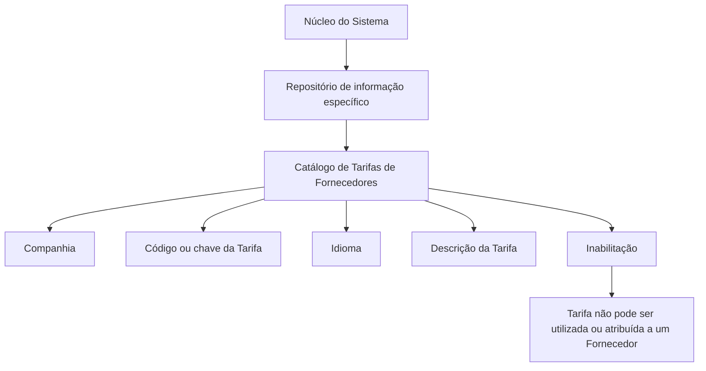

# Definição de Tarifas de Fornecedores — Catálogo do Sistema REEF

## 1. Metadados do Documento
- **Arquivo de Origem:** Não identificado no conteúdo extraído
- **Tipo de Documento:** Especificação Funcional
- **Domínio / Sistema:** REEF / MAPFRE — Catálogo de Tarifas de Fornecedores
- **Público-Alvo:** Negócio, analistas funcionais, operação e desenvolvedores
- **Data/Versão Identificada:** Não identificada

---

## 2. Resumo Executivo & Contexto de Negócio

O documento descreve a funcionalidade de definição e codificação de Tarifas de Fornecedores no núcleo do sistema. As tarifas são mantidas em um repositório de informação específico, entregue inicialmente às instalações sem conteúdo cadastrado.

O catálogo de Tarifas de Fornecedores permite configurar códigos ou chaves de tarifa associados a uma companhia e a um idioma. Cada definição possui uma denominação ou descrição localizada conforme o idioma adotado na configuração.

A definição também contempla uma propriedade de inabilitação. Essa propriedade determina que um código de tarifa esteja desativado e, portanto, indisponível para utilização ou atribuição a um fornecedor.

O documento não estabelece um padrão obrigatório para a codificação das tarifas. A entidade MAPFRE deve avaliar a conveniência de utilizar transversalmente esse catálogo nos processos corporativos, visando sua exploração posterior adequada.

---

## 3. Arquitetura, Componentes & Tecnologias Envolvidas

O conteúdo descreve um catálogo funcional mantido no núcleo do sistema, sem detalhar arquitetura técnica, APIs, métodos HTTP, banco de dados, integrações, tecnologias de implementação ou ambientes.

Os elementos funcionais explicitamente identificados são:

- Núcleo do Sistema;
- Repositório específico de informação;
- Catálogo de Tarifas de Fornecedores;
- Companhia;
- Tarifa;
- Idioma;
- Descrição da Tarifa;
- Provedor/Fornecedor;
- Propriedade de Inabilitação;
- Documento relacionado: **Tarifa por Atividade, Tipologia e Categoria**.



> **Nota de Análise:** O documento não detalha persistência de dados, interfaces de manutenção, permissões, contratos de integração, métodos HTTP, formatos JSON ou fluxos técnicos entre sistemas.

---

## 4. Regras de Negócio, Especificações Funcionais & Processos

1. O núcleo do sistema permite codificar Tarifas de Fornecedores.
2. As Tarifas de Fornecedores são registradas em um repositório específico de informação.
3. O repositório de Tarifas de Fornecedores é entregue inicialmente às instalações sem conteúdo.
4. Cada definição de tarifa deve identificar a companhia sobre a qual a tarifa está sendo definida.
5. Cada tarifa possui um código ou chave de configuração no catálogo.
6. Cada configuração de tarifa possui uma chave de idioma.
7. O idioma é utilizado para configurar a denominação ou descrição da tarifa.
8. A descrição da tarifa deve corresponder ao idioma utilizado na definição.
9. A propriedade **Inabilitação** determina que o código de tarifa esteja desativado.
10. Uma tarifa inabilitada não pode ser utilizada nem atribuída a um fornecedor.
11. Não existe preferência ou recomendação documentada para padronizar a codificação das tarifas no sistema.
12. A entidade MAPFRE deve avaliar a conveniência de utilizar o catálogo transversalmente nos processos corporativos.
13. O uso transversal do catálogo é indicado como fator para sua correta exploração posterior.
14. A leitura do documento relacionado **Tarifa por Atividade, Tipologia e Categoria** é recomendada para evitar interpretações incorretas decorrentes da leitura isolada desta documentação.

---

## 5. Tabelas de Parâmetros, Ambientes e Estruturas de Dados

| Item / Parâmetro | Descrição / Função | Tipo / Valores / Formato | Ambiente / Observações |
| :--- | :--- | :--- | :--- |
| Companhia | Código da companhia sobre a qual a definição da Tarifa de Fornecedores é realizada. | Código de companhia; formato não especificado. | Aplicável ao catálogo de Tarifas de Fornecedores. |
| Tarifa | Código ou chave da Tarifa de Fornecedores configurada no catálogo. | Código ou chave; formato não especificado. | Não há recomendação ou padronização obrigatória de codificação documentada. |
| Idioma | Chave do idioma empregado na configuração das Tarifas de Fornecedores. | Exemplos citados: espanhol, inglês, turco. | Determina o idioma da descrição da tarifa. |
| Descrição da Tarifa | Denominação ou descrição da tarifa conforme o idioma usado na definição. | Texto localizado por idioma. | Exemplos documentados em espanhol. |
| Inabilitação | Indica que o código de tarifa está desativado ou inabilitado. | Estado de inabilitação; valores não especificados. | Uma tarifa inabilitada não pode ser utilizada ou atribuída a um fornecedor. |
| Repositório de informação | Repositório específico onde as tarifas são codificadas. | Não especificado. | Entregue inicialmente às instalações vazio de conteúdo. |
| Documento relacionado | Tarifa por Atividade, Tipologia e Categoria. | Referência funcional. | Leitura recomendada para evitar interpretação isolada incorreta. |

### Exemplos de descrições de tarifas

| Tarifa | Descrição |
| :--- | :--- |
| 1 | TARIFA TALLERES ESTÁNDAR |
| 2 | TARIFA TALLERES PREMIUM |
| 3 | TARIFA TALLERES EMBAJADORES |
| A | TARIFA GRÚAS |

---

## 6. Bateria de Perguntas & Respostas para RAG (FAQ Sintético)

### P1: Qual é a finalidade do catálogo de Tarifas de Fornecedores?
**R:** O catálogo de Tarifas de Fornecedores permite ao núcleo do sistema codificar e manter tarifas em um repositório específico de informação. O repositório é entregue inicialmente às instalações sem conteúdo cadastrado.

### P2: Qual atributo identifica a companhia associada a uma tarifa?
**R:** O atributo **Companhia** contém o código da companhia sobre a qual está sendo realizada a definição da Tarifa de Fornecedores.

### P3: Como uma tarifa é identificada no catálogo?
**R:** A propriedade **Tarifa** determina o código ou a chave da Tarifa de Fornecedores configurada no catálogo. O documento não define formato, tamanho ou padrão obrigatório para esse código.

### P4: Para que serve o atributo Idioma na configuração de tarifas?
**R:** O atributo **Idioma** representa a chave do idioma empregada na configuração das Tarifas de Fornecedores. O documento cita espanhol, inglês e turco como exemplos de idiomas possíveis.

### P5: Como a descrição de uma tarifa deve ser mantida?
**R:** A propriedade **Descrição da Tarifa** contém a denominação ou descrição da tarifa de acordo com o idioma utilizado na definição. Portanto, a descrição é associada ao idioma configurado para a tarifa.

### P6: O que acontece quando uma tarifa está inabilitada?
**R:** A propriedade **Inabilitação** estabelece que o código da tarifa está desativado ou inabilitado. Uma tarifa nessa condição não pode ser utilizada nem atribuída a um fornecedor.

### P7: Existe um padrão obrigatório para codificar Tarifas de Fornecedores?
**R:** Não. O documento informa que não existe preferência nem recomendação para estabelecer ou padronizar a codificação no sistema.

### P8: Qual responsabilidade a entidade MAPFRE possui em relação ao catálogo?
**R:** A entidade MAPFRE deve analisar a conveniência de utilizar transversalmente o catálogo de Tarifas de Fornecedores nos processos da companhia, para assegurar sua correta exploração posterior.

### P9: Quais exemplos de tarifas são apresentados no documento?
**R:** O documento apresenta os exemplos: código `1` para `TARIFA TALLERES ESTÁNDAR`, código `2` para `TARIFA TALLERES PREMIUM`, código `3` para `TARIFA TALLERES EMBAJADORES` e código `A` para `TARIFA GRÚAS`.

### P10: Qual documento relacionado deve ser consultado para complementar a interpretação?
**R:** O documento recomenda a leitura de **Tarifa por Atividade, Tipologia e Categoria**, pois a interpretação isolada da documentação de Tarifas de Fornecedores pode conduzir a erro.

---

## 7. Glossário de Termos, Siglas & Conceitos-Chave

- **Catálogo de Tarifas de Fornecedores:** Repositório de informação destinado à codificação e definição das tarifas aplicáveis a fornecedores.
- **Companhia:** Código da companhia sobre a qual uma definição de tarifa é realizada.
- **Descrição da Tarifa:** Denominação textual da tarifa, mantida conforme o idioma da definição.
- **Idioma:** Chave do idioma utilizada na configuração e descrição das Tarifas de Fornecedores.
- **Inabilitação:** Propriedade que estabelece que um código de tarifa esteja desativado e não possa ser utilizado ou atribuído a um fornecedor.
- **MAPFRE:** Entidade mencionada como responsável por avaliar o uso transversal do catálogo nos processos da companhia.
- **REEF:** Nome presente na identificação da documentação; o conteúdo não expande a sigla nem descreve tecnicamente a plataforma.
- **Tarifa:** Código ou chave configurada no catálogo de Tarifas de Fornecedores.
- **Fornecedor / Provedor:** Entidade à qual uma tarifa pode ser atribuída quando não estiver inabilitada.

---

## 8. Notas Críticas, Riscos & Limitações

- O repositório de Tarifas de Fornecedores é entregue inicialmente vazio; o documento não descreve processo de carga inicial, migração ou governança de cadastro.
- Não há padrão obrigatório para codificação de tarifas, o que pode produzir heterogeneidade de códigos entre processos caso a entidade MAPFRE não defina convenções internas.
- A inabilitação impede uso e atribuição de uma tarifa a fornecedores, mas o documento não detalha o comportamento para tarifas já atribuídas antes da inabilitação.
- O documento não especifica permissões de manutenção, trilha de auditoria, validações de unicidade, integrações, APIs, banco de dados ou fluxos de aprovação.
- A leitura isolada do documento pode causar erro de interpretação; a documentação relacionada **Tarifa por Atividade, Tipologia e Categoria** é expressamente recomendada.
- **Nota de Análise:** O texto extraído contém caracteres possivelmente afetados por codificação, como `codicar`, `denición` e `conguración`. O conteúdo semântico foi preservado sem inferir termos adicionais.

---

## 9. Conteúdo Bruto Estruturado (Referência Fiel)

```text
--- [PÁGINA 1 DE 2] ---

DEFINICIÓN de TARIFAS de PROVEEDORES
Objetivo
Funcionalmente, el núcleo del Sistema cuenta con la posibilidad de codicar las Tarifas de los Proveedores en un repositorio de información
especíco que se entrega inicialmente a las instalaciones vacío de contenido.
Propiedades
Otras Propiedades
Propiedades
Compañía
Este Atributo del catálogo contiene el código de la compañía sobre la que se está realizando la denición de la Tarifa de los Proveedores.
Tarifa
Este Atributo determina el código o clave de la Tarifa de los Proveedores que se está congurando en el catálogo.
Idioma
Esta propiedad es la clave del Idioma empleado en la conguración de las Tarifas de los Proveedores como por ejemplo: español, inglés,
turco, ...
Descripción de la Tarifa
Esta propiedad contiene la denominación o descripción de la Tarifa de acuerdo con el idioma utilizado en la denición.
A modo de ejemplo y si el idioma de la denición es el español...
TARIFA DESCRIPCIÓN
1 TARIFA TALLERES ESTÁNDAR
2 TARIFA TALLERES PREMIUM
3 TARIFA TALLERES EMBAJADORES
A TARIFA GRÚAS
Documentation / DOCUMENTACIÓN Reef
DOCUMENTACIÓN Reef
Mapfredocument
DOCUMENTACIÓN Reef
Owner
user:agonzalez_mapfre.com
Lifecycle
Approved Source
 / 
 VL
Buscar Inicio Soluciones Arquitecturas APIs Componentes Cloud Documentación Zeus Reef Ayuda
ES


--- [PÁGINA 2 DE 2] ---

Otras Propiedades
Inhabilitación
Esta propiedad establece que el Código de la Tarifa está desactivada o inhabilitada para poder ser utilizada y asignada a un Proveedor.
Vínculos
Relación de Directrices y Documentos funcionales cuya lectura recomendada para evitar que la interpretación aislada del presente
documento pueda conducir a error.
Tarifa por Actividad, Tipología y Categoría
Preguntas frecuentes
(1) ¿Existe alguna recomendación operativa que deba ser tomada en consideración localmente en la codicación, uso y denición del
catálogo de Tarifas de los Proveedores?
No existe una preferencia ni recomendación para establecer o estandarizar en el sistema su codicación, si bien la entidad MAPFRE debe
analizar la conveniencia de utilizar transversalmente en los procesos de la compañía este catálogo de información para su correcta y
posterior explotación.
```
