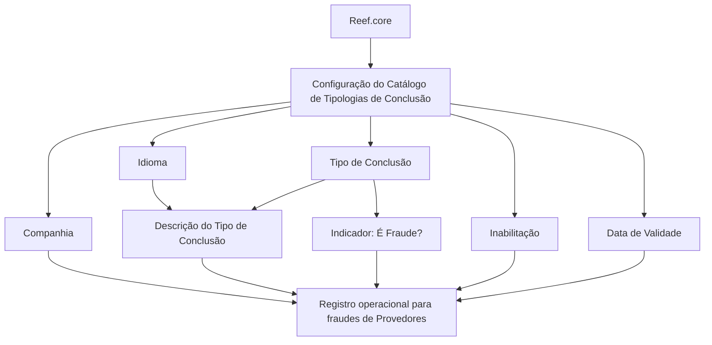

# Definição de Tipologias de Conclusão de Fraudes para Provedores

## 1. Metadados do Documento
- **Arquivo de Origem:** Não identificado no conteúdo extraído
- **Tipo de Documento:** Especificação Funcional
- **Domínio / Sistema:** Reef / Reef.core — catálogo de Tipologias de Conclusão de Fraudes para Provedores
- **Público-Alvo:** Negócio, analistas funcionais, equipes de configuração e operação
- **Data/Versão Identificada:** Não identificada
- **Owner identificado:** `user:agonzalez_mapfre.com`
- **Lifecycle identificado:** `Approved`
- **Fonte identificada:** `Mapfredocument`

---

## 2. Resumo Executivo & Contexto de Negócio

O documento define o catálogo de **Tipologias de Conclusão de Fraudes** aplicável a fraudes cometidas por Provedores. Funcionalmente, o núcleo do sistema permite codificar os tipos de conclusão de fraude em um repositório de informação específico.

A configuração do catálogo é contextualizada por companhia e idioma. Cada tipo de conclusão possui uma chave ou código, uma descrição associada ao idioma utilizado e uma indicação que qualifica o tipo como fraudulento.

O catálogo também possui propriedades operacionais para controlar a disponibilidade e a vigência temporal dos registros. A propriedade de inabilitação permite desativar um registro configurado, enquanto a data de validade determina a partir de quando um registro está operacional no sistema e viabiliza o histórico de alterações ao longo do tempo.

O documento reforça que a configuração local deve respeitar a configuração realizada a partir de **Reef.core**. Além disso, recomenda a leitura de diretrizes e documentos funcionais relacionados, pois a interpretação isolada deste documento pode conduzir a erros.

---

## 3. Arquitetura, Componentes & Tecnologias Envolvidas

### Componentes e conceitos identificados

| Componente / Conceito | Papel identificado no documento |
| :--- | :--- |
| **Sistema núcleo** | Possui a capacidade funcional de codificar os tipos de conclusão de fraude em um repositório de informação específico. |
| **Catálogo de Tipologias de Conclusão** | Repositório de configuração dos tipos de conclusão de fraudes para Provedores. |
| **Reef.core** | Origem cuja configuração deve ser respeitada na codificação, no uso e na definição local do catálogo. |
| **Provedores** | Contexto de aplicação dos tipos de conclusão de fraudes descritos no documento. |
| **Companhia** | Atributo que identifica o código da companhia para a qual ocorre a definição dos tipos de conclusão. |
| **Idioma** | Propriedade que identifica o idioma usado na configuração dos tipos de conclusão. |
| **Mapfredocument** | Fonte identificada na extração documental. |

### Fluxo lógico de configuração identificado



> **Nota de Análise:** O documento não detalha arquitetura de software, tecnologias de implementação, APIs, métodos HTTP, contratos JSON, bases de dados, servidores, URLs ou integrações técnicas além da referência à configuração originada em `Reef.core`.

---

## 4. Regras de Negócio, Especificações Funcionais & Processos

### 4.1 Objetivo funcional

O núcleo do sistema possui a possibilidade de codificar os Tipos de Conclusão dos Fraudes em um repositório de informação específico.

### 4.2 Definição por companhia

O atributo **Companhia** contém o código da companhia sobre a qual está sendo realizada a definição dos tipos de conclusão.

**Regra identificada:** a configuração de um tipo de conclusão deve estar associada ao código da companhia correspondente.

### 4.3 Definição por idioma

A propriedade **Idioma** contém a chave do idioma empregada na configuração dos tipos de conclusão das fraudes cometidas por Provedores.

Exemplos de idiomas citados:
- Espanhol
- Inglês
- Português

**Regra identificada:** a descrição do tipo de conclusão deve ser interpretada conforme o idioma utilizado em sua definição.

### 4.4 Código do tipo de conclusão

O atributo **Tipo de Conclusão** contém a chave ou o código do tipo de conclusão da fraude.

Exemplos apresentados:
- `ACP`
- `RJT`

### 4.5 Descrição do tipo de conclusão

O atributo **Descrição do Tipo de Conclusão** identifica a descrição do tipo de conclusão de acordo com o idioma utilizado em sua definição.

Exemplo apresentado para o idioma espanhol:

| Tipo | Descrição |
| :--- | :--- |
| `ACP` | Procedente |
| `RJT` | Rechazado |

### 4.6 Qualificação como fraude

A propriedade **¿Es Fraude? / É Fraude?** qualifica e identifica o tipo de conclusão como um tipo fraudulento.

**Regra identificada:** o catálogo deve conter uma propriedade que determine se o tipo de conclusão é fraudulento.

> **Nota de Análise:** O documento não informa os valores possíveis, o formato técnico ou a regra de preenchimento da propriedade **É Fraude**.

### 4.7 Inabilitação de registros

A propriedade **Inhabilitación / Inabilitação** estabelece que o registro configurado está desativado ou inabilitado para utilização.

**Regra identificada:** um registro marcado como inabilitado não deve ser utilizado.

### 4.8 Vigência e histórico

A propriedade **Fecha de Validez / Data de Validade** informa ao sistema a data a partir da qual o registro configurado está operacional.

O uso correto da data de validade permite manter um histórico das alterações realizadas ao longo do tempo.

**Regras identificadas:**
1. Um registro somente se torna operacional a partir da data de validade configurada.
2. A data de validade deve ser utilizada para manter histórico de mudanças no catálogo.

### 4.9 Governança de configuração

A pergunta frequente apresentada no documento estabelece a recomendação operacional para configuração local:

> Deve-se respeitar a configuração realizada desde Reef.core.

**Regra de governança:** a codificação, o uso e a definição local do catálogo de Tipologias de Conclusão de Fraudes para Provedores devem respeitar a configuração realizada em `Reef.core`.

---

## 5. Tabelas de Parâmetros, Ambientes e Estruturas de Dados

### 5.1 Atributos do catálogo

| Item / Parâmetro | Descrição / Função | Tipo / Valores / Formato | Ambiente / Observações |
| :--- | :--- | :--- | :--- |
| Companhia | Contém o código da companhia sobre a qual é realizada a definição dos tipos de conclusão. | Código de companhia; formato não detalhado. | Aplicável à configuração do catálogo. |
| Idioma | Contém a chave do idioma empregado na configuração dos tipos de conclusão de fraudes cometidas por Provedores. | Chave de idioma; exemplos: espanhol, inglês e português. | Determina o idioma da descrição do tipo de conclusão. |
| Tipo de Conclusão | Contém a chave ou o código do tipo de conclusão da fraude. | Código; exemplos: `ACP`, `RJT`. | Aplicável a fraudes de Provedores. |
| Descrição do Tipo de Conclusão | Identifica a descrição do tipo de conclusão de acordo com o idioma usado em sua definição. | Texto; idioma dependente. | Exemplo em espanhol: `ACP = Procedente`; `RJT = Rechazado`. |
| É Fraude? | Qualifica e identifica o tipo de conclusão como tipo fraudulento. | Valores não detalhados. | O documento não especifica o formato nem os valores permitidos. |
| Inabilitação | Estabelece que o registro configurado está desativado ou inabilitado para uso. | Valores não detalhados. | Registro inabilitado não deve ser utilizado. |
| Data de Validade | Informa a data a partir da qual o registro configurado está operacional no sistema. | Data; formato não detalhado. | Permite manter histórico de alterações ao longo do tempo. |

### 5.2 Exemplos de códigos e descrições

| Código de Tipo de Conclusão | Descrição apresentada | Idioma do exemplo | Observações |
| :--- | :--- | :--- | :--- |
| `ACP` | Procedente | Espanhol | Exemplo fornecido pelo documento. |
| `RJT` | Rechazado | Espanhol | Exemplo fornecido pelo documento. |

### 5.3 Ambientes, servidores, URLs e logs

| Item / Parâmetro | Descrição / Função | Tipo / Valores / Formato | Ambiente / Observações |
| :--- | :--- | :--- | :--- |
| Reef.core | Origem da configuração que deve ser respeitada localmente. | Sistema/componente citado. | Não há URL, ambiente, servidor ou mecanismo de integração detalhado. |
| Logs | Não detalhados. | Não informado. | O documento não apresenta rotas, níveis, arquivos ou políticas de logs. |
| Ambientes | Não detalhados. | Não informado. | O documento não diferencia desenvolvimento, homologação ou produção. |

---

## 6. Bateria de Perguntas & Respostas para RAG (FAQ Sintético)

### P1: Qual é o objetivo do catálogo de Tipologias de Conclusão de Fraudes?
**R:** O catálogo permite ao núcleo do sistema codificar os tipos de conclusão de fraudes em um repositório de informação específico. O documento aplica essa configuração ao contexto de fraudes cometidas por Provedores.

### P2: Como a companhia participa da configuração de um tipo de conclusão de fraude?
**R:** O atributo Companhia contém o código da companhia sobre a qual a definição dos tipos de conclusão está sendo realizada. Portanto, a configuração do catálogo é contextualizada pelo código da companhia.

### P3: Para que serve a propriedade Idioma no catálogo de conclusões de fraude?
**R:** A propriedade Idioma contém a chave do idioma empregada na configuração dos tipos de conclusão das fraudes cometidas por Provedores. A descrição do tipo de conclusão é identificada de acordo com o idioma usado em sua definição.

### P4: Quais exemplos de tipos de conclusão são apresentados no documento?
**R:** O documento apresenta, como exemplo em espanhol, o código `ACP` com a descrição `Procedente` e o código `RJT` com a descrição `Rechazado`.

### P5: O que representa o atributo Tipo de Conclusão?
**R:** O atributo Tipo de Conclusão contém a chave ou o código do tipo de conclusão da fraude. Os exemplos apresentados são `ACP` e `RJT`.

### P6: Qual é a finalidade da propriedade É Fraude?
**R:** A propriedade É Fraude qualifica e identifica o tipo de conclusão como um tipo fraudulento. O documento não detalha quais valores podem ser utilizados nessa propriedade nem seu formato técnico.

### P7: O que acontece quando um registro do catálogo é inabilitado?
**R:** A propriedade Inabilitação estabelece que o registro configurado está desativado ou inabilitado para utilização. Assim, um registro configurado como inabilitado não deve ser utilizado.

### P8: Como a Data de Validade afeta um registro de conclusão de fraude?
**R:** A Data de Validade informa ao sistema a data a partir da qual o registro configurado está operacional. O uso correto dessa propriedade permite manter um histórico das alterações efetuadas ao longo do tempo.

### P9: Qual recomendação operacional deve ser seguida na configuração local do catálogo?
**R:** A recomendação explícita é respeitar a configuração realizada desde `Reef.core` na codificação, no uso e na definição do catálogo de Tipologias de Conclusão de Fraudes para Provedores.

### P10: O documento informa APIs, métodos HTTP ou contratos de integração para o catálogo?
**R:** Não. O documento descreve propriedades funcionais do catálogo e cita `Reef.core` como referência de configuração, mas não detalha APIs, métodos HTTP, contratos JSON, URLs, portas, servidores ou mecanismos técnicos de integração.

---

## 7. Glossário de Termos, Siglas & Conceitos-Chave

- **ACP:** Código de Tipo de Conclusão apresentado no exemplo; a descrição associada em espanhol é `Procedente`.
- **RJT:** Código de Tipo de Conclusão apresentado no exemplo; a descrição associada em espanhol é `Rechazado`.
- **Companhia:** Atributo que contém o código da companhia para a qual se define o tipo de conclusão.
- **Data de Validade:** Propriedade que determina desde quando um registro configurado está operacional e permite a manutenção de histórico.
- **É Fraude?:** Propriedade que qualifica e identifica um tipo de conclusão como fraudulento.
- **Inabilitação:** Propriedade que determina que um registro configurado está desativado ou não pode ser utilizado.
- **Reef.core:** Componente ou origem de configuração cuja definição deve ser respeitada na configuração local.
- **Tipo de Conclusão:** Chave ou código que identifica a conclusão de uma fraude.
- **Tipologias de Conclusão de Fraudes:** Catálogo de configurações que classifica conclusões de fraudes para Provedores.

---

## 8. Notas Críticas, Riscos & Limitações

- A configuração local do catálogo deve respeitar a configuração realizada em `Reef.core`; ignorar essa diretriz pode gerar inconsistência de codificação, uso ou definição.
- O documento recomenda a leitura das diretrizes e dos documentos funcionais vinculados, pois sua interpretação isolada pode conduzir a erro.
- Não foram identificados detalhes sobre APIs, contratos de dados, métodos HTTP, autenticação, integrações, tecnologias, servidores, portas, URLs ou ambientes.
- Não foram apresentados valores permitidos, obrigatoriedade, formato ou comportamento de persistência para a propriedade **É Fraude**.
- Não foram apresentados valores permitidos ou comportamento detalhado da propriedade **Inabilitação**.
- O formato da **Data de Validade**, eventuais regras de sobreposição de vigências e critérios de histórico não são detalhados.
- Não há detalhamento adicional sobre os Provedores, além de serem o contexto das fraudes configuradas no catálogo.

---

## 9. Conteúdo Bruto Estruturado (Referência Fiel)

```text
--- [PÁGINA 1 DE 2] ---

DEFINICIÓN de TIPOLOGÍAS de CONCLUSIÓN de FRAUDES
Objetivo
Funcionalmente, el núcleo del Sistema cuenta con la posibilidad de codicar los Tipos de Conclusión de los Fraudes en un repositorio de
información especíco.
Propiedades Operativas
Otras Propiedades
Propiedades Operativas
Compañía
Este Atributo del catálogo contiene el código de la compañía sobre la que se está realizando la denición de los tipos de Conclusión.
Idioma
Esta propiedad contiene la clave del Idioma empleado en la conguración de los tipos de conclusión de los fraudes cometidos por los
Proveedores como por ejemplo: español, inglés, Portugués, ...
Tipo de Conclusión
Este Atributo contiene la clave o el código del tipo de conclusión del Fraude.
Descripción del Tipo de Conclusión
Este Atributo del catálogo de conguración identica la descripción del tipo de conclusión de acuerdo con el idioma utilizado en su denición.
A modo de ejemplo y si el idioma empleado en la denición fuera el Español...
TIPO DESCRIPCIÓN
ACP Procedente
RJT Rechazado
... ...
¿Es Fraude?
Documentation / DOCUMENTACIÓN Reef
DOCUMENTACIÓN Reef
Mapfredocument
DOCUMENTACIÓN Reef
Owner
user:agonzalez_mapfre.com
Lifecycle
Approved Source
 / 
 VL
Buscar Inicio Soluciones Arquitecturas APIs Componentes Cloud Documentación Zeus Reef Ayuda
ES


--- [PÁGINA 2 DE 2] ---

Esta propiedad del catálogo calica e identica al tipo de conclusión como Tipo Fraudulento.
Otras Propiedades
Inhabilitación
Esta propiedad establece que el Registro congurado está desactivado o inhabilitado para ser utilizado.
Fecha de Validez
Esta propiedad le indica al Sistema la fecha a partir de la cual el registro congurado está operativo en el sistema por lo que su correcto uso
permite tener un histórico de los cambios efectuados a lo largo del tiempo.
Vínculos
Relación de Directrices y Documentos funcionales cuya lectura recomendada para evitar que la interpretación aislada del presente
documento pueda conducir a error.
Proveedores
Preguntas frecuentes
(1) ¿Existe alguna recomendación operativa que deba ser tomada en consideración localmente en la codicación, uso y denición del
catálogo de Tipologías de Conclusión de los Fraudes para los Proveedores?
Se debe respetar la conguración realizada desde Reef.core
```
