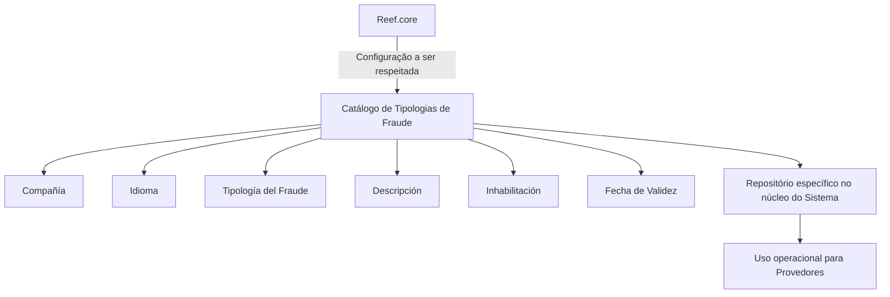

# Definição das Tipologias de Fraudes para Provedores no Reef

## 1. Metadados do Documento
- **Arquivo de Origem:** Não identificado no conteúdo fornecido
- **Tipo de Documento:** Especificação Funcional
- **Domínio / Sistema:** Reef / Reef.core / Provedores / Fraudes
- **Público-Alvo:** Negócio, Analistas Funcionais, Desenvolvedores e Operação
- **Data/Versão Identificada:** Não identificada
- **Owner identificado:** `user:agonzalez_mapfre.com`
- **Lifecycle identificado:** `Approved Source`

---

## 2. Resumo Executivo & Contexto de Negócio

O documento define o catálogo de configuração das **Tipologias de Fraudes cometidas por Provedores** no sistema Reef. Funcionalmente, o núcleo do sistema permite configurar essas tipologias em um repositório de informação específico.

A configuração de cada tipologia é contextualizada por companhia e idioma. O atributo **Compañía** identifica o código da companhia à qual a definição de taxonomia de fraudes se aplica, enquanto **Idioma** define a chave do idioma usada para configurar e descrever a tipologia.

Cada registro possui uma chave de tipologia, uma descrição localizada, um indicador de inabilitação e uma data de validade. Esses atributos permitem identificar a categoria de fraude, controlar se o registro está disponível para uso e determinar a partir de quando a configuração é operacional.

O documento apresenta exemplos de motivos e descrições de fraude, incluindo fraude não confirmada, fraude confirmada, fraude parcial, fraude identificada sem provas, pagamento ex-gratia e pagamento a critério. A recomendação operacional explícita é respeitar a configuração realizada a partir de **Reef.core**.

---

## 3. Arquitetura, Componentes & Tecnologias Envolvidas

### Componentes e conceitos identificados

| Componente / Conceito | Papel identificado no documento |
| :--- | :--- |
| Reef | Sistema no qual existe o repositório específico de configuração das tipologias de fraude. |
| Reef.core | Origem cuja configuração deve ser respeitada na codificação, uso e definição do catálogo. |
| Núcleo do Sistema | Componente funcional que permite configurar tipologias de fraude. |
| Repositório de informação específico | Local lógico utilizado para configurar as tipologias de fraudes. |
| Catálogo de configuração | Estrutura que contém companhia, idioma, tipologia, descrição, inabilitação e data de validade. |
| Provedores | Entidade para a qual são configuradas as tipologias de fraudes. |
| Documentação Reef | Área documental referenciada no conteúdo extraído. |
| Mapfredocument | Termo identificado no cabeçalho da documentação extraída. |



**Nota de Análise:** O conteúdo não detalha tecnologias de implementação, métodos HTTP, contratos JSON, banco de dados, URLs, ambientes ou integrações técnicas entre serviços.

---

## 4. Regras de Negócio, Especificações Funcionais & Processos

### Configuração do catálogo de tipologias de fraude

1. O núcleo do sistema possui a possibilidade funcional de configurar tipologias de fraudes.
2. As tipologias de fraudes são configuradas em um repositório de informação específico.
3. A definição da taxonomia de fraudes deve ser associada a uma companhia por meio do atributo **Compañía**.
4. A configuração deve conter a chave do idioma empregado na definição das tipologias de fraudes.
5. A chave ou o código da tipologia de fraude deve ser informado no campo **Tipología del Fraude**.
6. A descrição da tipologia deve ser definida de acordo com o idioma utilizado em sua definição.
7. Um registro configurado pode ser desativado ou inabilitado por meio da propriedade **Inhabilitación**.
8. A propriedade **Fecha de Validez** informa a data a partir da qual o registro configurado se torna operacional no sistema.
9. O uso correto da data de validade permite manter histórico das alterações realizadas ao longo do tempo.
10. A codificação, o uso e a definição local do catálogo de tipologias de fraude para provedores devem respeitar a configuração realizada a partir de **Reef.core**.

### Exemplos de tipologias de fraude e motivos apresentados

| Motivo | Descrição |
| :--- | :--- |
| FNC | Fraude no Confirmado |
| FRC | Fraude Confirmado |
| FRP | Fraude Parcial |
| FWE | Fraude Identificado sin Pruebas |
| PEG | Pago Ex-Gratia |
| POC | Pago a Criterio |

### Vínculos e leitura recomendada

O documento menciona uma relação de diretrizes e documentos funcionais cuja leitura é recomendada para evitar interpretações incorretas decorrentes da análise isolada deste material. Os itens identificados são:

- Proveedores
- Preguntas frecuentes

**Nota de Análise:** O conteúdo extraído não apresenta os documentos vinculados completos, nem detalha os procedimentos de manutenção, aprovação, publicação ou exclusão de registros do catálogo.

---

## 5. Tabelas de Parâmetros, Ambientes e Estruturas de Dados

| Item / Parâmetro | Descrição / Função | Tipo / Valores / Formato | Ambiente / Observações |
| :--- | :--- | :--- | :--- |
| Compañía | Contém o código da companhia sobre a qual está sendo realizada a definição da taxonomia de fraudes. | Código de companhia; formato não detalhado. | Aplicável à configuração das tipologias de fraude. |
| Idioma | Contém a chave do idioma usado na configuração das tipologias de fraudes cometidas por provedores. | Exemplos citados: espanhol, inglês e português. | Também orienta a descrição da tipologia. |
| Tipología del Fraude | Identifica a chave ou o código da tipologia de fraude. | Código de tipologia; formato não detalhado. | Exemplos: FNC, FRC, FRP, FWE, PEG e POC. |
| Descripción | Identifica a descrição da tipologia de fraude cometida pelo provedor conforme o idioma utilizado. | Texto localizado por idioma. | A descrição depende do idioma da definição. |
| Inhabilitación | Estabelece que o registro configurado está desativado ou inabilitado para utilização. | Propriedade de estado; valores não detalhados. | Impede a utilização do registro quando inabilitado. |
| Fecha de Validez | Indica a data a partir da qual o registro configurado está operacional no sistema. | Data; formato não detalhado. | Permite manter histórico de alterações ao longo do tempo. |
| FNC | Fraude no Confirmado. | Código de motivo. | Exemplo apresentado para idioma espanhol. |
| FRC | Fraude Confirmado. | Código de motivo. | Exemplo apresentado para idioma espanhol. |
| FRP | Fraude Parcial. | Código de motivo. | Exemplo apresentado para idioma espanhol. |
| FWE | Fraude Identificado sin Pruebas. | Código de motivo. | Exemplo apresentado para idioma espanhol. |
| PEG | Pago Ex-Gratia. | Código de motivo. | Exemplo apresentado no documento. |
| POC | Pago a Criterio. | Código de motivo. | Exemplo apresentado no documento. |
| Owner | Responsável identificado na documentação. | `user:agonzalez_mapfre.com` | Informação de cabeçalho extraída. |
| Lifecycle | Estado documental identificado. | `Approved Source` | Informação de cabeçalho extraída. |

**Nota de Análise:** O documento não apresenta servidores, URLs de ambientes, rotas de log, credenciais, portas, versões de software ou estruturas físicas de banco de dados.

---

## 6. Bateria de Perguntas & Respostas para RAG (FAQ Sintético)

### P1: Qual é o objetivo do catálogo de Tipologias de Fraudes para Provedores no Reef?
**R:** O objetivo é permitir que o núcleo do sistema Reef configure as tipologias de fraudes cometidas por provedores em um repositório específico de informação.

### P2: Qual atributo identifica a companhia à qual pertence uma taxonomia de fraude?
**R:** O atributo **Compañía** contém o código da companhia sobre a qual está sendo realizada a definição da taxonomia de fraudes.

### P3: Como o idioma influencia a configuração de uma Tipologia del Fraude?
**R:** A propriedade **Idioma** contém a chave do idioma empregado na configuração das tipologias de fraudes para provedores. A descrição da tipologia deve ser definida de acordo com esse idioma; o documento cita como exemplos espanhol, inglês e português.

### P4: O que é armazenado no campo Tipología del Fraude?
**R:** O campo **Tipología del Fraude** identifica a chave ou o código da tipologia de fraude. O documento apresenta códigos como FNC, FRC, FRP, FWE, PEG e POC.

### P5: O que significa o código FNC no catálogo de motivos?
**R:** O código **FNC** significa **Fraude no Confirmado**, conforme o exemplo de tipologia apresentado no documento.

### P6: O que ocorre quando a propriedade Inhabilitación é aplicada a um registro?
**R:** A propriedade **Inhabilitación** estabelece que o registro configurado está desativado ou inabilitado e não pode ser utilizado.

### P7: Qual é a finalidade da propriedade Fecha de Validez?
**R:** A propriedade **Fecha de Validez** informa a data a partir da qual o registro configurado está operacional no sistema. Seu uso correto permite preservar um histórico das alterações efetuadas ao longo do tempo.

### P8: Existe alguma orientação para a codificação local do catálogo de tipologias de fraude?
**R:** Sim. A recomendação explícita é respeitar a configuração realizada a partir de **Reef.core** durante a codificação, o uso e a definição local do catálogo de Tipologias de Fraudes para Provedores.

### P9: O documento define APIs, métodos HTTP ou contratos JSON para o catálogo de fraudes?
**R:** Não. O conteúdo fornecido descreve propriedades funcionais do catálogo, mas não detalha APIs, métodos HTTP, contratos JSON, tecnologias de persistência ou integrações técnicas.

### P10: Quais exemplos de motivos relacionados a pagamentos são apresentados?
**R:** O documento apresenta **PEG — Pago Ex-Gratia** e **POC — Pago a Criterio** como exemplos de motivos no catálogo.

---

## 7. Glossário de Termos, Siglas & Conceitos-Chave

- **Reef:** Sistema mencionado como contexto da documentação e do repositório de configuração das tipologias de fraude.
- **Reef.core:** Origem de configuração que deve ser respeitada na codificação, no uso e na definição do catálogo de tipologias de fraude.
- **Tipología del Fraude:** Campo que identifica a chave ou o código da tipologia de fraude.
- **Taxonomía de los Fraudes:** Organização ou definição das categorias de fraude para uma companhia.
- **Compañía:** Atributo que contém o código da companhia relacionada à definição da taxonomia de fraudes.
- **Idioma:** Propriedade que contém a chave do idioma utilizada para configurar e descrever uma tipologia de fraude.
- **Descripción:** Atributo que contém a descrição da tipologia de fraude conforme o idioma da definição.
- **Inhabilitación:** Propriedade que desativa ou inabilita um registro para utilização.
- **Fecha de Validez:** Data a partir da qual um registro configurado se torna operacional no sistema.
- **FNC:** Fraude no Confirmado.
- **FRC:** Fraude Confirmado.
- **FRP:** Fraude Parcial.
- **FWE:** Fraude Identificado sin Pruebas.
- **PEG:** Pago Ex-Gratia.
- **POC:** Pago a Criterio.
- **Proveedores:** Provedores; entidade associada às tipologias de fraude descritas.
- **Approved Source:** Lifecycle documental identificado no conteúdo extraído.

---

## 8. Notas Críticas, Riscos & Limitações

- O documento contém descrição funcional do catálogo, mas não especifica arquitetura física, banco de dados, APIs, protocolos, tecnologias, ambientes ou mecanismos de integração.
- Não foram identificadas regras de unicidade, obrigatoriedade, formato de campos, tamanho máximo, validações de datas ou critérios de sobreposição entre períodos de validade.
- A propriedade **Inhabilitación** é descrita funcionalmente, mas o documento não informa os valores aceitos, o comportamento de registros já utilizados ou o processo de reativação.
- A propriedade **Fecha de Validez** suporta histórico de alterações, porém não são detalhados os critérios para encerramento de vigência, datas futuras ou tratamento de registros simultaneamente válidos.
- A recomendação de respeitar a configuração do **Reef.core** estabelece uma dependência funcional desse componente, mas o documento não define como essa configuração é distribuída, sincronizada ou governada.
- A leitura isolada do documento pode conduzir a erro; o próprio material recomenda consultar diretrizes e documentos funcionais relacionados a **Proveedores** e **Preguntas frecuentes**.
- **Nota de Análise:** O texto extraído contém caracteres corrompidos em algumas palavras, como `congurar`, `denición` e `especíco`. A interpretação estrutural foi preservada sem inventar conteúdo ausente.

---

## 9. Conteúdo Bruto Estruturado (Referência Fiel)

```text
--- [PÁGINA 1 DE 2] ---

DEFINICIÓN de las TIPOLOGÍAS de los FRAUDES
Objetivo
Funcionalmente, el núcleo del Sistema cuenta con la posibilidad de congurar las Tipologías de los Fraudes en un repositorio de información
especíco.
Propiedades Operativas
Otras Propiedades
Propiedades Operativas
Compañía
Este Atributo del catálogo contiene el código de la compañía sobre la que se está realizando la denición de la Taxonomía de los Fraudes.
Idioma
Esta propiedad contiene la clave del Idioma empleado en la conguración de las Tipologías de los Fraudes cometidos por los Proveedores
como por ejemplo: español, inglés, Portugués, ...
Tipología del Fraude
Este campo identica la clave o el código de la Tipología del Fraude.
Descripción
Este Atributo del catálogo de conguración identica la descripción de la Tipología del Fraude cometido por el Proveedor de acuerdo con el
idioma utilizado en su denición.
A modo de ejemplo y si el idioma empleado en la denición fuera el Español...
MOTIVO DESCRIPCIÓN
FNC Fraude no Conrmado
FRC Fraude Conrmado
FRP Fraude Parcial
FWE Fraude Identicado sin Pruebas
Documentation / DOCUMENTACIÓN Reef
DOCUMENTACIÓN Reef
Mapfredocument
DOCUMENTACIÓN Reef
Owner
user:agonzalez_mapfre.com
Lifecycle
Approved Source
 /
VL
Buscar Inicio Soluciones Arquitecturas APIs Componentes Cloud Documentación Zeus Reef Ayuda
ES


--- [PÁGINA 2 DE 2] ---

MOTIVO DESCRIPCIÓN
PEG Pago Ex-Gratia
POC Pago a Criterio
Otras Propiedades
Inhabilitación
Esta propiedad establece que el Registro congurado está desactivado o inhabilitado para ser utilizado.
Fecha de Validez
Esta propiedad le indica al Sistema la fecha a partir de la cual el registro congurado está operativo en el sistema por lo que su correcto uso
permite tener un histórico de los cambios efectuados a lo largo del tiempo.
Vínculos
Relación de Directrices y Documentos funcionales cuya lectura recomendada para evitar que la interpretación aislada del presente
documento pueda conducir a error.
Proveedores
Preguntas frecuentes
(1) ¿Existe alguna recomendación operativa que deba ser tomada en consideración localmente en la codicación, uso y denición del
catálogo de las Tipologías de los Fraudes para los Proveedores?
Se debe respetar la conguración realizada desde Reef.core
```
