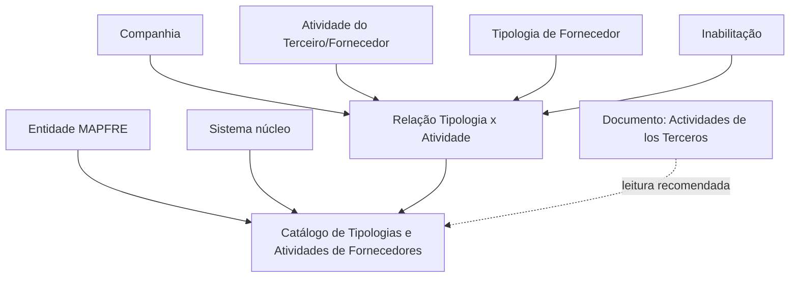

# Configuração de Tipologias de Fornecedores por Atividade

## 1. Metadados do Documento
- **Arquivo de Origem:** Não identificado no conteúdo fornecido
- **Tipo de Documento:** Especificação Funcional
- **Domínio / Sistema:** Reef / MAPFRE — Catálogo de Tipologias e Atividades de Fornecedores
- **Público-Alvo:** Negócio, configuração funcional e operação de catálogos
- **Data/Versão Identificada:** Não identificada

---

## 2. Resumo Executivo & Contexto de Negócio

O documento descreve a configuração de um catálogo de informação destinado a associar Tipologias de Fornecedores às Atividades de Terceiros/Fornecedores. O núcleo do sistema possui capacidade funcional para relacionar esses dois elementos em um catálogo específico.

O catálogo é entregue inicialmente vazio às instalações. Portanto, a entidade MAPFRE deve definir seu conteúdo considerando os processos corporativos em que a relação entre tipologia e atividade de fornecedor será utilizada ou considerada.

A configuração é baseada nos atributos Companhia, Código de Atividade do Terceiro, Tipologia e Inabilitação. Esses atributos permitem definir a companhia à qual a relação se aplica, a atividade elegível, o tipo de fornecedor configurado e se a associação está ativa ou inabilitada.

O documento não estabelece uma recomendação ou preferência operacional para padronizar a codificação do catálogo. A responsabilidade pela análise de conveniência de uso e pela definição local da codificação pertence à entidade MAPFRE.

---

## 3. Arquitetura, Componentes & Tecnologias Envolvidas

Os componentes funcionais identificados são:

- **Sistema núcleo:** Disponibiliza a capacidade de associar Tipologias e Atividades de Fornecedores.
- **Catálogo de Tipologias e Atividades de Fornecedores:** Repositório de configuração inicialmente entregue sem conteúdo.
- **Companhia:** Contexto organizacional da associação entre tipo e atividade de fornecedor.
- **Atividade do Terceiro/Fornecedor:** Atividade cujo código pode ser configurado quando a própria atividade permitir.
- **Tipologia de Fornecedor:** Código ou chave do tipo de fornecedor configurado.
- **Inabilitação:** Estado que desativa uma tipologia para determinada atividade.
- **Documentação Reef / Mapfredocument:** Referências documentais relacionadas.
- **Documento relacionado:** “Actividades de los Terceros”.



**Nota de Análise:** O documento não detalha tecnologias, APIs, banco de dados, integrações, métodos HTTP, contratos JSON, ambientes técnicos ou mecanismos de persistência do catálogo.

---

## 4. Regras de Negócio, Especificações Funcionais & Processos

1. O sistema núcleo permite associar e relacionar Tipologias de Fornecedores com Atividades de Fornecedores.
2. A associação é mantida em um catálogo específico de informações.
3. O catálogo é entregue inicialmente vazio de conteúdo nas instalações.
4. A relação configurada deve conter o código da companhia sobre a qual está sendo realizada a associação entre Tipo de Fornecedor e Atividade de Fornecedor.
5. O código da Atividade do Terceiro/Fornecedor somente pode ser estabelecido no sistema quando a própria atividade permitir essa configuração.
6. O documento apresenta como exemplos de atividades: oficinas, clínicas, hospitais e peritos.
7. A Tipologia determina o código ou a chave do Tipo de Fornecedor configurado no catálogo.
8. A propriedade Inabilitação define que uma Tipologia de Fornecedor, para uma determinada Atividade, está desativada ou inabilitada para uso nas configurações dos catálogos.
9. Não existe preferência ou recomendação documentada para estabelecer ou padronizar a codificação do catálogo.
10. A entidade MAPFRE deve analisar a conveniência de usar o catálogo conforme os processos corporativos nos quais essa informação possa ser utilizada ou considerada.
11. A leitura do documento “Actividades de los Terceros” é recomendada para evitar interpretações isoladas e potencialmente incorretas do documento analisado.

---

## 5. Tabelas de Parâmetros, Ambientes e Estruturas de Dados

| Item / Parâmetro | Descrição / Função | Tipo / Valores / Formato | Ambiente / Observações |
| :--- | :--- | :--- | :--- |
| Companhia | Contém o código da companhia sobre a qual ocorre a relação entre Tipo de Fornecedor e Atividade de Fornecedor. | Código de companhia; formato não detalhado. | Aplicável à configuração da relação no catálogo. |
| Código de Atividade do Terceiro | Estabelece o código da Atividade do Terceiro/Fornecedor no sistema. | Código de atividade; formato não detalhado. | Só pode ser configurado quando a atividade permitir. |
| Atividade do Terceiro/Fornecedor | Atividade associada a uma Tipologia de Fornecedor. | Exemplos mencionados: oficinas, clínicas, hospitais e peritos. | As regras que determinam quais atividades permitem configuração não são detalhadas. |
| Tipologia | Determina o código ou chave do Tipo de Fornecedor configurado no catálogo. | Código ou chave; formato não detalhado. | Relacionada a uma atividade e a uma companhia. |
| Inabilitação | Define que o Tipo de Fornecedor para a Atividade configurada está desativado ou inabilitado. | Estado de inabilitação; valores não detalhados. | Impede o uso da tipologia nas configurações dos catálogos. |
| Catálogo de Tipologias e Atividades | Catálogo específico que armazena a associação entre Tipologias e Atividades de Fornecedores. | Catálogo de informação. | Entregue inicialmente vazio às instalações. |
| Documentação relacionada | Documento funcional cuja leitura é recomendada. | “Actividades de los Terceros”. | A leitura evita interpretações isoladas do catálogo. |
| Owner | Proprietário indicado no conteúdo. | `user:agonzalez_mapfre.com` | Associado à documentação Reef. |
| Lifecycle | Estado de ciclo de vida exibido. | `Approved Source / VL` | Não há detalhamento adicional sobre “VL”. |

---

## 6. Bateria de Perguntas & Respostas para RAG (FAQ Sintético)

### P1: Qual é a finalidade do catálogo de Tipologias e Atividades de Fornecedores?
**R:** O catálogo permite associar e relacionar Tipologias de Fornecedores com Atividades de Terceiros/Fornecedores no sistema núcleo. Ele é um catálogo específico de informação para configurar essas relações.

### P2: O catálogo de Tipologias e Atividades de Fornecedores já vem preenchido na instalação?
**R:** Não. O documento informa que o catálogo é entregue inicialmente vazio de conteúdo nas instalações.

### P3: Qual informação representa o atributo Companhia na relação entre tipologia e atividade?
**R:** O atributo Companhia contém o código da companhia sobre a qual está sendo realizada a relação entre o Tipo de Fornecedor e a Atividade de Fornecedor.

### P4: Quando o Código de Atividade do Terceiro pode ser configurado?
**R:** O Código de Atividade do Terceiro/Fornecedor pode ser estabelecido no sistema somente quando a própria Atividade do Terceiro permitir essa configuração.

### P5: Quais exemplos de Atividades de Terceiros são citados no documento?
**R:** O documento cita como exemplos oficinas, clínicas, hospitais e peritos. Não afirma que esses sejam os únicos tipos de atividade permitidos.

### P6: O que a Tipologia representa no catálogo?
**R:** A Tipologia determina o código ou a chave do Tipo de Fornecedor que está sendo configurado no catálogo de Tipologias e Atividades de Fornecedores.

### P7: Qual é o efeito da propriedade Inabilitação?
**R:** A propriedade Inabilitação estabelece que o Tipo de Fornecedor associado a uma Atividade configurada está desativado ou inabilitado, não podendo ser utilizado nas configurações dos catálogos.

### P8: Existe uma codificação obrigatória ou recomendada para o catálogo?
**R:** Não. O documento declara que não existe preferência ou recomendação para estabelecer ou padronizar a codificação do catálogo no sistema.

### P9: Quem deve decidir se o catálogo será utilizado e como sua codificação será definida?
**R:** A entidade MAPFRE deve analisar a conveniência de utilização do catálogo de acordo com os processos da companhia nos quais essas informações possam ser usadas ou consideradas.

### P10: Qual documento deve ser consultado para evitar uma interpretação isolada da configuração?
**R:** O documento recomenda a leitura de “Actividades de los Terceros”, pois a interpretação isolada do documento de Tipologias e Atividades de Fornecedores pode conduzir a erro.

### P11: O documento descreve APIs, contratos JSON ou tecnologias de implementação do catálogo?
**R:** Não. O conteúdo fornecido descreve propriedades funcionais do catálogo, mas não detalha APIs, métodos HTTP, contratos JSON, banco de dados, tecnologias ou integrações técnicas.

---

## 7. Glossário de Termos, Siglas & Conceitos-Chave

- **MAPFRE:** Entidade corporativa mencionada como responsável por analisar a conveniência de utilização do catálogo conforme os processos da companhia.
- **Reef:** Contexto de documentação em que o documento está publicado, identificado como “Documentation / DOCUMENTACIÓN Reef”.
- **Tipologia:** Código ou chave que identifica o Tipo de Fornecedor configurado no catálogo.
- **Atividade do Terceiro:** Atividade atribuída a um terceiro ou fornecedor, cujo código pode ser configurável quando permitido.
- **Fornecedor:** Terceiro relacionado a uma atividade e classificado por uma tipologia.
- **Catálogo:** Repositório de informação usado para manter a relação entre Tipologias e Atividades de Fornecedores.
- **Inabilitação:** Propriedade que desativa uma Tipologia de Fornecedor para uma Atividade configurada.
- **Lifecycle:** Campo exibido como `Approved Source / VL`; o significado de “VL” não é detalhado.
- **Mapfredocument:** Termo exibido no conteúdo como referência de documentação, sem explicação adicional.

---

## 8. Notas Críticas, Riscos & Limitações

- O catálogo é entregue vazio, exigindo definição e manutenção de conteúdo pela entidade responsável.
- Não há padrão de codificação estabelecido pelo documento; isso pode gerar variações locais caso a entidade MAPFRE não defina governança própria.
- O documento não define formatos de códigos, valores possíveis para Inabilitação, validações técnicas, permissões ou responsáveis operacionais.
- Não há detalhamento de APIs, integrações, tecnologias, banco de dados, interfaces ou fluxos de aprovação.
- A configuração do Código de Atividade do Terceiro depende de a atividade permitir essa configuração, mas os critérios dessa permissão não são descritos.
- O documento recomenda consultar “Actividades de los Terceros”; a ausência dessa documentação complementar pode levar a interpretações incompletas.
- **Nota de Análise:** O conteúdo fornecido não detalha mecanismos de auditoria, rastreabilidade, versionamento ou impacto da inabilitação em registros já existentes.

---

## 9. Conteúdo Bruto Estruturado (Referência Fiel)

```text
--- [PÁGINA 1 DE 2] ---

CONFIGURACIÓN de las TIPOLOGÍAS de los PROVEEDORES por
ACTIVIDAD
Objetivo
Funcionalmente, el núcleo del Sistema cuenta con la posibilidad de asociar y relacionar las Tipologías y las Actividades de los Proveedores
en un catálogo de información especíco que se entrega inicialmente a las instalaciones vacío de contenido.
Propiedades
Otras Propiedades
Propiedades
Compañía
Este Atributo del catálogo contiene el código de la compañía sobre la que se está realizando la relación del Tipo y Actividad de Proveedor.
Código de Actividad del Tercero
Esta propiedad establece en el sistema el código de la Actividad del Tercero-Proveedor siempre y cuando la Actividad del Tercero así lo
permita (Como por ejemplo en Talleres, Clínicas, Hospitales, Peritos, ...)
Tipología
Este Atributo determina el código o clave del Tipo de Proveedor que se está congurando en el catálogo.
Otras Propiedades
Inhabilitación
Esta propiedad establece que el Tipo de Proveedor para la Actividad que se está congurando está desactivado o inhabilitado para poder ser
utilizada en las conguraciones de los catálogos.
Vínculos
Relación de Directrices y Documentos funcionales cuya lectura recomendada para evitar que la interpretación aislada del presente
documento pueda conducir a error.
Actividades de los Terceros
Preguntas frecuentes
Documentation / DOCUMENTACIÓN Reef
DOCUMENTACIÓN Reef
Mapfredocument
DOCUMENTACIÓN Reef
Owner
user:agonzalez_mapfre.com
Lifecycle
Approved Source
 /
 VL
Buscar Inicio Soluciones Arquitecturas APIs Componentes Cloud Documentación Zeus Reef Ayuda
ES


--- [PÁGINA 2 DE 2] ---

(1) ¿Existe alguna recomendación operativa que deba ser tomada en consideración localmente en la codicación, uso y denición del
catálogo de Tipologías y Actividades de los Proveedores?
No existe una preferencia ni recomendación para establecer o estandarizar en el sistema su codicación, si bien la entidad MAPFRE debe
analizar la conveniencia de utilizarlo de acuerdo con los procesos de la compañía en los que este catálogo de información pueda ser
utilizado/considerado.
```
