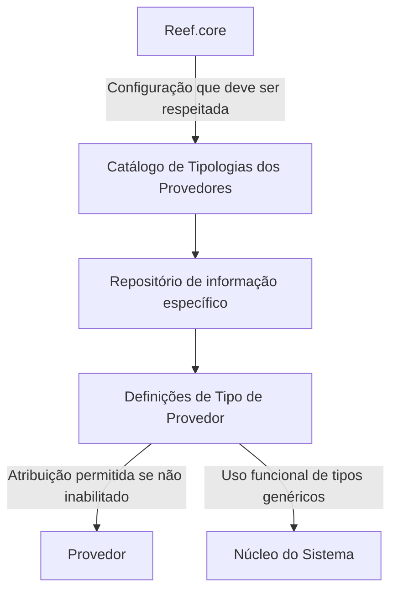

# Definição das Tipologias dos Provedores no Reef

## 1. Metadados do Documento
- **Arquivo de Origem:** `Não identificado no conteúdo fornecido`
- **Tipo de Documento:** `Especificação Técnica`
- **Domínio / Sistema:** `Reef / Reef.core`
- **Público-Alvo:** `Não identificado`
- **Data/Versão Identificada:** `Não identificada`

---

## 2. Resumo Executivo & Contexto de Negócio

O documento define funcionalmente o catálogo de **Tipologias dos Provedores** do sistema Reef. O núcleo do sistema permite codificar essas tipologias em um repositório de informação específico, entregue inicialmente vazio nas instalações.

A definição de uma tipologia está associada a uma companhia, a uma chave de tipologia, a um idioma e a uma descrição traduzida. O documento exemplifica descrições em espanhol, incluindo os tipos `1 — AGENCIA` e `2 — MULTIMARCA`.

O catálogo permite controlar a disponibilidade operacional de cada Tipo de Provedor por meio da propriedade de inabilitação. Quando a propriedade estiver estabelecida, o Tipo de Provedor fica desativado ou inabilitado para atribuição a um Provedor.

O documento também diferencia Tipos de Provedor reais e genéricos. Um Tipo Genérico é utilizado funcionalmente pelo núcleo do sistema e pode existir somente um registro com a propriedade **Tipo Real?** não ativada para cada subconjunto de Companhia e idioma.

A recomendação operacional explícita é respeitar a configuração realizada a partir do **Reef.core**, evitando interpretações isoladas do documento e preservando a configuração central do sistema.

---

## 3. Arquitetura, Componentes & Tecnologias Envolvidas

Componentes e elementos identificados:

| Componente / Elemento | Papel identificado no documento |
| :--- | :--- |
| Reef | Contexto de documentação e catálogo de Tipologias dos Provedores. |
| Núcleo do Sistema | Utiliza funcionalmente Tipos de Provedor, incluindo Tipos Genéricos. |
| Repositório de informação específico | Repositório no qual as Tipologias dos Provedores são codificadas. |
| Reef.core | Origem cuja configuração deve ser respeitada na codificação, uso e definição do catálogo. |
| Catálogo de Tipologias de Provedores | Estrutura que contém a definição dos tipos de provedor por companhia e idioma. |
| Provedor | Entidade à qual um Tipo de Provedor pode ser atribuído, desde que não esteja inabilitado. |
| Mapfredocument | Elemento mencionado na área de documentação Reef, sem detalhamento funcional adicional. |



> **Nota de Análise:** O conteúdo não descreve tecnologias de implementação, APIs, métodos HTTP, contratos JSON, bancos de dados, servidores, URLs de ambiente ou integrações técnicas.

---

## 4. Regras de Negócio, Especificações Funcionais & Processos

1. O núcleo do sistema possui a capacidade de codificar Tipologias dos Provedores em um repositório de informação específico.
2. O repositório destinado às Tipologias dos Provedores é entregue inicialmente vazio nas instalações.
3. Cada definição de Tipo de Provedor deve conter uma referência à companhia sobre a qual a definição está sendo realizada.
4. Cada Tipo de Provedor possui um código ou chave configurado no catálogo.
5. Cada definição de Tipologia dos Provedores possui um idioma associado.
6. O idioma representa a chave de idioma utilizada na configuração das tipologias, com exemplos explícitos de espanhol, inglês e turco.
7. A descrição do Tipo de Provedor deve corresponder ao idioma utilizado na definição.
8. Um Tipo de Provedor pode ser marcado como inabilitado.
9. Um Tipo de Provedor inabilitado não pode ser empregado na sua atribuição a um Provedor.
10. A propriedade **Tipo Real?** determina se o Tipo de Provedor é real ou genérico.
11. Um Tipo Genérico é utilizado funcionalmente pelo núcleo do sistema.
12. Para cada subconjunto formado por Companhia e idioma, pode existir somente um registro cuja propriedade **Tipo Real?** não esteja ativada.
13. A codificação, o uso e a definição do catálogo de Tipologias dos Provedores devem respeitar a configuração realizada a partir do Reef.core.
14. O documento recomenda a leitura de diretrizes e documentos funcionais vinculados, pois uma interpretação isolada pode conduzir a erro.
15. Entre os vínculos documentais citados está o documento ou tema **Actividades de los Terceros**.

---

## 5. Tabelas de Parâmetros, Ambientes e Estruturas de Dados

| Item / Parâmetro | Descrição / Função | Tipo / Valores / Formato | Ambiente / Observações |
| :--- | :--- | :--- | :--- |
| Companhia | Código da companhia para a qual está sendo definida a Tipologia de Provedor. | Código de companhia. | Associado à definição do Tipo de Provedor. |
| Tipologia | Código ou chave do Tipo de Provedor configurado no catálogo. | Código ou chave. | Identifica o Tipo de Provedor. |
| Idioma | Chave do idioma usada na configuração das Tipologias dos Provedores. | Exemplos: espanhol, inglês, turco. | Associado à descrição do Tipo de Provedor. |
| Descrição do Tipo de Provedor | Denominação ou descrição do Tipo de Provedor de acordo com o idioma definido. | Texto. | Deve corresponder ao idioma utilizado na definição. |
| Inabilitação | Determina que o Tipo de Provedor está desativado ou inabilitado para atribuição. | Propriedade de habilitação/inabilitação. | Impede o emprego do tipo na atribuição a um Provedor. |
| Tipo Real? | Define se o Tipo de Provedor é real ou genérico. | Propriedade ativada ou não ativada. | Somente um registro não ativado por subconjunto de Companhia e idioma. |
| Tipo `1` | Exemplo de Tipo de Provedor. | `AGENCIA`. | Exemplo apresentado para idioma espanhol. |
| Tipo `2` | Exemplo de Tipo de Provedor. | `MULTIMARCA`. | Exemplo apresentado para idioma espanhol. |
| Reef.core | Fonte de configuração que deve ser respeitada. | Sistema/componente citado. | Aplicável à codificação, uso e definição do catálogo. |

---

## 6. Bateria de Perguntas & Respostas para RAG (FAQ Sintético)

### P1: Qual é o objetivo do catálogo de Tipologias dos Provedores no Reef?
**R:** O catálogo permite que o núcleo do sistema codifique as Tipologias dos Provedores em um repositório de informação específico. Esse repositório é entregue inicialmente sem conteúdo nas instalações.

### P2: Quais propriedades compõem a definição de uma Tipologia de Provedor?
**R:** A definição contém, no mínimo, Companhia, Tipologia, Idioma, Descrição do Tipo de Provedor, Inabilitação e a propriedade Tipo Real?. Cada propriedade possui uma função específica na identificação, tradução, uso e disponibilidade do Tipo de Provedor.

### P3: O que representa o atributo Companhia na Tipologia de Provedor?
**R:** Companhia contém o código da companhia sobre a qual está sendo realizada a definição do Tipo de Provedor. A companhia faz parte do subconjunto usado na regra de unicidade de Tipos Genéricos.

### P4: Como o atributo Idioma deve ser utilizado no catálogo?
**R:** Idioma é a chave do idioma empregada na configuração das Tipologias dos Provedores. O documento cita espanhol, inglês e turco como exemplos. A descrição do Tipo de Provedor deve estar de acordo com o idioma usado na definição.

### P5: O que acontece quando um Tipo de Provedor está inabilitado?
**R:** A propriedade Inabilitação estabelece que o Tipo de Provedor está desativado ou inabilitado. Um Tipo de Provedor inabilitado não pode ser utilizado em sua atribuição a um Provedor.

### P6: Qual é a diferença entre um Tipo Real e um Tipo Genérico?
**R:** A propriedade Tipo Real? determina se um Tipo de Provedor é real ou genérico. O documento informa que o Tipo Genérico é utilizado funcionalmente pelo núcleo do sistema, mas não fornece critérios adicionais para classificar um tipo como real ou genérico.

### P7: Qual regra de unicidade se aplica a Tipos de Provedor Genéricos?
**R:** Para cada subconjunto de Companhia e idioma, pode existir um único registro com a propriedade Tipo Real? sem ativação. Esse registro representa o Tipo Genérico utilizado funcionalmente pelo núcleo do sistema.

### P8: Quais exemplos de Tipologias de Provedor são apresentados para o idioma espanhol?
**R:** O documento apresenta dois exemplos: Tipo `1` com descrição `AGENCIA` e Tipo `2` com descrição `MULTIMARCA`.

### P9: Existe alguma recomendação operacional para a codificação e uso do catálogo?
**R:** Sim. A recomendação é respeitar a configuração realizada a partir do Reef.core durante a codificação, o uso e a definição do catálogo de Tipologias dos Provedores.

### P10: Quais documentos ou temas vinculados devem ser considerados ao interpretar esta especificação?
**R:** O documento cita vínculos para diretrizes e documentos funcionais cuja leitura é recomendada para evitar erros de interpretação isolada. Entre os vínculos identificados está **Actividades de los Terceros**.

---

## 7. Glossário de Termos, Siglas & Conceitos-Chave

- **Reef:** Contexto de documentação e sistema no qual o catálogo de Tipologias dos Provedores está inserido.
- **Reef.core:** Origem de configuração que deve ser respeitada na codificação, uso e definição do catálogo.
- **Tipologia de Provedor:** Código ou classificação configurada para um Provedor no catálogo.
- **Tipo Real:** Tipo de Provedor identificado como real pela propriedade Tipo Real?.
- **Tipo Genérico:** Tipo de Provedor utilizado funcionalmente pelo núcleo do sistema; há limitação de um único registro não ativado por subconjunto de Companhia e idioma.
- **Inabilitação:** Propriedade que desativa um Tipo de Provedor para sua atribuição a um Provedor.
- **Companhia:** Código da companhia para a qual uma Tipologia de Provedor é definida.
- **Mapfredocument:** Elemento citado na área de documentação Reef, sem explicação adicional no conteúdo fornecido.

---

## 8. Notas Críticas, Riscos & Limitações

- O repositório de Tipologias dos Provedores é entregue inicialmente vazio; a configuração do catálogo depende de codificação posterior.
- Uma interpretação isolada do documento pode conduzir a erro, conforme alerta explícito na seção de vínculos.
- A configuração proveniente do Reef.core deve ser respeitada localmente.
- O documento não detalha o procedimento técnico para cadastrar, alterar, aprovar ou remover Tipologias dos Provedores.
- O documento não especifica interfaces, APIs, contratos de dados, persistência, autenticação, perfis de acesso ou trilhas de auditoria.
- O documento não define o significado operacional completo de Tipo Real em contraste com Tipo Genérico, além da regra de uso funcional do Tipo Genérico e da restrição por Companhia e idioma.
- Não são fornecidas versões, datas, responsáveis funcionais além da referência visual a `user:agonzalez_mapfre.com`, nem informações de ambiente.

---

## 9. Conteúdo Bruto Estruturado (Referência Fiel)

```text
--- [PÁGINA 1 DE 2] ---

DEFINICIÓN de las TIPOLOGÍAS de los PROVEEDORES
Objetivo
Funcionalmente, el núcleo del Sistema cuenta con la posibilidad de codicar las Tipologías de los Proveedores en un repositorio de
información especíco que se entrega inicialmente a las instalaciones vacío de contenido.
Propiedades
Otras Propiedades
Propiedades
Compañía
Este Atributo del catálogo contiene el código de la compañía sobre la que se está realizando la denición del Tipo de Proveedor.
Tipología
Este Atributo determina el código o clave del Tipo de Proveedor que se está congurando en el catálogo.
Idioma
Esta propiedad es la clave del Idioma empleado en la conguración de las Tipologías de los Proveedores como por ejemplo: español, inglés,
turco, ...
Descripción del Tipo de Proveedor
Esta propiedad contiene la denominación o descripción del Tipo de Proveedor de acuerdo con el idioma utilizado en la denición.
A modo de ejemplo y si el idioma de la denición es el español...
TIPO DESCRIPCIÓN
1 AGENCIA
2 MULTIMARCA
Otras Propiedades
Inhabilitación
Esta propiedad establece que el Tipo de Proveedor está desactivado o inhabilitado para poder ser empleado en su asignación a un Proveedor.
Documentation / DOCUMENTACIÓN Reef
DOCUMENTACIÓN Reef
Mapfredocument
DOCUMENTACIÓN Reef
Owner
user:agonzalez_mapfre.com
Lifecycle
Approved Source
 / 
 VL
Buscar Inicio Soluciones Arquitecturas APIs Componentes Cloud Documentación Zeus Reef Ayuda
ES


--- [PÁGINA 2 DE 2] ---

Tipo Real?
Esta propiedad establece si el Tipo de Proveedor es un Tipo Real o un Tipo Genérico (puede existir un único Registro con esta Propiedad sin
activar por cada subconjunto de Compañía y lenguaje) utilizado funcionalmente por el núcleo del Sistema.
Vínculos
Relación de Directrices y Documentos funcionales cuya lectura recomendada para evitar que la interpretación aislada del presente
documento pueda conducir a error.
Actividades de los Terceros
Preguntas frecuentes
(1) ¿Existe alguna recomendación operativa que deba ser tomada en consideración localmente en la codicación, uso y denición del
catálogo de Tipologías de Proveedores?
Se debe respetar la conguración realizada desde Reef.core
```
