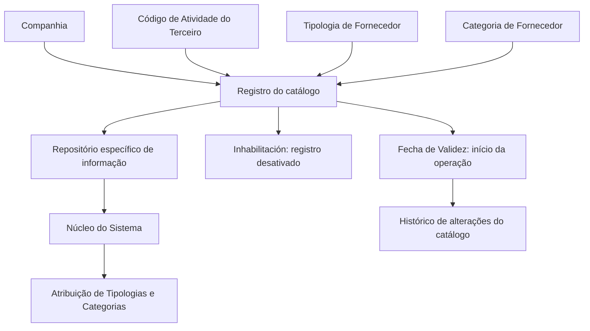
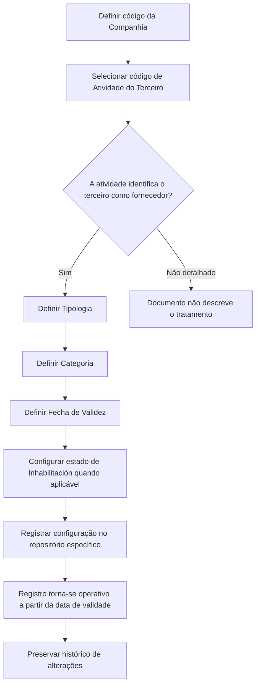

# Configuração de Tipologias e Categorias de Fornecedores por Atividade

## 1. Metadados do Documento
- **Arquivo de Origem:** `Não identificado no conteúdo fornecido`
- **Tipo de Documento:** `Especificação Funcional`
- **Domínio / Sistema:** `Reef / MAPFRE — cadastro de terceiros e fornecedores`
- **Público-Alvo:** `Negócio, analistas funcionais, administradores de catálogo e operação`
- **Data/Versão Identificada:** `Não identificada`

---

## 2. Resumo Executivo & Contexto de Negócio

O documento descreve a configuração de um catálogo destinado a atribuir **Tipologias** e **Categorias** aos fornecedores de acordo com a sua **Atividade**. A finalidade funcional é classificar terceiros identificados como fornecedores mediante um repositório de informação específico.

O repositório é entregue inicialmente às instalações sem conteúdo. Portanto, a entidade responsável pela instalação deve definir e manter os registros do catálogo, associando companhia, código de atividade do terceiro, tipologia e categoria de fornecedor.

Cada registro possui mecanismos de controle operacional. A propriedade **Inhabilitación** permite desativar um registro configurado, enquanto a **Fecha de Validez** determina a data a partir da qual o registro passa a operar no sistema. O uso correto da data de validade permite preservar o histórico de alterações efetuadas nas configurações do catálogo ao longo do tempo.

O documento não estabelece uma codificação obrigatória nem uma recomendação operacional padronizada para tipologias e categorias por código de atividade. Contudo, indica que a entidade MAPFRE deve analisar a conveniência de utilizar esse catálogo de forma transversal nos processos corporativos, visando sua exploração posterior.

A leitura do documento deve ser complementada por materiais funcionais relacionados a atividades de terceiros, tipologias de fornecedores e categorias de fornecedores, pois a interpretação isolada pode conduzir a erro.

---

## 3. Arquitetura, Componentes & Tecnologias Envolvidas

O conteúdo apresenta uma estrutura funcional de catálogo no núcleo do sistema, sem detalhar tecnologias, APIs, métodos HTTP, bancos de dados, contratos JSON, servidores, URLs operacionais ou integrações técnicas.

### Componentes e conceitos identificados

| Componente / Conceito | Papel descrito no documento |
| :--- | :--- |
| Sistema / núcleo do Sistema | Possui a capacidade de atribuir tipologias e categorias a fornecedores de acordo com a atividade. |
| Repositório de informação específico | Armazena a configuração de tipologias e categorias por código de atividade de fornecedor. É entregue inicialmente vazio. |
| Terceiro-Provedor | Terceiro cuja atividade o identifica como fornecedor. |
| Companhia | Contexto empresarial para o qual um registro de catálogo é definido. |
| Código de Atividade do Terceiro | Código que estabelece a atividade do terceiro-fornecedor no sistema. |
| Tipologia | Código ou chave do tipo de fornecedor configurado no catálogo. |
| Categoria | Código ou chave do tipo de fornecedor configurado no catálogo. |
| Inhabilitación | Propriedade que desativa ou inabilita um registro configurado. |
| Fecha de Validez | Data a partir da qual o registro configurado fica operativo; suporta histórico de alterações. |
| MAPFRE | Entidade mencionada como responsável por analisar a conveniência de exploração transversal do catálogo. |
| Reef | Contexto documental indicado nos vínculos e na navegação da documentação. |



> **Nota de Análise:** O documento descreve uma relação funcional entre atividade de terceiro, tipologia, categoria, companhia, inabilitação e data de validade. Não detalha implementação técnica, modelo físico de dados, identificadores de registros, critérios de unicidade ou processo de carga inicial.

---

## 4. Regras de Negócio, Especificações Funcionais & Processos

### 4.1 Objetivo funcional

1. O núcleo do sistema permite atribuir tipologias e categorias aos fornecedores.
2. A atribuição é realizada de acordo com a atividade do fornecedor.
3. As configurações são mantidas em um repositório específico de informação.
4. O repositório é inicialmente entregue às instalações vazio de conteúdo.

### 4.2 Regras de composição do registro de catálogo

1. Cada registro deve possuir uma **Companhia**, representada pelo código da companhia sobre a qual a definição está sendo realizada.
2. Cada registro deve possuir um **Código de Atividade do Terceiro**.
3. O Código de Atividade do Terceiro estabelece a atividade do terceiro-fornecedor no sistema, desde que a atividade identifique o terceiro como fornecedor.
4. Cada registro deve possuir uma **Tipologia**, que determina o código ou a chave do tipo de fornecedor configurado no catálogo.
5. Cada registro deve possuir uma **Categoria**, que determina o código ou a chave do tipo de fornecedor configurado no catálogo.
6. A propriedade **Inhabilitación** estabelece que o registro configurado está desativado ou inabilitado.
7. A propriedade **Fecha de Validez** determina a data a partir da qual o registro configurado fica operativo no sistema.
8. O uso correto da Fecha de Validez permite manter um histórico das mudanças realizadas nas configurações do catálogo ao longo do tempo.

### 4.3 Fluxo funcional reconstruído



### 4.4 Diretriz de codificação e uso corporativo

- Não existe preferência ou recomendação para estabelecer ou padronizar a codificação no sistema.
- A entidade MAPFRE deve analisar a conveniência de utilizar transversalmente o catálogo de informação nos processos da companhia.
- A utilização transversal é mencionada como necessária para possibilitar a correta exploração posterior do catálogo.
- O documento não define quais processos corporativos devem utilizar o catálogo, nem define um padrão obrigatório de códigos.

### 4.5 Documentação funcional relacionada

A documentação recomenda a leitura dos seguintes materiais para evitar interpretação isolada e potencialmente incorreta:

1. **Actividades de los Terceros**
2. **Tipologías de Proveedores**
3. **Categorías de Proveedores**

> **Nota de Análise:** O conteúdo fornecido apenas lista esses documentos relacionados; não apresenta seus conteúdos, regras ou definições.

---

## 5. Tabelas de Parâmetros, Ambientes e Estruturas de Dados

| Item / Parâmetro | Descrição / Função | Tipo / Valores / Formato | Ambiente / Observações |
| :--- | :--- | :--- | :--- |
| Companhia | Contém o código da companhia sobre a qual é realizada a definição do registro. | Código de companhia; formato não detalhado. | Aplicável à definição do registro de catálogo. |
| Código de Atividade do Terceiro | Estabelece no sistema o código da atividade do terceiro-fornecedor. | Código de atividade; formato não detalhado. | Aplicável quando a atividade identifica o terceiro como fornecedor. |
| Tipologia | Determina o código ou a chave do tipo de fornecedor configurado no catálogo. | Código ou chave; domínio de valores não detalhado. | Associada à atividade do fornecedor. |
| Categoria | Determina o código ou a chave do tipo de fornecedor configurado no catálogo. | Código ou chave; domínio de valores não detalhado. | Associada à atividade do fornecedor. |
| Inhabilitación | Estabelece que o registro configurado está desativado ou inabilitado. | Estado de inabilitação; valores não detalhados. | Controle de ativação do registro. |
| Fecha de Validez | Indica a data a partir da qual o registro configurado fica operativo no sistema. | Data; formato não detalhado. | Permite histórico das alterações de configuração. |
| Repositório de informação específico | Repositório que suporta a atribuição de tipologias e categorias por atividade. | Repositório funcional; tecnologia não detalhada. | Entregue inicialmente vazio de conteúdo. |
| Codificação do catálogo | Codificação de tipologias e categorias por código de atividade. | Não padronizada pelo documento. | MAPFRE deve avaliar conveniência de uso transversal. |
| Documentação relacionada | Materiais recomendados para interpretação correta. | Actividades de los Terceros; Tipologías de Proveedores; Categorías de Proveedores. | Necessária para evitar interpretação isolada. |

---

## 6. Bateria de Perguntas & Respostas para RAG (FAQ Sintético)

### P1: Qual é o objetivo do catálogo de tipologias e categorias de fornecedores por atividade?
**R:** O catálogo permite ao núcleo do sistema atribuir tipologias e categorias aos fornecedores de acordo com a atividade do terceiro. Essa configuração é mantida em um repositório específico de informação.

### P2: O repositório de tipologias e categorias já possui dados ao ser entregue?
**R:** Não. O documento informa que o repositório específico de informação é entregue inicialmente às instalações vazio de conteúdo.

### P3: Qual é a função da propriedade Companhia no registro do catálogo?
**R:** A propriedade Companhia contém o código da companhia sobre a qual está sendo realizada a definição do registro de tipologia e categoria de fornecedor por atividade.

### P4: Quando o Código de Atividade do Terceiro deve ser utilizado no catálogo?
**R:** O Código de Atividade do Terceiro estabelece no sistema o código da atividade do terceiro-fornecedor, desde que a atividade do terceiro o identifique como fornecedor.

### P5: O que representa a Tipologia na configuração do catálogo?
**R:** A Tipologia determina o código ou a chave do tipo de fornecedor que está sendo configurado no catálogo. O documento não apresenta os valores permitidos nem uma taxonomia de tipologias.

### P6: O que representa a Categoria na configuração do catálogo?
**R:** A Categoria determina o código ou a chave do tipo de fornecedor configurado no catálogo. O conteúdo não diferencia funcionalmente categoria e tipologia além de ambas serem atributos de configuração.

### P7: Como um registro de configuração pode ser desativado?
**R:** A propriedade Inhabilitación estabelece que o registro configurado está desativado ou inabilitado. O documento não detalha o mecanismo de atualização nem os valores técnicos desse atributo.

### P8: A partir de quando uma configuração passa a ser operacional no sistema?
**R:** Uma configuração passa a ser operacional a partir da data definida na propriedade Fecha de Validez. Essa propriedade informa ao sistema a data de início de vigência do registro.

### P9: Como o catálogo preserva o histórico de mudanças?
**R:** O documento informa que o uso correto da Fecha de Validez permite manter um histórico das mudanças realizadas nas configurações do catálogo ao longo do tempo. Não são detalhadas regras de versionamento, encerramento de vigência ou coexistência de registros.

### P10: Existe um padrão obrigatório para a codificação de tipologias e categorias?
**R:** Não. O documento declara que não existe preferência nem recomendação para estabelecer ou padronizar a codificação no sistema.

### P11: Qual responsabilidade é atribuída à entidade MAPFRE em relação ao catálogo?
**R:** A entidade MAPFRE deve analisar a conveniência de utilizar transversalmente o catálogo de informação nos processos da companhia, permitindo sua correta e posterior exploração.

### P12: Quais documentos devem ser consultados para evitar interpretação isolada desta especificação?
**R:** Devem ser consultados os documentos funcionais relacionados a Actividades de los Terceros, Tipologías de Proveedores e Categorías de Proveedores. O conteúdo desses documentos não está presente no material fornecido.

---

## 7. Glossário de Termos, Siglas & Conceitos-Chave

- **Atividade do Terceiro:** Código ou classificação de atividade atribuída a um terceiro; no contexto do documento, determina a associação aplicável quando o terceiro é identificado como fornecedor.
- **Categoria:** Código ou chave do tipo de fornecedor configurado no catálogo.
- **Código de Atividade do Terceiro:** Propriedade que estabelece no sistema o código da atividade do terceiro-fornecedor.
- **Companhia:** Código da companhia sobre a qual é realizada a definição do registro.
- **Fecha de Validez:** Data a partir da qual o registro configurado está operativo no sistema.
- **Fornecedor / Proveedor:** Terceiro cuja atividade o identifica como fornecedor.
- **Inhabilitación:** Propriedade que indica que o registro configurado está desativado ou inabilitado.
- **MAPFRE:** Entidade mencionada no documento como responsável por avaliar o uso transversal do catálogo nos processos corporativos.
- **Reef:** Nome presente nos vínculos e na navegação da documentação. O documento não define tecnicamente o termo.
- **Registro de Catálogo:** Configuração que reúne companhia, código de atividade do terceiro, tipologia, categoria, estado de inabilitação e data de validade.
- **Tipologia:** Código ou chave do tipo de fornecedor configurado no catálogo.

---

## 8. Notas Críticas, Riscos & Limitações

- O repositório é entregue inicialmente vazio; a efetividade da funcionalidade depende da carga e manutenção local dos registros de catálogo.
- Não há padrão obrigatório de codificação para tipologias e categorias. A ausência de padronização pode dificultar o uso transversal e a exploração corporativa posterior caso cada instalação adote convenções incompatíveis.
- A documentação atribui à MAPFRE a análise de conveniência para uso transversal, mas não define governança, responsáveis operacionais, processo de aprovação ou padrão de dados.
- O documento não detalha critérios de unicidade para registros, tratamento de conflitos, regras de sobreposição de datas de validade ou comportamento de registros inabilitados.
- Não são informados contratos de integração, APIs, serviços, tecnologias, bancos de dados, ambientes, URLs, credenciais, logs ou mecanismos de auditoria.
- A interpretação isolada é explicitamente desaconselhada; o documento recomenda consultar materiais sobre atividades de terceiros, tipologias de fornecedores e categorias de fornecedores.
- **Nota de Análise:** O documento lista o contexto Reef e a entidade MAPFRE, mas não detalha a arquitetura técnica, os processos de manutenção do catálogo ou os consumidores específicos da configuração.

---

## 9. Conteúdo Bruto Estruturado (Referência Fiel)

```text
--- [PÁGINA 1 DE 2] ---

CONFIGURACIÓN de las TIPOLOGÍAS y CATEGORÍAS de los
PROVEEDORES por ACTIVIDAD

Objetivo

Funcionalmente, el núcleo del Sistema cuenta con la posibilidad de asignar las Tipologías y Categorías de los Proveedores de acuerdo con su
Actividad en un repositorio de información especíco que se entrega inicialmente a las instalaciones vacío de contenido.

Propiedades

Otras Propiedades

Compañía

Este Atributo del catálogo contiene el código de la compañía sobre la que se está realizando la denición del Registro.

Código de Actividad del Tercero

Esta propiedad establece en el sistema el código de la Actividad del Tercero-Proveedor siempre y cuando la Actividad del Tercero lo
identique como tal.

Tipología

Este Atributo determina el código o clave del Tipo de Proveedor que se está congurando en el catálogo.

Categoría

Este Atributo determina el código o clave del Tipo de Proveedor que se está congurando en el catálogo.

Otras Propiedades

Inhabilitación

Esta propiedad establece que el Registro congurado está desactivado o inhabilitado.

Fecha de Validez

Esta propiedad le indica al Sistema la fecha a partir de la cual el registro congurado está operativo en el sistema por lo que su correcto uso
permite tener un histórico de los cambios efectuados en las conguraciones del catálogo a lo largo del tiempo.

Vínculos

Documentation / DOCUMENTACIÓN Reef
DOCUMENTACIÓN Reef
Mapfredocument
DOCUMENTACIÓN Reef

Owner

user:agonzalez_mapfre.com

Lifecycle

Approved Source
 /
 VL

Buscar Inicio Soluciones Arquitecturas APIs Componentes Cloud Documentación Zeus Reef Ayuda
ES


--- [PÁGINA 2 DE 2] ---

Relación de Directrices y Documentos funcionales cuya lectura recomendada para evitar que la interpretación aislada del presente
documento pueda conducir a error.

Actividades de los Terceros
Tipologías de Proveedores
Categorías de Proveedores

Preguntas frecuentes

(1) ¿Existe alguna recomendación operativa que deba ser tomada en consideración localmente en la codicación, uso y denición del
catálogo de Tipologías y Categorías por Código de Actividad de los Proveedores?

No existe una preferencia ni recomendación para establecer o estandarizar en el sistema su codicación, si bien la entidad MAPFRE debe
analizar la conveniencia de utilizar transversalmente en los procesos de la compañía este catálogo de información para su correcta y
posterior explotación.
```
