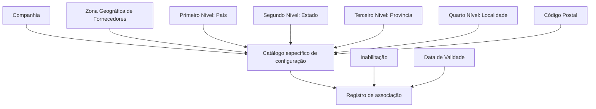

# Relação de Zonas Geográficas e Estrutura Geográfica em Fornecedores

## 1. Metadados do Documento
- **Arquivo de Origem:** Não identificado
- **Tipo de Documento:** Especificação Técnica / Funcional
- **Domínio / Sistema:** Reef — cadastro de Fornecedores e Estrutura Geográfica
- **Público-Alvo:** Analistas funcionais, desenvolvedores, arquitetura e operação
- **Data/Versão Identificada:** Não identificada; ciclo de vida indicado como `Approved`

---

## 2. Resumo Executivo & Contexto de Negócio

O documento descreve a capacidade funcional do núcleo do sistema de relacionar a **Estrutura Zonal de Fornecedores** com a **Estrutura Geográfica**, ou organização territorial, de um país. A associação é configurada em um catálogo específico disponibilizado inicialmente sem conteúdo para as entidades.

A configuração identifica a companhia, uma zona geográfica de fornecedores e até quatro níveis territoriais: país, estado, província e localidade. Um código postal também pode ser associado aos quatro níveis geográficos anteriores.

A associação pode ser inabilitada e possui uma data de validade. A data de validade determina a partir de quando o registro configurado passa a operar no sistema e permite preservar histórico de alterações geográficas ao longo do tempo.

O documento recomenda consultar os documentos funcionais vinculados, pois a interpretação isolada desta especificação pode conduzir a erro. Não são detalhados métodos de manutenção do catálogo, interfaces, regras de validação entre níveis, contratos de integração ou mecanismos técnicos de persistência.

---

## 3. Arquitetura, Componentes & Tecnologias Envolvidas

Os componentes funcionais explicitamente citados são:

| Componente | Papel identificado |
| :--- | :--- |
| Sistema / núcleo do Sistema | Possui a capacidade funcional de relacionar zonas geográficas de fornecedores com a estrutura territorial do país. |
| Catálogo específico de configuração | Local onde a associação é configurada; é fornecido vazio às entidades. |
| Estrutura Zonal de Fornecedores | Origem da zona geográfica associada à estrutura territorial. |
| Estrutura Geográfica | Organização territorial composta por até quatro níveis: país, estado, província e localidade. |
| Código Postal | Identificador associado aos quatro níveis geográficos anteriores. |
| Reef | Repositório ou contexto documental exibido na extração. |



> **Nota de Análise:** O documento descreve uma relação funcional e seus atributos, mas não detalha arquitetura técnica, APIs, banco de dados, microsserviços, protocolos ou ambientes de execução.

---

## 4. Regras de Negócio, Especificações Funcionais & Processos

1. O núcleo do Sistema deve permitir relacionar a Estrutura Zonal dos Fornecedores com a Estrutura Geográfica ou organização territorial do país.
2. A relação entre Zona Geográfica de Fornecedores e Estrutura Geográfica deve ser estabelecida em um catálogo específico de configuração.
3. O catálogo específico de configuração é fornecido vazio de conteúdo às entidades.
4. Cada associação deve informar o código da companhia para a qual está sendo configurada a associação da Zona Geográfica de Fornecedores à estrutura territorial.
5. Cada associação deve informar o código ou chave da Zona Geográfica de Fornecedores que está sendo configurada.
6. A Estrutura Geográfica pode conter os seguintes níveis identificados por chave:
   1. Primeiro nível: país.
   2. Segundo nível: estado.
   3. Terceiro nível: província.
   4. Quarto nível: localidade.
7. O Código Postal identifica o código postal associado aos quatro níveis anteriores da estrutura geográfica.
8. A propriedade de Inabilitação indica que a associação da Zona Geográfica à Estrutura Geográfica está desativada ou inabilitada para utilização.
9. A Data de Validade indica a data a partir da qual o registro configurado está operacional no Sistema.
10. O uso correto da Data de Validade permite manter histórico das alterações geográficas realizadas ao longo do tempo.
11. A leitura dos documentos funcionais vinculados é recomendada para evitar interpretações incorretas decorrentes da análise isolada desta especificação.

> **Nota de Análise:** O documento não informa se os quatro níveis geográficos são obrigatórios, quais validações são aplicadas ao Código Postal, como a inabilitação interage com a Data de Validade ou como conflitos entre registros históricos são resolvidos.

---

## 5. Tabelas de Parâmetros, Ambientes e Estruturas de Dados

| Item / Parâmetro | Descrição / Função | Tipo / Valores / Formato | Ambiente / Observações |
| :--- | :--- | :--- | :--- |
| Companhia | Contém o código da companhia para a qual a associação da Zona Geográfica de Fornecedores à estrutura territorial está sendo realizada. | Código da companhia; formato não detalhado. | Aplicável ao catálogo de configuração. |
| Código de Zona | Determina o código ou chave da Zona Geográfica de Fornecedores configurada no catálogo. | Código ou chave; formato não detalhado. | Aplicável ao catálogo de configuração. |
| Código do Primeiro Nível | Contém a chave que identifica o primeiro nível da Estrutura Geográfica. | Chave geográfica. | Primeiro nível: país. |
| Código do Segundo Nível | Identifica a chave do segundo nível da Estrutura Geográfica. | Chave geográfica. | Segundo nível: estado. |
| Código do Terceiro Nível | Identifica a chave do terceiro nível da Estrutura Geográfica. | Chave geográfica. | Terceiro nível: província. |
| Código do Quarto Nível | Identifica a chave do quarto nível da Estrutura Geográfica. | Chave geográfica. | Quarto nível: localidade. |
| Código Postal | Contém a chave que identifica o Código Postal associado aos quatro níveis prévios da estrutura geográfica. | Chave de Código Postal; formato não detalhado. | Associado aos níveis país, estado, província e localidade. |
| Inabilitação | Estabelece que a associação da Zona Geográfica à Estrutura Geográfica está desativada ou inabilitada para uso. | Estado de inabilitação; valores não detalhados. | Aplicável ao registro de associação. |
| Data de Validade | Indica a data a partir da qual o registro configurado está operacional no Sistema. | Data; formato não detalhado. | Permite histórico de mudanças geográficas. |
| Lifecycle | Estado de ciclo de vida exibido na documentação. | `Approved` | Metadado documental. |
| Owner | Proprietário exibido na documentação. | `user:agonzalez_mapfre.com` | Metadado documental extraído. |

---

## 6. Bateria de Perguntas & Respostas para RAG (FAQ Sintético)

### P1: Qual é o objetivo da relação entre Zonas Geográficas e Estrutura Geográfica em Fornecedores?
**R:** O objetivo é permitir que o núcleo do Sistema relacione a Estrutura Zonal dos Fornecedores com a Estrutura Geográfica ou organização territorial do país. Essa relação é mantida em um catálogo específico de configuração.

### P2: Onde a associação entre Zona Geográfica de Fornecedores e estrutura territorial é configurada?
**R:** A associação é configurada em um catálogo específico de configuração. O documento informa que esse catálogo é disponibilizado vazio de conteúdo às entidades.

### P3: Qual informação identifica a companhia em uma associação geográfica de fornecedores?
**R:** O atributo **Companhia** contém o código da companhia para a qual está sendo realizada a associação entre a Zona Geográfica de Fornecedores e a estrutura territorial do país.

### P4: Quais são os níveis da Estrutura Geográfica descritos no documento?
**R:** A Estrutura Geográfica possui quatro níveis citados: primeiro nível correspondente ao país, segundo nível correspondente ao estado, terceiro nível correspondente à província e quarto nível correspondente à localidade.

### P5: Qual é a finalidade do Código de Zona?
**R:** O **Código de Zona** determina o código ou a chave da Zona Geográfica de Fornecedores que está sendo configurada no catálogo específico.

### P6: Como o Código Postal se relaciona com a Estrutura Geográfica?
**R:** O Código Postal contém a chave que identifica o código postal associado aos quatro níveis prévios da estrutura geográfica: país, estado, província e localidade.

### P7: O que acontece quando uma associação é marcada como inabilitada?
**R:** A propriedade **Inabilitação** estabelece que a associação entre a Zona Geográfica e a Estrutura Geográfica está desativada ou inabilitada para ser utilizada.

### P8: Para que serve a Data de Validade do registro configurado?
**R:** A Data de Validade informa ao Sistema a data a partir da qual o registro configurado está operacional. O uso correto dessa data permite manter histórico das mudanças geográficas efetuadas ao longo do tempo.

### P9: O documento especifica APIs, métodos HTTP ou contratos de integração para o catálogo?
**R:** Não. O documento apresenta o objetivo funcional da associação e os seus atributos, mas não detalha APIs, métodos HTTP, contratos JSON, persistência de dados ou integrações técnicas.

### P10: Por que o documento recomenda a leitura de materiais vinculados?
**R:** O documento recomenda a leitura das diretrizes e documentos funcionais vinculados para evitar que a interpretação isolada da presente especificação conduza a erro.

---

## 7. Glossário de Termos, Siglas & Conceitos-Chave

- **Companhia:** Código da companhia sobre a qual é realizada a associação entre Zona Geográfica de Fornecedores e estrutura territorial.
- **Código de Zona:** Código ou chave da Zona Geográfica de Fornecedores configurada no catálogo.
- **Código Postal:** Chave que identifica o código postal associado aos quatro níveis da estrutura geográfica.
- **Data de Validade:** Data a partir da qual um registro configurado torna-se operacional no Sistema.
- **Estrutura Geográfica:** Organização territorial composta, no documento, por país, estado, província e localidade.
- **Estrutura Zonal de Fornecedores:** Estrutura de zonas geográficas aplicável aos fornecedores e relacionada à Estrutura Geográfica.
- **Inabilitação:** Propriedade que desativa ou impede a utilização de uma associação geográfica.
- **Reef:** Nome apresentado na navegação e na documentação extraída; o documento não fornece expansão ou definição adicional.
- **Zona Geográfica de Fornecedores:** Zona identificada por código ou chave e vinculada à estrutura territorial.

---

## 8. Notas Críticas, Riscos & Limitações

- O catálogo de configuração é informado como inicialmente vazio, mas o documento não descreve processo de carga, governança, aprovação ou responsáveis pela manutenção.
- Não há definição dos formatos, domínios de valores, obrigatoriedade ou unicidade dos atributos de companhia, zona, níveis territoriais, código postal e data de validade.
- Não há regra explícita para sobreposição de períodos de validade, substituição de associações ou tratamento de registros inabilitados com validade ativa.
- O documento não descreve mecanismos de auditoria, segurança, integração, APIs, persistência ou ambientes.
- A interpretação isolada é expressamente desaconselhada; devem ser considerados os vínculos para **Zonas Geográficas de Fornecedores** e **Estrutura Geográfica**.
- **Nota de Análise:** O conteúdo não detalha operações de consulta, inclusão, atualização ou exclusão para o catálogo de associação.

---

## 9. Conteúdo Bruto Estruturado (Referência Fiel)

```text
--- [PÁGINA 1 DE 2] ---

RELACIÓN de ZONAS GEOGRÁFICAS y ESTRUCTURA GEOGRÁFICA
en PROVEEDORES
Objetivo
Funcionalmente el núcleo del Sistema cuenta con la capacidad de poder relacionar la Estructura Zonal de los Proveedores con la Estructura
Geográca u organización territorial del país, relación que se establece en un catálogo especíco de conguración que se proporciona vacío
de contenido a las entidades.
Propiedades
Otras Propiedades
Propiedades
Compañía
Este Atributo del catálogo contiene el código de la compañía sobre la que se está realizando la asociación de la Zona Geográca de
Proveedores a la estructura territorial del país.
Código de Zona
Este Atributo determina el código o clave de la Zona Geográca de los Proveedores que se está congurando en el catálogo.
Código del Primer Nivel
Este atributo contiene la clave que identicará al Primer Nivel (país) de la estructura Geográca.
Código del Segundo Nivel
Este atributo identica especícamente la clave que identicará al Segundo Nivel (estado) de la estructura Geográca.
Código del Tercer Nivel
Este atributo identica especícamente la clave que identicará al Tercer Nivel (provincia) de la estructura Geográca.
Código del Cuarto Nivel
Este atributo identica especícamente la clave que identicará al Cuarto Nivel (localidad) de la estructura Geográca.
Código Postal
Esta Propiedad contiene la clave que identica el Código Postal asociado a los cuatro niveles previos de la estructura geográca.
Documentation / DOCUMENTACIÓN Reef
DOCUMENTACIÓN Reef
Mapfredocument
DOCUMENTACIÓN Reef
Owner
user:agonzalez_mapfre.com
Lifecycle
Approved Source
 / 
 VL
Buscar Inicio Soluciones Arquitecturas APIs Componentes Cloud Documentación Zeus Reef Ayuda
ES


--- [PÁGINA 2 DE 2] ---

Otras Propiedades
Inhabilitación
Esta propiedad establece que la Asociación de la Zona Geográca a la Estructura Geográca está desactivada o inhabilitada para poder ser
utilizada.
Fecha de Validez
Esta propiedad le indica al Sistema la fecha a partir de la cual el registro congurado está operativo en el sistema por lo que su correcto uso
permite tener un histórico de los cambios geográcos efectuados a lo largo del tiempo.
Vínculos
Relación de Directrices y Documentos funcionales cuya lectura recomendada para evitar que la interpretación aislada del presente
documento pueda conducir a error.
Zonas Geográcas de Proveedores
Estructura Geográca
Preguntas frecuentes
N/A
```
