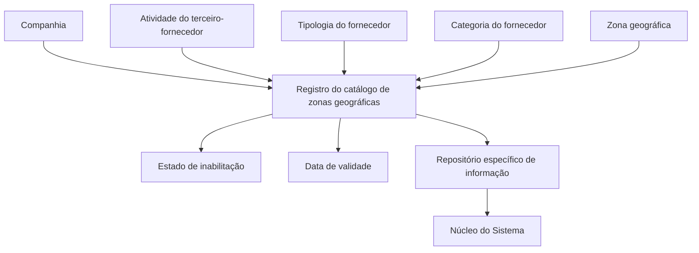

# Definição de Zonas Geográficas de Fornecedores por Atividade, Tipologia e Categoria

## 1. Metadados do Documento
- **Arquivo de Origem:** Não identificado no conteúdo fornecido
- **Tipo de Documento:** Especificação Funcional
- **Domínio / Sistema:** DOCUMENTACIÓN Reef / MAPFRE — catálogo de fornecedores
- **Público-Alvo:** Analistas funcionais, administradores de catálogo, equipes de negócio e operação
- **Data/Versão Identificada:** Não identificada

---

## 2. Resumo Executivo & Contexto de Negócio

O documento descreve a definição de zonas geográficas para fornecedores no núcleo do Sistema. A configuração associa a zona geográfica de um fornecedor à combinação de três classificações: atividade do terceiro-fornecedor, tipologia do fornecedor e categoria do fornecedor.

O repositório específico utilizado para armazenar essas definições é entregue inicialmente sem conteúdo. Portanto, cada entidade MAPFRE deve configurar os registros necessários para suportar seus processos e a posterior exploração das informações de fornecedores.

Cada registro do catálogo contém referências à companhia, à atividade do terceiro, à tipologia, à categoria e ao código da zona geográfica. O documento também prevê controles de inabilitação e de vigência para permitir que registros sejam desativados e que alterações sejam mantidas historicamente.

A documentação recomenda a leitura conjunta de documentos relacionados a atividades de terceiros, tipologias de fornecedores por atividade, categorias de fornecedores e zonas geográficas. Essa dependência documental busca evitar interpretações isoladas e incorretas da configuração.

---

## 3. Arquitetura, Componentes & Tecnologias Envolvidas

O conteúdo apresenta um modelo funcional de catálogo, sem detalhar tecnologias de implementação, APIs, banco de dados, microsserviços, métodos HTTP, contratos JSON, URLs de ambiente, servidores ou mecanismos de integração.

Os componentes funcionais identificados são:

- **Núcleo do Sistema:** disponibiliza a capacidade de atribuir zonas geográficas aos fornecedores.
- **Repositório específico de informação:** armazena os registros de definição de zonas geográficas; é entregue inicialmente vazio.
- **Catálogo de zonas geográficas de fornecedores:** contém as associações entre companhia, atividade, tipologia, categoria e zona.
- **MAPFRE:** entidade responsável por analisar a conveniência de usar transversalmente esse catálogo em seus processos.
- **DOCUMENTACIÓN Reef / Mapfredocument:** contexto documental apresentado na extração.



> **Nota de Análise:** o documento descreve atributos funcionais do catálogo, mas não especifica o modelo físico de dados, chaves, cardinalidades, telas, permissões, integrações ou mecanismos de persistência.

---

## 4. Regras de Negócio, Especificações Funcionais & Processos

1. O núcleo do Sistema permite atribuir zonas geográficas a fornecedores.
2. A atribuição de zonas geográficas deve considerar conjuntamente:
   - a atividade do terceiro-fornecedor;
   - a tipologia do fornecedor;
   - a categoria do fornecedor.
3. As definições devem ser armazenadas em um repositório específico de informação.
4. O repositório é entregue inicialmente vazio, sem conteúdo pré-configurado.
5. O atributo **Companhia** identifica o código da companhia para a qual o registro está sendo definido.
6. O atributo **Código de Atividade do Terceiro** estabelece o código da atividade do terceiro-fornecedor, desde que a atividade do terceiro o identifique como fornecedor.
7. O atributo **Tipologia** determina o código ou a chave do tipo de fornecedor configurado no catálogo.
8. O atributo **Categoria** determina o código ou a chave do tipo de fornecedor configurado no catálogo, conforme a redação original do documento.
9. O atributo **Código de Zona** determina o código ou a chave da divisão geográfica de fornecedores configurada no catálogo.
10. A propriedade **Inabilitação** indica que o registro configurado está desativado ou inabilitado.
11. A propriedade **Data de Validade** define a data a partir da qual o registro configurado está operacional no Sistema.
12. O uso correto da data de validade permite manter histórico das alterações realizadas ao longo do tempo.
13. Não existe preferência ou recomendação para estabelecer ou padronizar a codificação do catálogo no Sistema.
14. A entidade MAPFRE deve avaliar a conveniência de utilizar o catálogo de forma transversal nos processos corporativos, visando sua correta exploração posterior.
15. A leitura isolada do documento pode levar a erro de interpretação; recomenda-se consultar a documentação relacionada.

---

## 5. Tabelas de Parâmetros, Ambientes e Estruturas de Dados

| Item / Parâmetro | Descrição / Função | Tipo / Valores / Formato | Ambiente / Observações |
| :--- | :--- | :--- | :--- |
| Companhia | Código da companhia sobre a qual a definição do registro é realizada | Código de companhia | Aplicável ao registro do catálogo |
| Código de Atividade do Terceiro | Estabelece o código da atividade do terceiro-fornecedor | Código de atividade | Aplicável quando a atividade identifica o terceiro como fornecedor |
| Tipologia | Determina o código ou a chave do tipo de fornecedor configurado | Código ou chave | Associada à configuração do catálogo |
| Categoria | Determina o código ou a chave do tipo de fornecedor configurado, conforme texto original | Código ou chave | O documento não esclarece diferença funcional adicional entre tipologia e categoria |
| Código de Zona | Determina o código ou a chave da divisão geográfica dos fornecedores | Código ou chave | Associado à zona geográfica configurada |
| Inabilitação | Indica que o registro está desativado ou inabilitado | Estado lógico | Controle de ativação do registro |
| Data de Validade | Indica desde quando o registro está operacional no Sistema | Data | Permite histórico de alterações ao longo do tempo |
| Repositório específico | Repositório que armazena as definições de zona geográfica | Repositório de informação | Entregue inicialmente vazio |
| Codificação do catálogo | Codificação usada para registros do catálogo | Não padronizada pelo documento | MAPFRE deve avaliar uso transversal nos processos corporativos |

### Documentação funcional relacionada

| Documento / Diretriz | Relação com o catálogo |
| :--- | :--- |
| Atividades de los Terceros | Referência para a atividade do terceiro-fornecedor |
| Tipologías de Proveedores por Actividad | Referência para a tipologia do fornecedor por atividade |
| Categorías de Proveedores | Referência para a categoria do fornecedor |
| Zonas Geográficas | Referência para a divisão geográfica configurada |

---

## 6. Bateria de Perguntas & Respostas para RAG (FAQ Sintético)

### P1: Qual é o objetivo do catálogo de zonas geográficas de fornecedores?
**R:** O catálogo permite atribuir zonas geográficas aos fornecedores no núcleo do Sistema, considerando a atividade do terceiro-fornecedor, a tipologia do fornecedor e a categoria do fornecedor.

### P2: Quais atributos identificam uma definição de zona geográfica de fornecedor?
**R:** O documento identifica os atributos Companhia, Código de Atividade do Terceiro, Tipologia, Categoria e Código de Zona. Também existem as propriedades Inabilitação e Data de Validade.

### P3: O repositório de zonas geográficas já possui dados na instalação inicial?
**R:** Não. O documento informa que o repositório específico de informação é entregue inicialmente vazio de conteúdo.

### P4: Quando o Código de Atividade do Terceiro deve ser aplicado?
**R:** O Código de Atividade do Terceiro é estabelecido no Sistema quando a atividade do terceiro identifica esse terceiro como fornecedor.

### P5: Qual é a finalidade da propriedade Inabilitação?
**R:** A propriedade Inabilitação estabelece que o registro configurado está desativado ou inabilitado.

### P6: Para que serve a Data de Validade de um registro?
**R:** A Data de Validade indica a data a partir da qual o registro configurado está operacional no Sistema. O uso correto desse atributo permite manter histórico das alterações realizadas ao longo do tempo.

### P7: Existe um padrão obrigatório para a codificação do catálogo de serviços ou fornecedores?
**R:** Não. O documento declara que não existe preferência nem recomendação para estabelecer ou padronizar a codificação no Sistema.

### P8: Quem deve avaliar o uso transversal do catálogo nos processos corporativos?
**R:** A entidade MAPFRE deve analisar a conveniência de usar transversalmente o catálogo de informação em seus processos, para permitir sua correta exploração posterior.

### P9: Quais documentos devem ser lidos para evitar uma interpretação isolada incorreta?
**R:** O documento recomenda consultar as diretrizes e documentos funcionais sobre Atividades de Terceiros, Tipologias de Fornecedores por Atividade, Categorias de Fornecedores e Zonas Geográficas.

### P10: O documento especifica APIs, métodos HTTP ou contratos JSON para o catálogo?
**R:** Não. O conteúdo fornecido não detalha APIs, métodos HTTP, contratos JSON, tecnologias de implementação, ambientes técnicos ou integrações.

---

## 7. Glossário de Termos, Siglas & Conceitos-Chave

- **MAPFRE:** entidade mencionada como responsável por avaliar a conveniência de utilização transversal do catálogo nos processos da companhia.
- **DOCUMENTACIÓN Reef:** identificação documental exibida no conteúdo original.
- **Fornecedor / Proveedor:** terceiro cuja atividade o identifica como fornecedor no Sistema.
- **Atividade do Terceiro:** classificação da atividade de um terceiro; pode determinar sua identificação como fornecedor.
- **Tipologia:** código ou chave do tipo de fornecedor configurado no catálogo.
- **Categoria:** código ou chave do tipo de fornecedor configurado no catálogo, conforme a descrição apresentada no documento.
- **Zona Geográfica / División Geográfica:** código ou chave usado para representar a divisão geográfica atribuída aos fornecedores.
- **Inabilitação:** estado no qual um registro configurado está desativado ou inabilitado.
- **Data de Validade:** data a partir da qual um registro passa a estar operacional no Sistema.

---

## 8. Notas Críticas, Riscos & Limitações

- O repositório de informação é entregue vazio; a eficácia do catálogo depende da configuração inicial realizada pela entidade responsável.
- O documento não estabelece padrão de codificação. Essa flexibilidade pode gerar inconsistências entre processos caso a entidade MAPFRE não defina práticas internas de uso transversal.
- A interpretação isolada do documento pode levar a erro; a leitura dos documentos funcionais vinculados é explicitamente recomendada.
- O texto não detalha distinção funcional adicional entre os atributos **Tipologia** e **Categoria**, pois ambos são descritos como código ou chave do tipo de fornecedor.
- Não há detalhamento de tecnologia, integrações, banco de dados, APIs, permissões, validações de unicidade, regras de precedência entre registros ou tratamento de sobreposição de vigências.
- A extração contém caracteres possivelmente corrompidos, como `Geográcas`, `congurando` e `denición`; esses trechos foram preservados na referência bruta.

---

## 9. Conteúdo Bruto Estruturado (Referência Fiel)

```text
--- [PÁGINA 1 DE 2] ---

DEFINICIÓN de las ZONAS GEOGRÁFICAS por Actividad, Tipología y
Categoría del PROVEEDOR
Objetivo
Funcionalmente, el núcleo del Sistema cuenta con la posibilidad de asignar las Zonas Geográcas de los Proveedores de acuerdo con su
Actividad, Tipología y Categoría en un repositorio de información especíco que se entrega inicialmente a las instalaciones vacío de
contenido.
Propiedades
Otras Propiedades
Compañía
Este Atributo del catálogo contiene el código de la compañía sobre la que se está realizando la denición del Registro.
Código de Actividad del Tercero
Esta propiedad establece en el sistema el código de la Actividad del Tercero-Proveedor siempre y cuando la Actividad del Tercero lo
identique como tal.
Tipología
Este Atributo determina el código o clave del Tipo de Proveedor que se está congurando en el catálogo.
Categoría
Este Atributo determina el código o clave del Tipo de Proveedor que se está congurando en el catálogo.
Código de Zona
Este Atributo determina el código o clave de la División Geográca de los Proveedores que se está congurando en el catálogo.
Otras Propiedades
Inhabilitación
Esta propiedad establece que el Registro congurado está desactivado o inhabilitado.
Fecha de Validez
Esta propiedad le indica al Sistema la fecha a partir de la cual el registro congurado está operativo en el sistema por lo que su correcto uso
permite tener un histórico de los cambios efectuados a lo largo del tiempo.
Documentation / DOCUMENTACIÓN Reef
DOCUMENTACIÓN Reef
Mapfredocument
DOCUMENTACIÓN Reef
Owner
user:agonzalez_mapfre.com
Lifecycle
Approved Source
 / 
 VL
Buscar Inicio Soluciones Arquitecturas APIs Componentes Cloud Documentación Zeus Reef Ayuda
ES


--- [PÁGINA 2 DE 2] ---

Vínculos
Relación de Directrices y Documentos funcionales cuya lectura recomendada para evitar que la interpretación aislada del presente
documento pueda conducir a error.
Actividades de los Terceros
Tipologías de Proveedores por Actividad
Categorías de Proveedores
Zonas Geográcas
Preguntas frecuentes
(1) ¿Existe alguna recomendación operativa que deba ser tomada en consideración localmente en la codicación, uso y denición del
catálogo de Servicios de los Proveedores?
No existe una preferencia ni recomendación para establecer o estandarizar en el sistema su codicación, si bien la entidad MAPFRE debe
analizar la conveniencia de utilizar transversalmente en los procesos de la compañía este catálogo de información para su correcta y
posterior explotación.
```
