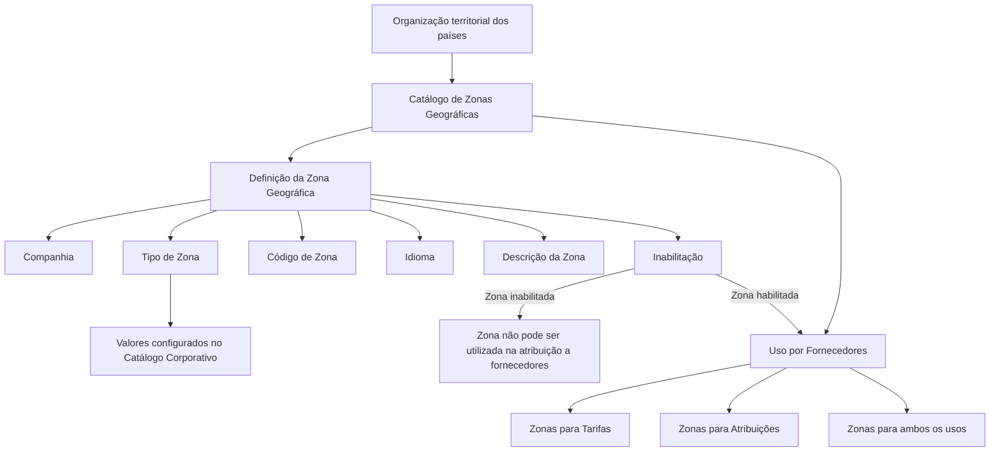
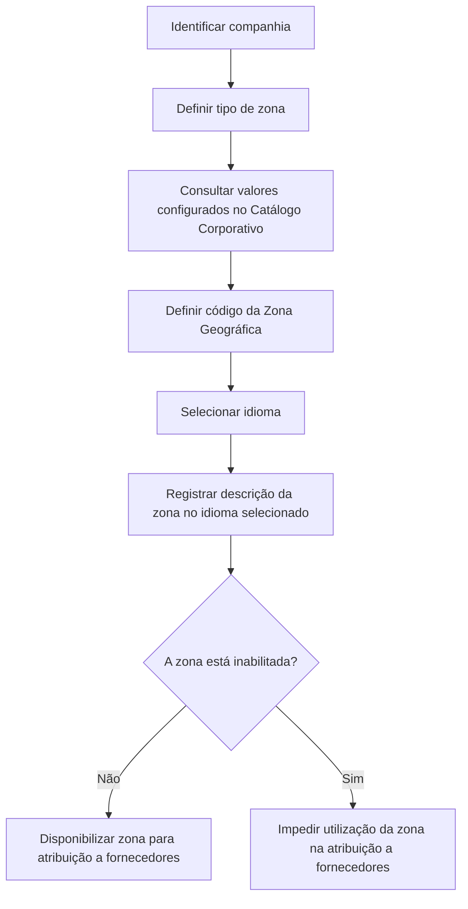

# Definição de Zonas Geográficas Configuradas para Fornecedores

## 1. Metadados do Documento
- **Arquivo de Origem:** `Não identificado no conteúdo fornecido`
- **Tipo de Documento:** `Especificação Técnica / Funcional`
- **Domínio / Sistema:** `REEF / MAPFRE — Catálogo de Zonas Geográficas para Fornecedores`
- **Público-Alvo:** `Negócio, Operação, Analistas Funcionais e equipes responsáveis pela configuração de catálogos`
- **Data/Versão Identificada:** `Não identificada`
- **Status identificado:** `Approved`
- **Owner identificado:** `user:agonzalez_mapfre.com`

---

## 2. Resumo Executivo & Contexto de Negócio

O documento descreve a definição e a configuração de um catálogo de **Zonas Geográficas** utilizado por fornecedores da entidade. O núcleo do sistema permite dividir a organização territorial dos países em divisões, também denominadas Zonas Geográficas, para uso específico pelos fornecedores.

A configuração de cada Zona Geográfica é composta por atributos que identificam a companhia, o tipo de zona, o código da divisão geográfica, o idioma e a descrição apresentada naquele idioma. A configuração também permite determinar se uma zona está inabilitada, impedindo sua utilização na atribuição a fornecedores.

O documento apresenta exemplos de codificação de zonas relacionadas a **Tarifas**, como `1 — ZONA 1 - TARIFA`, e de zonas relacionadas a **Atribuições de Fornecedores**, como `A — ZONA A - ASIGNACIÓN`. Também há exemplos de códigos destinados simultaneamente aos dois usos, como `1A — ZONA 1A - AMBAS`.

Não existe preferência ou recomendação corporativa explícita para padronizar a codificação das Zonas Geográficas no sistema. Contudo, o documento recomenda que a entidade MAPFRE analise a conveniência de usar transversalmente esse catálogo nos processos da companhia, especialmente para separar zonas de Tarifas das zonas de Atribuições de Fornecedores e permitir exploração posterior correta das informações.

---

## 3. Arquitetura, Componentes & Tecnologias Envolvidas

Os elementos identificados no conteúdo são:

- **Sistema núcleo:** disponibiliza a divisão territorial de países em Zonas Geográficas.
- **Catálogo de Zonas Geográficas:** repositório lógico onde são configuradas as divisões geográficas.
- **Fornecedores:** consumidores funcionais das Zonas Geográficas configuradas.
- **Entidade / Companhia:** contexto corporativo sobre o qual a definição de zona é realizada.
- **Catálogo Corporativo:** fonte de valores configurados utilizada para determinar o Tipo de Zona.
- **REEF:** contexto de documentação indicado como `DOCUMENTACIÓN Reef`.
- **MAPFRE:** entidade mencionada como responsável por analisar o uso transversal do catálogo.

> **Nota de Análise:** O conteúdo não descreve tecnologias de implementação, bancos de dados, APIs, métodos HTTP, contratos JSON, URLs de ambiente, servidores, integrações técnicas ou microsserviços.



---

## 4. Regras de Negócio, Especificações Funcionais & Processos

### 4.1 Finalidade funcional

1. O núcleo do sistema permite dividir a organização territorial dos países em divisões ou Zonas Geográficas.
2. As Zonas Geográficas possuem emprego específico pelos fornecedores da entidade.
3. A definição da Zona Geográfica é realizada em um catálogo.

### 4.2 Regras dos atributos da Zona Geográfica

1. O atributo **Companhia** contém o código da companhia sobre a qual está sendo realizada a definição da Zona Geográfica.
2. O atributo **Tipo de Zona** determina e especifica o tipo da zona conforme o uso que a divisão geográfica terá.
3. Os valores de **Tipo de Zona** dependem dos valores configurados no Catálogo Corporativo.
4. O atributo **Código de Zona** determina o código ou chave da Divisão Geográfica configurada no catálogo.
5. A propriedade **Idioma** é a chave do idioma utilizada na configuração da Zona Geográfica.
6. O documento fornece como exemplos de idiomas: espanhol, inglês e alemão.
7. A propriedade **Descrição da Zona** contém a denominação ou descrição da Zona Geográfica conforme o idioma empregado na definição.
8. A propriedade **Inabilitação** estabelece que a chave da Zona Geográfica está desativada ou inabilitada para uso em sua atribuição a fornecedores.

### 4.3 Categorias exemplificadas de Zonas Geográficas

O documento apresenta exemplos de três usos de zonas:

1. **Zonas relacionadas a Tarifas**
   - Exemplos: `1 — ZONA 1 - TARIFA` e `2 — ZONA 2 - TARIFA`.

2. **Zonas relacionadas a Atribuições de Fornecedores**
   - Exemplos: `A — ZONA A - ASIGNACIÓN` e `B — ZONA B - ASIGNACIÓN`.

3. **Zonas relacionadas simultaneamente a Tarifas e Atribuições**
   - Exemplos: `1A — ZONA 1A - AMBAS` e `2B — ZONA 2B - AMBAS`.

### 4.4 Diretriz de codificação e uso transversal

1. Não existe preferência ou recomendação estabelecida para codificação ou padronização das Zonas Geográficas no sistema.
2. A entidade MAPFRE deve analisar a conveniência de utilizar transversalmente o catálogo de Zonas Geográficas nos processos da companhia.
3. A utilização transversal tem como finalidade a correta exploração posterior das informações.
4. O documento sugere distinguir a codificação das zonas relacionadas a Tarifas das zonas relacionadas às Atribuições de Fornecedores.

### 4.5 Fluxo funcional de configuração e utilização



---

## 5. Tabelas de Parâmetros, Ambientes e Estruturas de Dados

### 5.1 Propriedades da configuração de Zona Geográfica

| Item / Parâmetro | Descrição / Função | Tipo / Valores / Formato | Ambiente / Observações |
| :--- | :--- | :--- | :--- |
| Companhia | Contém o código da companhia sobre a qual é realizada a definição da Zona Geográfica. | Código de companhia; formato não detalhado. | Aplicável à definição da zona no catálogo. |
| Tipo de Zona | Determina e especifica o tipo da zona conforme o uso da divisão geográfica. | Valores configurados no Catálogo Corporativo. | O documento não lista os valores completos do catálogo. |
| Código de Zona | Determina o código ou chave da Divisão Geográfica configurada. | Código ou chave; formato não detalhado. | Exemplos: `1`, `2`, `A`, `B`, `1A`, `2B`. |
| Idioma | Chave do idioma utilizada na configuração da Zona Geográfica. | Exemplos: espanhol, inglês e alemão. | Utilizado para definir a descrição da zona. |
| Descrição da Zona | Denominação ou descrição da Zona Geográfica de acordo com o idioma configurado. | Texto descritivo. | Associada ao idioma da definição. |
| Inabilitação | Indica que a chave da Zona Geográfica está desativada ou inabilitada. | Estado habilitada/inabilitada; valores técnicos não detalhados. | Zona inabilitada não pode ser utilizada na atribuição a fornecedores. |

### 5.2 Exemplos de códigos e descrições de zonas

| Código de Zona | Descrição da Zona | Uso indicado no documento | Observações |
| :--- | :--- | :--- | :--- |
| `1` | `ZONA 1 - TARIFA` | Tarifas | Exemplo apresentado para definição em espanhol. |
| `2` | `ZONA 2 - TARIFA` | Tarifas | Exemplo apresentado para definição em espanhol. |
| `A` | `ZONA A - ASIGNACIÓN` | Atribuições de Fornecedores | Exemplo apresentado no documento. |
| `B` | `ZONA B - ASIGNACIÓN` | Atribuições de Fornecedores | Exemplo apresentado no documento. |
| `1A` | `ZONA 1A - AMBAS` | Tarifas e Atribuições | Exemplo de zona para ambos os usos. |
| `2B` | `ZONA 2B - AMBAS` | Tarifas e Atribuições | Exemplo de zona para ambos os usos. |

### 5.3 Informações documentais identificadas

| Item / Parâmetro | Descrição / Função | Tipo / Valores / Formato | Ambiente / Observações |
| :--- | :--- | :--- | :--- |
| Contexto documental | `DOCUMENTACIÓN Reef` | Referência documental. | Também aparecem as expressões `Documentation / DOCUMENTACIÓN Reef` e `Mapfredocument`. |
| Owner | Responsável exibido na página documental. | `user:agonzalez_mapfre.com` | Não há detalhamento de papel ou responsabilidade. |
| Lifecycle | Ciclo de vida documental. | `Approved` | Valor exibido no conteúdo bruto. |
| Identificador adicional | Valor exibido junto ao conteúdo documental. | `VL` | Significado não detalhado. |
| Vínculos | Relação de diretrizes e documentos funcionais recomendados. | Não listados no conteúdo fornecido. | A leitura é recomendada para evitar interpretação isolada incorreta. |
| Idiomas | Seção mencionada no documento. | Conteúdo não detalhado. | Não há lista adicional além dos exemplos de espanhol, inglês e alemão. |

---

## 6. Bateria de Perguntas & Respostas para RAG (FAQ Sintético)

### P1: Qual é o objetivo das Zonas Geográficas configuradas para fornecedores?
**R:** As Zonas Geográficas permitem que o núcleo do sistema divida a organização territorial dos países em divisões geográficas destinadas ao uso específico por fornecedores da entidade. Essas divisões são definidas e mantidas em um catálogo de Zonas Geográficas.

### P2: Quais atributos formam a definição de uma Zona Geográfica?
**R:** A definição de uma Zona Geográfica inclui Companhia, Tipo de Zona, Código de Zona, Idioma, Descrição da Zona e Inabilitação. A Companhia identifica o contexto corporativo da definição; o Tipo de Zona estabelece o uso da divisão; o Código de Zona identifica a divisão geográfica; o Idioma define a chave linguística; a Descrição da Zona fornece a denominação no idioma selecionado; e a Inabilitação impede o uso da zona na atribuição a fornecedores.

### P3: Como o Tipo de Zona é determinado?
**R:** O Tipo de Zona é determinado conforme o uso que a divisão geográfica terá. Os valores disponíveis para esse atributo são aqueles configurados no Catálogo Corporativo. O documento não apresenta a lista completa de tipos ou os valores técnicos configurados nesse catálogo.

### P4: Qual é a finalidade do atributo Companhia na configuração de uma Zona Geográfica?
**R:** O atributo Companhia contém o código da companhia sobre a qual está sendo realizada a definição da Zona Geográfica. Portanto, a configuração da zona é contextualizada pela companhia indicada nesse atributo.

### P5: Como o idioma afeta a descrição de uma Zona Geográfica?
**R:** O idioma é a chave linguística utilizada durante a configuração da Zona Geográfica. A Descrição da Zona deve conter a denominação da zona conforme o idioma utilizado na definição. O documento cita espanhol, inglês e alemão como exemplos de idiomas.

### P6: O que ocorre quando uma Zona Geográfica está inabilitada?
**R:** Quando a propriedade Inabilitação estabelece que a chave da Zona Geográfica está desativada ou inabilitada, essa zona não pode ser utilizada em sua atribuição a fornecedores.

### P7: O documento estabelece uma padronização obrigatória para a codificação de Zonas Geográficas?
**R:** Não. O documento afirma que não existe preferência ou recomendação para estabelecer ou padronizar a codificação das Zonas Geográficas no sistema. Ainda assim, recomenda-se que a entidade MAPFRE avalie a conveniência de utilizar transversalmente esse catálogo para exploração correta das informações.

### P8: Quais usos de Zonas Geográficas são exemplificados no documento?
**R:** O documento apresenta zonas relacionadas a Tarifas, zonas relacionadas a Atribuições de Fornecedores e zonas relacionadas a ambos os usos. Os exemplos são `1` e `2` para Tarifas, `A` e `B` para Atribuições e `1A` e `2B` para ambos.

### P9: Como o documento sugere diferenciar zonas de Tarifas e zonas de Atribuições?
**R:** O documento sugere que a entidade MAPFRE analise a conveniência de agrupar e distinguir a codificação das Zonas Geográficas relacionadas a Tarifas daquelas relacionadas às Atribuições de Fornecedores. Essa orientação é apresentada como exemplo de uso transversal do catálogo, e não como uma regra obrigatória de codificação.

### P10: Quais informações técnicas de integração são fornecidas para o catálogo de Zonas Geográficas?
**R:** O conteúdo não fornece informações sobre APIs, métodos HTTP, contratos JSON, bancos de dados, servidores, URLs, portas, microsserviços ou tecnologias de implementação. O foco do documento é funcional: propriedades da configuração, exemplos de códigos e regras de utilização pelas áreas de fornecedores.

### P11: Por que o documento recomenda consultar diretrizes e documentos funcionais vinculados?
**R:** O documento informa que há uma relação de diretrizes e documentos funcionais cuja leitura é recomendada para evitar que a interpretação isolada do documento de Zonas Geográficas conduza a erro. Os documentos vinculados não são enumerados no conteúdo fornecido.

---

## 7. Glossário de Termos, Siglas & Conceitos-Chave

- **Zona Geográfica:** Divisão geográfica da organização territorial dos países, configurada em catálogo para uso específico por fornecedores.
- **Divisão Geográfica:** Organização territorial identificada por um Código de Zona.
- **Catálogo de Zonas Geográficas:** Catálogo no qual são configuradas as Zonas Geográficas.
- **Catálogo Corporativo:** Catálogo que contém os valores configurados utilizados pelo atributo Tipo de Zona.
- **Companhia:** Código da companhia sobre a qual a definição da Zona Geográfica é realizada.
- **Tipo de Zona:** Atributo que determina e especifica o tipo de zona conforme o uso da divisão geográfica.
- **Código de Zona:** Código ou chave da Divisão Geográfica configurada.
- **Inabilitação:** Propriedade que desativa ou inabilita uma Zona Geográfica para sua atribuição a fornecedores.
- **Fornecedor / Proveedor:** Entidade que utiliza as Zonas Geográficas configuradas.
- **Tarifa:** Uso exemplificado para determinadas Zonas Geográficas.
- **Asignación:** Uso exemplificado para Zonas Geográficas destinadas à atribuição de fornecedores.
- **AMBAS:** Indicação apresentada nos exemplos para Zonas Geográficas relacionadas simultaneamente a Tarifas e Atribuições.
- **MAPFRE:** Entidade mencionada como responsável por analisar a conveniência de uso transversal do catálogo.
- **REEF:** Nome presente nas referências de documentação como `DOCUMENTACIÓN Reef`; seu significado não é detalhado no conteúdo fornecido.
- **VL:** Identificador exibido no conteúdo documental; seu significado não é detalhado.

---

## 8. Notas Críticas, Riscos & Limitações

- O documento não define uma padronização obrigatória para a codificação das Zonas Geográficas.
- A ausência de convenção formal de códigos pode gerar divergências entre zonas usadas para Tarifas, Atribuições de Fornecedores e ambos os usos.
- O próprio documento recomenda que MAPFRE avalie o uso transversal do catálogo para assegurar a exploração correta e posterior das informações.
- A leitura isolada do documento pode conduzir a erro; o conteúdo recomenda consultar diretrizes e documentos funcionais vinculados, mas esses vínculos não foram fornecidos.
- O documento não detalha valores possíveis para Tipo de Zona, embora indique que eles dependem do Catálogo Corporativo.
- Não há detalhamento sobre processos de aprovação, governança do catálogo, responsáveis pela manutenção, trilha de auditoria, validações técnicas ou comportamento de sistemas integrados.
- Não foram fornecidos detalhes de APIs, endpoints, modelos de dados, formatos de persistência, URLs, ambientes, servidores, credenciais ou tecnologias de implementação.
- O significado de `VL`, bem como o significado expandido de `REEF`, não está definido no conteúdo fornecido.

---

## 9. Conteúdo Bruto Estruturado (Referência Fiel)

```text
--- [PÁGINA 1 DE 2] ---

DEFINICIÓN de las ZONAS GEOGRÁFICAS conguradas para
PROVEEDORES
Objetivo
Funcionalmente el núcleo del Sistema cuenta con la posibilidad de dividir la organización territorial de los países en divisiones o Zonas
Geográcas para su empleo especíco por parte de los Proveedores de la Entidad.
Propiedades
Otras Propiedades
Propiedades
Compañía
Este Atributo del catálogo contiene el código de la compañía sobre la que se está realizando la denición de la Zona Geográca.
Tipo de Zona
Este Atributo determina y especica el Tipo de Zona de acuerdo con el uso que va a tener la división geográca y los valores que estén
congurados en el catálogo Corporativo.
Código de Zona
Este Atributo determina el código o clave de la División Geográca que se está congurando en el catálogo.
Idioma
Esta propiedad es la clave del Idioma empleado en la conguración de la Zona Geográca, como por ejemplo: español, inglés, alemán, ...
Descripción de la Zona
Esta propiedad contiene la denominación o descripción de la Zona o División Geográca de acuerdo con el idioma utilizado en la denición.
A modo de ejemplo si el idioma de la denición fuera el español...
ZONA DESCRIPCIÓN
1 ZONA 1 - TARIFA
2 ZONA 2 - TARIFA
Documentation / DOCUMENTACIÓN Reef
DOCUMENTACIÓN Reef
Mapfredocument
DOCUMENTACIÓN Reef
Owner
user:agonzalez_mapfre.com
Lifecycle
Approved Source
 / 
 VL
Buscar Inicio Soluciones Arquitecturas APIs Componentes Cloud Documentación Zeus Reef Ayuda
ES


--- [PÁGINA 2 DE 2] ---

ZONA DESCRIPCIÓN
A ZONA A - ASIGNACIÓN
B ZONA B - ASIGNACIÓN
... ...
1A ZONA 1A - AMBAS
2B ZONA 2B - AMBAS
... ...
Otras Propiedades
Inhabilitación
Esta propiedad establece que la clave de la Zona Geográca está desactivada o inhabilitada para poder ser utilizada en su asignación a los
Proveedores.
Vínculos
Relación de Directrices y Documentos funcionales cuya lectura recomendada para evitar que la interpretación aislada del presente
documento pueda conducir a error.
Idiomas
Preguntas frecuentes
(1) ¿Existe alguna recomendación operativa que deba ser tomada en consideración localmente en la codicación, uso y denición del
catálogo de Zonas Geográcas de los Proveedores?
No existe una preferencia ni recomendación para establecer o estandarizar en el sistema su codicación, si bien la entidad MAPFRE debe
analizar la conveniencia de utilizar transversalmente en los procesos de la compañía este catálogo de información para su correcta y
posterior explotación, e.g:
Agrupando y distinguiendo la codicación de las Zonas relacionadas con Tarifas de aquellas Zonas relacionadas con las Asignaciones de los
Proveedores.
```
