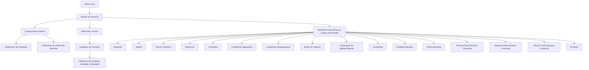

# Configuração de Terceiros por Código de Atividade no REEF Core

## 1. Metadados do Documento
- **Arquivo de Origem:** Não identificado no conteúdo extraído
- **Tipo de Documento:** Manual Operacional / Configuração Funcional
- **Domínio / Sistema:** REEF Core — Módulo de Terceiros
- **Público-Alvo:** Administradores funcionais, analistas de negócio, configuradores e equipes de operação do REEF Core
- **Data/Versão Identificada:** Não identificada
- **Estado do Documento Identificado:** `Approved`
- **Owner Identificado:** `user:agonzalez_mapfre.com`

---

## 2. Resumo Executivo & Contexto de Negócio

O documento apresenta a organização das definições e configurações aplicáveis ao **Módulo de Terceiros** da instalação **REEF Core**. O objetivo central é orientar a configuração de elementos associados a Terceiros conforme os respectivos **Códigos de Atividade**.

No contexto apresentado, os termos **Personas Físicas**, **Personas Jurídicas** e **Terceros** são tratados como sinônimos. Portanto, a documentação do módulo pode utilizar essas expressões indistintamente para se referir às entidades cadastradas e configuradas no Módulo de Terceiros.

A estrutura de configuração é dividida em três níveis principais: configurações prévias do sistema, definições comuns independentes do Código de Atividade e definições específicas organizadas por Código de Atividade. As configurações prévias possuem impacto transversal e são necessárias para a correta definição dos Terceiros, embora não sejam exclusivas do módulo.

O documento também identifica a existência de catálogos de Terceiros reutilizáveis por qualquer atividade e operação do módulo. Para configurações específicas, o conteúdo lista categorias como Segurado, Agente, Supervisor, Tramitador, Companhias, Entidades Bancárias, níveis de estrutura comercial e Provedor.

Não há detalhamento de campos, contratos de integração, métodos HTTP, persistência, regras de cálculo, URLs de ambiente ou procedimentos operacionais passo a passo. O material funciona como uma visão estrutural e classificatória das configurações documentadas para o Módulo de Terceiros.

---

## 3. Arquitetura, Componentes & Tecnologias Envolvidas

### Componentes e conceitos identificados

| Componente / Conceito | Função descrita no documento | Observações |
| :--- | :--- | :--- |
| REEF Core | Aplicação na qual ocorre a configuração do Módulo de Terceiros. | O documento também utiliza a grafia `Reef.core`. |
| Módulo de Terceiros | Módulo cuja funcionalidade e usabilidade são afetadas por parâmetros específicos. | Organiza Terceiros por Código de Atividade. |
| Parâmetros de Instalação | Parâmetros que afetam transversalmente o comportamento da aplicação. | Classificados como configurações prévias. |
| Parâmetros do Módulo de Terceiros | Parâmetros que afetam funcionalidade e usabilidade do módulo. | Aplicáveis à instalação REEF Core. |
| Definições Comuns | Definições de Terceiros aplicáveis independentemente do Código de Atividade. | Incluem Catálogos de Terceiros. |
| Catálogos de Terceiros | Catálogos utilizáveis com qualquer Atividade e Operação do Módulo de Terceiros. | O documento não descreve os campos dos catálogos. |
| Definições Específicas | Configurações do Módulo de Terceiros organizadas por Código de Atividade. | Incluem diversas categorias de Terceiros. |
| Asteriscos das Tarjetas | Indicadores de obrigatoriedade de definição de um elemento na configuração de Terceiros. | Não são detalhados exemplos de campos obrigatórios. |
| Mapfredocument | Referência de navegação/documentação exibida no conteúdo. | Sem detalhamento funcional adicional. |
| Zeus | Item de navegação exibido na barra do portal. | Sem relação funcional detalhada com o Módulo de Terceiros. |



**Nota de Análise:** O documento descreve a estrutura de configuração e as categorias de Código de Atividade, mas não detalha arquitetura técnica, bancos de dados, integrações, APIs, tecnologias de implementação ou topologia de ambientes.

---

## 4. Regras de Negócio, Especificações Funcionais & Processos

### 4.1 Equivalência terminológica

1. O documento estabelece que **Personas Físicas** e **Personas Jurídicas** são termos sinônimos de **Terceros**.
2. A redação e o detalhamento dos documentos do Módulo de Terceiros podem utilizar esses termos indistintamente.
3. A equivalência é contextual ao Módulo de Terceiros descrito no REEF Core.

### 4.2 Organização das configurações

1. As configurações prévias são configurações do sistema que não afetam exclusivamente o Módulo de Terceiros.
2. Apesar de não serem exclusivas do módulo, as configurações prévias são necessárias para realizar uma correta definição dos Terceiros.
3. Os parâmetros de instalação afetam transversalmente o comportamento da aplicação.
4. Os parâmetros do Módulo de Terceiros afetam a funcionalidade e a usabilidade do Módulo de Terceiros na instalação REEF Core.
5. As definições comuns são aplicáveis aos Terceiros independentemente do Código de Atividade associado.
6. Os Catálogos de Terceiros podem ser utilizados com qualquer Atividade e Operação do Módulo de Terceiros.
7. As definições específicas do Módulo de Terceiros são organizadas por Código de Atividade.

### 4.3 Obrigatoriedade de definição

1. Os asteriscos apresentados nas Tarjetas indicam a obrigatoriedade da definição de um elemento na configuração dos Terceiros.
2. O documento não informa quais elementos, campos ou cartões possuem asteriscos.
3. O documento também não especifica o comportamento do sistema quando uma definição obrigatória não for configurada.

### 4.4 Códigos de Atividade e uso de catálogos

| Código de Atividade / Categoria | Uso descrito |
| :--- | :--- |
| Asegurado | Definição nos Catálogos de Terceiros utilizados com os Segurados. |
| Agente | Definição nos Catálogos de Terceiros utilizados com os Agentes. |
| Tercero Genérico | Definição nos Catálogos de Terceiros utilizados com os Terceiros Genéricos. |
| Supervisor | Definição nos Catálogos de Terceiros utilizados com os Supervisores de Sinistros. |
| Tramitador | Definição nos Catálogos de Terceiros utilizados com os Tramitadores de Sinistros. |
| Compañía Aseguradora | Definição nos Catálogos de Terceiros utilizados com as Companhias Seguradoras. |
| Compañía Reaseguradora | Definição nos Catálogos de Terceiros utilizados com as Companhias Resseguradoras. |
| Broker de Seguros | Definição nos Catálogos de Terceiros utilizados com os Brokers de Seguros. |
| Empleado de Agencia/Agente | Definição nos Catálogos de Terceiros utilizados com os Empregados de Agências ou Agentes. |
| Compañía | Definição nos Catálogos de Terceiros utilizados com as Companhias do Sistema. |
| Entidad Bancaria | Definição nos Catálogos de Terceiros utilizados com as Entidades Bancárias do Sistema. |
| Oficina Bancaria | Definição nos Catálogos de Terceiros utilizados com as Oficinas Bancárias pertencentes às Entidades Bancárias. |
| Primer Nivel Estructura Comercial | Definição nos Catálogos de Terceiros utilizados no Primeiro Nível da Estrutura Comercial. |
| Segundo Nivel Estructura Comercial | Definição nos Catálogos de Terceiros utilizados no Segundo Nível da Estrutura Comercial. |
| Tercer Nivel Estructura Comercial | Definição nos Catálogos de Terceiros utilizados no Terceiro Nível da Estrutura Comercial. |
| Proveedor | Definição nos Catálogos de Provedores utilizados com os Provedores, desde que o Código de Atividade do Terceiro o identifique como Provedor. |

---

## 5. Tabelas de Parâmetros, Ambientes e Estruturas de Dados

### 5.1 Parâmetros e níveis de configuração

| Item / Parâmetro | Descrição / Função | Tipo / Valores / Formato | Ambiente / Observações |
| :--- | :--- | :--- | :--- |
| Configurações Prévias | Configurações do sistema necessárias para a correta definição de Terceiros. | Nível de configuração. | Não afetam exclusivamente o Módulo de Terceiros. |
| Parâmetros de Instalação | Configuram parâmetros que afetam transversalmente o comportamento da aplicação. | Parâmetros de instalação. | Aplicação REEF Core; valores não detalhados. |
| Parâmetros do Módulo de Terceiros | Configuram parâmetros que afetam funcionalidade e usabilidade do módulo. | Parâmetros de módulo. | Instalação REEF Core; valores não detalhados. |
| Definições Comuns | Definições de Terceiros independentes do Código de Atividade. | Nível de definição. | Aplicável a todos os Códigos de Atividade. |
| Catálogos de Terceiros | Catálogos que podem ser utilizados com qualquer Atividade e Operação do módulo. | Catálogos funcionais. | Campos, valores e manutenção não detalhados. |
| Definições Específicas | Definições organizadas por Código de Atividade. | Nível de definição. | Aplicável às categorias listadas no documento. |
| Asteriscos das Tarjetas | Indicam obrigatoriedade de definição de um elemento. | Indicador visual de obrigatoriedade. | Elementos obrigatórios específicos não identificados. |

### 5.2 Ambientes, servidores, URLs e logs

| Item / Parâmetro | Descrição / Função | Tipo / Valores / Formato | Ambiente / Observações |
| :--- | :--- | :--- | :--- |
| Ambientes | Não identificados no conteúdo fornecido. | Não aplicável. | O texto não informa ambientes de desenvolvimento, teste, homologação ou produção. |
| Servidores | Não identificados no conteúdo fornecido. | Não aplicável. | Não há hostnames, endereços IP, portas ou mapeamento de servidores. |
| URLs | Não identificadas no conteúdo fornecido. | Não aplicável. | Há apenas itens de navegação do portal, sem URL explícita. |
| Logs | Não identificados no conteúdo fornecido. | Não aplicável. | Não há caminhos, níveis, formatos ou ferramentas de monitoramento. |
| Estruturas de dados | Não identificadas no conteúdo fornecido. | Não aplicável. | Não há campos, tabelas físicas, contratos JSON ou esquemas. |

---

## 6. Bateria de Perguntas & Respostas para RAG (FAQ Sintético)

### P1: Qual é o objetivo do documento sobre Terceiros no REEF Core?
**R:** O documento descreve a organização das configurações e definições do Módulo de Terceiros no REEF Core. O foco é apresentar elementos configuráveis de acordo com o Código de Atividade que pode estar associado a cada Terceiro.

### P2: Personas Físicas, Personas Jurídicas e Terceros representam conceitos diferentes?
**R:** Não. O documento estabelece que Personas Físicas e Personas Jurídicas são termos sinônimos de Terceros no contexto do Módulo de Terceiros. Por esse motivo, a documentação do módulo pode utilizar as três expressões indistintamente.

### P3: O que são as Configurações Prévias no Módulo de Terceiros?
**R:** Configurações Prévias são configurações do sistema que não afetam exclusivamente o Módulo de Terceiros, mas são necessárias para realizar uma correta definição dos Terceiros.

### P4: Qual é a função dos Parâmetros de Instalação?
**R:** Os Parâmetros de Instalação configuram parâmetros que afetam transversalmente o comportamento da aplicação. O documento não especifica os nomes, formatos ou valores desses parâmetros.

### P5: O que os Parâmetros do Módulo de Terceiros controlam?
**R:** Os Parâmetros do Módulo de Terceiros afetam a funcionalidade e a usabilidade do Módulo de Terceiros na instalação REEF Core. O conteúdo fornecido não detalha parâmetros individuais ou seus valores permitidos.

### P6: Quando devem ser utilizadas as Definições Comuns de Terceiros?
**R:** As Definições Comuns devem ser utilizadas para configurações de Terceiros que se aplicam independentemente do Código de Atividade associado ao Terceiro.

### P7: Para que servem os Catálogos de Terceiros?
**R:** Os Catálogos de Terceiros são configurações de catálogos que podem ser utilizadas com qualquer Atividade e Operação do Módulo de Terceiros. O documento não descreve campos, manutenção, regras de validação ou valores desses catálogos.

### P8: Como identificar elementos obrigatórios na configuração de Terceiros?
**R:** Os asteriscos apresentados nas Tarjetas indicam a obrigatoriedade de definição de um elemento na configuração dos Terceiros. O documento não identifica quais elementos específicos possuem esse indicador.

### P9: Quais Códigos de Atividade relacionados a seguros são listados?
**R:** O documento lista, entre outros, Asegurado, Agente, Supervisor de Sinistros, Tramitador de Sinistros, Compañía Aseguradora, Compañía Reaseguradora, Broker de Seguros e Empleado de Agencia/Agente.

### P10: Qual condição deve ser atendida para aplicar a definição de Proveedor?
**R:** A definição de Proveedor é utilizada com Provedores desde que o Código de Atividade do Terceiro o identifique como um Provedor.

### P11: Como são tratadas as entidades bancárias no Módulo de Terceiros?
**R:** O documento prevê definições nos Catálogos de Terceiros para Entidades Bancárias do Sistema e para Oficinas Bancárias pertencentes a essas Entidades Bancárias.

### P12: Quais níveis de Estrutura Comercial possuem definições específicas?
**R:** O documento lista definições específicas para o Primeiro Nível, Segundo Nível e Terceiro Nível da Estrutura Comercial, utilizando Catálogos de Terceiros para cada nível.

### P13: O documento define APIs, métodos HTTP ou contratos JSON do Módulo de Terceiros?
**R:** Não. O conteúdo fornecido não descreve APIs, métodos HTTP, contratos JSON, integrações, tecnologias de implementação ou estruturas de persistência.

---

## 7. Glossário de Termos, Siglas & Conceitos-Chave

- **REEF Core / Reef.core:** Aplicação mencionada como contexto de instalação e configuração do Módulo de Terceiros.
- **Módulo de Terceiros:** Módulo do REEF Core voltado à configuração de entidades denominadas Terceiros.
- **Terceros:** Termo usado para entidades que, no contexto do documento, inclui Personas Físicas e Personas Jurídicas.
- **Personas Físicas:** Termo tratado como sinônimo de Terceros no contexto do Módulo de Terceiros.
- **Personas Jurídicas:** Termo tratado como sinônimo de Terceros no contexto do Módulo de Terceiros.
- **Código de Atividade:** Classificação utilizada para organizar definições específicas do Módulo de Terceiros.
- **Configurações Prévias:** Configurações sistêmicas necessárias para a correta definição de Terceiros, sem afetar exclusivamente o módulo.
- **Parâmetros de Instalação:** Parâmetros que impactam transversalmente o comportamento da aplicação.
- **Parâmetros do Módulo de Terceiros:** Parâmetros que impactam funcionalidade e usabilidade do Módulo de Terceiros.
- **Definições Comuns:** Definições de Terceiros aplicáveis independentemente do Código de Atividade.
- **Definições Específicas:** Definições do Módulo de Terceiros organizadas por Código de Atividade.
- **Catálogos de Terceiros:** Catálogos que podem ser utilizados com qualquer Atividade e Operação do Módulo de Terceiros.
- **Tarjetas:** Elementos de interface ou configuração mencionados como portadores de asteriscos de obrigatoriedade.
- **Asegurado:** Categoria de Código de Atividade associada aos Segurados.
- **Agente:** Categoria de Código de Atividade associada aos Agentes.
- **Tramitador:** Categoria associada aos Tramitadores de Sinistros.
- **Supervisor:** Categoria associada aos Supervisores de Sinistros.
- **Proveedor:** Categoria associada a Provedores quando o Código de Atividade do Terceiro o identifica como Provedor.
- **Mapfredocument:** Referência de documentação/navegação exibida no conteúdo.
- **Zeus:** Item exibido na navegação do portal; o documento não detalha seu papel funcional.

---

## 8. Notas Críticas, Riscos & Limitações

- **Ausência de detalhamento técnico:** O documento não informa arquitetura de infraestrutura, tecnologias, bancos de dados, APIs, integrações, endpoints, protocolos, autenticação, logs ou monitoramento.
- **Ausência de parâmetros concretos:** Embora mencione Parâmetros de Instalação e Parâmetros do Módulo de Terceiros, o conteúdo não apresenta nomes, tipos, valores padrão, valores permitidos ou impactos de cada parâmetro.
- **Obrigatoriedade incompleta:** O documento informa que asteriscos nas Tarjetas indicam obrigatoriedade, mas não apresenta as Tarjetas nem identifica os elementos obrigatórios.
- **Catálogos não especificados:** Os Catálogos de Terceiros são citados como reutilizáveis, porém não há definição de atributos, registros, dependências, validações ou regras de manutenção.
- **Fluxo inferido estruturalmente:** O diagrama Mermaid representa exclusivamente a hierarquia organizacional explicitamente descrita no documento; ele não representa um fluxo de execução técnico ou integração entre sistemas.
- **Nota de Análise:** O documento lista os Códigos de Atividade aplicáveis ao Módulo de Terceiros, porém não detalha telas, permissões, processos de cadastro, métodos de consulta, contratos de serviço ou regras de transição entre estados.

---

## 9. Conteúdo Bruto Estruturado (Referência Fiel)

```text
--- [PÁGINA 1 DE 2] ---

DEFINICIONES de los TERCEROS por Código de Actividad
Relación de elementos que se pueden congurar en Reef.core para el Módulo de Terceros, de acuerdo con el Código de Actividad que los
Terceros pueden tener asociado.
Las Personas Físicas y Jurídicas son términos sinónimos del término Terceros por lo que en la redacción y detalle de los documentos del
Módulo se utilizarán indistintamente.
CONFIGURACIONES Previas
En este nivel se encuentran conguraciones del Sistema que no afectan exclusivamente al módulo de
Terceros, pero son necesarias para realizar una correcta denición.
Los Asteriscos de las Tarjetas muestran la obligatoriedad de la denición del elemento en la conguración de los Terceros.
PARÁMETROS INSTALACIÓN
Conguración de los Parámetros que afectan transversalmente el
comportamiento de la Aplicación.
PARÁMETROS MÓDULO DE TERCEROS
Conguración de los Parámetros que afectan la Funcionalidad y
Usabilidad del Módulo de Terceros en la Instalación Reef.core.
DEFINICIONES COMUNES para todos los Códigos de Actividad
En este nivel se encuentran las deniciones de los Terceros independientemente del código actividad que
los Terceros puedan tener asociado.
CATÁLOGOS DE TERCEROS 
Conguración de los Catálogos de los Terceros que pueden ser utilizados con cualquier Actividad y Operación del Módulo de Terceros.
Consejo:
Documentation / DOCUMENTACIÓN Reef
DOCUMENTACIÓN Reef
Mapfredocument
DOCUMENTACIÓN Reef
Owner
user:agonzalez_mapfre.com
Lifecycle
Approved Source
 / 
 VL
Buscar Inicio Soluciones Arquitecturas APIs Componentes Cloud Documentación Zeus Reef Ayuda
ES


--- [PÁGINA 2 DE 2] ---

DEFINICIONES ESPECÍFICAS de los Terceros por Código de Actividad
En este nivel se encuentran las deniciones del Módulo de Terceros organizadas por sus Códigos de
Actividad:
ASEGURADO
Denición en los Catálogos de los
Terceros utilizados con los Asegurados.
AGENTE
Denición en los Catálogos de los
Terceros utilizados con los Agentes.
TERCERO GENÉRICO
Denición en los Catálogos de los
Terceros utilizados con los Terceros
Genéricos.
SUPERVISOR
Denición en los Catálogos de los
Terceros utilizados con los Supervisores
de Siniestros.
TRAMITADOR
Denición en los Catálogos de los
Terceros utilizados con los Tramitadores
de Siniestros.
COMPAÑÍA ASEGURADORA
Denición en los Catálogos de los
Terceros utilizados con las Compañías
Aseguradoras.
COMPAÑÍA REASEGURADORA
Denición en los Catálogos de los
Terceros utilizados con las Compañías
Reaseguradoras.
BROKER DE SEGUROS
Denición en los Catálogos de los
Terceros utilizados con los Brokers de
Seguros.
EMPLEADO DE AGENCIA/AGENTE
Denición en los Catálogos de los
Terceros utilizados con los Empleados de
Agencias o Agentes.
COMPAÑÍA
Denición en los Catálogos de los
Terceros utilizados con las Compañías del
Sistema.
ENTIDAD BANCARIA
Denición en los Catálogos de los
Terceros utilizados con las Entidades
Bancarias del Sistema.
OFICINA BANCARIA
Denición en los Catálogos de los
Terceros utilizados con las Ocinas
Bancarias pertenecientes a las Entidades
Bancarias.
PRIMER NIVEL ESTRUCTURA
COMERCIAL
Denición en los Catálogos de los
Terceros utilizados en el Primer Nivel de la
Estructura Comercial.
SEGUNDO NIVEL ESTRUCTURA
COMERCIAL
Denición en los Catálogos de los
Terceros utilizados en el Segundo Nivel de
la Estructura Comercial.
TERCER NIVEL ESTRUCTURA
COMERCIAL
Denición en los Catálogos de los
Terceros utilizados en el Tercer Nivel de la
Estructura Comercial.
PROVEEDOR
Denición en los Catálogos de los
Proveedores utilizados con los
Proveedores siempre y cuando el Código
de Actividad del Tercero lo identique
como un Proveedor.
```
