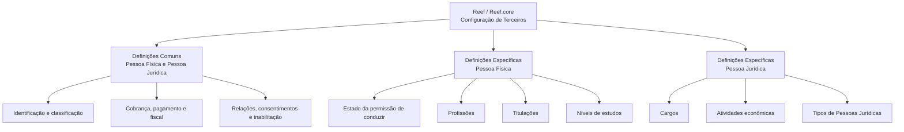

# Documentação Reef — Definições de Terceiros no Reef.core

## 1. Metadados do Documento
- **Arquivo de Origem:** Não informado
- **Tipo de Documento:** Manual Operacional / Documentação Funcional
- **Domínio / Sistema:** Reef / Reef.core — cadastro e configuração de Terceiros
- **Público-Alvo:** Analistas funcionais, desenvolvedores, arquitetos, operação e equipes de negócio
- **Data/Versão Identificada:** Não identificada
- **Lifecycle Identificado:** Approved
- **Owner Identificado:** `user:agonzalez_mapfre.com`

---

## 2. Resumo Executivo & Contexto de Negócio

O documento apresenta as definições de catálogos e classificações aplicáveis ao cadastro de **Terceros** no sistema Reef. O termo “Tercero” abrange entidades que intervêm ou podem intervir na configuração de terceiros no sistema, segmentadas principalmente pela tipologia de **Pessoa Física** ou **Pessoa Jurídica**.

A estrutura funcional é dividida em três níveis: definições comuns, aplicáveis indistintamente a Pessoas Físicas e Pessoas Jurídicas; definições específicas para Pessoas Físicas; e definições específicas para Pessoas Jurídicas. Essa segmentação estabelece quais catálogos devem ser utilizados de acordo com a natureza cadastral do terceiro.

As definições comuns incluem elementos relacionados a atividades, documentos identificadores, agrupamentos, classificações, categorias, qualidade, cobrança e pagamento, regimes fiscais, perfis financeiros, impostos, relações, departamentos, consentimentos e inabilitação. O documento também registra configurações relacionadas a Pessoas Politicamente Expostas.

Para Pessoas Físicas, o documento indica catálogos de estado da permissão de conduzir, profissões, titulações e níveis de estudos. Para Pessoas Jurídicas, a documentação lista cargos, atividades econômicas e tipos de pessoas jurídicas.

> **Nota de Análise:** O documento descreve catálogos funcionais e seus propósitos, mas não detalha telas, APIs, modelos de dados, métodos HTTP, contratos JSON, regras de persistência, responsáveis operacionais ou fluxos de aprovação para manutenção dos catálogos.

---

## 3. Arquitetura, Componentes & Tecnologias Envolvidas

O conteúdo identifica o **Reef.core** como sistema no qual terceiros podem ser incapacitados por causas e motivos de inabilitação. Também identifica a documentação como parte de “DOCUMENTACIÓN Reef” e menciona “Mapfredocument” na navegação apresentada.

Não há detalhamento de microsserviços, integrações, banco de dados, protocolos, APIs, URLs, servidores, ambientes ou tecnologias de implementação.



### Componentes e conceitos identificados

| Componente / Conceito | Papel identificado no documento | Observações |
| :--- | :--- | :--- |
| Reef | Contexto da documentação de terceiros | O documento é apresentado como “DOCUMENTACIÓN Reef”. |
| Reef.core | Sistema citado para incapacitação de terceiros | O texto associa causas de inabilitação ao Reef.core. |
| Terceros | Entidades configuradas e classificadas no sistema | Podem ser Pessoas Físicas ou Pessoas Jurídicas. |
| Pessoa Física | Tipologia de terceiro com definições específicas | Possui catálogos de condução, profissão, titulação e estudos. |
| Pessoa Jurídica | Tipologia de terceiro com definições específicas | Possui catálogos de cargos, atividades econômicas e tipos jurídicos. |
| Mapfredocument | Elemento exibido na documentação | O texto não detalha sua função. |

---

## 4. Regras de Negócio, Especificações Funcionais & Processos

### 4.1 Segmentação de Terceiros

1. Os elementos de configuração de terceiros são segmentados conforme a tipologia do terceiro.
2. A tipologia diferencia se o terceiro é uma **Pessoa Física** ou uma **Pessoa Jurídica**.
3. Existem definições comuns que podem ser utilizadas por ambas as tipologias.
4. Existem definições exclusivas para Pessoas Físicas.
5. Existem definições exclusivas para Pessoas Jurídicas.

### 4.2 Definições comuns para qualquer Terceiro

As definições a seguir são apresentadas como catálogos utilizáveis indistintamente para Pessoas Físicas e Pessoas Jurídicas:

- **Atividades:** define atividades de terceiros, incluindo Asegurados, Agentes, Peritos e Abogados.
- **Campos obrigatórios:** define dados obrigatórios por atividade, que devem ser capturados no registro e na captura de informações de terceiros.
- **Documentos identificadores:** define documentos identificadores de terceiros, incluindo ID, SSN e NIF.
- **Agrupamentos:** define agrupamentos de terceiros.
- **Catálogo multipropósito:** define códigos utilizados pelos terceiros, incluindo tipos de sociedades mercantis e grupos empresariais.
- **Categorias:** define categorias para divisão dos terceiros como subconjuntos.
- **Classificações:** define classificações de terceiros.
- **Códigos de qualidade:** define classificações de terceiros como códigos de qualidade.
- **Entidades de cobrança/pagamento:** define entidades comercializadoras dos meios de cobrança e pagamento utilizados pelos terceiros.
- **Meios de cobrança/pagamento:** define meios de cobrança e pagamento utilizados pelos terceiros.
- **Tipos de token:** define classificações de tipos de token dos meios de pagamento.
- **Regimes fiscais:** define classificações dos regimes fiscais apresentados pelos terceiros.
- **Calificações (Rating):** define as qualificações ou ratings possuídos pelos terceiros.
- **Perfis financeiros:** define possíveis perfis financeiros de terceiros.
- **Impostos ou retenções:** define códigos de impostos ou retenções apresentados pelos terceiros.
- **Parentescos ou relações:** define parentescos ou relações possuídos pelos terceiros.
- **Departamentos:** define possíveis departamentos em que as empresas se estruturam para associação aos terceiros.
- **Cargos em Pessoas Politicamente Expostas:** define cargos associados a Pessoas Politicamente Expostas.
- **Consentimentos:** define códigos de possíveis consentimentos associados aos terceiros.
- **Causas de inabilitação:** define causas pelas quais terceiros podem ser incapacitados no Reef.core.
- **Motivos de inabilitação:** define motivos pelos quais terceiros podem ser incapacitados de acordo com as atividades associadas a esses terceiros.

### 4.3 Definições específicas para Pessoas Físicas

As seguintes definições são usadas exclusivamente quando o terceiro é uma Pessoa Física:

1. **Estados do permiso de conduzir:** possíveis situações em que a permissão de conduzir pode se encontrar.
2. **Profissões:** profissões de Pessoas Físicas.
3. **Titulações:** titulações ou títulos oficiais que Pessoas Físicas podem possuir.
4. **Níveis de estudos:** níveis educacionais que Pessoas Físicas podem ter.

### 4.4 Definições específicas para Pessoas Jurídicas

As seguintes definições são usadas exclusivamente quando o terceiro é uma Pessoa Jurídica:

1. **Cargos:** cargos ou posições de Pessoas Físicas que trabalham em Pessoas Jurídicas, incluindo CEO, CFO, COO e CIO.
2. **Atividades econômicas:** atividades econômicas associadas a Pessoas Jurídicas, incluindo Serviços, Industriais e Comerciais.
3. **Tipos de Pessoas Jurídicas:** tipos de Pessoas Jurídicas como classificações que essas entidades podem possuir.

---

## 5. Tabelas de Parâmetros, Ambientes e Estruturas de Dados

| Item / Parâmetro | Descrição / Função | Tipo / Valores / Formato | Ambiente / Observações |
| :--- | :--- | :--- | :--- |
| Atividades | Define atividades dos terceiros | Asegurados, Agentes, Peritos, Abogados | Definição comum |
| Campos obrigatórios | Define dados que devem ser capturados conforme a atividade | Não detalhado | Aplicável ao registro e captura de informações |
| Documentos identificadores | Define documentos identificadores de terceiros | ID, SSN, NIF | Definição comum |
| Agrupamentos | Define agrupamentos de terceiros | Não detalhado | Definição comum |
| Catálogo multipropósito | Define códigos empregados pelos terceiros | Tipos de Sociedades Mercantis, Grupos Empresariais | Definição comum |
| Categorias | Divide terceiros em subconjuntos | Não detalhado | Definição comum |
| Classificações | Define classificações de terceiros | Não detalhado | Definição comum |
| Códigos de qualidade | Define classificações como códigos de qualidade | Não detalhado | Definição comum |
| Entidades de cobrança/pagamento | Define entidades comercializadoras dos meios de cobrança/pagamento | Não detalhado | Definição comum |
| Meios de cobrança/pagamento | Define meios utilizados pelos terceiros | Não detalhado | Definição comum |
| Tipos de token | Define classificações dos tipos de token dos meios de pagamento | Não detalhado | Definição comum |
| Regimes fiscais | Define classificações de regimes fiscais | Não detalhado | Definição comum |
| Calificações (Rating) | Define ratings possuídos pelos terceiros | Não detalhado | Definição comum |
| Perfis financeiros | Define possíveis perfis financeiros | Não detalhado | Definição comum |
| Impostos ou retenções | Define códigos de impostos ou retenções | Não detalhado | Definição comum |
| Parentescos ou relações | Define parentescos ou relações dos terceiros | Não detalhado | Definição comum |
| Departamentos | Define departamentos empresariais para associação aos terceiros | Não detalhado | Definição comum |
| Cargos em Pessoas Politicamente Expostas | Define cargos de Pessoas Politicamente Expostas | Não detalhado | Definição comum |
| Consentimentos | Define códigos de possíveis consentimentos associados aos terceiros | Não detalhado | Definição comum |
| Causas de inabilitação | Define causas para incapacitação de terceiros | Não detalhado | Cita explicitamente Reef.core |
| Motivos de inabilitação | Define motivos para incapacitação segundo atividades associadas | Não detalhado | Definição comum |
| Estados do permiso de conduzir | Define situações possíveis da permissão de conduzir | Não detalhado | Exclusivo para Pessoa Física |
| Profissões | Define profissões de Pessoas Físicas | Não detalhado | Exclusivo para Pessoa Física |
| Titulações | Define títulos ou titulações oficiais | Não detalhado | Exclusivo para Pessoa Física |
| Níveis de estudos | Define níveis educacionais | Não detalhado | Exclusivo para Pessoa Física |
| Cargos | Define cargos ou posições de trabalhadores em Pessoas Jurídicas | CEO, CFO, COO, CIO | Exclusivo para Pessoa Jurídica |
| Atividades econômicas | Define atividades econômicas associadas a Pessoas Jurídicas | Serviços, Industriais, Comerciais | Exclusivo para Pessoa Jurídica |
| Tipos de Pessoas Jurídicas | Define classificações de Pessoas Jurídicas | Não detalhado | Exclusivo para Pessoa Jurídica |

---

## 6. Bateria de Perguntas & Respostas para RAG (FAQ Sintético)

### P1: Qual é a finalidade das definições de Terceiros no sistema Reef?
**R:** As definições de Terceiros organizam os elementos que intervêm ou podem intervir na configuração de terceiros no sistema Reef. A organização é segmentada pela tipologia do terceiro, diferenciando Pessoas Físicas e Pessoas Jurídicas.

### P2: Quais definições podem ser utilizadas tanto para Pessoas Físicas quanto para Pessoas Jurídicas?
**R:** O documento estabelece um nível de definições comuns utilizável indistintamente para Pessoas Físicas e Pessoas Jurídicas. Esse nível inclui atividades, campos obrigatórios, documentos identificadores, agrupamentos, catálogo multipropósito, categorias, classificações, códigos de qualidade, cobrança e pagamento, tipos de token, regimes fiscais, ratings, perfis financeiros, impostos, relações, departamentos, cargos em Pessoas Politicamente Expostas, consentimentos e inabilitação.

### P3: Como os campos obrigatórios são definidos para um Terceiro?
**R:** Os campos obrigatórios são definidos por atividade. Esses dados devem ser capturados durante o registro e a captura de informações dos terceiros. O documento não detalha quais campos são obrigatórios para cada atividade.

### P4: Quais documentos identificadores são citados para Terceiros?
**R:** O documento cita ID, SSN e NIF como exemplos de documentos identificadores de terceiros. Não são detalhados formatos, validações ou regras de obrigatoriedade específicas para cada documento.

### P5: O que é configurado no catálogo multipropósito de Terceiros?
**R:** O catálogo multipropósito define códigos empregados pelos terceiros. Entre os exemplos apresentados estão tipos de sociedades mercantis e grupos empresariais.

### P6: Como o Reef.core trata a inabilitação de Terceiros?
**R:** O Reef.core possui definições de causas de inabilitação, utilizadas para incapacitar terceiros no sistema. O documento também apresenta motivos de inabilitação, definidos de acordo com as atividades associadas aos terceiros.

### P7: Quais informações são exclusivas de uma Pessoa Física?
**R:** Para uma Pessoa Física, o documento estabelece definições exclusivas para estados do permiso de conduzir, profissões, titulações ou títulos oficiais e níveis de estudos.

### P8: Quais informações são exclusivas de uma Pessoa Jurídica?
**R:** Para uma Pessoa Jurídica, o documento estabelece definições exclusivas para cargos ou posições de pessoas que trabalham na entidade, atividades econômicas associadas e tipos de Pessoas Jurídicas.

### P9: Quais cargos de Pessoas Jurídicas são exemplificados no documento?
**R:** O documento exemplifica os cargos CEO, CFO, COO e CIO como posições de Pessoas Físicas que trabalham em Pessoas Jurídicas.

### P10: Quais atividades econômicas de Pessoas Jurídicas são citadas?
**R:** São citadas atividades econômicas de Serviços, Industriais e Comerciais. O documento não apresenta uma classificação completa nem critérios para associar atividades econômicas às Pessoas Jurídicas.

### P11: O documento define dados técnicos de API ou contratos de integração para os catálogos de Terceiros?
**R:** Não. O documento não detalha métodos HTTP, APIs, contratos JSON, banco de dados, eventos, integrações, tecnologias de implementação, URLs ou ambientes técnicos.

### P12: Como consentimentos são tratados na configuração de Terceiros?
**R:** O documento indica que há códigos para os possíveis consentimentos que podem ser associados aos terceiros. Não há detalhamento sobre os tipos de consentimento, validade, revogação ou processo de coleta.

---

## 7. Glossário de Termos, Siglas & Conceitos-Chave

- **Reef:** Contexto documental e sistema relacionado à configuração de Terceiros.
- **Reef.core:** Sistema citado como destino das regras de incapacitação de Terceiros por causas de inabilitação.
- **Terceros:** Terceiros configurados no sistema, classificados como Pessoas Físicas ou Pessoas Jurídicas.
- **Pessoa Física:** Tipologia de Terceiro com definições exclusivas de condução, profissão, titulação e estudos.
- **Pessoa Jurídica:** Tipologia de Terceiro com definições exclusivas de cargos, atividades econômicas e tipos jurídicos.
- **Asegurados:** Atividades de Terceiros citadas no documento.
- **Agentes:** Atividades de Terceiros citadas no documento.
- **Peritos:** Atividades de Terceiros citadas no documento.
- **Abogados:** Atividades de Terceiros citadas no documento.
- **ID:** Documento identificador citado para Terceiros; o significado expandido não é definido no documento.
- **SSN:** Documento identificador citado para Terceiros; o significado expandido não é definido no documento.
- **NIF:** Documento identificador citado para Terceiros; o significado expandido não é definido no documento.
- **Rating:** Calificação possuída pelos Terceiros.
- **CEO:** Exemplo de cargo ou posição de Pessoa Física que trabalha em Pessoa Jurídica.
- **CFO:** Exemplo de cargo ou posição de Pessoa Física que trabalha em Pessoa Jurídica.
- **COO:** Exemplo de cargo ou posição de Pessoa Física que trabalha em Pessoa Jurídica.
- **CIO:** Exemplo de cargo ou posição de Pessoa Física que trabalha em Pessoa Jurídica.
- **Pessoas Politicamente Expostas:** Categoria mencionada em relação à definição de cargos.
- **Token:** Tipo de token relacionado aos meios de pagamento.

---

## 8. Notas Críticas, Riscos & Limitações

- O conteúdo é predominantemente descritivo e apresenta propósitos de catálogos, sem detalhar registros concretos, valores permitidos, chaves, hierarquias ou regras de manutenção.
- Não há informação sobre interfaces, APIs, fluxos de integração, persistência, eventos, mecanismos de autenticação ou autorização.
- Não são apresentados ambientes técnicos, URLs, servidores, portas, versões de software ou tecnologias utilizadas.
- As regras de inabilitação citam causas e motivos, mas não especificam condições, precedência, consequências operacionais, responsáveis ou processo de reversão.
- Os campos obrigatórios são definidos “por atividade”, mas o documento não relaciona atividades aos respectivos campos obrigatórios.
- A documentação menciona Reef.core, mas não explica a relação arquitetural entre Reef, Reef.core e Mapfredocument.
- A página 3 é indicada como página em branco ou contendo somente elementos visuais/imagem; não há conteúdo textual adicional recuperável.

---

## 9. Conteúdo Bruto Estruturado (Referência Fiel)

```text
--- [PÁGINA 1 DE 3] ---

DEFINICIONES de los TERCEROS
Relación de elementos que intervienen o pueden intervenir en la conguración de los Terceros en el Sistema, segmentándolos de acuerdo
con la Tipología del Tercero, es decir, diferenciando si éste es una Persona Física o una Persona Jurídica.
DEFINICIONES COMUNES para cualquier Tercero, independientemente
que éstos sean PERSONAS FÍSICAS ó PERSONAS JURÍDICAS
En este nivel se localizan catálogos que se utilizan indistintamente tanto para Personas Físicas como para
Personas Jurídicas.
ACTIVIDADES 
Denición de las Actividades de los
Terceros: Asegurados, Agentes, Peritos,
Abogados,...
CAMPOS OBLIGATORIOS 
Denición de los Datos Obligatorios por
Actividad, que se tienen que capturar en el
registro y captura de la información de los
Terceros.
DOCUMENTOS IDENTIFICADORES 
Denición de los Documentos
Identicadores de los Terceros: ID, SSN,
NIF,...
AGRUPACIONES
Denición de las Agrupaciones de los
Terceros.
CATÁLOGO MULTIPROPÓSITO
Denición de los códigos empleados por
los Terceros en el Catálogo Multipropósito
de los Terceros: Tipos de Sociedades
Mercantiles, Grupos Empresariales,...
CATEGORÍAS
Denición de las Categorías en las que se
van a dividir los Terceros como
subconjuntos de los mismos.
CLASIFICACIONES
Denición de las Clasicaciones de los
Terceros.
CÓDIGOS DE CALIDAD
Denición de las clasicaciones de los
Terceros como Códigos de Calidad de los
Terceros.
ENTIDADES DE COBRO/PAGO
Denición de las Entidades
comercializadoras de los medios de
Cobro/Pago utilizadas por los Terceros.
MEDIOS DE COBRO/PAGO
Denición de los Medios de Cobro/Pago
empleados por los Terceros.
TIPOS DE TOKEN
Denición de las clasicaciones de los
Tipos de Token de los medios de Pago
REGÍMENES FISCALES
Denición de las clasicaciones de los
Regímenes Fiscales que presentan los
Documentation / DOCUMENTACIÓN Reef
DOCUMENTACIÓN Reef
Mapfredocument
DOCUMENTACIÓN Reef
Owner
user:agonzalez_mapfre.com
Lifecycle
Approved Source
 / 
 VL
Buscar Inicio Soluciones Arquitecturas APIs Componentes Cloud Documentación Zeus Reef Ayuda
ES


--- [PÁGINA 2 DE 3] ---

utilizados por los Terceros.
 Terceros.
CALIFICACIONES (RATING)
Denición de las Calicaciones (Rating)
que poseen los Terceros.
PERFILES FINANCIEROS
Denición de los posibles Perles
Financieros que disfrutan los Terceros.
IMPUESTOS O RETENCIONES
Denición de los códigos de Impuestos o
Retenciones que presentan los Terceros.
PARENTESCOS O RELACIONES
Denición de los Parentescos o
Relaciones que disfrutan los Terceros.
DEPARTAMENTOS
Denición de los posibles Departamentos
en los que se estructuran las Empresas
para su asociación a los Terceros.
CARGOS EN PERSONAS POLÍTICAMENTE
EXPUESTAS
Denición de los Cargos en Personas
Políticamente Expuestas.
CONSENTIMIENTOS
Denición de los códigos de los posibles
Consentimientos que se asocian a los
Terceros.
CAUSAS DE INHABILITACIÓN 
Denición de las Causas de Inhabilitación
por las que se pueden incapacitar a los
Terceros en Reef.core.
MOTIVOS DE INHABILITACIÓN 
Denición de los Motivos de
Inhabilitación** por las que se pueden
incapacitar a los Terceros de acuerdo con
las Actividades que estos tengan
asociadas.
DEFINICIONES ESPECÍFICAS de los Terceros cuando estos son
PERSONAS FÍSICAS
En este nivel se encuentran deniciones que se emplean exclusivamente cuando el Tercero es una Persona
Física.
ESTADOS DEL PERMISO DE CONDUCIR
Denición de las posibles situaciones en
las que se pueda encontrar el Permiso de
Conducir.
PROFESIONES
Denición de las Profesiones de las
Personas Físicas.
TITULACIONES
Denición de las Titulaciones ó Títulos
Ociales que las Personas Físicas puedan
poseer.
NIVELES DE ESTUDIOS
Denición de los Niveles Educativos que
las Personas Físicas puedan tener.
DEFINICIONES ESPECÍFICAS de los Terceros cuando estos son
PERSONAS JURÍDICAS
En este nivel se encuentran deniciones que se emplean exclusivamente cuando el Tercero es una Persona
Jurídica.
CARGOS
Denición de los Cargos o Posiciones de
las Personas Físicas que trabajan en
Personas Jurídicas: CEO, CFO, COO, CIO, ...
ACTIVIDADES ECONÓMICAS
Denición de las Actividades Económicas
asociadas a las Personas Jurídicas:
Servicios, Industriales, Comerciales,...
TIPOS DE PERSONAS JURÍDICAS
Denición de los Tipos de Personas
Jurídicas como Clasicaciones que éstas
pueden tener.


--- [PÁGINA 3 DE 3] ---

[Página em branco ou apenas elementos visuais/imagem]
```
