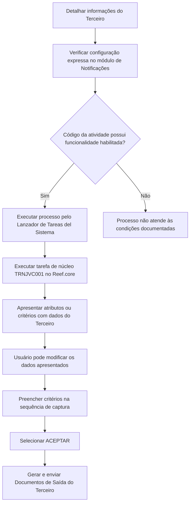

# Geração e Envio de Documentação de Terceiros no Reef.core

## 1. Metadados do Documento
- **Arquivo de Origem:** `Não informado no conteúdo fornecido`
- **Tipo de Documento:** `Procedimento`
- **Domínio / Sistema:** `Reef.core / DOCUMENTACIÓN Reef / Mapfredocument`
- **Público-Alvo:** `Usuários operacionais, analistas funcionais e equipes responsáveis pela configuração de notificações`
- **Data/Versão Identificada:** `Não identificada`
- **Status identificado na fonte:** `Lifecycle: Approved`

---

## 2. Resumo Executivo & Contexto de Negócio

O documento descreve o processo para gerar e enviar os **Documentos de Saída do Terceiro** no sistema **Reef.core**. A execução depende de duas condições explicitamente citadas: a configuração prévia no módulo de **Notificações** e a habilitação dessa funcionalidade para o código da atividade.

O fluxo é iniciado após o detalhamento das informações do Terceiro. O usuário deve executar o processo definido pelo **Lanzador de Tareas del Sistema**. No Reef.core, a geração documental é realizada por meio da tarefa de núcleo de código **`TRNJVC001`**.

A tarefa `TRNJVC001` apresenta, por padrão, os dados do Terceiro utilizado na chamada como atributos ou critérios de execução. O documento informa que esses dados podem ser modificados pelo usuário antes da confirmação.

Os campos são capturados em uma sequência definida, lida da esquerda para a direita e de cima para baixo. Entre os atributos descritos estão o código da companhia, operação, atividade do Terceiro, tipo de documento identificador e chave do documento identificador.

O conteúdo não detalha os documentos efetivamente gerados, os canais de envio, contratos técnicos, métodos HTTP, integrações externas, formatos de saída ou regras de erro da tarefa `TRNJVC001`.

---

## 3. Arquitetura, Componentes & Tecnologias Envolvidas

### Componentes identificados

| Componente / Elemento | Papel descrito no documento |
| :--- | :--- |
| Reef.core | Sistema no qual é executada a geração do documento. |
| Lanzador de Tareas del Sistema | Mecanismo pelo qual o processo definido deve ser executado. |
| `TRNJVC001` | Tarefa do núcleo de código responsável pela geração do documento no Reef.core. |
| Módulo de Notificações | Módulo no qual deve existir configuração expressa para geração e envio dos Documentos de Saída do Terceiro. |
| Código da atividade | Código que deve ter a funcionalidade habilitada. |
| Terceiro | Pessoa física ou jurídica cujos dados são usados como critérios de execução da tarefa. |
| DOCUMENTACIÓN Reef | Área ou contexto documental exibido na fonte. |
| Mapfredocument | Termo exibido no cabeçalho/contexto documental; a função técnica não é detalhada. |

### Fluxo funcional reconstruído



> **Nota de Análise:** O documento associa a tarefa `TRNJVC001` à geração documental, mas não especifica métodos de execução, entradas técnicas completas, saídas, mensagens de erro, APIs, filas, bancos de dados ou integrações utilizadas.

---

## 4. Regras de Negócio, Especificações Funcionais & Processos

### Condições para geração e envio documental

1. Os **Documentos de Saída do Terceiro** devem ser gerados e enviados de acordo com a configuração realizada expressamente no módulo de **Notificações**.
2. O código da atividade deve ter essa funcionalidade habilitada.
3. Antes da execução, as informações do Terceiro devem ter sido detalhadas.
4. O processo definido deve ser executado por meio do **Lanzador de Tareas del Sistema**.
5. No Reef.core, a tarefa responsável pela geração do documento é a tarefa de núcleo de código **`TRNJVC001`**.
6. A tarefa `TRNJVC001` exibe por padrão os dados do Terceiro associado à chamada como atributos ou critérios de execução.
7. O usuário pode modificar os dados exibidos por padrão pela tarefa.
8. Os campos devem ser tratados conforme a sequência de captura indicada: da esquerda para a direita e de cima para baixo.
9. Ao final do preenchimento dos atributos, o usuário deve selecionar o ícone **ACEPTAR**.

### Sequência de atributos ou critérios de execução descritos

1. **Código de Companhia**
2. **Filtro Operação**
3. **Operação**
4. **Atividade do Terceiro**
5. **Tipo de Documento Identificador**
6. **Chave do Documento Identificador**
7. Seleção do ícone **ACEPTAR**

### Regras por campo

- **Código de Companhia:** contém o código de Companhia da Entidade Seguradora com o qual a execução da tarefa será realizada.
- **Filtro Operação:** é listado no conteúdo, mas não possui descrição adicional.
- **Operação:** contém o código da Operação.
- **Atividade do Terceiro:** contém o código da atividade do Terceiro, com exemplos como Asegurado, Agente e Abogado.
- **Tipo de Documento Identificador:** contém a tipologia documental usada para identificar uma pessoa física ou jurídica, conforme tipos de documentos configurados previamente no sistema.
- **Chave do Documento Identificador:** atributo da tarefa que contém a chave do Terceiro.

> **Nota de Análise:** O documento lista o campo **Filtro Operação**, porém não descreve sua finalidade, tipo, valores aceitos ou efeito sobre a execução da tarefa.

---

## 5. Tabelas de Parâmetros, Ambientes e Estruturas de Dados

### Atributos da tarefa `TRNJVC001`

| Item / Parâmetro | Descrição / Função | Tipo / Valores / Formato | Ambiente / Observações |
| :--- | :--- | :--- | :--- |
| Código de Companhia | Código da Companhia da Entidade Seguradora usado para executar a tarefa. | Código de Companhia | Usado na execução da tarefa. |
| Filtro Operação | Campo listado na sequência de captura. | Não detalhado | O conteúdo não explica o comportamento do filtro. |
| Operação | Código da Operação. | Código de Operação | Usado como critério de execução. |
| Atividade do Terceiro | Código da atividade associada ao Terceiro. | Exemplos: Asegurado, Agente, Abogado | O código da atividade deve possuir a funcionalidade habilitada. |
| Tipo de Documento Identificador | Tipologia usada para identificar pessoa física ou jurídica. | Tipo documental previamente configurado no sistema | Depende de configuração anterior no sistema. |
| Chave do Documento Identificador | Chave do Terceiro. | Chave do Terceiro | Atributo da tarefa. |
| ACEPTAR | Ícone selecionado ao final do fluxo. | Ação de confirmação | Aciona a conclusão do preenchimento descrito. |

### Tipos de documento identificador apresentados

| Item / Parâmetro | Descrição / Função | Tipo / Valores / Formato | Ambiente / Observações |
| :--- | :--- | :--- | :--- |
| NIF - España | Número de Identificación Fiscal | Tipo de documento | Espanha |
| DNI - España | Documento Nacional de Identidad | Tipo de documento | Espanha |
| RFC - México | Registro Federal de Causantes | Tipo de documento | México |
| RUT - Chile | Rol Único Tributario | Tipo de documento | Chile |
| RUT - Colombia | Registro único Tributario | Tipo de documento | Colômbia |
| TIN - Malta | Tax Identification Number | Tipo de documento | Malta |

### Dependências e condições de configuração

| Item / Parâmetro | Descrição / Função | Tipo / Valores / Formato | Ambiente / Observações |
| :--- | :--- | :--- | :--- |
| Configuração de Notificações | Configuração expressa que orienta a geração e envio dos Documentos de Saída do Terceiro. | Configuração de sistema | Realizada no módulo de Notificações. |
| Habilitação da atividade | Habilitação da funcionalidade no código da atividade. | Condição de ativação | Necessária para o processo descrito. |
| Tipos documentais | Tipos aceitos para identificação de pessoa física ou jurídica. | Configuração prévia | Devem estar configurados previamente no sistema. |
| Reef.core | Sistema que executa a geração documental pela tarefa `TRNJVC001`. | Sistema | Não são informados ambientes técnicos específicos. |

---

## 6. Bateria de Perguntas & Respostas para RAG (FAQ Sintético)

### P1: Qual é o objetivo do processo de geração de documentação de terceiros no Reef.core?
**R:** O processo tem como objetivo gerar e enviar os Documentos de Saída do Terceiro conforme a configuração expressamente realizada no módulo de Notificações, desde que o código da atividade tenha a funcionalidade habilitada.

### P2: Qual tarefa do Reef.core gera o documento do Terceiro?
**R:** No Reef.core, a geração do documento é realizada pela tarefa de núcleo de código `TRNJVC001`.

### P3: Quais condições precisam estar atendidas para gerar e enviar os Documentos de Saída do Terceiro?
**R:** O módulo de Notificações deve possuir configuração expressa para a geração e envio documental, e o código da atividade deve ter a funcionalidade habilitada. Além disso, o documento indica que as informações do Terceiro devem ser detalhadas antes da execução.

### P4: Como o processo de documentação do Terceiro é iniciado?
**R:** Após detalhar as informações do Terceiro, o usuário deve executar o processo definido por meio do Lanzador de Tareas del Sistema.

### P5: Quais dados a tarefa `TRNJVC001` apresenta inicialmente?
**R:** A tarefa `TRNJVC001` apresenta por padrão os dados do Terceiro com o qual é realizada a chamada, exibindo esses dados como atributos ou critérios de execução.

### P6: O usuário pode alterar os dados do Terceiro exibidos pela tarefa `TRNJVC001`?
**R:** Sim. O documento informa que os dados do Terceiro apresentados por padrão como atributos ou critérios de execução podem ser modificados pelo usuário.

### P7: Qual é a finalidade do campo Código de Companhia?
**R:** O campo Código de Companhia contém o código de Companhia da Entidade Seguradora com o qual será realizada a execução da tarefa.

### P8: O que deve ser informado no campo Operação?
**R:** O campo Operação contém o código da Operação.

### P9: O que representa o campo Atividade do Terceiro?
**R:** O campo Atividade do Terceiro contém o código da atividade do Terceiro. O documento apresenta como exemplos Asegurado, Agente e Abogado.

### P10: Como o tipo de documento identificador é utilizado?
**R:** O Tipo de Documento Identificador contém a tipologia documental usada para identificar uma pessoa física ou jurídica. Os tipos disponíveis dependem daqueles configurados previamente no sistema.

### P11: Quais exemplos de documentos identificadores estão documentados?
**R:** O documento apresenta NIF e DNI para Espanha, RFC para México, RUT para Chile, RUT para Colômbia e TIN para Malta.

### P12: O que contém a Chave do Documento Identificador?
**R:** A Chave do Documento Identificador é um atributo da tarefa que contém a chave do Terceiro.

### P13: Qual ação finaliza a sequência descrita de preenchimento?
**R:** Após informar ou ajustar os atributos necessários, o usuário deve selecionar o ícone **ACEPTAR**.

### P14: O documento explica a finalidade do campo Filtro Operação?
**R:** Não. O campo Filtro Operação aparece na sequência de captura, mas o conteúdo não fornece descrição, valores permitidos, tipo de dado ou comportamento funcional para esse campo.

---

## 7. Glossário de Termos, Siglas & Conceitos-Chave

- **ACEPTAR:** Ícone que deve ser selecionado ao final da sequência descrita.
- **Actividad del Tercero / Atividade do Terceiro:** Código que representa a atividade associada ao Terceiro; exemplos apresentados: Asegurado, Agente e Abogado.
- **Asegurado:** Exemplo de atividade do Terceiro citado no documento; não há definição adicional.
- **Agente:** Exemplo de atividade do Terceiro citado no documento; não há definição adicional.
- **Abogado:** Exemplo de atividade do Terceiro citado no documento; não há definição adicional.
- **Chave do Terceiro:** Valor contido no atributo Chave do Documento Identificador.
- **DNI:** Documento Nacional de Identidad, apresentado como tipo de documento da Espanha.
- **Documentos de Saída do Terceiro:** Documentos que devem ser gerados e enviados segundo configuração do módulo de Notificações e habilitação da atividade.
- **Lanzador de Tareas del Sistema:** Mecanismo usado para executar o processo definido.
- **NIF:** Número de Identificación Fiscal, apresentado como tipo de documento da Espanha.
- **RFC:** Registro Federal de Causantes, apresentado como tipo de documento do México.
- **Reef.core:** Sistema no qual a tarefa `TRNJVC001` realiza a geração documental.
- **RUT:** Rol Único Tributario no Chile e Registro único Tributario na Colômbia, conforme descrito na fonte.
- **TIN:** Tax Identification Number, apresentado como tipo de documento de Malta.
- **`TRNJVC001`:** Tarefa de núcleo de código usada no Reef.core para geração de documentos.

---

## 8. Notas Críticas, Riscos & Limitações

- A geração e o envio documental dependem de configuração expressa no módulo de **Notificações**.
- A funcionalidade depende de habilitação no código da atividade do Terceiro.
- Os tipos de documentos identificadores devem ter sido configurados previamente no sistema.
- O documento não detalha como validar se a configuração de Notificações ou a habilitação da atividade está correta.
- O campo **Filtro Operação** é citado, mas não é explicado.
- Não são informados contratos de entrada e saída, métodos HTTP, APIs, formatos de documento, repositórios, canais de entrega, logs, tratamento de exceções, permissões ou mecanismos de reprocessamento.
- Não são fornecidos ambientes, URLs, servidores, portas, versões de software ou responsáveis operacionais.
- O termo **Mapfredocument** é exibido no contexto documental, mas sua função no processo não é descrita.

---

## 9. Conteúdo Bruto Estruturado (Referência Fiel)

```text
--- [PÁGINA 1 DE 2] ---

GENERAR Documentación del Tercero
Objetivo
Generar y enviar los Documentos de Salida del Tercero de acuerdo con la conguración expresamente realizada en el módulo de
Noticaciones y además el código de la actividad tenga habilitada esta funcionalidad.
Hilo del Proceso
Una vez se ha detallado la información del Tercero, se tiene que ejecutar el proceso denido mediante el Lanzador de Tareas del Sistema.
En Reef.core la generación del documento se realiza ejecutando la Tarea del núcleo de código: 'TRNJVC001', tarea que por defecto muestra
como Atributos o criterios de ejecución los Datos del Tercero con el que se realiza la llamada (si bien estos datos pueden ser modicados por
el Usuario)
De izquierda a derecha y de arriba hacia abajo los siguientes campos marcan la secuencia en el orden de su captura.
Código de Compañía
Este Campo contiene el código de Compañía de la Entidad Aseguradora con el que se va a realizar la ejecución de la Tarea.
Filtro Operación
Operación
Este Campo contiene el código de la Operación
Actividad del Tercero
Este Parámetro contiene el código de la Actividad del Tercero (Asegurado, Agente, Abogado,...)
Documentation / DOCUMENTACIÓN Reef
DOCUMENTACIÓN Reef
Mapfredocument
DOCUMENTACIÓN Reef
Owner
user:agonzalez_mapfre.com
Lifecycle
Approved Source
 / 
 VL
Buscar Inicio Soluciones Arquitecturas APIs Componentes Cloud Documentación Zeus Reef Ayuda
ES


--- [PÁGINA 2 DE 2] ---

Tipo de Documento Identicador
Este Campo contiene la Tipología del Documento con el que se va a identicar a la persona física o jurídica de acuerdo con los tipos de
documentos que hayan sido congurados en el sistema previamente. Por ejemplo:
TIPO DE DOCUMENTO DESCRIPCIÓN
NIF - España Número de Identicación Fiscal
DNI - España Documento Nacional de Identidad
RFC - México Registro Federal de Causantes
RUT - Chile Rol Único Tributario
RUT - Colombia Registro único Tributario
TIN - Malta Tax Identication Number
Clave del Documento Identicador
Este Atributo de la Tarea contendrá la clave del Tercero.
... y por último, se pulsa el icono ACEPTAR.
```
