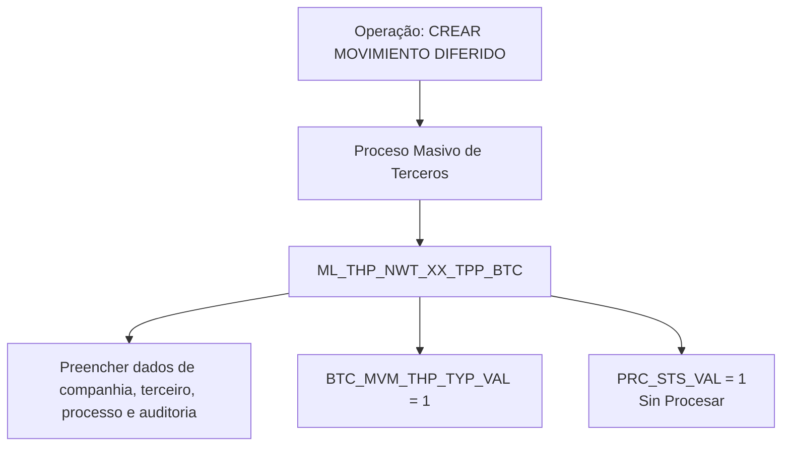

# CREAR MOVIMIENTO DIFERIDO do Processo Massivo de Terceiros — Visão Técnica

## 1. Metadados do Documento
- **Arquivo de Origem:** Não identificado no texto fornecido
- **Tipo de Documento:** Especificação Técnica
- **Domínio / Sistema:** Reef / Mapfre — Processo Massivo de Terceiros
- **Público-Alvo:** Desenvolvedores, Arquitetos, Operação
- **Data/Versão Identificada:** Não identificada

---

## 2. Resumo Executivo & Contexto de Negócio

O documento descreve a visão técnica da operação **“CREAR MOVIMIENTO DIFERIDO”** no contexto do **Proceso Masivo de Terceros**. O conteúdo concentra-se exclusivamente no modelo de dados envolvido na operação.

A tabela indicada para essa operação é `ML_THP_NWT_XX_TPP_BTC`, descrita como a tabela de controle de processos massivos de terceiros. O documento lista as colunas alteradas ou preenchidas na criação do movimento diferido, seus requisitos de obrigatoriedade e suas descrições funcionais.

A principal regra explícita de inicialização é o preenchimento de `BTC_MVM_THP_TYP_VAL` com o valor `1`, identificado como tipo de movimento batch, e de `PRC_STS_VAL` com o valor inicial `1`, identificado como estado **“Sin Procesar”**.

O material não detalha métodos HTTP, contratos de API, serviços, mecanismos de persistência, transações, gatilhos de banco de dados, regras de processamento posterior ou tratamento de falhas. A fonte apresentada está associada à documentação Reef/Mapfre e possui ciclo de vida indicado como **Approved Source**.

---

## 3. Arquitetura, Componentes & Tecnologias Envolvidas

### Componentes e estruturas identificadas

| Componente / Estrutura | Descrição sustentada pelo documento |
| :--- | :--- |
| `ML_THP_NWT_XX_TPP_BTC` | Tabela de controle de processos massivos de terceiros. |
| Processo Massivo de Terceiros | Processo ao qual pertence a operação de criação de movimento diferido. |
| CREAR MOVIMIENTO DIFERIDO | Operação técnica descrita pelo documento. |
| Reef | Referência de documentação exibida no conteúdo extraído. |
| Mapfre | Referência corporativa exibida no conteúdo extraído. |



> **Nota de Análise:** O documento identifica somente uma tabela de dados e os campos envolvidos. Não há detalhamento adicional sobre microsserviços, APIs, infraestrutura, ambientes, tecnologias de implementação ou integrações externas.

---

## 4. Regras de Negócio, Especificações Funcionais & Processos

### Processo técnico identificado

1. A operação técnica é denominada **CREAR MOVIMIENTO DIFERIDO**.
2. A operação pertence ao **Proceso Masivo de Terceros**.
3. A tabela envolvida é `ML_THP_NWT_XX_TPP_BTC`.
4. A tabela `ML_THP_NWT_XX_TPP_BTC` é descrita como **TABLA CONTROL PROCESOS MASIVOS TERCEROS**.
5. Os campos de companhia, identificador, data de tratamento, ordem de processo, hilo, documento, atividade e auditoria são indicados como obrigatórios.
6. O campo `BTC_MVM_THP_TYP_VAL` deve assumir o valor `1`, descrito como **TIPO DE MOVIMIENTO BATCH**.
7. O campo `PRC_STS_VAL` deve inicialmente assumir o valor `1`, descrito como situação inicial **“Sin Procesar”**.
8. O documento indica que `USR_VAL` registra o usuário que atualizou a linha.
9. O documento indica que `MDF_DAT` registra a data de modificação.

### Restrições e ausência de detalhamento

- Não foram fornecidos formatos, domínios de valores ou tamanhos de campos.
- Não foi especificado o significado expandido das siglas presentes nos nomes técnicos das colunas.
- Não foram apresentados critérios para mudança posterior de `PRC_STS_VAL`.
- Não foram documentadas validações de existência para companhia, terceiro, documento, atividade, ordem de processo ou hilo.
- Não foram fornecidos procedimentos de rollback, reprocessamento, exclusão ou atualização da tabela.

---

## 5. Tabelas de Parâmetros, Ambientes e Estruturas de Dados

| Item / Parâmetro | Descrição / Função | Tipo / Valores / Formato | Ambiente / Observações |
| :--- | :--- | :--- | :--- |
| `ML_THP_NWT_XX_TPP_BTC` | Tabela de controle de processos massivos de terceiros. | Tabela de dados | Estrutura central identificada para a operação. |
| `CMP_VAL` | Companhia. | Valor não detalhado; indicado como `N.A.` no campo de valor/motivo. | Obrigatória: Sim. |
| `BTC_IDN_VAL` | Identificador. | Valor não detalhado; indicado como `N.A.` no campo de valor/motivo. | Obrigatória: Sim. |
| `POC_DAT` | Data de tratamento. | Valor não detalhado; indicado como `N.A.` no campo de valor/motivo. | Obrigatória: Sim. |
| `POC_ORD_NBR` | Número de ordem de processo. | Valor não detalhado; indicado como `N.A.` no campo de valor/motivo. | Obrigatória: Sim. |
| `PRC_THD_VAL` | Hilo. | Valor não detalhado; indicado como `N.A.` no campo de valor/motivo. | Obrigatória: Sim. |
| `BTC_MVM_THP_TYP_VAL` | Tipo de movimento batch. | Assume o valor `1`. | Obrigatória: Sim. |
| `THP_DCM_TYP_VAL` | Tipo do documento do terceiro. | Valor não detalhado; indicado como `N.A.` no campo de valor/motivo. | Obrigatória: Sim. |
| `THP_DCM_VAL` | Documento do terceiro. | Valor não detalhado; indicado como `N.A.` no campo de valor/motivo. | Obrigatória: Sim. |
| `THP_ACV_VAL` | Atividade do terceiro. | Valor não detalhado; indicado como `N.A.` no campo de valor/motivo. | Obrigatória: Sim. |
| `PRC_STS_VAL` | Situação do processo. | Inicialmente assume o valor `1`, correspondente a “Sin Procesar”. | Obrigatória: Sim. |
| `USR_VAL` | Usuário que atualizou a linha. | Valor não detalhado; indicado como `N.A.` no campo de valor/motivo. | Obrigatória: Sim. |
| `MDF_DAT` | Data de modificação. | Valor não detalhado; indicado como `N.A.` no campo de valor/motivo. | Obrigatória: Sim. |

---

## 6. Bateria de Perguntas & Respostas para RAG (FAQ Sintético)

### P1: Qual tabela é utilizada pela operação CREAR MOVIMIENTO DIFERIDO?
**R:** A operação utiliza a tabela `ML_THP_NWT_XX_TPP_BTC`, descrita no documento como tabela de controle de processos massivos de terceiros.

### P2: Qual é o contexto funcional de CREAR MOVIMIENTO DIFERIDO?
**R:** CREAR MOVIMIENTO DIFERIDO é apresentada como uma operação do Processo Massivo de Terceiros. O documento fornecido descreve somente os dados envolvidos nessa operação.

### P3: Qual valor deve ser atribuído ao campo BTC_MVM_THP_TYP_VAL?
**R:** O campo `BTC_MVM_THP_TYP_VAL` deve assumir o valor `1`. O documento descreve esse campo como o tipo de movimento batch.

### P4: Qual é o estado inicial do processo no campo PRC_STS_VAL?
**R:** O campo `PRC_STS_VAL` deve assumir inicialmente o valor `1`, identificado no documento como o estado “Sin Procesar”.

### P5: Quais dados do terceiro devem ser preenchidos na tabela de controle?
**R:** O documento identifica `THP_DCM_TYP_VAL` para o tipo de documento do terceiro, `THP_DCM_VAL` para o documento do terceiro e `THP_ACV_VAL` para a atividade do terceiro. Os três campos são marcados como obrigatórios.

### P6: Quais campos identificam o contexto do processo massivo?
**R:** O documento relaciona `BTC_IDN_VAL` como identificador, `POC_DAT` como data de tratamento, `POC_ORD_NBR` como número de ordem de processo e `PRC_THD_VAL` como hilo. Todos são marcados como obrigatórios.

### P7: Como a companhia é registrada na operação de movimento diferido?
**R:** A companhia é registrada no campo `CMP_VAL`, cuja descrição é “COMPANIA”. O campo é indicado como obrigatório, mas o documento não especifica formato ou domínio de valores.

### P8: Quais campos fornecem rastreabilidade de atualização da linha?
**R:** O campo `USR_VAL` registra o usuário que atualizou a linha, e o campo `MDF_DAT` registra a data de modificação. Ambos são indicados como obrigatórios.

### P9: O documento define APIs ou métodos HTTP para a criação do movimento diferido?
**R:** Não. O conteúdo disponibilizado não detalha APIs, métodos HTTP, contratos JSON, endpoints, serviços ou integrações para a operação CREAR MOVIMIENTO DIFERIDO.

### P10: O documento explica como o estado PRC_STS_VAL muda após “Sin Procesar”?
**R:** Não. O documento informa somente que `PRC_STS_VAL` inicia com o valor `1`, correspondente a “Sin Procesar”, sem especificar transições posteriores de estado.

---

## 7. Glossário de Termos, Siglas & Conceitos-Chave

- **CREAR MOVIMIENTO DIFERIDO:** Nome da operação técnica descrita no documento.
- **Proceso Masivo de Terceros:** Processo associado à operação de criação de movimento diferido.
- **Tercero:** Entidade identificada por tipo de documento, documento e atividade, conforme os campos `THP_DCM_TYP_VAL`, `THP_DCM_VAL` e `THP_ACV_VAL`.
- **Batch:** Termo utilizado na descrição do campo `BTC_MVM_THP_TYP_VAL`, classificado como tipo de movimento.
- **Sin Procesar:** Situação inicial associada ao valor `1` no campo `PRC_STS_VAL`.
- **Hilo:** Descrição funcional do campo `PRC_THD_VAL`; o documento não fornece tradução ou detalhamento adicional.
- **Reef:** Referência de documentação exibida no conteúdo extraído.
- **Mapfre:** Referência corporativa exibida no conteúdo extraído.
- **`CMP_VAL`:** Campo de companhia.
- **`BTC_IDN_VAL`:** Campo de identificador.
- **`POC_DAT`:** Campo de data de tratamento.
- **`POC_ORD_NBR`:** Campo de número de ordem de processo.
- **`PRC_THD_VAL`:** Campo de hilo.
- **`BTC_MVM_THP_TYP_VAL`:** Campo de tipo de movimento batch.
- **`THP_DCM_TYP_VAL`:** Campo de tipo de documento do terceiro.
- **`THP_DCM_VAL`:** Campo de documento do terceiro.
- **`THP_ACV_VAL`:** Campo de atividade do terceiro.
- **`PRC_STS_VAL`:** Campo de situação do processo.
- **`USR_VAL`:** Campo de usuário que atualizou a linha.
- **`MDF_DAT`:** Campo de data de modificação.

---

## 8. Notas Críticas, Riscos & Limitações

- O documento não identifica o arquivo de origem, data de criação, versão técnica ou autor técnico.
- O conteúdo não especifica tipos físicos de dados, tamanhos, chaves, índices, restrições de unicidade ou relacionamentos da tabela `ML_THP_NWT_XX_TPP_BTC`.
- Embora os campos sejam indicados como obrigatórios, não há descrição das validações aplicadas antes da persistência.
- A regra para `PRC_STS_VAL` cobre apenas o estado inicial `1 — Sin Procesar`; não há máquina de estados completa.
- Não há detalhamento de APIs, contratos, serviços, jobs, persistência, auditoria adicional, tratamento de erros ou monitoramento.
- O texto inclui elementos de navegação e metadados da plataforma documental, como “Documentation / DOCUMENTACIÓN Reef”, “Mapfredocument”, “Owner”, “Lifecycle” e “Approved Source”; esses elementos não descrevem comportamento técnico da operação.

---

## 9. Conteúdo Bruto Estruturado (Referência Fiel)

```text
--- [PÁGINA 1 DE 2] ---

CREAR MOVIMIENTO DIFERIDO del Proceso Masivo de Terceros
(Visión Técnica)
Modelo de datos involucrado
La tabla que interviene en esta operación es:
TABLA DESCRIPCIÓN
ML_THP_NWT_XX_TPP_BTC TABLA CONTROL PROCESOS MASIVOS TERCEROS
COLUMNA CAMBIA
VALOR
MOTIVO/VALOR OBLIGATORIA COMENTARIO
CMP_VAL S N.A. SI COMPANIA
BTC_IDN_VAL S N.A. SI IDENTIFICADOR
POC_DAT S N.A. SI FECHA DE TRATAMIENTO
POC_ORD_NBR S N.A. SI NUMERO DE ORDEN DE
PROCESO
PRC_THD_VAL S N.A. SI HILO
BTC_MVM_THP_TYP_VAL S Toma el Valor 1 SI TIPO DE MOVIMIENTO
BATCH
THP_DCM_TYP_VAL S N.A. SI TIPO DEL DOCUMENTO DEL
TERCERO
THP_DCM_VAL S N.A. SI DOCUMENTO DEL TERCERO
THP_ACV_VAL S N.A. SI ACTIVIDAD TERCERO
Documentation / DOCUMENTACIÓN Reef
DOCUMENTACIÓN Reef
Mapfredocument
DOCUMENTACIÓN Reef
Owner
user:agonzalez_mapfre.com
Lifecycle
Approved Source
 / 
 VL
Buscar Inicio Soluciones Arquitecturas APIs Componentes Cloud Documentación Zeus Reef Ayuda
ES


--- [PÁGINA 2 DE 2] ---

COLUMNA CAMBIA
VALOR
MOTIVO/VALOR OBLIGATORIA COMENTARIO
PRC_STS_VAL S Inicialmente Toma el valor 1
Sin Procesar
SI SITUACION DEL PROCESO
USR_VAL S N.A. SI USUARIO QUE ACTUALIZO
LA FILA
MDF_DAT S N.A. SI FECHA MODIFICACION
```
