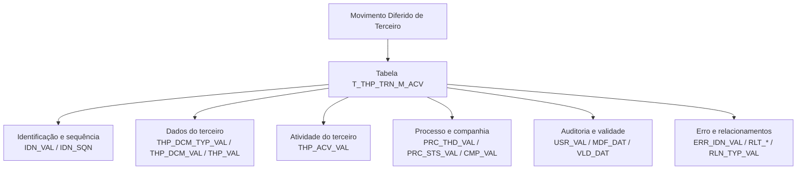

# Detalhamento de Atividades no Movimento Diferido de Terceiros — Visão Técnica e Modelo de Dados

## 1. Metadados do Documento
- **Arquivo de Origem:** Não identificado no conteúdo fornecido
- **Tipo de Documento:** Especificação Técnica
- **Domínio / Sistema:** Reef / Mapfre / THP / TRN
- **Público-Alvo:** Desenvolvedores, Arquitetos e equipes de dados
- **Data/Versão Identificada:** Não identificada

---

## 2. Resumo Executivo & Contexto de Negócio

O documento apresenta uma visão técnica para detalhar informações de atividades no movimento diferido de um terceiro. O conteúdo se concentra no modelo de dados envolvido nessa operação e identifica a tabela `T_THP_TRN_M_ACV` como a estrutura participante.

A tabela `T_THP_TRN_M_ACV` é descrita como a “TABLA BUZÓN ACTIVIDADES DE UN TERCERO”, ou seja, uma tabela destinada ao armazenamento ou tratamento de atividades associadas a um terceiro. A documentação enumera as colunas disponíveis, indicando se cada uma pode mudar de valor, se é obrigatória e qual é seu significado funcional.

O modelo contém identificadores, dados de companhia, documentos do terceiro, códigos de atividade, referências a documentos e atividades relacionadas, situação de processo, usuário responsável pela atualização e datas de modificação e validade. Também estão presentes atributos de erro e relacionamento entre terceiros.

O conteúdo está publicado no contexto de “DOCUMENTACIÓN Reef” e “Mapfredocument”, com ciclo de vida indicado como `Approved`. Não há detalhamento sobre operações de escrita, métodos HTTP, APIs, eventos, integrações, chaves primárias, tipos físicos das colunas ou regras de persistência.

---

## 3. Arquitetura, Componentes & Tecnologias Envolvidas

Os componentes e contextos explicitamente identificados são:

| Componente / Termo | Papel identificado no documento |
| :--- | :--- |
| `T_THP_TRN_M_ACV` | Tabela envolvida na operação de movimento diferido de atividades de terceiros. |
| THP | Contexto presente nos nomes de colunas relacionados a terceiros, documentos e atividades. O significado expandido da sigla não é informado. |
| TRN | Contexto presente no nome da tabela `T_THP_TRN_M_ACV`. O significado expandido da sigla não é informado. |
| Reef | Plataforma ou contexto de documentação identificado como “DOCUMENTACIÓN Reef”. |
| Mapfre | Contexto corporativo identificado pela referência “Mapfredocument”. |
| `Approved` | Estado de ciclo de vida exibido para a documentação. |



> **Nota de Análise:** O documento descreve uma tabela e seus campos, mas não detalha sistemas consumidores, sistemas produtores, APIs, contratos JSON, métodos HTTP, mecanismos de integração ou tecnologias de banco de dados.

---

## 4. Regras de Negócio, Especificações Funcionais & Processos

A especificação disponível descreve os atributos da tabela `T_THP_TRN_M_ACV` e sua obrigatoriedade. Não há um fluxo operacional detalhado para criação, alteração, exclusão, consulta ou processamento de registros.

### Regras de obrigatoriedade identificadas

1. `IDN_VAL` é obrigatório e representa o identificador.
2. `IDN_SQN` é obrigatório e representa a sequência dentro do identificador.
3. `CMP_VAL` é obrigatório e representa a companhia.
4. `THP_DCM_TYP_VAL` é obrigatório e representa o tipo de documento do terceiro.
5. `THP_DCM_VAL` é obrigatório e representa o código de documento do terceiro.
6. `THP_ACV_VAL` é obrigatório e representa a atividade do terceiro.
7. `USR_VAL` é obrigatório e representa o usuário que atualizou a linha.
8. `MDF_DAT` é obrigatório e representa a data de atualização da linha.
9. Os demais atributos listados no documento estão marcados como não obrigatórios.
10. Todas as colunas apresentadas estão marcadas com `S` na coluna “CAMBIA VALOR”.
11. Todas as colunas apresentadas têm `N.A.` na coluna “MOTIVO/VALOR”.

### Significados funcionais identificados

- O registro armazena identificação, sequência, companhia e informações documentais de um terceiro.
- O registro mantém a atividade do terceiro em `THP_ACV_VAL`.
- O registro pode guardar referências a um documento pai de terceiro, por meio de `PRN_DCM_TYP_VAL` e `PRN_DCM_VAL`.
- O registro pode registrar a primeira ação produzida sobre o registro em `ACN_ORG_VAL`, com valores mencionados como `(I)NSERTAR` e `(M)ODIFICAR`.
- O registro contém dados de auditoria por meio de `USR_VAL` e `MDF_DAT`.
- O registro pode armazenar código de erro em `ERR_IDN_VAL` e data de validade em `VLD_DAT`.
- O registro pode representar atividade, tipo documental, documento e tipo de relação de um terceiro relacionado por meio dos campos iniciados por `RLT_` e de `RLN_TYP_VAL`.

> **Nota de Análise:** O documento não especifica quais valores são válidos para situação de processo (`PRC_STS_VAL`), hilo (`PRC_THD_VAL`), companhia (`CMP_VAL`), tipo de relação (`RLN_TYP_VAL`) ou código de erro (`ERR_IDN_VAL`).

---

## 5. Tabelas de Parâmetros, Ambientes e Estruturas de Dados

### Tabela principal

| Item / Parâmetro | Descrição / Função | Tipo / Valores / Formato | Ambiente / Observações |
| :--- | :--- | :--- | :--- |
| `T_THP_TRN_M_ACV` | Tabela buzón de atividades de um terceiro. | Tabela de dados; tipo físico não informado. | Tabela que intervém na operação descrita. |

### Estrutura de dados: `T_THP_TRN_M_ACV`

| Item / Parâmetro | Descrição / Função | Tipo / Valores / Formato | Ambiente / Observações |
| :--- | :--- | :--- | :--- |
| `IDN_VAL` | Identificador. | Pode mudar: `S`; motivo/valor: `N.A.` | Obrigatória: Sim. |
| `IDN_SQN` | Sequência dentro do identificador. | Pode mudar: `S`; motivo/valor: `N.A.` | Obrigatória: Sim. |
| `PRC_THD_VAL` | Hilo. | Pode mudar: `S`; motivo/valor: `N.A.` | Obrigatória: Não. |
| `PRC_STS_VAL` | Situação do processo. | Pode mudar: `S`; motivo/valor: `N.A.` | Obrigatória: Não. |
| `CMP_VAL` | Companhia. | Pode mudar: `S`; motivo/valor: `N.A.` | Obrigatória: Sim. |
| `THP_DCM_TYP_VAL` | Tipo de documento do terceiro. | Pode mudar: `S`; motivo/valor: `N.A.` | Obrigatória: Sim. |
| `THP_DCM_VAL` | Código de documento do terceiro. | Pode mudar: `S`; motivo/valor: `N.A.` | Obrigatória: Sim. |
| `THP_VAL` | Código de terceiro. | Pode mudar: `S`; motivo/valor: `N.A.` | Obrigatória: Não. |
| `THP_ACV_VAL` | Atividade do terceiro. | Pode mudar: `S`; motivo/valor: `N.A.` | Obrigatória: Sim. |
| `PRN_DCM_TYP_VAL` | Tipo de documento pai de um terceiro. | Pode mudar: `S`; motivo/valor: `N.A.` | Obrigatória: Não. |
| `PRN_DCM_VAL` | Código de documento pai de um terceiro. | Pode mudar: `S`; motivo/valor: `N.A.` | Obrigatória: Não. |
| `ACN_ORG_VAL` | Primeira ação produzida sobre o registro. | Valores mencionados: `(I)NSERTAR`, `(M)ODIFICAR`; pode mudar: `S`; motivo/valor: `N.A.` | Obrigatória: Não. |
| `USR_VAL` | Usuário que atualizou a linha. | Pode mudar: `S`; motivo/valor: `N.A.` | Obrigatória: Sim. |
| `MDF_DAT` | Data de atualização da linha. | Pode mudar: `S`; motivo/valor: `N.A.` | Obrigatória: Sim. |
| `ERR_IDN_VAL` | Código de erro. | Pode mudar: `S`; motivo/valor: `N.A.` | Obrigatória: Não. |
| `VLD_DAT` | Data de validade. | Pode mudar: `S`; motivo/valor: `N.A.` | Obrigatória: Não. |
| `RLT_THP_ACV_VAL` | Atividade do terceiro relacionado. | Pode mudar: `S`; motivo/valor: `N.A.` | Obrigatória: Não. |
| `RLT_THP_DCM_TYP_VAL` | Tipo do documento do terceiro relacionado. | Pode mudar: `S`; motivo/valor: `N.A.` | Obrigatória: Não. |
| `RLT_THP_DCM_VAL` | Documento do terceiro relacionado. | Pode mudar: `S`; motivo/valor: `N.A.` | Obrigatória: Não. |
| `RLN_TYP_VAL` | Tipo de relação. | Pode mudar: `S`; motivo/valor: `N.A.` | Obrigatória: Não. |

### Informações de documentação

| Item / Parâmetro | Descrição / Função | Tipo / Valores / Formato | Ambiente / Observações |
| :--- | :--- | :--- | :--- |
| Documentação | Referência exibida como “DOCUMENTACIÓN Reef”. | Texto. | Contexto de documentação Reef. |
| Referência corporativa | “Mapfredocument”. | Texto. | Referência exibida no conteúdo. |
| Owner | `user:agonzalez_mapfre.com` | Identificador de proprietário conforme exibido. | Não há detalhamento adicional. |
| Lifecycle | Estado de ciclo de vida. | `Approved` | Aprovado conforme exibido. |
| Idioma | Idioma exibido na interface. | `ES` | Interface apresentada em espanhol. |

---

## 6. Bateria de Perguntas & Respostas para RAG (FAQ Sintético)

### P1: Qual tabela intervém no detalhamento de atividades no movimento diferido de um terceiro?
**R:** A tabela identificada pelo documento é `T_THP_TRN_M_ACV`, descrita como “TABLA BUZÓN ACTIVIDADES DE UN TERCERO”.

### P2: Quais campos são obrigatórios na tabela `T_THP_TRN_M_ACV`?
**R:** Os campos obrigatórios são `IDN_VAL`, `IDN_SQN`, `CMP_VAL`, `THP_DCM_TYP_VAL`, `THP_DCM_VAL`, `THP_ACV_VAL`, `USR_VAL` e `MDF_DAT`.

### P3: Qual coluna representa a atividade do terceiro?
**R:** A atividade do terceiro é representada pela coluna `THP_ACV_VAL`, que está marcada como obrigatória.

### P4: Como a tabela identifica um registro e sua sequência?
**R:** O identificador do registro é armazenado em `IDN_VAL`, enquanto `IDN_SQN` armazena a sequência dentro desse identificador. Ambos os campos são obrigatórios.

### P5: Quais colunas armazenam os dados documentais de um terceiro?
**R:** Os dados documentais do terceiro são armazenados em `THP_DCM_TYP_VAL`, para o tipo de documento, e `THP_DCM_VAL`, para o código de documento. Ambos são obrigatórios. O código do terceiro é registrado em `THP_VAL`, que não é obrigatório.

### P6: Como o documento registra auditoria de alterações em uma linha?
**R:** O usuário que atualizou a linha é registrado em `USR_VAL`, e a data de atualização da linha é registrada em `MDF_DAT`. Ambos os campos são obrigatórios.

### P7: Qual coluna registra a primeira ação realizada sobre o registro?
**R:** A coluna `ACN_ORG_VAL` registra a primeira ação produzida sobre o registro. O documento menciona os valores `(I)NSERTAR` e `(M)ODIFICAR`.

### P8: Quais campos representam um documento pai de um terceiro?
**R:** `PRN_DCM_TYP_VAL` representa o tipo de documento pai de um terceiro, e `PRN_DCM_VAL` representa o código de documento pai de um terceiro. Ambos não são obrigatórios.

### P9: Como são armazenadas informações sobre um terceiro relacionado?
**R:** A atividade do terceiro relacionado é armazenada em `RLT_THP_ACV_VAL`; o tipo de documento do terceiro relacionado, em `RLT_THP_DCM_TYP_VAL`; o documento do terceiro relacionado, em `RLT_THP_DCM_VAL`; e o tipo de relação, em `RLN_TYP_VAL`. Todos são não obrigatórios.

### P10: Existe um campo para código de erro e validade do registro?
**R:** Sim. `ERR_IDN_VAL` armazena o código de erro e `VLD_DAT` armazena a data de validade. Nenhum dos dois campos é obrigatório segundo o documento.

### P11: O documento define tipos físicos, tamanhos ou domínios de valores das colunas?
**R:** Não. O documento informa se as colunas podem mudar, se são obrigatórias e seus comentários funcionais, mas não especifica tipos físicos, tamanhos, restrições de domínio ou chaves da tabela.

### P12: O documento descreve APIs ou métodos HTTP para operar a tabela `T_THP_TRN_M_ACV`?
**R:** Não. O conteúdo fornecido é uma visão técnica do modelo de dados e não detalha APIs, métodos HTTP, contratos JSON, endpoints ou sistemas integrados.

---

## 7. Glossário de Termos, Siglas & Conceitos-Chave

- **`T_THP_TRN_M_ACV`:** Tabela identificada como “TABLA BUZÓN ACTIVIDADES DE UN TERCERO”.
- **THP:** Sigla presente em campos relacionados a terceiro, documento e atividade. O significado expandido não é informado.
- **TRN:** Sigla presente no nome da tabela `T_THP_TRN_M_ACV`. O significado expandido não é informado.
- **ACV:** Sigla presente no nome da tabela e em campos de atividade. O significado expandido não é informado.
- **`IDN_VAL`:** Identificador.
- **`IDN_SQN`:** Sequência dentro do identificador.
- **`PRC_THD_VAL`:** Hilo.
- **`PRC_STS_VAL`:** Situação do processo.
- **`CMP_VAL`:** Companhia.
- **`THP_DCM_TYP_VAL`:** Tipo de documento do terceiro.
- **`THP_DCM_VAL`:** Código de documento do terceiro.
- **`THP_VAL`:** Código de terceiro.
- **`THP_ACV_VAL`:** Atividade do terceiro.
- **`PRN_DCM_TYP_VAL`:** Tipo de documento pai de um terceiro.
- **`PRN_DCM_VAL`:** Código de documento pai de um terceiro.
- **`ACN_ORG_VAL`:** Primeira ação produzida sobre o registro.
- **`USR_VAL`:** Usuário que atualizou a linha.
- **`MDF_DAT`:** Data de atualização da linha.
- **`ERR_IDN_VAL`:** Código de erro.
- **`VLD_DAT`:** Data de validade.
- **`RLT_THP_ACV_VAL`:** Atividade do terceiro relacionado.
- **`RLT_THP_DCM_TYP_VAL`:** Tipo do documento do terceiro relacionado.
- **`RLT_THP_DCM_VAL`:** Documento do terceiro relacionado.
- **`RLN_TYP_VAL`:** Tipo de relação.
- **Reef:** Contexto de documentação identificado como “DOCUMENTACIÓN Reef”.
- **Lifecycle `Approved`:** Estado de ciclo de vida exibido para a documentação.

---

## 8. Notas Críticas, Riscos & Limitações

- O documento não informa tipos de dados físicos, tamanhos, precisão, codificação, chaves primárias, chaves estrangeiras ou índices da tabela `T_THP_TRN_M_ACV`.
- O documento não define regras de validação para valores de `CMP_VAL`, `PRC_THD_VAL`, `PRC_STS_VAL`, `ERR_IDN_VAL` e `RLN_TYP_VAL`.
- Apesar de `ACN_ORG_VAL` mencionar `(I)NSERTAR` e `(M)ODIFICAR`, não há indicação de que esses sejam os únicos valores permitidos.
- Não há descrição de operações de inserção, modificação, exclusão, consulta, tratamento de erros ou ciclo de processamento do movimento diferido.
- Não são descritos endpoints, APIs, contratos de integração, consumidores, produtores, eventos, filas, logs, URLs de ambientes ou mecanismos de autenticação.
- O significado expandido das siglas THP, TRN e ACV não foi fornecido.
- O documento lista a tabela `T_THP_TRN_M_ACV`, porém não detalha o mecanismo técnico pelo qual a tabela é alimentada ou consultada.

---

## 9. Conteúdo Bruto Estruturado (Referência Fiel)

```text
--- [PÁGINA 1 DE 2] ---

DETALLAR Información de Actividades en el Movimiento Diferido del
Tercero (Visión Técnica)
Modelo de datos involucrado
La tabla que interviene en esta operación es:
TABLA DESCRIPCIÓN
T_THP_TRN_M_ACV TABLA BUZÓN ACTIVIDADES DE UN TERCERO
COLUMNA CAMBIA
VALOR
MOTIVO/VALOR OBLIGATORIA COMENTARIO
IDN_VAL S N.A. SI IDENTIFICADOR
IDN_SQN S N.A. SI SECUENCIA DENTRO DEL IDENTIFICADOR
PRC_THD_VAL S N.A. NO HILO
PRC_STS_VAL S N.A. NO SITUACIÓN DEL PROCESO
CMP_VAL S N.A. SI COMPAÑÍA
THP_DCM_TYP_VAL S N.A. SI TIPO DE DOCUMENTO DEL TERCERO
THP_DCM_VAL S N.A. SI CÓDIGO DE DOCUMENTO DEL TERCERO
THP_VAL S N.A. NO CÓDIGO DE TERCERO
THP_ACV_VAL S N.A. SI ACTIVIDAD DEL TERCERO
PRN_DCM_TYP_VAL S N.A. NO TIPO DE DOCUMENTO PADRE DE UN
TERCERO
Documentation / DOCUMENTACIÓN Reef
DOCUMENTACIÓN Reef
Mapfredocument
DOCUMENTACIÓN Reef
Owner
user:agonzalez_mapfre.com
Lifecycle
Approved Source
 / 
 VL
Buscar Inicio Soluciones Arquitecturas APIs Componentes Cloud Documentación Zeus Reef Ayuda
ES


--- [PÁGINA 2 DE 2] ---

COLUMNA CAMBIA
VALOR
MOTIVO/VALOR OBLIGATORIA COMENTARIO
PRN_DCM_VAL S N.A. NO CÓDIGO DE DOCUMENTO PADRE DE UN
TERCERO
ACN_ORG_VAL S N.A. NO PRIMERA ACCION QUE SE PRODUCE SOBRE
EL REGISTRO ( (I)NSERTAR, (M)ODIFICAR )
USR_VAL S N.A. SI USUARIO QUE ACTUALIZO LA FILA
MDF_DAT S N.A. SI FECHA DE ACTUALIZACIÓN DE LA FILA
ERR_IDN_VAL S N.A. NO CODIGO DE ERROR
VLD_DAT S N.A. NO FECHA VALIDEZ
RLT_THP_ACV_VAL S N.A. NO ACTIVIDAD DEL TERCERO RELACIONADO
RLT_THP_DCM_TYP_VAL S N.A. NO TIPO DEL DOCUMENTO DEL TERCERO
RELACIONADO
RLT_THP_DCM_VAL S N.A. NO DOCUMENTO DEL TERCERO RELACIONADO
RLN_TYP_VAL S N.A. NO TIPO DE RELACIÓN
```
