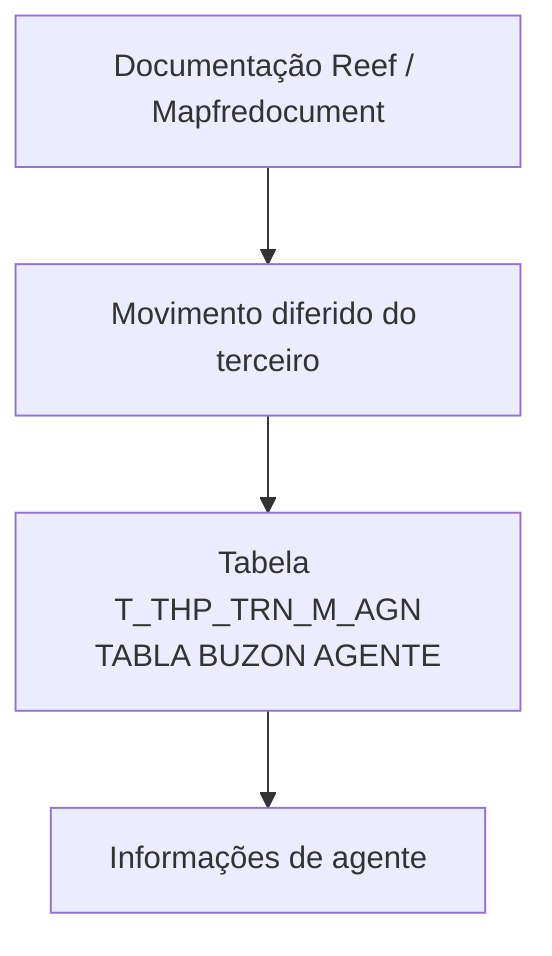

# Detalhar Informação do Agente no Movimento Diferido do Terceiro — Visão Técnica

## 1. Metadados do Documento
- **Arquivo de Origem:** Não identificado no conteúdo extraído
- **Tipo de Documento:** Especificação Técnica
- **Domínio / Sistema:** Reef / Mapfre — movimento diferido do terceiro
- **Público-Alvo:** Desenvolvedores, Arquitetos, Operação e equipes responsáveis pelo modelo de dados
- **Data/Versão Identificada:** Não identificada

---

## 2. Resumo Executivo & Contexto de Negócio

O documento apresenta uma visão técnica para detalhar informações de agente no contexto de um movimento diferido de terceiro. O foco do conteúdo é o modelo de dados envolvido nessa operação, sem apresentar fluxo operacional, contratos de integração, métodos HTTP ou regras de cálculo.

A entidade de dados identificada é a tabela `T_THP_TRN_M_AGN`, descrita como **TABLA BUZON AGENTE**. O documento relaciona as colunas da tabela, indicando se cada uma muda de valor, o motivo ou valor associado, sua obrigatoriedade e uma descrição funcional em espanhol.

A estrutura registrada abrange identificação e sequenciamento, dados de companhia e terceiro, informações comerciais, credenciais, contratos, comissões, classificação, inabilitação, situação do agente, rastreabilidade de atualização e erros.

O conteúdo também referencia o repositório documental Reef, a documentação Mapfre e o proprietário `user:agonzalez_mapfre.com`, com ciclo de vida indicado como `Approved`.

> **Nota de Análise:** O documento não detalha operações de banco de dados, tipos físicos das colunas, chaves primárias, relacionamentos, métodos de atualização, contratos JSON, APIs, ambientes ou mecanismos de integração.

---

## 3. Arquitetura, Componentes & Tecnologias Envolvidas

Os elementos explicitamente citados são:

| Componente / Elemento | Descrição sustentada pelo documento |
| :--- | :--- |
| `T_THP_TRN_M_AGN` | Tabela que intervém na operação; descrita como tabela de buzón de agente. |
| Reef | Repositório ou contexto de documentação referenciado como “DOCUMENTACIÓN Reef”. |
| Mapfredocument | Referência documental exibida no conteúdo bruto. |
| Movimento diferido do terceiro | Contexto funcional da visão técnica apresentada. |
| Agente | Entidade cujas informações são registradas na tabela `T_THP_TRN_M_AGN`. |
| `user:agonzalez_mapfre.com` | Owner indicado na documentação. |
| `Approved` | Lifecycle indicado na documentação. |



> **Nota de Análise:** O diagrama representa somente a relação documental e de dados explícita. O documento não descreve microsserviços, camadas de aplicação, bancos de dados, filas, endpoints, tecnologias de execução ou fluxos de integração.

---

## 4. Regras de Negócio, Especificações Funcionais & Processos

1. A operação descrita utiliza a tabela `T_THP_TRN_M_AGN`.
2. A tabela é denominada no documento como **TABLA BUZON AGENTE**.
3. Todas as colunas exibidas possuem `S` no campo **CAMBIA VALOR**.
4. Todas as colunas exibidas possuem `N.A.` no campo **MOTIVO/VALOR**.
5. As colunas marcadas como obrigatórias (`SI`) são:
   - `IDN_VAL`
   - `IDN_SQN`
   - `CMP_VAL`
   - `THP_DCM_TYP_VAL`
   - `THP_DCM_VAL`
   - `THP_ACV_VAL`
   - `THP_VAL`
   - `VLD_DAT`
   - `USR_VAL`
   - `MDF_DAT`
6. A coluna `ACN_ORG_VAL` registra a primeira ação produzida sobre o registro, com os valores documentados:
   - `(I)NSERTAR`
   - `(M)ODIFICAR`
7. A coluna `VLD_DAT` representa a data de validade.
8. A coluna `USR_VAL` registra o usuário que atualizou a linha.
9. A coluna `MDF_DAT` registra a data de atualização da linha.
10. A coluna `ERR_IDN_VAL` registra o código de erro.
11. A coluna `DSB_ROW` identifica inabilitação, enquanto `THP_DSC_VAL` registra a causa da inabilitação e `DSB_PRC_TYP_VAL` registra o processo para o qual a entidade está inabilitada.

> **Nota de Análise:** O documento não define regras de validação adicionais, valores permitidos além de `I` e `M` para `ACN_ORG_VAL`, comportamento de inserção/modificação, tratamentos de erro ou dependências entre colunas.

---

## 5. Tabelas de Parâmetros, Ambientes e Estruturas de Dados

| Item / Parâmetro | Descrição / Função | Tipo / Valores / Formato | Ambiente / Observações |
| :--- | :--- | :--- | :--- |
| `T_THP_TRN_M_AGN` | Tabela envolvida na operação; TABLA BUZON AGENTE | Tabela | Não informado |
| `IDN_VAL` | Identificador | Muda valor: `S`; motivo/valor: `N.A.` | Obrigatória: `SI` |
| `IDN_SQN` | Sequência dentro do identificador | Muda valor: `S`; motivo/valor: `N.A.` | Obrigatória: `SI` |
| `PRC_THD_VAL` | Hilo | Muda valor: `S`; motivo/valor: `N.A.` | Obrigatória: `NO` |
| `PRC_STS_VAL` | Situação do processo | Muda valor: `S`; motivo/valor: `N.A.` | Obrigatória: `NO` |
| `CMP_VAL` | Companhia | Muda valor: `S`; motivo/valor: `N.A.` | Obrigatória: `SI` |
| `THP_DCM_TYP_VAL` | Tipo de documento do terceiro | Muda valor: `S`; motivo/valor: `N.A.` | Obrigatória: `SI` |
| `THP_DCM_VAL` | Código de documento do terceiro | Muda valor: `S`; motivo/valor: `N.A.` | Obrigatória: `SI` |
| `THP_ACV_VAL` | Atividade do terceiro | Muda valor: `S`; motivo/valor: `N.A.` | Obrigatória: `SI` |
| `THP_VAL` | Código de terceiro | Muda valor: `S`; motivo/valor: `N.A.` | Obrigatória: `SI` |
| `ACE_VAL` | Código de terceiro executivo | Muda valor: `S`; motivo/valor: `N.A.` | Obrigatória: `NO` |
| `THR_LVL_VAL` | Terceiro nível da estrutura comercial | Muda valor: `S`; motivo/valor: `N.A.` | Obrigatória: `NO` |
| `DRC_AGN` | Agente direto | Muda valor: `S`; motivo/valor: `N.A.` | Obrigatória: `NO` |
| `AGN_TYP_VAL` | Tipo de agente | Muda valor: `S`; motivo/valor: `N.A.` | Obrigatória: `NO` |
| `ORN_VAL` | Código de terceiro organizador | Muda valor: `S`; motivo/valor: `N.A.` | Obrigatória: `NO` |
| `AVS_VAL` | Terceiro assessor | Muda valor: `S`; motivo/valor: `N.A.` | Obrigatória: `NO` |
| `MTC_VAL` | Compensação | Muda valor: `S`; motivo/valor: `N.A.` | Obrigatória: `NO` |
| `AGN_ASC_VAL` | Número de colegiado | Muda valor: `S`; motivo/valor: `N.A.` | Obrigatória: `NO` |
| `CRL_DAT` | Data de início da credencial | Muda valor: `S`; motivo/valor: `N.A.` | Obrigatória: `NO` |
| `CRL_EXP_DAT` | Data de vencimento da credencial | Muda valor: `S`; motivo/valor: `N.A.` | Obrigatória: `NO` |
| `CTR_VAL` | Contrato | Muda valor: `S`; motivo/valor: `N.A.` | Obrigatória: `NO` |
| `CTR_RGS_DAT` | Data de alta do contrato | Muda valor: `S`; motivo/valor: `N.A.` | Obrigatória: `NO` |
| `CTR_RMV_DAT` | Data de baixa do contrato | Muda valor: `S`; motivo/valor: `N.A.` | Obrigatória: `NO` |
| `THP_QLT_VAL` | Qualidade | Muda valor: `S`; motivo/valor: `N.A.` | Obrigatória: `NO` |
| `SND_VAL` | Envio; forma pela qual os documentos são enviados | Muda valor: `S`; motivo/valor: `N.A.` | Obrigatória: `NO` |
| `THP_GRG_VAL` | Agrupamento do terceiro | Muda valor: `S`; motivo/valor: `N.A.` | Obrigatória: `NO` |
| `AGN_OBS_VAL` | Observações | Muda valor: `S`; motivo/valor: `N.A.` | Obrigatória: `NO` |
| `RTN_TYP_VAL` | Retenção | Muda valor: `S`; motivo/valor: `N.A.` | Obrigatória: `NO` |
| `CMS_EXL` | Excluído de comissões | Muda valor: `S`; motivo/valor: `N.A.` | Obrigatória: `NO` |
| `PRE_NTC` | Aviso de primas | Muda valor: `S`; motivo/valor: `N.A.` | Obrigatória: `NO` |
| `MAG_MTH` | Forma de gestão | Muda valor: `S`; motivo/valor: `N.A.` | Obrigatória: `NO` |
| `CFT_VAL` | Classificação | Muda valor: `S`; motivo/valor: `N.A.` | Obrigatória: `NO` |
| `DSB_ROW` | Inabilitado | Muda valor: `S`; motivo/valor: `N.A.` | Obrigatória: `NO` |
| `VLD_DAT` | Data de validade | Muda valor: `S`; motivo/valor: `N.A.` | Obrigatória: `SI` |
| `AGN_STS_TYP_VAL` | Situação | Muda valor: `S`; motivo/valor: `N.A.` | Obrigatória: `NO` |
| `BNF_CSS_VAL` | Classe de beneficiário | Muda valor: `S`; motivo/valor: `N.A.` | Obrigatória: `NO` |
| `THP_DSC_VAL` | Causa de inabilitação | Muda valor: `S`; motivo/valor: `N.A.` | Obrigatória: `NO` |
| `DSB_PRC_TYP_VAL` | Processo para o qual está inabilitado | Muda valor: `S`; motivo/valor: `N.A.` | Obrigatória: `NO` |
| `ACN_ORG_VAL` | Primeira ação produzida sobre o registro | `(I)NSERTAR`, `(M)ODIFICAR`; muda valor: `S`; motivo/valor: `N.A.` | Obrigatória: `NO` |
| `USR_VAL` | Usuário que atualizou a linha | Muda valor: `S`; motivo/valor: `N.A.` | Obrigatória: `SI` |
| `MDF_DAT` | Data de atualização da linha | Muda valor: `S`; motivo/valor: `N.A.` | Obrigatória: `SI` |
| `ERR_IDN_VAL` | Código de erro | Muda valor: `S`; motivo/valor: `N.A.` | Obrigatória: `NO` |
| `THR_DST_HNL_VAL` | Terceiro canal de distribuição | Muda valor: `S`; motivo/valor: `N.A.` | Obrigatória: `NO` |

---

## 6. Bateria de Perguntas & Respostas para RAG (FAQ Sintético)

### P1: Qual tabela participa do detalhamento de informações de agente no movimento diferido do terceiro?
**R:** A tabela identificada no documento é `T_THP_TRN_M_AGN`, descrita como `TABLA BUZON AGENTE`.

### P2: Quais campos obrigatórios são documentados para a tabela `T_THP_TRN_M_AGN`?
**R:** Os campos marcados como obrigatórios (`SI`) são `IDN_VAL`, `IDN_SQN`, `CMP_VAL`, `THP_DCM_TYP_VAL`, `THP_DCM_VAL`, `THP_ACV_VAL`, `THP_VAL`, `VLD_DAT`, `USR_VAL` e `MDF_DAT`.

### P3: O que representam `IDN_VAL` e `IDN_SQN`?
**R:** `IDN_VAL` é o identificador, enquanto `IDN_SQN` é a sequência dentro do identificador. Ambos são obrigatórios no documento.

### P4: Como o documento registra o tipo de documento e o código de documento do terceiro?
**R:** O tipo de documento do terceiro é registrado em `THP_DCM_TYP_VAL`, e o código de documento do terceiro é registrado em `THP_DCM_VAL`. Ambos os campos são obrigatórios.

### P5: Qual campo indica a ação inicial realizada sobre um registro?
**R:** O campo `ACN_ORG_VAL` registra a primeira ação produzida sobre o registro. Os valores explicitamente documentados são `(I)NSERTAR` e `(M)ODIFICAR`.

### P6: Quais campos tratam de inabilitação?
**R:** `DSB_ROW` indica inabilitação, `THP_DSC_VAL` registra a causa de inabilitação e `DSB_PRC_TYP_VAL` identifica o processo para o qual a entidade está inabilitada.

### P7: Como a rastreabilidade de atualização da linha é mantida?
**R:** A rastreabilidade é representada por `USR_VAL`, que identifica o usuário que atualizou a linha, e `MDF_DAT`, que registra a data de atualização da linha. Ambos são obrigatórios.

### P8: Qual campo armazena informações sobre envio de documentos?
**R:** O campo `SND_VAL` representa o envio, descrito como a forma pela qual os documentos são enviados. O campo não é obrigatório segundo o documento.

### P9: O documento especifica APIs, métodos HTTP ou contratos JSON para a tabela de agente?
**R:** Não. O documento somente apresenta a tabela `T_THP_TRN_M_AGN` e suas colunas. Não há métodos HTTP, endpoints, contratos JSON ou detalhes de integração.

### P10: Quem é indicado como proprietário da documentação?
**R:** O proprietário indicado no conteúdo extraído é `user:agonzalez_mapfre.com`.

---

## 7. Glossário de Termos, Siglas & Conceitos-Chave

- **Reef:** Contexto ou repositório documental mencionado como `DOCUMENTACIÓN Reef`.
- **Mapfredocument:** Referência documental exibida no conteúdo.
- **`T_THP_TRN_M_AGN`:** Tabela envolvida na operação, descrita como `TABLA BUZON AGENTE`.
- **Agente:** Entidade cujas informações são tratadas pelas colunas da tabela.
- **Terceiro:** Entidade referenciada no contexto de documento, atividade, código, agrupamento e movimento diferido.
- **`IDN_VAL`:** Identificador.
- **`IDN_SQN`:** Sequência dentro do identificador.
- **`CMP_VAL`:** Companhia.
- **`VLD_DAT`:** Data de validade.
- **`USR_VAL`:** Usuário que atualizou a linha.
- **`MDF_DAT`:** Data de atualização da linha.
- **`ERR_IDN_VAL`:** Código de erro.
- **`ACN_ORG_VAL`:** Primeira ação produzida sobre o registro.
- **`DSB_ROW`:** Inabilitado.
- **`DSB_PRC_TYP_VAL`:** Processo para o qual está inabilitado.
- **`THP_DSC_VAL`:** Causa de inabilitação.
- **`CMS_EXL`:** Excluído de comissões.
- **`SND_VAL`:** Forma pela qual os documentos são enviados.

---

## 8. Notas Críticas, Riscos & Limitações

- O documento não informa o nome do arquivo de origem, data, versão, autor técnico ou histórico de alterações.
- Não há definição de tipos de dados físicos, tamanhos, domínios, índices, chaves, relacionamentos ou restrições de banco de dados.
- O significado formal do valor `S` em **CAMBIA VALOR** não é explicado; o documento apenas o apresenta para todas as colunas.
- O valor `N.A.` é apresentado na coluna **MOTIVO/VALOR** para todos os campos, sem detalhamento adicional.
- Não são descritos ambientes, servidores, URLs, portas, credenciais, logs, APIs, contratos de integração ou fluxos de processamento.
- Os campos possuem descrições funcionais, mas não há especificação dos valores válidos para a maioria deles.
- Somente `ACN_ORG_VAL` possui valores de ação explicitamente listados: `(I)NSERTAR` e `(M)ODIFICAR`.

---

## 9. Conteúdo Bruto Estruturado (Referência Fiel)

```text
--- [PÁGINA 1 DE 3] ---

DETALLAR Información del Agente en el Movimiento Diferido del
Tercero (Visión Técnica)
Modelo de datos involucrado
La tabla que interviene en esta operación es:
TABLA DESCRIPCIÓN
T_THP_TRN_M_AGN TABLA BUZON AGENTE
COLUMNA CAMBIA
VALOR
MOTIVO/VALOR OBLIGATORIA COMENTARIO
IDN_VAL S N.A. SI IDENTIFICADOR
IDN_SQN S N.A. SI SECUENCIA DENTRO DEL IDENTIFICADOR
PRC_THD_VAL S N.A. NO HILO
PRC_STS_VAL S N.A. NO SITUACION DEL PROCESO
CMP_VAL S N.A. SI COMPAÑIA
THP_DCM_TYP_VAL S N.A. SI TIPO DE COCUMENTO DEL TERCERO
THP_DCM_VAL S N.A. SI CODIGO DE DOCUMENTO DEL TERCERO
THP_ACV_VAL S N.A. SI ACTIVIDAD DEL TERCERO
THP_VAL S N.A. SI CODIGO DE TERCERO
ACE_VAL S N.A. NO CODIGO DE TERCERO EJECUTIVO
THR_LVL_VAL S N.A. NO TERCER NIVEL ESTRUCTURA COMERCIAL
Documentation / DOCUMENTACIÓN Reef
DOCUMENTACIÓN Reef
Mapfredocument
DOCUMENTACIÓN Reef
Owner
user:agonzalez_mapfre.com
Lifecycle
Approved Source
 /
 VL
Buscar Inicio Soluciones Arquitecturas APIs Componentes Cloud Documentación Zeus Reef Ayuda
ES


--- [PÁGINA 2 DE 3] ---

COLUMNA CAMBIA
VALOR
MOTIVO/VALOR OBLIGATORIA COMENTARIO
DRC_AGN S N.A. NO AGENTE DIRECTO
AGN_TYP_VAL S N.A. NO TIPO AGENTE
ORN_VAL S N.A. NO CODIGO DE TERCERO ORGANIZADOR
AVS_VAL S N.A. NO TERCERO ASESOR
MTC_VAL S N.A. NO COMPENSACION
AGN_ASC_VAL S N.A. NO NUMERO DE COLEGIADO
CRL_DAT S N.A. NO FECHA INICIO CREDENCIAL
CRL_EXP_DAT S N.A. NO FECHA VENCIMIENTO CREDENCIAL
CTR_VAL S N.A. NO CONTRATO
CTR_RGS_DAT S N.A. NO FECHA ALTA CONTRATO
CTR_RMV_DAT S N.A. NO FECHA BAJA CONTRATO
THP_QLT_VAL S N.A. NO CALIDAD
SND_VAL S N.A. NO ENVIO - FORMA EN LA QUE SE ENVIA LOS
DOCUMENTOS
THP_GRG_VAL S N.A. NO AGRUPAMIENTO DEL TERCERO
AGN_OBS_VAL S N.A. NO OBSERVACIONES
RTN_TYP_VAL S N.A. NO RETENCION
CMS_EXL S N.A. NO EXCLUIDO DE COMISIONES
PRE_NTC S N.A. NO AVISO DE PRIMAS
MAG_MTH S N.A. NO FORMA DE GESTION
CFT_VAL S N.A. NO CLASIFICACION
DSB_ROW S N.A. NO INHABILITADO
VLD_DAT S N.A. SI FECHA DE VALIDEZ
AGN_STS_TYP_VAL S N.A. NO SITUACION
BNF_CSS_VAL S N.A. NO CLASE DE BENEFICIARIO
THP_DSC_VAL S N.A. NO CAUSA DE INHABILITACION


--- [PÁGINA 3 DE 3] ---

COLUMNA CAMBIA
VALOR
MOTIVO/VALOR OBLIGATORIA COMENTARIO
DSB_PRC_TYP_VAL S N.A. NO PROCESO PARA EL QUE ESTA INHABILITADO
ACN_ORG_VAL S N.A. NO PRMERA ACCION QUE SE PRODUCE SOBRE EL
REGISTRO ( (I)NSERTAR, (M)ODIFICAR )
USR_VAL S N.A. SI USUARIO QUE ACTUALIZO LA FILA
MDF_DAT S N.A. SI FECHA DE ACTUALIZACION DE LA FILA
ERR_IDN_VAL S N.A. NO CODIGO DE ERROR
THR_DST_HNL_VAL S N.A. NO TERCER CANAL DISTRIBUCION
```
