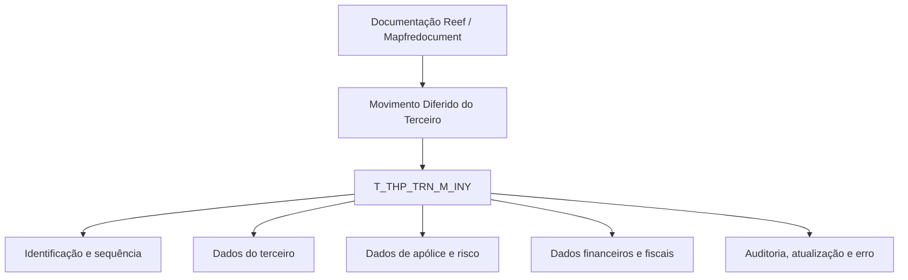

# Detalhamento das Informações do Terceiro no Movimento Diferido — Visão Técnica

## 1. Metadados do Documento
- **Arquivo de Origem:** Não identificado no conteúdo fornecido
- **Tipo de Documento:** Especificação Técnica
- **Domínio / Sistema:** Reef / Mapfre — Movimento Diferido do Terceiro
- **Público-Alvo:** Desenvolvedores, Arquitetos, Analistas Funcionais e Operação
- **Data/Versão Identificada:** Não identificada
- **Owner identificado:** `user:agonzalez_mapfre.com`
- **Lifecycle identificado:** Approved

---

## 2. Resumo Executivo & Contexto de Negócio

O documento apresenta a visão técnica para detalhar informações do terceiro no contexto de um movimento diferido. O conteúdo concentra-se no modelo de dados envolvido na operação e identifica a tabela `T_THP_TRN_M_INY` como a estrutura participante.

A tabela `T_THP_TRN_M_INY` é descrita como uma tabela de buzón de terceiro segurado. A documentação enumera campos relacionados à identificação, situação de processamento, companhia, documento, atividade, compensação, qualidade, dados cadastrais, dados de apólice, dados financeiros, indicadores de relacionamento e informações de atualização do registro.

A especificação fornece, para cada coluna, indicadores extraídos nas colunas “CAMBIA VALOR”, “MOTIVO/VALOR” e “OBLIGATORIA”, além de um comentário funcional. Os valores apresentados para “CAMBIA VALOR” são `S`; os valores apresentados para “MOTIVO/VALOR” são `N.A.`; e a obrigatoriedade é marcada como `SI` ou `NO`.

O documento não descreve métodos HTTP, APIs, contratos JSON, regras de transformação, fluxo de integração, mecanismos de persistência, periodicidade do movimento diferido ou comportamento de processamento em caso de erro. A fonte é uma documentação Reef, associada a Mapfredocument.

---

## 3. Arquitetura, Componentes & Tecnologias Envolvidas

### Componentes e entidades identificados

| Componente / Entidade | Tipo | Descrição sustentada pelo documento |
| :--- | :--- | :--- |
| Reef | Plataforma de documentação | Contexto onde a documentação é apresentada. |
| Mapfredocument | Repositório / identificação documental | Nome exibido no conteúdo da documentação. |
| Movimento Diferido do Terceiro | Operação de negócio / técnica | Operação para a qual são detalhadas informações do terceiro. |
| `T_THP_TRN_M_INY` | Tabela de dados | Tabela que intervém na operação; descrita como “TABLA BUZON TERCERO ASEGURADO”. |
| Terceiro segurado | Entidade de negócio | Entidade representada por diversos campos da tabela, como código, documento, atividade e qualidade. |
| Owner `user:agonzalez_mapfre.com` | Responsável documental | Proprietário identificado no conteúdo. |
| Lifecycle `Approved` | Estado documental | Estado de ciclo de vida apresentado na página 1. |



**Nota de Análise:** o diagrama representa exclusivamente a relação explícita entre a documentação, a operação e a tabela envolvida. O documento não detalha microsserviços, aplicações consumidoras, bancos de dados, protocolos, APIs, ambientes, servidores ou fluxos de integração.

---

## 4. Regras de Negócio, Especificações Funcionais & Processos

### Estrutura de obrigatoriedade

A documentação identifica os seguintes campos como obrigatórios (`SI`):

- `IDN_VAL`: identificador.
- `IDN_SQN`: sequência dentro do identificador.
- `CMP_VAL`: companhia.
- `THP_DCM_TYP_VAL`: tipo de documento do terceiro.
- `THP_DCM_VAL`: código de documento do terceiro.
- `THP_ACV_VAL`: atividade do terceiro.
- `USR_VAL`: usuário que atualizou a fila.
- `MDF_DAT`: data de atualização da fila.
- `TXL_OTH_CNY`: obrigação fiscal em outros países.
- `PRE_GRE_LMT`: primas maiores a um limite.

### Regras e informações funcionais extraídas

1. A operação de movimento diferido do terceiro utiliza a tabela `T_THP_TRN_M_INY`.
2. A tabela é denominada “TABLA BUZON TERCERO ASEGURADO”.
3. Cada campo listado possui valor `S` na coluna extraída como “CAMBIA VALOR”.
4. Cada campo listado possui valor `N.A.` na coluna extraída como “MOTIVO/VALOR”.
5. O campo `IDN_VAL` identifica o registro.
6. O campo `IDN_SQN` representa a sequência dentro do identificador.
7. O campo `PRC_THD_VAL` representa o hilo.
8. O campo `PRC_STS_VAL` representa a situação do processo.
9. O campo `MTC_VAL` representa a forma de compensação, definida como a forma pela qual o terceiro cobra ou paga.
10. O campo `ACN_ORG_VAL` registra a primeira ação produzida sobre o registro, com os valores indicados `(I)NSERTAR` e `(M)ODIFICAR`.
11. O campo `USR_VAL` registra o usuário que atualizou a fila.
12. O campo `MDF_DAT` registra a data de atualização da fila.
13. O campo `ERR_IDN_VAL` contém o código de erro.
14. O campo `RFR_THR_LVL_VAL` identifica, por meio de um código de nível 3, a oficina à qual o segurado está associado.
15. O campo `RGS_DAT` registra a data de alta do segurado.
16. Os campos `RBN_VAL`, `VIP_VAL` e `LYL_VAL` representam, respectivamente, marca Robinson, marca VIP e marca de plano de fidelização.
17. O campo `LYL_PON_VAL` registra pontos do plano de fidelização.
18. Os campos `FNP_MAN_ACV_VAL` e `FNP_OTH_ACV_VAL` representam, respectivamente, perfil financeiro da atividade principal e perfil financeiro de outras atividades.
19. O campo `ANC_OPR` representa aviso de operações.

**Nota de Análise:** a documentação não especifica domínios permitidos, formatos físicos, tamanhos, tipos SQL, regras de preenchimento condicional, valores padrão, chaves, índices ou relações entre as colunas listadas.

---

## 5. Tabelas de Parâmetros, Ambientes e Estruturas de Dados

| Item / Parâmetro | Descrição / Função | Tipo / Valores / Formato | Ambiente / Observações |
| :--- | :--- | :--- | :--- |
| `T_THP_TRN_M_INY` | Tabela envolvida na operação; “TABLA BUZON TERCERO ASEGURADO” | Tabela | Movimento Diferido do Terceiro |
| `IDN_VAL` | Identificador | Cambia valor: `S`; Motivo/Valor: `N.A.`; Obrigatória: `SI` | Identificador do registro |
| `IDN_SQN` | Sequência dentro do identificador | Cambia valor: `S`; Motivo/Valor: `N.A.`; Obrigatória: `SI` | Sequência associada a `IDN_VAL` |
| `PRC_THD_VAL` | Hilo | Cambia valor: `S`; Motivo/Valor: `N.A.`; Obrigatória: `NO` | Sem detalhamento adicional |
| `PRC_STS_VAL` | Situação do processo | Cambia valor: `S`; Motivo/Valor: `N.A.`; Obrigatória: `NO` | Sem detalhamento adicional |
| `CMP_VAL` | Companhia | Cambia valor: `S`; Motivo/Valor: `N.A.`; Obrigatória: `SI` | Sem detalhamento adicional |
| `THP_DCM_TYP_VAL` | Tipo de documento do terceiro | Cambia valor: `S`; Motivo/Valor: `N.A.`; Obrigatória: `SI` | Sem detalhamento adicional |
| `THP_DCM_VAL` | Código de documento do terceiro | Cambia valor: `S`; Motivo/Valor: `N.A.`; Obrigatória: `SI` | Sem detalhamento adicional |
| `THP_ACV_VAL` | Atividade do terceiro | Cambia valor: `S`; Motivo/Valor: `N.A.`; Obrigatória: `SI` | Sem detalhamento adicional |
| `THP_VAL` | Código de terceiro | Cambia valor: `S`; Motivo/Valor: `N.A.`; Obrigatória: `NO` | Sem detalhamento adicional |
| `THP_GRG_VAL` | Agrupamento do terceiro | Cambia valor: `S`; Motivo/Valor: `N.A.`; Obrigatória: `NO` | Sem detalhamento adicional |
| `MTC_VAL` | Forma de compensação; forma pela qual o terceiro cobra ou paga | Cambia valor: `S`; Motivo/Valor: `N.A.`; Obrigatória: `NO` | Sem detalhamento adicional |
| `THP_QLT_VAL` | Qualidade do terceiro | Cambia valor: `S`; Motivo/Valor: `N.A.`; Obrigatória: `NO` | O texto original contém “TERERO” |
| `INY_OBS_VAL` | Observações | Cambia valor: `S`; Motivo/Valor: `N.A.`; Obrigatória: `NO` | O texto original contém “OBERVACIONES” |
| `AFL_VAL` | Afiliação | Cambia valor: `S`; Motivo/Valor: `N.A.`; Obrigatória: `NO` | Sem detalhamento adicional |
| `BNF_CSS_VAL` | Classe de beneficiário | Cambia valor: `S`; Motivo/Valor: `N.A.`; Obrigatória: `NO` | Sem detalhamento adicional |
| `THP_DSC_VAL` | Causa de inabilitação | Cambia valor: `S`; Motivo/Valor: `N.A.`; Obrigatória: `NO` | Sem detalhamento adicional |
| `DSB_ROW` | Inabilitado | Cambia valor: `S`; Motivo/Valor: `N.A.`; Obrigatória: `NO` | Texto original: “INHABILITADOA” |
| `CPE_NAM` | Nome completo do terceiro | Cambia valor: `S`; Motivo/Valor: `N.A.`; Obrigatória: `NO` | Sem detalhamento adicional |
| `PLY_VAL` | Apólice | Cambia valor: `S`; Motivo/Valor: `N.A.`; Obrigatória: `NO` | Sem detalhamento adicional |
| `ENR_SQN` | Número de suplemento | Cambia valor: `S`; Motivo/Valor: `N.A.`; Obrigatória: `NO` | Sem detalhamento adicional |
| `RSK_VAL` | Número de risco | Cambia valor: `S`; Motivo/Valor: `N.A.`; Obrigatória: `NO` | Sem detalhamento adicional |
| `MDF_SCO_VAL` | Modificação | Cambia valor: `S`; Motivo/Valor: `N.A.`; Obrigatória: `NO` | Sem detalhamento adicional |
| `VLD_DAT` | Data de validade | Cambia valor: `S`; Motivo/Valor: `N.A.`; Obrigatória: `NO` | Sem detalhamento adicional |
| `ACN_ORG_VAL` | Primeira ação produzida sobre o registro | Cambia valor: `S`; Motivo/Valor: `N.A.`; Obrigatória: `NO`; valores citados: `(I)NSERTAR`, `(M)ODIFICAR` | Sem regras adicionais |
| `USR_VAL` | Usuário que atualizou a fila | Cambia valor: `S`; Motivo/Valor: `N.A.`; Obrigatória: `SI` | Auditoria de atualização |
| `MDF_DAT` | Data de atualização da fila | Cambia valor: `S`; Motivo/Valor: `N.A.`; Obrigatória: `SI` | Auditoria de atualização |
| `ERR_IDN_VAL` | Código de erro | Cambia valor: `S`; Motivo/Valor: `N.A.`; Obrigatória: `NO` | Sem catálogo de erros |
| `RFR_THR_LVL_VAL` | Código nível 3 que identifica a oficina associada ao segurado | Cambia valor: `S`; Motivo/Valor: `N.A.`; Obrigatória: `NO` | Sem detalhamento adicional |
| `RGS_DAT` | Data de alta do segurado | Cambia valor: `S`; Motivo/Valor: `N.A.`; Obrigatória: `NO` | Sem formato de data informado |
| `RTG_TYP_VAL` | Grupo socioeconômico ao qual o segurado pertence | Cambia valor: `S`; Motivo/Valor: `N.A.`; Obrigatória: `NO` | Sem domínio de valores informado |
| `RBN_VAL` | Marca Robinson | Cambia valor: `S`; Motivo/Valor: `N.A.`; Obrigatória: `NO` | Sem domínio de valores informado |
| `VIP_VAL` | Marca VIP | Cambia valor: `S`; Motivo/Valor: `N.A.`; Obrigatória: `NO` | Sem domínio de valores informado |
| `LYL_VAL` | Marca plano de fidelização | Cambia valor: `S`; Motivo/Valor: `N.A.`; Obrigatória: `NO` | Sem domínio de valores informado |
| `LYL_PON_VAL` | Pontos do plano de fidelização | Cambia valor: `S`; Motivo/Valor: `N.A.`; Obrigatória: `NO` | Sem formato ou faixa informada |
| `EMP_QNT` | Número de empregados | Cambia valor: `S`; Motivo/Valor: `N.A.`; Obrigatória: `NO` | Sem formato ou faixa informada |
| `IVG_QNT` | Faturamento | Cambia valor: `S`; Motivo/Valor: `N.A.`; Obrigatória: `NO` | Sem moeda, formato ou faixa informados |
| `CIY_TYP_VAL` | Código tipo sociedade | Cambia valor: `S`; Motivo/Valor: `N.A.`; Obrigatória: `NO` | Sem domínio de valores informado |
| `BSG_TYP_VAL` | Sem descrição apresentada | Cambia valor: `S`; Motivo/Valor: `N.A.`; Obrigatória: `NO` | O documento não fornece comentário |
| `PYM_DAY_VAL` | Dia sugerido de pagamento | Cambia valor: `S`; Motivo/Valor: `N.A.`; Obrigatória: `NO` | Sem formato ou regra adicional |
| `TXL_OTH_CNY` | Obrigação fiscal em outros países | Cambia valor: `S`; Motivo/Valor: `N.A.`; Obrigatória: `SI` | Sem domínio de valores informado |
| `FNP_MAN_ACV_VAL` | Perfil financeiro da atividade principal | Cambia valor: `S`; Motivo/Valor: `N.A.`; Obrigatória: `NO` | Sem detalhamento adicional |
| `FNP_OTH_ACV_VAL` | Perfil financeiro de outras atividades | Cambia valor: `S`; Motivo/Valor: `N.A.`; Obrigatória: `NO` | Sem detalhamento adicional |
| `PRE_GRE_LMT` | Primas maiores a um limite | Cambia valor: `S`; Motivo/Valor: `N.A.`; Obrigatória: `SI` | Limite não especificado |
| `ANC_OPR` | Aviso de operações | Cambia valor: `S`; Motivo/Valor: `N.A.`; Obrigatória: `NO` | Sem detalhamento adicional |

---

## 6. Bateria de Perguntas & Respostas para RAG (FAQ Sintético)

### P1: Qual tabela participa da operação de Movimento Diferido do Terceiro?
**R:** A tabela identificada como participante da operação é `T_THP_TRN_M_INY`, descrita no documento como “TABLA BUZON TERCERO ASEGURADO”.

### P2: Quais campos são obrigatórios na tabela `T_THP_TRN_M_INY`?
**R:** Os campos marcados como obrigatórios (`SI`) são `IDN_VAL`, `IDN_SQN`, `CMP_VAL`, `THP_DCM_TYP_VAL`, `THP_DCM_VAL`, `THP_ACV_VAL`, `USR_VAL`, `MDF_DAT`, `TXL_OTH_CNY` e `PRE_GRE_LMT`.

### P3: Qual campo representa a primeira ação realizada sobre o registro?
**R:** O campo `ACN_ORG_VAL` representa a primeira ação produzida sobre o registro. O documento cita os valores `(I)NSERTAR` e `(M)ODIFICAR`.

### P4: Como é identificada a companhia na estrutura de dados?
**R:** A companhia é representada pelo campo `CMP_VAL`, marcado como obrigatório (`SI`) na documentação.

### P5: Quais campos armazenam dados do documento do terceiro?
**R:** O tipo de documento do terceiro é armazenado em `THP_DCM_TYP_VAL`, enquanto o código de documento do terceiro é armazenado em `THP_DCM_VAL`. Ambos são obrigatórios.

### P6: Onde são registradas as informações de auditoria de atualização?
**R:** O usuário que atualizou a fila é registrado em `USR_VAL`, e a data de atualização da fila é registrada em `MDF_DAT`. Ambos os campos são obrigatórios.

### P7: Qual campo registra o código de erro?
**R:** O campo `ERR_IDN_VAL` registra o código de erro. O documento o classifica como não obrigatório (`NO`) e não fornece catálogo ou semântica adicional para os códigos.

### P8: Como o documento representa a relação do segurado com uma oficina?
**R:** O campo `RFR_THR_LVL_VAL` é descrito como um código de nível 3 que identifica a oficina à qual o segurado está associado.

### P9: Quais campos estão relacionados ao plano de fidelização?
**R:** `LYL_VAL` representa a marca de plano de fidelização, enquanto `LYL_PON_VAL` representa os pontos do plano de fidelização. Ambos são marcados como não obrigatórios.

### P10: Como a obrigação fiscal em outros países é representada?
**R:** A obrigação fiscal em outros países é registrada no campo `TXL_OTH_CNY`, marcado como obrigatório (`SI`).

### P11: O documento define o limite usado pelo campo `PRE_GRE_LMT`?
**R:** Não. O documento descreve `PRE_GRE_LMT` como “PRIMAS MAYORES A UN LÍMITE” e o marca como obrigatório, mas não especifica o valor, a unidade, a moeda ou a regra de cálculo desse limite.

### P12: O documento especifica APIs ou contratos de integração para a tabela `T_THP_TRN_M_INY`?
**R:** Não. O conteúdo fornecido lista a tabela e seus campos, mas não detalha APIs, métodos HTTP, contratos JSON, microsserviços, protocolos ou fluxos de integração.

---

## 7. Glossário de Termos, Siglas & Conceitos-Chave

- **Reef:** contexto de documentação identificado no conteúdo.
- **Mapfredocument:** nome exibido como identificação documental.
- **Movimento Diferido do Terceiro:** operação para a qual a tabela `T_THP_TRN_M_INY` é indicada como participante.
- **T_THP_TRN_M_INY:** tabela descrita como “TABLA BUZON TERCERO ASEGURADO”.
- **Terceiro:** entidade de negócio cujas informações são registradas na tabela.
- **Segurado:** entidade associada a campos como data de alta, grupo socioeconômico e oficina.
- **Buzón:** termo apresentado na descrição da tabela; o documento não fornece definição adicional.
- **Hilo:** descrição associada ao campo `PRC_THD_VAL`; o documento não fornece definição adicional.
- **Compensação:** forma pela qual o terceiro cobra ou paga, conforme descrição do campo `MTC_VAL`.
- **Oficina:** unidade associada ao segurado por meio do código de nível 3 em `RFR_THR_LVL_VAL`.
- **Marca Robinson:** informação representada pelo campo `RBN_VAL`; não há detalhamento adicional.
- **VIP:** marca representada pelo campo `VIP_VAL`; não há detalhamento adicional.
- **Plano de fidelização:** conceito representado pelos campos `LYL_VAL` e `LYL_PON_VAL`.
- **SI / NO:** indicadores de obrigatoriedade apresentados pelo documento.
- **N.A.:** valor exibido na coluna “MOTIVO/VALOR”; não definido pela fonte.
- **Approved:** lifecycle documental exibido no conteúdo.

---

## 8. Notas Críticas, Riscos & Limitações

- O arquivo de origem, data, versão e autor formal do documento não foram identificados; apenas o owner `user:agonzalez_mapfre.com` é exibido.
- O documento não fornece tipos de dados, tamanhos, formatos, valores permitidos, chaves, índices, regras de integridade ou relacionamentos da tabela `T_THP_TRN_M_INY`.
- Não há especificação de ambiente, URL, servidor, banco de dados, porta, rota de log ou configuração operacional.
- Não são descritos contratos de integração, APIs, métodos HTTP, eventos, filas ou microsserviços.
- O significado operacional de `S` em “CAMBIA VALOR” e de `N.A.` em “MOTIVO/VALOR” não é definido pelo conteúdo.
- O campo `BSG_TYP_VAL` não possui descrição funcional no documento.
- Há aparentes inconsistências ou erros de OCR/transcrição no conteúdo bruto, incluindo “COCUMENTO”, “TERERO”, “OBERVACIONES”, “PRMERA” e “INHABILITADOA”.
- **Nota de Análise:** o documento lista muitos campos de negócio, mas não detalha validações, dependências condicionais ou comportamento de processamento para tais campos.

---

## 9. Conteúdo Bruto Estruturado (Referência Fiel)

```text
--- [PÁGINA 1 DE 3] ---

DETALLAR Información del Tercero en el Movimiento Diferido del
Tercero (Visión Técnica)
Modelo de datos involucrado
La tabla que interviene en esta operación es:
TABLA DESCRIPCIÓN
T_THP_TRN_M_INY TABLA BUZON TERCERO ASEGURADO
COLUMNA CAMBIA
VALOR
MOTIVO/VALOR OBLIGATORIA COMENTARIO
IDN_VAL S N.A. SI IDENTIFICADOR
IDN_SQN S N.A. SI SECUENCIA DENTRO DEL IDENTIFICADOR
PRC_THD_VAL S N.A. NO HILO
PRC_STS_VAL S N.A. NO SITUACION DEL PROCESO
CMP_VAL S N.A. SI COMPAÏ¿½IA
THP_DCM_TYP_VAL S N.A. SI TIPO DE COCUMENTO DEL TERCERO
THP_DCM_VAL S N.A. SI CODIGO DE DOCUMENTO DEL TERCERO
THP_ACV_VAL S N.A. SI ACTIVIDAD DEL TERCERO
THP_VAL S N.A. NO CODIGO DE TERCERO
THP_GRG_VAL S N.A. NO AGRUPAMIENTO DEL TERCERO
MTC_VAL S N.A. NO FORMA DE COMPENSACION (FORMA EN LA QUE
EL TERCERO COBRA O PAGA)
Documentation / DOCUMENTACIÓN Reef
DOCUMENTACIÓN Reef
Mapfredocument
DOCUMENTACIÓN Reef
Owner
user:agonzalez_mapfre.com
Lifecycle
Approved Source
 /
 VL
Buscar Inicio Soluciones Arquitecturas APIs Componentes Cloud Documentación Zeus Reef Ayuda
ES


--- [PÁGINA 2 DE 3] ---

COLUMNA CAMBIA
VALOR
MOTIVO/VALOR OBLIGATORIA COMENTARIO
THP_QLT_VAL S N.A. NO CALIDAD DEL TERERO
INY_OBS_VAL S N.A. NO OBERVACIONES
AFL_VAL S N.A. NO AFILIACION
BNF_CSS_VAL S N.A. NO CLASE DE BENEFICIARIO
THP_DSC_VAL S N.A. NO CAUSA DE INHABILITACION
DSB_ROW S N.A. NO INHABILITADOA
CPE_NAM S N.A. NO NOMBRE COMPLETO DEL TERCERO
PLY_VAL S N.A. NO POLIZA
ENR_SQN S N.A. NO NUMERO DE SUPLEMENTO
RSK_VAL S N.A. NO NUMERO DE RIESGO
MDF_SCO_VAL S N.A. NO MODIFICACION
VLD_DAT S N.A. NO FECHA DE VALIDEZ
ACN_ORG_VAL S N.A. NO PRMERA ACCION QUE SE PRODUCE SOBRE EL
REGISTRO ( (I)NSERTAR, (M)ODIFICAR )
USR_VAL S N.A. SI USUARIO QUE ACTUALIZO LA FILA
MDF_DAT S N.A. SI FECHA DE ACTUALIZACION DE LA FILA
ERR_IDN_VAL S N.A. NO CODIGO DE ERROR
RFR_THR_LVL_VAL S N.A. NO CÓDIGO NIVEL3 IDENTIFICA OFICINA A LA QUE
ESTA ASOCIADA AL ASEGURADO
RGS_DAT S N.A. NO FECHA ALTA DEL ASEGURADO
RTG_TYP_VAL S N.A. NO GRUPO SOCIO ECONÓMICO AL QUE PERTENECE
EL ASEGURADO
RBN_VAL S N.A. NO MARCA ROBINSON
VIP_VAL S N.A. NO MARCA VIP
LYL_VAL S N.A. NO MARCA PLAN FIDELIZACION
LYL_PON_VAL S N.A. NO PUNTOS PLAN FIDELIZACION
EMP_QNT S N.A. NO NUMERO DE EMPLEADOS


--- [PÁGINA 3 DE 3] ---

COLUMNA CAMBIA
VALOR
MOTIVO/VALOR OBLIGATORIA COMENTARIO
IVG_QNT S N.A. NO FACTURACION
CIY_TYP_VAL S N.A. NO CODIGO TIPO SOCIEDAD
BSG_TYP_VAL S N.A. NO
PYM_DAY_VAL S N.A. NO DIA SUGERIDO DE PAGO
TXL_OTH_CNY S N.A. SI OBLIGACIÓN FISCAL EN OTROS PAÍSES
FNP_MAN_ACV_VAL S N.A. NO PERFIL FINANCIERO ACTIVIDAD PRINCIPAL
FNP_OTH_ACV_VAL S N.A. NO PERFIL FINANCIERO OTRAS ACTIVIDADES
PRE_GRE_LMT S N.A. SI PRIMAS MAYORES A UN LÍMITE
ANC_OPR S N.A. NO AVISO DE OPERACIONES
```
