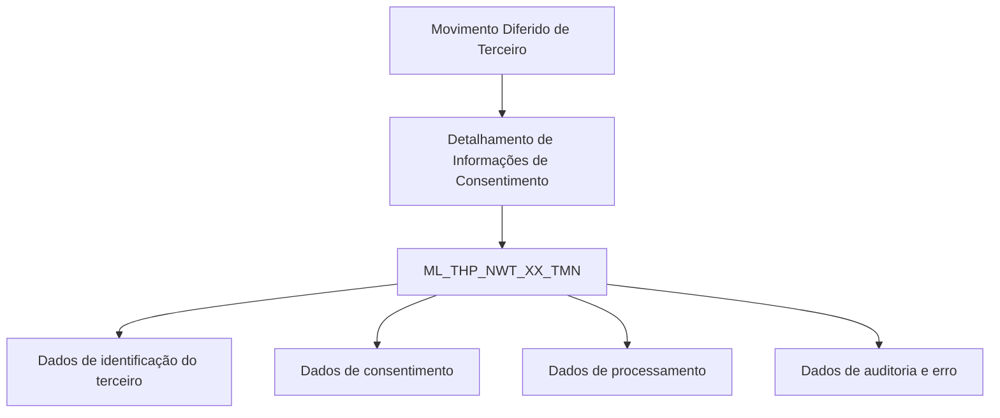

# Detalhamento Técnico de Consentimentos no Movimento Diferido de Terceiros — Modelo de Dados REEF

## 1. Metadados do Documento
- **Arquivo de Origem:** Não identificado no conteúdo fornecido
- **Tipo de Documento:** Especificação Técnica
- **Domínio / Sistema:** REEF / Mapfre — Consentimentos de cliente no movimento diferido de terceiros
- **Público-Alvo:** Desenvolvedores, Arquitetos, Operação e Analistas Funcionais
- **Data/Versão Identificada:** Não identificada
- **Status documental identificado:** Approved Source
- **Owner identificado:** `user:agonzalez_mapfre.com`

---

## 2. Resumo Executivo & Contexto de Negócio

O documento descreve a visão técnica para detalhar informações de consentimentos no movimento diferido de terceiros. O escopo apresentado concentra-se exclusivamente no modelo de dados utilizado na operação de consentimento de cliente.

A operação utiliza a tabela `ML_THP_NWT_XX_TMN`, descrita como “TABLA BUZÓN CONSENTIMIENTO DE CLIENTE”. A tabela reúne identificadores, dados do terceiro, código e tipo de consentimento, vigências, forma de concessão, informações de processamento e auditoria de atualização.

Os campos documentados indicam que o registro de consentimento possui identificação composta por identificador, sequência e companhia, além de atributos relacionados ao documento e à atividade do terceiro. O modelo também registra início e fim da validade do consentimento, estado do processo, origem da ação e eventual erro interno.

Não há descrição de APIs, métodos HTTP, contratos JSON, jobs, integrações, serviços, regras de cálculo ou comportamento de processamento além da estrutura de colunas. **Nota de Análise:** o documento identifica a tabela de consentimentos, porém não detalha como os dados são inseridos, consultados, processados ou integrados por outros componentes.

---

## 3. Arquitetura, Componentes & Tecnologias Envolvidas

### Componentes identificados

| Componente | Tipo | Descrição fundamentada no documento |
| :--- | :--- | :--- |
| REEF | Sistema / domínio documental | Sistema ou domínio associado à documentação apresentada. |
| Mapfre | Contexto corporativo | Nome presente na identificação documental `Mapfredocument`. |
| Movimento Diferido de Terceiro | Processo funcional | Processo no qual são detalhadas informações de consentimento. |
| `ML_THP_NWT_XX_TMN` | Tabela de dados | Tabela de buzon/buzón de consentimento de cliente usada na operação. |
| Documentação Reef | Repositório documental | Área documental indicada no conteúdo bruto. |



**Nota de Análise:** o diagrama representa somente a relação lógica explicitamente inferível entre o processo descrito e a tabela indicada. O conteúdo não identifica aplicações, microsserviços, bancos de dados, protocolos, tecnologias de persistência ou fluxos de integração.

---

## 4. Regras de Negócio, Especificações Funcionais & Processos

### Processo identificado

1. O documento aborda o detalhamento de informações de consentimentos no movimento diferido de terceiros.
2. A tabela envolvida na operação é `ML_THP_NWT_XX_TMN`.
3. A tabela é descrita como uma tabela de buzon/buzón de consentimento de cliente.
4. As colunas documentadas possuem o indicador `S` na coluna “CAMBIA VALOR”.
5. Os campos classificados como obrigatórios (`SI`) abrangem identificação, dados do terceiro, dados do consentimento, vigência, forma de concessão e auditoria.
6. Os campos `PRC_THD_VAL`, `PRC_STS_VAL`, `ACN_ORG_VAL` e `ERR_IDN_VAL` estão marcados como não obrigatórios (`NO`).
7. O campo `DSB_ROW` é descrito como “FILA DESHABILITADA”, indicando que registra a condição de desabilitação da linha.
8. O campo `ERR_IDN_VAL` é descrito como identificador interno do erro.

### Restrições e limitações de especificação

- O documento não informa tipos físicos de dados, tamanhos, precisão, chaves primárias, chaves estrangeiras, índices ou constraints da tabela `ML_THP_NWT_XX_TMN`.
- O documento não define os valores permitidos para tipos de documento, tipo de consentimento, forma de concessão, situação do processo ou ação de origem.
- O documento não informa a semântica operacional do indicador `S` em “CAMBIA VALOR”.
- O documento não descreve regras temporais para `VLD_DAT`, `COE_INL_DAT` e `COE_FNL_DAT`.
- O documento não detalha o significado funcional de “HILO” para `PRC_THD_VAL`.

---

## 5. Tabelas de Parâmetros, Ambientes e Estruturas de Dados

### Tabela principal

| Item / Parâmetro | Descrição / Função | Tipo / Valores / Formato | Ambiente / Observações |
| :--- | :--- | :--- | :--- |
| `ML_THP_NWT_XX_TMN` | Tabela de buzon/buzón de consentimento de cliente. | Tabela de dados. | Utilizada na operação de detalhamento de consentimentos no movimento diferido de terceiros. |

### Estrutura de colunas da tabela `ML_THP_NWT_XX_TMN`

| Item / Parâmetro | Descrição / Função | Tipo / Valores / Formato | Ambiente / Observações |
| :--- | :--- | :--- | :--- |
| `BTC_IDN_VAL` | Identificador. | Muda valor: `S`; obrigatório: `SI`. | O tipo físico não foi informado. |
| `SQN_VAL` | Sequência. | Muda valor: `S`; obrigatório: `SI`. | O tipo físico não foi informado. |
| `CMP_VAL` | Companhia. | Muda valor: `S`; obrigatório: `SI`. | O tipo físico não foi informado. |
| `THP_DCM_TYP_VAL` | Tipo do documento do terceiro. | Muda valor: `S`; obrigatório: `SI`. | O tipo físico não foi informado. |
| `THP_DCM_VAL` | Documento do terceiro. | Muda valor: `S`; obrigatório: `SI`. | O tipo físico não foi informado. |
| `THP_ACV_VAL` | Atividade do terceiro. | Muda valor: `S`; obrigatório: `SI`. | O tipo físico não foi informado. |
| `COE_VAL` | Código de consentimento. | Muda valor: `S`; obrigatório: `SI`. | O tipo físico não foi informado. |
| `VAL_COE_TYP_VAL` | Tipo de consentimento. | Muda valor: `S`; obrigatório: `SI`. | O tipo físico não foi informado. |
| `VLD_DAT` | Data de validade. | Muda valor: `S`; obrigatório: `SI`. | Não há formato de data documentado. |
| `PRC_THD_VAL` | Hilo. | Muda valor: `S`; obrigatório: `NO`. | O significado técnico ou funcional de “Hilo” não foi detalhado. |
| `PRC_STS_VAL` | Situação do processo. | Muda valor: `S`; obrigatório: `NO`. | Não há enumeração de estados documentada. |
| `FRM_TYP_VAL` | Tipo de forma concedida. | Muda valor: `S`; obrigatório: `SI`. | O documento não lista formas permitidas. |
| `COE_INL_DAT` | Data de início do consentimento. | Muda valor: `S`; obrigatório: `SI`. | Não há formato de data documentado. |
| `COE_FNL_DAT` | Data de fim do consentimento. | Muda valor: `S`; obrigatório: `SI`. | Não há regra de comparação com a data inicial documentada. |
| `DSB_ROW` | Linha desabilitada. | Muda valor: `S`; obrigatório: `SI`. | Não foram documentados valores possíveis. |
| `USR_VAL` | Usuário que atualizou a linha. | Muda valor: `S`; obrigatório: `SI`. | Campo de auditoria. |
| `MDF_VAL` | Data de modificação. | Muda valor: `S`; obrigatório: `SI`. | Campo de auditoria; formato não informado. |
| `ACN_ORG_VAL` | Ação de origem. | Muda valor: `S`; obrigatório: `NO`. | Valores permitidos não documentados. |
| `ERR_IDN_VAL` | Identificador interno do erro. | Muda valor: `S`; obrigatório: `NO`. | Não há catálogo de erros informado. |

### Ambientes, URLs, logs e servidores

| Item / Parâmetro | Descrição / Função | Tipo / Valores / Formato | Ambiente / Observações |
| :--- | :--- | :--- | :--- |
| Ambientes | Não identificados. | Não aplicável. | O documento não apresenta URLs, servidores ou ambientes. |
| Logs | Não identificados. | Não aplicável. | O documento não informa rotas, arquivos ou níveis de log. |
| APIs | Não identificadas. | Não aplicável. | Não há endpoints, métodos HTTP ou contratos de integração. |

---

## 6. Bateria de Perguntas & Respostas para RAG (FAQ Sintético)

### P1: Qual tabela armazena os dados de consentimento de cliente no movimento diferido de terceiros?
**R:** A tabela envolvida na operação é `ML_THP_NWT_XX_TMN`, descrita no documento como “TABLA BUZÓN CONSENTIMIENTO DE CLIENTE”.

### P2: Quais campos identificam o registro de consentimento na tabela `ML_THP_NWT_XX_TMN`?
**R:** O documento identifica como campos obrigatórios de identificação `BTC_IDN_VAL` (identificador), `SQN_VAL` (sequência) e `CMP_VAL` (companhia). O conteúdo não especifica se esses campos compõem formalmente uma chave primária.

### P3: Como o documento representa os dados documentais do terceiro?
**R:** Os dados documentais do terceiro são representados por `THP_DCM_TYP_VAL`, descrito como tipo do documento do terceiro, e `THP_DCM_VAL`, descrito como documento do terceiro. Ambos são obrigatórios.

### P4: Qual coluna registra o código de consentimento?
**R:** A coluna `COE_VAL` registra o código de consentimento. A coluna `VAL_COE_TYP_VAL` registra o tipo de consentimento. Ambas estão marcadas como obrigatórias.

### P5: Quais campos registram a vigência do consentimento?
**R:** A vigência do consentimento é documentada por `COE_INL_DAT`, data de início do consentimento, e `COE_FNL_DAT`, data de fim do consentimento. O documento também lista `VLD_DAT` como data de validade. Os três campos estão marcados como obrigatórios.

### P6: A situação do processo é obrigatória na tabela de consentimentos?
**R:** Não. O campo `PRC_STS_VAL`, descrito como situação do processo, está marcado como não obrigatório (`NO`) no documento.

### P7: Como a tabela registra que uma linha foi desabilitada?
**R:** A coluna `DSB_ROW` é descrita como “FILA DESHABILITADA” e está marcada como obrigatória. O conteúdo não detalha os valores que indicam uma linha habilitada ou desabilitada.

### P8: Quais dados de auditoria estão presentes na estrutura de consentimentos?
**R:** A estrutura inclui `USR_VAL`, descrito como usuário que atualizou a linha, e `MDF_VAL`, descrito como data de modificação. Ambos os campos são obrigatórios.

### P9: Onde é registrado o identificador interno de erro?
**R:** O identificador interno de erro é registrado na coluna `ERR_IDN_VAL`. O campo está marcado como não obrigatório (`NO`).

### P10: O documento define APIs ou contratos JSON para consultar consentimentos?
**R:** Não. O documento fornecido detalha somente a tabela `ML_THP_NWT_XX_TMN` e suas colunas. Não há métodos HTTP, endpoints, contratos JSON, payloads ou integrações documentadas.

### P11: O que significa o campo `PRC_THD_VAL`?
**R:** O documento descreve `PRC_THD_VAL` como “HILO” e o marca como não obrigatório. Não há detalhamento adicional sobre o significado funcional ou técnico desse campo.

### P12: A documentação informa os valores permitidos para o tipo de consentimento?
**R:** Não. O documento identifica `VAL_COE_TYP_VAL` como tipo de consentimento, mas não apresenta domínio de valores, catálogo, enumeração ou regra de validação para o campo.

---

## 7. Glossário de Termos, Siglas & Conceitos-Chave

- **REEF:** Nome do domínio ou sistema associado à documentação apresentada. O conteúdo não expande a sigla.
- **Mapfre:** Referência corporativa presente na documentação.
- **Movimento Diferido de Terceiro:** Processo funcional no qual são detalhadas informações de consentimentos.
- **Buzón de Consentimento de Cliente:** Descrição atribuída à tabela `ML_THP_NWT_XX_TMN`.
- **`BTC_IDN_VAL`:** Identificador.
- **`SQN_VAL`:** Sequência.
- **`CMP_VAL`:** Companhia.
- **`THP_DCM_TYP_VAL`:** Tipo do documento do terceiro.
- **`THP_DCM_VAL`:** Documento do terceiro.
- **`THP_ACV_VAL`:** Atividade do terceiro.
- **`COE_VAL`:** Código de consentimento.
- **`VAL_COE_TYP_VAL`:** Tipo de consentimento.
- **`VLD_DAT`:** Data de validade.
- **`PRC_THD_VAL`:** Hilo; sem detalhamento adicional.
- **`PRC_STS_VAL`:** Situação do processo.
- **`FRM_TYP_VAL`:** Tipo de forma concedida.
- **`COE_INL_DAT`:** Data de início do consentimento.
- **`COE_FNL_DAT`:** Data de fim do consentimento.
- **`DSB_ROW`:** Linha desabilitada.
- **`USR_VAL`:** Usuário que atualizou a linha.
- **`MDF_VAL`:** Data de modificação.
- **`ACN_ORG_VAL`:** Ação de origem.
- **`ERR_IDN_VAL`:** Identificador interno do erro.

---

## 8. Notas Críticas, Riscos & Limitações

- O documento não informa tipos de dados, tamanhos de colunas, chaves, índices ou relacionamentos da tabela `ML_THP_NWT_XX_TMN`.
- O significado do valor `S` na coluna “CAMBIA VALOR” não é explicado.
- Não foram identificados valores permitidos, catálogos ou regras de validação para os campos de tipo, estado, forma, origem ou desabilitação.
- Não há regras documentadas para assegurar coerência entre data de início, data de fim e data de validade do consentimento.
- Não há detalhamento de processamento, APIs, integrações, transações, tratamento de erros ou mecanismos de reprocessamento.
- **Nota de Análise:** a expressão “HILO” associada a `PRC_THD_VAL` é mantida conforme o documento original; não há contexto suficiente para traduzi-la ou atribuir-lhe uma interpretação técnica específica.
- **Nota de Análise:** a especificação é estrutural e não permite inferir, com segurança, o mecanismo de persistência, consulta, atualização ou exclusão de registros de consentimento.

---

## 9. Conteúdo Bruto Estruturado (Referência Fiel)

```text
--- [PÁGINA 1 DE 2] ---

DETALLAR Información de Consentimientos en el Movimiento Diferido
del Tercero (Visión Técnica)
Modelo de datos involucrado
La tabla que interviene en esta operación es:
TABLA DESCRIPCIÓN
ML_THP_NWT_XX_TMN TABLA BUZÓN CONSENTIMIENTO DE CLIENTE
COLUMNA CAMBIA VALOR MOTIVO/VALOR OBLIGATORIA COMENTARIO
BTC_IDN_VAL S N.A. SI IDENTIFICADOR
SQN_VAL S N.A. SI SECUENCIA
CMP_VAL S N.A. SI COMPAÑÍA
THP_DCM_TYP_VAL S N.A. SI TIPO DEL DOCUMENTO DEL TERCERO
THP_DCM_VAL S N.A. SI DOCUMENTO DEL TERCERO
THP_ACV_VAL S N.A. SI ACTIVIDAD TERCERO
COE_VAL S N.A. SI CÓDIGO CONSENTIMIENTO
VAL_COE_TYP_VAL S N.A. SI TIPO CONSENTIMIENTO
VLD_DAT S N.A. SI FECHA VALIDEZ
PRC_THD_VAL S N.A. NO HILO
PRC_STS_VAL S N.A. NO SITUACIÓN DEL PROCESO
FRM_TYP_VAL S N.A. SI TIPO FORMA OTORGADA
Documentation / DOCUMENTACIÓN Reef
DOCUMENTACIÓN Reef
Mapfredocument
DOCUMENTACIÓN Reef
Owner
user:agonzalez_mapfre.com
Lifecycle
Approved Source
 /
VL
Buscar Inicio Soluciones Arquitecturas APIs Componentes Cloud Documentación Zeus Reef Ayuda
ES

--- [PÁGINA 2 DE 2] ---

COLUMNA CAMBIA VALOR MOTIVO/VALOR OBLIGATORIA COMENTARIO
COE_INL_DAT S N.A. SI FECHA INICIO CONSENTIMIENTO
COE_FNL_DAT S N.A. SI FECHA FIN CONSENTIMIENTO
DSB_ROW S N.A. SI FILA DESHABILITADA
USR_VAL S N.A. SI USUARIO QUE ACTUALIZO LA FILA
MDF_VAL S N.A. SI FECHA MODIFICACIÓN
ACN_ORG_VAL S N.A. NO ACCIÓN ORIGEN
ERR_IDN_VAL S N.A. NO IDENTIFICADOR INTERNO DEL ERROR
```
