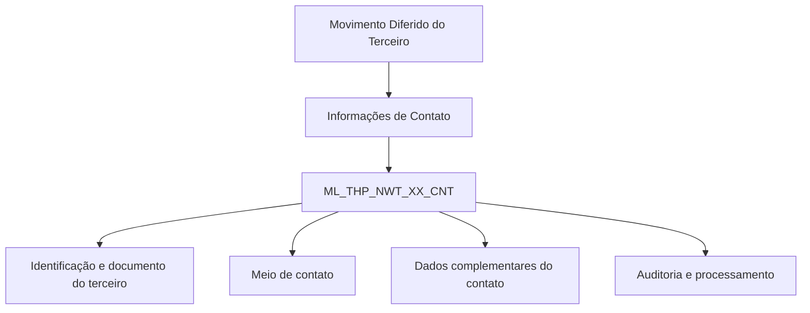

# Detalhamento de Informações de Contato no Movimento Diferido de Terceiros — Visão Técnica

## 1. Metadados do Documento
- **Arquivo de Origem:** `Não identificado no conteúdo fornecido`
- **Tipo de Documento:** `Especificação Técnica`
- **Domínio / Sistema:** `Reef / Movimento Diferido de Terceiros`
- **Público-Alvo:** `Desenvolvedores, Arquitetos e Analistas de Dados`
- **Data/Versão Identificada:** `Não identificada`

---

## 2. Resumo Executivo & Contexto de Negócio

O documento descreve, sob uma visão técnica, as informações de contato associadas ao movimento diferido de um terceiro. O conteúdo identifica uma única estrutura de dados envolvida na operação: a tabela `ML_THP_NWT_XX_CNT`, descrita como a tabela de “buzón contactos de terceros”.

A especificação apresenta o conjunto de colunas da tabela, indicando para cada campo se o valor pode ser alterado, se existe motivo ou valor associado, se o preenchimento é obrigatório e qual é o significado funcional do campo. Os dados cobrem identificação do terceiro, documento, atividade, meios de contato, validade, prioridade, usuário de atualização, processamento e informações complementares do contato.

A maior parte dos campos técnicos relacionados ao meio de contato é marcada como obrigatória, incluindo identificadores, sequência, empresa, tipo e valor do meio de contato, data de validade, indicador de contato padrão, prioridade, estado de desabilitação, comprovação e auditoria de modificação.

O documento não descreve métodos HTTP, contratos JSON, regras de persistência, integrações, ambientes, rotas de execução ou sequência operacional. Portanto, a documentação deve ser usada como referência estrutural da tabela e de suas obrigatoriedades declaradas, não como especificação completa de uma API ou processo de negócio.

---

## 3. Arquitetura, Componentes & Tecnologias Envolvidas

Os componentes explicitamente citados são:

| Componente / Elemento | Descrição sustentada pelo documento |
| :--- | :--- |
| `ML_THP_NWT_XX_CNT` | Tabela envolvida na operação de detalhamento de informações de contato no movimento diferido do terceiro. |
| Movimento Diferido do Terceiro | Contexto funcional indicado no título do documento. |
| Reef | Repositório ou contexto de documentação identificado nos trechos “Documentation / DOCUMENTACIÓN Reef”. |
| Mapfre | Nome presente na identificação de documentação e no domínio do usuário proprietário. |



> **Nota de Análise:** O diagrama representa somente a relação declarada entre o movimento diferido de terceiros, as informações de contato e a tabela `ML_THP_NWT_XX_CNT`. O documento não detalha serviços, APIs, bancos de dados adicionais, tecnologias, interfaces ou fluxos de integração.

---

## 4. Regras de Negócio, Especificações Funcionais & Processos

A especificação declara que a tabela `ML_THP_NWT_XX_CNT` participa da operação relacionada aos contatos de terceiros no movimento diferido.

### Regras de alteração

- Todas as colunas listadas possuem `CAMBIA VALOR = S`.
- O campo `MOTIVO/VALOR` é informado como `N.A.` para todas as colunas apresentadas.
- O documento não explica o significado literal de `S`, mas o contexto da coluna “CAMBIA VALOR” indica que todos os campos listados são passíveis de alteração.

### Campos obrigatórios declarados

Os seguintes campos são obrigatórios:

- `BTC_IDN_VAL`
- `SQN_VAL`
- `CMP_VAL`
- `THP_DCM_TYP_VAL`
- `THP_DCM_VAL`
- `THP_ACV_VAL`
- `CNH_SQN_VAL`
- `VLD_DAT`
- `CNH_TYP_VAL`
- `CNH_USE_TYP_VAL`
- `CNH_TXT_VAL`
- `DFL_CNH`
- `PTY_CNH`
- `DSB_ROW`
- `CNH_CCK`
- `USR_VAL`
- `MDF_DAT`
- `RFR_THP`

### Campos não obrigatórios declarados

Os seguintes campos são explicitamente marcados como não obrigatórios:

- `IDN_THP_VAL`
- `CNH_NAM`
- `PST_TYP_VAL`
- `EXT_CNT_DPR_VAL`
- `PRC_THD_VAL`
- `PRC_STS_VAL`
- `ACN_ORG_VAL`
- `ERR_IDN_VAL`
- `OBS_VAL`
- `CNT_PST_VAL`
- `CNT_DPR_VAL`
- `CNT_FRS_SCN_SRN`
- `CNT_DCM_TYP_VAL`
- `CNT_DCM_VAL`
- `CNT_CNY_VAL`

### Agrupamento funcional dos campos

| Grupo funcional | Campos |
| :--- | :--- |
| Identificação e contexto do terceiro | `BTC_IDN_VAL`, `SQN_VAL`, `CMP_VAL`, `THP_DCM_TYP_VAL`, `THP_DCM_VAL`, `THP_ACV_VAL`, `IDN_THP_VAL`, `RFR_THP` |
| Meio de contato | `CNH_SQN_VAL`, `CNH_TYP_VAL`, `CNH_USE_TYP_VAL`, `CNH_TXT_VAL`, `CNH_NAM`, `DFL_CNH`, `PTY_CNH`, `CNH_CCK` |
| Validade e estado | `VLD_DAT`, `DSB_ROW` |
| Dados organizacionais e pessoais do contato | `PST_TYP_VAL`, `EXT_CNT_DPR_VAL`, `CNT_PST_VAL`, `CNT_DPR_VAL`, `CNT_FRS_SCN_SRN`, `CNT_DCM_TYP_VAL`, `CNT_DCM_VAL`, `CNT_CNY_VAL` |
| Auditoria e processamento | `USR_VAL`, `MDF_DAT`, `PRC_THD_VAL`, `PRC_STS_VAL`, `ACN_ORG_VAL`, `ERR_IDN_VAL`, `OBS_VAL` |

> **Nota de Análise:** O documento não especifica regras de validação de formato, cardinalidade, domínio de valores, valores padrão, chaves primárias, chaves estrangeiras, índices ou relacionamentos da tabela `ML_THP_NWT_XX_CNT`.

---

## 5. Tabelas de Parâmetros, Ambientes e Estruturas de Dados

### Estrutura técnica identificada

| Item / Parâmetro | Descrição / Função | Tipo / Valores / Formato | Ambiente / Observações |
| :--- | :--- | :--- | :--- |
| `ML_THP_NWT_XX_CNT` | Tabela de buzón de contatos de terceiros. | Não informado. | Estrutura envolvida na operação. |

### Campos da tabela `ML_THP_NWT_XX_CNT`

| Item / Parâmetro | Descrição / Função | Tipo / Valores / Formato | Ambiente / Observações |
| :--- | :--- | :--- | :--- |
| `BTC_IDN_VAL` | Identificador. | Alterável: `S`; Motivo/Valor: `N.A.`; Obrigatória: `SI`. | — |
| `SQN_VAL` | Sequência. | Alterável: `S`; Motivo/Valor: `N.A.`; Obrigatória: `SI`. | — |
| `CMP_VAL` | Companhia. | Alterável: `S`; Motivo/Valor: `N.A.`; Obrigatória: `SI`. | — |
| `THP_DCM_TYP_VAL` | Tipo do documento do terceiro. | Alterável: `S`; Motivo/Valor: `N.A.`; Obrigatória: `SI`. | — |
| `THP_DCM_VAL` | Documento do terceiro. | Alterável: `S`; Motivo/Valor: `N.A.`; Obrigatória: `SI`. | — |
| `THP_ACV_VAL` | Atividade do terceiro. | Alterável: `S`; Motivo/Valor: `N.A.`; Obrigatória: `SI`. | — |
| `CNH_SQN_VAL` | Sequência do meio de contato. | Alterável: `S`; Motivo/Valor: `N.A.`; Obrigatória: `SI`. | — |
| `VLD_DAT` | Data de validade. | Alterável: `S`; Motivo/Valor: `N.A.`; Obrigatória: `SI`. | — |
| `IDN_THP_VAL` | Identificador do terceiro. | Alterável: `S`; Motivo/Valor: `N.A.`; Obrigatória: `NO`. | — |
| `CNH_TYP_VAL` | Tipo de meio de contato. | Alterável: `S`; Motivo/Valor: `N.A.`; Obrigatória: `SI`. | — |
| `CNH_USE_TYP_VAL` | Tipo de uso do meio de contato. | Alterável: `S`; Motivo/Valor: `N.A.`; Obrigatória: `SI`. | — |
| `CNH_TXT_VAL` | Valor do meio de contato. | Alterável: `S`; Motivo/Valor: `N.A.`; Obrigatória: `SI`. | — |
| `CNH_NAM` | Nome do meio de contato. | Alterável: `S`; Motivo/Valor: `N.A.`; Obrigatória: `NO`. | — |
| `PST_TYP_VAL` | Tipo de cargo na empresa. | Alterável: `S`; Motivo/Valor: `N.A.`; Obrigatória: `NO`. | — |
| `EXT_CNT_DPR_VAL` | Extensão do departamento de contato. | Alterável: `S`; Motivo/Valor: `N.A.`; Obrigatória: `NO`. | — |
| `DFL_CNH` | Registro padrão para o tipo de meio de contato. | Alterável: `S`; Motivo/Valor: `N.A.`; Obrigatória: `SI`. | — |
| `PTY_CNH` | Meio de contato prioritário. | Alterável: `S`; Motivo/Valor: `N.A.`; Obrigatória: `SI`. | — |
| `DSB_ROW` | Linha desabilitada. | Alterável: `S`; Motivo/Valor: `N.A.`; Obrigatória: `SI`. | — |
| `CNH_CCK` | Meio de contato comprovado. | Alterável: `S`; Motivo/Valor: `N.A.`; Obrigatória: `SI`. | — |
| `USR_VAL` | Usuário que atualizou a linha. | Alterável: `S`; Motivo/Valor: `N.A.`; Obrigatória: `SI`. | — |
| `MDF_DAT` | Data de modificação. | Alterável: `S`; Motivo/Valor: `N.A.`; Obrigatória: `SI`. | — |
| `PRC_THD_VAL` | Hilo. | Alterável: `S`; Motivo/Valor: `N.A.`; Obrigatória: `NO`. | O documento utiliza o termo “hilo” sem detalhamento adicional. |
| `PRC_STS_VAL` | Situação do processo. | Alterável: `S`; Motivo/Valor: `N.A.`; Obrigatória: `NO`. | — |
| `ACN_ORG_VAL` | Ação de origem. | Alterável: `S`; Motivo/Valor: `N.A.`; Obrigatória: `NO`. | — |
| `ERR_IDN_VAL` | Identificador interno do erro. | Alterável: `S`; Motivo/Valor: `N.A.`; Obrigatória: `NO`. | — |
| `OBS_VAL` | Observações. | Alterável: `S`; Motivo/Valor: `N.A.`; Obrigatória: `NO`. | — |
| `CNT_PST_VAL` | Cargo do contato. | Alterável: `S`; Motivo/Valor: `N.A.`; Obrigatória: `NO`. | — |
| `CNT_DPR_VAL` | Departamento do contato. | Alterável: `S`; Motivo/Valor: `N.A.`; Obrigatória: `NO`. | — |
| `CNT_FRS_SCN_SRN` | Primeiro e segundo sobrenome do contato. | Alterável: `S`; Motivo/Valor: `N.A.`; Obrigatória: `NO`. | — |
| `CNT_DCM_TYP_VAL` | Tipo de documento do contato. | Alterável: `S`; Motivo/Valor: `N.A.`; Obrigatória: `NO`. | — |
| `CNT_DCM_VAL` | Documento do contato. | Alterável: `S`; Motivo/Valor: `N.A.`; Obrigatória: `NO`. | — |
| `CNT_CNY_VAL` | País do contato. | Alterável: `S`; Motivo/Valor: `N.A.`; Obrigatória: `NO`. | — |
| `RFR_THP` | Terceiro de referência. | Alterável: `S`; Motivo/Valor: `N.A.`; Obrigatória: `SI`. | — |

---

## 6. Bateria de Perguntas & Respostas para RAG (FAQ Sintético)

### P1: Qual tabela está envolvida no detalhamento de contatos do movimento diferido de terceiros?
**R:** A tabela envolvida é `ML_THP_NWT_XX_CNT`, descrita no documento como a tabela de buzón de contatos de terceiros.

### P2: O campo `THP_DCM_VAL` é obrigatório na tabela `ML_THP_NWT_XX_CNT`?
**R:** Sim. O campo `THP_DCM_VAL`, que representa o documento do terceiro, está marcado como obrigatório (`SI`).

### P3: Quais campos identificam o terceiro e seu documento?
**R:** O documento relaciona os campos `BTC_IDN_VAL` como identificador, `IDN_THP_VAL` como identificador do terceiro, `THP_DCM_TYP_VAL` como tipo do documento do terceiro e `THP_DCM_VAL` como documento do terceiro. Entre eles, apenas `IDN_THP_VAL` está marcado como não obrigatório.

### P4: Qual campo armazena o valor do meio de contato?
**R:** O campo `CNH_TXT_VAL` armazena o valor do meio de contato e é marcado como obrigatório (`SI`).

### P5: Como é identificada a sequência de um meio de contato?
**R:** A sequência do meio de contato é registrada no campo `CNH_SQN_VAL`, marcado como obrigatório (`SI`).

### P6: Quais campos controlam o contato padrão e o contato prioritário?
**R:** O campo `DFL_CNH` representa o registro padrão para o tipo de meio de contato, enquanto `PTY_CNH` representa o meio de contato prioritário. Ambos são obrigatórios.

### P7: Quais campos registram auditoria de atualização da linha?
**R:** O documento identifica `USR_VAL` como o usuário que atualizou a linha e `MDF_DAT` como a data de modificação. Ambos são obrigatórios.

### P8: Existe um campo para indicar que uma linha está desabilitada?
**R:** Sim. O campo `DSB_ROW` é descrito como “fila deshabilitada” e está marcado como obrigatório.

### P9: Quais informações complementares do contato são opcionais?
**R:** São opcionais o cargo (`CNT_PST_VAL`), departamento (`CNT_DPR_VAL`), primeiro e segundo sobrenome (`CNT_FRS_SCN_SRN`), tipo de documento (`CNT_DCM_TYP_VAL`), documento (`CNT_DCM_VAL`) e país (`CNT_CNY_VAL`) do contato.

### P10: O documento especifica quais valores são aceitos pelos campos `CNH_TYP_VAL` e `CNH_USE_TYP_VAL`?
**R:** Não. O documento informa que `CNH_TYP_VAL` representa o tipo de meio de contato e `CNH_USE_TYP_VAL` representa o tipo de uso do meio de contato, além de indicar que ambos são obrigatórios. Entretanto, não apresenta domínios de valores, enumerações ou formatos permitidos.

### P11: Há campo para registrar um identificador interno de erro?
**R:** Sim. O campo `ERR_IDN_VAL` é descrito como identificador interno do erro e está marcado como não obrigatório.

### P12: O documento fornece detalhes de APIs, métodos HTTP ou contratos JSON para a tabela?
**R:** Não. O documento contém a estrutura funcional dos campos da tabela `ML_THP_NWT_XX_CNT`, mas não detalha APIs, métodos HTTP, contratos JSON, rotas, tecnologias de integração ou operações de persistência.

---

## 7. Glossário de Termos, Siglas & Conceitos-Chave

- **`ML_THP_NWT_XX_CNT`:** Tabela identificada como “TABLA BUZON CONTACTOS DE TERCEROS”.
- **`BTC_IDN_VAL`:** Identificador.
- **`CMP_VAL`:** Companhia.
- **`CNH`:** Prefixo utilizado em campos relacionados ao meio de contato; o documento não expande a sigla.
- **`CNH_CCK`:** Meio de contato comprovado.
- **`CNH_SQN_VAL`:** Sequência do meio de contato.
- **`CNH_TXT_VAL`:** Valor do meio de contato.
- **`CNH_TYP_VAL`:** Tipo de meio de contato.
- **`CNH_USE_TYP_VAL`:** Tipo de uso do meio de contato.
- **`DFL_CNH`:** Registro padrão para o tipo de meio de contato.
- **`DSB_ROW`:** Linha desabilitada.
- **`MDF_DAT`:** Data de modificação.
- **`PRC_STS_VAL`:** Situação do processo.
- **`PRC_THD_VAL`:** Hilo, conforme nomenclatura original do documento, sem detalhamento adicional.
- **`PTY_CNH`:** Meio de contato prioritário.
- **`RFR_THP`:** Terceiro de referência.
- **`THP`:** Prefixo utilizado em campos relacionados ao terceiro; o documento não expande a sigla.
- **`VLD_DAT`:** Data de validade.

---

## 8. Notas Críticas, Riscos & Limitações

- O documento não informa o nome do arquivo de origem, data de publicação, versão, autor técnico ou histórico de alterações.
- Não há especificação de tipos físicos de dados, tamanhos, formatos de datas, domínios permitidos ou valores padrão para as colunas.
- O marcador `S` é repetido em “CAMBIA VALOR”, mas seu significado não é definido explicitamente no conteúdo.
- O campo “MOTIVO/VALOR” contém `N.A.` para todos os registros, sem explicação sobre a regra associada.
- Não há definição de chaves, relacionamentos, integridade referencial, índices ou estratégia de acesso à tabela.
- Não são descritos endpoints, métodos HTTP, payloads, mensagens, protocolos, tecnologias ou componentes de integração.
- O termo `PRC_THD_VAL` é descrito apenas como “HILO”; não há detalhamento funcional adicional.
- O documento lista a tabela `ML_THP_NWT_XX_CNT`, porém não detalha operações de criação, atualização, consulta, exclusão ou regras transacionais associadas.

---

## 9. Conteúdo Bruto Estruturado (Referência Fiel)

```text
--- [PÁGINA 1 DE 2] ---

DETALLAR Información de Contactos en el Movimiento Diferido del
Tercero (Visión Técnica)
Modelo de datos involucrado
La tabla que interviene en esta operación es:
TABLA DESCRIPCIÓN
ML_THP_NWT_XX_CNT TABLA BUZON CONTACTOS DE TERCEROS
COLUMNA CAMBIA
VALOR
MOTIVO/VALOR OBLIGATORIA COMENTARIO
BTC_IDN_VAL S N.A. SI IDENTIFICADOR
SQN_VAL S N.A. SI SECUENCIA
CMP_VAL S N.A. SI COMPANIA
THP_DCM_TYP_VAL S N.A. SI TIPO DEL DOCUMENTO DEL TERCERO
THP_DCM_VAL S N.A. SI DOCUMENTO DEL TERCERO
THP_ACV_VAL S N.A. SI ACTIVIDAD TERCERO
CNH_SQN_VAL S N.A. SI SECUENCIA DEL MEDIO DE CONTACTO
VLD_DAT S N.A. SI FECHA VALIDEZ
IDN_THP_VAL S N.A. NO IDENTIFICADOR TERCERO
CNH_TYP_VAL S N.A. SI TIPO DE MEDIO DE CONTACTO
CNH_USE_TYP_VAL S N.A. SI TIPO DE USO DEL MEDIO DE CONTACTO
Documentation / DOCUMENTACIÓN Reef
DOCUMENTACIÓN Reef
Mapfredocument
DOCUMENTACIÓN Reef
Owner
user:agonzalez_mapfre.com
Lifecycle
Approved Source
 / 
 VL
Buscar Inicio Soluciones Arquitecturas APIs Componentes Cloud Documentación Zeus Reef Ayuda
ES


--- [PÁGINA 2 DE 2] ---

COLUMNA CAMBIA
VALOR
MOTIVO/VALOR OBLIGATORIA COMENTARIO
CNH_TXT_VAL S N.A. SI VALOR DEL MEDIO DE CONTACTO
CNH_NAM S N.A. NO NOMBRE DEL MEDIO DE CONTACTO
PST_TYP_VAL S N.A. NO TIPO DE CARGO EN LA EMPRESA
EXT_CNT_DPR_VAL S N.A. NO EXTENSION DEPARTAMENTO DE CONTACTO
DFL_CNH S N.A. SI REGISTRO POR DEFECTO PARA EL TIPO DE
MEDIO DE CONTACTO
PTY_CNH S N.A. SI MEDIO DE CONTACTO PRIORITARIO
DSB_ROW S N.A. SI FILA DESHABILITADA
CNH_CCK S N.A. SI MEDIO DE CONTACTO COMPROBADO
USR_VAL S N.A. SI USUARIO QUE ACTUALIZO LA FILA
MDF_DAT S N.A. SI FECHA MODIFICACION
PRC_THD_VAL S N.A. NO HILO
PRC_STS_VAL S N.A. NO SITUACION DEL PROCESO
ACN_ORG_VAL S N.A. NO ACCION ORIGEN
ERR_IDN_VAL S N.A. NO IDENTIFICADOR INTERNO DEL ERROR
OBS_VAL S N.A. NO OBSERVACIONES
CNT_PST_VAL S N.A. NO CARGO DEL CONTACTO
CNT_DPR_VAL S N.A. NO DEPARTAMENTO DEL CONTACTO
CNT_FRS_SCN_SRN S N.A. NO PRIMER Y SEGUNDO APELLIDO DEL CONTACTO
CNT_DCM_TYP_VAL S N.A. NO TIPO DE DOCUMENTO DEL CONTACTO
CNT_DCM_VAL S N.A. NO DOCUMENTO DEL CONTACTO
CNT_CNY_VAL S N.A. NO PAIS DEL CONTACTO
RFR_THP S N.A. SI TERCERO DE REFERENCIA
```
