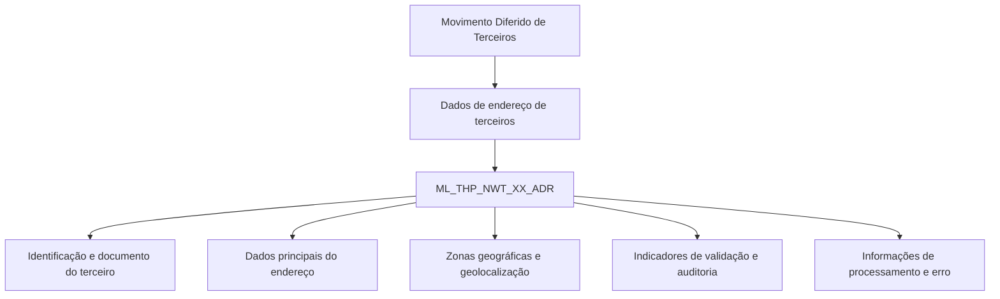

# Detalhamento de Endereços no Movimento Diferido de Terceiros — Visão Técnica Reef

## 1. Metadados do Documento
- **Arquivo de Origem:** Não identificado no conteúdo fornecido
- **Tipo de Documento:** Especificação Técnica
- **Domínio / Sistema:** Reef / Movimento Diferido de Terceiros
- **Público-Alvo:** Desenvolvedores, Arquitetos, Analistas Funcionais e Operação
- **Data/Versão Identificada:** Não identificada

---

## 2. Resumo Executivo & Contexto de Negócio

O documento descreve, em visão técnica, o detalhamento de informações de endereços associadas ao movimento diferido de terceiros no contexto Reef. O conteúdo identifica a tabela de dados envolvida na operação: `ML_THP_NWT_XX_ADR`, descrita como a tabela de buzón de direções/endereço de terceiros.

A especificação apresenta a estrutura de campos da tabela, indicando para cada coluna se o valor pode mudar, se é obrigatória e qual é sua finalidade funcional. Os campos abrangem identificação do registro, identificação e documentação do terceiro, dados de atividade, sequência e tipo de uso do endereço, composição textual do endereço, zonas geográficas, geolocalização, estado de validação e informações de processamento.

A maior parte dos campos é indicada como alterável (`S`) e com valor de motivo/valor `N.A.`. Os campos obrigatórios concentram-se em identificação, vínculo com o terceiro, dados centrais do endereço, indicadores de endereço padrão, desabilitação, comprovação e auditoria de atualização.

O documento não detalha operações de inserção, atualização, exclusão, contratos de API, serviços, métodos HTTP, regras de processamento do movimento diferido ou integração entre sistemas. A especificação disponível está limitada à estrutura de dados e à semântica declarada de suas colunas.

---

## 3. Arquitetura, Componentes & Tecnologias Envolvidas

### Componentes identificados

| Componente | Tipo | Descrição |
| :--- | :--- | :--- |
| Reef | Sistema / domínio documental | Contexto no qual a documentação está publicada. |
| Movimento Diferido de Terceiros | Processo funcional | Processo para o qual o detalhamento de endereços é apresentado. |
| `ML_THP_NWT_XX_ADR` | Tabela de dados | Tabela buzón de direções/endereço de terceiros envolvida na operação. |
| Mapfre Document | Plataforma documental mencionada | Referência apresentada no conteúdo bruto. |
| Zeus | Plataforma ou área documental mencionada | Referência apresentada na navegação do conteúdo bruto. |



> **Nota de Análise:** O documento não descreve microsserviços, APIs, bancos de dados físicos, protocolos, URLs, ambientes, tecnologias de persistência ou fluxos de integração. O diagrama representa exclusivamente a relação conceitual explícita entre o processo, os dados de endereço e a tabela identificada.

---

## 4. Regras de Negócio, Especificações Funcionais & Processos

### Estrutura funcional identificada

1. A operação técnica de detalhamento de endereços no movimento diferido de terceiros utiliza a tabela `ML_THP_NWT_XX_ADR`.
2. A tabela é classificada no documento como “TABLA BUZÓN DIRECCIONES DE TERCEROS”.
3. Todas as colunas listadas possuem indicador `CAMBIA VALOR` igual a `S`.
4. Todas as colunas listadas possuem `MOTIVO/VALOR` igual a `N.A.`.
5. Os campos obrigatórios estão marcados como `SI`; os não obrigatórios estão marcados como `NO`.
6. O vínculo do endereço com o terceiro inclui identificador, tipo de documento, documento e atividade do terceiro.
7. O endereço inclui sequência, tipo de uso, tipo de domicílio e texto do endereço.
8. O detalhamento geográfico pode incluir extensão de endereço, extensão de país, cinco zonas geográficas, latitude, longitude e subcódigo da zona quatro.
9. A estrutura contém indicadores para endereço padrão, linha desabilitada, domicílio comprovado e domicílio fiscal.
10. A estrutura também possui dados de auditoria e processamento: usuário que atualizou a linha, data de modificação, hilo, situação do processo, ação de origem, identificador interno de erro e observações.

> **Nota de Análise:** O documento não informa valores permitidos, domínios, formatos, tamanhos, chaves primárias, chaves estrangeiras, regras de unicidade, regras de cálculo, condições de erro, transições de status ou comportamento de cada indicador. Portanto, tais definições não podem ser inferidas.

---

## 5. Tabelas de Parâmetros, Ambientes e Estruturas de Dados

### Tabela principal

| Item / Parâmetro | Descrição / Função | Tipo / Valores / Formato | Ambiente / Observações |
| :--- | :--- | :--- | :--- |
| `ML_THP_NWT_XX_ADR` | Tabela buzón de direções de terceiros. | Tabela | Envolvida na operação de movimento diferido de terceiros. |

### Colunas obrigatórias

| Item / Parâmetro | Descrição / Função | Tipo / Valores / Formato | Ambiente / Observações |
| :--- | :--- | :--- | :--- |
| `BTC_IDN_VAL` | Identificador. | Não informado | Muda valor: `S`; obrigatório: `SI`; motivo/valor: `N.A.` |
| `SQN_VAL` | Sequência. | Não informado | Muda valor: `S`; obrigatório: `SI`; motivo/valor: `N.A.` |
| `CMP_VAL` | Companhia. | Não informado | Muda valor: `S`; obrigatório: `SI`; motivo/valor: `N.A.` |
| `THP_DCM_TYP_VAL` | Tipo do documento do terceiro. | Não informado | Muda valor: `S`; obrigatório: `SI`; motivo/valor: `N.A.` |
| `THP_DCM_VAL` | Documento do terceiro. | Não informado | Muda valor: `S`; obrigatório: `SI`; motivo/valor: `N.A.` |
| `THP_ACV_VAL` | Atividade do terceiro. | Não informado | Muda valor: `S`; obrigatório: `SI`; motivo/valor: `N.A.` |
| `ADR_SQN_VAL` | Sequência do endereço. | Não informado | Muda valor: `S`; obrigatório: `SI`; motivo/valor: `N.A.` |
| `VLD_DAT` | Data de validade. | Não informado | Muda valor: `S`; obrigatório: `SI`; motivo/valor: `N.A.` |
| `ADR_USE_TYP_VAL` | Tipo de uso do endereço. | Não informado | Muda valor: `S`; obrigatório: `SI`; motivo/valor: `N.A.` |
| `DML_TYP_VAL` | Tipo de domicílio. | Não informado | Muda valor: `S`; obrigatório: `SI`; motivo/valor: `N.A.` |
| `ADR_TXT_VAL` | Endereço. | Não informado | Muda valor: `S`; obrigatório: `SI`; motivo/valor: `N.A.` |
| `DFL_ADR` | Endereço padrão. | Não informado | Muda valor: `S`; obrigatório: `SI`; motivo/valor: `N.A.` |
| `DSB_ROW` | Linha desabilitada. | Não informado | Muda valor: `S`; obrigatório: `SI`; motivo/valor: `N.A.` |
| `ADR_CCK` | Domicílio comprovado. | Não informado | Muda valor: `S`; obrigatório: `SI`; motivo/valor: `N.A.` |
| `USR_VAL` | Usuário que atualizou a linha. | Não informado | Muda valor: `S`; obrigatório: `SI`; motivo/valor: `N.A.` |
| `MDF_DAT` | Data de modificação. | Não informado | Muda valor: `S`; obrigatório: `SI`; motivo/valor: `N.A.` |

### Colunas não obrigatórias

| Item / Parâmetro | Descrição / Função | Tipo / Valores / Formato | Ambiente / Observações |
| :--- | :--- | :--- | :--- |
| `IDN_THP_VAL` | Identificador do terceiro. | Não informado | Muda valor: `S`; obrigatório: `NO`; motivo/valor: `N.A.` |
| `ADR_NBR_VAL` | Número do endereço. | Não informado | Muda valor: `S`; obrigatório: `NO`; motivo/valor: `N.A.` |
| `EXT_ADR_TXT_VAL` | Extensão do endereço. | Não informado | Muda valor: `S`; obrigatório: `NO`; motivo/valor: `N.A.` |
| `EXT_CNY_TXT_VAL` | Extensão país. | Não informado | Muda valor: `S`; obrigatório: `NO`; motivo/valor: `N.A.` |
| `CNY_VAL` | Zona geográfica um. | Não informado | Muda valor: `S`; obrigatório: `NO`; motivo/valor: `N.A.` |
| `STT_VAL` | Zona geográfica dois. | Não informado | Muda valor: `S`; obrigatório: `NO`; motivo/valor: `N.A.` |
| `PVC_VAL` | Zona geográfica três. | Não informado | Muda valor: `S`; obrigatório: `NO`; motivo/valor: `N.A.` |
| `TWN_VAL` | Zona geográfica quatro. | Não informado | Muda valor: `S`; obrigatório: `NO`; motivo/valor: `N.A.` |
| `PSL_COD_VAL` | Zona geográfica cinco. | Não informado | Muda valor: `S`; obrigatório: `NO`; motivo/valor: `N.A.` |
| `LTT_VAL` | Latitude do endereço. | Não informado | Muda valor: `S`; obrigatório: `NO`; motivo/valor: `N.A.` |
| `LNT_VAL` | Longitude do endereço. | Não informado | Muda valor: `S`; obrigatório: `NO`; motivo/valor: `N.A.` |
| `PRC_THD_VAL` | Hilo. | Não informado | Muda valor: `S`; obrigatório: `NO`; motivo/valor: `N.A.` |
| `PRC_STS_VAL` | Situação do processo. | Não informado | Muda valor: `S`; obrigatório: `NO`; motivo/valor: `N.A.` |
| `ACN_ORG_VAL` | Ação de origem. | Não informado | Muda valor: `S`; obrigatório: `NO`; motivo/valor: `N.A.` |
| `ERR_IDN_VAL` | Identificador interno do erro. | Não informado | Muda valor: `S`; obrigatório: `NO`; motivo/valor: `N.A.` |
| `OBS_VAL` | Observações. | Não informado | Muda valor: `S`; obrigatório: `NO`; motivo/valor: `N.A.` |
| `DIT_VAL` | Subcódigo da zona geográfica quatro. | Não informado | Muda valor: `S`; obrigatório: `NO`; motivo/valor: `N.A.` |
| `TAX_DML` | Domicílio fiscal. | Não informado | Muda valor: `S`; obrigatório: `NO`; motivo/valor: `N.A.` |

---

## 6. Bateria de Perguntas & Respostas para RAG (FAQ Sintético)

### P1: Qual tabela é utilizada para detalhar endereços no movimento diferido de terceiros?
**R:** A tabela utilizada é `ML_THP_NWT_XX_ADR`, descrita no documento como a tabela buzón de direções de terceiros.

### P2: Quais campos identificam o terceiro associado ao endereço?
**R:** O documento lista `IDN_THP_VAL` como identificador do terceiro, `THP_DCM_TYP_VAL` como tipo do documento do terceiro, `THP_DCM_VAL` como documento do terceiro e `THP_ACV_VAL` como atividade do terceiro. Entre esses campos, `IDN_THP_VAL` não é obrigatório; os demais são obrigatórios.

### P3: Quais informações de endereço são obrigatórias na tabela `ML_THP_NWT_XX_ADR`?
**R:** São obrigatórios a sequência do endereço (`ADR_SQN_VAL`), a data de validade (`VLD_DAT`), o tipo de uso do endereço (`ADR_USE_TYP_VAL`), o tipo de domicílio (`DML_TYP_VAL`) e o texto do endereço (`ADR_TXT_VAL`). Também são obrigatórios os identificadores e atributos centrais do registro e do terceiro indicados na tabela.

### P4: O número do endereço é obrigatório?
**R:** Não. O campo `ADR_NBR_VAL`, descrito como número do endereço, está marcado como não obrigatório (`NO`).

### P5: Quais campos armazenam dados de geolocalização?
**R:** Os campos `LTT_VAL` e `LNT_VAL` armazenam, respectivamente, latitude e longitude do endereço. Ambos estão marcados como não obrigatórios.

### P6: Como a estrutura identifica o endereço padrão?
**R:** O campo `DFL_ADR` é descrito como “DIRECCION POR DEFECTO”, isto é, endereço padrão. O documento o classifica como obrigatório.

### P7: Quais campos representam as zonas geográficas do endereço?
**R:** As zonas geográficas são representadas por `CNY_VAL` para zona um, `STT_VAL` para zona dois, `PVC_VAL` para zona três, `TWN_VAL` para zona quatro e `PSL_COD_VAL` para zona cinco. O campo `DIT_VAL` representa o subcódigo da zona geográfica quatro. Todos são não obrigatórios.

### P8: Quais dados de auditoria existem na tabela de endereços?
**R:** O documento identifica `USR_VAL` como o usuário que atualizou a linha e `MDF_DAT` como a data de modificação. Ambos são obrigatórios.

### P9: Como a tabela registra que um domicílio foi comprovado?
**R:** O campo `ADR_CCK` é descrito como “DOMICILIO COMPROBADO” e está marcado como obrigatório.

### P10: Há campos para controle de erro e processamento?
**R:** Sim. A estrutura contém `PRC_THD_VAL` para hilo, `PRC_STS_VAL` para situação do processo, `ACN_ORG_VAL` para ação de origem, `ERR_IDN_VAL` para identificador interno do erro e `OBS_VAL` para observações. Todos estão marcados como não obrigatórios.

### P11: O documento define tipos de dados, tamanhos ou formatos das colunas?
**R:** Não. O documento apresenta nomes, descrições, indicador de mudança de valor, motivo/valor e obrigatoriedade, mas não apresenta tipos físicos, tamanhos, formatos ou valores permitidos.

### P12: O documento especifica APIs ou métodos HTTP para consultar os endereços?
**R:** Não. O conteúdo não descreve APIs, endpoints, métodos HTTP, contratos JSON ou integrações. A informação disponível é limitada à tabela `ML_THP_NWT_XX_ADR` e às suas colunas.

---

## 7. Glossário de Termos, Siglas & Conceitos-Chave

- **`ADR`:** Prefixo presente em campos relacionados a endereço/direção.
- **`ADR_CCK`:** Campo descrito como domicílio comprovado.
- **`ADR_SQN_VAL`:** Sequência do endereço.
- **`ADR_TXT_VAL`:** Texto do endereço.
- **`ADR_USE_TYP_VAL`:** Tipo de uso do endereço.
- **`BTC_IDN_VAL`:** Identificador.
- **`CMP_VAL`:** Companhia.
- **`DFL_ADR`:** Endereço padrão.
- **`DML_TYP_VAL`:** Tipo de domicílio.
- **`ERR_IDN_VAL`:** Identificador interno do erro.
- **`IDN_THP_VAL`:** Identificador do terceiro.
- **`LNT_VAL`:** Longitude do endereço.
- **`LTT_VAL`:** Latitude do endereço.
- **`MDF_DAT`:** Data de modificação.
- **`ML_THP_NWT_XX_ADR`:** Tabela buzón de direções de terceiros.
- **`PRC_STS_VAL`:** Situação do processo.
- **`PRC_THD_VAL`:** Hilo.
- **`TAX_DML`:** Domicílio fiscal.
- **`THP_ACV_VAL`:** Atividade do terceiro.
- **`THP_DCM_TYP_VAL`:** Tipo do documento do terceiro.
- **`THP_DCM_VAL`:** Documento do terceiro.

> **Nota de Análise:** As expansões dos acrônimos técnicos não são apresentadas no documento. As definições acima preservam estritamente as descrições textuais fornecidas.

---

## 8. Notas Críticas, Riscos & Limitações

- O documento não identifica o arquivo de origem, a data, a versão ou o autor técnico do conteúdo.
- O conteúdo menciona “Owner `user:agonzalez_mapfre.com`” no trecho bruto, mas não define responsabilidade funcional, técnica ou operacional associada.
- Não há especificação de tipos de dados, tamanhos, nulabilidade física, índices, chaves, relacionamentos ou constraints da tabela.
- Não há detalhamento de valores válidos para os campos, inclusive indicadores como `DFL_ADR`, `DSB_ROW`, `ADR_CCK` e `TAX_DML`.
- Não há descrição de mecanismo de processamento, semântica dos status, política de retentativa, gestão de falhas ou tratamento do campo `ERR_IDN_VAL`.
- Não há documentação de APIs, microsserviços, endpoints, URLs, ambientes, logs, permissões ou procedimentos operacionais.
- **Risco de interpretação:** termos como “hilo”, “situação do processo” e “ação origem” são apresentados sem definição operacional adicional.
- **Risco de implementação:** utilizar os campos sem consultar a fonte de dados ou documentação complementar pode resultar em suposições incorretas sobre formatos, domínios e regras de validação.

---

## 9. Conteúdo Bruto Estruturado (Referência Fiel)

```text
--- [PÁGINA 1 DE 2] ---

DETALLAR Información de las Direcciones en el Movimiento Diferido
del Tercero (Visión Técnica)
Modelo de datos involucrado
La tabla que interviene en esta operación es:
TABLA DESCRIPCIÓN
ML_THP_NWT_XX_ADR TABLA BUZÓN DIRECCIONES DE TERCEROS
COLUMNA CAMBIA VALOR MOTIVO/VALOR OBLIGATORIA COMENTARIO
BTC_IDN_VAL S N.A. SI IDENTIFICADOR
SQN_VAL S N.A. SI SECUENCIA
CMP_VAL S N.A. SI COMPANIA
THP_DCM_TYP_VAL S N.A. SI TIPO DEL DOCUMENTO DEL TERCERO
THP_DCM_VAL S N.A. SI DOCUMENTO DEL TERCERO
THP_ACV_VAL S N.A. SI ACTIVIDAD TERCERO
ADR_SQN_VAL S N.A. SI SECUENCIA DE LA DIRECCION
VLD_DAT S N.A. SI FECHA VALIDEZ
IDN_THP_VAL S N.A. NO IDENTIFICADOR TERCERO
ADR_USE_TYP_VAL S N.A. SI TIPO USO DIRECCION
DML_TYP_VAL S N.A. SI TIPO DOMICILIO
ADR_TXT_VAL S N.A. SI DIRECCION
Documentation / DOCUMENTACIÓN Reef
DOCUMENTACIÓN Reef
Mapfredocument
DOCUMENTACIÓN Reef
Owner
user:agonzalez_mapfre.com
Lifecycle
Approved Source
 / 
 VL
Buscar Inicio Soluciones Arquitecturas APIs Componentes Cloud Documentación Zeus Reef Ayuda
ES


--- [PÁGINA 2 DE 2] ---

COLUMNA CAMBIA VALOR MOTIVO/VALOR OBLIGATORIA COMENTARIO
ADR_NBR_VAL S N.A. NO NUMERO DE LA DIRECCION
EXT_ADR_TXT_VAL S N.A. NO EXTENSION DIRECCION
EXT_CNY_TXT_VAL S N.A. NO EXTENSION PAIS
CNY_VAL S N.A. NO ZONA UNO GEOGRAFICA
STT_VAL S N.A. NO ZONA DOS GEOGRAFICA
PVC_VAL S N.A. NO ZONA TRES GEOGRAFICA
TWN_VAL S N.A. NO ZONA CUATRO GEOGRAFICA
PSL_COD_VAL S N.A. NO ZONA CINCO GEOGRAFICA
LTT_VAL S N.A. NO LATITUD DE LA DIRECCION
LNT_VAL S N.A. NO LONGITUD DE LA DIRECCION
DFL_ADR S N.A. SI DIRECCION POR DEFECTO
DSB_ROW S N.A. SI FILA DESHABILITADA
ADR_CCK S N.A. SI DOMICILIO COMPROBADO
USR_VAL S N.A. SI USUARIO QUE ACTUALIZO LA FILA
MDF_DAT S N.A. SI FECHA MODIFICACION
PRC_THD_VAL S N.A. NO HILO
PRC_STS_VAL S N.A. NO SITUACION DEL PROCESO
ACN_ORG_VAL S N.A. NO ACCION ORIGEN
ERR_IDN_VAL S N.A. NO IDENTIFICADOR INTERNO DEL ERROR
OBS_VAL S N.A. NO OBSERVACIONES
DIT_VAL S N.A. NO SUBCODIGO ZONA CUATRO GEOGRAFICA
TAX_DML S N.A. NO DOMICILIO FISCAL
```
