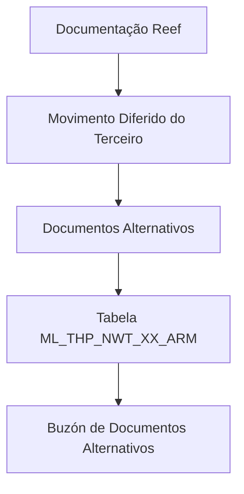

# Documentação Reef — Documentos Alternativos no Movimento Diferido do Terceiro (Visão Técnica)

## 1. Metadados do Documento
- **Arquivo de Origem:** Não identificado no conteúdo fornecido
- **Tipo de Documento:** Especificação Técnica
- **Domínio / Sistema:** Reef / Mapfre — Movimento Diferido do Terceiro
- **Público-Alvo:** Desenvolvedores, Arquitetos, Operação e Analistas Funcionais
- **Data/Versão Identificada:** Não identificada
- **Owner identificado:** `user:agonzalez_mapfre.com`
- **Lifecycle identificado:** Approved

---

## 2. Resumo Executivo & Contexto de Negócio

O documento descreve a visão técnica para detalhar informações de documentos alternativos no movimento diferido do terceiro. O foco apresentado é o modelo de dados envolvido nessa operação, especificamente a tabela de buzón de documentos alternativos.

A tabela identificada é `ML_THP_NWT_XX_ARM`, descrita como “TABLA BUZON DOCUMENTOS ALTERNATIVOS”. O conteúdo lista as colunas da tabela, a indicação extraída de mudança de valor, obrigatoriedade e o comentário funcional de cada atributo.

Os campos abrangem a identificação do registro, sequência, companhia, dados do documento principal do terceiro, dados do documento alternativo, validação, situação de processamento, auditoria de alteração, dados de comprovação e informações de erro.

O documento não descreve fluxos de execução, contratos HTTP, APIs, processos de integração, regras de persistência, tipos físicos das colunas ou valores permitidos além dos valores extraídos `S` e `N.A.`. Portanto, a especificação deve ser usada como referência de estrutura e semântica dos campos apresentados, sem inferir comportamentos adicionais.

---

## 3. Arquitetura, Componentes & Tecnologias Envolvidas

| Componente / Elemento | Descrição sustentada pelo documento |
| :--- | :--- |
| Reef | Área de documentação identificada como “DOCUMENTACIÓN Reef” e “Documentation / DOCUMENTACIÓN Reef”. |
| Mapfre | Contexto corporativo indicado pela referência “Mapfredocument” e pelo identificador de owner com domínio `mapfre.com`. |
| Movimento Diferido do Terceiro | Processo ou contexto funcional no qual são detalhados documentos alternativos. |
| `ML_THP_NWT_XX_ARM` | Tabela envolvida na operação; descrita como tabela de buzón de documentos alternativos. |
| Owner | `user:agonzalez_mapfre.com`. |
| Lifecycle | `Approved`. |



> **Nota de Análise:** O conteúdo não detalha arquitetura de aplicações, microsserviços, APIs, protocolos, integrações, ambientes, tecnologias de banco de dados ou fluxo de processamento entre componentes. O diagrama representa exclusivamente a relação documental e de dados explicitamente apresentada.

---

## 4. Regras de Negócio, Especificações Funcionais & Processos

### 4.1 Escopo funcional identificado

A operação documentada refere-se ao detalhamento de documentos alternativos no movimento diferido do terceiro. A estrutura de dados associada a essa operação é a tabela `ML_THP_NWT_XX_ARM`.

### 4.2 Obrigatoriedade identificada

Os campos marcados como obrigatórios (`SI`) no conteúdo extraído são:

- `BTC_IDN_VAL` — identificador.
- `SQN_VAL` — sequência.
- `CMP_VAL` — companhia.
- `THP_DCM_TYP_VAL` — tipo do documento do terceiro.
- `THP_DCM_VAL` — documento do terceiro.
- `THP_ACV_VAL` — atividade do terceiro.
- `ALR_THP_DCM_TYP_VAL` — tipo do documento do terceiro alternativo.
- `ALR_THP_DCM_VAL` — documento alternativo.
- `VLD_DAT` — data de validade.
- `DSB_ROW` — linha desabilitada.
- `USR_VAL` — usuário que atualizou a linha.
- `MDF_DAT` — data de modificação.
- `ALR_THP_DCM_CCK` — marca de documento alternativo comprovado.

### 4.3 Campos não obrigatórios identificados

Os campos marcados como não obrigatórios (`NO`) no conteúdo extraído são:

- `PRC_THD_VAL` — hilo.
- `PRC_STS_VAL` — situação do processo.
- `ALR_THP_DCM_ISU_DAT` — data de emissão do documento alternativo.
- `ALR_THP_DCM_EXY_DAT` — data de caducidade do documento alternativo.
- `ALR_THP_DCM_CNY_VAL` — país emissor do documento alternativo.
- `ALR_THP_DCM_CCK_DAT` — data de comprovação do documento alternativo.
- `ALR_THP_DCM_OBS_CCK_MTH` — observações de comprovação do documento alternativo.
- `ACN_ORG_VAL` — ação origem.
- `ERR_IDN_VAL` — identificador interno do erro.

> **Nota de Análise:** O documento não explica o significado operacional da coluna “CAMBIA VALOR”, embora todos os registros extraídos apresentem `S`. Também não define o significado do valor `N.A.` na coluna “MOTIVO/VALOR”. Esses valores foram preservados sem interpretação adicional.

---

## 5. Tabelas de Parâmetros, Ambientes e Estruturas de Dados

### 5.1 Tabela envolvida

| Item / Parâmetro | Descrição / Função | Tipo / Valores / Formato | Ambiente / Observações |
| :--- | :--- | :--- | :--- |
| `ML_THP_NWT_XX_ARM` | Tabela buzón de documentos alternativos. | Não informado. | Tabela envolvida na operação de documentos alternativos no movimento diferido do terceiro. |

### 5.2 Estrutura de campos — Página 1

| Item / Parâmetro | Descrição / Função | Tipo / Valores / Formato | Ambiente / Observações |
| :--- | :--- | :--- | :--- |
| `BTC_IDN_VAL` | Identificador. | Cambia valor: `S`; Motivo/Valor: `N.A.` | Obrigatória: `SI`. |
| `SQN_VAL` | Sequência. | Cambia valor: `S`; Motivo/Valor: `N.A.` | Obrigatória: `SI`. |
| `CMP_VAL` | Companhia. | Cambia valor: `S`; Motivo/Valor: `N.A.` | Obrigatória: `SI`. |
| `THP_DCM_TYP_VAL` | Tipo do documento do terceiro. | Cambia valor: `S`; Motivo/Valor: `N.A.` | Obrigatória: `SI`. |
| `THP_DCM_VAL` | Documento do terceiro. | Cambia valor: `S`; Motivo/Valor: `N.A.` | Obrigatória: `SI`. |
| `THP_ACV_VAL` | Atividade do terceiro. | Cambia valor: `S`; Motivo/Valor: `N.A.` | Obrigatória: `SI`. |
| `ALR_THP_DCM_TYP_VAL` | Tipo do documento do terceiro alternativo. | Cambia valor: `S`; Motivo/Valor: `N.A.` | Obrigatória: `SI`. |
| `ALR_THP_DCM_VAL` | Documento alternativo. | Cambia valor: `S`; Motivo/Valor: `N.A.` | Obrigatória: `SI`. |
| `VLD_DAT` | Data de validade. | Cambia valor: `S`; Motivo/Valor: `N.A.` | Obrigatória: `SI`. |
| `PRC_THD_VAL` | Hilo. | Cambia valor: `S`; Motivo/Valor: `N.A.` | Obrigatória: `NO`. |
| `PRC_STS_VAL` | Situação do processo. | Cambia valor: `S`; Motivo/Valor: `N.A.` | Obrigatória: `NO`. |

### 5.3 Estrutura de campos — Página 2

| Item / Parâmetro | Descrição / Função | Tipo / Valores / Formato | Ambiente / Observações |
| :--- | :--- | :--- | :--- |
| `DSB_ROW` | Fila desabilitada. | Cambia valor: `S`; Motivo/Valor: `N.A.` | Obrigatória: `SI`. |
| `USR_VAL` | Usuário que atualizou a fila. | Cambia valor: `S`; Motivo/Valor: `N.A.` | Obrigatória: `SI`. |
| `MDF_DAT` | Data de modificação. | Cambia valor: `S`; Motivo/Valor: `N.A.` | Obrigatória: `SI`. |
| `ALR_THP_DCM_ISU_DAT` | Data de emissão do documento alternativo. | Cambia valor: `S`; Motivo/Valor: `N.A.` | Obrigatória: `NO`. |
| `ALR_THP_DCM_EXY_DAT` | Data de caducidade do documento alternativo. | Cambia valor: `S`; Motivo/Valor: `N.A.` | Obrigatória: `NO`. |
| `ALR_THP_DCM_CNY_VAL` | País emissor do documento alternativo. | Cambia valor: `S`; Motivo/Valor: `N.A.` | Obrigatória: `NO`. |
| `ALR_THP_DCM_CCK` | Marca de documento alternativo comprovado. | Cambia valor: `S`; Motivo/Valor: `N.A.` | Obrigatória: `SI`. |
| `ALR_THP_DCM_CCK_DAT` | Data de comprovação do documento alternativo. | Cambia valor: `S`; Motivo/Valor: `N.A.` | Obrigatória: `NO`. |
| `ALR_THP_DCM_OBS_CCK_MTH` | Observações de comprovação do documento alternativo. | Cambia valor: `S`; Motivo/Valor: `N.A.` | Obrigatória: `NO`. |
| `ACN_ORG_VAL` | Ação origem. | Cambia valor: `S`; Motivo/Valor: `N.A.` | Obrigatória: `NO`. |
| `ERR_IDN_VAL` | Identificador interno do erro. | Cambia valor: `S`; Motivo/Valor: `N.A.` | Obrigatória: `NO`. |

---

## 6. Bateria de Perguntas & Respostas para RAG (FAQ Sintético)

### P1: Qual tabela armazena os documentos alternativos no contexto do movimento diferido do terceiro?
**R:** A tabela identificada no documento é `ML_THP_NWT_XX_ARM`, descrita como “TABLA BUZON DOCUMENTOS ALTERNATIVOS”.

### P2: Qual é o campo identificador do registro de documento alternativo?
**R:** O campo `BTC_IDN_VAL` é descrito como “IDENTIFICADOR” e está marcado como obrigatório (`SI`).

### P3: Quais campos representam o documento original do terceiro?
**R:** Os campos são `THP_DCM_TYP_VAL`, descrito como tipo do documento do terceiro, e `THP_DCM_VAL`, descrito como documento do terceiro. Ambos são obrigatórios (`SI`).

### P4: Quais campos registram o tipo e o valor do documento alternativo?
**R:** `ALR_THP_DCM_TYP_VAL` representa o tipo do documento do terceiro alternativo e `ALR_THP_DCM_VAL` representa o documento alternativo. Os dois campos são obrigatórios (`SI`).

### P5: O documento alternativo exige data de emissão e data de caducidade?
**R:** Não. `ALR_THP_DCM_ISU_DAT`, correspondente à data de emissão, e `ALR_THP_DCM_EXY_DAT`, correspondente à data de caducidade, estão marcados como não obrigatórios (`NO`).

### P6: Como o documento indica que um documento alternativo foi comprovado?
**R:** O campo `ALR_THP_DCM_CCK` é descrito como a marca de documento alternativo comprovado e é obrigatório (`SI`). A data da comprovação pode ser registrada em `ALR_THP_DCM_CCK_DAT`, que não é obrigatória.

### P7: Qual campo contém as observações da comprovação do documento alternativo?
**R:** O campo `ALR_THP_DCM_OBS_CCK_MTH` contém as observações de comprovação do documento alternativo. O campo está marcado como não obrigatório (`NO`).

### P8: Quais campos permitem rastrear a atualização de uma linha da tabela?
**R:** `USR_VAL` registra o usuário que atualizou a fila e `MDF_DAT` registra a data de modificação. Ambos são obrigatórios (`SI`). O campo `DSB_ROW`, descrito como fila desabilitada, também é obrigatório.

### P9: Onde é registrada a situação do processo?
**R:** A situação do processo é registrada em `PRC_STS_VAL`. O documento marca esse campo como não obrigatório (`NO`).

### P10: Como é registrado um erro relacionado ao documento alternativo?
**R:** O campo `ERR_IDN_VAL` é descrito como identificador interno do erro. O documento o classifica como não obrigatório (`NO`).

### P11: O documento informa tipos físicos, tamanhos ou restrições de banco de dados para as colunas?
**R:** Não. O conteúdo apresenta nomes de colunas, descrição, indicação de “Cambia valor”, “Motivo/Valor” e obrigatoriedade, mas não informa tipos físicos, tamanhos, chaves, índices ou restrições de integridade.

### P12: O documento especifica APIs ou contratos de integração para a tabela `ML_THP_NWT_XX_ARM`?
**R:** Não. O documento apresenta exclusivamente a tabela e os campos envolvidos; não detalha APIs, métodos HTTP, contratos JSON, serviços, fluxos de integração ou operações de persistência.

---

## 7. Glossário de Termos, Siglas & Conceitos-Chave

- **Reef:** Nome presente na área de documentação identificada como “DOCUMENTACIÓN Reef”.
- **Mapfre:** Referência corporativa presente em “Mapfredocument” e no domínio do owner identificado.
- **Movimento Diferido do Terceiro:** Contexto funcional mencionado no título da visão técnica.
- **Documento Alternativo:** Documento cujos dados são registrados na tabela `ML_THP_NWT_XX_ARM`.
- **Buzón:** Termo utilizado na descrição da tabela: “TABLA BUZON DOCUMENTOS ALTERNATIVOS”.
- **`BTC_IDN_VAL`:** Identificador.
- **`SQN_VAL`:** Sequência.
- **`CMP_VAL`:** Companhia.
- **`THP_DCM_TYP_VAL`:** Tipo do documento do terceiro.
- **`THP_DCM_VAL`:** Documento do terceiro.
- **`THP_ACV_VAL`:** Atividade do terceiro.
- **`ALR_THP_DCM_TYP_VAL`:** Tipo do documento do terceiro alternativo.
- **`ALR_THP_DCM_VAL`:** Documento alternativo.
- **`VLD_DAT`:** Data de validade.
- **`PRC_THD_VAL`:** Hilo.
- **`PRC_STS_VAL`:** Situação do processo.
- **`DSB_ROW`:** Fila desabilitada.
- **`USR_VAL`:** Usuário que atualizou a fila.
- **`MDF_DAT`:** Data de modificação.
- **`ALR_THP_DCM_ISU_DAT`:** Data de emissão do documento alternativo.
- **`ALR_THP_DCM_EXY_DAT`:** Data de caducidade do documento alternativo.
- **`ALR_THP_DCM_CNY_VAL`:** País emissor do documento alternativo.
- **`ALR_THP_DCM_CCK`:** Marca de documento alternativo comprovado.
- **`ALR_THP_DCM_CCK_DAT`:** Data de comprovação do documento alternativo.
- **`ALR_THP_DCM_OBS_CCK_MTH`:** Observações de comprovação do documento alternativo.
- **`ACN_ORG_VAL`:** Ação origem.
- **`ERR_IDN_VAL`:** Identificador interno do erro.

---

## 8. Notas Críticas, Riscos & Limitações

- O documento não identifica o arquivo de origem, data, versão, autor técnico ou histórico de alterações.
- Não há definição explícita para os valores `S` e `N.A.` apresentados nas colunas “CAMBIA VALOR” e “MOTIVO/VALOR”.
- Não foram fornecidos tipos de dados físicos, tamanhos, valores de domínio, chaves primárias, chaves estrangeiras, índices ou regras de integridade da tabela.
- O documento não detalha operações de inserção, atualização, exclusão, consulta, tratamento de erro ou comportamento associado a `ERR_IDN_VAL`.
- Não há descrição de APIs, contratos JSON, métodos HTTP, microsserviços, filas, jobs, logs, URLs, servidores ou ambientes.
- Não há detalhamento adicional sobre o significado técnico ou de negócio de `THP`, `ALR`, `PRC`, `ACN`, `CCK`, `MTH`, `BTC`, `SQN` e `CMP`; as denominações foram mantidas conforme a extração.

---

## 9. Conteúdo Bruto Estruturado (Referência Fiel)

```text
--- [PÁGINA 1 DE 2] ---

DETALLAR Información de los Documentos Alternativos en el
Movimiento Diferido del Tercero (Visión Técnica)
Modelo de datos involucrado
La tabla que interviene en esta operación es:
TABLA DESCRIPCIÓN
ML_THP_NWT_XX_ARM TABLA BUZON DOCUMENTOS ALTERNATIVOS
COLUMNA CAMBIA
VALOR
MOTIVO/VALOR OBLIGATORIA COMENTARIO
BTC_IDN_VAL S N.A. SI IDENTIFICADOR
SQN_VAL S N.A. SI SECUENCIA
CMP_VAL S N.A. SI COMPANIA
THP_DCM_TYP_VAL S N.A. SI TIPO DEL DOCUMENTO DEL TERCERO
THP_DCM_VAL S N.A. SI DOCUMENTO DEL TERCERO
THP_ACV_VAL S N.A. SI ACTIVIDAD TERCERO
ALR_THP_DCM_TYP_VAL S N.A. SI TIPO DEL DOCUMENTO DEL TERCERO
ALTERNATIVO
ALR_THP_DCM_VAL S N.A. SI DOCUMENTO ALTERNATIVO
VLD_DAT S N.A. SI FECHA VALIDEZ
PRC_THD_VAL S N.A. NO HILO
PRC_STS_VAL S N.A. NO SITUACION DEL PROCESO
Documentation / DOCUMENTACIÓN Reef
DOCUMENTACIÓN Reef
Mapfredocument
DOCUMENTACIÓN Reef
Owner
user:agonzalez_mapfre.com
Lifecycle
Approved Source
 / 
 VL
Buscar Inicio Soluciones Arquitecturas APIs Componentes Cloud Documentación Zeus Reef Ayuda
ES

--- [PÁGINA 2 DE 2] ---

COLUMNA CAMBIA
VALOR
MOTIVO/VALOR OBLIGATORIA COMENTARIO
DSB_ROW S N.A. SI FILA DESHABILITADA
USR_VAL S N.A. SI USUARIO QUE ACTUALIZO LA FILA
MDF_DAT S N.A. SI FECHA MODIFICACION
ALR_THP_DCM_ISU_DAT S N.A. NO FECHA DE EMISION DEL DOCUMENTO
ALTERNATIVO
ALR_THP_DCM_EXY_DAT S N.A. NO FECHA DE CADUCIDAD DEL
DOCUMENTO ALTERNATIVO
ALR_THP_DCM_CNY_VAL S N.A. NO PAIS EMISOR DEL DOCUMENTO
ALTERNATIVO
ALR_THP_DCM_CCK S N.A. SI MARCA DE DOCUMENTO
ALTERNATIVO COMPROBADO
ALR_THP_DCM_CCK_DAT S N.A. NO FECHA DE COMPROBACION DEL
DOCUMENTO ALTERNATIVO
ALR_THP_DCM_OBS_CCK_MTH S N.A. NO OBSERVACIONES DE
COMPROBACION DEL DOCUMENTO
ALTERNATIVO
ACN_ORG_VAL S N.A. NO ACCION ORIGEN
ERR_IDN_VAL S N.A. NO IDENTIFICADOR INTERNO DEL ERROR
```
